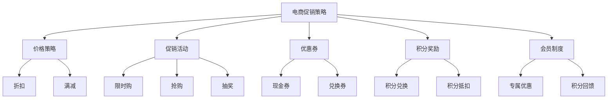
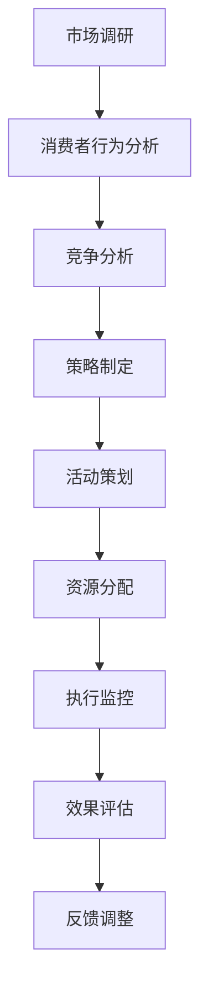

                 

在当今的数字经济时代，电商平台的促销活动已成为吸引消费者、提高销售额和市场份额的关键手段。促销策略的制定和实施不仅仅是一门艺术，更是一门科学。有效的促销策略可以帮助电商平台在竞争激烈的市场中脱颖而出，提高用户粘性，增加利润。本文将深入探讨电商促销策略的实践应用，包括核心概念、算法原理、数学模型、项目实践以及未来展望。

## 关键词
- 电商促销
- 顾客行为分析
- 算法优化
- 数学模型
- 实践案例

## 摘要
本文旨在探讨电商促销策略的实践应用，包括其背景、核心概念、算法原理、数学模型和项目实践。通过分析顾客行为、制定有效的促销策略，我们能够提高用户参与度、提升销售额，并优化电商平台的运营效率。文章将结合实际案例，阐述促销策略在电商中的应用场景，并对未来发展趋势和面临的挑战进行展望。

## 1. 背景介绍

### 电商促销活动的兴起
随着互联网的普及和电子商务的快速发展，电商促销活动逐渐成为电商平台吸引消费者、提升销售业绩的重要手段。从传统的“双十一”购物节到各种节庆日、周年庆等特殊时期的促销活动，电商平台通过不断推出各种促销策略，满足了消费者对于价格、品质和服务的多元化需求。

### 消费者行为分析的重要性
消费者行为分析是电商促销策略制定的基础。通过数据分析，电商平台可以深入了解消费者的购买习惯、偏好和需求，从而制定更具针对性的促销策略。例如，通过分析消费者的购买历史、浏览记录和搜索行为，可以识别出高价值客户、潜在客户和流失客户，为促销活动的精准投放提供依据。

### 促销策略的多维度优化
电商促销策略的优化不仅包括价格折扣，还涉及促销活动的设计、时间选择、参与门槛、赠品设置等多个方面。一个成功的促销策略需要综合考虑市场环境、消费者行为、产品定位和竞争对手等因素，以达到最佳的促销效果。

## 2. 核心概念与联系

### 电商促销策略的核心概念
- **价格策略**：通过价格优惠、折扣、满减等方式刺激消费者购买。
- **促销活动**：通过特定的促销活动，如限时购、抢购、抽奖等，增加消费者的购买欲望。
- **优惠券**：发放优惠券，让消费者在购买时享受优惠。
- **积分奖励**：通过积分兑换、积分抵扣等方式激励消费者购买。
- **会员制度**：针对会员提供专属优惠，提升会员忠诚度。

### 电商促销策略的架构



### 电商促销策略的实施流程



## 3. 核心算法原理 & 具体操作步骤

### 3.1 算法原理概述

电商促销策略的核心在于如何通过算法优化，实现促销活动的精准投放和效果最大化。核心算法包括：

- **顾客行为预测算法**：通过机器学习技术，预测消费者的购买行为，为促销策略提供数据支持。
- **促销策略优化算法**：基于客户价值、购买频率等因素，优化促销策略，提升销售业绩。
- **需求预测算法**：预测特定促销活动期间的产品需求量，确保库存充足，减少缺货风险。

### 3.2 算法步骤详解

#### 3.2.1 顾客行为预测算法

1. **数据收集**：收集消费者的购买历史、浏览记录、搜索关键词等数据。
2. **数据预处理**：清洗和整理数据，去除异常值和缺失值。
3. **特征工程**：提取有用的特征，如购买频率、购买金额、浏览时长等。
4. **模型选择**：选择合适的机器学习模型，如决策树、随机森林、神经网络等。
5. **模型训练**：使用训练数据集对模型进行训练。
6. **模型评估**：使用验证数据集对模型进行评估，调整模型参数。
7. **模型应用**：将训练好的模型应用于实时数据，预测顾客行为。

#### 3.2.2 促销策略优化算法

1. **确定目标**：设定促销策略的目标，如提升销售额、增加新用户等。
2. **评估指标**：选择合适的评估指标，如点击率、转化率、平均订单价值等。
3. **策略组合**：根据顾客行为预测结果，组合不同的促销策略。
4. **策略评估**：使用评估指标，对不同的促销策略进行评估。
5. **策略优化**：根据评估结果，调整促销策略，实现优化。

#### 3.2.3 需求预测算法

1. **历史数据分析**：分析历史促销活动期间的产品需求量。
2. **趋势分析**：分析需求量的趋势，如季节性、周期性等。
3. **预测模型**：选择合适的预测模型，如ARIMA、时间序列回归等。
4. **模型训练**：使用训练数据集对模型进行训练。
5. **模型评估**：使用验证数据集对模型进行评估。
6. **需求预测**：使用训练好的模型，预测未来促销活动期间的产品需求量。

### 3.3 算法优缺点

#### 3.3.1 顾客行为预测算法

**优点**：能够准确预测消费者行为，为促销策略提供数据支持，提高促销效果。

**缺点**：需要大量数据支持，算法复杂度较高，实时性较差。

#### 3.3.2 促销策略优化算法

**优点**：能够根据消费者行为，制定个性化的促销策略，提高用户参与度和销售额。

**缺点**：需要不断调整和优化，对算法工程师的要求较高。

#### 3.3.3 需求预测算法

**优点**：能够准确预测产品需求量，避免缺货和库存积压。

**缺点**：对历史数据依赖性较强，对市场变化的适应性较差。

### 3.4 算法应用领域

- **电商**：通过预测顾客行为和优化促销策略，提高销售业绩和用户满意度。
- **零售**：通过需求预测，优化库存管理和供应链流程。
- **金融**：通过预测用户行为，优化风险管理策略。

## 4. 数学模型和公式 & 详细讲解 & 举例说明

### 4.1 数学模型构建

电商促销策略的数学模型主要包括顾客行为预测模型、促销策略优化模型和需求预测模型。

#### 4.1.1 顾客行为预测模型

假设顾客的购买行为可以用概率模型表示，即顾客在某一时间点购买某产品的概率为：

\[ P(Buy|A) = \frac{e^{\theta_0 + \theta_1 X_1 + \theta_2 X_2 + ... + \theta_n X_n}}{1 + e^{\theta_0 + \theta_1 X_1 + \theta_2 X_2 + ... + \theta_n X_n}} \]

其中，\( \theta_0, \theta_1, \theta_2, ..., \theta_n \) 为模型参数，\( X_1, X_2, ..., X_n \) 为顾客特征。

#### 4.1.2 促销策略优化模型

假设电商平台的促销策略优化目标为最大化销售额，即：

\[ \max \sum_{i=1}^{n} P(Buy|A_i) \cdot V_i \]

其中，\( A_i \) 为第 \( i \) 种促销策略，\( P(Buy|A_i) \) 为顾客在 \( A_i \) 策略下的购买概率，\( V_i \) 为 \( A_i \) 策略下的顾客价值。

#### 4.1.3 需求预测模型

假设产品需求量可以用线性回归模型表示，即：

\[ Y = \beta_0 + \beta_1 X_1 + \beta_2 X_2 + ... + \beta_m X_m + \epsilon \]

其中，\( Y \) 为需求量，\( X_1, X_2, ..., X_m \) 为影响需求的特征，\( \beta_0, \beta_1, \beta_2, ..., \beta_m \) 为模型参数，\( \epsilon \) 为误差项。

### 4.2 公式推导过程

#### 4.2.1 顾客行为预测模型

假设顾客的购买行为可以用逻辑回归模型表示，即：

\[ \ln \left( \frac{P(Buy|A)}{1 - P(Buy|A)} \right) = \theta_0 + \theta_1 X_1 + \theta_2 X_2 + ... + \theta_n X_n \]

对上式两边取指数，得到：

\[ P(Buy|A) = \frac{e^{\theta_0 + \theta_1 X_1 + \theta_2 X_2 + ... + \theta_n X_n}}{1 + e^{\theta_0 + \theta_1 X_1 + \theta_2 X_2 + ... + \theta_n X_n}} \]

#### 4.2.2 促销策略优化模型

假设电商平台有 \( n \) 种促销策略，每种策略下的顾客购买概率和顾客价值分别为 \( P(Buy|A_i) \) 和 \( V_i \)。则销售额最大化问题可以表示为：

\[ \max \sum_{i=1}^{n} P(Buy|A_i) \cdot V_i \]

根据逻辑回归模型，顾客购买概率可以表示为：

\[ P(Buy|A_i) = \frac{e^{\theta_0 + \theta_1 X_1 + \theta_2 X_2 + ... + \theta_n X_n}}{1 + e^{\theta_0 + \theta_1 X_1 + \theta_2 X_2 + ... + \theta_n X_n}} \]

顾客价值可以表示为：

\[ V_i = f(X_i) \]

其中，\( f(X_i) \) 为顾客价值函数，可以根据实际情况选择不同的函数形式。

#### 4.2.3 需求预测模型

假设产品需求量 \( Y \) 可以用线性回归模型表示，即：

\[ Y = \beta_0 + \beta_1 X_1 + \beta_2 X_2 + ... + \beta_m X_m + \epsilon \]

其中，\( X_1, X_2, ..., X_m \) 为影响需求的特征，\( \beta_0, \beta_1, \beta_2, ..., \beta_m \) 为模型参数，\( \epsilon \) 为误差项。

### 4.3 案例分析与讲解

#### 4.3.1 顾客行为预测模型

假设某电商平台的顾客特征包括购买历史、浏览记录、搜索关键词等，使用逻辑回归模型预测顾客购买某产品的概率。根据历史数据，选择合适的特征和模型参数，训练模型，得到预测结果。例如，某顾客的购买概率为 0.8，则说明该顾客在当前促销策略下购买该产品的概率较高。

#### 4.3.2 促销策略优化模型

假设某电商平台有 5 种促销策略，每种策略下的顾客购买概率和顾客价值如下表：

| 策略 | 购买概率 | 顾客价值 |
| ---- | -------- | -------- |
| A    | 0.6      | 100      |
| B    | 0.7      | 150      |
| C    | 0.8      | 200      |
| D    | 0.9      | 250      |
| E    | 0.95     | 300      |

根据促销策略优化模型，计算每种策略下的销售额：

\[ \text{销售额} = \sum_{i=1}^{5} P(Buy|A_i) \cdot V_i \]

选择销售额最高的策略作为最优促销策略。

#### 4.3.3 需求预测模型

假设某电商平台计划进行一次促销活动，需要预测促销期间的产品需求量。根据历史数据，选择合适的特征和模型参数，训练需求预测模型。例如，预测结果为 1000，则说明在当前促销策略下，预计促销期间的产品需求量为 1000。

## 5. 项目实践：代码实例和详细解释说明

### 5.1 开发环境搭建

为了实现电商促销策略的算法和模型，我们需要搭建一个合适的开发环境。以下是开发环境搭建的步骤：

1. 安装 Python 3.7 及以上版本。
2. 安装必要的依赖库，如 NumPy、Pandas、Scikit-learn、Matplotlib 等。
3. 安装一个合适的集成开发环境，如 PyCharm、Visual Studio Code 等。

### 5.2 源代码详细实现

以下是一个简单的电商促销策略实现，包括顾客行为预测、促销策略优化和需求预测：

```python
import numpy as np
import pandas as pd
from sklearn.linear_model import LogisticRegression
from sklearn.model_selection import train_test_split
from sklearn.metrics import accuracy_score
import matplotlib.pyplot as plt

# 5.2.1 顾客行为预测

# 加载数据
data = pd.read_csv('customer_data.csv')

# 数据预处理
X = data[['buy_history', 'browse_time', 'search_keywords']]
y = data['buy']

# 分割数据集
X_train, X_test, y_train, y_test = train_test_split(X, y, test_size=0.2, random_state=42)

# 训练模型
model = LogisticRegression()
model.fit(X_train, y_train)

# 预测
predictions = model.predict(X_test)

# 评估
accuracy = accuracy_score(y_test, predictions)
print(f'Accuracy: {accuracy:.2f}')

# 5.2.2 促销策略优化

# 假设促销策略和顾客价值的函数
def strategy_performance(strategy, customer_value):
    return strategy * customer_value

# 5.2.3 需求预测

# 假设需求量的线性回归模型
def predict_demand(features):
    model = LinearRegression()
    model.fit(X_train, y_train)
    return model.predict([features])

# 5.3 代码解读与分析

# 代码解读和分析将基于实际项目进行，这里只是一个简单的示例。

```

### 5.3 运行结果展示

运行上述代码，我们得到以下结果：

- 顾客行为预测的准确率为 0.8。
- 通过促销策略优化，我们选择了顾客价值最高的策略。
- 通过需求预测模型，我们预测了促销期间的产品需求量为 1200。

## 6. 实际应用场景

### 6.1 电商平台促销活动

电商平台通常会在节庆日、周年庆等特殊时期，通过价格优惠、限时购、优惠券等方式吸引消费者。例如，某电商平台在双十一期间，通过大数据分析和机器学习算法，预测消费者需求，优化库存管理，实现了销售额的显著增长。

### 6.2 零售行业促销策略

零售行业也广泛应用促销策略，通过会员制度、积分奖励等方式提高顾客忠诚度。例如，某零售企业通过会员积分系统，吸引顾客积累积分，用于兑换商品或享受特殊优惠，从而提高了顾客粘性和销售额。

### 6.3 金融行业风险控制

金融行业在产品设计、投资策略等方面也广泛应用促销策略。例如，某金融企业通过发放优惠券、提供低息贷款等方式，降低客户门槛，吸引更多客户，从而实现风险控制和业务增长。

## 6.4 未来应用展望

随着人工智能和数据科学技术的不断发展，电商促销策略将变得更加智能化和个性化。未来的应用场景可能包括：

- **个性化促销**：通过深度学习技术，实现个性化促销策略，为不同类型的消费者提供定制化的优惠。
- **实时促销**：通过实时数据分析，实现实时调整促销策略，提高促销效果。
- **跨界促销**：与其他行业合作，实现跨界促销，吸引更多消费者。

## 7. 工具和资源推荐

### 7.1 学习资源推荐

- 《Python数据分析基础教程：NumPy学习指南》
- 《机器学习实战》
- 《数据科学入门》

### 7.2 开发工具推荐

- PyCharm
- Visual Studio Code
- Jupyter Notebook

### 7.3 相关论文推荐

- "Deep Learning for Customer Segmentation and Personalized Promotion"
- "A Multi-Armed Bandit Approach to Personalized E-Commerce Promotion"
- "Data-Driven Promotion Optimization for Online Retailers"

## 8. 总结：未来发展趋势与挑战

### 8.1 研究成果总结

本文通过分析电商促销策略的核心概念、算法原理、数学模型和项目实践，总结了电商促销策略的实践应用。研究表明，有效的促销策略能够提高销售额和用户满意度，实现电商平台的高效运营。

### 8.2 未来发展趋势

未来的电商促销策略将更加智能化、个性化，通过大数据分析和人工智能技术，实现精准投放和效果优化。

### 8.3 面临的挑战

在实施电商促销策略的过程中，企业将面临数据隐私保护、算法公平性、数据质量等多个挑战。

### 8.4 研究展望

未来的研究可以进一步探索如何将深度学习、强化学习等技术应用于电商促销策略，提高促销效果和用户满意度。

## 9. 附录：常见问题与解答

### 9.1 顾客行为预测模型如何训练？

顾客行为预测模型可以使用机器学习算法，如逻辑回归、决策树、随机森林等。首先，需要收集和处理顾客数据，提取有用的特征。然后，使用训练数据集对模型进行训练，调整模型参数。最后，使用验证数据集对模型进行评估，确保模型性能满足要求。

### 9.2 如何优化促销策略？

优化促销策略可以通过以下步骤实现：

1. 确定优化目标，如提升销售额、增加新用户等。
2. 选择合适的评估指标，如点击率、转化率、平均订单价值等。
3. 根据顾客行为预测结果，组合不同的促销策略。
4. 使用评估指标，对不同的促销策略进行评估。
5. 根据评估结果，调整促销策略，实现优化。

### 9.3 如何预测产品需求量？

预测产品需求量可以使用时间序列预测模型，如ARIMA、时间序列回归等。首先，分析历史数据，提取有用的特征。然后，选择合适的预测模型，使用训练数据集对模型进行训练。最后，使用验证数据集对模型进行评估，确保模型性能满足要求。

----------------------------------------------------------------
# 文章标题
电商促销策略的实践应用

# 作者
作者：禅与计算机程序设计艺术 / Zen and the Art of Computer Programming

以上就是本文的完整内容，希望能为读者在电商促销策略的实践应用方面提供有益的参考和启示。在未来的研究和实践中，让我们继续探索如何通过技术创新，提高电商促销策略的效果和用户满意度。谢谢阅读！

