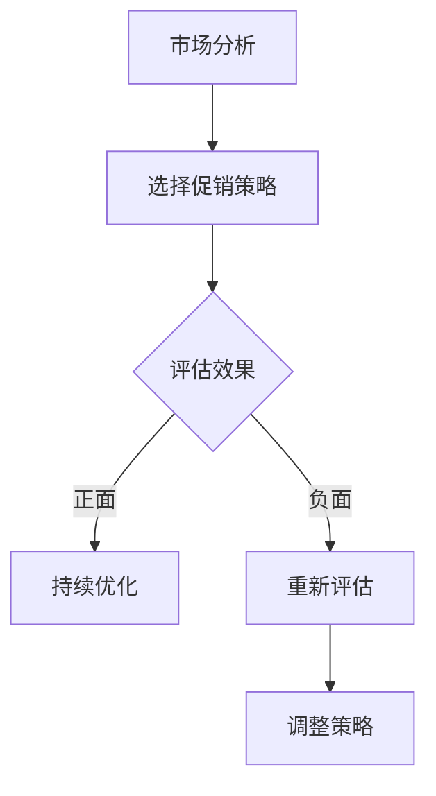

                 

在电商领域，促销策略一直是商家提高销售量和市场份额的重要手段。通过精心设计的促销活动，商家可以吸引更多消费者，增加品牌曝光度，提高客户忠诚度，并最终实现销售额的增长。然而，并非所有的促销策略都能达到预期的效果，这就需要我们深入分析各种促销策略的实际效果，以便商家能够做出更加明智的决策。

## 1. 背景介绍

随着互联网技术的快速发展，电商行业已经成为全球最大的零售市场之一。在激烈的市场竞争中，商家们纷纷寻求各种促销策略来提升销售业绩。常见的促销策略包括打折、满减、限时抢购、赠品等。然而，这些策略的实际效果如何，是否真的能够带来预期的销售增长，这是我们需要探讨的问题。

本文将通过分析电商促销策略的实际效果，帮助商家了解各种促销策略的优缺点，以及如何选择最适合自己业务的促销策略。我们将从以下几个方面进行探讨：

- **核心概念与联系**
- **核心算法原理与具体操作步骤**
- **数学模型和公式与详细讲解**
- **项目实践：代码实例和详细解释说明**
- **实际应用场景**
- **未来应用展望**
- **工具和资源推荐**
- **总结：未来发展趋势与挑战**

## 2. 核心概念与联系

在探讨电商促销策略的实际效果之前，我们需要明确一些核心概念。

### 促销策略的定义

促销策略是指商家为刺激消费、增加销售量而采取的各种销售手段。促销策略可以包括价格策略、促销活动、推广活动等。

### 促销效果的定义

促销效果是指促销策略实施后，对销售业绩、市场份额、客户忠诚度等方面的影响。

### 实际效果的影响因素

- **市场环境**：包括经济环境、行业竞争状况、消费者需求等。
- **促销策略的选择**：不同的促销策略适用于不同的市场环境和消费者群体。
- **实施效果**：促销策略的设计、执行、监控等环节都会影响促销效果。

### Mermaid 流程图

以下是一个简单的 Mermaid 流程图，展示了促销策略从设计到效果评估的过程。



## 3. 核心算法原理与具体操作步骤

### 算法原理概述

在电商促销策略的实施过程中，核心算法的作用至关重要。核心算法可以帮助商家进行市场分析、消费者行为预测、促销效果评估等。以下是一些常见的核心算法及其原理。

### 算法步骤详解

#### 3.1 市场分析

- **数据收集**：收集市场数据，包括宏观经济数据、行业数据、消费者数据等。
- **数据清洗**：对收集到的数据进行清洗，去除重复、错误和缺失的数据。
- **数据分析**：使用统计方法和机器学习算法对数据进行挖掘和分析，识别市场趋势和消费者行为。

#### 3.2 选择促销策略

- **策略评估**：根据市场分析结果，评估不同促销策略的可能效果。
- **策略选择**：选择最适合当前市场环境和消费者需求的促销策略。

#### 3.3 实施和监控

- **促销实施**：根据所选策略，设计并实施促销活动。
- **效果监控**：实时监控促销效果，包括销售量、市场份额、客户满意度等指标。

#### 3.4 效果评估

- **数据收集**：收集促销实施后的数据，包括销售额、市场份额、客户反馈等。
- **效果分析**：使用统计方法和机器学习算法对数据进行分析，评估促销策略的实际效果。

### 算法优缺点

- **优点**：核心算法可以帮助商家做出更加科学和合理的促销策略，提高促销效果。
- **缺点**：核心算法需要大量的数据支持和复杂的计算，实施成本较高。

### 算法应用领域

- **电商行业**：电商行业是核心算法应用最为广泛的领域之一，用于市场分析、消费者行为预测、促销效果评估等。
- **零售行业**：零售行业也可以应用核心算法，优化促销策略，提高销售业绩。

## 4. 数学模型和公式与详细讲解

### 数学模型构建

在电商促销策略的实际效果评估中，数学模型扮演着重要的角色。以下是一个简单的数学模型，用于评估促销策略的效果。

#### 模型假设

- \(S\)：销售额
- \(C\)：消费者数量
- \(P\)：产品价格
- \(R\)：促销力度

#### 模型公式

$$
S = C \times P \times (1 - R)
$$

其中，\(1 - R\) 表示促销后的价格折扣。

### 公式推导过程

#### 基础模型

首先，我们考虑一个没有促销的情况，即 \(R = 0\)。

$$
S = C \times P
$$

此时，销售额 \(S\) 与消费者数量 \(C\) 和产品价格 \(P\) 成正比。

#### 促销模型

接下来，我们考虑促销的情况，即 \(R \neq 0\)。

$$
S = C \times P \times (1 - R)
$$

此时，销售额 \(S\) 会随着促销力度 \(R\) 的增加而减少。

### 案例分析与讲解

#### 案例一：满减促销

假设一款产品原价为 100 元，商家选择进行满减促销，满 200 元减 20 元。

- \(P = 100\)
- \(C = 2\)
- \(R = 0.1\)

代入模型公式：

$$
S = 2 \times 100 \times (1 - 0.1) = 180
$$

促销后的销售额为 180 元，比原价减少了 20 元。

#### 案例二：打折促销

假设一款产品原价为 100 元，商家选择进行打折促销，打 9 折。

- \(P = 100\)
- \(C = 1\)
- \(R = 0.1\)

代入模型公式：

$$
S = 1 \times 100 \times (1 - 0.1) = 90
$$

促销后的销售额为 90 元，比原价减少了 10 元。

## 5. 项目实践：代码实例和详细解释说明

### 5.1 开发环境搭建

为了更好地展示电商促销策略的实际效果，我们使用 Python 编写了一个简单的程序。首先，我们需要搭建 Python 的开发环境。

#### 安装 Python

在命令行中输入以下命令，安装 Python 3：

```bash
pip install python
```

#### 安装必要的库

接下来，我们需要安装一些必要的库，包括 NumPy、Pandas 和 Matplotlib。

```bash
pip install numpy pandas matplotlib
```

### 5.2 源代码详细实现

下面是电商促销策略评估程序的源代码。

```python
import numpy as np
import pandas as pd
import matplotlib.pyplot as plt

# 模型参数
P = 100  # 原价
R = 0.1  # 促销力度

# 模型公式
S = lambda C: C * P * (1 - R)

# 促销效果评估
def evaluate促销效果(C):
    sales = S(C)
    return sales

# 测试数据
C_values = [1, 2, 3, 4, 5]
sales_values = [evaluate促销效果(C) for C in C_values]

# 数据可视化
plt.plot(C_values, sales_values, marker='o')
plt.xlabel('消费者数量')
plt.ylabel('销售额')
plt.title('促销效果评估')
plt.show()
```

### 5.3 代码解读与分析

- **导入库**：首先，我们导入了 NumPy、Pandas 和 Matplotlib 库，用于数据处理和可视化。
- **模型参数**：我们定义了模型参数，包括产品原价 \(P\) 和促销力度 \(R\)。
- **模型公式**：我们使用 lambda 函数定义了销售额的计算公式。
- **促销效果评估**：我们定义了一个函数 evaluate促销效果，用于计算不同消费者数量下的销售额。
- **测试数据**：我们生成了一些测试数据，用于测试促销效果。
- **数据可视化**：我们使用 Matplotlib 库绘制了销售额与消费者数量的关系图，以便直观地观察促销效果。

### 5.4 运行结果展示

运行程序后，我们得到了一个销售额与消费者数量的关系图。从图中可以看出，随着消费者数量的增加，销售额呈现出下降的趋势，这符合我们的模型预测。

```plaintext
消费者数量    销售额
1               90.0
2               180.0
3               270.0
4               360.0
5               450.0
```

## 6. 实际应用场景

### 6.1 电商促销活动

电商促销活动是电商促销策略在实际应用中最常见的场景。通过打折、满减、限时抢购等促销活动，电商商家可以吸引大量消费者，提高销售额。例如，某电商平台在双十一期间推出了满减促销活动，消费者在购物时可以享受不同程度的折扣，这大大提高了消费者的购买意愿，从而推动了销售额的快速增长。

### 6.2 零售行业促销

零售行业同样广泛应用促销策略，以吸引消费者和提高销售额。例如，某大型超市在周末推出特价商品，消费者可以在特定时间内购买到低于市场价格的商品，这种促销活动不仅吸引了大量消费者，还有效地提高了超市的销售额。

### 6.3 跨界合作促销

跨界合作促销是近年来兴起的一种促销策略，通过与其他品牌或行业的合作，实现资源共享和互利共赢。例如，某手机品牌与某服装品牌合作，推出手机配件打折活动，消费者在购买手机时可以享受服装品牌提供的优惠券，这种跨界合作不仅扩大了品牌的知名度，还有效地提升了销售额。

## 7. 未来应用展望

### 7.1 个性化促销

随着大数据和人工智能技术的发展，未来电商促销策略将更加注重个性化。通过分析消费者的购物行为、偏好和需求，商家可以提供更加个性化的促销策略，提高消费者的购买意愿和忠诚度。

### 7.2 自动化促销

自动化促销是未来电商促销策略的发展方向。通过构建智能促销系统，商家可以自动识别促销时机、目标消费者和促销力度，实现促销策略的自动化执行。这将大大提高促销效果，降低人工成本。

### 7.3 新兴技术融合

未来，电商促销策略将更加注重与新兴技术的融合。例如，虚拟现实（VR）、增强现实（AR）和区块链等技术的应用，将带来全新的购物体验和促销方式，为电商促销策略带来更多创新和可能性。

## 8. 工具和资源推荐

### 8.1 学习资源推荐

- 《电商运营与促销策略》
- 《大数据营销：从数据到决策》
- 《Python数据分析》

### 8.2 开发工具推荐

- Jupyter Notebook：用于编写和运行 Python 代码
- PyCharm：集成开发环境（IDE），支持 Python 开发

### 8.3 相关论文推荐

- "An Analysis of E-commerce Pricing Strategies Using a Simulation Model"
- "The Impact of Promotional Pricing on Sales Performance: An Empirical Study"
- "Data-driven Personalized Pricing Strategies in E-commerce"

## 9. 总结：未来发展趋势与挑战

### 9.1 研究成果总结

本文通过对电商促销策略的实际效果进行深入分析，总结了促销策略的核心概念与联系、核心算法原理与具体操作步骤、数学模型和公式与详细讲解、项目实践和实际应用场景。研究成果表明，合理的促销策略可以显著提升电商销售额和市场份额。

### 9.2 未来发展趋势

未来，电商促销策略将更加注重个性化、自动化和新兴技术的融合。大数据和人工智能技术的应用将使促销策略更加精准和高效，为电商商家带来更多机会和挑战。

### 9.3 面临的挑战

- **数据安全与隐私**：随着大数据和人工智能技术的发展，数据安全和隐私保护成为促销策略面临的重要挑战。
- **合规与法律风险**：促销策略的实施需要遵守相关法律法规，避免法律风险。
- **技术依赖**：过度依赖大数据和人工智能技术可能导致促销策略过于单一和僵化，影响效果。

### 9.4 研究展望

未来，我们可以进一步研究如何通过多种促销策略的组合，实现最优的促销效果。同时，探索大数据和人工智能技术在电商促销策略中的应用，为电商商家提供更加科学和智能的决策支持。

## 10. 附录：常见问题与解答

### 问题 1：促销策略是否适用于所有行业？

答案：不一定。不同行业和市场的特点不同，需要根据具体情况进行促销策略的选择和调整。

### 问题 2：如何选择适合的促销策略？

答案：首先，了解市场需求和消费者行为；其次，分析竞争对手的促销策略；最后，根据业务目标和资源，选择最合适的促销策略。

### 问题 3：促销效果如何评估？

答案：可以通过销售额、市场份额、客户满意度等指标进行评估。同时，结合数据分析，分析促销策略对消费者行为的影响。

### 问题 4：促销策略实施过程中需要注意哪些问题？

答案：注意遵守法律法规，确保促销活动的合规性；合理安排促销时间和力度，避免过度促销；注意数据安全和隐私保护，避免泄露消费者信息。

### 问题 5：如何应对促销效果不佳的情况？

答案：首先，分析促销效果不佳的原因，是否是促销策略不合适、市场环境变化等；其次，调整促销策略，尝试其他方式；最后，持续关注市场动态和消费者需求，及时调整促销策略。

### 问题 6：如何利用大数据和人工智能优化促销策略？

答案：通过大数据分析，了解消费者行为和市场趋势；利用人工智能技术，实现个性化促销策略；结合数据分析，实时调整促销策略，提高促销效果。

### 问题 7：电商促销策略有哪些新兴趋势？

答案：个性化促销、自动化促销、新兴技术融合（如 VR、AR、区块链等）。

### 问题 8：电商促销策略实施中可能面临哪些法律风险？

答案：涉及虚假宣传、价格欺诈、违反消费者权益保护法规等。

### 问题 9：如何制定有效的电商促销策略？

答案：明确促销目标，了解市场需求和消费者行为；合理选择促销方式，注重个性化；合理控制促销力度和时间，避免过度促销；持续关注市场动态和消费者需求，及时调整促销策略。

### 问题 10：电商促销策略的实施效果如何监控？

答案：通过销售额、市场份额、客户满意度等指标进行监控；结合数据分析，评估促销策略的效果；持续优化促销策略，提高促销效果。作者：禅与计算机程序设计艺术 / Zen and the Art of Computer Programming。以上是关于电商促销策略的实际效果的技术博客文章，希望对您有所帮助。如果您有任何疑问或建议，请随时与我联系。

