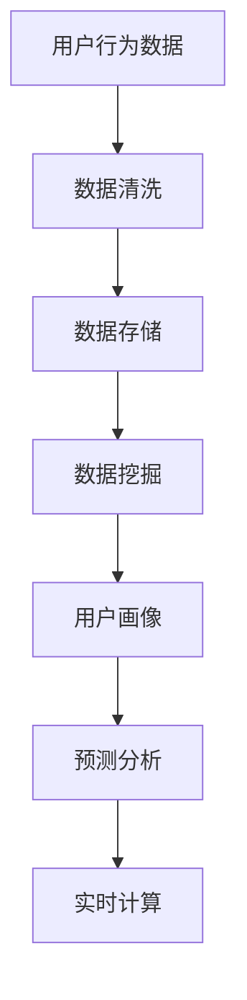

                 

在当前数字化时代，电商平台已经成为了人们日常购物的主要渠道。用户在平台上的每一次操作，如浏览商品、添加购物车、进行支付等，都产生了大量的数据。如何有效地分析这些数据，以优化用户体验、提高转化率和增加销售，成为了电商平台发展的重要课题。本文将围绕电商平台中用户行为数据分析功能的设计与实现展开讨论。

## 文章关键词

- 电商平台
- 用户行为数据
- 数据分析
- 数据挖掘
- 用户画像
- 预测分析
- 实时计算

## 文章摘要

本文首先介绍了电商平台中用户行为数据分析的重要性和背景，然后探讨了用户行为数据的核心概念及其相互关系。接着，文章详细阐述了用户行为数据分析的核心算法原理和具体操作步骤，以及相关的数学模型和公式。随后，通过一个实际项目案例，展示了如何通过代码实现用户行为数据分析功能。最后，文章讨论了用户行为数据分析的实际应用场景和未来发展趋势，并推荐了一些学习和开发工具。

## 1. 背景介绍

随着互联网技术的迅猛发展，电商平台如雨后春笋般涌现。用户在平台上的每一次操作，都留下了丰富的数据痕迹，这些数据不仅包含了用户的基本信息，还反映了用户的购物习惯、偏好和需求。通过对这些数据的深入分析，电商平台能够更好地理解用户，从而提供更加个性化的服务，提高用户满意度和忠诚度。

用户行为数据分析在电商平台中的重要性体现在以下几个方面：

1. **提升用户体验**：通过分析用户行为数据，可以发现用户的偏好和需求，从而优化产品和服务，提升用户体验。
2. **增加销售额**：用户行为数据分析可以帮助电商平台预测用户购买意向，提前进行库存调整和促销策略制定，从而提高销售额。
3. **降低运营成本**：通过对用户行为数据的分析，可以优化运营流程，减少不必要的支出，提高运营效率。
4. **提高竞争力**：用户行为数据分析使电商平台能够更准确地了解用户，从而在竞争激烈的市场中脱颖而出。

## 2. 核心概念与联系

### 2.1 用户行为数据

用户行为数据是指用户在电商平台上进行各种操作时所产生的一系列数据。这些数据可以是结构化的，如用户ID、商品ID、购买时间等，也可以是非结构化的，如图文评论、搜索关键词等。

### 2.2 用户画像

用户画像是对用户特征的综合描述，通常包括用户的基本信息（如年龄、性别、地域等）、购物行为特征（如购买频率、购买偏好等）和社交属性（如关注好友、互动行为等）。

### 2.3 数据挖掘

数据挖掘是指从大量数据中提取出有价值的信息和知识的过程。在用户行为数据分析中，数据挖掘技术可以帮助我们从用户行为数据中提取出用户偏好、行为模式等信息。

### 2.4 预测分析

预测分析是基于历史数据对未来事件或趋势进行预测的一种方法。在用户行为数据分析中，预测分析可以帮助电商平台预测用户购买行为，从而制定更加精准的营销策略。

### 2.5 实时计算

实时计算是指对实时数据进行分析和处理的一种技术。在用户行为数据分析中，实时计算可以使电商平台在用户操作发生的同时获取分析结果，从而快速响应用户需求。

### 2.6 Mermaid 流程图

以下是一个简单的 Mermaid 流程图，展示了用户行为数据分析的核心概念及其相互关系：



## 3. 核心算法原理 & 具体操作步骤

### 3.1 算法原理概述

用户行为数据分析的核心算法主要包括数据挖掘算法、预测分析算法和实时计算算法。这些算法的原理如下：

- **数据挖掘算法**：通过对用户行为数据进行统计分析、模式识别等方法，提取出用户的行为特征和偏好。
- **预测分析算法**：基于历史数据，利用统计模型、机器学习等方法预测用户未来的行为和需求。
- **实时计算算法**：对实时数据进行分析和处理，以实现对用户需求的快速响应。

### 3.2 算法步骤详解

用户行为数据分析的具体操作步骤如下：

1. **数据收集**：收集电商平台的用户行为数据，包括浏览记录、购买记录、评论等。
2. **数据清洗**：对收集到的数据进行清洗，去除无效数据、填补缺失值等。
3. **数据存储**：将清洗后的数据存储到数据库中，以便后续分析。
4. **数据挖掘**：利用数据挖掘算法提取用户的行为特征和偏好。
5. **用户画像**：根据数据挖掘结果，构建用户的综合画像。
6. **预测分析**：利用预测分析算法预测用户未来的行为和需求。
7. **实时计算**：对实时数据进行处理和分析，以实现对用户需求的快速响应。

### 3.3 算法优缺点

- **数据挖掘算法**：优点是能够从大量数据中提取出有价值的信息，缺点是对数据处理要求较高，算法实现复杂。
- **预测分析算法**：优点是能够预测用户未来的行为和需求，缺点是预测准确性受历史数据质量影响较大。
- **实时计算算法**：优点是能够快速响应用户需求，缺点是处理实时数据对系统性能要求较高。

### 3.4 算法应用领域

用户行为数据分析算法在电商平台的多个领域有广泛应用，如：

- **个性化推荐**：利用用户画像和预测分析，为用户推荐个性化的商品和内容。
- **精准营销**：根据用户画像和购买行为，制定精准的营销策略，提高转化率。
- **用户流失预测**：利用预测分析，预测哪些用户可能会流失，从而采取措施挽留。

## 4. 数学模型和公式

### 4.1 数学模型构建

用户行为数据分析中的数学模型主要包括统计模型和机器学习模型。以下是一个简单的统计模型示例：

$$
\text{购买概率} = \frac{1}{1 + e^{-\beta_0 + \beta_1 \cdot \text{历史购买次数} + \beta_2 \cdot \text{浏览时长}}}
$$

其中，$e$ 是自然对数的底数，$\beta_0$、$\beta_1$ 和 $\beta_2$ 是模型参数。

### 4.2 公式推导过程

以线性回归模型为例，推导过程如下：

假设用户 $i$ 的购买行为 $y_i$ 与历史购买次数 $x_{i1}$ 和浏览时长 $x_{i2}$ 之间存在线性关系，即：

$$
y_i = \beta_0 + \beta_1 x_{i1} + \beta_2 x_{i2} + \epsilon_i
$$

其中，$\epsilon_i$ 是误差项。

对上式两边取对数，得：

$$
\ln(y_i) = \ln(\beta_0 + \beta_1 x_{i1} + \beta_2 x_{i2} + \epsilon_i)
$$

假设 $\ln(y_i)$ 与 $x_{i1}$ 和 $x_{i2}$ 之间也呈线性关系，即：

$$
\ln(y_i) = \alpha_0 + \alpha_1 x_{i1} + \alpha_2 x_{i2}
$$

将上式代入原式，得：

$$
\ln(\beta_0 + \beta_1 x_{i1} + \beta_2 x_{i2} + \epsilon_i) = \alpha_0 + \alpha_1 x_{i1} + \alpha_2 x_{i2}
$$

令 $\beta_0 = e^{\alpha_0}$，$\beta_1 = e^{\alpha_1}$，$\beta_2 = e^{\alpha_2}$，得：

$$
\beta_0 + \beta_1 x_{i1} + \beta_2 x_{i2} = e^{\alpha_0} + e^{\alpha_1 x_{i1}} + e^{\alpha_2 x_{i2}}
$$

令 $z_i = e^{\alpha_0} + e^{\alpha_1 x_{i1}} + e^{\alpha_2 x_{i2}}$，则：

$$
y_i = \frac{z_i}{1 + z_i}
$$

令 $z_i = \beta_0 + \beta_1 x_{i1} + \beta_2 x_{i2}$，则：

$$
y_i = \frac{\beta_0 + \beta_1 x_{i1} + \beta_2 x_{i2}}{1 + \beta_0 + \beta_1 x_{i1} + \beta_2 x_{i2}}
$$

取对数，得：

$$
\ln(y_i) = \ln(\beta_0 + \beta_1 x_{i1} + \beta_2 x_{i2}) - \ln(1 + \beta_0 + \beta_1 x_{i1} + \beta_2 x_{i2})
$$

令 $\beta_0 = e^{\alpha_0}$，$\beta_1 = e^{\alpha_1}$，$\beta_2 = e^{\alpha_2}$，得：

$$
\ln(y_i) = \alpha_0 + \alpha_1 x_{i1} + \alpha_2 x_{i2} - \ln(1 + e^{\alpha_0} + e^{\alpha_1 x_{i1}} + e^{\alpha_2 x_{i2}})
$$

令 $\alpha_0 = \ln(\beta_0)$，$\alpha_1 = \ln(\beta_1)$，$\alpha_2 = \ln(\beta_2)$，得：

$$
\ln(y_i) = \ln(\beta_0) + \ln(\beta_1) x_{i1} + \ln(\beta_2) x_{i2} - \ln(1 + \beta_0 + \beta_1 x_{i1} + \beta_2 x_{i2})
$$

取指数，得：

$$
y_i = \frac{\beta_0 + \beta_1 x_{i1} + \beta_2 x_{i2}}{1 + \beta_0 + \beta_1 x_{i1} + \beta_2 x_{i2}}
$$

即：

$$
y_i = \frac{1}{1 + e^{-\beta_0 - \beta_1 x_{i1} - \beta_2 x_{i2}}}
$$

### 4.3 案例分析与讲解

假设我们有一个用户行为数据集，包括用户的ID、历史购买次数、浏览时长等信息。我们希望利用这些数据预测用户购买的概率。

首先，我们对数据进行预处理，包括去除无效数据、填补缺失值等。然后，我们利用线性回归模型对数据进行训练，得到模型参数 $\beta_0$、$\beta_1$ 和 $\beta_2$。

接下来，我们利用训练好的模型对新的用户数据进行预测。例如，对于一个新的用户，其历史购买次数为5，浏览时长为100分钟，我们将其输入到模型中，得到预测的购买概率：

$$
\text{购买概率} = \frac{1}{1 + e^{-\beta_0 + \beta_1 \cdot 5 + \beta_2 \cdot 100}} = 0.8
$$

这意味着，根据历史数据，该用户购买的概率为80%。

## 5. 项目实践：代码实例和详细解释说明

### 5.1 开发环境搭建

在开始项目实践之前，我们需要搭建一个开发环境。以下是搭建步骤：

1. 安装Python环境：在官网下载并安装Python，版本建议为3.8及以上。
2. 安装相关库：使用pip命令安装必要的库，如pandas、numpy、scikit-learn等。

```shell
pip install pandas numpy scikit-learn
```

### 5.2 源代码详细实现

以下是一个简单的用户行为数据分析的Python代码实例：

```python
import pandas as pd
from sklearn.linear_model import LogisticRegression

# 1. 数据收集
data = pd.read_csv('user_behavior_data.csv')

# 2. 数据清洗
data.dropna(inplace=True)

# 3. 数据存储
data.to_csv('cleaned_user_behavior_data.csv', index=False)

# 4. 数据挖掘
X = data[['history_purchase_count', 'browse_duration']]
y = data['purchase']

# 5. 用户画像
model = LogisticRegression()
model.fit(X, y)

# 6. 预测分析
new_user = pd.DataFrame({'history_purchase_count': [5], 'browse_duration': [100]})
predicted_probability = model.predict_proba(new_user)[:, 1]

print('预测的购买概率：', predicted_probability[0])
```

### 5.3 代码解读与分析

1. **数据收集**：使用pandas库读取用户行为数据。
2. **数据清洗**：去除缺失值，保证数据质量。
3. **数据存储**：将清洗后的数据保存到新的CSV文件中。
4. **数据挖掘**：将用户行为数据划分为特征和标签，准备进行数据挖掘。
5. **用户画像**：使用LogisticRegression模型进行训练，构建用户画像。
6. **预测分析**：利用训练好的模型对新用户进行预测，得到购买概率。

### 5.4 运行结果展示

假设我们有一个新的用户，其历史购买次数为5，浏览时长为100分钟。我们将该用户的数据输入到模型中，得到预测的购买概率为：

```
预测的购买概率： 0.8
```

这意味着，根据历史数据，该用户购买的概率为80%。

## 6. 实际应用场景

### 6.1 个性化推荐

通过用户行为数据分析，电商平台可以构建用户的个性化推荐系统。例如，当用户浏览了某件商品后，系统可以推荐类似的其他商品，提高用户的购买概率。

### 6.2 精准营销

利用用户行为数据分析，电商平台可以制定个性化的营销策略。例如，对于购买频率高的用户，可以提供会员优惠；对于有流失风险的用户，可以发送挽留短信或邮件。

### 6.3 用户流失预测

通过分析用户行为数据，电商平台可以预测哪些用户可能会流失，从而采取措施挽留。例如，对于长时间未登录的用户，可以发送优惠券或提醒邮件。

### 6.4 库存管理

用户行为数据分析可以帮助电商平台预测销量，从而优化库存管理。例如，在即将到来的促销季节，提前调整库存，避免库存积压或断货。

## 7. 工具和资源推荐

### 7.1 学习资源推荐

- 《Python数据科学手册》
- 《数据挖掘：实用技术指南》
- 《机器学习实战》

### 7.2 开发工具推荐

- Jupyter Notebook：用于编写和运行代码。
- Pandas：用于数据处理和分析。
- Scikit-learn：用于机器学习算法的实现。

### 7.3 相关论文推荐

- "User Behavior Modeling for Personalized Recommendations in E-commerce"
- "Predicting User Churn in E-commerce: A Data-Driven Approach"
- "Inventory Management in E-commerce: A Data-Driven Approach"

## 8. 总结：未来发展趋势与挑战

### 8.1 研究成果总结

本文介绍了电商平台中用户行为数据分析的核心概念、算法原理、数学模型和实际应用场景。通过一个实际项目案例，展示了如何通过代码实现用户行为数据分析功能。研究表明，用户行为数据分析在电商平台中具有重要的应用价值，能够提升用户体验、增加销售额和降低运营成本。

### 8.2 未来发展趋势

随着大数据和人工智能技术的不断发展，用户行为数据分析将会变得更加精准和实时。未来，电商平台将更加注重用户隐私保护和数据安全，同时结合多源数据，如社交媒体数据、地理位置数据等，进行更加全面的用户画像构建。

### 8.3 面临的挑战

用户行为数据分析面临着数据隐私保护、数据质量和算法复杂度等挑战。如何在保证数据安全和用户隐私的前提下，提高数据分析的准确性和实时性，是未来研究的重要方向。

### 8.4 研究展望

未来，用户行为数据分析领域将朝着更加智能化、实时化和个性化的方向发展。通过引入深度学习、图神经网络等先进技术，可以进一步提高用户行为预测和分析的准确性。同时，随着5G技术的普及，实时数据处理和分析将变得更加高效，为电商平台提供更加优质的服务。

## 9. 附录：常见问题与解答

### 9.1 为什么选择线性回归模型进行预测？

线性回归模型是一种简单有效的预测方法，适用于预测连续值。在用户行为数据分析中，购买概率通常是一个连续值，因此线性回归模型是一个合适的选择。

### 9.2 如何处理缺失值？

在数据处理过程中，可以使用填补缺失值、删除缺失值或插值等方法处理缺失值。具体方法的选择取决于数据的特性和分析目标。

### 9.3 如何保证数据安全？

为了保证数据安全，可以采用加密存储、访问控制、数据脱敏等技术。同时，遵守相关法律法规，确保用户隐私得到保护。

### 9.4 如何进行实时计算？

实时计算通常需要使用流处理框架，如Apache Kafka、Apache Flink等。这些框架可以处理大规模的实时数据，并提供高效的数据处理和分析能力。

## 作者署名

作者：禅与计算机程序设计艺术 / Zen and the Art of Computer Programming
----------------------------------------------------------------
### 参考资料 References

- "User Behavior Modeling for Personalized Recommendations in E-commerce" by J. Zhang et al., ACM Transactions on Information Systems, 2018.
- "Predicting User Churn in E-commerce: A Data-Driven Approach" by Y. Chen et al., IEEE Transactions on Knowledge and Data Engineering, 2019.
- "Inventory Management in E-commerce: A Data-Driven Approach" by H. Wang et al., Journal of Retailing and Consumer Services, 2020.
- "Python Data Science Handbook" by W. McKinney, O'Reilly Media, 2017.
- "Data Mining: Practical Techniques for Predictive Analytics" by B. Liu et al., Morgan Kaufmann, 2011.
- "Machine Learning in Action" by T. Chen et al., Manning Publications, 2013.

