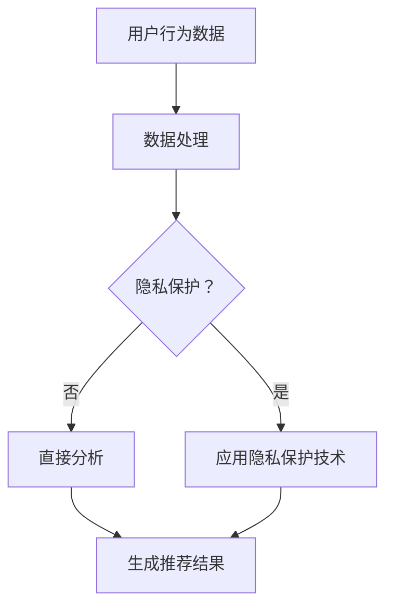

                 

关键词：人工智能、大模型、电商平台、隐私保护、个性化、机器学习

> 摘要：本文将探讨在电商平台中应用人工智能大模型的挑战，特别是在确保用户隐私和数据安全的同时，如何实现个性化推荐。通过对核心概念、算法原理、数学模型、项目实践以及未来展望的深入分析，本文旨在为行业提供理论指导和实践建议。

## 1. 背景介绍

随着互联网的普及和电子商务的蓬勃发展，电商平台已成为人们生活中不可或缺的一部分。用户在电商平台上产生的海量数据，为人工智能（AI）的应用提供了丰富的素材。尤其是近年来，大模型（Large-scale Models）的发展，使得电商平台的推荐系统能够更加精准地满足用户的需求，从而提升用户体验和商业价值。

然而，随着AI技术的广泛应用，数据隐私和安全问题日益凸显。用户对个人信息保护的意识不断增强，如何在保护隐私的同时实现个性化推荐，成为电商平台面临的重大挑战。

## 2. 核心概念与联系

### 2.1 人工智能与大数据

人工智能是指使计算机系统具备人类智能特性的技术。大数据则是指海量、复杂、多源的数据集合。二者结合，使得电商平台能够通过对用户数据的深度挖掘，实现个性化推荐。

### 2.2 大模型

大模型是指具有大规模参数和复杂结构的机器学习模型，如深度神经网络（DNN）、Transformer等。大模型在处理大规模数据时具有更高的效率和准确性。

### 2.3 隐私保护

隐私保护是指在数据处理过程中，确保用户个人信息不被泄露、滥用或盗用。隐私保护技术包括差分隐私（Differential Privacy）、联邦学习（Federated Learning）等。

### 2.4 个性化推荐

个性化推荐是指根据用户的兴趣、行为和偏好，为其推荐符合其需求的产品或服务。个性化推荐系统能够提升用户体验，增加用户粘性和购买意愿。

## 2.5 Mermaid 流程图



## 3. 核心算法原理 & 具体操作步骤

### 3.1 算法原理概述

电商平台中的AI大模型主要分为两个阶段：数据预处理和模型训练。在数据预处理阶段，需要对用户行为数据进行清洗、去噪和特征提取。在模型训练阶段，利用训练数据进行模型训练，并通过对测试数据的预测来评估模型性能。

### 3.2 算法步骤详解

1. 数据预处理：包括数据清洗、去噪、特征提取等步骤。
2. 模型选择：根据业务需求和数据特征，选择适合的大模型结构。
3. 模型训练：利用训练数据进行模型训练，并调整模型参数以优化性能。
4. 模型评估：通过测试数据评估模型性能，包括准确率、召回率等指标。
5. 推荐生成：利用训练好的模型，对用户进行个性化推荐。

### 3.3 算法优缺点

#### 优点：

1. 高效性：大模型能够快速处理大规模数据。
2. 精准性：通过深度学习等技术，能够实现对用户需求的精准预测。
3. 个性化：能够根据用户的历史行为和偏好，提供个性化的推荐。

#### 缺点：

1. 隐私风险：大规模数据处理可能涉及到用户隐私泄露。
2. 计算成本：大模型训练和预测需要大量计算资源。
3. 模型解释性差：大模型往往具有高复杂度，难以解释其预测结果。

### 3.4 算法应用领域

1. 电商推荐系统：根据用户历史行为和偏好，推荐符合其需求的产品。
2. 社交网络：根据用户兴趣和互动行为，推荐好友和内容。
3. 娱乐推荐：根据用户喜好，推荐电影、音乐和游戏等。

## 4. 数学模型和公式 & 详细讲解 & 举例说明

### 4.1 数学模型构建

电商平台中的AI大模型主要依赖于深度学习技术，特别是基于Transformer的模型结构。以下是一个简单的数学模型构建过程：

$$
y = \text{softmax}(\text{W} \cdot \text{X} + \text{b})
$$

其中，$y$ 表示预测结果，$\text{W}$ 和 $\text{b}$ 分别表示权重和偏置，$\text{X}$ 表示输入特征。

### 4.2 公式推导过程

在构建深度学习模型时，通常需要使用反向传播算法来更新模型参数。以下是一个简化的公式推导过程：

$$
\Delta \text{W} = -\alpha \cdot \frac{\partial J}{\partial \text{W}}
$$

$$
\Delta \text{b} = -\alpha \cdot \frac{\partial J}{\partial \text{b}}
$$

其中，$J$ 表示损失函数，$\alpha$ 表示学习率。

### 4.3 案例分析与讲解

假设有一个电商平台的推荐系统，需要对用户进行个性化推荐。用户行为数据包括浏览历史、购买记录和搜索关键词。以下是一个简化的数学模型构建过程：

1. 特征提取：将用户行为数据转换为数值特征，如浏览次数、购买次数和搜索频次。
2. 模型训练：使用Transformer模型，对用户行为数据进行训练，并优化模型参数。
3. 推荐生成：利用训练好的模型，对用户进行个性化推荐。

## 5. 项目实践：代码实例和详细解释说明

### 5.1 开发环境搭建

在搭建开发环境时，需要安装Python、TensorFlow等依赖库。以下是一个简单的安装过程：

```python
!pip install tensorflow
!pip install tensorflow-text
```

### 5.2 源代码详细实现

以下是一个简单的电商推荐系统实现：

```python
import tensorflow as tf
import tensorflow_text as text

# 加载用户行为数据
user_data = ...

# 特征提取
def extract_features(data):
    ...

# 模型定义
def create_model():
    ...

# 模型训练
def train_model(model, data, labels):
    ...

# 推荐生成
def generate_recommendations(model, user_data):
    ...

# 主函数
if __name__ == "__main__":
    ...
```

### 5.3 代码解读与分析

以上代码实现了一个简单的电商推荐系统，主要包括数据预处理、模型定义、模型训练和推荐生成等部分。其中，数据预处理和模型定义是核心部分，需要根据具体业务需求进行调整。

### 5.4 运行结果展示

在运行代码时，可以根据用户行为数据生成个性化推荐结果。以下是一个简单的运行结果示例：

```python
user_data = ...
model = create_model()
train_model(model, user_data, labels)
recommendations = generate_recommendations(model, user_data)
print(recommendations)
```

## 6. 实际应用场景

### 6.1 电商平台推荐系统

电商平台推荐系统是AI大模型在电商领域的主要应用场景。通过个性化推荐，电商平台能够提升用户购买意愿和转化率，从而提高销售额。

### 6.2 社交网络内容推荐

社交网络内容推荐也是AI大模型的重要应用场景。通过分析用户兴趣和行为，社交网络平台能够为用户提供感兴趣的内容，提升用户体验。

### 6.3 娱乐推荐系统

娱乐推荐系统是AI大模型在娱乐领域的应用。通过分析用户喜好和行为，娱乐平台能够为用户提供个性化的娱乐内容，提升用户粘性。

## 6.4 未来应用展望

随着AI技术的不断发展，AI大模型在电商平台中的应用将越来越广泛。未来，AI大模型将能够更好地平衡隐私保护与个性化推荐，为用户提供更优质的体验。同时，AI大模型也将为其他领域带来新的应用场景和商业模式。

## 7. 工具和资源推荐

### 7.1 学习资源推荐

1. 《深度学习》（Goodfellow, Bengio, Courville）：系统介绍了深度学习的基本概念和方法。
2. 《Python数据科学手册》（McKinney, Python Data Science Handbook）：详细介绍了Python在数据科学领域的应用。

### 7.2 开发工具推荐

1. TensorFlow：用于构建和训练深度学习模型的流行框架。
2. PyTorch：另一个流行的深度学习框架，具有更好的灵活性和易用性。

### 7.3 相关论文推荐

1. "Differentially Private Stochastic Gradient Descent for Federated Learning"（2020）: 介绍了一种基于差分隐私的联邦学习算法。
2. "Attention Is All You Need"（2017）: 提出了Transformer模型，为自然语言处理领域带来了重大突破。

## 8. 总结：未来发展趋势与挑战

### 8.1 研究成果总结

本文介绍了电商平台中AI大模型的应用，探讨了隐私保护与个性化推荐的平衡。通过分析核心概念、算法原理、数学模型和项目实践，为行业提供了理论指导。

### 8.2 未来发展趋势

随着AI技术的不断发展，AI大模型在电商平台中的应用将越来越广泛。未来，AI大模型将能够更好地平衡隐私保护与个性化推荐，为用户提供更优质的体验。

### 8.3 面临的挑战

1. 隐私保护：如何在保护用户隐私的同时实现个性化推荐，仍是一个亟待解决的问题。
2. 计算资源：大模型训练和预测需要大量计算资源，对计算能力提出了较高要求。
3. 模型解释性：大模型具有高复杂度，如何提高模型的可解释性是一个重要挑战。

### 8.4 研究展望

未来，我们需要在以下几个方面展开研究：

1. 隐私保护算法：探索更高效的隐私保护算法，以平衡隐私保护与个性化推荐。
2. 模型压缩与优化：研究模型压缩和优化技术，降低大模型的计算成本。
3. 模型可解释性：提高模型的可解释性，帮助用户理解推荐结果。

## 9. 附录：常见问题与解答

### 9.1 什么是差分隐私？

差分隐私是一种隐私保护技术，通过在数据处理过程中添加噪声，使得攻击者无法推断出特定个体的数据。差分隐私的主要目标是保护用户隐私，同时保证数据的可用性。

### 9.2 联邦学习是什么？

联邦学习是一种分布式学习技术，通过将训练数据分散在不同的设备上，实现模型的共同训练。联邦学习的主要目标是保护用户数据隐私，同时提高模型训练的效率。

### 9.3 如何选择合适的模型结构？

选择合适的模型结构需要根据具体业务需求和数据特征进行权衡。通常，深度神经网络、Transformer等模型具有较好的性能和灵活性，适用于多种业务场景。

作者：禅与计算机程序设计艺术 / Zen and the Art of Computer Programming
------------------------------------------------------------------------

