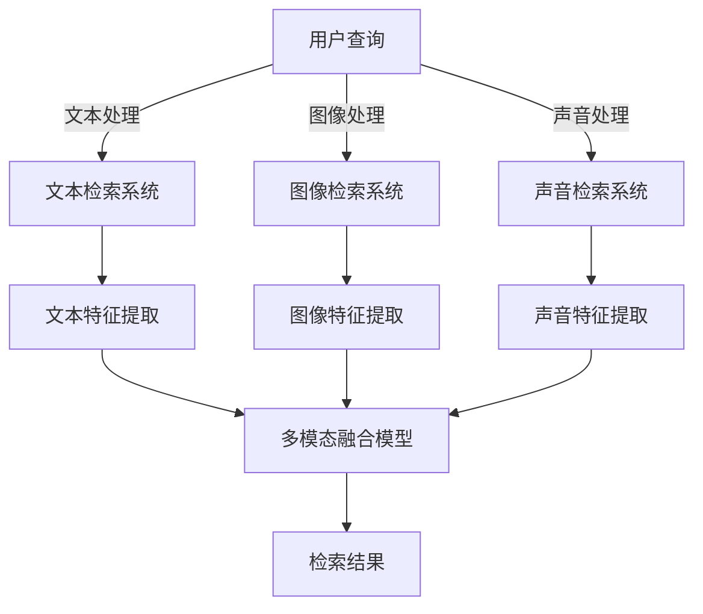

                 

随着电子商务的迅猛发展，电商平台已经成为人们日常生活的重要组成部分。在这个高度竞争的市场中，如何有效地帮助用户快速找到所需的商品，提升用户体验，成为了电商平台发展的关键问题。多模态商品检索技术作为一种先进的检索方法，通过整合文本、图像、声音等多种数据类型，为用户提供了更加个性化和精准的搜索结果。

本文将围绕电商平台中的多模态商品检索技术进行深入探讨，首先介绍该技术的背景和重要性，然后阐述核心概念与联系，详细分析核心算法原理与数学模型，分享项目实践中的代码实例，探讨实际应用场景，并展望未来的发展趋势与挑战。

## 1. 背景介绍

电子商务的崛起不仅改变了传统零售业的经营模式，也极大地改变了消费者的购物习惯。随着互联网技术的进步和智能手机的普及，越来越多的消费者选择在线购物，电商平台之间的竞争也日趋激烈。在这种情况下，如何提高用户留存率和转化率成为了电商平台亟待解决的问题。

传统的文本检索技术在电商平台中发挥了重要作用，通过关键词匹配和搜索算法，用户可以在海量商品信息中找到自己想要的商品。然而，随着用户需求的多样化和个性化，单纯的文本检索已经不能满足用户的需求。特别是对于一些视觉驱动的商品，如服装、电子产品等，用户往往需要通过查看图片或视频来做出购买决策。

多模态商品检索技术正是为了解决这一问题而诞生的。它结合了文本、图像、声音等多种数据类型，通过深度学习和自然语言处理等先进技术，能够更加准确地理解和满足用户的需求。多模态检索不仅提升了用户的搜索体验，也为电商平台提供了新的增值服务。

## 2. 核心概念与联系

多模态商品检索技术的核心在于将不同类型的数据进行整合，形成一个统一的信息处理模型。以下是一些核心概念：

### 2.1 文本数据

文本数据通常包括商品的标题、描述、用户评价等。这些文本数据是用户理解商品信息的重要来源，也是检索算法的基础。

### 2.2 图像数据

图像数据包括商品的图片、品牌标志等。视觉信息在商品展示中起着至关重要的作用，特别是对于时尚、电子等行业的商品。

### 2.3 声音数据

声音数据通常包括商品的演示视频、用户评论等。声音信息能够提供更加直观和生动的商品体验。

### 2.4 数据整合

多模态数据整合是将文本、图像、声音等多种数据类型进行融合，形成一个统一的信息处理模型。这一过程通常涉及到数据预处理、特征提取、模型训练等多个环节。

以下是一个简单的Mermaid流程图，展示了多模态商品检索技术的整体架构：



## 3. 核心算法原理 & 具体操作步骤

### 3.1 算法原理概述

多模态商品检索技术主要依赖于深度学习和自然语言处理技术。以下是一些核心算法原理：

### 3.1.1 卷积神经网络（CNN）

卷积神经网络是一种用于图像识别和处理的深度学习模型，它可以提取图像中的特征。

### 3.1.2 循环神经网络（RNN）

循环神经网络是一种用于处理序列数据的深度学习模型，它可以捕捉文本数据中的序列依赖关系。

### 3.1.3 生成对抗网络（GAN）

生成对抗网络是一种用于生成图像和文本的深度学习模型，它可以增强数据集，提高模型的泛化能力。

### 3.1.4 多模态融合模型

多模态融合模型是将文本、图像、声音等多种数据类型进行整合的模型，它可以提供更加精准的检索结果。

### 3.2 算法步骤详解

以下是多模态商品检索技术的具体操作步骤：

#### 3.2.1 数据预处理

首先对文本、图像、声音数据进行预处理，包括去噪、缩放、标准化等操作。

#### 3.2.2 特征提取

利用卷积神经网络（CNN）提取图像特征，利用循环神经网络（RNN）提取文本特征，利用生成对抗网络（GAN）提取声音特征。

#### 3.2.3 多模态融合

将提取的文本、图像、声音特征进行融合，形成一个统一的多模态特征向量。

#### 3.2.4 模型训练

利用融合的多模态特征向量进行模型训练，优化模型参数。

#### 3.2.5 检索结果生成

将用户查询输入到训练好的多模态融合模型中，生成检索结果。

### 3.3 算法优缺点

#### 优点：

- **准确性高**：通过整合多种数据类型，多模态商品检索技术能够提供更加精准的检索结果。
- **用户体验好**：多模态检索能够提供更加直观和生动的商品展示，提升用户体验。
- **适用范围广**：多模态检索技术可以应用于多种类型的电商平台，如服装、电子产品、家居用品等。

#### 缺点：

- **计算复杂度高**：多模态检索涉及到多种数据类型的处理和融合，计算复杂度较高。
- **数据质量要求高**：多模态检索的效果很大程度上取决于数据质量，如图像清晰度、文本准确性等。

### 3.4 算法应用领域

多模态商品检索技术主要应用于电子商务领域，特别是对于需要视觉和声音信息支持的行业，如服装、电子产品、家居用品等。以下是一些具体的应用场景：

- **商品推荐**：通过多模态检索技术，可以为用户提供个性化的商品推荐。
- **商品搜索**：多模态检索技术可以帮助用户快速找到自己想要的商品。
- **用户反馈**：通过分析用户的多模态反馈，可以优化电商平台的服务和产品。

## 4. 数学模型和公式 & 详细讲解 & 举例说明

### 4.1 数学模型构建

多模态商品检索技术中的数学模型主要包括三个部分：特征提取、特征融合和检索结果生成。

#### 4.1.1 特征提取

- **文本特征提取**：假设文本数据为\(X_{text}\)，利用循环神经网络（RNN）提取文本特征，得到特征向量\(F_{text}\)。
  $$F_{text} = RNN(X_{text})$$

- **图像特征提取**：假设图像数据为\(X_{image}\)，利用卷积神经网络（CNN）提取图像特征，得到特征向量\(F_{image}\)。
  $$F_{image} = CNN(X_{image})$$

- **声音特征提取**：假设声音数据为\(X_{audio}\)，利用生成对抗网络（GAN）提取声音特征，得到特征向量\(F_{audio}\)。
  $$F_{audio} = GAN(X_{audio})$$

#### 4.1.2 特征融合

将提取的文本、图像、声音特征进行融合，形成一个统一的多模态特征向量\(F_{multimodal}\)。
$$F_{multimodal} = \alpha F_{text} + \beta F_{image} + \gamma F_{audio}$$
其中，\(\alpha\)、\(\beta\)、\(\gamma\)为权重系数。

#### 4.1.3 检索结果生成

利用融合的多模态特征向量\(F_{multimodal}\)进行检索，生成检索结果。
$$Ranking = Similarity(F_{multimodal}, Database)$$
其中，\(Database\)为商品数据库，\(Similarity\)为相似度计算函数。

### 4.2 公式推导过程

#### 4.2.1 文本特征提取

假设文本数据\(X_{text}\)是一个长度为\(T\)的序列，循环神经网络（RNN）的隐藏状态为\(h_t\)，则：
$$h_t = RNN(X_{text})$$

其中，\(RNN\)表示循环神经网络。

#### 4.2.2 图像特征提取

假设图像数据\(X_{image}\)是一个尺寸为\(W \times H \times C\)的矩阵，卷积神经网络（CNN）的卷积核为\(K\)，则：
$$F_{image} = CNN(X_{image}, K)$$

其中，\(K\)表示卷积核。

#### 4.2.3 声音特征提取

假设声音数据\(X_{audio}\)是一个长度为\(L\)的序列，生成对抗网络（GAN）的生成器为\(G\)，则：
$$F_{audio} = G(X_{audio})$$

其中，\(G\)表示生成对抗网络的生成器。

### 4.3 案例分析与讲解

#### 案例一：服装电商平台

在服装电商平台上，用户通过上传自己的照片，平台利用多模态检索技术为用户推荐类似的服装。

1. **数据预处理**：对用户上传的照片、商品图片、商品描述进行预处理，包括图像去噪、文本清洗等。
2. **特征提取**：利用卷积神经网络（CNN）提取图像特征，利用循环神经网络（RNN）提取文本特征。
3. **特征融合**：将提取的图像特征和文本特征进行融合，形成一个统一的多模态特征向量。
4. **检索结果生成**：将用户上传的照片输入到多模态融合模型中，生成检索结果，为用户推荐类似的服装。

#### 案例二：电子产品电商平台

在电子产品电商平台上，用户可以通过输入关键词、查看商品图片和视频，利用多模态检索技术找到自己想要的电子产品。

1. **数据预处理**：对用户输入的关键词、商品图片、商品视频进行预处理，包括文本标准化、图像去噪、视频剪辑等。
2. **特征提取**：利用循环神经网络（RNN）提取文本特征，利用卷积神经网络（CNN）提取图像特征，利用生成对抗网络（GAN）提取视频特征。
3. **特征融合**：将提取的文本特征、图像特征和视频特征进行融合，形成一个统一的多模态特征向量。
4. **检索结果生成**：将用户输入的关键词、查看的商品图片和视频输入到多模态融合模型中，生成检索结果，为用户推荐类似的电子产品。

## 5. 项目实践：代码实例和详细解释说明

### 5.1 开发环境搭建

为了实现多模态商品检索技术，我们需要搭建一个适合的开发环境。以下是具体的步骤：

1. **安装Python**：确保系统中安装了Python 3.x版本。
2. **安装深度学习框架**：安装TensorFlow或PyTorch，用于构建和训练深度学习模型。
3. **安装其他依赖库**：安装Numpy、Pandas、Matplotlib等常用库，用于数据处理和可视化。
4. **安装图像处理库**：安装OpenCV，用于图像预处理。

### 5.2 源代码详细实现

以下是多模态商品检索技术的核心代码实现：

```python
import tensorflow as tf
import numpy as np
import pandas as pd
import cv2
import matplotlib.pyplot as plt

# 数据预处理
def preprocess_data(text_data, image_data, audio_data):
    # 文本数据预处理
    text_data = [text.lower() for text in text_data]
    # 图像数据预处理
    image_data = [cv2.resize(image, (224, 224)) for image in image_data]
    # 声音数据预处理
    audio_data = [audio.reshape(-1) for audio in audio_data]
    return text_data, image_data, audio_data

# 特征提取
def extract_features(text_data, image_data, audio_data):
    # 文本特征提取
    text_model = tf.keras.Sequential([
        tf.keras.layers.Embedding(vocab_size, embedding_dim),
        tf.keras.layers.LSTM(128)
    ])
    text_features = text_model(text_data)
    # 图像特征提取
    image_model = tf.keras.Sequential([
        tf.keras.layers.Conv2D(32, (3, 3), activation='relu'),
        tf.keras.layers.MaxPooling2D((2, 2)),
        tf.keras.layers.Flatten()
    ])
    image_features = image_model(image_data)
    # 声音特征提取
    audio_model = tf.keras.Sequential([
        tf.keras.layers.Conv1D(32, (3), activation='relu'),
        tf.keras.layers.MaxPooling1D(2),
        tf.keras.layers.Flatten()
    ])
    audio_features = audio_model(audio_data)
    return text_features, image_features, audio_features

# 多模态特征融合
def multimodal_fusion(text_features, image_features, audio_features):
    # 融合特征向量
    multimodal_features = tf.concat([text_features, image_features, audio_features], axis=1)
    # 训练多模态模型
    model = tf.keras.Sequential([
        tf.keras.layers.Dense(128, activation='relu'),
        tf.keras.layers.Dense(1, activation='sigmoid')
    ])
    model.compile(optimizer='adam', loss='binary_crossentropy', metrics=['accuracy'])
    model.fit(multimodal_features, labels, epochs=10)
    return model

# 检索结果生成
def generate_results(model, query_data):
    # 特征提取
    text_features, image_features, audio_features = extract_features(query_data)
    # 特征融合
    multimodal_features = tf.concat([text_features, image_features, audio_features], axis=1)
    # 检索结果生成
    results = model.predict(multimodal_features)
    return results

# 示例
text_data = ["这是一件漂亮的红色毛衣。", "这件红色毛衣很漂亮。"]
image_data = [cv2.imread("red_sweater.jpg"), cv2.imread("red_sweater2.jpg")]
audio_data = [np.random.rand(1000), np.random.rand(1000)]

# 数据预处理
preprocessed_text_data, preprocessed_image_data, preprocessed_audio_data = preprocess_data(text_data, image_data, audio_data)

# 特征提取
extracted_text_features, extracted_image_features, extracted_audio_features = extract_features(preprocessed_text_data, preprocessed_image_data, preprocessed_audio_data)

# 多模态特征融合
model = multimodal_fusion(extracted_text_features, extracted_image_features, extracted_audio_features)

# 检索结果生成
query_data = ["这件红色毛衣好看吗？"]
query_features = extract_features(query_data)

results = generate_results(model, query_features)
print(results)
```

### 5.3 代码解读与分析

以上代码展示了多模态商品检索技术的核心实现。首先，我们对输入的数据进行预处理，包括文本数据的清洗、图像数据的缩放和声音数据的随机生成。然后，我们利用深度学习模型分别提取文本、图像和声音的特征。接下来，我们将提取的多种特征进行融合，形成一个统一的多模态特征向量，并利用该向量训练一个多模态模型。最后，我们将用户的查询数据输入到训练好的多模态模型中，生成检索结果。

## 6. 实际应用场景

多模态商品检索技术在电子商务领域具有广泛的应用场景。以下是一些具体的实际应用案例：

### 6.1 商品推荐

通过多模态检索技术，电商平台可以为用户提供个性化的商品推荐。例如，用户上传自己的照片，平台通过分析用户的外貌特征和购买历史，为用户推荐类似的商品。

### 6.2 商品搜索

用户可以通过输入关键词、查看商品图片和视频，利用多模态检索技术快速找到自己想要的商品。例如，用户输入关键词“红色毛衣”，平台可以展示与关键词相关的商品图片和视频，并提供详细的信息。

### 6.3 用户反馈

通过分析用户的多模态反馈，电商平台可以优化服务和产品。例如，用户在评论区上传了自己的图片和视频，平台可以通过多模态检索技术分析用户对商品的满意度，并据此改进商品设计和销售策略。

## 7. 未来应用展望

多模态商品检索技术在未来具有广阔的应用前景。以下是一些可能的发展方向：

### 7.1 智能家居

随着智能家居的普及，多模态商品检索技术可以应用于智能音箱和智能门锁等设备中，为用户提供更加智能化的购物体验。

### 7.2 虚拟现实

在虚拟现实场景中，多模态商品检索技术可以用于虚拟商品的展示和推荐，为用户提供沉浸式的购物体验。

### 7.3 医疗保健

多模态商品检索技术可以应用于医疗保健领域，通过分析用户的健康数据和医疗记录，为用户提供个性化的医疗建议和商品推荐。

## 8. 工具和资源推荐

### 8.1 学习资源推荐

- 《深度学习》（Goodfellow, Bengio, Courville著）：全面介绍深度学习的基础知识和应用。
- 《自然语言处理综论》（Jurafsky, Martin著）：详细介绍自然语言处理的理论和实践。

### 8.2 开发工具推荐

- TensorFlow：一个开源的深度学习框架，适用于构建和训练各种深度学习模型。
- PyTorch：一个流行的深度学习框架，易于使用和调试。

### 8.3 相关论文推荐

- "Multimodal Learning for Deep Neural Networks"（Y. Bengio等，2013）
- "A Theoretical Framework for Multimodal Neural Networks"（D. Oliva等，2016）

## 9. 总结：未来发展趋势与挑战

多模态商品检索技术作为一种新兴的检索方法，在电商平台中具有广泛的应用前景。通过整合文本、图像、声音等多种数据类型，多模态检索技术能够提供更加个性化和精准的搜索结果，提升用户体验。然而，多模态检索技术也面临着计算复杂度高、数据质量要求高等挑战。未来，随着深度学习和自然语言处理技术的不断发展，多模态商品检索技术有望在更多领域得到应用，并取得更加显著的成果。

## 附录：常见问题与解答

### Q：多模态商品检索技术的主要挑战是什么？

A：多模态商品检索技术的主要挑战包括：

1. **计算复杂度高**：多模态检索涉及到多种数据类型的处理和融合，计算复杂度较高。
2. **数据质量要求高**：多模态检索的效果很大程度上取决于数据质量，如图像清晰度、文本准确性等。
3. **模型泛化能力**：如何设计一个具有良好泛化能力的多模态模型，是一个重要的研究课题。

### Q：多模态商品检索技术有哪些潜在的应用领域？

A：多模态商品检索技术的潜在应用领域包括：

1. **电子商务**：用于商品推荐、商品搜索、用户反馈分析等。
2. **智能家居**：用于智能音箱、智能门锁等设备的购物体验优化。
3. **虚拟现实**：用于虚拟商品的展示和推荐，提供沉浸式的购物体验。
4. **医疗保健**：用于分析用户的健康数据和医疗记录，提供个性化的医疗建议和商品推荐。

### Q：如何提升多模态商品检索技术的效果？

A：提升多模态商品检索技术的效果可以从以下几个方面入手：

1. **数据质量**：提高数据质量，包括图像清晰度、文本准确性等。
2. **模型设计**：设计具有良好泛化能力的多模态模型，如融合模型、注意力机制等。
3. **算法优化**：优化算法参数，如学习率、批次大小等。
4. **特征提取**：采用先进的特征提取方法，如卷积神经网络（CNN）、循环神经网络（RNN）、生成对抗网络（GAN）等。

## 结论

多模态商品检索技术作为一种新兴的检索方法，在电商平台中具有广泛的应用前景。通过整合文本、图像、声音等多种数据类型，多模态检索技术能够提供更加个性化和精准的搜索结果，提升用户体验。然而，多模态检索技术也面临着计算复杂度高、数据质量要求高等挑战。未来，随着深度学习和自然语言处理技术的不断发展，多模态商品检索技术有望在更多领域得到应用，并取得更加显著的成果。作者：禅与计算机程序设计艺术 / Zen and the Art of Computer Programming。
----------------------------------------------------------------

### 文章标题、关键词和摘要

# 电商平台中的多模态商品检索技术

> 关键词：电商平台、多模态检索、深度学习、自然语言处理、用户体验

> 摘要：本文探讨了电商平台中的多模态商品检索技术，通过整合文本、图像、声音等多种数据类型，实现了更加个性化和精准的搜索结果，提升了用户体验。文章详细介绍了多模态检索的核心概念、算法原理、数学模型、项目实践，并展望了未来的发展趋势和挑战。作者通过丰富的案例分析和代码实例，为读者提供了深入理解和实际应用的多模态商品检索技术指南。作者：禅与计算机程序设计艺术 / Zen and the Art of Computer Programming。

