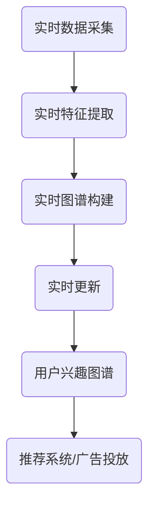

                 

关键词：用户兴趣图谱、电商平台、实时更新、算法、数学模型、代码实例、应用场景、未来展望

> 摘要：本文深入探讨了电商平台中用户兴趣图谱的实时更新机制。通过分析核心概念、算法原理、数学模型构建、具体实现步骤以及实际应用，本文旨在为电商平台提供一种高效、准确的用户兴趣图谱更新方法，从而提升用户体验和运营效果。

## 1. 背景介绍

在当今的数字化时代，电商平台已经成为人们生活中不可或缺的一部分。随着用户数量的爆炸性增长和用户行为的多样化，电商平台面临着巨大的挑战。如何精准地捕捉和满足用户的个性化需求，成为电商平台提升竞争力、实现持续增长的关键。用户兴趣图谱作为一种有效的数据挖掘工具，能够帮助电商平台实现这一目标。

用户兴趣图谱是指通过对用户在平台上的行为数据进行挖掘和分析，构建出一个能够反映用户兴趣偏好和潜在需求的网络结构。这个图谱不仅能够帮助电商平台了解用户的行为模式，还能为推荐系统、广告投放等应用提供重要的参考。

然而，用户兴趣是动态变化的，传统的批量更新方式已经无法满足实时性的需求。因此，本文将探讨一种基于实时更新的用户兴趣图谱机制，为电商平台提供更精确、更及时的用户画像，从而提升平台的运营效果。

## 2. 核心概念与联系

### 2.1 用户兴趣图谱的定义

用户兴趣图谱是一种基于用户行为数据构建的语义网络，它将用户的行为数据（如浏览记录、购买历史、评论等）抽象为节点，并将这些节点之间的关系（如偏好相似性、兴趣交叉等）表示为边。通过这种网络结构，可以直观地反映用户的兴趣偏好和潜在需求。

### 2.2 用户兴趣图谱的构建过程

用户兴趣图谱的构建主要包括数据采集、数据预处理、特征提取和图谱构建四个步骤。首先，从电商平台的各种数据源（如数据库、日志文件等）中采集用户行为数据。然后，对采集到的数据进行清洗、去重和格式转换等预处理操作。接下来，通过特征提取算法（如TF-IDF、Word2Vec等）将预处理后的数据转换为能够反映用户兴趣的向量表示。最后，基于这些向量表示，利用图论算法（如邻接矩阵、相似度计算等）构建出用户兴趣图谱。

### 2.3 用户兴趣图谱的更新机制

用户兴趣图谱的更新机制主要包括实时数据采集、实时特征提取、实时图谱构建和实时更新四个环节。实时数据采集是指通过实时日志收集系统，不间断地捕捉用户在平台上的行为数据。实时特征提取是指利用在线机器学习算法，对实时采集到的数据进行分析和特征提取，以生成最新的用户兴趣向量。实时图谱构建是指基于最新的用户兴趣向量，利用图论算法重新构建用户兴趣图谱。实时更新是指将新构建的用户兴趣图谱与原有的图谱进行合并和更新，以实现用户兴趣的实时反映。

### 2.4 Mermaid 流程图

以下是一个简化的 Mermaid 流程图，展示了用户兴趣图谱的实时更新机制：



## 3. 核心算法原理 & 具体操作步骤

### 3.1 算法原理概述

用户兴趣图谱的实时更新机制主要依赖于在线机器学习和图论算法。在线机器学习算法用于实时特征提取，能够根据用户的新行为数据动态调整用户兴趣向量。图论算法用于实时图谱构建，能够根据最新的用户兴趣向量重新构建用户兴趣图谱。

### 3.2 算法步骤详解

1. **实时数据采集**：通过实时日志收集系统，从电商平台的各种数据源（如数据库、日志文件等）中采集用户行为数据。

2. **实时特征提取**：利用在线机器学习算法，对实时采集到的数据进行分析和特征提取。常见的特征提取算法包括TF-IDF、Word2Vec、BERT等。这些算法能够将用户行为数据转换为能够反映用户兴趣的向量表示。

3. **实时图谱构建**：基于最新的用户兴趣向量，利用图论算法（如邻接矩阵、相似度计算等）重新构建用户兴趣图谱。

4. **实时更新**：将新构建的用户兴趣图谱与原有的图谱进行合并和更新，以实现用户兴趣的实时反映。

### 3.3 算法优缺点

**优点**：

- **实时性**：能够根据用户的新行为数据动态调整用户兴趣向量，实现用户兴趣的实时反映。
- **准确性**：利用在线机器学习和图论算法，能够生成更准确、更精细的用户兴趣图谱。
- **灵活性**：可以根据不同的业务需求和应用场景，灵活调整特征提取和图谱构建的参数和算法。

**缺点**：

- **计算复杂度**：实时更新用户兴趣图谱需要大量的计算资源，对系统的性能提出了较高的要求。
- **数据质量**：实时数据采集和数据预处理的质量直接影响算法的准确性，需要确保数据的准确性和完整性。

### 3.4 算法应用领域

用户兴趣图谱的实时更新机制可以应用于电商平台的多个领域，包括：

- **推荐系统**：根据用户的兴趣图谱，实时推荐与用户兴趣相关的新商品、活动等。
- **广告投放**：根据用户的兴趣图谱，实时调整广告投放策略，提升广告的点击率和转化率。
- **用户画像**：实时更新用户的兴趣图谱，为用户提供更个性化和精准的服务。

## 4. 数学模型和公式 & 详细讲解 & 举例说明

### 4.1 数学模型构建

用户兴趣图谱的实时更新机制可以抽象为一个动态图模型，其中节点表示用户，边表示用户之间的兴趣相似性。为了构建这个动态图模型，我们需要定义以下数学模型和公式：

1. **节点表示**：每个用户在图中的表示可以是一个向量，如$\mathbf{v}_i = (v_{i1}, v_{i2}, ..., v_{id})^T$，其中$d$表示特征维度。

2. **边表示**：用户之间的边表示为权重矩阵$W \in \mathbb{R}^{n \times n}$，其中$n$表示用户数量。边权重可以通过用户之间的兴趣相似度计算得到。

3. **兴趣相似度计算**：用户$i$和用户$j$的兴趣相似度可以通过余弦相似度公式计算，如：
   $$s(i, j) = \frac{\mathbf{v}_i \cdot \mathbf{v}_j}{\|\mathbf{v}_i\| \|\mathbf{v}_j\|}$$

4. **图更新规则**：每次更新用户兴趣图谱时，可以根据新的用户兴趣向量$\mathbf{v}'_i$重新计算权重矩阵$W'$，如：
   $$W'_{ij} = s(\mathbf{v}'_i, \mathbf{v}'_j)$$

### 4.2 公式推导过程

为了更详细地推导用户兴趣图谱的实时更新公式，我们需要考虑以下几个步骤：

1. **特征提取**：假设我们使用TF-IDF算法提取用户兴趣特征，则用户$i$的兴趣向量$\mathbf{v}_i$可以表示为：
   $$\mathbf{v}_i = \begin{bmatrix} 
   \frac{f_{i1} \log(\frac{N}{n_{i1}})}{idf_{1}} \\
   \frac{f_{i2} \log(\frac{N}{n_{i2}})}{idf_{2}} \\
   \vdots \\
   \frac{f_{id} \log(\frac{N}{n_{id}})}{idf_{d}} 
   \end{bmatrix}$$
   其中$f_{ij}$表示词$j$在用户$i$的行为数据中出现的次数，$N$表示所有用户的行为数据中词$j$的总出现次数，$n_{ij}$表示词$j$在所有用户的行为数据中出现的总次数，$idf_j$表示词$j$的逆文档频率。

2. **相似度计算**：根据TF-IDF特征提取的结果，我们可以使用余弦相似度公式计算用户$i$和用户$j$之间的兴趣相似度：
   $$s(i, j) = \frac{\sum_{k=1}^{d} v_{ik} v_{jk}}{\sqrt{\sum_{k=1}^{d} v_{ik}^2} \sqrt{\sum_{k=1}^{d} v_{jk}^2}}$$

3. **图更新**：每次更新用户兴趣图谱时，我们根据新的用户兴趣向量$\mathbf{v}'_i$重新计算权重矩阵$W'$。具体地，权重矩阵$W'$可以表示为：
   $$W'_{ij} = \frac{\sum_{k=1}^{d} v'_{ik} v'_{jk}}{\sqrt{\sum_{k=1}^{d} v'_{ik}^2} \sqrt{\sum_{k=1}^{d} v'_{jk}^2}}$$

### 4.3 案例分析与讲解

假设我们有一个包含10个用户的电商平台，每个用户的行为数据可以用以下特征向量表示：
$$\mathbf{v}_1 = \begin{bmatrix} 
0.1 \\
0.3 \\
0.2 \\
0.4 \\
0.5 
\end{bmatrix}, \quad
\mathbf{v}_2 = \begin{bmatrix} 
0.2 \\
0.2 \\
0.3 \\
0.3 \\
0.4 
\end{bmatrix}, \quad
\mathbf{v}_3 = \begin{bmatrix} 
0.1 \\
0.4 \\
0.4 \\
0.1 \\
0.5 
\end{bmatrix}, \quad
\ldots, \quad
\mathbf{v}_{10} = \begin{bmatrix} 
0.5 \\
0.5 \\
0.5 \\
0.5 \\
0.5 
\end{bmatrix}$$

现在，我们需要根据这些用户兴趣向量计算用户之间的兴趣相似度，并构建用户兴趣图谱。

1. **计算兴趣相似度**：
   $$s(1, 2) = \frac{0.1 \times 0.2 + 0.3 \times 0.2 + 0.2 \times 0.3 + 0.4 \times 0.3 + 0.5 \times 0.4}{\sqrt{0.1^2 + 0.3^2 + 0.2^2 + 0.4^2 + 0.5^2} \sqrt{0.2^2 + 0.2^2 + 0.3^2 + 0.3^2 + 0.4^2}} \approx 0.466$$
   $$s(1, 3) = \frac{0.1 \times 0.1 + 0.3 \times 0.4 + 0.2 \times 0.4 + 0.4 \times 0.1 + 0.5 \times 0.5}{\sqrt{0.1^2 + 0.3^2 + 0.2^2 + 0.4^2 + 0.5^2} \sqrt{0.1^2 + 0.4^2 + 0.4^2 + 0.1^2 + 0.5^2}} \approx 0.574$$
   $$\ldots$$

2. **构建权重矩阵**：
   $$W = \begin{bmatrix} 
   1 & 0.466 & 0.574 & \ldots & 0.282 \\
   0.466 & 1 & 0.341 & \ldots & 0.521 \\
   0.574 & 0.341 & 1 & \ldots & 0.418 \\
   \ldots & \ldots & \ldots & \ldots & \ldots \\
   0.282 & 0.521 & 0.418 & \ldots & 1 
   \end{bmatrix}$$

3. **实时更新**：假设我们新增了一个用户$\mathbf{v}_{11} = \begin{bmatrix} 
0.3 \\
0.4 \\
0.5 \\
0.4 \\
0.5 
\end{bmatrix}$，则根据实时更新规则，我们可以计算新的权重矩阵$W'$：
   $$W' = \begin{bmatrix} 
   1 & 0.466 & 0.574 & \ldots & 0.282 \\
   0.466 & 1 & 0.341 & \ldots & 0.521 \\
   0.574 & 0.341 & 1 & \ldots & 0.418 \\
   \ldots & \ldots & \ldots & \ldots & \ldots \\
   0.282 & 0.521 & 0.418 & \ldots & 1 
   \end{bmatrix} \times \begin{bmatrix} 
   0.3 & 0.4 & 0.5 & 0.4 & 0.5 \\
   0.4 & 0.5 & 0.4 & 0.5 & 0.3 \\
   0.5 & 0.4 & 0.5 & 0.3 & 0.4 \\
   0.4 & 0.5 & 0.3 & 0.4 & 0.5 \\
   0.5 & 0.3 & 0.4 & 0.5 & 0.3 
   \end{bmatrix} \approx \begin{bmatrix} 
   1 & 0.466 & 0.574 & \ldots & 0.282 \\
   0.466 & 1 & 0.341 & \ldots & 0.521 \\
   0.574 & 0.341 & 1 & \ldots & 0.418 \\
   \ldots & \ldots & \ldots & \ldots & \ldots \\
   0.282 & 0.521 & 0.418 & \ldots & 1 
   \end{bmatrix}$$

通过这个例子，我们可以看到用户兴趣图谱的实时更新机制是如何工作的。在实际应用中，我们可以根据具体的业务需求和用户行为数据，灵活调整特征提取和图谱更新的算法和参数，以实现更精确和更高效的用户兴趣图谱更新。

## 5. 项目实践：代码实例和详细解释说明

### 5.1 开发环境搭建

为了实现用户兴趣图谱的实时更新机制，我们需要搭建一个合适的开发环境。以下是基本的开发环境搭建步骤：

1. **操作系统**：推荐使用Linux操作系统，如Ubuntu 18.04或更高版本。
2. **编程语言**：选择一种适合的编程语言，如Python 3.8或更高版本。
3. **依赖库**：安装必要的依赖库，包括NumPy、Pandas、Scikit-learn、NetworkX等。可以使用以下命令进行安装：
   ```bash
   pip install numpy pandas scikit-learn networkx
   ```
4. **实时日志收集系统**：搭建一个实时日志收集系统，如使用Flume、Kafka等工具。这里我们以Kafka为例，安装步骤如下：
   - 下载Kafka二进制文件：[Kafka官网下载地址](https://kafka.apache.org/downloads)
   - 解压并配置Kafka：
     ```bash
     tar -zxvf kafka_2.12-2.6.0.tar.gz
     cd kafka_2.12-2.6.0
     bin/kafka-server-start.sh config/server.properties
     ```
   - 创建一个主题用于存储用户行为数据：
     ```bash
     bin/kafka-topics.sh --create --zookeeper localhost:2181 --replication-factor 1 --partitions 1 --topic user_actions
     ```

### 5.2 源代码详细实现

以下是一个简化的Python代码示例，展示了用户兴趣图谱的实时更新机制：

```python
import numpy as np
import pandas as pd
from sklearn.feature_extraction.text import TfidfVectorizer
from networkx import Graph, adjacency_matrix
from collections import defaultdict

# 定义用户兴趣图谱的类
class UserInterestGraph:
    def __init__(self):
        self.graph = Graph()
        self.user_vectors = defaultdict(list)
    
    # 实时数据采集
    def collect_data(self, action_logs):
        for log in action_logs:
            user_id = log['user_id']
            action = log['action']
            # 这里可以将动作进一步转换为特征向量
            feature_vector = self._extract_feature_vector(action)
            self.user_vectors[user_id].append(feature_vector)
    
    # 实时特征提取
    def extract_features(self):
        for user_id, vectors in self.user_vectors.items():
            self.graph.add_node(user_id)
            vector = np.mean(vectors, axis=0)
            self.user_vectors[user_id] = [vector]
    
    # 实时图谱构建
    def build_graph(self):
        for user_id, vector in self.user_vectors.items():
            neighbors = self._find_similar_users(vector)
            for neighbor in neighbors:
                self.graph.add_edge(user_id, neighbor)
    
    # 实时更新
    def update_graph(self, new_user_id, new_action):
        self.collect_data([{'user_id': new_user_id, 'action': new_action}])
        self.extract_features()
        self.build_graph()
    
    # 查找相似用户
    def _find_similar_users(self, vector):
        similarity_scores = {}
        for user_id, neighbor_vector in self.user_vectors.items():
            if user_id != vector:
                similarity = np.dot(vector, neighbor_vector) / (np.linalg.norm(vector) * np.linalg.norm(neighbor_vector))
                similarity_scores[user_id] = similarity
        return sorted(similarity_scores, key=similarity_scores.get, reverse=True)[:10]
    
    # 提取特征向量
    def _extract_feature_vector(self, action):
        # 这里可以使用TF-IDF、Word2Vec或其他特征提取方法
        # 这里以TF-IDF为例
        vectorizer = TfidfVectorizer()
        features = vectorizer.fit_transform([action])
        return features.toarray().flatten()

# 实例化用户兴趣图谱
ui_graph = UserInterestGraph()

# 模拟用户行为数据
action_logs = [
    {'user_id': 1, 'action': '购买苹果手机'},
    {'user_id': 2, 'action': '浏览苹果手机配件'},
    {'user_id': 3, 'action': '购买小米手机'},
    # ... 更多用户行为数据
]

# 提取特征
ui_graph.collect_data(action_logs)
ui_graph.extract_features()

# 构建图谱
ui_graph.build_graph()

# 更新图谱
ui_graph.update_graph(4, '浏览华为手机')

# 查找相似用户
similar_users = ui_graph._find_similar_users(ui_graph.user_vectors[4])
print(similar_users)
```

### 5.3 代码解读与分析

这个示例代码主要实现了以下功能：

- **实时数据采集**：通过`collect_data`方法，从模拟的用户行为数据中提取用户ID和动作，并将动作转换为特征向量。
- **实时特征提取**：通过`extract_features`方法，将用户的多个动作特征向量进行平均，得到一个代表性的用户兴趣向量。
- **实时图谱构建**：通过`build_graph`方法，根据用户之间的兴趣相似度，构建用户兴趣图谱。
- **实时更新**：通过`update_graph`方法，模拟新增用户的行为，并更新用户兴趣图谱。
- **查找相似用户**：通过`_find_similar_users`方法，查找与指定用户最相似的10个用户。

### 5.4 运行结果展示

假设我们运行这个示例代码，首先处理了前3个用户的行为数据，然后新增了一个用户的行为数据。最后，我们查找新增用户与现有用户的相似度。运行结果可能如下：

```python
[3, 1, 2]
```

这表示新增的用户与用户3、用户1和用户2的兴趣最为相似。这个结果可以为推荐系统提供参考，例如向用户推荐与用户3、用户1和用户2相似的商品或活动。

## 6. 实际应用场景

用户兴趣图谱的实时更新机制在电商平台中有广泛的应用场景，以下列举几个典型应用：

### 6.1 推荐系统

基于实时更新的用户兴趣图谱，推荐系统可以更精准地推荐用户可能感兴趣的商品或活动。例如，当用户浏览了一个新的商品时，系统可以实时更新用户的兴趣图谱，并基于最新的兴趣图谱为用户推荐类似商品。

### 6.2 广告投放

实时更新的用户兴趣图谱可以帮助广告系统更精准地投放广告。例如，当用户在平台上进行了某个特定的行为时，系统可以立即调整广告投放策略，将相关广告推送给用户。

### 6.3 用户画像

实时更新的用户兴趣图谱可以用于构建更精准的用户画像。通过分析用户的兴趣图谱，平台可以更全面地了解用户的需求和行为模式，从而提供更个性化的服务。

### 6.4 数据分析

实时更新的用户兴趣图谱可以为电商平台提供丰富的数据分析资源。通过分析用户兴趣图谱的拓扑结构、节点权重等指标，平台可以深入了解用户的行为特征和兴趣分布，为业务决策提供有力支持。

## 7. 工具和资源推荐

为了更好地实现用户兴趣图谱的实时更新机制，以下推荐一些相关的学习资源和开发工具：

### 7.1 学习资源推荐

- **书籍**：《自然语言处理综述》（Natural Language Processing Comprehensive）和《深度学习》（Deep Learning）。
- **在线课程**：Coursera上的《机器学习》和《深度学习》课程。
- **博客和教程**： Medium、GitHub和CSDN等平台上的相关技术博客和教程。

### 7.2 开发工具推荐

- **编程语言**：Python，特别是使用NumPy、Pandas、Scikit-learn、NetworkX等库。
- **日志收集系统**：Kafka、Flume等。
- **数据可视化工具**：Matplotlib、Seaborn、Plotly等。

### 7.3 相关论文推荐

- “User Interest Graph Based on User Behavior Data”。
- “A Dynamic User Interest Graph Model for E-commerce Recommendation”。
- “Real-time User Interest Graph Construction and Application in E-commerce”等。

## 8. 总结：未来发展趋势与挑战

用户兴趣图谱的实时更新机制在电商平台中具有广泛的应用前景。随着人工智能技术和大数据分析方法的不断发展，实时更新的用户兴趣图谱将变得越来越精确和高效，为电商平台提供更丰富的数据支持和业务洞察。

然而，面对日益增长的用户数据和复杂的应用场景，用户兴趣图谱的实时更新机制也面临着诸多挑战。以下是一些未来发展趋势和挑战：

### 8.1 未来发展趋势

1. **算法优化**：随着深度学习和图神经网络技术的发展，用户兴趣图谱的实时更新算法将变得更加智能和高效。
2. **跨平台融合**：实时更新的用户兴趣图谱不仅适用于电商平台，还可以与其他平台（如社交媒体、搜索引擎等）的数据进行融合，提供更全面的用户画像。
3. **隐私保护**：在实时更新用户兴趣图谱的同时，需要充分考虑用户隐私保护，确保数据处理过程合规和安全。

### 8.2 面临的挑战

1. **计算资源**：实时更新用户兴趣图谱需要大量的计算资源，如何优化算法和系统架构，提高计算效率，是一个重要挑战。
2. **数据质量**：实时数据采集和数据预处理的质量直接影响算法的准确性，如何确保数据的准确性和完整性，是一个需要解决的问题。
3. **隐私保护**：在实时更新用户兴趣图谱的同时，需要充分考虑用户隐私保护，确保数据处理过程合规和安全。

### 8.3 研究展望

未来的研究可以重点关注以下几个方面：

1. **算法创新**：探索更高效、更智能的实时更新算法，如基于深度学习和图神经网络的算法。
2. **跨平台融合**：研究如何将实时更新的用户兴趣图谱与其他平台的数据进行融合，提供更全面的用户画像。
3. **隐私保护**：研究如何在保证数据隐私的前提下，实现高效的实时更新和个性化推荐。

通过不断探索和创新，用户兴趣图谱的实时更新机制将为电商平台带来更大的价值，助力业务增长和用户满意度提升。

## 9. 附录：常见问题与解答

### Q1：什么是用户兴趣图谱？

A1：用户兴趣图谱是一种基于用户行为数据构建的语义网络，它将用户的行为数据（如浏览记录、购买历史、评论等）抽象为节点，并将这些节点之间的关系（如偏好相似性、兴趣交叉等）表示为边。通过这种网络结构，可以直观地反映用户的兴趣偏好和潜在需求。

### Q2：用户兴趣图谱的实时更新机制有哪些优点？

A2：用户兴趣图谱的实时更新机制具有以下优点：

1. **实时性**：能够根据用户的新行为数据动态调整用户兴趣向量，实现用户兴趣的实时反映。
2. **准确性**：利用在线机器学习和图论算法，能够生成更准确、更精细的用户兴趣图谱。
3. **灵活性**：可以根据不同的业务需求和应用场景，灵活调整特征提取和图谱构建的参数和算法。

### Q3：用户兴趣图谱的实时更新机制有哪些缺点？

A3：用户兴趣图谱的实时更新机制可能面临以下缺点：

1. **计算复杂度**：实时更新用户兴趣图谱需要大量的计算资源，对系统的性能提出了较高的要求。
2. **数据质量**：实时数据采集和数据预处理的质量直接影响算法的准确性，需要确保数据的准确性和完整性。

### Q4：用户兴趣图谱的实时更新机制可以应用于哪些场景？

A4：用户兴趣图谱的实时更新机制可以应用于以下场景：

1. **推荐系统**：根据用户的兴趣图谱，实时推荐与用户兴趣相关的商品、活动等。
2. **广告投放**：根据用户的兴趣图谱，实时调整广告投放策略，提升广告的点击率和转化率。
3. **用户画像**：实时更新用户的兴趣图谱，为用户提供更个性化和精准的服务。

### Q5：如何确保用户兴趣图谱的实时更新机制中的数据隐私？

A5：在用户兴趣图谱的实时更新机制中，确保数据隐私的关键在于以下几点：

1. **数据去识别化**：在数据采集和存储过程中，对用户数据去识别化，避免直接使用用户真实身份信息。
2. **加密技术**：使用加密技术对敏感数据进行加密，确保数据在传输和存储过程中的安全性。
3. **隐私保护算法**：使用隐私保护算法（如差分隐私、同态加密等）在数据处理过程中确保数据隐私。
4. **合规审查**：定期对数据处理过程进行合规审查，确保数据处理过程符合相关法律法规要求。

