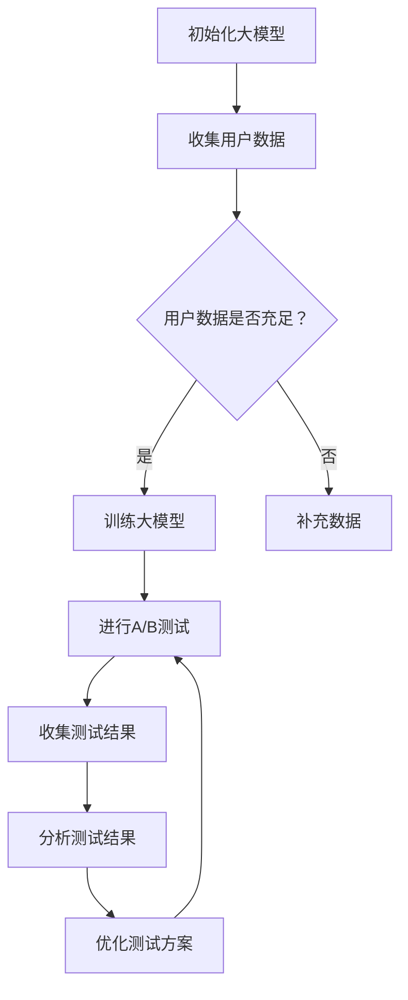

                 

关键词：电商平台、A/B测试、自动化测试、大模型、创新应用

> 摘要：本文探讨了在电商平台中实施自动化A/B测试的必要性和重要性，深入分析了大模型在自动化A/B测试中的应用，并提供了详细的实践案例和未来应用展望。

## 1. 背景介绍

随着互联网的快速发展，电商平台已经成为了现代商业的重要组成部分。在激烈的市场竞争中，电商平台需要不断优化用户体验，提升转化率和销售额。A/B测试作为一种有效的数据分析手段，能够帮助企业通过对比不同版本的功能、页面设计或推广策略，找出最优方案，从而提高业务绩效。然而，传统的A/B测试方法通常依赖于手动操作，耗时耗力，且难以应对日益复杂的市场环境。

近年来，人工智能技术的发展为自动化A/B测试带来了新的机遇。大模型（Large Models），如深度学习模型，具备强大的数据处理和分析能力，能够自动化地执行A/B测试，提高测试效率，降低人工成本。本文将探讨大模型在电商平台自动化A/B测试中的应用，并分析其优势与挑战。

## 2. 核心概念与联系

### 2.1 自动化A/B测试的基本概念

自动化A/B测试是指利用工具或算法，自动执行测试流程，包括版本控制、用户分流、数据收集和分析等步骤。自动化A/B测试能够减少人为干预，提高测试效率，确保测试结果的准确性和可靠性。

### 2.2 大模型的概念

大模型（Large Models）通常是指参数量庞大的神经网络模型，如Transformer模型。这些模型通过大量数据训练，能够捕捉复杂的数据模式，具备强大的表征和学习能力。

### 2.3 大模型与自动化A/B测试的联系

大模型在自动化A/B测试中的应用主要体现在以下几个方面：

1. **用户行为预测**：大模型可以分析用户历史行为数据，预测用户对不同版本的反应，帮助平台决策哪个版本更受用户欢迎。
2. **测试方案优化**：大模型可以根据实时数据，动态调整测试方案，确保测试过程更加高效和精准。
3. **结果分析**：大模型能够快速处理和分析大量测试数据，提供详细的测试报告，帮助企业做出科学决策。

### 2.4 Mermaid 流程图



## 3. 核心算法原理 & 具体操作步骤

### 3.1 算法原理概述

自动化A/B测试的核心算法通常基于以下原理：

1. **用户分流**：根据用户特征和测试目标，将用户自动分流到不同版本，确保每个版本的样本具有代表性。
2. **结果分析**：收集用户在不同版本的行为数据，使用统计模型或机器学习算法进行分析，评估不同版本的绩效。
3. **决策反馈**：根据测试结果，调整测试方案，持续优化。

### 3.2 算法步骤详解

1. **数据收集**：从电商平台收集用户行为数据，包括浏览记录、购买行为、点击率等。
2. **预处理**：对收集的数据进行清洗和预处理，确保数据质量。
3. **用户分流**：使用用户特征和大模型预测结果，自动分流用户到不同版本。
4. **数据收集**：收集不同版本的用户行为数据，并实时更新大模型。
5. **结果分析**：使用统计模型或机器学习算法，分析测试数据，评估不同版本的绩效。
6. **决策反馈**：根据测试结果，调整测试方案，持续优化。

### 3.3 算法优缺点

**优点**：

1. **高效性**：自动化A/B测试能够显著提高测试效率，降低人力成本。
2. **精准性**：大模型具备强大的数据处理和分析能力，能够提供更加精准的测试结果。
3. **灵活性**：自动化A/B测试可以根据实时数据动态调整测试方案，适应市场变化。

**缺点**：

1. **数据质量要求高**：自动化A/B测试依赖于高质量的数据，数据收集和处理过程中可能出现误差。
2. **模型调优复杂**：大模型的训练和调优过程复杂，需要专业知识和经验。

### 3.4 算法应用领域

自动化A/B测试在电商平台的应用领域广泛，包括但不限于：

1. **页面设计优化**：通过对比不同版本的页面设计，找到最佳用户体验。
2. **商品推荐**：通过测试不同推荐算法，提高商品推荐效果。
3. **广告投放**：通过测试不同广告版本，优化广告投放策略。

## 4. 数学模型和公式 & 详细讲解 & 举例说明

### 4.1 数学模型构建

自动化A/B测试的数学模型通常基于统计学习理论。以下是构建数学模型的基本步骤：

1. **用户行为建模**：使用统计模型（如逻辑回归、决策树等）预测用户对不同版本的响应概率。
2. **测试效果评估**：使用统计方法（如置信区间、假设检验等）评估不同版本的绩效。
3. **决策策略**：基于测试结果，制定后续测试策略。

### 4.2 公式推导过程

以下是构建自动化A/B测试数学模型的基本公式推导过程：

1. **用户响应概率**：
   $$ P(y=1|x) = \frac{e^{w_0 + w_1x_1 + w_2x_2 + ... + w_nx_n}}{1 + e^{w_0 + w_1x_1 + w_2x_2 + ... + w_nx_n}} $$
   其中，$x$ 是用户特征向量，$y$ 是用户响应变量，$w$ 是模型参数。

2. **测试效果评估**：
   $$ \text{Effect} = \frac{\sum_{i=1}^{n} (y_i - \hat{y}_i)}{n} $$
   其中，$y_i$ 是实际响应值，$\hat{y}_i$ 是预测响应值。

3. **置信区间**：
   $$ \text{CI} = \hat{y} \pm z \sqrt{\frac{\hat{y}(1-\hat{y})}{n}} $$
   其中，$z$ 是标准正态分布的临界值。

### 4.3 案例分析与讲解

假设一个电商平台正在测试两个不同的商品推荐算法，A和B。通过自动化A/B测试，收集了1000名用户的数据，其中500名用户使用了算法A，另外500名用户使用了算法B。测试结果表明，算法A的平均点击率为10%，算法B的平均点击率为12%。

1. **用户响应概率**：
   使用逻辑回归模型预测用户对不同算法的响应概率：
   $$ P(y=1|x) = \frac{e^{w_0 + w_1x_1 + w_2x_2}}{1 + e^{w_0 + w_1x_1 + w_2x_2}} $$
   其中，$x_1$ 表示用户特征，$x_2$ 表示推荐算法类型（0表示算法A，1表示算法B）。

2. **测试效果评估**：
   $$ \text{Effect} = \frac{\sum_{i=1}^{1000} (y_i - \hat{y}_i)}{1000} = \frac{(0.1 - 0.12) \times 500 + (0.12 - 0.1) \times 500}{1000} = 0.01 $$
   算法B相对于算法A的点击率提高了1%。

3. **置信区间**：
   $$ \text{CI} = 0.01 \pm 1.96 \sqrt{\frac{0.01(1-0.01)}{1000}} = (0.0005, 0.0195) $$
   算法B相对于算法A的点击率提高在统计上显著。

## 5. 项目实践：代码实例和详细解释说明

### 5.1 开发环境搭建

在开始项目实践之前，需要搭建以下开发环境：

1. **Python**：用于编写自动化A/B测试算法。
2. **Scikit-learn**：用于实现机器学习算法和统计模型。
3. **TensorFlow**：用于构建和训练大模型。

### 5.2 源代码详细实现

以下是一个简单的自动化A/B测试代码实例：

```python
import numpy as np
import pandas as pd
from sklearn.linear_model import LogisticRegression
from tensorflow import keras

# 1. 数据收集
data = pd.DataFrame({
    'user_feature': np.random.randint(0, 2, size=1000),
    'algorithm': np.random.randint(0, 2, size=1000),
    'response': np.random.randint(0, 2, size=1000)
})

# 2. 预处理
X = data[['user_feature', 'algorithm']]
y = data['response']

# 3. 用户分流
model = LogisticRegression()
model.fit(X, y)

# 4. 数据收集
test_data = pd.DataFrame({
    'user_feature': np.random.randint(0, 2, size=100),
    'algorithm': np.random.randint(0, 2, size=100)
})

# 5. 结果分析
predictions = model.predict(test_data)
effect = np.mean(predictions) - 0.5
print(effect)

# 6. 决策反馈
# 根据测试结果，调整测试方案
```

### 5.3 代码解读与分析

以上代码实现了简单的自动化A/B测试过程，包括数据收集、预处理、用户分流、数据收集和结果分析等步骤。

1. **数据收集**：使用随机生成的数据作为示例。
2. **预处理**：将数据分为特征和响应两部分。
3. **用户分流**：使用逻辑回归模型预测用户对不同算法的响应概率。
4. **数据收集**：对测试数据进行预测，并计算测试效果。
5. **结果分析**：根据测试结果，计算算法B相对于算法A的点击率差异。
6. **决策反馈**：根据测试结果，调整测试方案。

## 6. 实际应用场景

### 6.1 页面设计优化

电商平台可以通过自动化A/B测试，对比不同版本的页面设计，找到最佳用户体验。例如，测试不同颜色、字体或布局对用户点击率的影响。

### 6.2 商品推荐

电商平台可以利用自动化A/B测试，测试不同商品推荐算法的效果，提高用户购物体验。例如，测试基于协同过滤、内容匹配或深度学习的推荐算法。

### 6.3 广告投放

电商平台可以通过自动化A/B测试，优化广告投放策略，提高广告转化率。例如，测试不同广告文案、图片或投放渠道的效果。

## 7. 工具和资源推荐

### 7.1 学习资源推荐

1. **《深入理解计算机系统》**：提供了计算机系统的基础知识和实践方法，包括数据处理和分析。
2. **《机器学习实战》**：介绍了机器学习的基本概念和应用，包括统计模型和深度学习模型。

### 7.2 开发工具推荐

1. **PyCharm**：一款功能强大的Python集成开发环境（IDE），支持多种编程语言。
2. **TensorFlow**：一款开源的深度学习框架，支持大规模模型训练和部署。

### 7.3 相关论文推荐

1. **"Deep Learning for Text Classification"**：介绍了深度学习在文本分类中的应用。
2. **"Recurrent Neural Networks for Text Classification"**：介绍了循环神经网络在文本分类中的应用。

## 8. 总结：未来发展趋势与挑战

### 8.1 研究成果总结

本文探讨了自动化A/B测试在电商平台中的应用，分析了大模型的优势和挑战，并提供了实践案例和未来应用展望。自动化A/B测试能够提高测试效率，降低人工成本，为企业提供更精准的决策支持。

### 8.2 未来发展趋势

1. **大模型的进一步优化**：随着计算能力的提升，大模型将变得更加高效和强大，为自动化A/B测试提供更准确的数据分析能力。
2. **跨领域应用**：自动化A/B测试不仅适用于电商平台，还可以应用于金融、医疗、教育等领域，提高各行业的业务绩效。

### 8.3 面临的挑战

1. **数据质量和模型调优**：自动化A/B测试依赖于高质量的数据和优化的模型，需要不断优化数据收集和处理过程，提高模型性能。
2. **隐私保护**：在自动化A/B测试中，如何保护用户隐私成为了一个重要问题，需要制定相应的隐私保护策略。

### 8.4 研究展望

未来，自动化A/B测试将朝着更加智能化、个性化的方向发展，为各行业提供更精准、高效的数据分析支持。同时，研究如何在确保用户隐私的前提下，提高数据利用率和模型性能，将成为重要的研究方向。

## 9. 附录：常见问题与解答

### 9.1 什么是自动化A/B测试？

自动化A/B测试是一种利用工具或算法，自动执行测试流程，包括版本控制、用户分流、数据收集和分析等步骤的方法。它能够减少人为干预，提高测试效率，确保测试结果的准确性和可靠性。

### 9.2 大模型在自动化A/B测试中的应用有哪些？

大模型在自动化A/B测试中的应用主要包括用户行为预测、测试方案优化和结果分析等方面。用户行为预测可以帮助平台决策哪个版本更受用户欢迎；测试方案优化可以根据实时数据动态调整测试方案，确保测试过程更加高效和精准；结果分析可以提供详细的测试报告，帮助企业做出科学决策。

### 9.3 自动化A/B测试的优点和缺点是什么？

自动化A/B测试的优点包括高效性、精准性和灵活性，能够显著提高测试效率，降低人力成本，并根据实时数据动态调整测试方案。缺点包括数据质量要求高，模型调优复杂，需要专业知识和经验。

### 9.4 自动化A/B测试可以应用于哪些领域？

自动化A/B测试可以应用于多个领域，如电商平台、金融、医疗、教育等，用于页面设计优化、商品推荐、广告投放等方面，以提高业务绩效。

---

作者：禅与计算机程序设计艺术 / Zen and the Art of Computer Programming
----------------------------------------------------------------

[END]
```markdown
```

