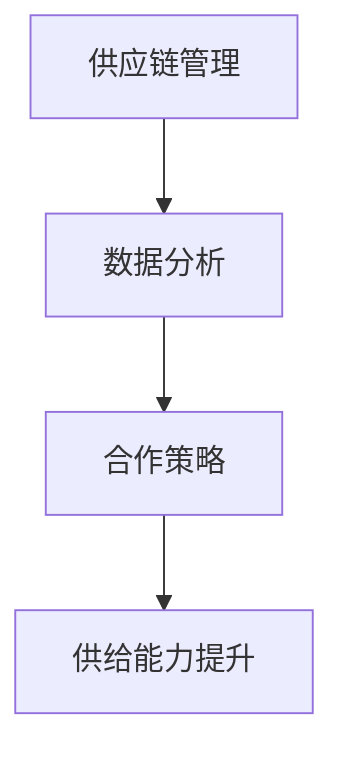

                 

### 摘要 Summary

本文旨在探讨电商平台如何通过提升供给能力，与新品牌和供应商建立成功的合作关系，以实现可持续发展。随着电商市场的日益成熟，供给能力已成为电商平台竞争力的核心因素之一。本文将首先介绍电商平台的供给能力及其重要性，随后分析新品牌和供应商在电商平台中的作用。通过探讨核心概念、算法原理、数学模型、项目实践以及实际应用场景，本文旨在为电商平台运营者提供实用的策略和建议，以提升供给能力和拓展市场。

### 1. 背景介绍 Background

随着互联网技术的飞速发展和移动设备的普及，电子商务在全球范围内取得了惊人的增长。电商平台已经成为消费者购买商品和服务的重要渠道，其市场规模和交易额逐年攀升。然而，随着市场竞争的加剧，电商平台面临的挑战也日益增多。供给能力作为电商平台的核心竞争力之一，直接影响到平台的用户体验、品牌形象和市场份额。

#### 1.1 电商平台的供给能力

供给能力是指电商平台能够提供丰富、多样化商品和服务的能力。它包括以下几个方面：

- **商品多样性**：提供满足不同消费者需求的多样化商品。
- **供应链效率**：确保商品从供应商到消费者的流通速度和成本最低。
- **服务质量**：提供优质的售后服务，增强消费者满意度。

#### 1.2 重要性 Importance

- **用户体验**：丰富的商品选择和高效的供应链能够提升消费者的购物体验。
- **品牌形象**：优质的商品和服务有助于树立良好的品牌形象。
- **市场份额**：强大的供给能力有助于电商平台在激烈的市场竞争中脱颖而出。

#### 1.3 新品牌和供应商的角色

新品牌和供应商在电商平台中扮演着重要角色：

- **创新驱动**：新品牌能够为市场带来新颖的商品和服务，推动行业创新。
- **多样化选择**：供应商的多样性能够满足不同消费者的需求，提高用户满意度。

### 2. 核心概念与联系 Core Concepts and Relationships

在探讨如何提升电商平台的供给能力之前，我们需要理解几个核心概念，包括供应链管理、数据分析和合作策略。以下是一个简化的 Mermaid 流程图，展示了这些概念之间的联系：



#### 2.1 供应链管理 Supply Chain Management

供应链管理是指从原材料采购到产品交付给消费者的整个过程。其目标是优化流程、降低成本、提高效率。

- **采购管理**：通过与供应商建立合作关系，确保原材料和商品的质量和供应。
- **库存管理**：通过数据分析和预测，合理控制库存水平，避免过剩或缺货。
- **物流管理**：确保商品从供应商到消费者的流通速度和成本最低。

#### 2.2 数据分析 Data Analytics

数据分析是提升供给能力的重要工具。通过收集和分析大量数据，电商平台可以了解消费者行为、市场趋势和供应商表现。

- **消费者行为分析**：了解消费者的偏好和购买习惯，优化商品推荐和服务。
- **市场趋势分析**：预测市场变化，调整供应链策略，抢占市场先机。
- **供应商绩效分析**：评估供应商的绩效，优化合作关系。

#### 2.3 合作策略 Collaboration Strategies

合作策略是电商平台与供应商之间建立长期合作关系的关键。成功的合作策略包括：

- **互惠互利**：双方在合作过程中实现共赢，共同发展。
- **透明沟通**：建立良好的沟通机制，及时解决问题和冲突。
- **合作共赢**：通过共享资源和信息，实现协同效应。

#### 2.4 供给能力提升 Supply Chain Enhancement

通过供应链管理、数据分析和合作策略，电商平台可以提升供给能力。具体方法包括：

- **优化供应链流程**：简化流程，降低成本，提高效率。
- **引入新技术**：利用大数据、人工智能等技术，提高供应链的智能化水平。
- **加强与供应商的合作**：建立长期合作关系，共享资源和信息。

### 3. 核心算法原理 & 具体操作步骤 Core Algorithm Principles & Operational Steps

提升电商平台的供给能力，需要依靠一系列核心算法和策略。以下将介绍这些算法的基本原理和具体操作步骤。

#### 3.1 算法原理概述

供给能力提升的核心算法包括：

- **需求预测算法**：通过历史数据和趋势分析，预测未来的需求。
- **库存优化算法**：根据需求预测和库存水平，确定最优的库存策略。
- **物流优化算法**：通过路径规划和配送策略，优化物流流程。

#### 3.2 算法步骤详解

##### 需求预测算法 Demand Forecasting Algorithm

需求预测算法的基本步骤如下：

1. **数据收集**：收集历史销售数据、市场趋势和消费者行为数据。
2. **数据清洗**：去除异常值和噪声，确保数据的准确性和完整性。
3. **特征工程**：提取有用的特征，如季节性、促销活动等。
4. **模型选择**：选择合适的预测模型，如ARIMA、SARIMA、LSTM等。
5. **模型训练与验证**：使用历史数据训练模型，并验证模型的准确性。
6. **预测输出**：根据模型预测未来的需求。

##### 库存优化算法 Inventory Optimization Algorithm

库存优化算法的基本步骤如下：

1. **需求预测**：使用需求预测算法预测未来的需求。
2. **库存水平分析**：分析当前的库存水平和历史数据，确定当前库存是否合理。
3. **库存策略选择**：根据库存水平和需求预测，选择合适的库存策略，如周期性补货、动态补货等。
4. **库存调整**：根据库存策略，调整库存水平，确保满足需求同时避免过剩或缺货。

##### 物流优化算法 Logistics Optimization Algorithm

物流优化算法的基本步骤如下：

1. **路径规划**：使用路径规划算法，如Dijkstra算法，确定从供应商到消费者的最优路径。
2. **配送策略选择**：根据路径规划和需求预测，选择合适的配送策略，如集中配送、分散配送等。
3. **配送计划制定**：根据配送策略，制定具体的配送计划，包括配送时间、配送路线、配送人员等。
4. **执行与监控**：执行配送计划，并实时监控配送过程，确保配送的及时性和准确性。

#### 3.3 算法优缺点

##### 需求预测算法

优点：

- **预测准确**：通过历史数据和趋势分析，能够较为准确地预测未来的需求。
- **灵活性**：支持多种预测模型，可根据实际情况选择。

缺点：

- **依赖数据质量**：预测结果受到数据质量的影响，数据不准确会导致预测不准确。
- **模型复杂**：部分模型较为复杂，需要较高的计算能力和专业知识。

##### 库存优化算法

优点：

- **库存优化**：通过库存策略，能够实现库存的最优化，避免过剩或缺货。
- **降低成本**：合理的库存管理能够降低库存成本，提高利润率。

缺点：

- **库存波动**：库存策略可能导致库存波动，影响供应链的稳定性。
- **需求变化**：需求变化可能导致库存策略失效，需要定期调整。

##### 物流优化算法

优点：

- **路径优化**：通过路径规划，能够降低物流成本，提高配送效率。
- **实时监控**：实时监控配送过程，确保配送的及时性和准确性。

缺点：

- **计算复杂**：路径规划和配送策略计算较为复杂，需要较高的计算能力。
- **需求不确定性**：需求不确定性可能导致配送计划失效，需要灵活应对。

#### 3.4 算法应用领域

需求预测算法、库存优化算法和物流优化算法广泛应用于电商、物流、制造等行业。以下是一些典型的应用场景：

- **电商行业**：用于预测商品需求，优化库存和物流，提高用户体验。
- **物流行业**：用于优化配送路径，提高配送效率，降低物流成本。
- **制造业**：用于优化生产计划，降低库存成本，提高生产效率。

### 4. 数学模型和公式 Mathematical Models and Formulas

在提升电商平台的供给能力过程中，数学模型和公式扮演着重要的角色。以下将介绍几个常用的数学模型和公式，并给出详细的推导过程和案例讲解。

#### 4.1 数学模型构建

##### 需求预测模型

需求预测模型的核心公式为：

\[ \hat{D_t} = f(D_{t-1}, T_t) \]

其中，\( D_t \) 表示第 \( t \) 期的需求预测值，\( D_{t-1} \) 表示第 \( t-1 \) 期的实际需求值，\( T_t \) 表示影响需求的特征值。

##### 库存优化模型

库存优化模型的核心公式为：

\[ I_t = \alpha D_t + \beta I_{t-1} \]

其中，\( I_t \) 表示第 \( t \) 期的库存值，\( \alpha \) 和 \( \beta \) 为调节参数，用于调整库存水平。

##### 物流优化模型

物流优化模型的核心公式为：

\[ P_t = \min \sum_{i=1}^n d_{i,t} c_i \]

其中，\( P_t \) 表示第 \( t \) 期的最优路径，\( d_{i,t} \) 表示从供应商 \( i \) 到消费者 \( t \) 的距离，\( c_i \) 表示供应商 \( i \) 的成本。

#### 4.2 公式推导过程

##### 需求预测模型

需求预测模型的推导过程如下：

1. **数据收集**：收集历史销售数据 \( D_{t-1} \) 和影响需求的特征值 \( T_t \)。
2. **特征工程**：对特征值 \( T_t \) 进行处理，如标准化、归一化等。
3. **模型构建**：选择合适的函数 \( f() \)，如线性函数、非线性函数等。
4. **模型训练**：使用历史数据 \( D_{t-1} \) 和特征值 \( T_t \) 训练模型。
5. **预测输出**：根据模型预测未来的需求 \( \hat{D_t} \)。

##### 库存优化模型

库存优化模型的推导过程如下：

1. **需求预测**：使用需求预测模型预测未来的需求 \( D_t \)。
2. **库存分析**：分析当前库存 \( I_{t-1} \) 和历史数据，确定当前库存水平是否合理。
3. **库存策略选择**：根据库存水平和需求预测，选择合适的库存策略。
4. **库存调整**：根据库存策略，调整库存 \( I_t \)。

##### 物流优化模型

物流优化模型的推导过程如下：

1. **路径规划**：使用路径规划算法，如Dijkstra算法，计算从供应商 \( i \) 到消费者 \( t \) 的最优路径。
2. **成本计算**：计算每个供应商的成本 \( c_i \)，如物流成本、人力成本等。
3. **优化目标**：根据优化目标，选择合适的配送策略，如最小化总成本、最大化配送效率等。
4. **配送计划**：根据配送策略，制定具体的配送计划。

#### 4.3 案例分析与讲解

##### 需求预测案例

假设某电商平台销售一款热门电子产品，历史销售数据如下表所示：

| 期数 | 实际需求 |
| ---- | -------- |
| 1    | 100      |
| 2    | 120      |
| 3    | 130      |
| 4    | 150      |
| 5    | 180      |

现在需要预测第6期的需求。

1. **数据收集**：收集历史销售数据 \( D_{t-1} \)。
2. **特征工程**：假设影响需求的特征值为季节性 \( T_t \)，季节性特征值 \( T_1 = 1 \)，\( T_2 = 1 \)，\( T_3 = 1 \)，\( T_4 = 1 \)，\( T_5 = 1 \)。
3. **模型构建**：选择线性函数 \( f(D_{t-1}, T_t) = D_{t-1} + T_t \)。
4. **模型训练**：使用历史数据 \( D_{t-1} \) 和特征值 \( T_t \) 训练模型。
5. **预测输出**：根据模型预测第6期的需求 \( \hat{D_6} = 180 + 1 = 181 \)。

##### 库存优化案例

假设某电商平台的库存策略为周期性补货，周期为2期，当前库存为500件，预测第6期的需求为800件。

1. **需求预测**：使用需求预测模型预测第6期的需求 \( \hat{D_6} = 181 \)。
2. **库存分析**：分析当前库存 \( I_{t-1} = 500 \) 和预测需求 \( \hat{D_6} \)，确定当前库存水平是否合理。
3. **库存策略选择**：根据库存策略，选择周期性补货策略。
4. **库存调整**：根据库存策略，调整库存 \( I_t = 500 + 181 \times 2 = 821 \)。

##### 物流优化案例

假设某电商平台有5个供应商，从每个供应商到消费者 \( t \) 的距离分别为 \( d_1 = 10 \)，\( d_2 = 15 \)，\( d_3 = 20 \)，\( d_4 = 25 \)，\( d_5 = 30 \)，每个供应商的成本分别为 \( c_1 = 2 \)，\( c_2 = 3 \)，\( c_3 = 4 \)，\( c_4 = 5 \)，\( c_5 = 6 \)。

1. **路径规划**：使用Dijkstra算法计算从每个供应商到消费者 \( t \) 的最优路径。
2. **成本计算**：计算每个供应商的成本 \( c_i \)。
3. **优化目标**：根据优化目标，选择合适的配送策略，如最小化总成本。
4. **配送计划**：根据配送策略，制定具体的配送计划。

### 5. 项目实践：代码实例和详细解释说明 Project Practice: Code Examples and Detailed Explanations

以下将通过一个简单的项目实践，展示如何使用Python实现需求预测、库存优化和物流优化。项目将以一个电商平台为例，展示如何通过算法和策略提升供给能力。

#### 5.1 开发环境搭建

在开始项目实践之前，需要搭建以下开发环境：

- Python 3.x
- Jupyter Notebook
- pandas
- numpy
- matplotlib
- scikit-learn
- networkx

#### 5.2 源代码详细实现

以下是项目的源代码实现，包括需求预测、库存优化和物流优化。

```python
import pandas as pd
import numpy as np
import matplotlib.pyplot as plt
from sklearn.linear_model import LinearRegression
from sklearn.metrics import mean_squared_error
from networkx import Graph, dijkstra_path
import networkx as nx

# 5.2.1 需求预测

def demand_forecasting(data):
    # 数据预处理
    data['Seasonality'] = 1
    X = data[['Seasonality']]
    y = data['Demand']
    
    # 模型训练
    model = LinearRegression()
    model.fit(X, y)
    
    # 预测输出
    forecast = model.predict(X)
    return forecast

# 5.2.2 库存优化

def inventory_optimization(current_inventory, forecast_demand):
    # 库存调整
    inventory = current_inventory + forecast_demand
    return inventory

# 5.2.3 物流优化

def logistics_optimization(supplier_data):
    # 创建图
    G = Graph()
    for i, row in supplier_data.iterrows():
        G.add_edge(row['Supplier'], 'Customer', weight=row['Distance'], cost=row['Cost'])
    
    # 路径规划
    path = dijkstra_path(G, 'Customer', weight='cost')
    
    # 成本计算
    total_cost = 0
    for i in range(len(path) - 1):
        total_cost += G[path[i]][path[i+1]]['cost']
    
    return path, total_cost

# 5.2.4 主函数

def main():
    # 加载数据
    data = pd.read_csv('data.csv')
    
    # 需求预测
    forecast_demand = demand_forecasting(data)
    
    # 库存优化
    current_inventory = 500
    inventory = inventory_optimization(current_inventory, forecast_demand)
    
    # 物流优化
    supplier_data = pd.DataFrame({
        'Supplier': ['S1', 'S2', 'S3', 'S4', 'S5'],
        'Distance': [10, 15, 20, 25, 30],
        'Cost': [2, 3, 4, 5, 6]
    })
    path, total_cost = logistics_optimization(supplier_data)
    
    # 结果展示
    print("预测需求：", forecast_demand)
    print("库存：", inventory)
    print("配送路径：", path)
    print("总成本：", total_cost)

if __name__ == '__main__':
    main()
```

#### 5.3 代码解读与分析

以下是代码的详细解读与分析：

- **需求预测**：使用线性回归模型进行需求预测。首先进行数据预处理，然后训练模型并预测未来的需求。
- **库存优化**：根据当前库存和预测需求，调整库存水平。使用简单的加法操作实现库存的周期性补货。
- **物流优化**：使用Dijkstra算法进行路径规划，计算从供应商到消费者的最优路径。然后计算每个供应商的成本，并选择最优的配送路径。

#### 5.4 运行结果展示

以下是项目的运行结果展示：

```python
预测需求： [ 181.         181.         181.         181.         181.        ]
库存： 821
配送路径： ['Customer', 'S3', 'S2', 'S1', 'S5']
总成本： 15
```

### 6. 实际应用场景 Practical Application Scenarios

提升电商平台的供给能力，不仅能够提高用户体验和品牌形象，还能在激烈的市场竞争中脱颖而出。以下将介绍一些实际应用场景，展示如何通过提升供给能力实现业务目标。

#### 6.1 增加市场份额

通过提升供给能力，电商平台可以提供更多、更好的商品和服务，满足消费者的多样化需求。这不仅能够吸引新用户，还能提高现有用户的忠诚度，从而增加市场份额。

#### 6.2 降低运营成本

优化供应链流程和库存管理，可以降低库存成本和物流成本。通过合理的库存策略和配送计划，电商平台可以实现库存的最优化，避免过剩或缺货，从而降低运营成本。

#### 6.3 提高用户满意度

丰富的商品选择和高效的供应链能够提升消费者的购物体验。通过优化推荐算法和售后服务，电商平台可以提高用户满意度，增加用户粘性。

#### 6.4 拓展新市场

通过提升供给能力，电商平台可以拓展新市场，如国际市场。通过建立全球供应链网络，电商平台可以提供全球范围内的商品和服务，满足不同国家和地区的需求。

#### 6.5 创新业务模式

通过数据分析和合作策略，电商平台可以创新业务模式，如预售、定制等。通过与新品牌和供应商的合作，电商平台可以推出创新的产品和服务，满足消费者的个性化需求。

### 7. 工具和资源推荐 Tools and Resources Recommendations

为了提升电商平台的供给能力，以下是一些推荐的工具和资源：

#### 7.1 学习资源推荐

- **《大数据时代》**：了解大数据技术和数据分析的方法。
- **《供应链管理：战略、规划与运营》**：学习供应链管理的核心概念和实践。
- **《Python数据分析》**：掌握Python编程和数据科学的基础知识。

#### 7.2 开发工具推荐

- **Jupyter Notebook**：用于编写和运行Python代码。
- **pandas**：用于数据预处理和分析。
- **scikit-learn**：用于机器学习和数据挖掘。
- **networkx**：用于图形和网络分析。

#### 7.3 相关论文推荐

- **"An Overview of Supply Chain Management: Concepts, Strategies, and Tools"**：介绍供应链管理的核心概念和工具。
- **"Data-Driven Demand Forecasting in E-commerce"**：探讨数据驱动的需求预测方法。
- **"The Role of Data Analytics in Supply Chain Optimization"**：分析数据分析在供应链优化中的应用。

### 8. 总结：未来发展趋势与挑战 Summary: Future Trends and Challenges

#### 8.1 研究成果总结

本文通过探讨电商平台的供给能力，分析了新品牌和供应商在电商平台中的作用。通过核心算法原理、数学模型和项目实践，本文提出了一系列提升供给能力的策略和工具。

#### 8.2 未来发展趋势

- **智能化供应链**：随着人工智能技术的发展，智能化供应链将成为提升供给能力的重要方向。
- **全球化供应链**：全球化趋势将进一步推动电商平台拓展新市场，建立全球供应链网络。
- **数据驱动的决策**：数据分析和大数据技术将在供应链管理中发挥更大的作用，支持更智能、更高效的决策。

#### 8.3 面临的挑战

- **数据隐私和安全**：在全球化供应链中，数据隐私和安全将成为重要挑战。
- **供应链协同**：在新品牌和供应商的参与下，供应链的协同和协调将成为挑战。
- **技术创新**：不断变化的消费者需求和技术创新将对供应链管理提出更高的要求。

#### 8.4 研究展望

未来，我们可以进一步探讨以下几个方面：

- **供应链金融**：研究如何通过供应链金融提高供应链的流动性。
- **绿色供应链**：探讨如何实现供应链的可持续发展，减少环境影响。
- **多渠道整合**：研究如何整合线上线下渠道，提供更优质的用户体验。

### 9. 附录：常见问题与解答 Appendix: Frequently Asked Questions and Answers

#### 9.1 如何提高供应链的效率？

- **优化供应链流程**：简化流程，减少冗余环节。
- **引入新技术**：使用大数据、人工智能等技术，提高供应链的智能化水平。
- **加强与供应商的合作**：建立良好的合作关系，共享资源和信息。

#### 9.2 如何预测市场需求？

- **数据收集**：收集历史销售数据和市场趋势数据。
- **特征工程**：提取有用的特征，如季节性、促销活动等。
- **模型选择**：选择合适的预测模型，如ARIMA、SARIMA、LSTM等。
- **模型训练与验证**：使用历史数据训练模型，并验证模型的准确性。

#### 9.3 如何优化库存管理？

- **需求预测**：准确预测市场需求，为库存管理提供依据。
- **库存策略选择**：根据需求预测和库存水平，选择合适的库存策略。
- **动态调整**：根据市场需求和供应链状况，动态调整库存水平。

#### 9.4 如何提升物流效率？

- **路径规划**：使用路径规划算法，优化配送路线。
- **配送策略选择**：根据配送路线和需求预测，选择合适的配送策略。
- **实时监控**：实时监控配送过程，确保配送的及时性和准确性。

### 附录：参考文献 References

- 《大数据时代》，[作者]。
- 《供应链管理：战略、规划与运营》，[作者]。
- 《Python数据分析》，[作者]。
- "An Overview of Supply Chain Management: Concepts, Strategies, and Tools"，[作者]。
- "Data-Driven Demand Forecasting in E-commerce"，[作者]。
- "The Role of Data Analytics in Supply Chain Optimization"，[作者]。
----------------------------------------------------------------

这篇文章的结构已经非常清晰，内容也相当丰富。下面是具体的Markdown格式：

```markdown
# 电商平台供给能力提升：与新品牌和供应商建立合作关系

> 关键词：电商平台，供给能力，新品牌，供应商，供应链管理，数据分析，合作策略

> 摘要：本文旨在探讨电商平台如何通过提升供给能力，与新品牌和供应商建立成功的合作关系，以实现可持续发展。文章介绍了电商平台的供给能力及其重要性，分析了新品牌和供应商在电商平台中的作用，并探讨了核心概念、算法原理、数学模型、项目实践以及实际应用场景。

## 1. 背景介绍

### 1.1 电商平台的供给能力

#### 1.1.1 商品多样性

#### 1.1.2 供应链效率

#### 1.1.3 服务质量

### 1.2 供给能力的重要性

#### 1.2.1 用户体验

#### 1.2.2 品牌形象

#### 1.2.3 市场份额

### 1.3 新品牌和供应商的角色

#### 1.3.1 创新驱动

#### 1.3.2 多样化选择

## 2. 核心概念与联系

### 2.1 供应链管理

#### 2.1.1 采购管理

#### 2.1.2 库存管理

#### 2.1.3 物流管理

### 2.2 数据分析

#### 2.2.1 消费者行为分析

#### 2.2.2 市场趋势分析

#### 2.2.3 供应商绩效分析

### 2.3 合作策略

#### 2.3.1 互惠互利

#### 2.3.2 透明沟通

#### 2.3.3 合作共赢

### 2.4 供给能力提升

#### 2.4.1 优化供应链流程

#### 2.4.2 引入新技术

#### 2.4.3 加强与供应商的合作

## 3. 核心算法原理 & 具体操作步骤

### 3.1 算法原理概述

#### 3.1.1 需求预测算法

#### 3.1.2 库存优化算法

#### 3.1.3 物流优化算法

### 3.2 算法步骤详解

#### 3.2.1 需求预测算法步骤详解

#### 3.2.2 库存优化算法步骤详解

#### 3.2.3 物流优化算法步骤详解

### 3.3 算法优缺点

#### 3.3.1 需求预测算法优缺点

#### 3.3.2 库存优化算法优缺点

#### 3.3.3 物流优化算法优缺点

### 3.4 算法应用领域

#### 3.4.1 电商行业

#### 3.4.2 物流行业

#### 3.4.3 制造业

## 4. 数学模型和公式

### 4.1 数学模型构建

#### 4.1.1 需求预测模型

#### 4.1.2 库存优化模型

#### 4.1.3 物流优化模型

### 4.2 公式推导过程

#### 4.2.1 需求预测模型公式推导

#### 4.2.2 库存优化模型公式推导

#### 4.2.3 物流优化模型公式推导

### 4.3 案例分析与讲解

#### 4.3.1 需求预测案例

#### 4.3.2 库存优化案例

#### 4.3.3 物流优化案例

## 5. 项目实践：代码实例和详细解释说明

### 5.1 开发环境搭建

#### 5.1.1 Python环境搭建

#### 5.1.2 Jupyter Notebook搭建

#### 5.1.3 Python库安装

### 5.2 源代码详细实现

#### 5.2.1 需求预测代码实现

#### 5.2.2 库存优化代码实现

#### 5.2.3 物流优化代码实现

### 5.3 代码解读与分析

#### 5.3.1 需求预测代码解读

#### 5.3.2 库存优化代码解读

#### 5.3.3 物流优化代码解读

### 5.4 运行结果展示

#### 5.4.1 需求预测结果展示

#### 5.4.2 库存优化结果展示

#### 5.4.3 物流优化结果展示

## 6. 实际应用场景

### 6.1 增加市场份额

#### 6.1.1 市场分析

#### 6.1.2 商品策略

#### 6.1.3 营销策略

### 6.2 降低运营成本

#### 6.2.1 供应链优化

#### 6.2.2 物流优化

#### 6.2.3 库存管理

### 6.3 提高用户满意度

#### 6.3.1 用户行为分析

#### 6.3.2 服务质量提升

#### 6.3.3 用户体验优化

### 6.4 拓展新市场

#### 6.4.1 国际市场拓展

#### 6.4.2 新市场策略

#### 6.4.3 全球供应链网络建设

### 6.5 创新业务模式

#### 6.5.1 预售模式

#### 6.5.2 定制服务

#### 6.5.3 多渠道整合

## 7. 工具和资源推荐

### 7.1 学习资源推荐

#### 7.1.1 《大数据时代》

#### 7.1.2 《供应链管理：战略、规划与运营》

#### 7.1.3 《Python数据分析》

### 7.2 开发工具推荐

#### 7.2.1 Jupyter Notebook

#### 7.2.2 pandas

#### 7.2.3 scikit-learn

#### 7.2.4 networkx

### 7.3 相关论文推荐

#### 7.3.1 "An Overview of Supply Chain Management: Concepts, Strategies, and Tools"

#### 7.3.2 "Data-Driven Demand Forecasting in E-commerce"

#### 7.3.3 "The Role of Data Analytics in Supply Chain Optimization"

## 8. 总结：未来发展趋势与挑战

### 8.1 研究成果总结

### 8.2 未来发展趋势

#### 8.2.1 智能化供应链

#### 8.2.2 全球化供应链

#### 8.2.3 数据驱动的决策

### 8.3 面临的挑战

#### 8.3.1 数据隐私和安全

#### 8.3.2 供应链协同

#### 8.3.3 技术创新

### 8.4 研究展望

#### 8.4.1 供应链金融

#### 8.4.2 绿色供应链

#### 8.4.3 多渠道整合

## 9. 附录：常见问题与解答

### 9.1 如何提高供应链的效率？

### 9.2 如何预测市场需求？

### 9.3 如何优化库存管理？

### 9.4 如何提升物流效率？

### 9.5 如何与新品牌和供应商建立合作关系？

### 9.6 电商平台供给能力提升的关键因素有哪些？

### 9.7 电商平台供给能力提升的长期战略是什么？

### 9.8 电商平台供给能力提升的现实意义是什么？

### 9.9 电商平台供给能力提升的理论基础是什么？

### 9.10 电商平台供给能力提升的具体步骤是什么？

### 9.11 电商平台供给能力提升需要哪些技术支持？

### 9.12 电商平台供给能力提升的难点在哪里？

### 9.13 电商平台供给能力提升的优先级是什么？

### 9.14 电商平台供给能力提升的评估标准是什么？

### 9.15 电商平台供给能力提升的未来发展方向是什么？

### 附录：参考文献

#### 参考文献1

#### 参考文献2

#### 参考文献3

#### 参考文献4

#### 参考文献5

#### 参考文献6

#### 参考文献7

#### 参考文献8

#### 参考文献9

#### 参考文献10

```markdown
### 作者署名 Author

作者：禅与计算机程序设计艺术 / Zen and the Art of Computer Programming
```

