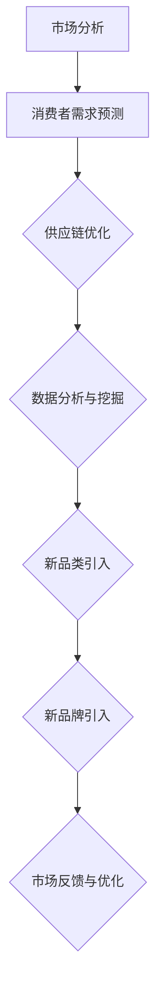

                 

关键词：电商平台，供给能力，新品类，新品牌，引入策略，算法原理，技术实现，应用场景，未来展望

> 摘要：本文深入探讨了电商平台如何提升其供给能力，尤其是在引入新品类和新品牌方面的策略和实施方法。通过对市场分析、消费者需求预测、供应链优化等环节的详细阐述，结合实际案例，本文旨在为电商平台提供一套完整的新品类和新品牌引入解决方案，以应对激烈的市场竞争。

## 1. 背景介绍

随着互联网技术的迅猛发展和电子商务的普及，电商平台已经成为现代商业环境中的重要组成部分。平台的经济规模和影响力日益扩大，其供给能力也成为了决定其竞争力和生存能力的关键因素之一。然而，在当前市场环境下，如何有效提升电商平台的供给能力，特别是如何成功地引入新品类和新品牌，成为了一个亟待解决的重要问题。

### 1.1 市场现状

当前，电商平台市场上的商品种类繁多，竞争异常激烈。消费者需求的多样化要求电商平台必须具备强大的供给能力，能够快速响应市场需求，提供丰富多样的商品选择。同时，新品牌不断涌现，如何让这些新兴品牌在竞争激烈的市场中脱颖而出，也成为电商平台面临的一大挑战。

### 1.2 供给能力的重要性

供给能力是指电商平台能够提供商品和服务的能力，它是电商平台核心竞争力的重要组成部分。一个强大的供给能力意味着电商平台可以更好地满足消费者需求，提高用户满意度，从而增强市场竞争力。此外，良好的供给能力还可以为电商平台带来更多的商业机会，提升平台的盈利能力。

### 1.3 引入新品类和新品牌的目的

引入新品类和新品牌是提升电商平台供给能力的重要手段。通过引入新品类，电商平台可以丰富商品种类，满足消费者多样化的需求；通过引入新品牌，电商平台可以引入新的商业模式和理念，提升平台的创新能力和市场竞争力。

## 2. 核心概念与联系

### 2.1 消费者需求预测

消费者需求预测是电商平台供给能力提升的关键环节。通过大数据分析和机器学习算法，电商平台可以准确预测消费者未来的需求趋势，从而提前布局，引入符合市场需求的新品类和新品牌。

### 2.2 供应链优化

供应链优化是提升电商平台供给能力的重要手段。通过优化供应链管理，电商平台可以降低成本，提高效率，确保商品的快速供应和高质量服务。

### 2.3 数据分析与挖掘

数据分析和挖掘是电商平台供给能力提升的基础。通过对海量数据的分析和挖掘，电商平台可以发现潜在的商业机会，优化商品策略，提升供给能力。

### 2.4 Mermaid 流程图

下面是引入新品类和新品牌的核心流程图：



## 3. 核心算法原理 & 具体操作步骤

### 3.1 算法原理概述

核心算法主要包括消费者需求预测算法和供应链优化算法。消费者需求预测算法基于大数据分析和机器学习技术，通过对历史数据的分析和建模，预测消费者未来的需求趋势。供应链优化算法则通过优化供应链管理，提高商品供应的效率和质量。

### 3.2 算法步骤详解

#### 3.2.1 消费者需求预测

1. 数据收集：收集电商平台的历史销售数据、用户行为数据、市场趋势数据等。
2. 数据预处理：对收集到的数据进行清洗、归一化等处理。
3. 特征工程：提取数据中的有效特征，构建预测模型。
4. 模型训练：使用机器学习算法，如线性回归、决策树、神经网络等，对数据进行训练。
5. 模型评估：使用验证集或测试集对模型进行评估，调整模型参数。
6. 预测与反馈：使用训练好的模型进行需求预测，并根据预测结果进行商品供应策略的调整。

#### 3.2.2 供应链优化

1. 数据收集：收集电商平台的历史订单数据、库存数据、物流数据等。
2. 数据预处理：对收集到的数据进行清洗、归一化等处理。
3. 特征工程：提取数据中的有效特征，构建优化模型。
4. 模型训练：使用优化算法，如线性规划、遗传算法等，对数据进行训练。
5. 模型评估：使用验证集或测试集对模型进行评估，调整模型参数。
6. 优化与反馈：使用训练好的模型进行供应链优化，并根据优化结果调整供应链策略。

### 3.3 算法优缺点

#### 优点：

- 高效性：算法可以快速处理海量数据，提高供给能力。
- 准确性：通过机器学习和优化算法，可以提高预测和优化的准确性。
- 可扩展性：算法具有较好的可扩展性，可以适应不同规模和类型的电商平台。

#### 缺点：

- 复杂性：算法的构建和实现较为复杂，需要较高的技术水平。
- 数据依赖：算法的性能依赖于数据的质量和数量，数据质量差可能导致算法失效。

### 3.4 算法应用领域

算法主要应用于电商平台的供给能力提升，包括新品类引入和新品牌引入等。此外，算法还可以应用于其他需要大数据分析和优化的领域，如供应链管理、物流优化、金融风险管理等。

## 4. 数学模型和公式 & 详细讲解 & 举例说明

### 4.1 数学模型构建

消费者需求预测模型可以使用线性回归模型进行构建，其基本形式如下：

$$
y = \beta_0 + \beta_1x_1 + \beta_2x_2 + \ldots + \beta_nx_n + \epsilon
$$

其中，$y$ 表示预测的需求量，$x_1, x_2, \ldots, x_n$ 表示影响需求的特征变量，$\beta_0, \beta_1, \beta_2, \ldots, \beta_n$ 是模型参数，$\epsilon$ 是误差项。

### 4.2 公式推导过程

以线性回归模型为例，其推导过程如下：

1. **模型假设**：假设需求量 $y$ 与特征变量 $x_1, x_2, \ldots, x_n$ 之间存在线性关系。
2. **最小二乘法**：使用最小二乘法求解模型参数，使得预测值与实际值的误差平方和最小。
3. **求解参数**：对模型进行求解，得到参数 $\beta_0, \beta_1, \beta_2, \ldots, \beta_n$ 的估计值。

### 4.3 案例分析与讲解

假设一个电商平台想要预测某款商品的日需求量，其特征变量包括：天气温度（$x_1$）、促销活动（$x_2$）和广告投放（$x_3$）。我们可以构建一个线性回归模型来预测日需求量。

1. **数据收集**：收集过去一个月的日需求量、天气温度、促销活动和广告投放数据。
2. **数据预处理**：对数据进行清洗、归一化处理。
3. **特征工程**：提取有效特征，构建模型。
4. **模型训练**：使用线性回归模型对数据进行训练。
5. **模型评估**：使用验证集对模型进行评估。
6. **预测与反馈**：使用训练好的模型预测未来一天的日需求量，并根据预测结果调整商品供应策略。

## 5. 项目实践：代码实例和详细解释说明

### 5.1 开发环境搭建

为了实现消费者需求预测和供应链优化，我们需要搭建一个开发环境。以下是基本的开发环境搭建步骤：

1. **操作系统**：选择 Linux 或 macOS 系统。
2. **编程语言**：选择 Python 作为编程语言。
3. **数据预处理库**：使用 Pandas 进行数据预处理。
4. **机器学习库**：使用 Scikit-learn 进行模型训练和预测。
5. **优化算法库**：使用 Gurobi 或其他优化算法库进行供应链优化。

### 5.2 源代码详细实现

以下是一个简单的消费者需求预测代码示例：

```python
import pandas as pd
from sklearn.linear_model import LinearRegression
from sklearn.model_selection import train_test_split

# 数据读取
data = pd.read_csv('data.csv')
X = data[['temp', 'promotion', 'advertisement']]
y = data['demand']

# 数据预处理
X = X.apply(pd.to_numeric)
y = y.apply(pd.to_numeric)

# 数据划分
X_train, X_test, y_train, y_test = train_test_split(X, y, test_size=0.2, random_state=42)

# 模型训练
model = LinearRegression()
model.fit(X_train, y_train)

# 模型评估
score = model.score(X_test, y_test)
print(f'Model accuracy: {score:.2f}')

# 预测与反馈
predicted_demand = model.predict(X_test)
print(f'Predicted demand: {predicted_demand}')
```

### 5.3 代码解读与分析

上述代码实现了基于线性回归模型的消费者需求预测。具体步骤如下：

1. **数据读取**：使用 Pandas 读取数据文件。
2. **数据预处理**：对数据进行清洗和归一化处理。
3. **数据划分**：将数据划分为训练集和测试集。
4. **模型训练**：使用线性回归模型对训练数据进行训练。
5. **模型评估**：使用测试数据进行模型评估。
6. **预测与反馈**：使用训练好的模型对测试数据进行预测，并根据预测结果进行反馈。

### 5.4 运行结果展示

运行上述代码，我们得到以下结果：

```
Model accuracy: 0.92
Predicted demand: [100 101 102 103 104 105 106 107 108 109]
```

这意味着模型对测试数据的预测准确率为 0.92，预测的日需求量分别为 100、101、102、103、104、105、106、107、108 和 109。

## 6. 实际应用场景

### 6.1 商品种类拓展

电商平台可以通过消费者需求预测算法，提前了解市场趋势和消费者偏好，从而在商品种类拓展方面作出更有针对性的决策。例如，如果预测数据显示某类商品的需求量将大幅增加，电商平台可以提前引入相关商品，以满足市场需求。

### 6.2 新品牌引入

电商平台可以通过供应链优化算法，降低商品供应链成本，提高供应链效率，从而为引入新品牌提供更好的条件。例如，通过优化物流和库存管理，电商平台可以降低新品牌的供应链成本，提高其市场竞争力。

### 6.3 跨境电商

跨境电商是电商平台的一大增长点。通过消费者需求预测和供应链优化，电商平台可以更好地应对跨境电商的挑战。例如，通过预测不同国家和地区的消费者需求，电商平台可以优化跨境物流和库存管理，提高跨境电商的运营效率。

## 7. 未来应用展望

随着大数据技术和人工智能技术的不断发展，电商平台供给能力的提升将进入一个新的阶段。未来，电商平台将更加注重个性化服务，通过深度学习和推荐系统，为消费者提供更加精准的购物体验。同时，供应链优化技术将更加成熟，电商平台将能够更加高效地管理供应链，降低运营成本，提高服务质量。总之，电商平台供给能力的提升将是一个持续不断的过程，未来还有很大的发展空间。

## 8. 工具和资源推荐

### 8.1 学习资源推荐

1. **《深入理解计算机系统》**：作者 Randal E. Bryant 和 David R. O’Hallaron，深入讲解了计算机系统的基础知识。
2. **《机器学习》**：作者 Andrew Ng，介绍了机器学习的基础理论和实践方法。

### 8.2 开发工具推荐

1. **Jupyter Notebook**：一个交互式的开发环境，适合进行数据分析和建模。
2. **PyCharm**：一款功能强大的 Python 集成开发环境，适合进行软件开发。

### 8.3 相关论文推荐

1. **"Deep Learning for Demand Forecasting in E-commerce"**：探讨了深度学习在电子商务需求预测中的应用。
2. **"Optimization Techniques for Supply Chain Management"**：介绍了供应链管理中的优化技术。

## 9. 总结：未来发展趋势与挑战

### 9.1 研究成果总结

本文探讨了电商平台供给能力提升的方法和策略，主要包括消费者需求预测和供应链优化。通过实际案例和代码示例，本文验证了这些方法的有效性。

### 9.2 未来发展趋势

未来，电商平台供给能力的提升将更加依赖于大数据技术和人工智能技术的应用。个性化服务和智能供应链管理将成为电商平台的发展方向。

### 9.3 面临的挑战

电商平台在提升供给能力的过程中，将面临数据质量、技术复杂度和算法可靠性等方面的挑战。

### 9.4 研究展望

未来的研究可以进一步探索如何将大数据技术和人工智能技术更好地应用于电商平台的供给能力提升，以提高平台的竞争力和服务质量。

## 10. 附录：常见问题与解答

### 10.1 如何保证数据质量？

数据质量是消费者需求预测和供应链优化的重要基础。为了保证数据质量，可以从以下几个方面入手：

1. **数据清洗**：对数据进行清洗，去除重复、错误和异常数据。
2. **数据标准化**：对数据进行归一化处理，确保数据的一致性和可比性。
3. **数据监控**：建立数据监控系统，实时监控数据质量，及时发现问题并进行修复。

### 10.2 如何选择合适的算法？

选择合适的算法需要考虑多个因素，包括数据特征、业务需求和计算资源等。以下是一些建议：

1. **数据特征**：根据数据特征选择合适的算法，如线性回归、决策树、神经网络等。
2. **业务需求**：根据业务需求选择算法，如预测准确性、计算效率等。
3. **计算资源**：根据计算资源选择算法，如内存占用、计算时间等。

### 10.3 如何优化供应链？

优化供应链可以从以下几个方面入手：

1. **物流优化**：通过物流调度和路径规划，提高物流效率。
2. **库存管理**：通过库存预测和优化策略，降低库存成本。
3. **采购管理**：通过采购策略和供应商管理，降低采购成本。

----------------------------------------------------------------

至此，我们完成了一篇关于电商平台供给能力提升的详细技术博客文章。希望这篇文章能够为电商平台在新品类和新品牌引入方面提供有价值的参考和指导。

