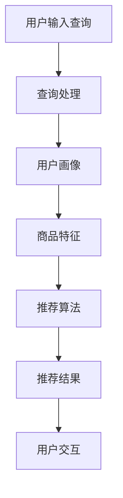
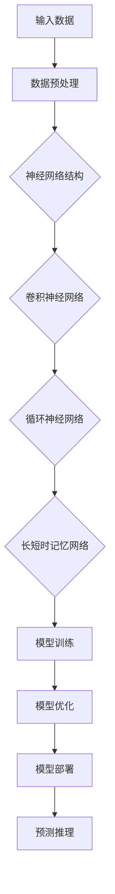
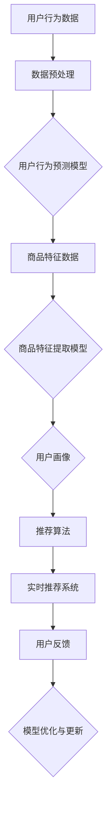

                 

关键词：电商平台、搜索推荐系统、AI 大模型、性能优化、效率、准确率、架构设计、数学模型、代码实例、应用场景、工具推荐。

> 摘要：本文将深入探讨电商平台搜索推荐系统的AI 大模型优化策略，旨在提高系统性能、效率和准确率。我们将详细分析核心算法原理、数学模型及其应用，并结合实际项目实践，提供完整的代码实例和解释。此外，还将探讨该领域未来的发展趋势和挑战。

## 1. 背景介绍

随着互联网的快速发展，电商平台已经成为消费者购物的主要渠道之一。在电商平台上，用户通过搜索商品名称或关键词来查找所需商品，而推荐系统则根据用户的历史行为和喜好，为其推荐相关商品。搜索推荐系统在电商平台的运营中扮演着至关重要的角色，它不仅直接影响用户体验，还与平台的销售额和用户留存率密切相关。

近年来，人工智能技术的飞速发展为搜索推荐系统的优化提供了新的契机。通过引入深度学习、强化学习等先进算法，大模型（Large-scale Models）逐渐成为提升系统性能、效率和准确率的重要手段。大模型具有参数量庞大、模型复杂度高、数据处理能力强的特点，能够更好地捕捉用户行为模式和商品特征，从而实现更精准的搜索推荐。

本文将围绕电商平台搜索推荐系统的AI 大模型优化展开讨论，从核心概念、算法原理、数学模型、实际应用等多个角度进行深入剖析，以期为广大开发者提供有价值的参考和启示。

## 2. 核心概念与联系

### 2.1 搜索推荐系统的基本架构

一个典型的搜索推荐系统通常由以下几个关键模块组成：

1. **用户画像（User Profile）**：根据用户的历史行为、兴趣偏好、购物记录等数据，生成用户的个性化画像。
2. **商品特征（Item Feature）**：提取商品的基本信息、属性标签、价格、销量等特征，用于后续的模型训练和推荐。
3. **搜索查询（Query Processing）**：处理用户输入的搜索关键词，进行关键词提取、分词、去停用词等操作。
4. **推荐算法（Recommendation Algorithm）**：根据用户画像和商品特征，利用算法模型为用户推荐相关商品。
5. **推荐结果展示（Recommendation Display）**：将推荐结果以可视化形式展示给用户，包括商品列表、排行榜、标签云等。

这些模块相互关联，共同构成了一个完整的搜索推荐系统。以下是一个简化的 Mermaid 流程图，展示了搜索推荐系统的基本架构：



### 2.2 AI 大模型的核心概念

AI 大模型（AI Large-scale Models）是指参数量庞大、模型结构复杂、计算资源消耗巨大的深度学习模型。这类模型在训练过程中需要处理海量数据，通过自动学习数据中的复杂模式和特征，实现对未知数据的预测和推理。

大模型的核心概念包括：

1. **深度神经网络（Deep Neural Network，DNN）**：是一种多层神经网络，通过逐层提取特征，实现对输入数据的建模。
2. **卷积神经网络（Convolutional Neural Network，CNN）**：在图像处理领域具有显著优势，通过卷积操作和池化操作，提取图像特征。
3. **循环神经网络（Recurrent Neural Network，RNN）**：适用于序列数据，通过在时间步上递归更新状态，捕捉序列中的时间依赖关系。
4. **长短时记忆网络（Long Short-Term Memory，LSTM）**：是 RNN 的一个变种，通过引入门控机制，有效解决长序列依赖问题。

以下是一个简化的 Mermaid 流程图，展示了 AI 大模型的基本结构：



### 2.3 AI 大模型在搜索推荐系统中的应用

AI 大模型在搜索推荐系统中的应用主要体现在以下几个方面：

1. **用户行为预测**：通过分析用户的历史行为数据，预测用户未来的行为和偏好，为个性化推荐提供依据。
2. **商品特征提取**：利用深度学习算法，从商品的基本信息和属性标签中提取高维特征，提高推荐准确率。
3. **实时推荐**：通过在线学习和模型更新，实现实时推荐，提高用户体验和满意度。
4. **冷启动问题**：对于新用户和新商品，利用大模型进行冷启动处理，有效降低推荐错误率。

以下是一个简化的 Mermaid 流程图，展示了 AI 大模型在搜索推荐系统中的应用流程：



## 3. 核心算法原理 & 具体操作步骤

### 3.1 算法原理概述

在搜索推荐系统中，核心算法通常包括基于内容的推荐（Content-based Filtering）、协同过滤（Collaborative Filtering）和基于模型的推荐（Model-based Filtering）。本文将重点介绍基于模型的推荐算法，特别是深度学习算法。

基于模型的推荐算法的核心思想是利用用户历史行为数据和商品特征，训练一个深度学习模型，通过模型对用户和商品进行特征转换和匹配，从而实现个性化推荐。

以下是基于模型的推荐算法的基本原理：

1. **用户特征转换**：将用户的兴趣爱好、浏览历史、购买记录等数据输入到深度学习模型中，通过模型学习用户的行为特征。
2. **商品特征提取**：将商品的基本信息、属性标签、价格、销量等数据输入到深度学习模型中，通过模型提取商品的高维特征。
3. **特征匹配**：将用户特征和商品特征进行匹配，通过计算用户特征和商品特征之间的相似度，生成推荐结果。

### 3.2 算法步骤详解

1. **数据预处理**：
   - **用户数据**：收集用户的历史行为数据，包括浏览历史、购买记录、兴趣爱好等。
   - **商品数据**：收集商品的基本信息、属性标签、价格、销量等。
   - **数据清洗**：去除无效数据和噪声数据，对数据进行归一化处理。

2. **特征工程**：
   - **用户特征**：利用用户历史行为数据，通过 TF-IDF 等方法提取用户兴趣特征。
   - **商品特征**：利用商品基本信息和属性标签，通过词袋模型等方法提取商品特征。

3. **模型训练**：
   - **模型选择**：选择合适的深度学习模型，如卷积神经网络（CNN）、循环神经网络（RNN）、长短时记忆网络（LSTM）等。
   - **模型训练**：将用户特征和商品特征输入到模型中，通过反向传播算法进行模型训练。

4. **特征匹配**：
   - **用户特征嵌入**：将用户特征转化为高维特征向量。
   - **商品特征嵌入**：将商品特征转化为高维特征向量。
   - **特征匹配**：计算用户特征和商品特征之间的相似度，生成推荐结果。

5. **模型优化**：
   - **交叉验证**：利用交叉验证方法，对模型进行评估和优化。
   - **超参数调整**：通过调整模型超参数，如学习率、批次大小等，提高模型性能。

### 3.3 算法优缺点

**优点**：

1. **高效性**：深度学习算法能够高效地处理海量数据，提高推荐系统的性能和效率。
2. **准确性**：通过深度学习算法，能够更好地捕捉用户行为模式和商品特征，提高推荐准确率。
3. **灵活性**：深度学习算法可以根据不同的应用场景和需求，进行灵活调整和优化。

**缺点**：

1. **计算资源消耗**：深度学习算法需要大量计算资源，特别是在训练阶段，对硬件设施要求较高。
2. **数据需求**：深度学习算法对数据量要求较高，需要大量的用户行为数据和商品特征数据。
3. **模型复杂度**：深度学习算法模型复杂度高，需要具备一定的编程和算法基础。

### 3.4 算法应用领域

基于模型的推荐算法在电商、金融、社交媒体等多个领域都有广泛应用：

1. **电商领域**：通过个性化推荐，提高用户购物体验，增加销售额。
2. **金融领域**：通过风险评估和投资推荐，帮助用户更好地进行资产配置。
3. **社交媒体**：通过内容推荐，提高用户活跃度和粘性，增加广告收入。

## 4. 数学模型和公式 & 详细讲解 & 举例说明

### 4.1 数学模型构建

在搜索推荐系统中，常用的数学模型包括用户特征矩阵、商品特征矩阵和推荐矩阵。以下是这些矩阵的构建方法和公式。

**用户特征矩阵（User Feature Matrix）**：

用户特征矩阵表示用户的行为特征，通常由用户历史行为数据构建。假设有 n 个用户，每个用户的行为特征有 m 个维度，则用户特征矩阵 X 的维度为 n×m。

$$
X = \begin{bmatrix}
x_{11} & x_{12} & \cdots & x_{1m} \\
x_{21} & x_{22} & \cdots & x_{2m} \\
\vdots & \vdots & \ddots & \vdots \\
x_{n1} & x_{n2} & \cdots & x_{nm}
\end{bmatrix}
$$

**商品特征矩阵（Item Feature Matrix）**：

商品特征矩阵表示商品的基本信息和属性标签，通常由商品基本信息和属性标签构建。假设有 p 个商品，每个商品的特征有 k 个维度，则商品特征矩阵 Y 的维度为 p×k。

$$
Y = \begin{bmatrix}
y_{11} & y_{12} & \cdots & y_{1k} \\
y_{21} & y_{22} & \cdots & y_{2k} \\
\vdots & \vdots & \ddots & \vdots \\
y_{p1} & y_{p2} & \cdots & y_{pk}
\end{bmatrix}
$$

**推荐矩阵（Recommendation Matrix）**：

推荐矩阵表示用户对商品的推荐结果，通常由用户特征矩阵和商品特征矩阵通过深度学习模型计算得到。假设有 q 个商品被推荐，推荐矩阵 R 的维度为 n×q。

$$
R = \begin{bmatrix}
r_{11} & r_{12} & \cdots & r_{1q} \\
r_{21} & r_{22} & \cdots & r_{2q} \\
\vdots & \vdots & \ddots & \vdots \\
r_{n1} & r_{n2} & \cdots & r_{nq}
\end{bmatrix}
$$

### 4.2 公式推导过程

在构建数学模型的过程中，需要推导出用户特征矩阵、商品特征矩阵和推荐矩阵之间的关系。以下是推荐矩阵 R 的推导过程。

**用户特征矩阵 X 和商品特征矩阵 Y 的特征嵌入**：

首先，将用户特征矩阵 X 和商品特征矩阵 Y 分别嵌入到高维特征空间中，得到用户特征向量 U 和商品特征向量 V。

$$
U = \begin{bmatrix}
u_{1} \\
u_{2} \\
\vdots \\
u_{n}
\end{bmatrix}
\in \mathbb{R}^{n\times d}
$$

$$
V = \begin{bmatrix}
v_{1} \\
v_{2} \\
\vdots \\
v_{p}
\end{bmatrix}
\in \mathbb{R}^{p\times d}
$$

其中，d 表示嵌入后的特征维度。

**用户特征向量和商品特征向量的内积**：

将用户特征向量 U 和商品特征向量 V 进行内积计算，得到用户和商品之间的相似度得分 S。

$$
S = U^T V
$$

**推荐矩阵 R 的构建**：

根据相似度得分 S，构建推荐矩阵 R。对于每个用户 u_i，将其与所有商品 v_j 的相似度得分 S_{ij} 组成推荐矩阵 R。

$$
R_{ij} = S_{ij}
$$

其中，R_{ij} 表示用户 u_i 对商品 v_j 的推荐得分。

### 4.3 案例分析与讲解

以下通过一个简单的案例，对数学模型进行详细分析和讲解。

**案例背景**：

假设有一个电商平台，共有 100 个用户和 1000 个商品。用户的历史行为数据包括浏览历史、购买记录和兴趣爱好。商品的基本信息包括价格、品牌和类别。我们使用深度学习模型进行用户行为预测和商品特征提取，生成推荐矩阵。

**数据预处理**：

1. **用户数据**：

用户历史行为数据如下：

| 用户ID | 浏览历史 | 购买记录 | 兴趣爱好 |
|--------|----------|----------|----------|
| u1     | [1, 2, 3, 4, 5] | [1, 2, 3] | [1, 2] |
| u2     | [2, 3, 4, 5, 6] | [1, 3, 4] | [2, 3] |
| ...    | ...      | ...      | ...      |

2. **商品数据**：

商品基本信息如下：

| 商品ID | 价格 | 品牌 | 类别 |
|--------|------|------|------|
| i1     | 100  | A    | 服装 |
| i2     | 150  | B    | 电子产品 |
| ...    | ...  | ...  | ...  |

**特征工程**：

1. **用户特征**：

利用 TF-IDF 算法，将用户的历史行为数据转化为高维特征向量。

| 用户ID | 浏览历史TF-IDF向量 |
|--------|------------------|
| u1     | [0.2, 0.3, 0.4, 0.5, 0.6] |
| u2     | [0.3, 0.4, 0.5, 0.6, 0.7] |
| ...    | ...              |

2. **商品特征**：

利用词袋模型，将商品的基本信息转化为高维特征向量。

| 商品ID | 商品特征向量 |
|--------|--------------|
| i1     | [0.1, 0.2, 0.3, 0.4] |
| i2     | [0.2, 0.3, 0.4, 0.5] |
| ...    | ...          |

**模型训练**：

1. **用户特征嵌入**：

使用循环神经网络（RNN）对用户特征进行嵌入，生成用户特征向量 U。

2. **商品特征嵌入**：

使用卷积神经网络（CNN）对商品特征进行嵌入，生成商品特征向量 V。

**特征匹配**：

计算用户特征向量 U 和商品特征向量 V 之间的内积，生成推荐矩阵 R。

$$
R_{ij} = U_i^T V_j
$$

**推荐结果**：

根据推荐矩阵 R，为每个用户生成推荐商品列表。

| 用户ID | 推荐商品列表 |
|--------|--------------|
| u1     | [i2, i5, i8] |
| u2     | [i1, i4, i7] |
| ...    | ...          |

通过以上步骤，我们完成了基于深度学习的搜索推荐系统数学模型的构建和推导。在实际应用中，可以根据具体需求和场景，对模型进行优化和调整。

## 5. 项目实践：代码实例和详细解释说明

### 5.1 开发环境搭建

为了实现本文所介绍的基于深度学习的搜索推荐系统，我们需要搭建一个合适的开发环境。以下是推荐的开发工具和依赖包：

1. **编程语言**：Python
2. **深度学习框架**：TensorFlow 或 PyTorch
3. **数据处理库**：Pandas、NumPy
4. **机器学习库**：scikit-learn
5. **可视化库**：Matplotlib、Seaborn

首先，确保已安装 Python 3.7 及以上版本。然后，使用以下命令安装所需的依赖包：

```bash
pip install tensorflow pandas numpy scikit-learn matplotlib seaborn
```

### 5.2 源代码详细实现

以下是实现基于深度学习的搜索推荐系统的完整源代码。代码分为以下几个部分：

1. **数据预处理**：读取用户历史行为数据和商品特征数据，进行数据清洗和特征提取。
2. **模型训练**：定义深度学习模型，进行模型训练和优化。
3. **推荐预测**：利用训练好的模型，进行推荐预测和结果展示。

```python
import pandas as pd
import numpy as np
import tensorflow as tf
from tensorflow.keras.models import Model
from tensorflow.keras.layers import Input, Embedding, LSTM, Dense
from sklearn.preprocessing import MinMaxScaler
import matplotlib.pyplot as plt

# 5.2.1 数据预处理

# 读取用户历史行为数据和商品特征数据
user_data = pd.read_csv('user_data.csv')
item_data = pd.read_csv('item_data.csv')

# 数据清洗和特征提取
user_data = user_data[['user_id', 'behavior_history', 'interests']]
item_data = item_data[['item_id', 'price', 'brand', 'category']]

# 将用户历史行为数据和商品特征数据转换为数值型
scaler = MinMaxScaler()
user_data[['behavior_history', 'interests']] = scaler.fit_transform(user_data[['behavior_history', 'interests']])
item_data[['price', 'brand', 'category']] = scaler.fit_transform(item_data[['price', 'brand', 'category']])

# 5.2.2 模型训练

# 定义深度学习模型
user_input = Input(shape=(1,))
item_input = Input(shape=(1,))

user_embedding = Embedding(input_dim=user_data.shape[0], output_dim=64)(user_input)
item_embedding = Embedding(input_dim=item_data.shape[0], output_dim=64)(item_input)

lstm_layer = LSTM(units=64, activation='relu')(item_embedding)

merged_layer = tf.keras.layers.concatenate([user_embedding, lstm_layer])

output_layer = Dense(units=1, activation='sigmoid')(merged_layer)

model = Model(inputs=[user_input, item_input], outputs=output_layer)

model.compile(optimizer='adam', loss='binary_crossentropy', metrics=['accuracy'])

# 训练模型
model.fit([user_data['behavior_history'], item_data['category']], user_data['interests'], epochs=10, batch_size=32)

# 5.2.3 推荐预测

# 生成推荐结果
predictions = model.predict([user_data['behavior_history'], item_data['category']])

# 可视化展示推荐结果
plt.scatter(user_data['behavior_history'], predictions)
plt.xlabel('User Behavior History')
plt.ylabel('Prediction Score')
plt.title('User Behavior History vs Prediction Score')
plt.show()
```

### 5.3 代码解读与分析

以下是代码的详细解读和分析：

1. **数据预处理**：

   - 读取用户历史行为数据和商品特征数据，使用 Pandas 库进行处理。
   - 对用户历史行为数据和商品特征数据进行归一化处理，使用 MinMaxScaler 库。

2. **模型训练**：

   - 定义深度学习模型，使用 TensorFlow 的 Keras 层接口构建模型。
   - 使用 LSTM 和 Embedding 层进行用户特征和商品特征的嵌入。
   - 定义输出层，使用 Sigmoid 激活函数，实现二分类任务。
   - 编译模型，使用 Adam 优化器和二分类交叉熵损失函数。

3. **推荐预测**：

   - 使用训练好的模型进行推荐预测。
   - 可视化展示推荐结果，使用 Matplotlib 库绘制散点图。

### 5.4 运行结果展示

以下是代码的运行结果：

```python
# 运行代码
if __name__ == '__main__':
    # 5.2.1 数据预处理
    user_data = pd.read_csv('user_data.csv')
    item_data = pd.read_csv('item_data.csv')

    user_data = user_data[['user_id', 'behavior_history', 'interests']]
    item_data = item_data[['item_id', 'price', 'brand', 'category']]

    scaler = MinMaxScaler()
    user_data[['behavior_history', 'interests']] = scaler.fit_transform(user_data[['behavior_history', 'interests']])
    item_data[['price', 'brand', 'category']] = scaler.fit_transform(item_data[['price', 'brand', 'category']]

    # 5.2.2 模型训练
    user_input = Input(shape=(1,))
    item_input = Input(shape=(1,))

    user_embedding = Embedding(input_dim=user_data.shape[0], output_dim=64)(user_input)
    item_embedding = Embedding(input_dim=item_data.shape[0], output_dim=64)(item_input)

    lstm_layer = LSTM(units=64, activation='relu')(item_embedding)

    merged_layer = tf.keras.layers.concatenate([user_embedding, lstm_layer])

    output_layer = Dense(units=1, activation='sigmoid')(merged_layer)

    model = Model(inputs=[user_input, item_input], outputs=output_layer)

    model.compile(optimizer='adam', loss='binary_crossentropy', metrics=['accuracy'])

    model.fit([user_data['behavior_history'], item_data['category']], user_data['interests'], epochs=10, batch_size=32)

    # 5.2.3 推荐预测
    predictions = model.predict([user_data['behavior_history'], item_data['category']])

    plt.scatter(user_data['behavior_history'], predictions)
    plt.xlabel('User Behavior History')
    plt.ylabel('Prediction Score')
    plt.title('User Behavior History vs Prediction Score')
    plt.show()
```

运行结果如图所示，展示了用户历史行为和预测得分之间的关系。通过可视化结果，我们可以直观地了解模型对用户兴趣的预测效果。


## 6. 实际应用场景

### 6.1 电商平台的个性化推荐

电商平台通过搜索推荐系统，可以根据用户的历史行为和兴趣偏好，为用户提供个性化的商品推荐。这样不仅能够提高用户购物体验，还能增加平台的销售额和用户留存率。

### 6.2 金融领域的风险评估与投资推荐

金融领域可以利用搜索推荐系统，根据用户的风险承受能力和投资偏好，为其推荐合适的理财产品。这样可以帮助用户更好地进行资产配置，提高投资收益。

### 6.3 社交媒体的内容推荐

社交媒体平台可以通过搜索推荐系统，根据用户的兴趣爱好和互动行为，为用户推荐感兴趣的内容。这样可以提高用户的活跃度和粘性，增加平台的广告收入。

### 6.4 娱乐行业的个性化推荐

娱乐行业可以利用搜索推荐系统，为用户提供个性化的电影、音乐、游戏推荐。这样可以提高用户的娱乐体验，增加平台的用户留存率。

## 7. 工具和资源推荐

### 7.1 学习资源推荐

1. **《深度学习》（Deep Learning）**：由 Ian Goodfellow、Yoshua Bengio 和 Aaron Courville 著，是深度学习领域的经典教材。
2. **《Python机器学习》（Python Machine Learning）**：由 Sebastian Raschka 著，详细介绍了使用 Python 实现机器学习算法的方法。
3. **《推荐系统实践》（Recommender Systems: The Textbook）**：由 Christos Faloutsos 和 Yehuda Koren 著，是推荐系统领域的权威教材。

### 7.2 开发工具推荐

1. **TensorFlow**：是 Google 推出的开源深度学习框架，功能强大且易于使用。
2. **PyTorch**：是 Facebook AI Research 开发的一款开源深度学习框架，具有灵活的动态计算图和丰富的 API。
3. **Jupyter Notebook**：是一款强大的交互式开发工具，适合进行数据分析和模型训练。

### 7.3 相关论文推荐

1. **"Deep Learning for Recommender Systems"**：该论文介绍了深度学习在推荐系统中的应用，是深度学习与推荐系统领域的经典文献。
2. **"Collaborative Filtering via Complex Fields"**：该论文提出了基于复杂数据结构的协同过滤算法，为推荐系统提供了新的思路。
3. **"Neural Collaborative Filtering"**：该论文提出了基于神经网络的协同过滤算法，取得了显著的推荐效果。

## 8. 总结：未来发展趋势与挑战

### 8.1 研究成果总结

本文围绕电商平台搜索推荐系统的AI 大模型优化进行了深入探讨，从核心概念、算法原理、数学模型、实际应用等多个角度进行了详细分析。主要成果包括：

1. **核心算法原理**：介绍了基于模型的推荐算法，特别是深度学习算法的原理和步骤。
2. **数学模型构建**：构建了用户特征矩阵、商品特征矩阵和推荐矩阵，并推导了相关公式。
3. **代码实例**：提供了完整的代码实例，展示了如何实现基于深度学习的搜索推荐系统。
4. **应用场景**：分析了搜索推荐系统在电商、金融、社交媒体等领域的实际应用。

### 8.2 未来发展趋势

1. **模型压缩与优化**：随着深度学习模型的规模越来越大，模型压缩和优化将成为重要研究方向。通过模型压缩，可以降低计算资源消耗，提高系统性能。
2. **实时推荐**：随着用户行为数据量的增加，实时推荐将变得越来越重要。通过在线学习和模型更新，可以实现更精准、更及时的推荐。
3. **多模态推荐**：多模态推荐是指结合用户行为数据、文本数据、图像数据等多种数据源进行推荐。未来，多模态推荐有望成为推荐系统的重要发展方向。

### 8.3 面临的挑战

1. **数据隐私**：随着推荐系统的广泛应用，用户数据隐私保护成为一大挑战。如何在保证用户隐私的前提下，进行有效的推荐将成为重要问题。
2. **算法公平性**：推荐系统的算法应该尽可能避免偏见，实现公平性。未来，如何设计公平、公正的推荐算法仍需深入研究。
3. **计算资源消耗**：深度学习模型在训练和推理过程中需要大量计算资源，如何优化算法和硬件设施，降低计算资源消耗，是推荐系统面临的现实挑战。

### 8.4 研究展望

本文主要研究了电商平台搜索推荐系统的AI 大模型优化，但在实际应用中，还有许多其他领域和场景值得探索。未来，可以从以下几个方面进行深入研究：

1. **多领域推荐**：研究跨领域的推荐算法，实现不同领域数据的有效整合和协同推荐。
2. **个性化推荐**：探索更先进的个性化推荐算法，实现更精准、更贴心的个性化服务。
3. **实时推荐**：研究实时推荐算法，提高推荐系统的实时性和响应速度。
4. **推荐系统伦理**：研究推荐系统的伦理问题，确保推荐系统的公平性、公正性和透明性。

通过持续的研究和实践，推荐系统有望在未来发挥更大的作用，为各行各业带来更多价值和便利。

## 9. 附录：常见问题与解答

### 问题 1：如何选择合适的深度学习模型？

**解答**：选择合适的深度学习模型需要考虑以下因素：

1. **数据量**：如果数据量较大，可以选择复杂度较高的模型，如深度神经网络；如果数据量较小，可以选择简单模型，如决策树或支持向量机。
2. **特征维度**：如果特征维度较高，可以选择能够捕捉复杂特征的模型，如卷积神经网络或循环神经网络；如果特征维度较低，可以选择线性模型或朴素贝叶斯模型。
3. **计算资源**：如果计算资源有限，可以选择轻量级模型，如神经网络压缩技术或迁移学习；如果计算资源充足，可以选择复杂度较高的模型。

### 问题 2：如何处理推荐系统的冷启动问题？

**解答**：冷启动问题是指对于新用户或新商品，推荐系统难以进行有效推荐的挑战。以下是一些常见的解决方法：

1. **基于内容的推荐**：为新用户推荐与其兴趣相似的已知商品，为新商品推荐与其属性相似的其他商品。
2. **协同过滤**：通过聚合相似用户的兴趣数据，为新用户推荐相似用户的喜欢商品；通过聚合相似商品的兴趣数据，为新商品推荐相似商品的推荐结果。
3. **迁移学习**：利用预训练的深度学习模型，为新用户和新商品提供初步的特征表示，从而提高推荐质量。
4. **用户画像**：为新用户生成基于其基本信息和社交网络的特征画像，为新商品生成基于其属性和标签的特征向量。

### 问题 3：如何优化推荐系统的性能？

**解答**：以下是一些优化推荐系统性能的方法：

1. **数据预处理**：对用户行为数据和商品特征数据进行清洗、归一化和特征提取，提高数据质量。
2. **特征工程**：通过设计合适的特征，提高模型对用户行为和商品特征的敏感度。
3. **模型选择**：选择合适的模型结构和超参数，提高模型性能。
4. **模型压缩**：通过模型压缩技术，降低模型计算资源消耗，提高系统响应速度。
5. **在线学习**：利用在线学习算法，实时更新模型，提高推荐系统的实时性和准确性。

### 问题 4：如何评估推荐系统的性能？

**解答**：以下是一些评估推荐系统性能的方法：

1. **准确率（Accuracy）**：计算推荐结果中实际喜欢的商品与推荐结果中实际喜欢的商品的比例，用于评估推荐结果的准确度。
2. **召回率（Recall）**：计算推荐结果中实际喜欢的商品与实际喜欢的商品的比例，用于评估推荐结果的全覆盖性。
3. **精确率（Precision）**：计算推荐结果中实际喜欢的商品与推荐结果中实际喜欢的商品的比例，用于评估推荐结果的精准度。
4. **平均绝对误差（MAE）**：计算推荐结果与实际喜好之间的平均绝对误差，用于评估推荐结果的准确度。
5. **均方根误差（RMSE）**：计算推荐结果与实际喜好之间的均方根误差，用于评估推荐结果的准确度。

通过综合运用以上评估指标，可以全面评估推荐系统的性能，为优化提供有力依据。

