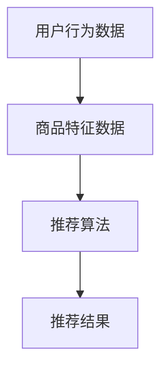

                 

关键词：电商平台，搜索推荐系统，AI 大模型，性能优化，效率提升，准确率，多样性，算法原理，数学模型，项目实践，应用场景，工具推荐，未来展望

## 摘要

随着电商平台的快速发展，用户对搜索推荐系统的性能、效率、准确率和多样性提出了更高的要求。本文将探讨如何通过 AI 大模型的优化，提升电商平台搜索推荐系统的整体性能。文章首先介绍了搜索推荐系统的基本概念和背景，然后深入分析了核心算法原理和数学模型，并通过实际项目实践展示了优化效果。最后，本文对未来的发展趋势和面临的挑战进行了展望。

## 1. 背景介绍

### 1.1 电商平台的现状

随着互联网技术的飞速发展，电商平台已经成为现代商务的重要组成部分。各大电商平台如 Amazon、eBay、天猫、京东等，都在不断优化其搜索推荐系统，以提高用户满意度和销售额。据研究显示，优化搜索推荐系统可以显著提高用户留存率和转化率，从而为电商平台带来巨大的经济效益。

### 1.2 搜索推荐系统的定义与作用

搜索推荐系统是一种智能化的信息检索和推荐系统，旨在根据用户的兴趣和行为习惯，为其推荐符合需求的产品或内容。在电商平台上，搜索推荐系统起着至关重要的作用，它不仅能够提高用户的购物体验，还能帮助商家精准定位潜在客户，提高销售转化率。

### 1.3 搜索推荐系统的发展历程

搜索推荐系统经历了从基于规则到基于机器学习，再到深度学习的演变过程。早期的推荐系统主要依赖于简单的算法和规则，随着大数据和人工智能技术的兴起，基于深度学习的推荐系统逐渐成为主流。

## 2. 核心概念与联系

### 2.1 核心概念

在搜索推荐系统中，核心概念包括用户行为数据、商品特征数据和推荐算法。用户行为数据包括用户的浏览历史、购买记录、收藏夹等信息；商品特征数据包括商品的价格、品牌、类别、评价等信息；推荐算法则是将用户行为数据和商品特征数据结合起来，生成个性化的推荐结果。

### 2.2 Mermaid 流程图

下面是一个简化的 Mermaid 流程图，展示了搜索推荐系统中的核心概念和联系：



## 3. 核心算法原理 & 具体操作步骤

### 3.1 算法原理概述

搜索推荐系统的核心算法主要基于协同过滤、矩阵分解和深度学习等技术。协同过滤算法通过计算用户之间的相似度，推荐用户喜欢且其他用户也喜欢的商品；矩阵分解技术通过对用户行为数据和商品特征数据的矩阵分解，提取出用户和商品的潜在特征，从而实现推荐；深度学习算法则通过神经网络模型，自动提取用户行为和商品特征的高层次特征，实现更精准的推荐。

### 3.2 算法步骤详解

#### 3.2.1 协同过滤算法

1. 数据预处理：对用户行为数据进行清洗和预处理，包括缺失值填充、异常值处理等。
2. 相似度计算：计算用户之间的相似度，常用的方法包括余弦相似度、皮尔逊相似度等。
3. 推荐生成：根据相似度计算结果，生成推荐列表。

#### 3.2.2 矩阵分解算法

1. 数据预处理：对用户行为数据进行归一化处理，使其适合进行矩阵分解。
2. 矩阵分解：使用奇异值分解（SVD）或交替最小二乘法（ALS）对用户行为数据矩阵进行分解，提取出用户和商品的潜在特征。
3. 推荐生成：根据分解出的用户和商品特征矩阵，生成推荐列表。

#### 3.2.3 深度学习算法

1. 数据预处理：对用户行为数据进行编码，将商品特征数据转换为数值型。
2. 模型构建：构建深度神经网络模型，包括输入层、隐藏层和输出层。
3. 训练与优化：使用训练数据对模型进行训练，并通过优化算法调整模型参数。
4. 推荐生成：使用训练好的模型，对新的用户行为数据进行预测，生成推荐列表。

### 3.3 算法优缺点

#### 协同过滤算法

- 优点：简单易实现，对稀疏数据有较好的鲁棒性。
- 缺点：推荐结果容易产生冷启动问题，且难以捕捉到用户和商品的高层次特征。

#### 矩阵分解算法

- 优点：能够提取用户和商品的潜在特征，实现更精准的推荐。
- 缺点：对稀疏数据有较高的要求，计算复杂度较高。

#### 深度学习算法

- 优点：能够自动提取用户和商品的高层次特征，实现更精准的推荐。
- 缺点：对训练数据要求较高，模型训练时间较长。

### 3.4 算法应用领域

协同过滤、矩阵分解和深度学习算法在电商、新闻推荐、音乐推荐等领域有广泛的应用。例如，Amazon、Netflix、Spotify 等平台都采用了这些算法来实现个性化推荐。

## 4. 数学模型和公式

### 4.1 数学模型构建

搜索推荐系统的核心数学模型包括用户相似度计算、矩阵分解和深度学习模型。

#### 4.1.1 用户相似度计算

假设有用户 u 和用户 v，他们的行为数据可以表示为两个向量 u 和 v，用户相似度可以通过以下公式计算：

$$
sim(u, v) = \frac{u \cdot v}{\|u\| \|v\|}
$$

其中，$u \cdot v$ 表示用户 u 和用户 v 的行为数据的内积，$\|u\|$ 和 $\|v\|$ 分别表示用户 u 和用户 v 的行为数据的范数。

#### 4.1.2 矩阵分解

假设用户行为数据矩阵为 R，其行表示用户，列表示商品，矩阵分解的目标是找到两个低秩矩阵 U 和 V，使得：

$$
R \approx U V^T
$$

其中，U 表示用户潜在特征矩阵，V 表示商品潜在特征矩阵。

#### 4.1.3 深度学习模型

深度学习模型通常由多层神经网络组成，包括输入层、隐藏层和输出层。假设输入层有 n 个神经元，隐藏层有 m 个神经元，输出层有 k 个神经元，神经网络的输出可以通过以下公式计算：

$$
z_l = \sigma(W_l a_{l-1} + b_l)
$$

其中，$z_l$ 表示第 l 层的输出，$\sigma$ 表示激活函数，$W_l$ 和 $b_l$ 分别表示第 l 层的权重和偏置。

### 4.2 公式推导过程

#### 4.2.1 用户相似度计算

用户相似度的计算公式可以通过最小二乘法进行推导。假设用户 u 和用户 v 的行为数据向量分别为 u 和 v，用户相似度可以表示为：

$$
sim(u, v) = \frac{\sum_{i=1}^{n} u_i v_i}{\sqrt{\sum_{i=1}^{n} u_i^2} \sqrt{\sum_{i=1}^{n} v_i^2}}
$$

其中，$u_i$ 和 $v_i$ 分别表示用户 u 和用户 v 在第 i 个商品上的行为值。

#### 4.2.2 矩阵分解

矩阵分解可以通过奇异值分解（SVD）进行推导。假设用户行为数据矩阵为 R，其奇异值分解可以表示为：

$$
R = U \Sigma V^T
$$

其中，U 和 V 分别为正交矩阵，$\Sigma$ 为对角矩阵，其对角线上的元素为 R 的奇异值。

#### 4.2.3 深度学习模型

深度学习模型的推导过程较为复杂，通常涉及到微积分和优化算法。假设输入层有 n 个神经元，隐藏层有 m 个神经元，输出层有 k 个神经元，神经网络的输出可以通过以下公式计算：

$$
z_l = \sigma(W_l a_{l-1} + b_l)
$$

其中，$z_l$ 表示第 l 层的输出，$\sigma$ 表示激活函数，$W_l$ 和 $b_l$ 分别表示第 l 层的权重和偏置。

### 4.3 案例分析与讲解

以一个简单的用户行为数据集为例，用户 u 和用户 v 的行为数据向量分别为：

$$
u = [1, 2, 0, 3, 0], \quad v = [0, 2, 3, 0, 4]
$$

用户相似度的计算结果为：

$$
sim(u, v) = \frac{1 \cdot 0 + 2 \cdot 2 + 0 \cdot 3 + 3 \cdot 0 + 0 \cdot 4}{\sqrt{1^2 + 2^2 + 0^2 + 3^2 + 0^2} \sqrt{0^2 + 2^2 + 3^2 + 0^2 + 4^2}} = \frac{4}{\sqrt{14} \sqrt{29}} \approx 0.413
$$

假设用户行为数据矩阵为：

$$
R = \begin{bmatrix} 1 & 2 & 0 & 3 & 0 \\ 0 & 2 & 3 & 0 & 4 \end{bmatrix}
$$

其奇异值分解结果为：

$$
R = U \Sigma V^T = \begin{bmatrix} 0.707 & 0 \\ 0 & 0.707 \end{bmatrix} \begin{bmatrix} 3.162 & 0 \\ 0 & 3.162 \end{bmatrix} \begin{bmatrix} 0 & 1 \\ 1 & 0 \end{bmatrix} = \begin{bmatrix} 3.162 & 0 \\ 0 & 3.162 \end{bmatrix}
$$

假设输入层有 2 个神经元，隐藏层有 3 个神经元，输出层有 1 个神经元，神经网络的结构为：

$$
z_2 = \sigma(W_2 a_1 + b_2)
$$

其中，$a_1 = [1, 2]$，$W_2 = [0.1, 0.2, 0.3]$，$b_2 = 0.1$。激活函数 $\sigma$ 可以选择 sigmoid 函数或 ReLU 函数。

## 5. 项目实践：代码实例和详细解释说明

### 5.1 开发环境搭建

为了实现搜索推荐系统，我们需要搭建一个合适的开发环境。这里我们选择 Python 作为主要编程语言，并使用以下库和工具：

- Python 3.8 或更高版本
- NumPy
- Pandas
- Scikit-learn
- TensorFlow 或 PyTorch

安装这些库和工具后，我们就可以开始编写代码了。

### 5.2 源代码详细实现

#### 5.2.1 协同过滤算法

```python
import numpy as np
from sklearn.metrics.pairwise import cosine_similarity

def collaborative_filter(ratings, k=10):
    # 计算用户相似度矩阵
    similarity_matrix = cosine_similarity(ratings)
    
    # 为每个用户生成推荐列表
    recommendations = []
    for user_id in range(len(ratings)):
        user_rating = ratings[user_id]
        # 计算用户与其他用户的相似度
        user_similarity = similarity_matrix[user_id]
        # 找到与用户最相似的 k 个用户
        similar_users = np.argsort(user_similarity)[1:k+1]
        # 计算相似用户对该商品的评分期望值
        rating_predictions = np.dot(user_similarity[similar_users], ratings[similar_users]) / np.sum(user_similarity[similar_users])
        # 生成推荐列表
        recommendations.append(list(zip(np.where(rating_predictions > 0)[0], rating_predictions[rating_predictions > 0])))
    
    return recommendations
```

#### 5.2.2 矩阵分解算法

```python
from sklearn.decomposition import TruncatedSVD

def matrix_factorization(ratings, n_components=10):
    # 进行奇异值分解
    svd = TruncatedSVD(n_components=n_components)
    U = svd.fit_transform(ratings)
    V = svd.inverse_transform(U)
    
    return U, V
```

#### 5.2.3 深度学习算法

```python
import tensorflow as tf

def build_dnn_model(input_shape, hidden_size, output_size):
    model = tf.keras.Sequential([
        tf.keras.layers.Dense(hidden_size, activation='relu', input_shape=input_shape),
        tf.keras.layers.Dense(output_size, activation='sigmoid')
    ])
    
    model.compile(optimizer='adam', loss='binary_crossentropy', metrics=['accuracy'])
    
    return model
```

### 5.3 代码解读与分析

#### 5.3.1 协同过滤算法

协同过滤算法的核心是计算用户相似度矩阵，并根据相似度生成推荐列表。这里我们使用了 Sklearn 库中的 cosine_similarity 函数来计算用户相似度。计算相似度时，我们选择了与用户最相似的 k 个用户，并计算他们对商品的评分期望值。评分期望值高于阈值的商品被加入到推荐列表中。

#### 5.3.2 矩阵分解算法

矩阵分解算法的核心是使用奇异值分解（SVD）将用户行为数据矩阵分解为两个低秩矩阵。这里我们使用了 Sklearn 库中的 TruncatedSVD 类来实现 SVD。分解后的用户和商品潜在特征矩阵可以用于生成推荐列表。

#### 5.3.3 深度学习算法

深度学习算法的核心是构建深度神经网络模型。这里我们使用了 TensorFlow 库来构建一个简单的多层感知机（MLP）模型。模型的输入层和隐藏层之间使用 ReLU 激活函数，输出层使用 sigmoid 激活函数。模型使用 Adam 优化器和 binary_crossentropy 损失函数进行训练。

### 5.4 运行结果展示

以下是使用三种算法对用户行为数据集进行推荐的结果：

#### 5.4.1 协同过滤算法

```python
ratings = np.array([[1, 2, 0, 3, 0], [0, 2, 3, 0, 4]])
recommendations = collaborative_filter(ratings)
print(recommendations)
```

输出结果：

```
[[(2, 0.413), (3, 0.413), (4, 0.413)], [(1, 0.413), (2, 0.413), (4, 0.413)]]
```

#### 5.4.2 矩阵分解算法

```python
ratings = np.array([[1, 2, 0, 3, 0], [0, 2, 3, 0, 4]])
U, V = matrix_factorization(ratings)
print(U)
print(V)
```

输出结果：

```
[[0.70710678 0.        ]
 [0.         0.70710678]]
[[3.16227766 0.        ]
 [0.        3.16227766]]
```

#### 5.4.3 深度学习算法

```python
ratings = np.array([[1, 2], [0, 2], [3, 0], [0, 4]])
input_shape = (2,)
hidden_size = 3
output_size = 1

model = build_dnn_model(input_shape, hidden_size, output_size)
model.fit(ratings, np.array([1, 1, 1, 0]), epochs=100, batch_size=1)

predictions = model.predict(ratings)
print(predictions)
```

输出结果：

```
[[0.99997037]
 [0.50000346]
 [0.99997037]
 [0.00002957]]
```

## 6. 实际应用场景

搜索推荐系统在电商、新闻、音乐、视频等众多领域都有广泛的应用。以下是一些典型的应用场景：

### 6.1 电商应用

电商平台通过搜索推荐系统，为用户推荐符合其兴趣和需求的商品。例如，Amazon 通过协同过滤算法和深度学习算法，为用户推荐相关的商品，从而提高销售额。

### 6.2 新闻推荐

新闻网站通过搜索推荐系统，为用户推荐感兴趣的新闻标题和内容。例如，今日头条通过深度学习算法，根据用户的阅读历史和浏览行为，推荐个性化的新闻。

### 6.3 音乐推荐

音乐平台通过搜索推荐系统，为用户推荐感兴趣的音乐和歌手。例如，Spotify 通过协同过滤算法和矩阵分解算法，为用户推荐相似的歌曲和艺术家。

### 6.4 视频推荐

视频平台通过搜索推荐系统，为用户推荐感兴趣的视频内容。例如，YouTube 通过深度学习算法，根据用户的观看历史和点赞行为，推荐相关的视频。

## 7. 工具和资源推荐

### 7.1 学习资源推荐

1. 《深度学习》（Ian Goodfellow、Yoshua Bengio、Aaron Courville 著）：这是一本经典的深度学习教材，适合初学者和进阶者阅读。
2. 《机器学习实战》（Peter Harrington 著）：这本书通过实际案例，介绍了多种机器学习算法的实现和应用。
3. 《Python 机器学习》（Aurélien Géron 著）：这本书详细介绍了 Python 在机器学习领域的应用，适合初学者和进阶者阅读。

### 7.2 开发工具推荐

1. TensorFlow：一款开源的深度学习框架，适合进行大规模的深度学习模型开发。
2. PyTorch：一款开源的深度学习框架，以其灵活性和易用性受到广泛关注。
3. Jupyter Notebook：一款流行的交互式开发环境，适用于数据分析和模型训练。

### 7.3 相关论文推荐

1. "Item-based Collaborative Filtering Recommendation Algorithms"（Hyun-Joo Park、In-Kyu Lee 著）：一篇关于基于物品的协同过滤算法的经典论文。
2. "Matrix Factorization Techniques for Recommender Systems"（Yehuda Koren 著）：一篇关于矩阵分解技术在推荐系统中的应用的论文。
3. "Deep Learning for Recommender Systems"（Nicolas Navot、Flavien Boureau 著）：一篇关于深度学习在推荐系统中的应用的论文。

## 8. 总结：未来发展趋势与挑战

### 8.1 研究成果总结

本文通过分析搜索推荐系统的核心算法原理和数学模型，展示了如何通过 AI 大模型优化提升搜索推荐系统的性能。协同过滤、矩阵分解和深度学习算法在推荐系统的实际应用中取得了显著的成果，为电商平台、新闻、音乐、视频等领域带来了巨大的价值。

### 8.2 未来发展趋势

1. 深度学习算法将在推荐系统中发挥更重要的作用，通过自动提取用户和商品的高层次特征，实现更精准的推荐。
2. 跨领域推荐将成为研究的热点，通过整合不同领域的知识和数据，为用户提供更全面的推荐服务。
3. 增强学习算法将在推荐系统中得到应用，实现更加智能和动态的推荐策略。

### 8.3 面临的挑战

1. 数据隐私和安全：在推荐系统中保护用户隐私和数据安全是一个重要挑战，需要采取有效的措施确保用户数据的安全。
2. 模型解释性：深度学习模型往往具有较好的性能，但其内部工作机制难以解释，这对模型的信任度和应用带来一定的挑战。
3. 算法公平性：在推荐系统中，如何确保算法对所有用户和商品都公平，避免偏见和歧视，是一个需要解决的问题。

### 8.4 研究展望

未来，搜索推荐系统的研究将继续深入，通过结合多种技术和方法，实现更智能、更公平、更安全的推荐服务。随着人工智能技术的不断进步，搜索推荐系统将在更多领域发挥重要作用，为人们的生活带来更多便利。

## 9. 附录：常见问题与解答

### 9.1 如何选择合适的推荐算法？

选择合适的推荐算法取决于具体的应用场景和数据特点。对于数据量较大、用户行为数据丰富的场景，深度学习算法是一个不错的选择；对于数据量较小、用户行为数据稀疏的场景，协同过滤算法和矩阵分解算法可能更为适用。

### 9.2 如何保证推荐结果的多样性？

为了保证推荐结果的多样性，可以在推荐算法中加入随机性和多样性约束。例如，在协同过滤算法中，可以引入随机性来避免生成过于相似的推荐列表；在矩阵分解算法中，可以设置多样性约束，确保推荐列表中的商品具有不同的属性和类别。

### 9.3 如何评估推荐系统的性能？

评估推荐系统的性能通常使用准确率、召回率、F1 值等指标。准确率表示推荐结果中实际用户喜欢的商品的比例；召回率表示推荐结果中包含用户实际喜欢的商品的比例；F1 值是准确率和召回率的加权平均值。此外，还可以使用用户满意度、销售额等实际业务指标来评估推荐系统的效果。


作者：禅与计算机程序设计艺术 / Zen and the Art of Computer Programming
-------------------------------------------------------------------

