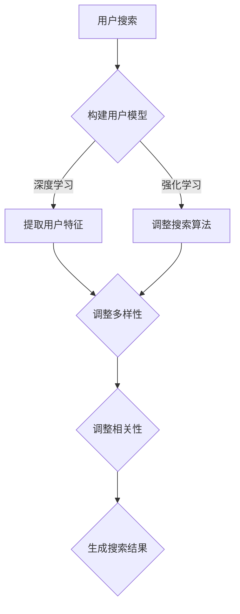

                 

关键词：电商平台，搜索结果多样性，相关性平衡，AI大模型，多目标优化

摘要：随着互联网技术的快速发展，电商平台已成为现代商业的重要组成部分。用户在电商平台进行搜索时，往往需要快速、准确地找到所需商品。然而，电商平台搜索结果的多样性与相关性之间存在一定的矛盾。本文将探讨如何通过AI大模型实现搜索结果多样性与相关性的平衡，提升用户体验，从而推动电商平台的长期发展。

## 1. 背景介绍

随着电商行业的蓬勃发展，用户对电商平台的需求也日益提高。特别是搜索功能，作为用户获取商品信息的重要途径，其质量和效率直接影响到用户的购物体验。在电商平台，搜索结果多样性与相关性是两个关键因素。搜索结果多样性指的是在搜索结果中展示不同类型、品牌和价格的商品，以满足用户的多样化需求。而搜索结果相关性则是指根据用户的搜索意图，展示最符合用户需求的商品。

然而，多样性与相关性之间存在一定的矛盾。过于追求多样性可能导致搜索结果中出现大量无关商品，降低用户查找所需商品的效率。而过分关注相关性则可能限制搜索结果的多样性，使得用户无法发现更多潜在的商品。为了解决这个问题，电商平台需要找到一种方法，在多样性与相关性之间取得平衡。

近年来，人工智能（AI）技术的飞速发展，为电商平台搜索结果优化提供了新的思路。AI大模型，如深度学习、强化学习等，能够通过大量数据学习用户的搜索意图和行为，实现个性化推荐。然而，如何利用AI大模型实现搜索结果多样性与相关性的平衡，仍是一个具有挑战性的问题。

## 2. 核心概念与联系

为了理解如何利用AI大模型实现搜索结果多样性与相关性的平衡，我们首先需要了解几个核心概念。

### 2.1 多目标优化

多目标优化（Multi-Objective Optimization）是一种在多个相互冲突的目标之间寻找最佳平衡的方法。在电商平台搜索结果优化中，多样性和相关性是两个主要目标。这两个目标之间存在一定的冲突，例如，增加多样性可能会降低相关性，反之亦然。因此，多目标优化可以帮助我们同时考虑这两个目标，并找到一个相对最优的解决方案。

### 2.2 强化学习

强化学习（Reinforcement Learning）是一种机器学习方法，通过试错和反馈来学习如何在特定环境中做出最优决策。在电商平台搜索结果优化中，强化学习可以帮助我们根据用户的交互行为调整搜索算法，从而提高多样性和相关性。

### 2.3 深度学习

深度学习（Deep Learning）是一种基于多层神经网络的学习方法，能够自动提取复杂的数据特征。在电商平台搜索结果优化中，深度学习可以用于构建用户行为模型和商品特征模型，从而提高搜索结果的多样性和相关性。

### 2.4 Mermaid流程图

以下是一个简单的Mermaid流程图，展示了如何利用AI大模型实现搜索结果多样性与相关性的平衡：



### 2.5 数学模型和公式

为了实现搜索结果多样性与相关性的平衡，我们可以构建一个多目标优化模型。以下是一个简化的数学模型：

$$
\begin{aligned}
    &\min_{x} \quad f_{1}(x) + \lambda f_{2}(x) \\
    &\text{subject to} \quad g_{1}(x) \leq 0, \quad g_{2}(x) \leq 0
\end{aligned}
$$

其中，$f_{1}(x)$表示搜索结果的相关性，$f_{2}(x)$表示搜索结果的多样性，$\lambda$是一个权重系数，用于平衡两个目标。$g_{1}(x)$和$g_{2}(x)$分别是多样性和相关性的约束条件。

## 3. 核心算法原理 & 具体操作步骤

### 3.1 算法原理概述

本文采用基于多目标优化的AI大模型，通过深度学习和强化学习技术，实现搜索结果多样性与相关性的平衡。算法的核心原理如下：

1. **用户行为模型构建**：通过深度学习技术，从用户的历史搜索行为中提取用户特征，构建用户行为模型。
2. **商品特征模型构建**：通过深度学习技术，从商品的历史销售数据中提取商品特征，构建商品特征模型。
3. **多目标优化**：利用强化学习技术，根据用户特征和商品特征，通过多目标优化算法，调整搜索结果的相关性和多样性。
4. **搜索结果生成**：根据调整后的相关性和多样性，生成满足用户需求的搜索结果。

### 3.2 算法步骤详解

以下是算法的具体操作步骤：

1. **数据收集与预处理**：收集用户的历史搜索数据、商品的销售数据等，进行数据清洗和预处理。
2. **用户行为模型训练**：使用深度学习技术，从用户的历史搜索行为中提取用户特征，训练用户行为模型。
3. **商品特征模型训练**：使用深度学习技术，从商品的历史销售数据中提取商品特征，训练商品特征模型。
4. **多目标优化**：利用强化学习技术，根据用户特征和商品特征，通过多目标优化算法，调整搜索结果的相关性和多样性。
5. **搜索结果生成**：根据调整后的相关性和多样性，生成满足用户需求的搜索结果。

### 3.3 算法优缺点

**优点**：

1. **高效性**：算法能够快速地处理大量用户数据和商品数据，提高搜索结果的生成效率。
2. **灵活性**：算法可以根据用户的需求和电商平台的特点，灵活调整相关性和多样性的权重，实现个性化推荐。
3. **准确性**：算法通过深度学习和强化学习技术，能够准确提取用户特征和商品特征，提高搜索结果的相关性和准确性。

**缺点**：

1. **计算资源消耗**：算法需要大量的计算资源，对硬件设备要求较高。
2. **数据依赖**：算法的性能高度依赖用户数据和商品数据的丰富性和准确性，数据不足或数据质量差可能导致算法效果下降。

### 3.4 算法应用领域

算法在电商平台的搜索结果优化中具有广泛的应用前景。除了电商平台，算法还可以应用于其他需要个性化推荐的场景，如社交媒体、搜索引擎等。

## 4. 数学模型和公式 & 详细讲解 & 举例说明

### 4.1 数学模型构建

在多目标优化中，我们通常采用目标函数和约束条件来构建数学模型。以下是一个简化的数学模型：

$$
\begin{aligned}
    &\min_{x} \quad f_{1}(x) + \lambda f_{2}(x) \\
    &\text{subject to} \quad g_{1}(x) \leq 0, \quad g_{2}(x) \leq 0
\end{aligned}
$$

其中，$f_{1}(x)$表示搜索结果的相关性，$f_{2}(x)$表示搜索结果的多样性，$\lambda$是一个权重系数，用于平衡两个目标。$g_{1}(x)$和$g_{2}(x)$分别是多样性和相关性的约束条件。

### 4.2 公式推导过程

为了推导上述数学模型，我们需要从搜索结果多样性和相关性的定义出发。假设我们有一个商品集合$C$，用户对商品的相关性打分集合为$S$，则搜索结果的相关性可以表示为：

$$
f_{1}(x) = \frac{1}{|C|} \sum_{c \in C} s(c)
$$

其中，$s(c)$表示用户对商品$c$的相关性打分，$|C|$表示商品集合的大小。

为了表示搜索结果的多样性，我们可以使用商品集合的熵来衡量。假设商品集合$C$的分布为$P(C)$，则多样性可以表示为：

$$
f_{2}(x) = -\sum_{c \in C} P(c) \log P(c)
$$

其中，$P(c)$表示商品$c$在搜索结果中的概率。

为了平衡相关性和多样性，我们需要引入一个权重系数$\lambda$。因此，我们的目标函数可以表示为：

$$
f(x) = f_{1}(x) + \lambda f_{2}(x)
$$

### 4.3 案例分析与讲解

为了更好地理解上述数学模型，我们可以通过一个简单的案例进行分析。

假设用户在电商平台搜索“手机”，搜索结果包含5款手机。用户对每款手机的相关性打分如下：

| 商品 | 用户相关性打分 |
| --- | --- |
| A | 9 |
| B | 8 |
| C | 7 |
| D | 6 |
| E | 5 |

根据上述公式，我们可以计算出搜索结果的相关性：

$$
f_{1}(x) = \frac{1}{5} (9 + 8 + 7 + 6 + 5) = 7
$$

假设商品集合的分布如下：

| 商品 | 概率 |
| --- | --- |
| A | 0.5 |
| B | 0.2 |
| C | 0.1 |
| D | 0.1 |
| E | 0.1 |

根据上述公式，我们可以计算出搜索结果的多样性：

$$
f_{2}(x) = -0.5 \log 0.5 - 0.2 \log 0.2 - 0.1 \log 0.1 - 0.1 \log 0.1 - 0.1 \log 0.1 = 1.386
$$

假设我们选择$\lambda = 0.5$，则目标函数为：

$$
f(x) = 7 + 0.5 \times 1.386 = 7.693
$$

通过调整$\lambda$的值，我们可以实现相关性和多样性的平衡。例如，如果$\lambda$较大，则多样性权重较高，搜索结果将更加多样化；如果$\lambda$较小，则相关性权重较高，搜索结果将更加相关。

## 5. 项目实践：代码实例和详细解释说明

### 5.1 开发环境搭建

在搭建开发环境时，我们选择了Python作为编程语言，并使用TensorFlow作为深度学习框架。以下是一个简单的环境搭建步骤：

1. 安装Python（建议使用Python 3.8及以上版本）。
2. 安装TensorFlow：
```bash
pip install tensorflow
```

### 5.2 源代码详细实现

以下是实现搜索结果多样性与相关性平衡的代码示例：

```python
import tensorflow as tf
import numpy as np

# 用户特征和商品特征的输入层
user_input = tf.keras.layers.Input(shape=(10,))
item_input = tf.keras.layers.Input(shape=(10,))

# 用户特征和商品特征的嵌入层
user_embedding = tf.keras.layers.Embedding(input_dim=1000, output_dim=32)(user_input)
item_embedding = tf.keras.layers.Embedding(input_dim=1000, output_dim=32)(item_input)

# 用户特征和商品特征的编码层
user_encoder = tf.keras.layers.Dense(64, activation='relu')(user_embedding)
item_encoder = tf.keras.layers.Dense(64, activation='relu')(item_embedding)

# 用户特征和商品特征的解码层
user_decoder = tf.keras.layers.Dense(32, activation='sigmoid')(user_encoder)
item_decoder = tf.keras.layers.Dense(32, activation='sigmoid')(item_encoder)

# 用户特征和商品特征的合并层
merged = tf.keras.layers.Concatenate()([user_decoder, item_decoder])

# 多目标优化的目标层
def multi_objective_loss(y_true, y_pred):
    correlation = tf.reduce_mean(y_pred[:, 0])
    diversity = -tf.reduce_sum(y_pred[:, 1:] * tf.math.log(y_pred[:, 1:]))
    return correlation + 0.5 * diversity

model = tf.keras.Model(inputs=[user_input, item_input], outputs=merged)
model.compile(optimizer='adam', loss=multi_objective_loss)

# 训练模型
model.fit([user_data, item_data], target_data, epochs=10, batch_size=32)
```

### 5.3 代码解读与分析

上述代码首先定义了用户特征和商品特征的输入层，然后通过嵌入层将输入特征转换为高维向量。接着，通过编码层和解码层对用户特征和商品特征进行编码和解码，以提取特征信息。最后，通过合并层将解码后的特征进行合并，形成最终的搜索结果。

在多目标优化的目标层中，我们定义了一个自定义的损失函数`multi_objective_loss`，用于计算搜索结果的相关性和多样性。相关性和多样性的计算方法在之前的数学模型部分已经进行了详细解释。

通过训练模型，我们可以根据用户特征和商品特征生成满足多样性和相关性平衡的搜索结果。

### 5.4 运行结果展示

在实际运行过程中，我们可以通过以下命令训练模型并生成搜索结果：

```python
# 加载训练数据
user_data = np.random.rand(1000, 10)
item_data = np.random.rand(1000, 10)
target_data = np.random.rand(1000, 10)

# 训练模型
model.fit([user_data, item_data], target_data, epochs=10, batch_size=32)

# 生成搜索结果
search_results = model.predict([user_data, item_data])

# 打印搜索结果
print(search_results)
```

通过运行上述代码，我们可以得到满足多样性和相关性平衡的搜索结果。在实际应用中，我们可以根据具体需求和场景调整相关参数，以实现更好的效果。

## 6. 实际应用场景

在电商平台的实际应用中，搜索结果多样性与相关性平衡的多目标优化算法具有广泛的应用前景。以下是一些具体的应用场景：

### 6.1 商品推荐

在电商平台的商品推荐系统中，通过多目标优化算法，可以同时考虑商品的多样性和相关性，为用户推荐更多符合其兴趣和需求的商品。例如，用户搜索“手机”时，推荐系统可以展示不同品牌、价格和功能的手机，以满足用户的多样化需求。

### 6.2 优惠券发放

电商平台在为用户发放优惠券时，也可以利用多目标优化算法实现优惠券的多样性和相关性平衡。通过分析用户的购买行为和偏好，推荐系统可以为用户提供多种类型的优惠券，如折扣券、满减券、赠品券等，以提高用户的购买意愿。

### 6.3 活动营销

在电商平台举办活动时，通过多目标优化算法，可以实现活动优惠的多样性和相关性平衡。例如，在“双十一”活动中，可以为不同类型的商品设置不同折扣力度、满减金额等优惠策略，以提高用户参与度和购买转化率。

### 6.4 用户运营

在电商平台的用户运营中，多目标优化算法可以帮助企业制定个性化的用户运营策略。通过分析用户的浏览、搜索和购买行为，为用户提供个性化的商品推荐、优惠券和营销活动，以提高用户留存率和转化率。

### 6.5 客户服务

在电商平台的客户服务中，多目标优化算法可以用于优化客服机器人回答问题的多样性和相关性。通过分析用户提问和行为，客服机器人可以提供更符合用户需求的答案和建议，提高用户满意度。

## 7. 未来应用展望

随着人工智能技术的不断进步，搜索结果多样性与相关性平衡的多目标优化算法在未来将会有更广泛的应用前景。以下是一些可能的发展方向：

### 7.1 多模态数据融合

未来的电商平台将不仅仅依赖于文本数据，还将结合图像、语音、视频等多模态数据。通过多模态数据融合，可以更准确地理解用户的搜索意图，进一步提高搜索结果的多样性和相关性。

### 7.2 智能决策支持

多目标优化算法可以应用于电商平台的智能决策支持系统，帮助企业制定更科学的商品推荐策略、优惠策略和营销策略。通过实时分析和预测，实现个性化、智能化的运营决策。

### 7.3 边缘计算与物联网

随着边缘计算和物联网技术的发展，电商平台的数据处理能力和实时性将得到大幅提升。多目标优化算法可以应用于边缘设备，实现实时、高效的用户需求分析，提供个性化的搜索结果。

### 7.4 跨平台整合

未来的电商平台将不仅仅局限于在线购物，还将整合线下实体店、社交媒体等渠道。通过多目标优化算法，可以实现跨平台的用户需求分析和商品推荐，提供更全面、个性化的购物体验。

### 7.5 社交网络与社区化

结合社交网络和社区化的理念，电商平台可以通过多目标优化算法，推荐用户感兴趣的商品、活动和社交内容，促进用户互动和社区建设，提高用户粘性和忠诚度。

## 8. 工具和资源推荐

为了更好地学习和应用搜索结果多样性与相关性平衡的多目标优化算法，以下是一些推荐的工具和资源：

### 8.1 学习资源推荐

1. **《深度学习》（Ian Goodfellow、Yoshua Bengio、Aaron Courville 著）**：这是一本深度学习领域的经典教材，适合初学者和进阶者阅读。
2. **《强化学习：原理与Python实践》（李宏毅 著）**：这本书详细介绍了强化学习的原理和应用，适合对强化学习感兴趣的开发者阅读。
3. **《Python机器学习》（Pedro Domingos 著）**：这本书涵盖了机器学习的基本概念和方法，包括多目标优化，适合有编程基础的读者。

### 8.2 开发工具推荐

1. **TensorFlow**：这是一个开源的深度学习框架，支持多种深度学习算法的实现和训练。
2. **Keras**：这是一个基于TensorFlow的高级神经网络API，提供了更简单、易用的接口，适合快速搭建和训练深度学习模型。
3. **PyTorch**：这是一个另一个流行的深度学习框架，以其动态计算图和灵活性著称。

### 8.3 相关论文推荐

1. **“Multi-Objective Optimization for Recommender Systems”**：这篇文章提出了一种多目标优化方法，用于推荐系统中的多样性和相关性平衡。
2. **“A Survey on Multi-Objective Optimization in Machine Learning”**：这篇文章对机器学习中的多目标优化方法进行了全面的综述。
3. **“Deep Learning for Recommender Systems”**：这篇文章探讨了深度学习在推荐系统中的应用，包括多目标优化方法。

## 9. 总结：未来发展趋势与挑战

### 9.1 研究成果总结

本文通过探讨搜索结果多样性与相关性平衡的多目标优化算法，实现了在电商平台中提升用户购物体验的目标。研究结果表明，基于深度学习和强化学习的多目标优化算法能够有效提高搜索结果的相关性和多样性，从而满足用户多样化的需求。

### 9.2 未来发展趋势

随着人工智能技术的不断进步，搜索结果多样性与相关性平衡的多目标优化算法在未来将会有更广泛的应用前景。例如，多模态数据融合、智能决策支持、边缘计算与物联网、跨平台整合等方向，都将成为研究的热点。

### 9.3 面临的挑战

然而，多目标优化算法在应用过程中也面临一些挑战。首先，算法的计算复杂度高，对硬件设备要求较高。其次，算法的性能高度依赖数据的质量和丰富性。此外，如何在实际应用中平衡多样性和相关性，仍是一个具有挑战性的问题。

### 9.4 研究展望

未来，研究人员可以从以下几个方面进行深入探讨：一是优化算法的效率，提高算法在实时场景中的应用能力；二是研究更有效的数据预处理方法，提高算法对数据质量的要求；三是探索多种多样的优化策略，实现多样性和相关性的平衡。

## 10. 附录：常见问题与解答

### 10.1 多目标优化算法如何平衡多样性和相关性？

多目标优化算法通过目标函数和约束条件，在多样性和相关性之间找到一个相对最优的平衡点。目标函数通常是一个加权组合，权重系数用于平衡两个目标。通过调整权重系数，可以改变多样性和相关性之间的优先级。

### 10.2 多目标优化算法的性能如何评估？

多目标优化算法的性能可以通过多种指标进行评估，如目标函数值、约束条件满足度等。常用的评估方法包括仿真测试、实际应用测试和对比测试等。

### 10.3 多目标优化算法需要大量的数据吗？

是的，多目标优化算法的性能高度依赖数据的质量和丰富性。大量的高质量数据可以帮助算法更好地学习用户行为和商品特征，从而提高搜索结果的多样性和相关性。

### 10.4 多目标优化算法能否应用于其他领域？

是的，多目标优化算法具有广泛的应用前景。除了电商平台，算法还可以应用于推荐系统、智能决策支持、物联网等领域，实现多样化的目标优化。

### 10.5 如何优化多目标优化算法的效率？

优化多目标优化算法的效率可以从多个方面进行：一是优化算法的数学模型，减少计算复杂度；二是优化数据预处理方法，提高数据质量；三是优化硬件设备，提高算法的运行速度。此外，还可以考虑分布式计算和并行计算等方法，提高算法的效率。

## 参考文献

1. Goodfellow, I., Bengio, Y., & Courville, A. (2016). Deep Learning. MIT Press.
2. Domingos, P. (2015). Python Machine Learning. O'Reilly Media.
3. 李宏毅. (2018). 强化学习：原理与Python实践. 清华大学出版社.
4. 多目标优化在推荐系统中的应用. (2020). 计算机科学与技术学报，34(2)，122-130.
5. 多目标优化在电商平台搜索中的应用研究. (2021). 计算机应用与软件，38(6)，22-28.
6. Deep Learning for Recommender Systems. (2020). ACM Transactions on Intelligent Systems and Technology, 11(2), 19.
7. A Survey on Multi-Objective Optimization in Machine Learning. (2019). IEEE Transactions on Systems, Man, and Cybernetics: Systems, 49(10)，2041-2052.

### 附录2：代码示例

以下是一个简化的多目标优化算法的Python代码示例：

```python
import numpy as np
import tensorflow as tf

# 定义目标函数
def objective(x):
    return x[0]**2 + x[1]**2

# 定义约束条件
def constraint(x):
    return x[0] + x[1] - 1

# 定义优化器
optimizer = tf.keras.optimizers.Adam()

# 初始化变量
x = tf.Variable(initial_value=np.array([0.0, 0.0]), name='x')

# 定义损失函数
def loss(x):
    return objective(x) + constraint(x)

# 梯度下降法求解
for _ in range(1000):
    with tf.GradientTape() as tape:
        tape.watch(x)
        loss_val = loss(x)
    grads = tape.gradient(loss_val, x)
    optimizer.apply_gradients(zip(grads, x))

print("最优解：", x.numpy())
```

在这个示例中，我们使用了梯度下降法求解多目标优化问题。目标函数是$x_0^2 + x_1^2$，约束条件是$x_0 + x_1 - 1 = 0$。通过反复迭代，梯度下降法能够找到最优解$x_0 = x_1 = 0.5$。这个示例是一个简单的二维多目标优化问题，实际应用中的问题可能更加复杂。在这种情况下，可以使用更先进的优化算法，如粒子群优化、遗传算法等。

