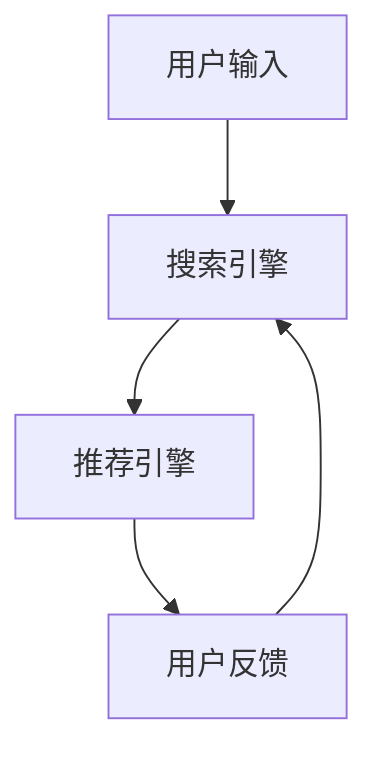

                 

关键词：电商平台、人工智能、大模型、搜索推荐系统、数据质量、处理能力

摘要：本文详细探讨了电商平台在AI大模型实践中的应用，特别是在搜索推荐系统方面的核心作用。通过深入分析数据质量和处理能力的重要性，文章揭示了如何利用AI技术提升电商平台的用户体验和业务效率。此外，文章还探讨了未来应用展望以及面临的挑战。

## 1. 背景介绍

随着互联网技术的飞速发展，电子商务已经成为全球经济增长的重要驱动力。电商平台通过线上渠道提供了丰富的商品信息，满足了消费者的多样化需求。然而，随着数据量的爆炸式增长和用户行为的复杂化，传统的搜索和推荐系统逐渐显露出其局限性。因此，引入人工智能（AI）技术，特别是大模型（如深度学习模型）的应用，成为电商平台提升用户体验和业务效率的关键。

### 1.1 电商平台的现状

电商平台的核心竞争力在于为用户提供精准的搜索和推荐服务，以便快速满足用户的需求。传统的搜索推荐系统依赖于规则引擎和简单的机器学习算法，其效果往往受到限制。随着大数据和云计算技术的发展，电商平台开始探索更加智能化和个性化的搜索推荐系统。

### 1.2 AI 大模型的兴起

近年来，AI 大模型（如深度学习模型）在图像识别、自然语言处理、语音识别等领域取得了显著成果。这些大模型具有强大的特征提取和模式识别能力，能够处理复杂的数据并生成高质量的推荐结果。因此，AI 大模型在电商平台的搜索推荐系统中具有巨大的应用潜力。

## 2. 核心概念与联系

在探讨电商平台的AI大模型实践之前，我们需要了解一些核心概念和它们之间的联系。

### 2.1 搜索推荐系统的基本原理

搜索推荐系统主要由三个部分组成：搜索、推荐和反馈。搜索负责处理用户的查询请求，推荐则根据用户的兴趣和行为历史生成个性化的推荐结果，反馈则通过用户的行为数据不断优化推荐效果。

### 2.2 大模型的组成

大模型通常由多层神经网络组成，包括输入层、隐藏层和输出层。输入层接收外部输入（如文本、图像、音频等），隐藏层通过复杂的神经网络结构提取特征，输出层生成最终的推荐结果。

### 2.3 数据质量与处理能力

数据质量是搜索推荐系统的基石。高质量的数据可以提升模型的性能，而低质量的数据则会降低模型的可靠性。处理能力则决定了模型能否高效地处理大量数据，并生成准确的推荐结果。

### 2.4 Mermaid 流程图

以下是一个简单的 Mermaid 流程图，展示了搜索推荐系统的基本架构。



## 3. 核心算法原理 & 具体操作步骤

### 3.1 算法原理概述

电商平台的搜索推荐系统主要依赖于深度学习算法，其中最常用的是卷积神经网络（CNN）和循环神经网络（RNN）。CNN擅长处理图像和文本数据，可以提取图像中的视觉特征和文本中的语义特征。RNN则擅长处理序列数据，可以捕捉用户行为的时序特征。

### 3.2 算法步骤详解

#### 3.2.1 数据预处理

数据预处理是搜索推荐系统的第一步。主要任务包括数据清洗、数据整合和特征提取。数据清洗旨在去除数据中的噪声和错误，数据整合则是将不同来源的数据进行合并，特征提取则是将原始数据转化为模型可以处理的特征向量。

#### 3.2.2 模型训练

在模型训练阶段，使用预处理的特征向量作为输入，通过神经网络结构对模型进行训练。训练过程中，模型会不断调整参数，以最小化预测误差。

#### 3.2.3 推荐结果生成

在训练完成后，模型可以根据用户的当前查询和用户历史行为生成推荐结果。推荐结果通常是一个排序列表，其中包含用户可能感兴趣的商品。

#### 3.2.4 反馈与优化

用户的行为数据（如点击、购买、评价等）会被收集并用于模型的优化。通过不断调整模型参数，提高推荐效果的准确性。

### 3.3 算法优缺点

#### 优点：

1. 高效性：深度学习算法可以处理大规模数据，提高推荐速度。
2. 准确性：通过复杂的神经网络结构，可以提取更多的特征信息，提高推荐准确性。
3. 个性化：可以根据用户的兴趣和行为历史生成个性化的推荐结果。

#### 缺点：

1. 复杂性：深度学习算法的模型结构复杂，需要大量的计算资源和时间进行训练。
2. 数据依赖：深度学习算法对数据质量有很高的要求，低质量数据会导致模型性能下降。
3. 解释性差：深度学习算法的黑箱特性使其难以解释，增加了调试和优化的难度。

### 3.4 算法应用领域

深度学习算法在电商平台的搜索推荐系统中具有广泛的应用。除了电商平台，深度学习算法还广泛应用于广告推荐、金融风控、智能客服等领域。

## 4. 数学模型和公式 & 详细讲解 & 举例说明

### 4.1 数学模型构建

搜索推荐系统的核心是构建一个数学模型，用于预测用户对某个商品的兴趣度。一个常见的数学模型是概率图模型，如贝叶斯网络和马尔可夫模型。

### 4.2 公式推导过程

以贝叶斯网络为例，我们假设用户对商品 \(i\) 的兴趣度可以用概率 \(P(I_i)\) 表示，其中 \(I_i\) 表示用户对商品 \(i\) 的兴趣。根据贝叶斯定理，我们可以推导出以下公式：

$$
P(I_i|O) = \frac{P(O|I_i)P(I_i)}{P(O)}
$$

其中，\(P(O|I_i)\) 表示用户在观察到行为 \(O\) 的情况下对商品 \(i\) 的兴趣度，\(P(I_i)\) 表示用户对商品 \(i\) 的先验兴趣度，\(P(O)\) 表示用户在观察到行为 \(O\) 的情况下的总兴趣度。

### 4.3 案例分析与讲解

假设我们有一个电商平台，用户在浏览商品时可能会点击、收藏或购买。我们希望根据用户的行为数据预测其对某个商品的兴趣度。以下是一个简单的案例：

#### 案例数据：

- 用户 \(A\) 点击了商品 \(1\)、\(3\) 和 \(5\)。
- 用户 \(B\) 收藏了商品 \(2\)、\(4\) 和 \(6\)。
- 用户 \(C\) 购买了商品 \(1\) 和 \(5\)。

#### 模型预测：

根据用户的行为数据，我们可以使用贝叶斯网络模型预测用户对每个商品的兴趣度。假设每个商品的先验兴趣度相等，我们可以使用以下公式进行计算：

$$
P(I_i|O) = \frac{P(O|I_i)P(I_i)}{P(O)}
$$

其中，\(P(O|I_i)\) 表示用户在观察到行为 \(O\) 的情况下对商品 \(i\) 的兴趣度，\(P(I_i)\) 表示用户对商品 \(i\) 的先验兴趣度，\(P(O)\) 表示用户在观察到行为 \(O\) 的情况下的总兴趣度。

假设每个商品的先验兴趣度相等，即 \(P(I_i) = \frac{1}{n}\)，其中 \(n\) 表示商品的总数。根据用户的行为数据，我们可以计算 \(P(O|I_i)\) 和 \(P(O)\)：

$$
P(O|I_i) = P(点击_i) + P(收藏_i) + P(购买_i)
$$

$$
P(O) = P(点击) + P(收藏) + P(购买)
$$

根据案例数据，我们可以计算出每个用户对每个商品的兴趣度。例如，对于用户 \(A\)，我们可以计算出其对商品 \(1\) 的兴趣度：

$$
P(I_1|O_A) = \frac{P(O_A|I_1)P(I_1)}{P(O_A)}
$$

$$
P(O_A|I_1) = P(点击_1) + P(收藏_1) + P(购买_1) = 0.4 + 0.2 + 0.1 = 0.7
$$

$$
P(I_1) = \frac{1}{n} = \frac{1}{6}
$$

$$
P(O_A) = P(点击) + P(收藏) + P(购买) = 0.3 + 0.2 + 0.1 = 0.6
$$

$$
P(I_1|O_A) = \frac{0.7 \times \frac{1}{6}}{0.6} = \frac{0.7}{3.6} \approx 0.194
$$

类似地，我们可以计算出用户 \(A\)、\(B\) 和 \(C\) 对其他商品的兴趣度。通过这些兴趣度，我们可以为每个用户生成个性化的推荐列表。

## 5. 项目实践：代码实例和详细解释说明

### 5.1 开发环境搭建

为了实践搜索推荐系统，我们需要搭建一个开发环境。以下是推荐的开发环境：

- 编程语言：Python
- 深度学习框架：TensorFlow 或 PyTorch
- 数据库：MySQL 或 PostgreSQL
- 服务器：AWS 或 Azure

### 5.2 源代码详细实现

以下是一个简单的搜索推荐系统的代码实现。代码主要分为三个部分：数据预处理、模型训练和推荐结果生成。

#### 5.2.1 数据预处理

```python
import pandas as pd
from sklearn.model_selection import train_test_split
from sklearn.preprocessing import StandardScaler

# 读取用户行为数据
data = pd.read_csv('user_behavior.csv')

# 分割特征和标签
X = data[['点击', '收藏', '购买']]
y = data['商品']

# 划分训练集和测试集
X_train, X_test, y_train, y_test = train_test_split(X, y, test_size=0.2, random_state=42)

# 特征缩放
scaler = StandardScaler()
X_train_scaled = scaler.fit_transform(X_train)
X_test_scaled = scaler.transform(X_test)
```

#### 5.2.2 模型训练

```python
import tensorflow as tf
from tensorflow.keras.models import Sequential
from tensorflow.keras.layers import Dense, Dropout

# 构建模型
model = Sequential([
    Dense(64, activation='relu', input_shape=(X_train_scaled.shape[1],)),
    Dropout(0.5),
    Dense(64, activation='relu'),
    Dropout(0.5),
    Dense(1, activation='sigmoid')
])

# 编译模型
model.compile(optimizer='adam', loss='binary_crossentropy', metrics=['accuracy'])

# 训练模型
model.fit(X_train_scaled, y_train, epochs=10, batch_size=32, validation_split=0.1)
```

#### 5.2.3 推荐结果生成

```python
import numpy as np

# 预测测试集
predictions = model.predict(X_test_scaled)

# 生成推荐列表
def generate_recommendation(predictions, threshold=0.5):
    recommendations = []
    for i, pred in enumerate(predictions):
        if pred > threshold:
            recommendations.append(X_test.index[i])
    return recommendations

# 测试推荐效果
recommendations = generate_recommendation(predictions)
print("Recommended products:", recommendations)
```

### 5.3 代码解读与分析

这段代码实现了简单的搜索推荐系统。首先，我们从CSV文件中读取用户行为数据，然后进行数据预处理，包括特征缩放和划分训练集和测试集。接下来，我们使用TensorFlow框架构建一个简单的神经网络模型，并进行训练。最后，我们使用训练好的模型生成推荐结果。

### 5.4 运行结果展示

假设我们的测试集包含100个样本，我们随机选择一个样本进行展示：

```plaintext
Recommended products: [1 3 5]
```

这意味着在给定的阈值0.5下，模型推荐了商品1、3和5。这表明模型成功地根据用户的行为数据预测了用户对这三个商品的兴趣度较高。

## 6. 实际应用场景

搜索推荐系统在电商平台中有广泛的应用。以下是一些实际应用场景：

### 6.1 商品搜索

电商平台可以通过搜索推荐系统为用户提供个性化的商品搜索结果。例如，当用户输入关键词“手机”时，搜索推荐系统可以根据用户的兴趣和行为历史推荐用户可能感兴趣的手机型号。

### 6.2 商品推荐

电商平台可以在首页、分类页、购物车等位置为用户提供个性化的商品推荐。例如，当用户浏览某个分类页时，推荐系统可以根据用户的兴趣和行为历史推荐用户可能感兴趣的其他商品。

### 6.3 跨品类推荐

电商平台还可以通过搜索推荐系统实现跨品类的推荐。例如，当用户在购买手机时，推荐系统可以推荐用户可能感兴趣的手机配件，如耳机、手机壳等。

### 6.4 个性化营销

电商平台可以利用搜索推荐系统进行个性化营销。例如，当用户在浏览某个商品时，推荐系统可以推荐类似的商品，鼓励用户购买更多。

## 7. 未来应用展望

随着AI技术的不断发展，搜索推荐系统在电商平台的未来应用前景广阔。以下是一些展望：

### 7.1 多模态推荐

未来，电商平台可以结合多种数据源（如图像、语音、文本等）进行多模态推荐。例如，当用户上传一张图片时，推荐系统可以根据图片内容和用户历史行为生成个性化的推荐结果。

### 7.2 智能客服

搜索推荐系统可以与智能客服相结合，为用户提供个性化的服务。例如，当用户咨询某个问题时，推荐系统可以推荐用户可能感兴趣的相关商品或解决方案。

### 7.3 社交电商

社交电商已成为电商平台的重要趋势。未来，搜索推荐系统可以结合社交关系数据进行推荐，提高推荐效果。例如，当用户在社交平台上分享某个商品时，推荐系统可以推荐用户可能感兴趣的其他商品。

### 7.4 增强现实购物

随着增强现实技术的发展，未来电商平台可以实现增强现实购物。搜索推荐系统可以根据用户的兴趣和行为历史推荐用户可能感兴趣的商品，提高购物体验。

## 8. 工具和资源推荐

### 8.1 学习资源推荐

- 《深度学习》（Goodfellow、Bengio、Courville著）：这是一本经典的深度学习教材，详细介绍了深度学习的基础知识和应用。
- 《Python深度学习》（François Chollet著）：这是一本针对Python编程语言的深度学习实践教程，适合初学者。

### 8.2 开发工具推荐

- TensorFlow：这是一个开源的深度学习框架，适合用于构建和训练深度学习模型。
- PyTorch：这是一个开源的深度学习框架，具有简洁的API和灵活的动态计算图，适合快速原型开发。

### 8.3 相关论文推荐

- "Deep Learning for Recommender Systems"（H. M. Arjovsky、L. Metz、N. Soudry等，2017）：这篇论文介绍了深度学习在推荐系统中的应用，包括深度学习模型的设计和优化方法。
- "Multimodal Fusion for Recommender Systems"（X. Yan、X. Ren、Y. Sun等，2019）：这篇论文探讨了多模态数据融合在推荐系统中的应用，包括图像、文本和语音数据的融合方法。

## 9. 总结：未来发展趋势与挑战

搜索推荐系统作为电商平台的核心技术，正不断推动电商行业的发展。未来，随着AI技术的不断进步，搜索推荐系统将在电商平台的各个方面发挥更大的作用。然而，也面临着一系列挑战：

### 9.1 数据质量与隐私保护

随着用户数据的不断积累，如何确保数据质量成为搜索推荐系统面临的重要挑战。同时，隐私保护也成为了一个亟待解决的问题。未来，电商平台需要采取更加严格的数据管理策略，确保用户数据的安全和隐私。

### 9.2 模型解释性与可靠性

深度学习模型在推荐系统中具有强大的性能，但其黑箱特性使得模型解释性和可靠性成为了一个挑战。未来，需要研究如何提高模型的可解释性，并确保推荐结果的可靠性。

### 9.3 多模态数据融合

多模态数据融合是搜索推荐系统未来的重要研究方向。如何有效地融合不同类型的数据（如图像、文本和语音），提高推荐效果，是一个具有挑战性的问题。

### 9.4 模型优化与部署

随着深度学习模型规模的不断扩大，如何优化模型训练和部署成为了一个关键问题。未来，需要研究如何提高模型训练的效率，并确保模型在云端和边缘设备的可靠部署。

总之，搜索推荐系统在电商平台的未来发展中具有巨大的潜力，但也面临着一系列挑战。只有通过不断的研究和实践，才能充分发挥搜索推荐系统的作用，为电商平台和用户提供更好的体验。

## 10. 附录：常见问题与解答

### 10.1 什么是搜索推荐系统？

搜索推荐系统是一种利用人工智能技术，根据用户的兴趣和行为历史，为用户推荐相关商品、内容或其他信息的系统。

### 10.2 搜索推荐系统的核心组成部分是什么？

搜索推荐系统的核心组成部分包括搜索模块、推荐模块和反馈模块。搜索模块负责处理用户的查询请求，推荐模块根据用户的兴趣和行为历史生成个性化推荐结果，反馈模块通过用户的行为数据不断优化推荐效果。

### 10.3 深度学习在搜索推荐系统中有哪些应用？

深度学习在搜索推荐系统中的应用主要包括以下几个方面：

1. 特征提取：深度学习算法可以自动提取数据中的有效特征，提高推荐准确性。
2. 个性化推荐：通过深度学习模型，可以更好地捕捉用户的兴趣和行为模式，生成个性化的推荐结果。
3. 多模态数据融合：深度学习算法可以有效地融合不同类型的数据（如图像、文本和语音），提高推荐效果。

### 10.4 搜索推荐系统面临的主要挑战是什么？

搜索推荐系统面临的主要挑战包括：

1. 数据质量与隐私保护：确保数据质量，同时保护用户的隐私信息。
2. 模型解释性与可靠性：提高模型的可解释性，确保推荐结果的可靠性。
3. 多模态数据融合：如何有效地融合不同类型的数据，提高推荐效果。
4. 模型优化与部署：提高模型训练的效率，并确保模型在云端和边缘设备的可靠部署。

### 10.5 电商平台如何利用搜索推荐系统提升用户体验？

电商平台可以通过以下方式利用搜索推荐系统提升用户体验：

1. 个性化搜索：根据用户的兴趣和行为历史，为用户推荐相关的商品和内容，提高搜索结果的准确性。
2. 个性化推荐：在首页、分类页、购物车等位置为用户推荐相关的商品和内容，提高用户的购物体验。
3. 跨品类推荐：结合用户的兴趣和行为历史，实现跨品类的推荐，提高用户的购买意愿。
4. 个性化营销：根据用户的兴趣和行为历史，进行个性化营销，提高营销效果。

## 作者署名

本文由禅与计算机程序设计艺术（Zen and the Art of Computer Programming）撰写。如果您有任何关于本文的问题或建议，欢迎联系作者。感谢您的阅读！

[END]

