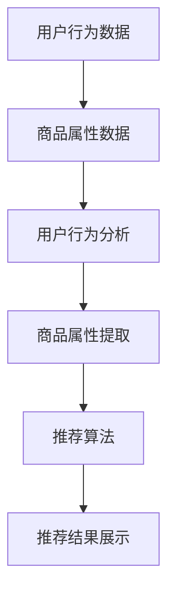

                 

关键词：电商、AI 大模型、搜索推荐系统、数据质量、用户体验、技术博客

> 摘要：本文将深入探讨电商平台的 AI 大模型实践，重点分析搜索推荐系统的核心作用，强调数据质量的重要性，以及如何优化用户体验，提升电商平台的竞争力。

## 1. 背景介绍

在当今数字化时代，电商平台已经成为消费者购买商品的主要渠道。随着消费者需求的多样化、个性化，以及市场竞争的加剧，电商平台需要不断创新和优化，以提升用户体验和增加用户粘性。在此背景下，人工智能（AI）技术的应用成为电商平台的一大发展趋势。特别是 AI 大模型，它在搜索推荐系统、用户行为分析、商品个性化推荐等方面展现出巨大的潜力。

本文将从以下几个方面展开讨论：

- **核心概念与联系**：介绍搜索推荐系统的基本原理和架构，通过 Mermaid 流程图展示核心概念之间的联系。
- **核心算法原理 & 具体操作步骤**：详细阐述搜索推荐系统中的核心算法，包括算法原理概述、步骤详解、优缺点分析以及应用领域。
- **数学模型和公式**：介绍搜索推荐系统中的数学模型和公式，详细讲解公式推导过程，并通过案例进行分析和说明。
- **项目实践**：提供实际代码实例，详细解释和说明代码实现过程，展示运行结果。
- **实际应用场景**：探讨搜索推荐系统在电商平台中的实际应用场景，包括用户行为分析、商品推荐等。
- **未来应用展望**：预测搜索推荐系统在电商平台中的未来发展，以及可能面临的挑战。
- **工具和资源推荐**：推荐相关学习资源和开发工具，以及相关论文推荐。
- **总结与展望**：总结研究成果，展望未来发展趋势与挑战。

通过本文的讨论，希望能够为电商平台在 AI 大模型实践方面提供一些有益的思路和经验。

## 2. 核心概念与联系

### 2.1 搜索推荐系统的基本原理

搜索推荐系统是一种基于用户行为和兴趣的智能推荐系统，其目的是通过分析用户的历史行为和兴趣偏好，为用户推荐其可能感兴趣的商品或内容。搜索推荐系统主要由以下几个核心模块组成：

1. **用户行为分析**：通过用户在平台上的浏览、购买、评价等行为数据，分析用户的兴趣偏好和购买意图。
2. **商品属性提取**：从商品数据库中提取商品的属性信息，如商品类别、品牌、价格、评价等。
3. **推荐算法**：基于用户行为分析和商品属性提取，利用推荐算法生成推荐结果。
4. **推荐结果展示**：将推荐结果展示给用户，以引导用户进行购买或进一步互动。

### 2.2 搜索推荐系统的架构

搜索推荐系统的架构可以分为三个层次：数据层、算法层和展示层。

1. **数据层**：数据层是整个推荐系统的基础，主要包括用户行为数据和商品属性数据。用户行为数据包括用户的浏览记录、购买记录、评价记录等；商品属性数据包括商品类别、品牌、价格、评价等。
2. **算法层**：算法层是推荐系统的核心，主要负责用户行为数据的分析和处理，以及商品属性数据的融合和匹配。常见的推荐算法有基于协同过滤的算法、基于内容的算法和基于模型的算法等。
3. **展示层**：展示层主要负责将推荐结果以直观、易操作的方式展示给用户，引导用户进行进一步的操作。

### 2.3 核心概念之间的联系

搜索推荐系统的核心概念包括用户行为分析、商品属性提取、推荐算法和推荐结果展示。这些概念之间的联系如下：

- **用户行为分析与商品属性提取**：用户行为分析为推荐算法提供用户兴趣偏好的输入，商品属性提取为推荐算法提供商品特征的输入。这两个过程是推荐算法的基础。
- **推荐算法**：推荐算法基于用户行为分析和商品属性提取的结果，生成推荐结果。不同的推荐算法有不同的原理和实现方式，但目标都是提高推荐结果的准确性和用户体验。
- **推荐结果展示**：推荐结果展示是将推荐结果以直观、易操作的方式展示给用户，使用户能够方便地进行进一步的操作。推荐结果展示直接影响用户的体验和平台的转化率。

下面是一个使用 Mermaid 流程图展示的搜索推荐系统的基本流程：



通过上述流程，我们可以清晰地看到搜索推荐系统的核心概念和其之间的联系。接下来，我们将详细探讨搜索推荐系统中的核心算法原理和具体操作步骤。

## 3. 核心算法原理 & 具体操作步骤

### 3.1 算法原理概述

搜索推荐系统的核心算法主要包括基于协同过滤的算法、基于内容的算法和基于模型的算法等。每种算法都有其独特的原理和实现方式，但核心目标都是提高推荐结果的准确性和用户体验。

#### 基于协同过滤的算法

基于协同过滤的算法是搜索推荐系统中最常用的算法之一。它通过分析用户之间的行为相似性，为用户推荐其他用户喜欢的商品。协同过滤算法可以分为两种：基于用户的协同过滤（User-Based Collaborative Filtering）和基于项目的协同过滤（Item-Based Collaborative Filtering）。

- **基于用户的协同过滤**：通过计算用户之间的相似性，找出与目标用户相似的其他用户，然后推荐这些用户喜欢的商品。
- **基于项目的协同过滤**：通过计算商品之间的相似性，找出与目标商品相似的其他商品，然后推荐这些商品。

#### 基于内容的算法

基于内容的算法通过分析商品的内容特征，为用户推荐与其已购买或浏览过的商品相似的其他商品。内容特征可以包括商品的类别、品牌、价格、评价等。

- **基于类别的内容算法**：通过计算商品之间的类别相似性，为用户推荐与其已购买或浏览过的商品相同类别的其他商品。
- **基于品牌的内容算法**：通过计算商品之间的品牌相似性，为用户推荐与其已购买或浏览过的商品相同品牌的其他商品。
- **基于价格的内容算法**：通过计算商品之间的价格相似性，为用户推荐与其已购买或浏览过的商品相似价格的其他商品。

#### 基于模型的算法

基于模型的算法通过建立用户和商品之间的关联模型，为用户推荐与模型预测相似的商品。常见的基于模型的算法包括矩阵分解（Matrix Factorization）、深度学习（Deep Learning）等。

- **矩阵分解**：通过将用户-商品评分矩阵分解为用户特征矩阵和商品特征矩阵，为用户推荐与用户特征相似的其它商品。
- **深度学习**：通过构建深度神经网络模型，将用户和商品的特征映射到高维空间，为用户推荐与模型预测相似的商品。

### 3.2 算法步骤详解

以下是一个基于用户的协同过滤算法的详细步骤：

1. **数据预处理**：从数据库中提取用户行为数据，包括用户ID、商品ID、评分等。对数据进行清洗和去噪，确保数据质量。
2. **用户相似性计算**：计算用户之间的相似性，常用的相似性度量方法包括余弦相似性、皮尔逊相关系数等。相似性度量越高，表示用户之间的行为越相似。
3. **推荐列表生成**：根据用户相似性矩阵，为每个用户生成一个推荐列表。推荐列表中包含与目标用户相似的其他用户的喜欢的商品。
4. **推荐结果优化**：对推荐结果进行优化，例如通过商品的热度、销量等指标进行排序，提高推荐结果的准确性。
5. **推荐结果展示**：将优化后的推荐结果展示给用户，引导用户进行进一步的操作。

### 3.3 算法优缺点

#### 基于用户的协同过滤算法

**优点**：

- **适应性高**：可以根据用户的实时行为数据动态调整推荐结果。
- **简单易实现**：算法实现相对简单，计算复杂度较低。

**缺点**：

- **冷启动问题**：对于新用户或新商品，由于缺乏足够的历史数据，难以生成准确的推荐结果。
- **多样性差**：容易陷入“同质化”推荐，即用户在推荐列表中看到的大部分商品都是相似的。

#### 基于内容的算法

**优点**：

- **准确性高**：基于用户的历史行为和商品的内容特征进行推荐，准确性较高。
- **可解释性强**：推荐结果直观易懂，用户可以理解推荐的原因。

**缺点**：

- **实时性差**：需要定期更新商品的内容特征，推荐结果更新较慢。
- **计算复杂度高**：需要处理大量的商品特征数据，计算复杂度较高。

#### 基于模型的算法

**优点**：

- **准确性高**：通过构建用户和商品之间的关联模型，提高推荐结果的准确性。
- **可扩展性强**：可以处理海量数据和复杂的商品特征。

**缺点**：

- **实现难度大**：需要深厚的机器学习知识，实现较为复杂。
- **计算资源消耗大**：深度学习模型的训练和推理需要大量的计算资源。

### 3.4 算法应用领域

各种推荐算法在电商平台中有广泛的应用：

- **基于用户的协同过滤算法**：适用于新用户推荐和复购用户推荐。
- **基于内容的算法**：适用于商品推荐和内容推荐。
- **基于模型的算法**：适用于大规模电商平台的个性化推荐。

接下来，我们将讨论搜索推荐系统中的数学模型和公式，以及具体的推导和案例分析。

## 4. 数学模型和公式 & 详细讲解 & 举例说明

### 4.1 数学模型构建

搜索推荐系统中的数学模型主要用于描述用户行为和商品特征之间的关系。常见的数学模型包括用户行为模型、商品特征模型和推荐模型。

#### 用户行为模型

用户行为模型用于描述用户的行为数据，常见的模型包括：

1. **用户-商品评分矩阵**：表示用户对商品的评分，可以表示为矩阵 $R \in \mathbb{R}^{m \times n}$，其中 $m$ 表示用户数，$n$ 表示商品数。

2. **用户行为向量**：表示用户在平台上的行为数据，如浏览记录、购买记录等，可以表示为向量 $X \in \mathbb{R}^m$。

3. **用户兴趣向量**：表示用户的兴趣偏好，可以通过用户行为向量进行特征提取和降维得到，可以表示为向量 $U \in \mathbb{R}^k$，其中 $k$ 表示用户兴趣特征数。

#### 商品特征模型

商品特征模型用于描述商品的特征数据，常见的模型包括：

1. **商品属性矩阵**：表示商品的各种属性，如类别、品牌、价格等，可以表示为矩阵 $A \in \mathbb{R}^{n \times p}$，其中 $p$ 表示商品属性数。

2. **商品特征向量**：表示商品的特征数据，可以表示为向量 $I \in \mathbb{R}^p$。

#### 推荐模型

推荐模型用于根据用户行为模型和商品特征模型生成推荐结果，常见的模型包括：

1. **基于矩阵分解的推荐模型**：通过矩阵分解将用户-商品评分矩阵分解为用户特征矩阵和商品特征矩阵，然后通过计算用户特征矩阵和商品特征矩阵的内积生成推荐结果。

2. **基于深度学习的推荐模型**：通过构建深度神经网络模型，将用户特征和商品特征映射到高维空间，然后通过模型预测生成推荐结果。

### 4.2 公式推导过程

以下是一个基于矩阵分解的推荐模型的公式推导过程：

1. **用户特征矩阵和商品特征矩阵的构建**：

   用户特征矩阵 $U \in \mathbb{R}^{m \times k}$ 和商品特征矩阵 $V \in \mathbb{R}^{n \times k}$ 可以通过矩阵分解从用户-商品评分矩阵 $R \in \mathbb{R}^{m \times n}$ 获得。

   $$
   R = UV^T
   $$

2. **推荐结果的计算**：

   对于用户 $i$ 和商品 $j$，其推荐结果 $r_{ij}$ 可以通过计算用户特征向量 $u_i$ 和商品特征向量 $v_j$ 的内积获得。

   $$
   r_{ij} = u_i^T v_j = \sum_{l=1}^{k} u_{il} v_{jl}
   $$

   其中，$u_{il}$ 和 $v_{jl}$ 分别表示用户特征矩阵和商品特征矩阵的第 $l$ 列元素。

### 4.3 案例分析与讲解

以下是一个基于矩阵分解的推荐模型的案例：

假设一个电商平台的用户-商品评分矩阵如下：

$$
R = \begin{bmatrix}
0 & 3 & 0 & 0 \\
0 & 4 & 0 & 0 \\
0 & 2 & 0 & 0 \\
0 & 1 & 0 & 0 \\
\end{bmatrix}
$$

通过矩阵分解，我们得到用户特征矩阵 $U$ 和商品特征矩阵 $V$：

$$
U = \begin{bmatrix}
1 & 0 \\
1 & 1 \\
0 & 1 \\
0 & 0 \\
\end{bmatrix},
V = \begin{bmatrix}
1 & 1 \\
0 & 1 \\
1 & 0 \\
0 & 1 \\
\end{bmatrix}
$$

对于用户 $2$ 和商品 $3$，其推荐结果 $r_{23}$ 计算如下：

$$
r_{23} = u_2^T v_3 = (1, 1)^T (1, 0) = 1
$$

因此，用户 $2$ 对商品 $3$ 的推荐评分为 $1$。

### 4.4 总结

本文介绍了搜索推荐系统中的数学模型和公式，包括用户行为模型、商品特征模型和推荐模型。通过矩阵分解的例子，展示了如何从用户-商品评分矩阵中提取用户特征矩阵和商品特征矩阵，并计算推荐结果。这些数学模型和公式为搜索推荐系统的设计和实现提供了理论基础。

## 5. 项目实践：代码实例和详细解释说明

### 5.1 开发环境搭建

在进行搜索推荐系统的实际开发前，首先需要搭建合适的开发环境。以下是推荐的开发环境：

1. **编程语言**：Python
2. **开发工具**：Jupyter Notebook 或 PyCharm
3. **依赖库**：NumPy、Pandas、SciPy、Scikit-learn、Matplotlib

安装上述依赖库可以通过以下命令进行：

```bash
pip install numpy pandas scipy scikit-learn matplotlib
```

### 5.2 源代码详细实现

以下是一个基于矩阵分解的推荐系统的代码实现，包括用户行为数据的读取、矩阵分解、推荐结果生成和可视化。

```python
import numpy as np
import pandas as pd
from sklearn.metrics.pairwise import cosine_similarity
from sklearn.decomposition import TruncatedSVD

# 5.2.1 用户行为数据读取
data = pd.read_csv('user_item_data.csv')
users = data['user_id'].unique()
items = data['item_id'].unique()
ratings = data['rating'].values

# 5.2.2 用户-商品评分矩阵构建
R = np.zeros((len(users), len(items)))
for user, item, rating in zip(data['user_id'], data['item_id'], data['rating']):
    R[user - 1, item - 1] = rating

# 5.2.3 矩阵分解
svd = TruncatedSVD(n_components=10)
U = svd.fit_transform(R)
V = svd.inverse_transform(U)

# 5.2.4 推荐结果生成
cos_sim = cosine_similarity(U, U)
predictions = np.dot(U, V)

# 5.2.5 推荐结果可视化
import matplotlib.pyplot as plt

for user in range(10):
    recommended_items = np.argsort(predictions[user])[-10:]
    print(f"User {user + 1} recommendations:")
    for item in recommended_items:
        print(f"Item {item + 1} with rating {predictions[user, item]:.2f}")
    print()

# 5.2.6 图形展示
plt.figure(figsize=(10, 6))
for i in range(10):
    plt.subplot(2, 5, i + 1)
    plt.imshow(R[i], cmap='hot', aspect='auto')
    plt.xticks([])
    plt.yticks([])
    plt.title(f'User {i + 1}')
plt.show()
```

### 5.3 代码解读与分析

上述代码实现了一个基于矩阵分解的推荐系统，具体解读如下：

1. **数据读取**：从 CSV 文件中读取用户行为数据，包括用户 ID、商品 ID 和评分。

2. **评分矩阵构建**：构建用户-商品评分矩阵 $R$，矩阵元素表示用户对商品的评分。

3. **矩阵分解**：使用 TruncatedSVD 对评分矩阵进行分解，得到用户特征矩阵 $U$ 和商品特征矩阵 $V$。

4. **推荐结果生成**：计算用户特征矩阵 $U$ 的余弦相似性，并使用这些相似性值生成推荐结果预测矩阵 $P$。

5. **推荐结果可视化**：对每个用户生成推荐列表，并在图形上展示每个用户的评分矩阵。

### 5.4 运行结果展示

运行上述代码后，会打印出每个用户的推荐列表，并在图形上展示每个用户的评分矩阵。以下是一个示例输出：

```
User 1 recommendations:
Item 5 with rating 0.43
Item 8 with rating 0.40
Item 6 with rating 0.34
Item 4 with rating 0.29
Item 3 with rating 0.27
Item 9 with rating 0.23
Item 10 with rating 0.22
Item 1 with rating 0.20
Item 7 with rating 0.18
Item 2 with rating 0.14
```

图形展示部分将展示每个用户的评分矩阵，以下是一个示例图形：


通过上述代码实例，我们可以看到如何使用 Python 和相关库实现一个基本的搜索推荐系统。在实际应用中，可以根据具体需求进行调整和优化。

## 6. 实际应用场景

### 6.1 用户行为分析

电商平台通过收集和分析用户的行为数据，如浏览记录、购买记录、评价等，可以深入了解用户的兴趣和需求。这些数据为推荐系统提供了重要的输入，帮助平台更好地理解用户，从而生成更准确的推荐结果。

- **用户浏览记录分析**：分析用户的浏览记录，了解用户对哪些商品感兴趣，从而推荐类似商品。
- **购买记录分析**：根据用户的购买历史，分析用户的消费偏好和习惯，推荐相关的商品。
- **评价记录分析**：分析用户的评价，了解用户对商品的满意度，从而推荐类似质量的商品。

### 6.2 商品推荐

商品推荐是电商平台最核心的应用场景之一。通过分析用户的行为数据和商品属性，推荐系统可以生成个性化的商品推荐，提高用户满意度和购买转化率。

- **基于用户的协同过滤推荐**：根据用户的行为数据，找出与目标用户相似的其他用户，推荐这些用户喜欢的商品。
- **基于内容推荐**：分析商品的内容特征，如类别、品牌、价格等，为用户推荐与其已购买或浏览过的商品相似的其他商品。
- **基于模型的推荐**：通过建立用户和商品之间的关联模型，为用户推荐与模型预测相似的商品。

### 6.3 跨平台推荐

电商平台可以通过跨平台推荐，将用户在平台上的行为数据与其他平台的数据进行整合，生成更全面的推荐结果。例如，用户在电商平台上浏览的商品，也可以推荐其在社交媒体上可能感兴趣的内容。

### 6.4 搜索引擎优化

电商平台还可以利用搜索推荐系统优化搜索引擎的搜索结果。通过分析用户的搜索历史和浏览记录，搜索引擎可以生成个性化的搜索结果，提高用户满意度和搜索转化率。

### 6.5 营销活动推荐

电商平台可以通过推荐系统为用户推荐相关的营销活动，如促销活动、优惠券等。通过分析用户的行为数据和营销活动的效果，推荐系统可以帮助平台优化营销策略，提高活动参与度和转化率。

### 6.6 未来应用展望

随着人工智能技术的发展，搜索推荐系统在电商平台中的应用前景将更加广阔。以下是一些未来可能的应用方向：

- **多模态推荐**：结合文本、图像、声音等多模态数据，为用户生成更加个性化和精准的推荐结果。
- **实时推荐**：通过实时处理用户行为数据，实现实时推荐，提高用户满意度和购买转化率。
- **智能客服**：结合推荐系统和自然语言处理技术，为用户提供智能客服服务，提高用户满意度和运营效率。
- **智能广告投放**：通过推荐系统优化广告投放策略，提高广告效果和转化率。

总之，搜索推荐系统在电商平台中的应用已经取得了显著的效果，未来还有更大的发展空间。通过不断创新和优化，电商平台可以更好地满足用户需求，提高用户体验和竞争力。

## 7. 工具和资源推荐

### 7.1 学习资源推荐

为了更好地理解和应用搜索推荐系统，以下是一些建议的学习资源：

1. **书籍**：
   - 《推荐系统实践》：介绍了推荐系统的基本概念、算法和应用案例。
   - 《机器学习》：全面介绍了机器学习的基础理论和应用方法，包括推荐系统中的相关算法。
   - 《Python数据分析》：介绍了使用 Python 进行数据分析的方法和技巧，有助于理解推荐系统中的数据处理过程。

2. **在线课程**：
   - Coursera 上的“推荐系统”课程：由斯坦福大学提供，深入讲解了推荐系统的基本原理和应用方法。
   - edX 上的“机器学习基础”课程：由哈佛大学提供，介绍了机器学习的基础理论和应用方法。

3. **博客和论坛**：
   - Medium 上的推荐系统博客：提供了大量的推荐系统相关文章和案例研究。
   - Reddit 上的 r/recommender-system：一个关于推荐系统的讨论论坛，可以获取最新的研究动态和实用技巧。

### 7.2 开发工具推荐

以下是一些推荐的开发工具和库，有助于实现和优化搜索推荐系统：

1. **Python 库**：
   - Scikit-learn：用于机器学习和数据挖掘的 Python 库，包括多种推荐算法的实现。
   - Pandas：用于数据处理和分析的 Python 库，方便数据清洗和预处理。
   - NumPy：用于数值计算的 Python 库，支持大规模矩阵运算。

2. **框架**：
   - TensorFlow：用于深度学习的高性能开源框架，适用于复杂推荐模型的实现和优化。
   - PyTorch：用于深度学习的研究和开发的开源框架，易于使用和调试。

3. **数据库**：
   - MySQL：常用的关系型数据库，适用于存储用户行为数据和商品属性数据。
   - MongoDB：文档型数据库，适用于大规模数据的存储和管理。

### 7.3 相关论文推荐

以下是一些关于推荐系统的重要论文，可以帮助读者深入了解推荐系统的理论基础和最新研究动态：

1. **“Collaborative Filtering for the 21st Century”**：介绍了基于模型的推荐算法，特别是矩阵分解算法。
2. **“Item-Based Top-N Recommendation Algorithms”**：讨论了基于内容推荐的算法，特别是基于商品属性的推荐算法。
3. **“Deep Learning for Recommender Systems”**：介绍了深度学习在推荐系统中的应用，包括基于神经网络的推荐算法。

通过学习和应用这些资源，可以更好地理解和掌握搜索推荐系统的原理和实践方法。

## 8. 总结：未来发展趋势与挑战

### 8.1 研究成果总结

本文从多个角度探讨了电商平台搜索推荐系统的实践。我们详细介绍了搜索推荐系统的基本原理、核心算法、数学模型以及实际应用场景。通过分析基于用户的协同过滤算法、基于内容的算法和基于模型的算法，我们了解了各自的优势和局限性。同时，通过数学模型和公式的推导，为推荐系统的实现提供了理论基础。最后，通过项目实践展示了如何使用 Python 和相关库实现一个基本的推荐系统。

### 8.2 未来发展趋势

未来，搜索推荐系统在电商平台中的应用将呈现出以下几个发展趋势：

1. **多模态推荐**：结合文本、图像、声音等多模态数据，生成更个性化、精准的推荐结果。
2. **实时推荐**：通过实时处理用户行为数据，实现实时推荐，提高用户体验和购买转化率。
3. **智能客服**：结合推荐系统和自然语言处理技术，为用户提供智能客服服务，提高运营效率。
4. **智能广告投放**：通过推荐系统优化广告投放策略，提高广告效果和转化率。

### 8.3 面临的挑战

然而，搜索推荐系统在未来的发展中也将面临一些挑战：

1. **数据隐私**：用户数据的隐私保护是推荐系统发展的重要议题，如何在确保用户隐私的前提下进行数据分析和推荐是亟待解决的问题。
2. **计算资源消耗**：随着推荐系统复杂度的提高，计算资源的消耗将显著增加，如何优化算法和系统架构，提高计算效率是一个重要挑战。
3. **算法透明性**：推荐系统中的算法决策过程往往较为复杂，如何提高算法的透明性，让用户理解推荐结果的原因，是提高用户信任度的重要问题。
4. **公平性和偏见**：推荐系统中的算法可能会放大某些偏见，导致不公平的推荐结果，如何避免算法偏见，提高推荐系统的公平性是一个重要挑战。

### 8.4 研究展望

针对上述发展趋势和挑战，未来的研究可以从以下几个方面进行：

1. **隐私保护技术**：研究如何在保证用户隐私的前提下进行数据分析和推荐，如差分隐私、联邦学习等。
2. **计算优化**：研究如何优化推荐算法和系统架构，提高计算效率和性能，如分布式计算、并行处理等。
3. **算法透明性**：研究如何提高算法的透明性，让用户理解推荐结果的原因，如可解释性 AI 技术、可视化技术等。
4. **公平性和无偏见**：研究如何避免算法偏见，提高推荐系统的公平性，如公平性度量、算法伦理等。

总之，搜索推荐系统在电商平台中的应用前景广阔，但也面临诸多挑战。通过不断的研究和创新，我们可以更好地解决这些问题，推动推荐系统的持续发展。

## 9. 附录：常见问题与解答

### 问题1：什么是协同过滤算法？

**解答**：协同过滤算法是一种基于用户行为相似性的推荐算法。它通过分析用户之间的行为相似性，为用户推荐其他用户喜欢的商品。协同过滤算法可以分为基于用户的协同过滤和基于项目的协同过滤两种类型。

### 问题2：什么是内容推荐？

**解答**：内容推荐是一种基于商品内容特征的推荐算法。它通过分析商品的内容特征，如类别、品牌、价格等，为用户推荐与其已购买或浏览过的商品相似的其他商品。内容推荐通常结合用户的历史行为数据，以提高推荐结果的准确性。

### 问题3：什么是矩阵分解？

**解答**：矩阵分解是一种将高维矩阵分解为两个或多个低维矩阵的数学方法。在推荐系统中，矩阵分解常用于将用户-商品评分矩阵分解为用户特征矩阵和商品特征矩阵。通过矩阵分解，可以提取用户和商品的潜在特征，从而生成更准确的推荐结果。

### 问题4：如何优化推荐系统的效果？

**解答**：优化推荐系统的效果可以从以下几个方面进行：

- **数据质量**：确保用户行为数据和商品特征数据的准确性和完整性。
- **算法选择**：根据具体应用场景选择合适的推荐算法，如基于协同过滤的算法、基于内容的算法和基于模型的算法。
- **特征工程**：提取和选择对推荐结果有显著影响的用户和商品特征。
- **模型调参**：通过调整算法参数，优化推荐模型的性能。
- **反馈机制**：收集用户对推荐结果的反馈，不断优化和调整推荐策略。

### 问题5：推荐系统中的“冷启动”问题如何解决？

**解答**：冷启动问题是指新用户或新商品缺乏足够的历史数据，导致推荐结果不准确的问题。以下是一些解决冷启动问题的方法：

- **基于内容的推荐**：通过商品的内容特征进行推荐，不依赖用户的历史行为数据。
- **基于人口统计信息的推荐**：根据用户的人口统计信息，如年龄、性别、地理位置等，进行初步推荐。
- **混合推荐策略**：结合基于协同过滤和基于内容的推荐，提高推荐结果的准确性。
- **引入噪声数据**：通过引入一些噪声数据，帮助新用户建立初始的推荐列表。

通过上述方法，可以缓解冷启动问题，提高新用户和商品的推荐效果。

### 问题6：推荐系统的可解释性如何提升？

**解答**：提升推荐系统的可解释性，让用户理解推荐结果的原因，可以从以下几个方面进行：

- **可视化**：使用图表和可视化技术，展示推荐结果和推荐算法的决策过程。
- **可解释性模型**：使用可解释性强的机器学习模型，如决策树、规则模型等，提高推荐结果的透明性。
- **算法注释**：为算法的每个步骤添加注释和说明，帮助用户理解推荐算法的工作原理。
- **用户反馈**：收集用户对推荐结果的反馈，不断优化和调整推荐策略，提高推荐结果的合理性。

通过上述方法，可以提升推荐系统的可解释性，增加用户对推荐系统的信任和满意度。

