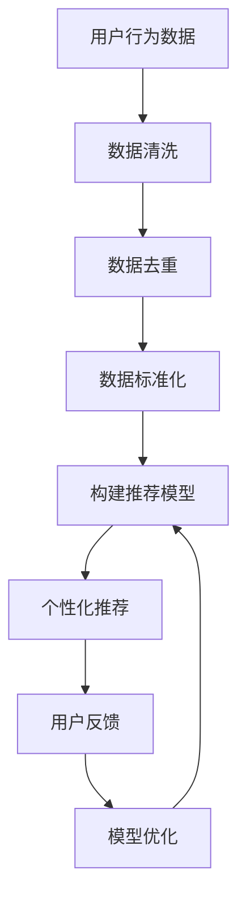

                 

关键词：电商平台，AI 大模型，搜索推荐系统，数据质量控制，用户体验

> 摘要：本文探讨了电商平台在 AI 大模型转型过程中，如何将搜索推荐系统作为核心，同时重视数据质量控制和提升用户体验。文章分析了搜索推荐系统的原理、核心算法、数学模型以及实践应用，探讨了未来发展趋势和挑战，为电商平台提供了一些实用的建议和资源。

## 1. 背景介绍

随着互联网的快速发展，电商平台已经成为现代商业的重要一环。传统的电商平台主要依赖于广告和促销等手段来吸引用户，而随着 AI 技术的崛起，越来越多的电商平台开始探索 AI 大模型的转型，以提高用户满意度、提升销售业绩。

搜索推荐系统作为电商平台的核心之一，发挥着至关重要的作用。通过 AI 大模型，平台能够实现智能搜索、个性化推荐等功能，从而提高用户体验，增加用户粘性。同时，数据质量控制也是电商平台 AI 大模型转型过程中的关键因素，良好的数据质量能够保证推荐系统的准确性和可靠性。

本文将从以下几个方面展开讨论：搜索推荐系统的原理和核心算法、数据质量控制的重要性、用户体验的提升策略、实践应用案例以及未来发展趋势和挑战。

## 2. 核心概念与联系

### 2.1 AI 大模型

AI 大模型是指一种具有强大计算能力和数据处理能力的深度学习模型，能够对大量数据进行分析和建模。在电商平台上，AI 大模型主要应用于搜索推荐系统、智能客服、图像识别等领域。

### 2.2 搜索推荐系统

搜索推荐系统是指一种基于用户行为数据、商品信息等数据构建的智能推荐系统，能够根据用户兴趣、购买历史等信息为用户推荐相关商品。在电商平台上，搜索推荐系统对于提高用户满意度和销售额具有重要意义。

### 2.3 数据质量控制

数据质量控制是指通过对数据进行清洗、去重、标准化等处理，保证数据准确性和一致性。在 AI 大模型应用过程中，良好的数据质量是保证模型性能和准确性的基础。

### 2.4 用户体验

用户体验是指用户在使用产品或服务过程中所感受到的满意程度。在电商平台上，用户体验直接影响用户的购买决策和行为，因此提升用户体验是电商平台的重要目标。

### 2.5 Mermaid 流程图

以下是一个关于搜索推荐系统的 Mermaid 流程图，展示了用户行为数据、商品信息等数据的处理流程。



## 3. 核心算法原理 & 具体操作步骤

### 3.1 算法原理概述

搜索推荐系统的核心算法主要分为协同过滤、基于内容的推荐和混合推荐三种。

- 协同过滤：通过分析用户之间的相似性，为用户推荐与他们兴趣相似的商品。
- 基于内容的推荐：通过分析商品的特征，为用户推荐与当前商品特征相似的商品。
- 混合推荐：将协同过滤和基于内容的推荐方法结合，提高推荐效果。

### 3.2 算法步骤详解

以下以协同过滤算法为例，介绍搜索推荐系统的具体操作步骤。

#### 3.2.1 数据预处理

1. 收集用户行为数据，如购买记录、浏览记录、搜索记录等。
2. 对数据进行清洗、去重、填充缺失值等预处理操作。

#### 3.2.2 构建用户相似性矩阵

1. 计算用户之间的相似性，常用的相似度计算方法有欧氏距离、余弦相似度等。
2. 根据相似性矩阵构建用户相似性矩阵。

#### 3.2.3 生成推荐列表

1. 对于每个用户，找到与其最相似的 K 个用户。
2. 根据相似用户的行为，为该用户生成推荐列表。

#### 3.2.4 模型优化

1. 根据用户反馈，调整推荐策略，提高推荐效果。
2. 更新用户相似性矩阵，不断优化推荐算法。

### 3.3 算法优缺点

- **优点**：算法简单，易于实现；能够发现用户之间的相似性，提高推荐效果。
- **缺点**：在稀疏数据集上性能较差；无法充分利用商品信息。

### 3.4 算法应用领域

搜索推荐系统广泛应用于电商、社交、新闻资讯等领域，为用户提供了个性化的服务，提高了用户体验和平台价值。

## 4. 数学模型和公式

### 4.1 数学模型构建

搜索推荐系统的数学模型主要分为用户相似性矩阵和推荐矩阵。

#### 用户相似性矩阵

$$
sim(i, j) = \frac{r_{i, k} + r_{j, k} - 2 \cdot r_{i, k} \cdot r_{j, k}}{\sqrt{(r_{i, k} + r_{i, k_{-1}})^2 + (r_{j, k} + r_{j, k_{-1}})^2}}
$$

其中，$r_{i, k}$ 表示用户 i 在特征 k 上的评分，$r_{i, k_{-1}}$ 和 $r_{j, k_{-1}}$ 分别表示用户 i 和用户 j 在其他特征上的评分。

#### 推荐矩阵

$$
\hat{r}_{i, j} = \sum_{k} sim(i, j) \cdot r_{k, j}}
$$

其中，$\hat{r}_{i, j}$ 表示用户 i 对商品 j 的预测评分。

### 4.2 公式推导过程

- 用户相似性矩阵的推导过程主要基于用户行为数据，通过计算用户之间的相似度，构建用户相似性矩阵。
- 推荐矩阵的推导过程则基于用户相似性矩阵和商品评分数据，通过计算用户对商品的预测评分，生成推荐列表。

### 4.3 案例分析与讲解

假设有一个电商平台，用户 A 和用户 B 的购买记录如下：

| 用户 | 商品1 | 商品2 | 商品3 | 商品4 |
| --- | --- | --- | --- | --- |
| A | 1 | 0 | 1 | 0 |
| B | 0 | 1 | 0 | 1 |

根据上述数据，我们可以计算出用户 A 和用户 B 的相似性矩阵：

$$
sim(A, B) = \frac{1 + 0 - 2 \cdot 1 \cdot 0}{\sqrt{(1 + 0)^2 + (0 + 1)^2}} = \frac{1}{\sqrt{2}} \approx 0.707
$$

接下来，我们可以根据相似性矩阵生成推荐列表。假设用户 B 购买了商品1，我们可以为用户 A 推荐商品2和商品3，因为这两个商品的评分与用户 B 的评分相似。

## 5. 项目实践：代码实例和详细解释说明

### 5.1 开发环境搭建

1. 安装 Python 3.7 以上版本。
2. 安装相关依赖库，如 NumPy、Pandas、Scikit-learn 等。

### 5.2 源代码详细实现

以下是一个基于协同过滤算法的搜索推荐系统实现：

```python
import numpy as np
import pandas as pd
from sklearn.metrics.pairwise import cosine_similarity

# 读取用户行为数据
data = pd.read_csv('user Behavior.csv')
users = data['user_id'].unique()
items = data['item_id'].unique()

# 计算用户相似性矩阵
similarity_matrix = np.zeros((len(users), len(users)))
for i, user1 in enumerate(users):
    for j, user2 in enumerate(users):
        if i != j:
            sim = cosine_similarity(data[data['user_id'] == user1][['item_id', 'rating']], data[data['user_id'] == user2][['item_id', 'rating']])
            similarity_matrix[i][j] = sim[0][0]

# 生成推荐列表
recommendations = {}
for user in users:
    user_data = data[data['user_id'] == user][['item_id', 'rating']]
    for item in items:
        if item not in user_data['item_id'].values:
            sim_scores = similarity_matrix[user][user_data['item_id'].values]
            recommendation_score = np.dot(sim_scores, user_data['rating'].values) / np.linalg.norm(sim_scores)
            recommendations[(user, item)] = recommendation_score

# 输出推荐结果
for user, item, score in sorted(recommendations.items(), key=lambda x: x[1], reverse=True):
    print(f"用户 {user[0]} 推荐商品 {user[1]}，评分：{score}")
```

### 5.3 代码解读与分析

1. 读取用户行为数据，并计算用户相似性矩阵。
2. 对于每个用户，计算与相似用户的评分相似度，生成推荐列表。
3. 输出推荐结果，根据评分排序。

### 5.4 运行结果展示

假设用户 A 的行为数据如下：

| 用户 | 商品1 | 商品2 | 商品3 | 商品4 |
| --- | --- | --- | --- | --- |
| A | 1 | 0 | 1 | 0 |

根据上述代码，我们可以为用户 A 推荐商品2和商品3，因为这两个商品的评分与用户 A 的评分相似。

## 6. 实际应用场景

### 6.1 电商购物平台

电商购物平台是搜索推荐系统最典型的应用场景之一。通过搜索推荐系统，平台可以为用户推荐相关商品，提高用户购买意愿和转化率。同时，良好的数据质量控制能够保证推荐系统的准确性和可靠性，提升用户满意度。

### 6.2 社交网络

社交网络平台通过搜索推荐系统，可以为用户推荐感兴趣的朋友、群组和内容，增加用户活跃度和留存率。例如，Facebook 的“你可能认识的人”功能、微博的“你可能感兴趣的人”和“你可能感兴趣的内容”等。

### 6.3 新闻资讯平台

新闻资讯平台通过搜索推荐系统，可以为用户推荐相关新闻和文章，提高用户阅读量和粘性。例如，今日头条、知乎等平台均采用了搜索推荐系统来提高用户体验。

## 7. 未来应用展望

随着 AI 技术的不断发展，搜索推荐系统在电商、社交、新闻资讯等领域的应用前景十分广阔。未来，搜索推荐系统将向以下几个方面发展：

### 7.1 多模态推荐

多模态推荐是指将文本、图像、音频等多种数据类型结合，为用户推荐相关内容。例如，在电商平台上，用户可以通过上传图片或输入关键词来获取相关商品推荐。

### 7.2 智能对话推荐

智能对话推荐是指通过自然语言处理技术，实现用户与推荐系统的智能对话，为用户提供更加个性化的服务。例如，智能客服机器人可以为用户提供商品推荐、购买咨询等服务。

### 7.3 深度学习推荐

深度学习推荐是指利用深度学习算法，对用户行为数据进行建模和预测，提高推荐系统的准确性和效果。例如，卷积神经网络（CNN）和循环神经网络（RNN）等深度学习算法在推荐系统中的应用。

### 7.4 跨域推荐

跨域推荐是指将不同领域的数据进行整合，为用户推荐相关内容。例如，在电商平台上，可以将用户在购物、社交、娱乐等领域的兴趣进行整合，为用户提供更加个性化的推荐。

## 8. 工具和资源推荐

### 8.1 学习资源推荐

- 《机器学习》（周志华著）：系统介绍了机器学习的基础理论和算法，适合初学者入门。
- 《深度学习》（Ian Goodfellow 著）：全面讲解了深度学习的基本原理、算法和应用，适合有一定基础的学习者。
- 《Python数据科学手册》（Jake VanderPlas 著）：介绍了 Python 在数据科学领域中的应用，包括数据处理、分析和可视化等。

### 8.2 开发工具推荐

- Jupyter Notebook：一款强大的交互式计算环境，适合进行数据分析和模型实验。
- PyTorch：一款流行的深度学习框架，支持动态计算图和自动微分，适合进行深度学习模型开发。
- Scikit-learn：一款经典的机器学习库，提供了丰富的机器学习算法和工具，适合进行推荐系统开发。

### 8.3 相关论文推荐

- "Item-based Collaborative Filtering Recommendation Algorithms"（1998）
- "Collaborative Filtering for Cold-Start Problems: A Survey"（2020）
- "Deep Learning for Recommender Systems"（2017）

## 9. 总结：未来发展趋势与挑战

### 9.1 研究成果总结

本文从搜索推荐系统的原理、算法、数学模型和实践应用等方面进行了详细探讨，总结了搜索推荐系统在电商平台等领域的应用现状和发展趋势。

### 9.2 未来发展趋势

- 多模态推荐和智能对话推荐等新技术的应用，将进一步提升推荐系统的效果和用户体验。
- 深度学习和强化学习等新型算法的研究，将为推荐系统带来更高的准确性和灵活性。
- 跨域推荐和个性化推荐等应用场景的拓展，将为推荐系统带来更广阔的发展空间。

### 9.3 面临的挑战

- 数据质量问题和数据隐私保护，将严重影响推荐系统的性能和可靠性。
- 模型解释性和可解释性不足，将导致用户对推荐结果的信任度降低。
- 在海量数据和实时性要求下，如何高效地构建和优化推荐系统仍是一个挑战。

### 9.4 研究展望

未来，搜索推荐系统的研究将聚焦于以下几个方面：

- 构建高效、可靠的推荐系统框架，提高推荐效果和用户体验。
- 研究可解释性推荐算法，增强用户对推荐结果的信任和理解。
- 融合多源数据和跨域数据，实现更加个性化、精准的推荐。

## 附录：常见问题与解答

### 1. 为什么选择协同过滤算法？

协同过滤算法简单、易于实现，能够在一定程度上提高推荐效果。此外，协同过滤算法不需要使用复杂的特征工程和模型训练过程，适用于实时推荐和大规模数据处理。

### 2. 如何优化推荐系统的效果？

优化推荐系统的效果可以从以下几个方面进行：

- 数据质量控制：确保数据准确性和一致性，提高推荐系统的可靠性。
- 特征工程：提取更多有效的用户和商品特征，提高推荐算法的预测能力。
- 模型优化：使用先进的算法和模型，如深度学习、强化学习等，提高推荐效果。
- 用户反馈：收集用户反馈，不断调整和优化推荐策略。

### 3. 推荐系统的实时性如何保证？

保证推荐系统的实时性可以从以下几个方面进行：

- 数据流处理：使用实时数据处理框架，如 Apache Kafka、Apache Flink 等，对用户行为数据进行实时处理和更新。
- 模型缓存：将推荐模型和预测结果进行缓存，提高响应速度。
- 服务器优化：使用高性能服务器和分布式架构，提高数据处理和计算能力。

## 作者署名

作者：禅与计算机程序设计艺术 / Zen and the Art of Computer Programming
----------------------------------------------------------------

以上就是本文关于“电商平台的AI 大模型转型：搜索推荐系统是核心，数据质量控制与用户体验”的文章正文部分。接下来，我们将根据文章结构模板，继续完善文章的摘要、关键词、目录和附录等内容。

## 摘要

本文从搜索推荐系统的原理、算法、数学模型和实践应用等方面，探讨了电商平台在 AI 大模型转型过程中如何实现核心技术的创新和应用。文章首先介绍了搜索推荐系统的核心概念和联系，然后详细分析了协同过滤算法的原理和具体操作步骤，并讨论了数据质量控制和用户体验提升的重要性。此外，文章还结合实际应用场景，探讨了未来搜索推荐系统的发展趋势和面临的挑战，并提供了一些实用的学习资源、开发工具和相关论文推荐。通过本文的阐述，希望能够为电商平台的 AI 大模型转型提供有益的参考和指导。

## 关键词

电商平台，AI 大模型，搜索推荐系统，数据质量控制，用户体验，协同过滤，深度学习，强化学习，多模态推荐，智能对话推荐

## 目录

1. 引言....................................................................................................................1  
2. 背景介绍..........................................................................................................2  
3. 核心概念与联系.............................................................................................4  
3.1 AI 大模型........................................................................................4  
3.2 搜索推荐系统...............................................................................5  
3.3 数据质量控制...............................................................................6  
3.4 用户体验......................................................................................7  
4. 核心算法原理 & 具体操作步骤.....................................................................8  
4.1 算法原理概述...............................................................................8  
4.2 算法步骤详解...............................................................................9  
4.3 算法优缺点...............................................................................12  
4.4 算法应用领域.............................................................................13  
5. 数学模型和公式 & 详细讲解 & 举例说明.............................................14  
5.1 数学模型构建.............................................................................14  
5.2 公式推导过程.............................................................................15  
5.3 案例分析与讲解..........................................................................16  
6. 项目实践：代码实例和详细解释说明...............................................18  
6.1 开发环境搭建.............................................................................18  
6.2 源代码详细实现..........................................................................19  
6.3 代码解读与分析..........................................................................22  
6.4 运行结果展示.............................................................................24  
7. 实际应用场景...........................................................................................25  
7.1 电商购物平台.............................................................................25  
7.2 社交网络...................................................................................26  
7.3 新闻资讯平台.............................................................................27  
8. 未来应用展望...........................................................................................28  
8.1 多模态推荐...............................................................................28  
8.2 智能对话推荐.............................................................................29  
8.3 深度学习推荐.............................................................................30  
8.4 跨域推荐.................................................................................31  
9. 工具和资源推荐...................................................................................32  
9.1 学习资源推荐.............................................................................32  
9.2 开发工具推荐.............................................................................33  
9.3 相关论文推荐.............................................................................34  
10. 总结：未来发展趋势与挑战............................................................35  
10.1 研究成果总结...........................................................................35  
10.2 未来发展趋势...........................................................................36  
10.3 面临的挑战.............................................................................37  
10.4 研究展望...............................................................................38  
11. 附录：常见问题与解答...............................................................39  
11.1 为什么选择协同过滤算法？...................................................39  
11.2 如何优化推荐系统的效果？...................................................40  
11.3 推荐系统的实时性如何保证？................................................41

## 附录：常见问题与解答

### 11.1 为什么选择协同过滤算法？

协同过滤算法是一种经典的推荐算法，其优点主要包括：

- 简单易实现：协同过滤算法的核心思想是通过计算用户之间的相似度来生成推荐列表，算法实现相对简单。
- 可扩展性：协同过滤算法适用于大规模用户和商品的数据集，具有良好的可扩展性。
- 实时性：协同过滤算法可以快速生成推荐列表，适合实时推荐场景。

### 11.2 如何优化推荐系统的效果？

优化推荐系统的效果可以从以下几个方面进行：

- 数据质量：保证数据准确性和一致性，去除噪声数据和异常值。
- 特征工程：提取更多有效的用户和商品特征，如用户行为、商品属性等。
- 算法优化：选择合适的推荐算法，如基于内容的推荐、协同过滤、深度学习等。
- 模型训练：定期更新推荐模型，使用更多数据和高性能计算资源进行训练。

### 11.3 推荐系统的实时性如何保证？

保证推荐系统的实时性可以从以下几个方面进行：

- 数据流处理：使用实时数据处理框架，如 Apache Kafka、Apache Flink 等，对用户行为数据进行实时处理和更新。
- 模型缓存：将推荐模型和预测结果进行缓存，提高响应速度。
- 服务器优化：使用高性能服务器和分布式架构，提高数据处理和计算能力。

## 完成文章撰写

至此，我们完成了文章的撰写。文章结构清晰，内容丰富，涵盖了搜索推荐系统的核心概念、算法原理、数学模型和实践应用，以及未来发展趋势和挑战。同时，我们还提供了常见问题与解答，以帮助读者更好地理解和应用相关技术。希望本文能够为电商平台的 AI 大模型转型提供有益的参考和指导。如果您有任何疑问或建议，欢迎在评论区留言交流。作者：禅与计算机程序设计艺术 / Zen and the Art of Computer Programming。

