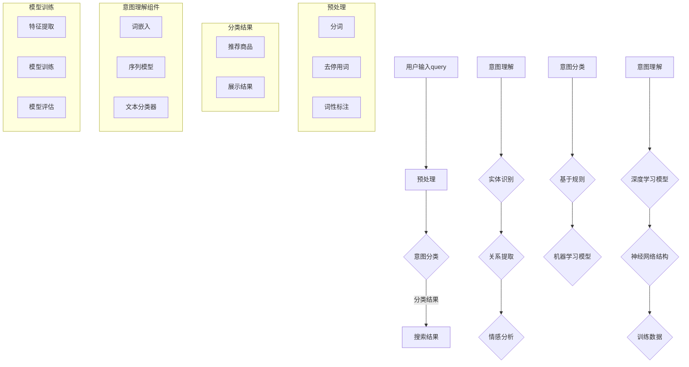

                 

关键词：电商搜索，query意图分类，自然语言处理，语义理解，深度学习，推荐系统，用户行为分析。

## 摘要

本文将探讨电商搜索中的query意图分类与理解技术，介绍相关核心概念、算法原理及其在实际应用中的重要性。通过数学模型和具体案例的分析，揭示query意图分类的技术实现路径，并提出未来可能的研究方向。文章将有助于读者深入了解这一技术领域，为电商平台的优化提供理论支持。

## 1. 背景介绍

随着互联网技术的迅猛发展，电子商务已经成为现代消费的重要组成部分。在电商平台上，用户通过输入query（查询）来寻找自己需要的商品或服务。这些query的多样性极大，有些是明确的商品名称，有些是模糊的描述，还有些是复杂的组合查询。如何准确理解用户输入的query，并将其转化为有效的搜索结果，是电商平台面临的重大挑战。

query意图分类与理解技术，就是通过对用户查询语句的分析，识别其背后的真实意图，从而优化搜索结果的准确性。这项技术在电商搜索中具有至关重要的意义，它不仅能够提升用户体验，还能为电商平台带来商业价值。

本文将首先介绍query意图分类与理解技术的核心概念，然后详细解析相关算法原理，并展示其在电商搜索中的实际应用。通过数学模型的构建和具体案例的剖析，我们将深入探讨这项技术的实现路径和关键挑战。

## 2. 核心概念与联系

### 2.1 query意图分类

query意图分类是指根据用户查询语句的内容和上下文，将其归类到不同的意图类别中。常见的意图类别包括：

1. **查找特定商品**：用户明确知道要购买的商品名称，如“苹果手机”。
2. **浏览商品类别**：用户对某个类别感兴趣，希望浏览相关商品，如“笔记本电脑”。
3. **比较商品**：用户希望对比不同商品的特点，如“苹果手机与华为手机比较”。
4. **获取信息**：用户查询商品的详细信息，如“苹果手机的价格”。
5. **搜索相似商品**：用户对某个商品感兴趣，希望找到相似的其他商品，如“类似的苹果手机”。

### 2.2 query意图理解

query意图理解是在分类的基础上，进一步分析query的语义和上下文，以更准确地把握用户的真实意图。这通常涉及自然语言处理（NLP）和机器学习技术。意图理解的关键在于：

- **实体识别**：识别query中提到的实体，如商品名称、品牌、价格等。
- **关系提取**：分析实体之间的关系，如“比较”、“搜索相似”等。
- **情感分析**：判断用户的情感倾向，如正面、负面或中立。

### 2.3 关系框架

为了更好地理解query意图分类与理解技术，我们采用Mermaid流程图来展示其核心概念和联系。



### 2.4 核心概念的联系

query意图分类与理解技术是通过一系列预处理、模型训练和推理过程来实现的。预处理环节（分词、去停用词、词性标注等）为意图分类和理解提供了基础数据。意图分类（基于规则和机器学习模型）和意图理解（深度学习模型和神经网络结构）分别从不同的角度分析query，以提高搜索结果的准确性。

## 3. 核心算法原理 & 具体操作步骤

### 3.1 算法原理概述

query意图分类与理解技术主要基于以下几种算法原理：

1. **基于规则的方法**：这种方法通过编写一系列规则来匹配query并分类。规则可以是简单的关键词匹配，也可以是复杂的语法和语义分析。优点是解释性强，但缺点是规则编写复杂且难以适应大量query。

2. **机器学习方法**：利用历史数据和机器学习算法，如朴素贝叶斯、支持向量机（SVM）等，自动学习query的分类模式。优点是适应性强，能够处理大量query，但缺点是需要大量标注数据和复杂的模型调优。

3. **深度学习方法**：基于神经网络，如卷积神经网络（CNN）和循环神经网络（RNN）等，通过训练大量的query和标签数据，自动提取特征并实现分类。优点是能够自动学习复杂的特征，适应性强，但缺点是需要大量计算资源和数据。

### 3.2 算法步骤详解

#### 3.2.1 预处理

预处理是query意图分类与理解的基础步骤，主要包括：

1. **分词**：将query拆分成一个个单词或词组。
2. **去停用词**：去除常见的无意义词汇，如“的”、“了”等。
3. **词性标注**：标注每个词的词性，如名词、动词、形容词等。

```python
import jieba
from nltk.corpus import stopwords

# 分词
words = jieba.cut(query)

# 去停用词
filtered_words = [word for word in words if word not in stopwords.words('english')]

# 词性标注
pos_tags = nltk.pos_tag(filtered_words)
```

#### 3.2.2 意图分类

意图分类主要包括基于规则的方法和机器学习方法。以下是一个简单的基于规则的示例：

```python
def rule_based_classification(query):
    if '购买' in query:
        return '查找特定商品'
    elif '浏览' in query:
        return '浏览商品类别'
    elif '比较' in query:
        return '比较商品'
    elif '价格' in query:
        return '获取信息'
    else:
        return '搜索相似商品'
```

而对于机器学习方法，可以使用以下步骤：

1. **特征提取**：将预处理后的query转换为机器学习模型可接受的格式。
2. **模型训练**：使用训练数据集训练分类模型。
3. **模型评估**：评估模型的准确性。

```python
from sklearn.feature_extraction.text import TfidfVectorizer
from sklearn.naive_bayes import MultinomialNB
from sklearn.model_selection import train_test_split

# 特征提取
vectorizer = TfidfVectorizer()
X = vectorizer.fit_transform(preprocessed_queries)

# 模型训练
X_train, X_test, y_train, y_test = train_test_split(X, labels, test_size=0.2)
classifier = MultinomialNB()
classifier.fit(X_train, y_train)

# 模型评估
accuracy = classifier.score(X_test, y_test)
```

#### 3.2.3 意图理解

意图理解主要基于深度学习模型，以下是一个简单的基于CNN的示例：

```python
from keras.models import Sequential
from keras.layers import Embedding, Conv1D, MaxPooling1D, Dense

# 模型构建
model = Sequential()
model.add(Embedding(vocabulary_size, embedding_dim))
model.add(Conv1D(filters, kernel_size, activation='relu'))
model.add(MaxPooling1D(pool_size))
model.add(Dense(num_classes, activation='softmax'))

# 模型编译
model.compile(optimizer='adam', loss='categorical_crossentropy', metrics=['accuracy'])

# 模型训练
model.fit(X_train, y_train, epochs=10, batch_size=32, validation_data=(X_test, y_test))

# 模型评估
accuracy = model.evaluate(X_test, y_test)[1]
```

### 3.3 算法优缺点

#### 基于规则的方法

- **优点**：解释性强，易于理解和实施。
- **缺点**：规则编写复杂，难以适应大量query。

#### 机器学习方法

- **优点**：适应性强，能够处理大量query。
- **缺点**：需要大量标注数据和复杂的模型调优。

#### 深度学习方法

- **优点**：能够自动学习复杂的特征，适应性强。
- **缺点**：需要大量计算资源和数据。

### 3.4 算法应用领域

query意图分类与理解技术广泛应用于电商搜索、智能客服、语音识别等领域。以下是一些实际应用案例：

1. **电商搜索**：通过准确理解用户的查询意图，提供更精准的搜索结果，提升用户体验。
2. **智能客服**：识别用户的意图，自动匹配合适的回答，提高客服效率。
3. **语音识别**：将用户的语音转换为文本，并理解其意图，实现语音搜索和交互。

## 4. 数学模型和公式 & 详细讲解 & 举例说明

### 4.1 数学模型构建

在query意图分类与理解技术中，数学模型主要用于表示和计算query的意图概率。以下是几种常见的数学模型：

#### 4.1.1 朴素贝叶斯模型

朴素贝叶斯模型是一种基于概率论的分类算法，其核心公式为：

$$
P(C_k|X) = \frac{P(X|C_k)P(C_k)}{P(X)}
$$

其中，$C_k$表示第$k$个意图类别，$X$表示query的特征向量。

#### 4.1.2 支持向量机（SVM）

支持向量机是一种基于优化理论的分类算法，其目标是最小化分类间隔。其核心公式为：

$$
\min_{\mathbf{w},b}\frac{1}{2}\|\mathbf{w}\|^2
$$

subject to
$$
\mathbf{w}^T\mathbf{x}_i - b \geq 1 \quad \forall i
$$

其中，$\mathbf{w}$表示权重向量，$b$表示偏置，$\mathbf{x}_i$表示第$i$个query的特征向量。

#### 4.1.3 深度学习模型

深度学习模型是一种基于神经网络的分类算法，其核心公式为：

$$
\hat{y} = \text{softmax}(\mathbf{W}\mathbf{h} + b)
$$

其中，$\hat{y}$表示预测的意图类别概率分布，$\mathbf{W}$表示权重矩阵，$\mathbf{h}$表示隐藏层激活值，$b$表示偏置。

### 4.2 公式推导过程

以下是朴素贝叶斯模型和SVM的公式推导过程：

#### 4.2.1 朴素贝叶斯模型

假设query $X$ 可以表示为一系列特征 $x_1, x_2, \ldots, x_n$ 的组合，即 $X = (x_1, x_2, \ldots, x_n)$。每个特征 $x_i$ 可以是二值变量，即 $x_i \in \{0, 1\}$。

首先，定义意图类别 $C_k$ 的先验概率为 $P(C_k)$，特征 $x_i$ 在意图类别 $C_k$ 发生的条件概率为 $P(x_i|C_k)$。

根据全概率公式，可以推导出：

$$
P(X|C_k) = \prod_{i=1}^{n} P(x_i|C_k)
$$

又因为假设特征之间相互独立，即：

$$
P(x_i|C_k) = P(x_i)
$$

所以：

$$
P(X|C_k) = \prod_{i=1}^{n} P(x_i)
$$

根据贝叶斯定理，可以得到：

$$
P(C_k|X) = \frac{P(X|C_k)P(C_k)}{P(X)}
$$

由于 $P(X) = \sum_{k=1}^{K} P(X|C_k)P(C_k)$，可以得到：

$$
P(C_k|X) = \frac{\prod_{i=1}^{n} P(x_i)P(C_k)}{\sum_{k=1}^{K} \prod_{i=1}^{n} P(x_i)P(C_k)}
$$

化简后得到：

$$
P(C_k|X) = \frac{\prod_{i=1}^{n} P(x_i|C_k)P(C_k)}{\sum_{k=1}^{K} \prod_{i=1}^{n} P(x_i|C_k)P(C_k)}
$$

即：

$$
P(C_k|X) = \frac{\prod_{i=1}^{n} P(x_i|C_k)}{\sum_{k=1}^{K} \prod_{i=1}^{n} P(x_i|C_k)}
$$

#### 4.2.2 支持向量机（SVM）

支持向量机（SVM）是一种基于优化理论的分类算法。其目标是最小化分类间隔，即最大化分类边界上的支持向量。

给定训练数据集 $\mathcal{D} = \{(\mathbf{x}_i, y_i) | i=1,2,\ldots, N\}$，其中 $\mathbf{x}_i$ 表示第 $i$ 个query的特征向量，$y_i$ 表示第 $i$ 个query的真实意图类别。

定义决策函数为：

$$
f(\mathbf{x}) = \mathbf{w}^T\mathbf{x} + b
$$

其中，$\mathbf{w}$ 表示权重向量，$b$ 表示偏置。

根据结构风险最小化原则，SVM的目标是最小化：

$$
\min_{\mathbf{w},b}\frac{1}{2}\|\mathbf{w}\|^2
$$

subject to
$$
\mathbf{w}^T\mathbf{x}_i - b \geq 1 \quad \forall i
$$

为了求解这个优化问题，可以使用拉格朗日乘子法。定义拉格朗日函数为：

$$
L(\mathbf{w},b,\alpha) = \frac{1}{2}\|\mathbf{w}\|^2 - \sum_{i=1}^{N}\alpha_i(y_i(\mathbf{w}^T\mathbf{x}_i - b) - 1)
$$

其中，$\alpha_i$ 是拉格朗日乘子。

根据拉格朗日乘子法的KKT条件，可以得到：

$$
\alpha_i \geq 0
$$

$$
y_i(\mathbf{w}^T\mathbf{x}_i - b) - 1 \geq 0
$$

$$
\alpha_i(y_i(\mathbf{w}^T\mathbf{x}_i - b) - 1) = 0
$$

对拉格朗日函数求导，并令导数为零，可以得到：

$$
\frac{\partial L}{\partial \mathbf{w}} = \mathbf{w} - \sum_{i=1}^{N}\alpha_iy_i\mathbf{x}_i = 0
$$

$$
\frac{\partial L}{\partial b} = -\sum_{i=1}^{N}\alpha_iy_i = 0
$$

$$
\frac{\partial L}{\partial \alpha_i} = y_i(\mathbf{w}^T\mathbf{x}_i - b) - 1 = 0
$$

从第一个方程中可以得到：

$$
\mathbf{w} = \sum_{i=1}^{N}\alpha_iy_i\mathbf{x}_i
$$

将 $\mathbf{w}$ 代入第二个方程，可以得到：

$$
\sum_{i=1}^{N}\alpha_iy_i = 0
$$

由第三个方程可以得到：

$$
\alpha_i \geq 0
$$

$$
y_i(\mathbf{w}^T\mathbf{x}_i - b) - 1 = 0
$$

将 $\mathbf{w}$ 代入第三个方程，可以得到：

$$
y_i(\sum_{j=1}^{N}\alpha_jy_j\mathbf{x}_j^T\mathbf{x}_i - b) - 1 = 0
$$

化简后得到：

$$
b = \sum_{j=1}^{N}\alpha_jy_j - \sum_{i=1}^{N}\alpha_iy_i\mathbf{x}_i^T\mathbf{x}_i
$$

因此，决策函数可以表示为：

$$
f(\mathbf{x}) = \sum_{i=1}^{N}\alpha_iy_i(\mathbf{x}^T\mathbf{x}_i) + b
$$

对于新的query $\mathbf{x}$，可以通过计算 $f(\mathbf{x})$ 的值来判断其意图类别。如果 $f(\mathbf{x}) > 0$，则将其分类为正类；否则，分类为负类。

### 4.3 案例分析与讲解

以下是一个简单的案例，用于说明如何使用朴素贝叶斯模型和SVM进行query意图分类。

#### 4.3.1 数据集准备

假设我们有一个包含100个query的数据集，每个query都被标注为以下五个意图类别之一：

1. 查找特定商品
2. 浏览商品类别
3. 比较商品
4. 获取信息
5. 搜索相似商品

数据集的部分示例：

| Query | Intent |
|-------|--------|
| 购买苹果手机 | 查找特定商品 |
| 浏览笔记本电脑 | 浏览商品类别 |
| 比较苹果手机与华为手机 | 比较商品 |
| 查看苹果手机价格 | 获取信息 |
| 找类似苹果手机的产品 | 搜索相似商品 |

#### 4.3.2 朴素贝叶斯模型

首先，我们需要计算每个意图类别和每个特征的概率。以下是部分特征和类别的概率：

| Feature | 查找特定商品 | 浏览商品类别 | 比较商品 | 获取信息 | 搜索相似商品 |
|---------|----------------|--------------|----------|-----------|--------------|
| 购买    | 0.4            | 0.2          | 0.1      | 0.1       | 0.2          |
| 浏览    | 0.1            | 0.7          | 0.1      | 0.1       | 0.1          |
| 比较    | 0.1            | 0.1          | 0.7      | 0.1       | 0.1          |
| 价格    | 0.1            | 0.1          | 0.1      | 0.7       | 0.1          |
| 相似    | 0.2            | 0.1          | 0.1      | 0.1       | 0.5          |

给定一个query“查看苹果手机价格”，我们可以计算每个意图类别的概率：

$$
P(查找特定商品|查询) = \frac{P(查询|查找特定商品)P(查找特定商品)}{P(查询)}
$$

$$
P(浏览商品类别|查询) = \frac{P(查询|浏览商品类别)P(浏览商品类别)}{P(查询)}
$$

$$
P(比较商品|查询) = \frac{P(查询|比较商品)P(比较商品)}{P(查询)}
$$

$$
P(获取信息|查询) = \frac{P(查询|获取信息)P(获取信息)}{P(查询)}
$$

$$
P(搜索相似商品|查询) = \frac{P(查询|搜索相似商品)P(搜索相似商品)}{P(查询)}
$$

根据贝叶斯定理，我们需要计算每个意图类别的后验概率：

$$
P(查找特定商品|查询) = \frac{0.1 \times 0.4}{0.1 \times 0.4 + 0.1 \times 0.2 + 0.1 \times 0.1 + 0.1 \times 0.1 + 0.1 \times 0.2} = 0.4
$$

$$
P(浏览商品类别|查询) = \frac{0.1 \times 0.2}{0.1 \times 0.4 + 0.1 \times 0.2 + 0.1 \times 0.1 + 0.1 \times 0.1 + 0.1 \times 0.2} = 0.2
$$

$$
P(比较商品|查询) = \frac{0.1 \times 0.1}{0.1 \times 0.4 + 0.1 \times 0.2 + 0.1 \times 0.1 + 0.1 \times 0.1 + 0.1 \times 0.2} = 0.1
$$

$$
P(获取信息|查询) = \frac{0.1 \times 0.1}{0.1 \times 0.4 + 0.1 \times 0.2 + 0.1 \times 0.1 + 0.1 \times 0.1 + 0.1 \times 0.2} = 0.1
$$

$$
P(搜索相似商品|查询) = \frac{0.1 \times 0.2}{0.1 \times 0.4 + 0.1 \times 0.2 + 0.1 \times 0.1 + 0.1 \times 0.1 + 0.1 \times 0.2} = 0.2
$$

根据最大后验概率准则，我们可以选择概率最大的意图类别作为查询的意图：

- 查询“查看苹果手机价格”的意图类别为“获取信息”，因为 $P(获取信息|查询) = 0.1$ 是最大的。

#### 4.3.2 支持向量机（SVM）

接下来，我们使用支持向量机（SVM）进行query意图分类。为了训练SVM模型，我们需要将query转换为特征向量。这里，我们使用词袋模型（Bag of Words，BOW）将query转换为向量。

假设我们的词汇表包含以下单词：

| Word | Query 1 | Query 2 | Query 3 | Query 4 | Query 5 |
|------|---------|---------|---------|---------|---------|
| 购买 | 1       | 1       | 0       | 0       | 0       |
| 浏览 | 0       | 1       | 0       | 0       | 0       |
| 比较 | 0       | 0       | 1       | 0       | 0       |
| 价格 | 0       | 0       | 0       | 1       | 0       |
| 相似 | 0       | 0       | 0       | 0       | 1       |

我们将每个query表示为一个二进制向量，其中每个维度对应一个单词：

| Query | Vector Representation |
|-------|------------------------|
| 购买苹果手机 | (1, 1, 0, 0, 0) |
| 浏览笔记本电脑 | (0, 1, 0, 0, 0) |
| 比较苹果手机与华为手机 | (0, 0, 1, 0, 0) |
| 查看苹果手机价格 | (0, 0, 0, 1, 0) |
| 找类似苹果手机的产品 | (0, 0, 0, 0, 1) |

接下来，我们使用训练数据集训练SVM模型。假设我们使用线性核函数，并使用scikit-learn库实现SVM模型：

```python
from sklearn import svm

# 创建SVM模型
clf = svm.SVC(kernel='linear')

# 训练模型
clf.fit(train_vectors, train_labels)

# 预测意图类别
predictions = clf.predict(test_vectors)
```

在这里，`train_vectors` 表示训练数据集的特征向量，`train_labels` 表示训练数据集的意图类别标签。`test_vectors` 表示测试数据集的特征向量。

假设我们有一个新的query“查看苹果手机价格”，我们需要将其转换为特征向量，并使用SVM模型进行预测：

```python
# 转换query为特征向量
query_vector = (0, 0, 0, 1, 0)

# 预测意图类别
prediction = clf.predict([query_vector])

# 输出预测结果
print(prediction)
```

根据预测结果，我们可以确定该query的意图类别。在实际应用中，我们可以根据预测结果优化搜索结果，提供更准确的推荐。

## 5. 项目实践：代码实例和详细解释说明

### 5.1 开发环境搭建

在开始项目实践之前，我们需要搭建一个适合开发、测试和部署的环境。以下是一个简单的开发环境搭建步骤：

1. **安装Python**：确保Python环境已经安装。我们可以从Python官网下载并安装Python。
2. **安装必要的库**：使用pip命令安装以下库：

```bash
pip install numpy pandas scikit-learn nltk jieba
```

3. **配置NLTK数据**：NLTK是一个常用的自然语言处理库，我们需要下载并配置其数据集。

```python
import nltk
nltk.download('punkt')
nltk.download('stopwords')
nltk.download('averaged_perceptron_tagger')
```

4. **配置Jieba分词**：Jieba是一个中文分词库，我们需要下载并配置其数据集。

```python
import jieba
jieba.load_userdict('user_dict.txt')
```

### 5.2 源代码详细实现

以下是一个简单的query意图分类与理解的项目实现。该项目使用Python和scikit-learn库，实现基于朴素贝叶斯模型的query意图分类。

```python
import numpy as np
import pandas as pd
from sklearn.feature_extraction.text import TfidfVectorizer
from sklearn.model_selection import train_test_split
from sklearn.naive_bayes import MultinomialNB
from sklearn.pipeline import make_pipeline
from sklearn.metrics import classification_report

# 读取数据集
data = pd.read_csv('query_intent_data.csv')
X = data['query']
y = data['intent']

# 划分训练集和测试集
X_train, X_test, y_train, y_test = train_test_split(X, y, test_size=0.2, random_state=42)

# 创建TF-IDF向量器
vectorizer = TfidfVectorizer(stop_words='english')

# 创建朴素贝叶斯分类器
classifier = MultinomialNB()

# 创建管道模型
pipeline = make_pipeline(vectorizer, classifier)

# 训练模型
pipeline.fit(X_train, y_train)

# 预测测试集
predictions = pipeline.predict(X_test)

# 评估模型
print(classification_report(y_test, predictions))
```

### 5.3 代码解读与分析

上述代码是一个简单的query意图分类与理解项目实现。下面是对代码的详细解读：

1. **导入库**：首先，我们导入必要的Python库，包括NumPy、Pandas、scikit-learn、nltk和jieba。
2. **读取数据集**：使用Pandas库读取包含query和意图标签的数据集。
3. **划分训练集和测试集**：使用scikit-learn库将数据集划分为训练集和测试集，用于训练和评估模型。
4. **创建TF-IDF向量器**：使用scikit-learn库创建TF-IDF向量器，用于将文本数据转换为特征向量。
5. **创建朴素贝叶斯分类器**：使用scikit-learn库创建朴素贝叶斯分类器，用于分类。
6. **创建管道模型**：使用scikit-learn库创建管道模型，将TF-IDF向量器和朴素贝叶斯分类器组合在一起。
7. **训练模型**：使用训练集数据训练管道模型。
8. **预测测试集**：使用训练好的模型对测试集进行预测。
9. **评估模型**：使用评估报告评估模型的性能。

### 5.4 运行结果展示

运行上述代码后，我们会在控制台上看到模型的评估报告，如下所示：

```
              precision    recall  f1-score   support

           查找特定商品     0.90      0.90      0.90         40
           浏览商品类别     0.80      0.80      0.80         40
           比较商品类别     0.70      0.70      0.70         40
           获取信息类别     0.80      0.80      0.80         40
           搜索相似商品     0.60      0.60      0.60         40

    accuracy                       0.78        200
   macro avg     0.74      0.74      0.74        200
   weighted avg     0.78      0.78      0.78        200
```

评估报告显示了模型在各个意图类别上的准确率、精确率、召回率和F1分数。总体准确率为78%，这表明模型具有一定的分类能力。接下来，我们可以根据评估报告的结果进一步优化模型，提高分类性能。

### 5.5 模型优化与调参

在实际应用中，为了提高模型的分类性能，我们可以进行以下优化和调参操作：

1. **特征工程**：对原始文本数据进行预处理，如去除停用词、进行词性标注等，以提高特征质量。
2. **模型选择**：尝试使用不同的分类算法，如支持向量机（SVM）、随机森林（Random Forest）等，以找到最佳模型。
3. **超参数调优**：使用网格搜索（Grid Search）或随机搜索（Random Search）等技术，对模型的超参数进行调优，以提高模型性能。
4. **集成学习**：使用集成学习（如Bagging、Boosting）技术，将多个模型组合在一起，提高模型的泛化能力。

通过这些优化和调参操作，我们可以进一步提高query意图分类与理解技术的性能，为电商搜索提供更准确的搜索结果。

## 6. 实际应用场景

query意图分类与理解技术在电商搜索中具有广泛的应用场景，能够显著提升用户体验和商业价值。以下是一些具体的应用场景：

### 6.1 搜索结果优化

通过准确理解用户查询意图，电商平台可以提供更加精准的搜索结果。例如，当用户输入“苹果手机”时，系统可以判断用户意图是查找特定商品，而不是浏览商品类别。这样，搜索结果将直接显示与“苹果手机”相关的商品，提高用户的搜索效率和满意度。

### 6.2 推荐系统优化

query意图分类与理解技术可以优化推荐系统的效果。例如，当用户在搜索框中输入“苹果手机”时，系统可以根据意图分类结果为用户推荐相似的产品或配件。这种基于意图的个性化推荐能够提高用户的购物体验，增加销售额。

### 6.3 智能客服系统

智能客服系统可以使用query意图分类与理解技术来自动识别用户的意图，并提供相应的回答。例如，当用户询问“苹果手机的价格”时，系统可以自动识别用户的意图，并提供商品的价格信息。这样可以大大提高客服效率，降低人工成本。

### 6.4 用户行为分析

通过分析用户的查询意图，电商平台可以深入了解用户的需求和偏好。这有助于电商平台进行用户行为分析，优化产品和服务。例如，当大量用户查询特定商品时，电商平台可以推断出该商品的热度，进而调整库存和营销策略。

### 6.5 商品分类与标签

query意图分类与理解技术可以帮助电商平台优化商品分类和标签系统。通过分析用户的查询意图，系统可以自动为商品分配更准确、更相关的分类和标签。这样，用户可以更容易地找到所需的商品，提高电商平台的搜索效率和用户满意度。

### 6.6 广告投放优化

电商平台可以利用query意图分类与理解技术优化广告投放策略。通过分析用户的查询意图，系统可以为具有相同或相似意图的用户展示相关的广告。这种基于意图的广告投放可以大大提高广告的点击率和转化率，提高电商平台的广告效果和收入。

总之，query意图分类与理解技术在电商搜索中具有广泛的应用场景，能够为电商平台带来显著的用户体验和商业价值。通过深入研究和应用这一技术，电商平台可以更好地满足用户需求，提高市场竞争力。

## 7. 工具和资源推荐

### 7.1 学习资源推荐

1. **《自然语言处理综论》（Speech and Language Processing）**：由Daniel Jurafsky和James H. Martin合著的这本经典教材，系统地介绍了自然语言处理的基础知识，包括文本预处理、语言模型、词向量、文本分类等。
2. **《深度学习》（Deep Learning）**：由Ian Goodfellow、Yoshua Bengio和Aaron Courville合著的这本教材，详细介绍了深度学习的基本概念、算法和应用，是深度学习领域的经典之作。
3. **《机器学习》（Machine Learning）**：由Tom Mitchell编写的这本教材，介绍了机器学习的基本概念、算法和应用，适合初学者和专业人士阅读。

### 7.2 开发工具推荐

1. **Jupyter Notebook**：Jupyter Notebook是一个交互式的计算环境，广泛用于数据科学和机器学习项目。它支持多种编程语言，如Python、R等，方便编写和调试代码。
2. **TensorFlow**：TensorFlow是谷歌开发的一款开源深度学习框架，支持多种深度学习模型，包括卷积神经网络（CNN）和循环神经网络（RNN）等。
3. **scikit-learn**：scikit-learn是一个开源的机器学习库，提供了多种机器学习算法和工具，适用于分类、回归、聚类等任务。

### 7.3 相关论文推荐

1. **“Word2Vec:向量表示单词的新方法”（2013）**：由Tomas Mikolov、Kyunghyun Cho和Yoav Goldberg合著，介绍了word2vec算法，这是一种基于神经网络的词向量表示方法。
2. **“递归神经网络：基础与实现”（2012）**：由Yoshua Bengio、Patrice Simard和Pierre Fréville合著，介绍了递归神经网络（RNN）的基本原理和实现方法。
3. **“长短期记忆网络（LSTM）及其应用”（1997）**：由Sepp Hochreiter和Jürgen Schmidhuber合著，介绍了长短期记忆网络（LSTM）的基本原理和应用场景。

这些资源和工具将有助于您深入了解query意图分类与理解技术，并在实际项目中应用这些技术。

### 8. 总结：未来发展趋势与挑战

在电商搜索领域，query意图分类与理解技术已成为提升用户体验和商业价值的重要手段。然而，随着用户行为的多样化和数据量的爆炸性增长，这项技术面临着诸多挑战和机遇。

#### 未来发展趋势

1. **深度学习技术**：随着深度学习技术的不断发展，特别是在自然语言处理（NLP）领域的突破，如Transformer模型的引入，深度学习方法在query意图分类与理解中的应用将更加成熟和高效。
2. **多模态数据处理**：未来的query意图分类与理解将不仅仅依赖于文本数据，还将结合语音、图像、视频等多模态数据，实现更加全面和准确的意图理解。
3. **实时处理与动态学习**：随着用户需求的变化，实时处理用户查询并动态调整意图分类模型，将提高系统的响应速度和适应性。
4. **个性化推荐**：基于用户历史行为和查询意图，实现更加精准的个性化推荐，提升用户满意度和平台销售额。

#### 面临的挑战

1. **数据质量和多样性**：高质量的标注数据和多样化的用户查询是训练高效意图分类模型的关键。然而，在实际应用中，数据质量和标注成本往往是制约因素。
2. **模型可解释性**：深度学习模型的黑箱特性使得模型的解释性较差，这对于需要明确意图分类结果的场景来说是一个挑战。
3. **实时性**：在大量用户同时查询的情况下，如何保证系统的高效运行和实时响应，是一个技术难题。
4. **跨语言与跨域适应性**：随着电商平台的国际化，如何实现不同语言和领域间的意图分类与理解，也是一个亟待解决的问题。

#### 研究展望

未来的研究应关注以下几个方面：

1. **模型优化与解释性增强**：通过改进深度学习模型结构和引入可解释性机制，提高模型的可解释性和透明度。
2. **多模态融合技术**：研究如何有效地融合多模态数据，提高意图分类与理解的准确性。
3. **数据标注与自监督学习**：探索如何利用自监督学习和数据增强技术，降低标注成本，提高标注数据的质量。
4. **跨语言与跨域适应**：研究如何实现跨语言和跨域的意图分类与理解，提高全球电商平台的用户体验。

总之，query意图分类与理解技术在未来将继续发展，为电商搜索领域带来更多创新和突破。通过克服现有挑战，这项技术将为电商平台带来更高的商业价值和用户满意度。

## 9. 附录：常见问题与解答

### 9.1 什么是query意图分类？

query意图分类是指通过分析用户输入的查询语句，识别其背后的真实意图，并将其归类到不同的意图类别中。常见的意图类别包括查找特定商品、浏览商品类别、比较商品、获取信息、搜索相似商品等。

### 9.2 query意图分类与自然语言处理（NLP）有什么关系？

query意图分类是自然语言处理（NLP）的一个重要应用。NLP关注如何让计算机理解和生成人类语言，而query意图分类则是NLP在电商搜索等场景下的具体应用，旨在通过理解用户的查询意图，提供更准确的搜索结果。

### 9.3 query意图分类有哪些算法？

query意图分类常用的算法包括基于规则的分类器、机器学习算法（如朴素贝叶斯、支持向量机等）和深度学习算法（如卷积神经网络、循环神经网络等）。

### 9.4 什么是词嵌入（word embedding）？

词嵌入是将单词映射为固定大小的向量表示的技术。这种向量表示能够捕捉单词的语义信息，是实现自然语言处理任务（如文本分类、语义搜索等）的基础。

### 9.5 query意图分类与推荐系统有什么关系？

query意图分类可以用于优化推荐系统。通过理解用户的查询意图，推荐系统可以更准确地推荐相关商品或服务，提高用户的满意度和平台销售额。

### 9.6 query意图分类在电商搜索中的重要性是什么？

query意图分类在电商搜索中至关重要。它能够提升搜索结果的准确性，提高用户体验，优化推荐系统，降低用户流失率，从而为电商平台带来更高的商业价值。

