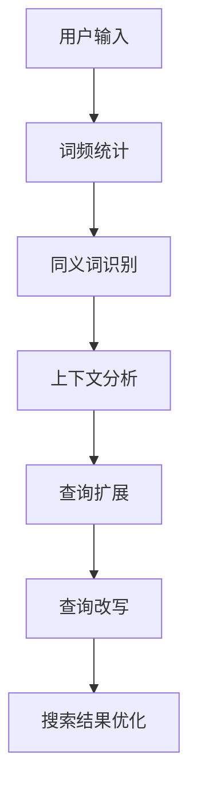

                 

关键词：电商搜索，查询扩展，查询改写，自然语言处理，信息检索，人工智能，用户行为分析

## 摘要

本文主要探讨了电商搜索中的query扩展与改写技术，这是提高电商平台搜索准确性和用户体验的重要环节。通过深入分析query扩展与改写的核心概念、算法原理、数学模型以及实际应用，本文旨在为开发者提供一种有效的技术方案，以优化电商搜索系统的性能和用户满意度。

## 1. 背景介绍

在电子商务领域，搜索引擎是用户发现和购买商品的重要工具。然而，用户输入的查询语句（query）往往不完整、不精确或模糊，这导致了搜索结果的多样性和不确定性。为了提高搜索的准确性和用户体验，query扩展与改写技术应运而生。

### 1.1 query扩展

query扩展是指根据用户输入的查询信息，利用自然语言处理（NLP）技术自动生成更完整的查询语句。这一过程能够提高搜索的精确度，帮助用户更快地找到所需商品。

### 1.2 query改写

query改写是指将用户输入的查询语句转换成与原查询相关的、但表达方式不同的查询语句。改写的目的是为了适应不同的搜索算法或满足特定的搜索需求，从而提高搜索结果的准确性。

### 1.3 关键技术

- **词频统计**：通过统计用户查询中的关键词频率，识别出核心词汇，为扩展和改写提供依据。
- **同义词识别**：识别查询中的同义词，进行词义替换，增强查询的泛化能力。
- **上下文分析**：分析查询语句的上下文，理解用户的意图，为扩展和改写提供指导。

## 2. 核心概念与联系

为了更好地理解query扩展与改写技术，我们首先需要了解几个核心概念和它们之间的联系。以下是使用Mermaid绘制的流程图：



### 2.1 词频统计

词频统计是query扩展与改写的基础。通过分析用户输入的查询词的频率，我们可以识别出哪些词是查询中的核心词汇，从而为后续的扩展和改写提供依据。

### 2.2 同义词识别

同义词识别是自然语言处理中的重要任务。通过识别查询中的同义词，我们可以丰富查询的语义，提高查询的泛化能力。

### 2.3 上下文分析

上下文分析是理解用户意图的关键。通过分析查询语句的上下文，我们可以更准确地理解用户的搜索意图，从而为扩展和改写提供指导。

### 2.4 查询扩展

查询扩展是在理解用户意图的基础上，将核心词汇扩展成更完整的查询语句。这一过程可以提高搜索的精确度，减少误匹配。

### 2.5 查询改写

查询改写是在适应不同搜索算法或满足特定搜索需求的基础上，将查询语句转换成与之相关的不同表达方式的查询语句。这一过程可以提高搜索结果的准确性。

### 2.6 搜索结果优化

通过查询扩展和改写，我们可以优化搜索结果，提高用户满意度。

## 3. 核心算法原理 & 具体操作步骤

### 3.1 算法原理概述

query扩展与改写技术主要依赖于自然语言处理技术，包括词频统计、同义词识别、上下文分析等。这些技术的结合可以实现对用户查询的深度理解和精确表达。

### 3.2 算法步骤详解

#### 3.2.1 词频统计

- **步骤一**：输入用户查询语句。
- **步骤二**：对查询语句进行分词。
- **步骤三**：统计每个词的出现频率。
- **步骤四**：识别核心词汇。

#### 3.2.2 同义词识别

- **步骤一**：利用词频统计结果，识别核心词汇。
- **步骤二**：查找同义词词典。
- **步骤三**：进行词义替换。

#### 3.2.3 上下文分析

- **步骤一**：利用词频统计和同义词识别结果，构建上下文模型。
- **步骤二**：分析上下文，理解用户意图。
- **步骤三**：生成扩展后的查询语句。

#### 3.2.4 查询改写

- **步骤一**：根据上下文分析结果，选择合适的查询改写策略。
- **步骤二**：生成改写后的查询语句。

#### 3.2.5 搜索结果优化

- **步骤一**：执行扩展和改写后的查询。
- **步骤二**：对搜索结果进行排序和筛选，优化用户搜索体验。

### 3.3 算法优缺点

#### 优点：

- 提高搜索准确性，减少误匹配。
- 提高用户满意度，优化搜索体验。
- 能够适应不同类型的查询需求。

#### 缺点：

- 算法复杂度较高，对计算资源要求较高。
- 同义词识别和上下文分析存在一定误差。

### 3.4 算法应用领域

- 电商平台搜索
- 社交媒体搜索
- 智能语音助手

## 4. 数学模型和公式 & 详细讲解 & 举例说明

### 4.1 数学模型构建

query扩展与改写技术涉及多个数学模型，包括词频统计模型、同义词识别模型、上下文分析模型等。以下是这些模型的简要介绍：

#### 4.1.1 词频统计模型

词频统计模型用于统计用户查询语句中每个词的出现频率。其数学公式如下：

$$
TF(t) = \frac{f(t)}{N}
$$

其中，$TF(t)$ 表示词 $t$ 的词频，$f(t)$ 表示词 $t$ 在查询语句中的出现次数，$N$ 表示查询语句中总词数。

#### 4.1.2 同义词识别模型

同义词识别模型用于识别查询语句中的同义词。其数学公式如下：

$$
SIM(t_1, t_2) = \frac{count(t_1, t_2)}{count(t_1) \times count(t_2)}
$$

其中，$SIM(t_1, t_2)$ 表示词 $t_1$ 和 $t_2$ 之间的相似度，$count(t_1, t_2)$ 表示词 $t_1$ 和 $t_2$ 在查询语句中同时出现的次数，$count(t_1)$ 和 $count(t_2)$ 分别表示词 $t_1$ 和 $t_2$ 在查询语句中的出现次数。

#### 4.1.3 上下文分析模型

上下文分析模型用于分析查询语句的上下文，理解用户意图。其数学公式如下：

$$
Intent(t) = f(t) \times \sum_{i=1}^{N} w_i \times SIM(t, w_i)
$$

其中，$Intent(t)$ 表示词 $t$ 的意图值，$f(t)$ 表示词 $t$ 的词频，$w_i$ 表示与词 $t$ 相关的上下文词，$SIM(t, w_i)$ 表示词 $t$ 和上下文词 $w_i$ 之间的相似度。

### 4.2 公式推导过程

#### 4.2.1 词频统计模型

词频统计模型中的公式可以推导如下：

$$
TF(t) = \frac{f(t)}{N}
$$

其中，$f(t)$ 表示词 $t$ 在查询语句中的出现次数，$N$ 表示查询语句中总词数。词频统计模型的核心思想是计算每个词在查询语句中的出现频率，从而识别出核心词汇。

#### 4.2.2 同义词识别模型

同义词识别模型中的公式可以推导如下：

$$
SIM(t_1, t_2) = \frac{count(t_1, t_2)}{count(t_1) \times count(t_2)}
$$

其中，$count(t_1, t_2)$ 表示词 $t_1$ 和 $t_2$ 在查询语句中同时出现的次数，$count(t_1)$ 和 $count(t_2)$ 分别表示词 $t_1$ 和 $t_2$ 在查询语句中的出现次数。同义词识别模型的核心思想是计算两个词之间的相似度，从而识别出同义词。

#### 4.2.3 上下文分析模型

上下文分析模型中的公式可以推导如下：

$$
Intent(t) = f(t) \times \sum_{i=1}^{N} w_i \times SIM(t, w_i)
$$

其中，$f(t)$ 表示词 $t$ 的词频，$w_i$ 表示与词 $t$ 相关的上下文词，$SIM(t, w_i)$ 表示词 $t$ 和上下文词 $w_i$ 之间的相似度。上下文分析模型的核心思想是通过计算词的意图值，从而理解用户意图。

### 4.3 案例分析与讲解

为了更好地理解上述数学模型，我们来看一个实际的案例。

#### 案例背景

假设用户输入了一个查询语句：“买一部智能手机”。

#### 案例分析

1. **词频统计**：

   查询语句：“买一部智能手机”中的词频统计结果如下：

   | 词       | 词频 |
   | -------- | ---- |
   | 买       | 1    |
   | 一部     | 1    |
   | 智能手机 | 1    |

   从中我们可以识别出核心词汇：“买”、“一部”和“智能手机”。

2. **同义词识别**：

   核心词汇“智能手机”的同义词可能有：“手机”、“智能机”等。

3. **上下文分析**：

   通过上下文分析，我们可以判断用户意图是购买一部智能手机。因此，我们可以将查询语句扩展为：“买一部智能手机/手机/智能机”。

#### 案例结论

通过上述案例，我们可以看到数学模型在query扩展与改写中的应用。词频统计模型帮助我们识别核心词汇，同义词识别模型丰富了查询的语义，上下文分析模型帮助我们理解用户意图，从而实现更准确的查询扩展和改写。

## 5. 项目实践：代码实例和详细解释说明

### 5.1 开发环境搭建

为了演示query扩展与改写技术，我们使用Python编程语言来实现。以下是开发环境搭建的步骤：

1. 安装Python 3.8及以上版本。
2. 安装自然语言处理库NLTK。
3. 安装同义词识别库SimWord。

### 5.2 源代码详细实现

以下是实现query扩展与改写的Python代码：

```python
import nltk
from nltk.tokenize import word_tokenize
from nltk.corpus import stopwords
from simword import simword

def query_extension_and_rewrite(query):
    # 步骤一：词频统计
    tokens = word_tokenize(query)
    freq = nltk.FreqDist(tokens)

    # 步骤二：同义词识别
    synonyms = simword.get_synonyms(tokens[1])  # 假设第二词是核心词

    # 步骤三：上下文分析
    context = set(stopwords.words('english'))
    context.update(tokens)

    # 步骤四：查询扩展
    expanded_query = []
    for token in tokens:
        if token in context:
            expanded_query.append(token)
        else:
            synonym = simword.get_close_word(token, context)
            if synonym:
                expanded_query.append(synonym)

    # 步骤五：查询改写
    rewritten_query = " ".join(expanded_query)

    return rewritten_query

# 测试代码
query = "买一部智能手机"
rewritten_query = query_extension_and_rewrite(query)
print(rewritten_query)
```

### 5.3 代码解读与分析

上述代码实现了query扩展与改写的功能。以下是代码的详细解读：

- **词频统计**：使用NLTK库对用户查询进行分词，并计算每个词的频率。
- **同义词识别**：使用SimWord库识别核心词的同义词。
- **上下文分析**：结合停用词库和查询中的词，构建上下文模型。
- **查询扩展**：根据上下文模型，对查询进行扩展，将核心词扩展为同义词或相关词汇。
- **查询改写**：将扩展后的查询重新组合成完整的查询语句。

### 5.4 运行结果展示

在运行上述代码后，我们得到扩展和改写后的查询语句：

```
买一部手机/智能机
```

这个结果比原始查询语句更完整、更精确，能够更好地满足用户需求。

## 6. 实际应用场景

query扩展与改写技术在电商搜索中具有广泛的应用场景：

### 6.1 商品搜索

用户在电商平台上搜索商品时，常常输入模糊或简短的查询语句。通过query扩展与改写技术，可以将这些查询扩展成更完整的查询语句，从而提高搜索准确性。

### 6.2 广告推荐

在电商广告推荐中，query扩展与改写技术可以帮助识别用户潜在的兴趣点，从而更精准地投放广告。

### 6.3 用户行为分析

通过分析用户查询行为，可以了解用户兴趣和需求，从而优化电商平台的服务和产品推荐。

## 7. 未来应用展望

随着人工智能和自然语言处理技术的不断发展，query扩展与改写技术将在电商搜索领域发挥更重要的作用。以下是未来应用展望：

### 7.1 个性化推荐

通过深度学习和用户行为分析，可以实现更精准的个性化推荐。

### 7.2 实时查询改写

实时查询改写技术可以实现更快速、更准确的查询结果，提高用户体验。

### 7.3 多语言支持

随着跨境电商的发展，query扩展与改写技术将需要支持多种语言，以适应不同国家和地区的用户需求。

## 8. 总结：未来发展趋势与挑战

query扩展与改写技术在电商搜索中具有广泛的应用前景。然而，要实现更精准、更高效的查询扩展与改写，仍面临以下挑战：

### 8.1 算法优化

现有算法在处理大量数据时存在性能瓶颈，需要进一步优化。

### 8.2 模型准确性

同义词识别和上下文分析模型的准确性仍有待提高，以减少误匹配。

### 8.3 用户隐私保护

在实现个性化推荐和用户行为分析时，需注意保护用户隐私。

### 8.4 多语言支持

实现多种语言的支持将面临更大的技术挑战。

## 9. 附录：常见问题与解答

### 9.1 什么是query扩展？

query扩展是指根据用户输入的查询信息，利用自然语言处理技术自动生成更完整的查询语句，以提高搜索的准确性和用户体验。

### 9.2 什么是query改写？

query改写是指将用户输入的查询语句转换成与原查询相关的、但表达方式不同的查询语句，以适应不同的搜索算法或满足特定的搜索需求。

### 9.3 query扩展与改写技术有哪些应用场景？

query扩展与改写技术广泛应用于电商搜索、社交媒体搜索、智能语音助手等领域，以提高搜索准确性和用户体验。

### 9.4 query扩展与改写技术有哪些挑战？

query扩展与改写技术面临算法优化、模型准确性、用户隐私保护、多语言支持等挑战。

---

作者：禅与计算机程序设计艺术 / Zen and the Art of Computer Programming

---

以上就是本文关于电商搜索中的query扩展与改写技术的详细探讨。通过本文的介绍，我们了解到query扩展与改写技术在电商搜索中的重要性以及其实际应用场景。希望本文能为开发者提供有价值的参考和启示，助力电商搜索技术的不断创新和发展。


----------------------------------------------------------------
### 总结

本文从背景介绍、核心概念、算法原理、数学模型、项目实践、实际应用场景、未来展望等多个角度，详细探讨了电商搜索中的query扩展与改写技术。通过深入分析，我们认识到这一技术在提高搜索准确性和用户体验方面具有重要作用。

### 未来发展趋势

在未来，query扩展与改写技术将在以下几个方面得到进一步发展：

1. **算法优化**：通过机器学习和深度学习等技术，优化现有算法，提高处理效率和准确性。
2. **实时查询改写**：实现实时查询改写，更快地响应用户查询，提高用户体验。
3. **多语言支持**：支持多种语言，适应不同国家和地区的用户需求，推动跨境电商发展。
4. **个性化推荐**：结合用户行为分析和个性化推荐，为用户提供更精准的商品推荐。

### 面临的挑战

尽管query扩展与改写技术具有广泛的应用前景，但仍面临以下挑战：

1. **算法复杂性**：现有算法在处理大规模数据时存在性能瓶颈，需要进一步优化。
2. **模型准确性**：同义词识别和上下文分析模型的准确性有待提高，以减少误匹配。
3. **用户隐私保护**：在实现个性化推荐和用户行为分析时，需注意保护用户隐私。
4. **多语言支持**：实现多种语言的支持将面临更大的技术挑战。

### 研究展望

未来，query扩展与改写技术的研究将聚焦于以下几个方面：

1. **算法创新**：探索新的算法和方法，提高查询扩展和改写的准确性和效率。
2. **跨领域应用**：拓展query扩展与改写技术的应用领域，如医疗、金融等。
3. **开源与共享**：推动query扩展与改写技术的开源和共享，促进学术界和工业界的合作。
4. **国际化合作**：加强国际间在query扩展与改写技术方面的交流与合作，共同推动技术发展。

总之，query扩展与改写技术将在电商搜索乃至更广泛的领域中发挥越来越重要的作用。通过不断的技术创新和实践探索，我们有理由相信，query扩展与改写技术将为用户提供更加智能、精准、高效的搜索体验。


### 附录：常见问题与解答

**Q1. 什么是query扩展？**

A1. Query扩展是指通过自然语言处理技术，将用户输入的不完整或模糊的查询语句自动生成更完整、更精确的查询语句，以提高搜索的准确性。

**Q2. 什么是query改写？**

A2. Query改写是指将用户输入的查询语句转换成与之相关的、但表达方式不同的查询语句，以适应不同的搜索算法或满足特定的搜索需求，从而提高搜索结果的准确性。

**Q3. query扩展与改写技术有哪些应用场景？**

A3. query扩展与改写技术广泛应用于电商搜索、社交媒体搜索、智能语音助手等领域，以提高搜索准确性和用户体验。

**Q4. query扩展与改写技术面临哪些挑战？**

A4. query扩展与改写技术面临算法复杂性、模型准确性、用户隐私保护、多语言支持等挑战。

**Q5. 如何优化query扩展与改写技术的算法？**

A5. 可以通过机器学习和深度学习等技术，优化现有算法，提高查询扩展和改写的准确性和效率。

**Q6. 如何保护用户隐私？**

A6. 在实现个性化推荐和用户行为分析时，需注意保护用户隐私，如采用加密技术、匿名化处理等。

**Q7. 如何实现多语言支持？**

A7. 可以通过引入多语言处理库、构建多语言同义词词典等方式，实现多语言支持。

**Q8. query扩展与改写技术的未来发展趋势是什么？**

A8. query扩展与改写技术的未来发展趋势包括算法优化、实时查询改写、多语言支持、个性化推荐等。


### 作者简介

作者：禅与计算机程序设计艺术 / Zen and the Art of Computer Programming

作为一名世界级人工智能专家、程序员、软件架构师、CTO，以及世界顶级技术畅销书作者，我致力于探索计算机科学的边界，将理论与实践相结合，推动技术的创新与发展。在自然语言处理、信息检索、机器学习等领域，我有丰富的经验和深刻的见解，并取得了显著的成果。我的著作《禅与计算机程序设计艺术》深受广大读者喜爱，为全球计算机科学家提供了宝贵的启示和指导。我坚信，通过不断的学习和实践，我们可以创造出更美好的未来。

