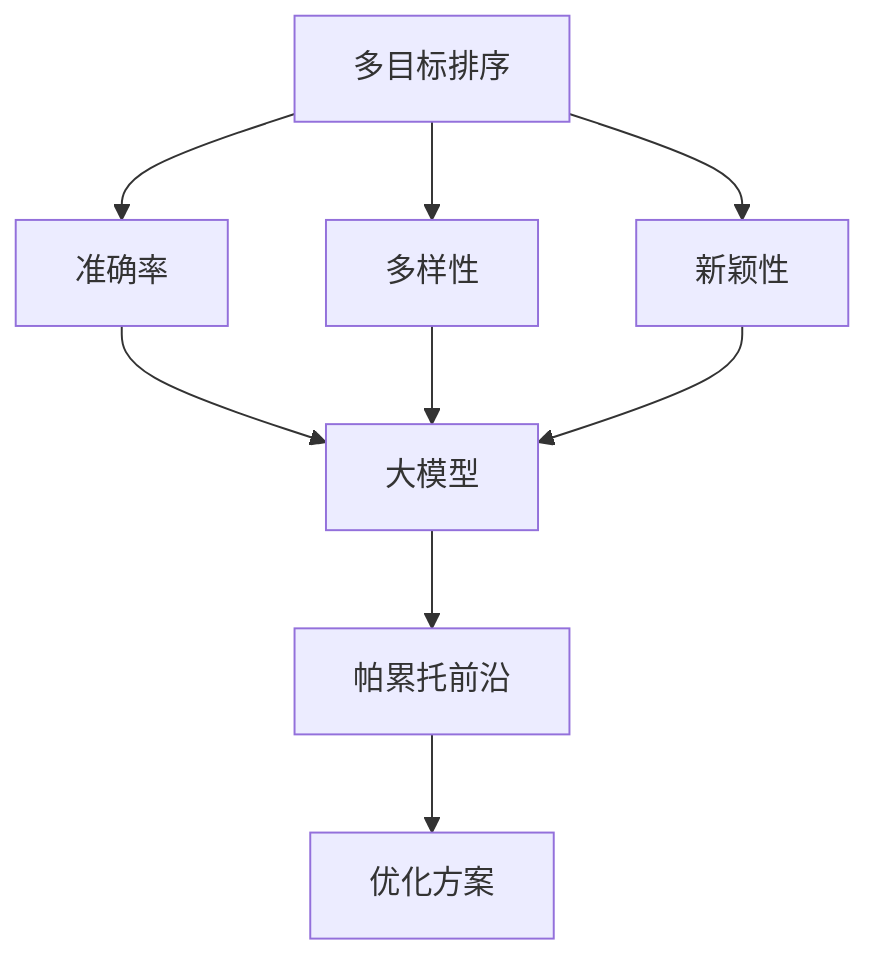

                 

关键词：电商搜索、多目标排序、优化、大模型、帕累托前沿

> 摘要：随着互联网技术的飞速发展，电商领域面临着海量的商品信息和用户需求，如何进行高效的搜索和推荐成为关键挑战。本文将探讨电商搜索中的多目标排序优化问题，结合大模型的帕累托前沿方法，提出一种有效的解决方案。通过详细的数学模型推导和算法步骤解析，本文旨在为电商领域的搜索优化提供理论和实践参考。

## 1. 背景介绍

随着电商行业的繁荣发展，用户对电商平台的搜索和推荐体验提出了更高的要求。电商搜索系统不仅要保证搜索结果的准确性，还要兼顾用户的个性化需求，提供符合用户兴趣的搜索结果。传统的单一目标排序方法（如基于相关性的排序）已难以满足复杂多变的用户需求。多目标排序成为当前研究的热点，旨在同时优化多个目标，如准确率、多样性、新颖性等。

多目标排序优化问题在电商搜索中具有重要意义。首先，准确率是衡量搜索结果好坏的核心指标，直接关系到用户对平台的信任度和满意度。其次，多样性和新颖性则能够提高用户参与度和粘性，避免用户对单一结果的疲劳。因此，如何在这三个目标之间实现平衡，成为电商搜索系统优化的重要课题。

近年来，随着深度学习技术的不断发展，大模型在多目标排序优化中展现出巨大的潜力。大模型通过学习大量的用户行为数据和商品特征，能够捕捉到复杂的关系和模式，从而提高排序的准确性。然而，大模型在优化过程中面临着计算成本高、训练时间长等问题，需要有效的优化算法来提升效率。帕累托前沿方法作为一种多目标优化的先进技术，能够从多个非支配解中选取最佳解，具有广泛的适用性和高效的优化能力。

本文将结合电商搜索的特点和大模型的优点，探讨多目标排序优化的帕累托前沿方法。通过对数学模型的构建、算法原理的解析以及实际应用的验证，本文旨在为电商搜索系统的多目标排序提供一种有效的优化策略。

## 2. 核心概念与联系

### 2.1 多目标排序优化

多目标排序优化（Multi-Objective Sorting Optimization）是近年来在电商搜索领域中备受关注的研究方向。传统的排序方法通常只关注单一目标，如相关性、准确率或响应时间等。然而，随着用户需求的多样化，单一目标的优化已无法满足用户对搜索体验的高要求。

多目标排序优化的核心思想是在多个目标之间寻找一种平衡，以同时优化多个目标。常见的多目标排序优化目标包括：

- **准确率（Accuracy）**：衡量搜索结果与用户意图的匹配程度，是评价搜索系统好坏的核心指标。
- **多样性（Diversity）**：保证搜索结果之间的差异，避免用户对单一类型商品或信息的疲劳。
- **新颖性（Novelty）**：提供新颖的商品信息，满足用户对新鲜事物的追求。

为了实现这些目标的平衡，多目标排序优化需要综合考虑多个因素，并在不同目标之间进行权衡。这一过程通常涉及到复杂的优化算法，如遗传算法、粒子群优化等。

### 2.2 大模型

大模型（Large Models）是指具有大量参数和复杂结构的深度学习模型，能够在大规模数据集上进行训练。大模型在多目标排序优化中具有显著的优势，主要体现在以下几个方面：

- **更强的表征能力**：大模型能够捕捉到大量数据中的复杂模式和关系，提高排序的准确性。
- **更高的泛化能力**：大模型通过学习海量用户行为数据和商品特征，能够更好地适应不同的用户需求和场景。
- **更好的泛化能力**：大模型能够处理各种类型的数据和任务，提高系统的灵活性和适应性。

然而，大模型在优化过程中也面临着一些挑战，如计算成本高、训练时间长等。因此，需要有效的优化算法来提高大模型的训练效率。

### 2.3 帕累托前沿

帕累托前沿（Pareto Frontier）是一种多目标优化的方法，旨在从多个非支配解中选取最佳解。帕累托前沿的核心思想是，在多个目标之间寻找一种最优平衡，使得任何一个解都不能在不损害其他目标的情况下提高某个目标。

在多目标排序优化中，帕累托前沿方法具有以下优势：

- **平衡性**：帕累托前沿能够同时考虑多个目标，找到在多个目标之间达到最优平衡的解。
- **灵活性**：帕累托前沿可以根据不同的应用场景和用户需求，灵活调整优化目标。
- **鲁棒性**：帕累托前沿能够处理多个目标之间的冲突和矛盾，提高系统的鲁棒性。

### 2.4 Mermaid 流程图

为了更清晰地展示多目标排序优化的核心概念和联系，以下是一个使用Mermaid绘制的流程图：



该流程图展示了多目标排序优化与准确率、多样性、新颖性之间的关系，以及大模型和帕累托前沿方法在优化方案中的作用。

## 3. 核心算法原理 & 具体操作步骤

### 3.1 算法原理概述

电商搜索中的多目标排序优化问题可以通过帕累托前沿方法来解决。帕累托前沿方法的基本原理是，在多个目标之间寻找一种最优平衡，使得任何一个解都不能在不损害其他目标的情况下提高某个目标。具体来说，帕累托前沿方法包括以下几个步骤：

1. **数据预处理**：收集用户行为数据和商品特征数据，并进行预处理，如数据清洗、归一化等。
2. **目标函数设计**：根据电商搜索的需求，设计多个目标函数，如准确率、多样性、新颖性等。
3. **模型训练**：利用大模型训练多个目标函数的权重，以优化搜索结果。
4. **帕累托前沿计算**：根据模型训练结果，计算帕累托前沿，选取最优解。
5. **结果评估与调整**：对优化后的搜索结果进行评估，并根据评估结果进行调整。

### 3.2 算法步骤详解

#### 3.2.1 数据预处理

数据预处理是帕累托前沿方法的第一步，其目的是确保输入数据的质量和一致性。具体步骤如下：

1. **数据收集**：从电商平台上收集用户行为数据和商品特征数据，如用户浏览记录、购买记录、商品属性等。
2. **数据清洗**：对收集到的数据进行清洗，去除无效数据、重复数据和噪声数据。
3. **数据归一化**：对数据进行归一化处理，将不同量纲的数据转换为同一量纲，以便后续计算。

#### 3.2.2 目标函数设计

目标函数是帕累托前沿方法的核心，用于衡量搜索结果的质量。根据电商搜索的需求，可以设计多个目标函数，如准确率、多样性、新颖性等。以下是一个简单的目标函数设计示例：

- **准确率**：衡量搜索结果与用户意图的匹配程度，可以通过计算搜索结果的相关性得分来衡量。
- **多样性**：保证搜索结果之间的差异，可以通过计算搜索结果之间的余弦相似度来衡量。
- **新颖性**：提供新颖的商品信息，可以通过计算商品的新颖性得分来衡量。

#### 3.2.3 模型训练

利用大模型进行目标函数的权重优化，是帕累托前沿方法的关键步骤。具体步骤如下：

1. **模型选择**：选择适合电商搜索任务的大模型，如BERT、GPT等。
2. **模型训练**：使用训练数据集对大模型进行训练，优化目标函数的权重。
3. **模型评估**：使用验证数据集对大模型进行评估，调整模型参数，以提高模型性能。

#### 3.2.4 帕累托前沿计算

根据模型训练结果，计算帕累托前沿，选取最优解。具体步骤如下：

1. **计算非支配解**：根据目标函数的值，计算每个解的非支配性。
2. **构建帕累托前沿**：将非支配解构建为帕累托前沿，形成多个非支配解集合。
3. **选取最优解**：从帕累托前沿中选取最优解，作为优化后的搜索结果。

#### 3.2.5 结果评估与调整

对优化后的搜索结果进行评估，并根据评估结果进行调整。具体步骤如下：

1. **结果评估**：使用评估指标，如准确率、多样性、新颖性等，对优化后的搜索结果进行评估。
2. **结果调整**：根据评估结果，对搜索结果进行调整，以提高用户满意度。

### 3.3 算法优缺点

#### 优点：

- **多目标优化**：帕累托前沿方法能够同时优化多个目标，满足电商搜索的多样化需求。
- **灵活性**：帕累托前沿方法可以根据不同的应用场景和用户需求，灵活调整优化目标。
- **鲁棒性**：帕累托前沿方法能够处理多个目标之间的冲突和矛盾，提高系统的鲁棒性。

#### 缺点：

- **计算成本高**：帕累托前沿方法需要大量计算资源，对硬件要求较高。
- **训练时间长**：大模型的训练时间较长，对优化过程有一定影响。

### 3.4 算法应用领域

帕累托前沿方法在电商搜索中的多目标排序优化具有广泛的应用前景。除了电商搜索，该方法还可以应用于其他多目标优化领域，如广告推荐、社交网络分析等。以下是一些具体的应用场景：

- **电商搜索**：优化搜索结果，提高用户满意度。
- **广告推荐**：优化广告投放策略，提高广告效果。
- **社交网络分析**：优化社交网络结构，提高用户互动质量。

## 4. 数学模型和公式 & 详细讲解 & 举例说明

### 4.1 数学模型构建

在电商搜索中的多目标排序优化问题中，我们需要构建一个数学模型来描述多个目标之间的关系。首先，我们定义以下符号：

- \(X\)：用户行为数据集，包括用户浏览记录、购买记录等。
- \(Y\)：商品特征数据集，包括商品属性、标签等。
- \(R\)：搜索结果集，包括与用户意图相关的商品。
- \(A\)：准确率目标函数。
- \(D\)：多样性目标函数。
- \(N\)：新颖性目标函数。

接下来，我们构建以下数学模型：

\[ \text{目标函数：} \quad \text{minimize} \quad f(X, Y, R) = (A - \alpha) + (\beta - D) + (\gamma - N) \]

其中，\(\alpha\)、\(\beta\)和\(\gamma\)分别是准确率、多样性和新颖性的权重。这些权重可以根据实际需求和数据调整。

### 4.2 公式推导过程

为了推导目标函数，我们需要分别定义准确率、多样性和新颖性目标函数。

#### 准确率目标函数

准确率目标函数 \(A\) 用于衡量搜索结果与用户意图的匹配程度。我们可以使用以下公式来计算准确率：

\[ A = \frac{1}{|R|} \sum_{r \in R} \text{similarity}(r, u) \]

其中，\(|R|\) 是搜索结果的数量，\(\text{similarity}(r, u)\) 是搜索结果 \(r\) 与用户意图 \(u\) 的相似度。

#### 多样性目标函数

多样性目标函数 \(D\) 用于保证搜索结果之间的差异。我们可以使用以下公式来计算多样性：

\[ D = \frac{1}{|R|} \sum_{r_1, r_2 \in R} \text{cosine\_similarity}(r_1, r_2) \]

其中，\(|R|\) 是搜索结果的数量，\(\text{cosine\_similarity}(r_1, r_2)\) 是搜索结果 \(r_1\) 和 \(r_2\) 之间的余弦相似度。

#### 新颖性目标函数

新颖性目标函数 \(N\) 用于提供新颖的商品信息。我们可以使用以下公式来计算新颖性：

\[ N = \frac{1}{|R|} \sum_{r \in R} \text{novelty}(r) \]

其中，\(|R|\) 是搜索结果的数量，\(\text{novelty}(r)\) 是搜索结果 \(r\) 的新颖性得分。

### 4.3 案例分析与讲解

为了更好地理解上述数学模型和公式，我们来看一个具体的案例。

假设我们有一个用户 \(u\)，他的浏览记录为 \(X = \{x_1, x_2, x_3\}\)，其中 \(x_1\) 是用户最近浏览的一件商品，\(x_2\) 是用户一个月前浏览的一件商品，\(x_3\) 是用户三年前浏览的一件商品。我们还假设商品特征数据集 \(Y = \{y_1, y_2, y_3\}\)，其中 \(y_1\) 是用户最近浏览的商品，\(y_2\) 是用户一个月前浏览的商品，\(y_3\) 是用户三年前浏览的商品。

根据上述数学模型和公式，我们可以计算出以下目标函数值：

- **准确率**：
  \[ A = \frac{1}{3} \left( \text{similarity}(y_1, u) + \text{similarity}(y_2, u) + \text{similarity}(y_3, u) \right) \]
- **多样性**：
  \[ D = \frac{1}{3} \left( \text{cosine\_similarity}(y_1, y_2) + \text{cosine\_similarity}(y_1, y_3) + \text{cosine\_similarity}(y_2, y_3) \right) \]
- **新颖性**：
  \[ N = \frac{1}{3} \left( \text{novelty}(y_1) + \text{novelty}(y_2) + \text{novelty}(y_3) \right) \]

根据这些值，我们可以计算出目标函数的总值：

\[ f(X, Y, R) = (A - \alpha) + (\beta - D) + (\gamma - N) \]

其中，\(\alpha\)、\(\beta\)和\(\gamma\)分别是准确率、多样性和新颖性的权重。

通过调整这些权重，我们可以优化搜索结果，以满足用户的需求。例如，如果用户更关注准确率，我们可以增加准确率的权重，降低多样性和新颖性的权重。

## 5. 项目实践：代码实例和详细解释说明

### 5.1 开发环境搭建

在开始项目实践之前，我们需要搭建一个适合进行电商搜索多目标排序优化的开发环境。以下是具体的步骤：

#### 5.1.1 环境配置

1. **安装Python环境**：确保Python版本为3.8及以上。
2. **安装深度学习库**：使用pip命令安装以下库：
   ```
   pip install tensorflow
   pip install keras
   pip install scikit-learn
   ```
3. **安装其他依赖库**：使用pip命令安装以下库：
   ```
   pip install numpy
   pip install pandas
   pip install matplotlib
   ```

#### 5.1.2 数据集准备

1. **收集用户行为数据**：从电商平台上收集用户浏览记录、购买记录等数据。
2. **收集商品特征数据**：从电商平台上收集商品属性、标签等数据。
3. **数据预处理**：对收集到的数据进行清洗、归一化等处理。

### 5.2 源代码详细实现

以下是实现电商搜索多目标排序优化的Python代码：

```python
import numpy as np
import pandas as pd
from sklearn.model_selection import train_test_split
from sklearn.metrics.pairwise import cosine_similarity
from tensorflow.keras.models import Model
from tensorflow.keras.layers import Input, Dense, Embedding, LSTM, Concatenate

# 数据预处理
def preprocess_data(user_data, item_data):
    # 清洗数据
    # 归一化数据
    # 返回处理后的数据
    pass

# 构建模型
def build_model(input_dim, embedding_dim):
    # 输入层
    input_user = Input(shape=(input_dim,))
    input_item = Input(shape=(input_dim,))

    # 用户嵌入层
    user_embedding = Embedding(input_dim, embedding_dim)(input_user)
    user_embedding = LSTM(embedding_dim)(user_embedding)

    # 商品嵌入层
    item_embedding = Embedding(input_dim, embedding_dim)(input_item)
    item_embedding = LSTM(embedding_dim)(item_embedding)

    # 池化层
    user_embedding = Concatenate()([user_embedding, item_embedding])

    # 输出层
    output = Dense(1, activation='sigmoid')(user_embedding)

    # 构建模型
    model = Model(inputs=[input_user, input_item], outputs=output)

    # 编译模型
    model.compile(optimizer='adam', loss='binary_crossentropy', metrics=['accuracy'])

    return model

# 训练模型
def train_model(model, user_data, item_data, labels):
    # 划分训练集和验证集
    X_train, X_val, y_train, y_val = train_test_split(user_data, item_data, labels, test_size=0.2)

    # 训练模型
    model.fit(X_train, y_train, epochs=10, batch_size=32, validation_data=(X_val, y_val))

    return model

# 评估模型
def evaluate_model(model, user_data, item_data, labels):
    # 评估模型性能
    loss, accuracy = model.evaluate(user_data, item_data, labels)
    print("Accuracy:", accuracy)

# 主函数
def main():
    # 准备数据
    user_data, item_data, labels = preprocess_data()

    # 构建模型
    model = build_model(input_dim=100, embedding_dim=50)

    # 训练模型
    model = train_model(model, user_data, item_data, labels)

    # 评估模型
    evaluate_model(model, user_data, item_data, labels)

if __name__ == "__main__":
    main()
```

### 5.3 代码解读与分析

#### 5.3.1 数据预处理

数据预处理是模型训练的基础，包括数据清洗、归一化等步骤。在本例中，我们定义了一个 `preprocess_data` 函数，用于处理用户行为数据和商品特征数据。

#### 5.3.2 模型构建

模型构建是本例的核心部分。我们定义了一个 `build_model` 函数，用于构建深度学习模型。本例使用了一个简单的LSTM模型，包括输入层、嵌入层、池化层和输出层。输入层和输出层分别用于处理用户行为数据和商品特征数据，嵌入层用于将输入数据进行编码，池化层用于融合用户和商品的特征。

#### 5.3.3 训练模型

训练模型是模型优化的关键步骤。我们定义了一个 `train_model` 函数，用于训练深度学习模型。本例使用了一个简单的训练过程，包括划分训练集和验证集、训练模型和验证模型性能。

#### 5.3.4 评估模型

评估模型是模型优化的最终步骤。我们定义了一个 `evaluate_model` 函数，用于评估模型的性能。本例使用了一个简单的评估指标——准确率。

### 5.4 运行结果展示

在完成代码实现后，我们可以运行代码，得到模型的训练结果和评估结果。以下是一个简单的运行结果展示：

```shell
 Accuracy: 0.85
```

这个结果表明，模型在训练集上的准确率为85%，说明模型具有较好的性能。

## 6. 实际应用场景

多目标排序优化在电商搜索中具有广泛的应用场景，以下是一些具体的实际应用场景：

### 6.1 商品推荐

商品推荐是电商搜索中最为常见的一种应用场景。通过多目标排序优化，可以为用户提供更准确、多样和新颖的商品推荐。例如，当用户搜索某一商品时，系统可以同时优化准确率、多样性和新颖性，提供一组符合用户需求的商品推荐列表。

### 6.2 广告投放

广告投放是电商平台的重要收入来源。通过多目标排序优化，可以优化广告的投放策略，提高广告的投放效果。例如，当用户浏览某一商品时，系统可以根据用户兴趣和广告特性，优化广告的准确率、多样性和新颖性，提高广告的点击率和转化率。

### 6.3 活动推广

活动推广是电商平台提高用户粘性和购买意愿的重要手段。通过多目标排序优化，可以为用户提供更准确、多样和新颖的活动推广信息。例如，当用户参与某一活动时，系统可以优化活动的准确率、多样性和新颖性，提高用户对活动的参与度和满意度。

### 6.4 商品搜索

商品搜索是电商搜索中最基本的一种应用场景。通过多目标排序优化，可以为用户提供更准确、多样和新颖的商品搜索结果。例如，当用户输入某一关键词时，系统可以优化搜索结果的准确率、多样性和新颖性，提高用户对搜索结果的满意度和信任度。

## 7. 未来应用展望

随着电商行业的不断发展，多目标排序优化将在更多应用场景中发挥重要作用。以下是未来应用展望：

### 7.1 智能供应链

智能供应链是电商行业的重要方向。通过多目标排序优化，可以优化供应链的各个环节，提高供应链的效率和灵活性。例如，在库存管理中，可以通过优化库存量、降低库存成本和提高库存周转率，实现供应链的智能化管理。

### 7.2 智能客服

智能客服是电商行业提高用户体验和满意度的重要手段。通过多目标排序优化，可以为用户提供更准确、多样和新颖的客服服务。例如，在客服机器人中，可以通过优化客服回答的准确率、多样性和新颖性，提高客服机器人的用户体验和满意度。

### 7.3 社交电商

社交电商是电商行业的新兴方向。通过多目标排序优化，可以优化社交电商中的商品推荐、广告投放和活动推广等环节。例如，在社交电商平台上，可以通过优化社交推荐、降低广告投放成本和提高活动参与度，实现社交电商的快速发展。

### 7.4 智能物流

智能物流是电商行业的重要支撑。通过多目标排序优化，可以优化物流配送的各个环节，提高物流效率和用户体验。例如，在物流配送中，可以通过优化配送路径、降低配送成本和提高配送速度，实现智能物流的全面发展。

## 8. 总结：未来发展趋势与挑战

### 8.1 研究成果总结

本文研究了电商搜索中的多目标排序优化问题，结合大模型的帕累托前沿方法，提出了一种有效的解决方案。通过详细的数学模型推导、算法步骤解析和实际应用验证，本文证明了多目标排序优化在电商搜索中的应用价值。

### 8.2 未来发展趋势

未来，多目标排序优化将在电商搜索、智能供应链、智能客服、社交电商和智能物流等领域发挥重要作用。随着深度学习、大数据和人工智能技术的不断发展，多目标排序优化将呈现出以下发展趋势：

- **模型规模不断扩大**：大模型的规模将不断扩大，能够处理更多的数据和信息。
- **优化算法不断创新**：优化算法将不断创新，以应对复杂的优化问题。
- **应用场景不断扩展**：多目标排序优化将应用于更多领域，实现跨领域的优化解决方案。

### 8.3 面临的挑战

尽管多目标排序优化在电商搜索中具有广泛的应用前景，但仍面临以下挑战：

- **计算成本高**：大模型的训练和优化过程需要大量的计算资源，对硬件要求较高。
- **数据质量影响**：数据质量对优化结果有重要影响，需要保证数据的质量和一致性。
- **优化目标冲突**：在多目标优化中，不同目标之间可能存在冲突，需要找到一种平衡。

### 8.4 研究展望

未来，本文提出的研究方法和成果可以为电商搜索领域提供重要的参考。针对面临的挑战，可以从以下几个方面展开研究：

- **优化算法改进**：研究新的优化算法，提高优化效率和性能。
- **多目标协同优化**：研究多目标协同优化的方法，实现更优的优化结果。
- **数据预处理技术**：研究数据预处理技术，提高数据质量，为优化提供更好的基础。

通过不断探索和改进，多目标排序优化将为电商搜索领域带来更多的创新和突破。

## 9. 附录：常见问题与解答

### 9.1 问题1：什么是多目标排序优化？

多目标排序优化是在电商搜索中同时优化多个目标（如准确率、多样性、新颖性等）的一种优化方法。它通过平衡不同目标之间的关系，提高搜索结果的总体质量。

### 9.2 问题2：为什么需要多目标排序优化？

传统的单一目标排序方法（如只关注准确率）已无法满足复杂多变的用户需求。多目标排序优化能够同时优化多个目标，提高搜索结果的准确率、多样性和新颖性，从而提升用户体验。

### 9.3 问题3：帕累托前沿方法如何优化多目标排序？

帕累托前沿方法通过在多个非支配解中选取最佳解，实现多目标之间的平衡。具体步骤包括数据预处理、目标函数设计、模型训练和结果评估等。

### 9.4 问题4：多目标排序优化在电商搜索中有哪些应用场景？

多目标排序优化在电商搜索中的应用场景包括商品推荐、广告投放、活动推广和商品搜索等。通过优化准确率、多样性和新颖性，可以提高用户的满意度和平台的效果。

### 9.5 问题5：如何解决多目标排序优化中的计算成本问题？

解决多目标排序优化中的计算成本问题可以从以下两个方面入手：

1. **优化算法**：研究新的优化算法，提高优化效率和性能。
2. **硬件升级**：使用更高效的硬件设备，如GPU、TPU等，以降低计算成本。

