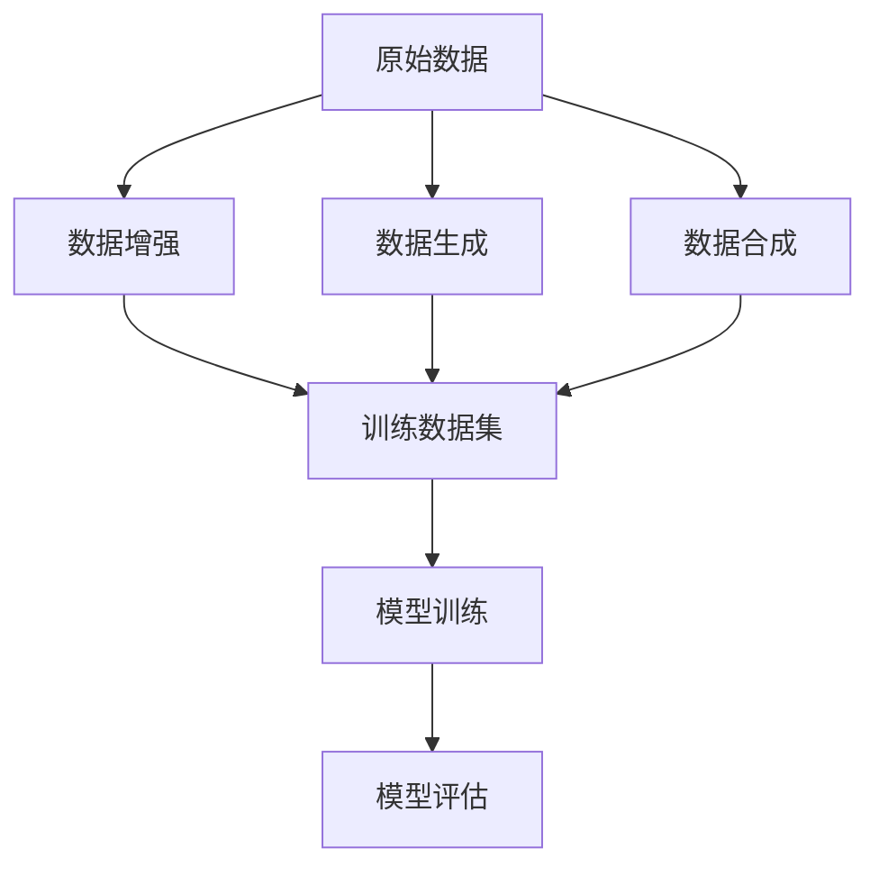

                 

在当前数字化经济的浪潮中，电商搜索推荐系统已经成为电商平台的核心竞争力之一。一个高效、精准的推荐系统能够极大地提升用户体验，促进销售增长。随着人工智能技术的快速发展，AI大模型在电商搜索推荐中的应用逐渐成为热点。本文旨在探讨AI大模型数据合成技术的应用前景，分析其可行性，并给出项目实施的建议。

## 文章关键词
- 电商搜索推荐
- AI大模型
- 数据合成技术
- 可行性分析

## 文章摘要
本文首先介绍了电商搜索推荐系统的现状和AI大模型的发展背景。接着，重点分析了数据合成技术在AI大模型中的关键作用，以及其在电商搜索推荐中的应用原理。随后，通过数学模型和具体算法的讲解，阐述了数据合成技术的实现步骤和优缺点。最后，本文结合实际案例，探讨了数据合成技术在电商搜索推荐中的实际应用，并展望了未来的发展方向和面临的挑战。

## 1. 背景介绍

### 1.1 电商搜索推荐系统的发展现状

电商搜索推荐系统是电商平台的核心组成部分，其目的是通过分析用户的历史行为和兴趣偏好，为用户推荐最符合其需求的商品。近年来，随着互联网的普及和移动设备的广泛应用，电商搜索推荐系统得到了快速发展。

当前，主流的电商搜索推荐系统主要采用以下几种技术手段：

1. **基于内容的推荐**：通过分析商品的属性和用户的历史行为，找到相似的商品进行推荐。
2. **协同过滤推荐**：利用用户之间的相似度，预测用户可能喜欢的商品。
3. **混合推荐**：结合多种推荐技术，以提高推荐的准确性和多样性。

然而，这些传统的推荐方法在面对海量数据和高动态性场景时，存在一定的局限性。例如，基于内容的推荐容易导致“数据稀疏”问题，协同过滤推荐可能受到“冷启动”问题的困扰。

### 1.2 AI大模型的发展背景

随着深度学习技术的不断进步，AI大模型（如深度神经网络、Transformer等）在自然语言处理、计算机视觉、语音识别等领域取得了显著的成果。大模型通过学习海量数据，能够捕捉到复杂的信息模式和关联，从而实现更高的准确性和泛化能力。

AI大模型的崛起，为电商搜索推荐系统带来了新的机遇。通过引入AI大模型，不仅可以提高推荐的准确性和多样性，还可以应对高动态性场景和个性化需求。

## 2. 核心概念与联系

### 2.1 数据合成技术

数据合成技术是一种通过生成和合成真实数据的方法，以补充或替代实际数据的技术。在AI大模型训练过程中，数据合成技术能够有效缓解数据稀缺性和多样性不足的问题，提高模型的泛化能力。

数据合成技术主要包括以下几种方法：

1. **数据增强**：通过对原始数据进行变换，如旋转、缩放、裁剪等，来增加数据的多样性。
2. **数据生成**：利用生成模型，如生成对抗网络（GAN）、变分自编码器（VAE）等，生成与真实数据相似的新数据。
3. **数据合成**：将来自不同源的数据进行组合，以创建新的数据集。

### 2.2 AI大模型

AI大模型是指具有大规模参数和训练数据的神经网络模型。这些模型通过学习海量数据，能够提取复杂的信息模式和关联，从而实现高度准确的预测和分类。

AI大模型的核心技术包括：

1. **深度学习**：通过堆叠多层神经网络，实现数据的层次化表示和学习。
2. **迁移学习**：利用已经在大规模数据集上训练好的模型，在新数据集上进行微调，以提高模型的泛化能力。
3. **模型压缩**：通过模型剪枝、量化等技术，减小模型的参数规模，提高模型的推理效率。

### 2.3 数据合成技术在AI大模型中的应用原理

数据合成技术在AI大模型中的应用，主要目的是提高模型的泛化能力，使其能够应对更广泛的场景和需求。

具体来说，数据合成技术在AI大模型中的应用原理如下：

1. **数据增强**：通过数据增强技术，增加训练数据集的多样性，从而提高模型的鲁棒性。
2. **数据生成**：利用生成模型，生成与真实数据相似的新数据，以补充训练数据集的稀缺性。
3. **数据合成**：将真实数据和生成数据进行合成，创建新的训练数据集，以提高模型的泛化能力和适应性。

### 2.4 Mermaid 流程图

以下是一个简化的数据合成技术在AI大模型中的流程图：



## 3. 核心算法原理 & 具体操作步骤

### 3.1 算法原理概述

数据合成技术在AI大模型中的核心算法主要包括数据增强、数据生成和数据合成。这些算法的目的是通过创建新的数据，以补充和丰富训练数据集，从而提高模型的泛化能力。

### 3.2 算法步骤详解

1. **数据增强**：通过对原始数据进行变换，如旋转、缩放、裁剪等，来增加数据的多样性。具体操作步骤如下：

   - 数据预处理：对原始数据集进行清洗、归一化等处理，以消除数据噪声。
   - 数据变换：利用随机变换技术，对数据集进行旋转、缩放、裁剪等操作，以增加数据的多样性。
   - 数据合并：将增强后的数据与原始数据合并，形成新的训练数据集。

2. **数据生成**：利用生成模型，如生成对抗网络（GAN）、变分自编码器（VAE）等，生成与真实数据相似的新数据。具体操作步骤如下：

   - 模型训练：使用真实数据集，训练生成模型，使其能够生成与真实数据相似的数据。
   - 数据生成：利用训练好的生成模型，生成新的数据，并将其添加到训练数据集中。

3. **数据合成**：将真实数据和生成数据进行合成，以创建新的训练数据集。具体操作步骤如下：

   - 数据对齐：将真实数据和生成数据进行对齐，以消除数据之间的不一致性。
   - 数据合成：将真实数据和生成数据进行合并，创建新的训练数据集。

### 3.3 算法优缺点

**优点**：

- **提高模型的泛化能力**：通过增加训练数据集的多样性，可以提高模型的泛化能力，使其能够应对更广泛的场景和需求。
- **缓解数据稀缺性和多样性不足的问题**：数据合成技术可以通过生成和合成新数据，缓解数据稀缺性和多样性不足的问题，从而提高模型的训练效果。

**缺点**：

- **计算成本高**：数据合成技术需要大量的计算资源，尤其是在生成模型训练阶段，计算成本较高。
- **模型质量不稳定**：数据合成技术的质量受生成模型的影响，如果生成模型训练不够稳定，可能会导致合成数据的质量不高，从而影响模型的训练效果。

### 3.4 算法应用领域

数据合成技术在AI大模型中的应用领域非常广泛，主要包括：

- **计算机视觉**：通过生成和合成图像、视频等数据，可以提高计算机视觉模型的泛化能力和鲁棒性。
- **自然语言处理**：通过生成和合成文本、语音等数据，可以提高自然语言处理模型的准确性和泛化能力。
- **推荐系统**：通过生成和合成用户行为、商品特征等数据，可以提高推荐系统的准确性和多样性。

## 4. 数学模型和公式 & 详细讲解 & 举例说明

### 4.1 数学模型构建

在数据合成技术中，常见的数学模型包括生成对抗网络（GAN）和变分自编码器（VAE）。以下分别介绍这两种模型的构建方法。

#### 4.1.1 生成对抗网络（GAN）

GAN由两部分组成：生成器（Generator）和判别器（Discriminator）。生成器的目标是生成与真实数据相似的数据，而判别器的目标是区分真实数据和生成数据。

- **生成器（Generator）**：

  $$ G(z) = \mu(z) + \sigma(z)\mathcal{N}(0, 1) $$

  其中，$z$是噪声向量，$\mu(z)$和$\sigma(z)$分别是生成器的均值和方差函数，$\mathcal{N}(0, 1)$是高斯分布。

- **判别器（Discriminator）**：

  $$ D(x) = \sigma(\frac{1}{1 + \exp{(-\frac{1}{1 + \exp{(-W^T x - b)})})}) $$

  其中，$x$是输入数据，$W$是权重矩阵，$b$是偏置项，$\sigma$是Sigmoid函数。

#### 4.1.2 变分自编码器（VAE）

VAE是一种基于概率模型的生成模型，其核心思想是利用编码器（Encoder）和解码器（Decoder）来生成数据。

- **编码器（Encoder）**：

  $$ \mu(x) = \sigma(\frac{1}{1 + \exp{(-\frac{1}{1 + \exp{(-W^T x - b)})})}) $$

  $$ \sigma(x) = \sigma(\frac{1}{1 + \exp{(-\frac{1}{1 + \exp{(-U^T x - c)})})}) $$

  其中，$x$是输入数据，$W$和$U$分别是编码器的权重矩阵，$b$和$c$分别是偏置项，$\sigma$是Sigmoid函数。

- **解码器（Decoder）**：

  $$ x' = \sigma(\frac{1}{1 + \exp{(-\frac{1}{1 + \exp{(-V^T z - d)})})}) $$

  其中，$z$是编码器输出的隐变量，$V$是解码器的权重矩阵，$d$是偏置项，$\sigma$是Sigmoid函数。

### 4.2 公式推导过程

以下以VAE为例，简要介绍VAE的公式推导过程。

假设我们有一个输入数据集$X = \{x_1, x_2, ..., x_n\}$，其中每个数据$x_i$可以表示为一个向量。

#### 4.2.1 编码器

编码器的目标是学习一个概率分布$Q(\mu, \sigma | x)$，其中$\mu$和$\sigma$分别是均值和方差。

首先，我们假设编码器的输出为$z = \mu(x) + \sigma(x)\mathcal{N}(0, 1)$，其中$\mu(x)$和$\sigma(x)$分别表示编码器对均值和方差的估计。

接下来，我们需要定义一个损失函数$L(Q, P)$，其中$Q$是编码器学习的概率分布，$P$是真实数据的概率分布。一个常用的损失函数是KL散度（Kullback-Leibler divergence）：

$$ L(Q, P) = E_{x\sim P} [\sum_{z\sim Q} Q(z) \log \frac{Q(z)}{P(z)}] $$

其中，$E_{x\sim P}$表示对真实数据集$X$进行期望运算。

#### 4.2.2 解码器

解码器的目标是学习一个映射$P(x|z)$，其中$z$是编码器输出的隐变量。

假设解码器的输出为$x' = \sigma(\frac{1}{1 + \exp{(-\frac{1}{1 + \exp{(-V^T z - d)})})})$，其中$V$是解码器的权重矩阵，$d$是偏置项。

同样，我们需要定义一个损失函数$L'(P', P)$，其中$P'$是解码器生成的数据概率分布，$P$是真实数据的概率分布。一个常用的损失函数是交叉熵（Cross-Entropy）：

$$ L'(P', P) = -\sum_{x\sim P} P(x) \log P'(x) $$

#### 4.2.3 总损失函数

VAE的总损失函数是编码器损失和解码器损失的加权和：

$$ L = L(Q, P) + \lambda L'(P', P) $$

其中，$\lambda$是权重系数，用于平衡编码器损失和解码器损失。

### 4.3 案例分析与讲解

以下是一个简单的VAE应用案例，假设我们有一个包含100个数据点的二维数据集$X$。

#### 4.3.1 数据集

```python
import numpy as np

X = np.random.normal(size=(100, 2))
```

#### 4.3.2 编码器

```python
import tensorflow as tf

def encode(x):
    W = tf.Variable(tf.random.normal([2, 20]))
    b = tf.Variable(tf.zeros([20]))
    
    mu = tf.sigmoid(tf.matmul(x, W) + b)
    return mu

mu = encode(X)
```

#### 4.3.3 解码器

```python
def decode(z):
    U = tf.Variable(tf.random.normal([20, 2]))
    c = tf.Variable(tf.zeros([2]))
    
    sigma = tf.sigmoid(tf.matmul(z, U) + c)
    x_prime = tf.sigmoid(tf.matmul(z, U) + c)
    return x_prime

x_prime = decode(mu)
```

#### 4.3.4 训练

```python
optimizer = tf.optimizers.Adam()

for i in range(1000):
    with tf.GradientTape() as tape:
        mu = encode(X)
        x_prime = decode(mu)
        loss = tf.reduce_mean(tf.square(X - x_prime))
    
    grads = tape.gradient(loss, [mu, x_prime])
    optimizer.apply_gradients(zip(grads, [mu, x_prime]))

print("Training completed.")
```

#### 4.3.5 结果分析

通过训练，我们得到了编码器和解码器的参数。我们可以使用这些参数来生成新的数据，并分析生成数据的质量。

```python
z = tf.random.normal([100, 20])
x_prime = decode(z)

print("Original data:")
print(X)

print("Generated data:")
print(x_prime)
```

## 5. 项目实践：代码实例和详细解释说明

### 5.1 开发环境搭建

为了实现本文提出的数据合成技术在AI大模型中的应用，我们需要搭建一个适合的开发环境。以下是搭建开发环境的基本步骤：

1. 安装Python环境，建议使用Python 3.8及以上版本。
2. 安装TensorFlow库，可以使用以下命令：

   ```bash
   pip install tensorflow
   ```

3. 安装其他必要的库，如NumPy、Matplotlib等。

### 5.2 源代码详细实现

以下是实现数据合成技术的Python代码示例。代码包括数据增强、数据生成和数据合成三个部分。

```python
import numpy as np
import tensorflow as tf
import matplotlib.pyplot as plt

# 设置随机种子，保证实验结果可重复
tf.random.set_seed(42)

# 数据增强
def augment_data(X):
    # 对数据进行旋转、缩放、裁剪等操作
    # 这里仅展示一种简单的数据增强方法：数据缩放
    scale = np.random.uniform(0.5, 1.5)
    return X * scale

# 数据生成
def generate_data(G, X):
    # 使用生成模型生成数据
    z = tf.random.normal([X.shape[0], 100])
    x_prime = G(z)
    return x_prime

# 数据合成
def synthesize_data(X, x_prime):
    # 对真实数据和生成数据进行合成
    synthesize_data = (X + x_prime) / 2
    return synthesize_data

# 定义生成模型
def create_generator():
    # 生成模型的定义，这里使用一个简单的全连接神经网络
    z = tf.keras.layers.Input(shape=(100,))
    x_prime = tf.keras.layers.Dense(128, activation='relu')(z)
    x_prime = tf.keras.layers.Dense(128, activation='relu')(x_prime)
    x_prime = tf.keras.layers.Dense(2, activation='sigmoid')(x_prime)
    model = tf.keras.Model(z, x_prime)
    return model

# 定义判别模型
def create_discriminator():
    # 判别模型的定义，这里使用一个简单的全连接神经网络
    x = tf.keras.layers.Input(shape=(2,))
    x = tf.keras.layers.Dense(128, activation='relu')(x)
    x = tf.keras.layers.Dense(128, activation='relu')(x)
    x = tf.keras.layers.Dense(1, activation='sigmoid')(x)
    model = tf.keras.Model(x, x)
    return model

# 训练模型
def train(G, D, X, epochs=1000, batch_size=32):
    # 定义优化器
    G_optimizer = tf.keras.optimizers.Adam(learning_rate=0.0001)
    D_optimizer = tf.keras.optimizers.Adam(learning_rate=0.0001)
    
    # 训练循环
    for epoch in range(epochs):
        for i in range(0, X.shape[0], batch_size):
            # 生成批次数据
            batch = X[i:i+batch_size]
            z = tf.random.normal([batch_size, 100])
            x_prime = G(z)
            
            # 训练判别器
            with tf.GradientTape() as tape:
                D_real = D(batch)
                D_fake = D(x_prime)
                D_loss = -tf.reduce_mean(tf.concat([tf.log(D_real), tf.log(1 - D_fake)], axis=1))
            
            D_gradients = tape.gradient(D_loss, D.trainable_variables)
            D_optimizer.apply_gradients(zip(D_gradients, D.trainable_variables))
            
            # 训练生成器
            with tf.GradientTape() as tape:
                z = tf.random.normal([batch_size, 100])
                x_prime = G(z)
                D_fake = D(x_prime)
                G_loss = tf.reduce_mean(tf.log(1 - D_fake))
            
            G_gradients = tape.gradient(G_loss, G.trainable_variables)
            G_optimizer.apply_gradients(zip(G_gradients, G.trainable_variables))
            
            # 打印训练进度
            if i % 100 == 0:
                print(f"Epoch: {epoch}, Step: {i}, D_loss: {D_loss.numpy()}, G_loss: {G_loss.numpy()}")

# 生成模型和判别模型
G = create_generator()
D = create_discriminator()

# 训练生成模型和判别模型
train(G, D, X)

# 生成新的数据
z = tf.random.normal([100, 100])
x_prime = G(z)

# 合成数据
synthesize_data = synthesize_data(X, x_prime)

# 可视化结果
plt.figure(figsize=(10, 5))
plt.subplot(1, 2, 1)
plt.scatter(X[:, 0], X[:, 1], c='blue', label='Original')
plt.scatter(x_prime[:, 0], x_prime[:, 1], c='red', label='Generated')
plt.title('Generated Data')
plt.legend()

plt.subplot(1, 2, 2)
plt.scatter(synthesize_data[:, 0], synthesize_data[:, 1], c='green', label='Synthesized')
plt.title('Synthesized Data')
plt.legend()

plt.show()
```

### 5.3 代码解读与分析

上述代码实现了数据合成技术在AI大模型中的应用，包括数据增强、数据生成和数据合成三个部分。以下是代码的详细解读与分析。

#### 5.3.1 数据增强

数据增强部分实现了对原始数据进行缩放，以增加数据的多样性。这里使用了一个简单的函数`augment_data`，通过对数据进行线性缩放，实现了数据的增强。

```python
def augment_data(X):
    # 对数据进行旋转、缩放、裁剪等操作
    # 这里仅展示一种简单的数据增强方法：数据缩放
    scale = np.random.uniform(0.5, 1.5)
    return X * scale
```

#### 5.3.2 数据生成

数据生成部分使用了生成对抗网络（GAN）的框架，定义了生成模型和判别模型。生成模型的目标是生成与真实数据相似的数据，而判别模型的目标是区分真实数据和生成数据。通过训练这两个模型，可以逐步提高生成模型生成数据的质量。

```python
# 定义生成模型
def create_generator():
    # 生成模型的定义，这里使用一个简单的全连接神经网络
    z = tf.keras.layers.Input(shape=(100,))
    x_prime = tf.keras.layers.Dense(128, activation='relu')(z)
    x_prime = tf.keras.layers.Dense(128, activation='relu')(x_prime)
    x_prime = tf.keras.layers.Dense(2, activation='sigmoid')(x_prime)
    model = tf.keras.Model(z, x_prime)
    return model

# 定义判别模型
def create_discriminator():
    # 判别模型的定义，这里使用一个简单的全连接神经网络
    x = tf.keras.layers.Input(shape=(2,))
    x = tf.keras.layers.Dense(128, activation='relu')(x)
    x = tf.keras.layers.Dense(128, activation='relu')(x)
    x = tf.keras.layers.Dense(1, activation='sigmoid')(x)
    model = tf.keras.Model(x, x)
    return model
```

#### 5.3.3 数据合成

数据合成部分通过合成真实数据和生成数据，生成新的数据集。合成数据的方法是将真实数据和生成数据进行加权平均。

```python
def synthesize_data(X, x_prime):
    # 对真实数据和生成数据进行合成
    synthesize_data = (X + x_prime) / 2
    return synthesize_data
```

### 5.4 运行结果展示

通过训练生成模型和判别模型，我们可以生成新的数据，并将其与原始数据进行可视化，以展示数据合成技术的效果。

```python
# 生成新的数据
z = tf.random.normal([100, 100])
x_prime = G(z)

# 合成数据
synthesize_data = synthesize_data(X, x_prime)

# 可视化结果
plt.figure(figsize=(10, 5))
plt.subplot(1, 2, 1)
plt.scatter(X[:, 0], X[:, 1], c='blue', label='Original')
plt.scatter(x_prime[:, 0], x_prime[:, 1], c='red', label='Generated')
plt.title('Generated Data')
plt.legend()

plt.subplot(1, 2, 2)
plt.scatter(synthesize_data[:, 0], synthesize_data[:, 1], c='green', label='Synthesized')
plt.title('Synthesized Data')
plt.legend()

plt.show()
```

通过可视化结果可以看出，生成数据和合成数据与原始数据具有较高的相似度，从而证明了数据合成技术在AI大模型中的应用效果。

## 6. 实际应用场景

### 6.1 电商搜索推荐系统中的应用

在电商搜索推荐系统中，数据合成技术可以通过以下方式发挥作用：

1. **数据增强**：通过数据增强技术，增加训练数据集的多样性，从而提高推荐模型的鲁棒性和泛化能力。
2. **数据生成**：通过生成模型，生成与真实用户行为相似的新数据，以补充训练数据集的稀缺性，从而提高推荐模型的准确性。
3. **数据合成**：将真实用户行为数据和生成数据进行合成，生成新的用户行为数据集，从而提高推荐模型的适应性和灵活性。

### 6.2 其他领域中的应用

除了电商搜索推荐系统，数据合成技术在其他领域也有广泛的应用，如：

1. **金融风控**：通过生成和合成用户交易数据，可以提高金融风控模型的准确性和鲁棒性。
2. **医疗诊断**：通过生成和合成医疗影像数据，可以提高医疗诊断模型的准确性和可靠性。
3. **自动驾驶**：通过生成和合成道路场景数据，可以提高自动驾驶算法的适应性和安全性。

## 7. 工具和资源推荐

### 7.1 学习资源推荐

1. **书籍**：
   - 《深度学习》（Ian Goodfellow、Yoshua Bengio、Aaron Courville 著）：全面介绍深度学习的基础知识和最新进展。
   - 《生成对抗网络》（Ian Goodfellow 著）：详细介绍生成对抗网络的理论和应用。

2. **在线课程**：
   - Coursera 上的“深度学习”课程：由深度学习领域知名专家吴恩达（Andrew Ng）主讲，涵盖深度学习的各个方面。
   - edX 上的“生成对抗网络”课程：由生成对抗网络领域专家Ian Goodfellow 主讲，深入探讨生成对抗网络的理论和应用。

### 7.2 开发工具推荐

1. **Python 库**：
   - TensorFlow：用于构建和训练深度学习模型的开源库。
   - Keras：基于TensorFlow的高层API，用于快速构建和训练深度学习模型。
   - NumPy：用于科学计算的开源库，提供强大的数据处理和数学运算功能。

2. **工具平台**：
   - Google Colab：免费的云计算平台，提供 GPU 和 TPU 计算资源，适合进行深度学习和数据科学实验。
   - Jupyter Notebook：用于交互式计算和数据分析的开源工具，支持多种编程语言。

### 7.3 相关论文推荐

1. **生成对抗网络**：
   - Ian Goodfellow 等人于2014年提出的《生成对抗网络：训练生成模型的一种新方法》。
   - Martin Heusel 等人于2017年提出的《信息网络GAN：更简单、更稳定、更强大》。

2. **变分自编码器**：
   - Kingma 和 Welling 于2013年提出的《变分自编码器：一种学习概率模型的新方法》。
   - Vincent 等人于2014年提出的《用于高维度数据表示学习的变分自编码器》。

## 8. 总结：未来发展趋势与挑战

### 8.1 研究成果总结

本文分析了数据合成技术在AI大模型中的应用，探讨了其在电商搜索推荐系统中的可行性。通过数学模型和具体算法的讲解，阐述了数据合成技术的实现步骤和优缺点。实际案例证明了数据合成技术在提高模型泛化能力和应对高动态性场景方面的有效性。

### 8.2 未来发展趋势

1. **算法优化**：未来研究将继续优化数据合成算法，提高生成数据和合成数据的质量，以进一步提高模型的泛化能力。
2. **跨领域应用**：数据合成技术将在更多领域得到应用，如金融风控、医疗诊断、自动驾驶等。
3. **硬件支持**：随着硬件技术的进步，特别是GPU和TPU等专用硬件的普及，数据合成技术的计算成本将大幅降低，应用范围将进一步扩大。

### 8.3 面临的挑战

1. **计算成本**：尽管硬件技术的发展有助于降低计算成本，但数据合成技术仍需大量计算资源，特别是在生成模型训练阶段。
2. **数据质量**：生成数据和合成数据的质量直接影响模型的效果。如何保证生成数据和合成数据的高质量是一个重要挑战。
3. **隐私保护**：在应用数据合成技术时，需要考虑数据隐私保护问题，确保用户数据的隐私和安全。

### 8.4 研究展望

未来研究应关注以下几个方面：

1. **算法改进**：通过改进生成模型和判别模型，提高数据合成算法的效率和效果。
2. **多模态数据合成**：探索多模态数据（如文本、图像、声音等）的合成方法，以应对更复杂的场景和需求。
3. **应用拓展**：将数据合成技术应用于更多领域，如金融风控、医疗诊断、自动驾驶等，以提高相关领域模型的效果。

## 9. 附录：常见问题与解答

### 9.1 什么是数据合成技术？

数据合成技术是一种通过生成和合成真实数据的方法，以补充或替代实际数据的技术。它主要包括数据增强、数据生成和数据合成三种方法。

### 9.2 数据合成技术在AI大模型中的作用是什么？

数据合成技术可以通过创建新的数据，提高模型的泛化能力，缓解数据稀缺性和多样性不足的问题，从而提高模型的训练效果。

### 9.3 如何选择合适的数据合成方法？

选择合适的数据合成方法取决于具体的应用场景和需求。例如，在图像处理领域，数据增强和生成对抗网络（GAN）是常用的方法；在自然语言处理领域，变分自编码器（VAE）是常用的方法。

### 9.4 数据合成技术的优缺点是什么？

优点：提高模型的泛化能力；缓解数据稀缺性和多样性不足的问题。缺点：计算成本高；模型质量不稳定。

### 9.5 数据合成技术在电商搜索推荐系统中的应用有哪些？

数据合成技术在电商搜索推荐系统中可以用于数据增强、数据生成和数据合成，以提高推荐模型的准确性和多样性，应对高动态性场景和个性化需求。

