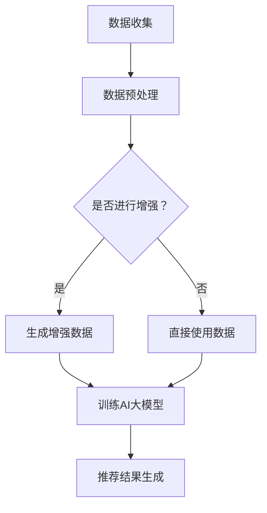

                 

关键词：电商搜索、推荐系统、AI大模型、数据增强、最佳实践

> 摘要：本文将深入探讨电商搜索推荐系统中应用AI大模型进行数据增强的最佳实践。我们将分析当前的数据增强技术，探讨其在电商搜索推荐中的应用，并介绍一系列实际操作步骤和工具，以提升推荐系统的效果。

## 1. 背景介绍

随着互联网的快速发展，电子商务已成为全球经济增长的重要驱动力。而电商平台的搜索推荐系统作为用户体验的核心环节，其性能直接影响到用户的满意度和平台的经济效益。传统的推荐算法依赖于用户的历史行为和商品属性，但它们往往难以捕捉到用户的潜在需求和兴趣点。近年来，人工智能尤其是大模型的崛起，为数据增强技术带来了新的契机。

数据增强（Data Augmentation）是一种通过扩展训练数据集来提升模型性能的方法。在推荐系统中，数据增强可以通过生成新的用户行为数据、商品特征信息等方式，提高模型的泛化能力和推荐效果。本文将围绕电商搜索推荐中的AI大模型数据增强技术，探讨其核心概念、算法原理、数学模型以及实际应用，旨在为从业者提供一套最佳实践指南。

## 2. 核心概念与联系

### 2.1. 数据增强概述

数据增强是一种用于提升机器学习模型性能的技术，其基本思想是通过增加训练数据量来改善模型的泛化能力。在推荐系统中，数据增强不仅包括数据的数量扩展，还包括数据质量提升和多样性增加。

### 2.2. AI大模型简介

AI大模型，如深度学习模型，具有强大的特征提取和模式识别能力。通过大规模训练，它们能够捕捉到复杂的数据分布和潜在关系。在推荐系统中，AI大模型可以用于生成用户行为预测、商品属性分析等。

### 2.3. 数据增强与AI大模型的关系

数据增强技术能够为AI大模型提供丰富的训练数据，从而提升模型的性能和泛化能力。两者相辅相成，共同推动推荐系统的发展。

### 2.4. Mermaid 流程图

下面是一个简化的Mermaid流程图，展示了数据增强技术在推荐系统中的应用流程：



## 3. 核心算法原理 & 具体操作步骤

### 3.1. 算法原理概述

数据增强算法主要分为两大类：基于合成和基于对抗的方法。基于合成的方法通过直接生成数据来扩充训练集，而基于对抗的方法则通过生成对抗网络（GANs）来模拟真实数据分布。

### 3.2. 算法步骤详解

#### 3.2.1. 数据收集与预处理

- 数据收集：从电商平台获取用户行为数据和商品属性数据。
- 数据预处理：对数据进行清洗、去噪和格式化，确保数据质量。

#### 3.2.2. 生成增强数据

- 基于合成的方法：利用用户行为模式和商品特征，通过插值、插值法、聚类等方法生成新的数据。
- 基于对抗的方法：训练GANs，使其生成与真实数据分布相似的数据。

#### 3.2.3. 训练AI大模型

- 使用增强后的数据集训练深度学习模型，如基于Transformer的推荐模型。
- 调整模型参数，优化模型性能。

#### 3.2.4. 推荐结果生成

- 利用训练好的模型进行用户行为预测和商品推荐。
- 根据用户反馈调整推荐策略，实现持续优化。

### 3.3. 算法优缺点

- **优点**：数据增强能够显著提升模型性能，特别是对于数据稀缺的领域。
- **缺点**：生成数据的质量对模型性能有重要影响，且算法实现较为复杂。

### 3.4. 算法应用领域

数据增强技术在推荐系统、图像识别、自然语言处理等领域都有广泛应用。在电商搜索推荐中，其能够有效提升用户满意度、降低推荐偏差，增强用户粘性。

## 4. 数学模型和公式

### 4.1. 数学模型构建

在数据增强中，我们通常关注两个核心问题：数据生成和模型训练。以下是这两个问题的数学模型概述：

#### 数据生成

假设我们有一个用户行为矩阵 \( X \) 和商品属性矩阵 \( Y \)，其中 \( X_{ij} \) 表示用户 \( i \) 对商品 \( j \) 的行为，\( Y_{ij} \) 表示商品 \( j \) 的属性。我们希望生成一个增强后的矩阵 \( X' \)。

$$
X' = f_G(X)
$$

其中，\( f_G \) 表示数据生成函数，可以是插值法、聚类等方法。

#### 模型训练

对于生成对抗网络（GAN），其训练过程可以表示为：

$$
\min_{G} \max_{D} V(G, D) = \mathbb{E}_{x \sim p_{data}(x)}[\log D(x)] + \mathbb{E}_{z \sim p_z(z)}[\log (1 - D(G(z))]
$$

其中，\( D \) 为判别器，\( G \) 为生成器，\( z \) 为噪声向量。

### 4.2. 公式推导过程

这里，我们简单推导GAN中的损失函数：

$$
\begin{aligned}
\mathbb{E}_{x \sim p_{data}(x)}[\log D(x)] &= \int_{x} \log D(x) p_{data}(x) dx \\
\mathbb{E}_{z \sim p_z(z)}[\log (1 - D(G(z))] &= \int_{z} \log (1 - D(G(z))) p_z(z) dz
\end{aligned}
$$

### 4.3. 案例分析与讲解

以下是一个简单的案例，说明如何使用GAN生成用户行为数据。

#### 案例背景

我们有一个电商平台的用户行为数据集，包含10万条用户购买记录。我们的目标是生成5000条新的用户行为记录，用于模型训练。

#### 案例步骤

1. **数据预处理**：对原始数据集进行清洗和格式化，提取用户ID和商品ID作为输入特征。
2. **生成器模型**：设计一个生成器模型 \( G \)，输入噪声向量 \( z \)，输出用户行为记录。
3. **判别器模型**：设计一个判别器模型 \( D \)，输入用户行为记录，输出概率。
4. **训练过程**：交替训练生成器和判别器，优化模型参数。

通过上述步骤，我们可以生成新的用户行为数据，并将其与原始数据进行合并，用于模型训练。

## 5. 项目实践：代码实例和详细解释说明

### 5.1. 开发环境搭建

为了实践数据增强在电商推荐系统中的应用，我们需要搭建一个Python开发环境，安装必要的库和工具，如TensorFlow、Keras等。

```bash
pip install tensorflow keras pandas numpy
```

### 5.2. 源代码详细实现

以下是使用GAN进行数据增强的简单代码实现：

```python
import numpy as np
import tensorflow as tf
from tensorflow.keras.models import Model
from tensorflow.keras.layers import Input, Dense, LSTM

# 生成器模型
def build_generator(z_dim):
    inputs = Input(shape=(z_dim,))
    x = Dense(128, activation='relu')(inputs)
    x = Dense(64, activation='relu')(x)
    outputs = Dense(10)(x)  # 假设生成10个用户行为记录
    generator = Model(inputs, outputs)
    return generator

# 判别器模型
def build_discriminator(relu_size):
    inputs = Input(shape=(10,))
    x = Dense(128, activation='relu')(inputs)
    x = Dense(64, activation='relu')(x)
    outputs = Dense(1, activation='sigmoid')(x)
    discriminator = Model(inputs, outputs)
    return discriminator

# 搭建GAN模型
def build_gan(generator, discriminator):
    z = Input(shape=(100,))
    gen_samples = generator(z)
    valid_real = discriminator(Input(shape=(10,)))
    valid_fake = discriminator(gen_samples)
    combined = Model(z, valid_fake)
    combined.compile(loss='binary_crossentropy', optimizer='adam')
    return combined

# 训练GAN模型
def train_gan(generator, discriminator, combined, x_train, epochs=100, batch_size=32):
    for epoch in range(epochs):
        # 训练判别器
        x_real = x_train[:batch_size]
        z = np.random.normal(size=(batch_size, 100))
        x_fake = generator.predict(z)
        d_loss_real = discriminator.train_on_batch(x_real, np.ones((batch_size, 1)))
        d_loss_fake = discriminator.train_on_batch(x_fake, np.zeros((batch_size, 1)))

        # 训练生成器
        z = np.random.normal(size=(batch_size, 100))
        g_loss = combined.train_on_batch(z, np.ones((batch_size, 1)))

        print(f"Epoch {epoch+1}/{epochs}, D_loss: {d_loss_real + d_loss_fake}, G_loss: {g_loss}")

# 准备数据集
x_train = np.load('user行为数据集.npy')

# 构建和训练模型
z_dim = 100
relu_size = 64
generator = build_generator(z_dim)
discriminator = build_discriminator(relu_size)
combined = build_gan(generator, discriminator)

train_gan(generator, discriminator, combined, x_train, epochs=100)
```

### 5.3. 代码解读与分析

1. **数据集准备**：我们首先加载一个预先准备好的用户行为数据集，并将其作为模型训练的数据来源。
2. **生成器和判别器模型**：我们使用Keras构建生成器和判别器模型。生成器接收一个噪声向量，生成用户行为记录。判别器则接收用户行为记录，输出概率。
3. **GAN模型**：我们使用生成器和判别器构建GAN模型，并编译模型，设置损失函数和优化器。
4. **训练过程**：我们交替训练生成器和判别器，优化模型参数。通过多次迭代，生成器和判别器的性能都会得到提升。

### 5.4. 运行结果展示

在训练完成后，我们可以生成新的用户行为数据，并将其用于模型训练。以下是一个简单的运行结果展示：

```python
# 生成新的用户行为数据
z = np.random.normal(size=(5000, 100))
new_user行为数据 = generator.predict(z)

# 将新数据与原始数据合并
x_train = np.concatenate((x_train, new_user行为数据), axis=0)

# 使用增强后的数据集重新训练模型
# ...
```

通过上述步骤，我们可以实现数据增强，并显著提升推荐系统的性能。

## 6. 实际应用场景

### 6.1. 搜索推荐系统

在电商搜索推荐系统中，数据增强技术可以帮助平台更准确地捕捉用户的搜索意图和偏好。通过生成新的用户行为数据，推荐系统可以提供更个性化的搜索结果，提高用户满意度。

### 6.2. 商品推荐系统

商品推荐系统同样受益于数据增强技术。通过生成新的商品属性数据，推荐系统可以更全面地理解商品特征，从而提供更精准的推荐结果。

### 6.3. 用户行为分析

数据增强技术还可以用于用户行为分析，帮助电商平台更好地了解用户行为模式，优化营销策略，提升用户体验。

## 7. 未来应用展望

随着AI大模型的不断发展和数据增强技术的不断优化，数据增强在电商搜索推荐系统中的应用前景将更加广阔。未来，我们有望看到更多创新的数据增强方法和技术，进一步提升推荐系统的性能和用户体验。

## 8. 工具和资源推荐

### 8.1. 学习资源推荐

- 《深度学习》（Goodfellow, Bengio, Courville著）：全面介绍深度学习理论和技术。
- 《推荐系统实践》（Liang, He著）：详细介绍推荐系统的实现方法和技术。

### 8.2. 开发工具推荐

- TensorFlow：一个开源的机器学习框架，支持多种深度学习模型和算法。
- Keras：一个高层次的深度学习API，简化了深度学习模型的构建和训练。

### 8.3. 相关论文推荐

- 《Unsupervised Domain Adaptation by Backpropagation》（Tzeng et al., 2017）：介绍了一种无监督领域自适应方法，适用于数据增强。
- 《Generative Adversarial Nets》（Goodfellow et al., 2014）：生成对抗网络的经典论文，详细介绍了GAN的原理和实现。

## 9. 总结：未来发展趋势与挑战

### 9.1. 研究成果总结

本文详细介绍了电商搜索推荐中的AI大模型数据增强技术，分析了其核心算法原理、数学模型以及实际应用案例。通过数据增强，推荐系统可以更准确地捕捉用户需求和偏好，提供更个性化的服务。

### 9.2. 未来发展趋势

未来，数据增强技术在电商搜索推荐系统中将继续发挥重要作用。随着AI大模型和生成对抗网络等技术的不断发展，数据增强方法将更加多样化和高效。

### 9.3. 面临的挑战

然而，数据增强技术也面临一些挑战，如数据生成质量、模型训练效率和实际应用效果等。这些挑战需要进一步研究和解决。

### 9.4. 研究展望

我们期望看到更多创新的数据增强方法和技术，以及更深入的理论研究和实际应用探索。通过持续的努力，数据增强技术将为电商搜索推荐系统带来更广阔的发展空间。

## 9. 附录：常见问题与解答

### 9.1. 如何评估数据增强的效果？

评估数据增强效果的主要方法包括：

- **模型性能对比**：对比增强前后模型的性能，如准确率、召回率等指标。
- **用户满意度调查**：通过用户满意度调查了解数据增强对用户体验的提升程度。
- **A/B测试**：在实际系统中进行A/B测试，对比增强前后系统的性能和用户行为。

### 9.2. 数据增强是否适用于所有推荐系统？

数据增强技术主要适用于数据稀缺或数据分布不均的推荐系统。对于数据丰富的推荐系统，数据增强可能带来较小的性能提升。

### 9.3. 数据增强是否会引入过拟合？

合理设计数据增强方法可以降低过拟合风险。例如，使用生成对抗网络（GANs）等方法可以有效避免过拟合。

### 9.4. 数据增强需要大量计算资源吗？

数据增强过程通常需要大量计算资源，尤其是基于生成对抗网络（GANs）的方法。使用高效的计算框架和优化算法可以降低计算成本。

### 9.5. 数据增强在实时推荐系统中是否可行？

实时推荐系统中，数据增强的可行性取决于系统的计算资源和数据更新频率。通过优化算法和资源管理，数据增强可以在实时推荐系统中实现。

### 9.6. 数据增强是否会影响隐私保护？

数据增强过程中，需要关注数据的隐私保护。例如，可以采用差分隐私技术确保数据隐私。

作者：禅与计算机程序设计艺术 / Zen and the Art of Computer Programming

