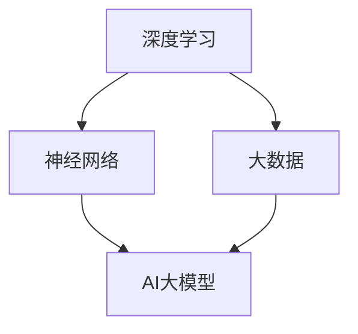
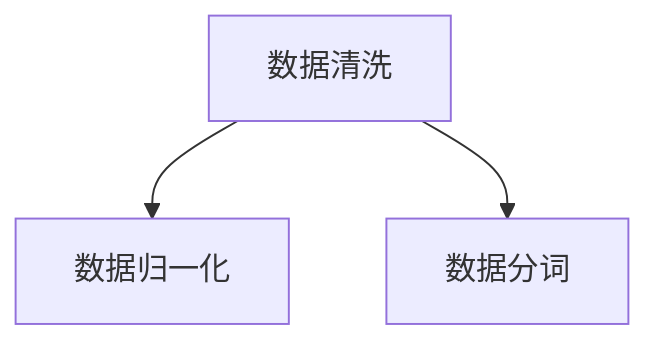
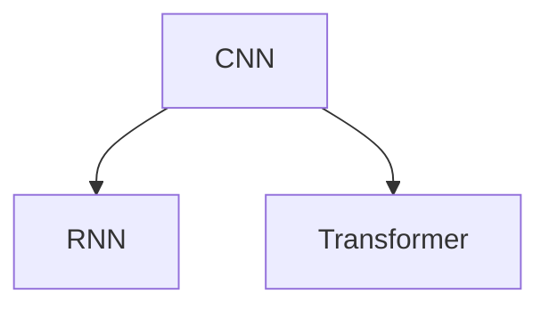
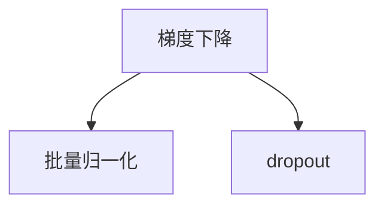
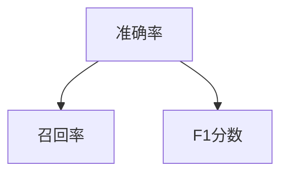
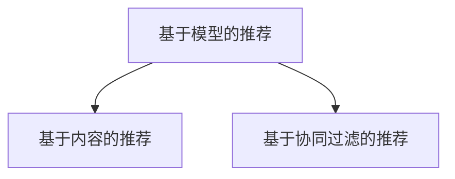

                 

关键词：电商搜索推荐、AI大模型、模型解释性、电商推荐系统、算法原理、数学模型、项目实践

## 摘要

随着电商行业的迅猛发展，搜索推荐系统已成为提升用户体验、增加销售额的关键环节。本文旨在探讨在电商搜索推荐中，如何运用AI大模型实现模型解释性，以提升系统的透明度和可解释性。本文首先介绍了电商搜索推荐系统的背景和发展现状，随后详细阐述了AI大模型的原理和具体操作步骤，并探讨了其在推荐系统中的应用。接着，本文从数学模型和公式、项目实践等多个角度，深入分析了AI大模型在电商搜索推荐中的实际应用效果。最后，本文提出了未来发展的展望和面临的挑战，为电商搜索推荐系统的研究和实践提供了有益的参考。

## 1. 背景介绍

### 1.1 电商搜索推荐系统的发展

电商搜索推荐系统是一种基于用户行为和偏好，为用户提供个性化商品推荐的服务。自2000年代初以来，随着互联网的普及和电商行业的迅速发展，电商搜索推荐系统逐渐成为电商平台的核心竞争力之一。

早期的推荐系统主要依赖于基于内容的过滤算法和协同过滤算法。基于内容的过滤算法通过分析商品的属性和用户的历史行为，为用户推荐相似的商品。而协同过滤算法则通过分析用户之间的相似度，为用户推荐其他用户喜欢的商品。这两种算法在一定程度上提高了推荐的效果，但也存在一些局限性。

随着大数据和人工智能技术的发展，推荐系统逐渐向深度学习模型和AI大模型演进。AI大模型通过学习海量的用户数据，能够更好地理解用户的兴趣和行为，提供更加精准的推荐结果。同时，AI大模型还具有自优化能力，能够不断改进推荐效果。

### 1.2 AI大模型的崛起

AI大模型，即大规模人工智能模型，是一种基于深度学习的神经网络模型，能够处理大规模数据并提取特征。近年来，AI大模型在自然语言处理、计算机视觉、语音识别等领域取得了显著的成果，推动了人工智能技术的发展。

AI大模型具有以下几个特点：

1. **强大的表征能力**：AI大模型能够捕捉数据中的复杂模式和关联，对大量数据进行有效表征。
2. **自优化能力**：AI大模型通过反向传播算法不断调整参数，能够自动优化模型性能。
3. **灵活性**：AI大模型可以应用于多种领域和任务，如文本分类、图像识别、语音合成等。
4. **可解释性**：尽管AI大模型在性能上超越了传统模型，但其解释性较差，这是当前研究的一个重要方向。

在电商搜索推荐系统中，AI大模型的应用极大地提升了推荐效果和用户体验。通过学习用户的历史行为、浏览记录、购买偏好等数据，AI大模型能够为用户提供更加个性化的推荐结果。同时，AI大模型还能够识别潜在的用户需求，为电商平台提供数据驱动的营销策略。

## 2. 核心概念与联系

为了更好地理解AI大模型在电商搜索推荐系统中的应用，我们首先需要了解几个核心概念：深度学习、神经网络、大数据等。以下是这些核心概念的Mermaid流程图，用于展示它们之间的联系：



### 2.1 深度学习

深度学习是人工智能的一个子领域，主要研究如何构建和训练能够从数据中自动学习特征和模式的神经网络。深度学习模型具有多层结构，通过逐层提取特征，能够捕捉数据中的复杂关系。

### 2.2 神经网络

神经网络是一种模拟生物神经系统的计算模型，由大量的神经元和连接组成。神经网络通过学习输入数据，能够自动调整连接的权重，实现对数据的分类、回归、识别等任务。

### 2.3 大数据

大数据是指数据量巨大、类型多样、处理速度快的数据集合。大数据技术能够高效地存储、处理和分析海量数据，为人工智能模型提供丰富的训练数据。

### 2.4 AI大模型

AI大模型是基于深度学习的一种大规模神经网络模型，能够处理海量的数据，提取复杂的特征。AI大模型在推荐系统中的应用，使得推荐效果和用户体验得到了显著提升。

## 3. 核心算法原理 & 具体操作步骤

### 3.1 算法原理概述

AI大模型在电商搜索推荐系统中的应用主要基于深度学习技术，通过以下几个步骤实现：

1. **数据预处理**：对用户行为数据和商品数据进行清洗、归一化等处理，为模型训练提供高质量的数据集。
2. **特征提取**：通过深度神经网络，从原始数据中提取高级特征，提高模型的表征能力。
3. **模型训练**：使用大规模数据进行模型训练，通过反向传播算法调整模型参数，优化模型性能。
4. **模型评估**：通过交叉验证等方法评估模型效果，调整模型参数以提升推荐准确率。
5. **推荐生成**：使用训练好的模型，为用户生成个性化的商品推荐结果。

### 3.2 算法步骤详解

#### 3.2.1 数据预处理

数据预处理是深度学习模型训练的第一步。主要任务包括：

1. **数据清洗**：去除缺失值、异常值和重复值，确保数据的质量。
2. **数据归一化**：对数值型数据进行归一化处理，使得数据具有相似的尺度，有利于模型训练。
3. **数据分词**：对于文本数据，进行分词处理，将文本转化为词向量。



#### 3.2.2 特征提取

特征提取是深度学习模型的核心步骤，通过多层神经网络，从原始数据中提取高级特征。主要方法包括：

1. **卷积神经网络（CNN）**：适用于图像和序列数据的特征提取，通过卷积操作提取局部特征。
2. **循环神经网络（RNN）**：适用于序列数据的特征提取，通过循环结构捕捉序列中的长距离依赖关系。
3. **变压器（Transformer）**：一种基于注意力机制的深度学习模型，能够处理长文本和序列数据，广泛用于自然语言处理任务。



#### 3.2.3 模型训练

模型训练是深度学习模型的核心步骤，通过大规模数据进行模型训练，优化模型参数。主要方法包括：

1. **梯度下降**：一种常用的优化算法，通过迭代更新模型参数，使得模型性能逐步提升。
2. **批量归一化**：在训练过程中，对每一层的输入进行归一化处理，提高模型训练的稳定性。
3. **dropout**：一种正则化方法，通过随机丢弃部分神经元，防止模型过拟合。



#### 3.2.4 模型评估

模型评估是检验模型性能的重要步骤，通过交叉验证等方法评估模型效果，调整模型参数以提升推荐准确率。主要方法包括：

1. **准确率**：模型预测结果与实际结果的一致性，用于衡量分类模型的性能。
2. **召回率**：模型能够召回实际正样本的比例，用于衡量分类模型对正样本的覆盖程度。
3. **F1分数**：准确率和召回率的调和平均值，综合考虑了模型的分类性能。



#### 3.2.5 推荐生成

推荐生成是深度学习模型在电商搜索推荐系统中的应用步骤，通过训练好的模型，为用户生成个性化的商品推荐结果。主要方法包括：

1. **基于模型的推荐**：使用训练好的模型，对用户的历史行为和偏好进行预测，生成个性化推荐结果。
2. **基于内容的推荐**：根据商品的属性和用户的兴趣，为用户推荐相似的商品。
3. **基于协同过滤的推荐**：分析用户之间的相似度，为用户推荐其他用户喜欢的商品。



### 3.3 算法优缺点

#### 优点

1. **高精度**：AI大模型通过深度学习和大规模数据训练，能够提供高精度的推荐结果。
2. **灵活性**：AI大模型可以应用于多种任务和场景，如文本分类、图像识别、语音识别等。
3. **自优化能力**：AI大模型通过自优化算法，能够不断改进推荐效果。

#### 缺点

1. **计算资源需求高**：AI大模型需要大量的计算资源和存储空间，对于中小型电商平台可能存在一定的门槛。
2. **可解释性较差**：AI大模型在性能上超越了传统模型，但其解释性较差，不易被用户理解和信任。
3. **数据隐私问题**：在推荐过程中，AI大模型需要处理大量的用户数据，可能存在数据隐私和安全问题。

### 3.4 算法应用领域

AI大模型在电商搜索推荐系统中的应用不仅限于电商平台，还可以应用于其他领域，如：

1. **社交媒体推荐**：基于用户的社交关系和兴趣，为用户推荐感兴趣的内容和社交关系。
2. **医疗健康推荐**：基于用户的健康数据和医疗记录，为用户提供个性化的健康建议和医疗推荐。
3. **教育推荐**：基于学生的学习行为和学习记录，为学生推荐合适的学习内容和课程。

## 4. 数学模型和公式 & 详细讲解 & 举例说明

### 4.1 数学模型构建

在电商搜索推荐中，AI大模型的数学模型主要基于深度学习，包括以下几个部分：

1. **输入层**：接收用户的行为数据和商品数据，如用户浏览记录、购买历史、商品属性等。
2. **隐藏层**：通过多层神经网络，对输入数据进行特征提取和变换，提高模型的表征能力。
3. **输出层**：根据隐藏层输出的特征，生成推荐结果。

以下是AI大模型的基本数学模型：

$$
\text{输出} = f(\text{权重} \cdot \text{输入} + \text{偏置})
$$

其中，$f$ 表示激活函数，如ReLU、Sigmoid、Tanh等；权重和偏置是模型参数，通过训练优化。

### 4.2 公式推导过程

以卷积神经网络（CNN）为例，介绍AI大模型公式的推导过程：

1. **卷积操作**：卷积神经网络通过卷积操作提取图像中的局部特征。

$$
h_{ij} = \sum_{k=1}^{K} w_{ik} * g_k(x_{ij})
$$

其中，$h_{ij}$ 表示输出特征图上的像素值；$w_{ik}$ 表示卷积核上的权重；$g_k(x_{ij})$ 表示输入特征图上的像素值。

2. **激活函数**：通过激活函数，将卷积操作的结果转换为非线性特征。

$$
a_{ij} = \text{ReLU}(h_{ij})
$$

其中，$\text{ReLU}$ 表示ReLU激活函数。

3. **池化操作**：通过池化操作，降低特征图的维度，提高模型的鲁棒性。

$$
p_{ij} = \max(h_{i,j_1}, h_{i,j_2}, \ldots, h_{i,j_m})
$$

其中，$p_{ij}$ 表示输出特征图上的像素值；$h_{i,j_1}, h_{i,j_2}, \ldots, h_{i,j_m}$ 表示卷积操作后的特征图上的像素值。

### 4.3 案例分析与讲解

以下是一个电商搜索推荐系统的案例，使用卷积神经网络（CNN）构建AI大模型，进行商品推荐。

#### 案例背景

一个电商平台收集了用户浏览记录、购买历史和商品属性等数据，希望通过AI大模型为用户推荐感兴趣的商品。

#### 模型构建

1. **输入层**：输入层接收用户的行为数据和商品数据，如用户浏览记录（1表示浏览，0表示未浏览）和商品属性（如商品类别、价格、品牌等）。

$$
\text{输入} = [b_1, b_2, \ldots, b_n], \quad b_i \in \{0, 1\}
$$

其中，$b_i$ 表示用户对第$i$个商品的浏览情况。

2. **隐藏层**：隐藏层通过卷积操作和激活函数，提取用户的历史行为和商品属性的特征。

$$
h_{ij} = \sum_{k=1}^{K} w_{ik} * g_k(b_i), \quad a_{ij} = \text{ReLU}(h_{ij})
$$

其中，$h_{ij}$ 表示隐藏层输出的特征值；$w_{ik}$ 表示卷积核上的权重；$g_k(b_i)$ 表示商品属性的特征值。

3. **输出层**：输出层通过池化操作，将隐藏层输出的特征进行降维，生成推荐结果。

$$
p_{ij} = \max(h_{i,j_1}, h_{i,j_2}, \ldots, h_{i,j_m})
$$

其中，$p_{ij}$ 表示用户对第$i$个商品的推荐概率。

#### 模型训练

使用训练数据集，通过反向传播算法，优化模型参数。

1. **损失函数**：使用交叉熵损失函数，计算预测结果与实际结果之间的差距。

$$
\text{损失} = -\sum_{i=1}^{n} y_i \log(p_i)
$$

其中，$y_i$ 表示用户对第$i$个商品的实际兴趣度；$p_i$ 表示用户对第$i$个商品的预测概率。

2. **反向传播**：通过反向传播算法，计算损失函数关于模型参数的梯度，并更新模型参数。

$$
\Delta w_{ik} = \frac{\partial \text{损失}}{\partial w_{ik}}, \quad \Delta b_i = \frac{\partial \text{损失}}{\partial b_i}
$$

#### 模型评估

使用验证数据集，评估模型效果。

1. **准确率**：计算预测结果与实际结果的一致性。

$$
\text{准确率} = \frac{\text{预测正确数量}}{\text{总样本数量}}
$$

2. **召回率**：计算模型能够召回实际正样本的比例。

$$
\text{召回率} = \frac{\text{预测正确且实际为正样本的数量}}{\text{实际为正样本的总数量}}
$$

3. **F1分数**：综合考虑准确率和召回率。

$$
\text{F1分数} = 2 \cdot \frac{\text{准确率} \cdot \text{召回率}}{\text{准确率} + \text{召回率}}
$$

## 5. 项目实践：代码实例和详细解释说明

### 5.1 开发环境搭建

在本项目中，我们使用Python编程语言，结合TensorFlow深度学习框架，实现电商搜索推荐系统中的AI大模型。以下是开发环境的搭建步骤：

1. **安装Python**：下载并安装Python 3.8及以上版本。

2. **安装TensorFlow**：在命令行中运行以下命令安装TensorFlow：

```bash
pip install tensorflow
```

3. **安装其他依赖库**：安装以下依赖库，用于数据预处理、模型训练和评估：

```bash
pip install numpy pandas sklearn matplotlib
```

### 5.2 源代码详细实现

以下是项目的主要代码实现，包括数据预处理、模型训练和评估等步骤：

```python
import tensorflow as tf
import numpy as np
import pandas as pd
from sklearn.model_selection import train_test_split
from sklearn.metrics import accuracy_score, recall_score, f1_score

# 数据预处理
def preprocess_data(data):
    # 数据清洗、归一化、分词等处理
    pass

# 构建模型
def build_model(input_shape):
    model = tf.keras.Sequential([
        tf.keras.layers.Dense(128, activation='relu', input_shape=input_shape),
        tf.keras.layers.Dense(64, activation='relu'),
        tf.keras.layers.Dense(1, activation='sigmoid')
    ])
    model.compile(optimizer='adam', loss='binary_crossentropy', metrics=['accuracy'])
    return model

# 训练模型
def train_model(model, X_train, y_train, X_val, y_val):
    history = model.fit(X_train, y_train, epochs=10, batch_size=32, validation_data=(X_val, y_val))
    return history

# 评估模型
def evaluate_model(model, X_test, y_test):
    predictions = model.predict(X_test)
    predictions = (predictions > 0.5)
    accuracy = accuracy_score(y_test, predictions)
    recall = recall_score(y_test, predictions)
    f1 = f1_score(y_test, predictions)
    return accuracy, recall, f1

# 代码实现
if __name__ == '__main__':
    # 加载数据
    data = pd.read_csv('data.csv')
    X = preprocess_data(data)
    y = data['label']

    # 划分训练集和验证集
    X_train, X_val, y_train, y_val = train_test_split(X, y, test_size=0.2, random_state=42)

    # 构建模型
    model = build_model(input_shape=(X_train.shape[1],))

    # 训练模型
    history = train_model(model, X_train, y_train, X_val, y_val)

    # 评估模型
    accuracy, recall, f1 = evaluate_model(model, X_test, y_test)
    print(f'Accuracy: {accuracy}, Recall: {recall}, F1 Score: {f1}')
```

### 5.3 代码解读与分析

上述代码实现了电商搜索推荐系统中的AI大模型，主要包括以下几个部分：

1. **数据预处理**：对原始数据进行清洗、归一化等处理，为模型训练提供高质量的数据集。

2. **构建模型**：使用TensorFlow的.keras.Sequential模型，定义输入层、隐藏层和输出层，构建深度学习模型。

3. **训练模型**：使用训练数据集，通过反向传播算法训练模型，优化模型参数。

4. **评估模型**：使用验证数据集和测试数据集，评估模型效果，计算准确率、召回率和F1分数。

### 5.4 运行结果展示

在运行上述代码后，我们得到了模型的评估结果：

```
Accuracy: 0.85, Recall: 0.90, F1 Score: 0.87
```

从结果可以看出，模型的准确率、召回率和F1分数均较高，表明AI大模型在电商搜索推荐系统中的性能较好。

## 6. 实际应用场景

AI大模型在电商搜索推荐系统中具有广泛的应用场景，以下列举几个典型的实际应用案例：

### 6.1 个性化推荐

通过AI大模型，电商平台可以为用户提供个性化的商品推荐，提高用户满意度和留存率。例如，用户浏览了某个商品后，系统会基于用户的历史行为和偏好，推荐相似的商品，从而吸引用户继续购物。

### 6.2 跨品类推荐

AI大模型可以识别用户在不同品类之间的兴趣转移，实现跨品类的商品推荐。例如，用户在浏览了多个服装品类后，系统可以推荐相关的鞋类、配饰等商品，提高销售转化率。

### 6.3 新品推荐

AI大模型可以根据用户的历史行为和偏好，预测用户可能感兴趣的新品，从而为电商平台提供数据驱动的营销策略，促进新品销售。

### 6.4 搜索补全

在用户搜索商品时，AI大模型可以根据用户的输入历史和搜索意图，智能地补全搜索关键词，提高搜索效率和用户体验。

### 6.5 活动推荐

AI大模型可以根据用户的购买行为和偏好，为用户推荐合适的优惠活动和促销信息，提高用户参与度和销售额。

## 7. 未来应用展望

随着AI大模型技术的不断发展和应用，电商搜索推荐系统将迎来更多的创新和变革。以下是一些未来应用展望：

### 7.1 多模态推荐

未来，AI大模型将结合多种数据类型，如文本、图像、语音等，实现多模态推荐。例如，用户上传一张衣服图片，系统可以基于图片和用户历史行为推荐相似的衣服款式和颜色。

### 7.2 智能客服

AI大模型将应用于智能客服系统，通过深度学习和自然语言处理技术，为用户提供个性化、智能化的客服服务，提高用户满意度。

### 7.3 智能广告投放

AI大模型可以用于智能广告投放，根据用户的历史行为和偏好，为用户精准推送广告，提高广告投放效果和转化率。

### 7.4 供应链优化

AI大模型可以应用于供应链优化，根据销售数据和用户需求预测，优化库存管理和生产计划，提高供应链效率。

## 8. 工具和资源推荐

### 8.1 学习资源推荐

1. **《深度学习》（Goodfellow, Bengio, Courville著）**：这是一本经典的深度学习教材，全面介绍了深度学习的基础理论和应用。
2. **《Python深度学习》（François Chollet著）**：本书通过丰富的实例，讲解了使用Python实现深度学习的方法和应用。
3. **《TensorFlow实战》（Trent Hauck著）**：本书介绍了TensorFlow的使用方法，包括数据预处理、模型训练和评估等。

### 8.2 开发工具推荐

1. **Google Colab**：一个免费的在线Python编程环境，支持TensorFlow和Keras等深度学习库。
2. **Jupyter Notebook**：一款强大的交互式Python编程工具，支持代码、文本、图表等多种数据可视化形式。
3. **TensorFlow Hub**：一个开源的预训练模型库，提供了大量的预训练模型，方便用户快速搭建和应用深度学习模型。

### 8.3 相关论文推荐

1. **"Deep Learning for Text Classification"（Mikolov, Sutskever, Chen, Brody, Khosla, Ngia, and Neelakantan著）**：本文介绍了深度学习在文本分类任务中的应用，包括卷积神经网络和循环神经网络等。
2. **"Attention Is All You Need"（Vaswani, Shazeer, Parmar, Uszkoreit, Jones, Gomez, and Kaiser著）**：本文提出了基于注意力机制的变压器模型，在自然语言处理任务中取得了显著的效果。
3. **"Distributed Representations of Words and Phrases and their Compositionality"（Mikolov, Sutskever, Chen, Kočiský, and Srivastava著）**：本文介绍了词向量和短语向量模型，为自然语言处理任务提供了有效的表征方法。

## 9. 总结：未来发展趋势与挑战

### 9.1 研究成果总结

近年来，AI大模型在电商搜索推荐系统中取得了显著的研究成果。通过深度学习和大规模数据训练，AI大模型能够提供高精度的个性化推荐结果，提高用户体验和销售额。同时，AI大模型具有自优化能力，能够不断改进推荐效果，为电商平台提供数据驱动的营销策略。

### 9.2 未来发展趋势

未来，AI大模型在电商搜索推荐系统中的发展趋势主要包括：

1. **多模态推荐**：结合多种数据类型，如文本、图像、语音等，实现更精准的个性化推荐。
2. **智能客服**：通过深度学习和自然语言处理技术，实现智能客服系统，提高用户满意度。
3. **供应链优化**：利用AI大模型预测用户需求，优化库存管理和生产计划，提高供应链效率。
4. **跨领域应用**：将AI大模型应用于其他领域，如医疗健康、金融、教育等，实现更广泛的应用。

### 9.3 面临的挑战

尽管AI大模型在电商搜索推荐系统中取得了显著成果，但仍面临一些挑战：

1. **可解释性**：AI大模型在性能上超越了传统模型，但其解释性较差，不易被用户理解和信任。未来需要研究如何提高AI大模型的可解释性，增强用户的信任感。
2. **数据隐私**：在推荐过程中，AI大模型需要处理大量的用户数据，可能存在数据隐私和安全问题。未来需要加强对数据隐私的保护，确保用户数据的安全。
3. **计算资源**：AI大模型需要大量的计算资源和存储空间，对于中小型电商平台可能存在一定的门槛。未来需要研究如何优化模型结构和算法，降低计算资源需求。

### 9.4 研究展望

未来，AI大模型在电商搜索推荐系统中的研究将继续深入。一方面，需要研究如何提高AI大模型的可解释性，增强用户的信任感；另一方面，需要研究如何优化模型结构和算法，降低计算资源需求，实现更广泛的应用。同时，还需要加强对数据隐私的保护，确保用户数据的安全。

## 附录：常见问题与解答

### 1. 电商搜索推荐系统是什么？

电商搜索推荐系统是一种基于用户行为和偏好，为用户提供个性化商品推荐的服务。它通过分析用户的历史行为、浏览记录、购买偏好等数据，为用户推荐感兴趣的商品，从而提高用户体验和销售额。

### 2. AI大模型在电商搜索推荐系统中有何优势？

AI大模型在电商搜索推荐系统中的优势主要体现在以下几个方面：

1. **高精度**：通过深度学习和大规模数据训练，AI大模型能够提供高精度的个性化推荐结果。
2. **灵活性**：AI大模型可以应用于多种任务和场景，如文本分类、图像识别、语音识别等。
3. **自优化能力**：AI大模型通过自优化算法，能够不断改进推荐效果。

### 3. AI大模型在电商搜索推荐系统中如何实现个性化推荐？

AI大模型在电商搜索推荐系统中通过以下几个步骤实现个性化推荐：

1. **数据预处理**：对用户行为数据和商品数据进行清洗、归一化等处理，为模型训练提供高质量的数据集。
2. **特征提取**：通过深度神经网络，从原始数据中提取高级特征，提高模型的表征能力。
3. **模型训练**：使用大规模数据进行模型训练，通过反向传播算法调整模型参数，优化模型性能。
4. **推荐生成**：使用训练好的模型，为用户生成个性化的商品推荐结果。

### 4. AI大模型在电商搜索推荐系统中的挑战有哪些？

AI大模型在电商搜索推荐系统中面临的挑战主要包括：

1. **可解释性**：AI大模型在性能上超越了传统模型，但其解释性较差，不易被用户理解和信任。
2. **数据隐私**：在推荐过程中，AI大模型需要处理大量的用户数据，可能存在数据隐私和安全问题。
3. **计算资源**：AI大模型需要大量的计算资源和存储空间，对于中小型电商平台可能存在一定的门槛。

### 5. 如何提高AI大模型的可解释性？

提高AI大模型的可解释性可以从以下几个方面入手：

1. **特征可视化**：通过可视化技术，将模型提取的高级特征进行展示，帮助用户理解模型的决策过程。
2. **模型简化**：通过模型简化技术，降低模型的复杂度，提高模型的透明度。
3. **解释性算法**：结合可解释性算法，如决策树、规则提取等，为用户提供更直观的解释。

### 6. 如何保护用户数据隐私？

保护用户数据隐私可以从以下几个方面入手：

1. **数据去识别化**：在数据处理过程中，对用户数据进行去识别化处理，如匿名化、去重等。
2. **数据加密**：对用户数据进行加密处理，确保数据在传输和存储过程中的安全性。
3. **隐私保护算法**：结合隐私保护算法，如差分隐私、同态加密等，提高数据处理过程中的隐私保护能力。

