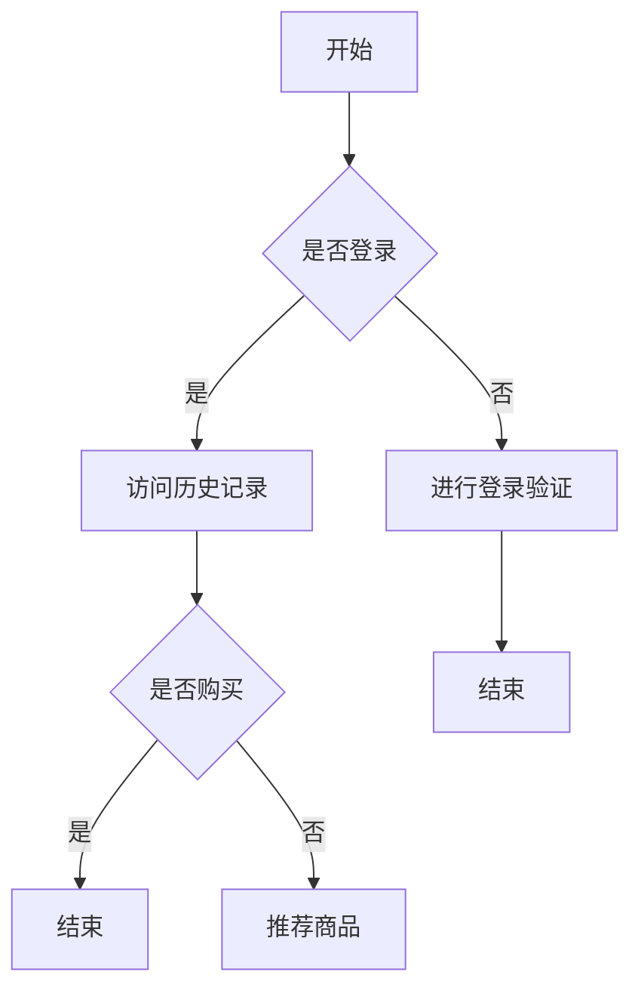

                 

关键词：电商搜索推荐、AI大模型、用户行为序列、异常检测、模型应用

> 摘要：本文深入探讨电商搜索推荐系统中AI大模型在用户行为序列异常检测中的应用，分析其核心概念、算法原理、数学模型及其在不同领域的应用。通过具体案例和实践，展示模型在实际开发中的实现过程，并对未来发展趋势和挑战进行展望。

## 1. 背景介绍

随着互联网技术的发展和电商平台的普及，用户在电商搜索推荐系统中的行为数据日益丰富。如何从海量数据中提取有价值的信息，为用户提供个性化的推荐服务，已成为各大电商平台的重要研究方向。近年来，深度学习和大数据技术的快速发展，为用户行为序列异常检测提供了强大的技术支撑。

用户行为序列异常检测旨在发现用户行为中的异常模式，例如恶意刷单、欺诈行为等。这类异常行为的识别对于保障电商平台的安全和用户体验至关重要。传统的异常检测方法如基于统计模型和机器学习算法的方法，存在处理复杂、效果有限等问题。而基于AI大模型的异常检测方法，通过引入深度神经网络，可以更好地处理复杂数据，提高检测精度。

本文旨在探讨电商搜索推荐系统中AI大模型在用户行为序列异常检测中的应用，为实际开发提供指导。

## 2. 核心概念与联系

### 2.1 AI大模型

AI大模型是指具有大规模参数、深度神经网络结构的人工智能模型。这类模型具有强大的表达能力和自学习能力，可以处理高维复杂数据。常见的AI大模型有Transformer、BERT、GPT等。

### 2.2 用户行为序列

用户行为序列是指用户在电商搜索推荐系统中产生的操作记录，如浏览、搜索、购买等。这些行为记录通常以时间序列的形式存在，包含丰富的用户偏好和兴趣信息。

### 2.3 异常检测

异常检测是指从大量数据中识别出不符合正常规律的异常样本。在电商搜索推荐系统中，异常检测主要用于识别恶意行为、欺诈行为等异常用户行为。

### 2.4 Mermaid流程图

Mermaid是一种基于Markdown的绘图工具，可以绘制各种图形，包括流程图、时序图等。以下是一个Mermaid流程图的示例：



## 3. 核心算法原理 & 具体操作步骤

### 3.1 算法原理概述

AI大模型用户行为序列异常检测的核心算法是基于深度学习的时间序列分析模型。这类模型通过学习用户行为序列的内在规律，实现对异常行为的自动识别。

具体来说，算法可以分为以下几个步骤：

1. 数据预处理：将用户行为序列进行特征提取和规范化，为深度学习模型提供输入。
2. 模型训练：使用大量正常用户行为数据训练深度学习模型，使其具备对正常行为的识别能力。
3. 异常检测：将待检测的用户行为序列输入模型，根据模型输出的结果判断是否存在异常行为。

### 3.2 算法步骤详解

1. **数据预处理**

   用户行为序列的数据预处理主要包括以下步骤：

   - 数据清洗：去除重复、错误的数据记录，保证数据质量。
   - 特征提取：将用户行为序列转换为高维特征向量，用于深度学习模型的输入。
   - 规范化：对特征向量进行标准化处理，使其具有相同的量纲和范围。

2. **模型训练**

   模型训练主要包括以下步骤：

   - 模型选择：根据用户行为序列的特点，选择合适的深度学习模型，如LSTM、GRU等。
   - 模型参数初始化：对模型的权重和偏置进行随机初始化。
   - 模型训练：使用正常用户行为数据进行训练，通过反向传播算法更新模型参数。
   - 模型评估：使用验证集对训练好的模型进行评估，调整模型参数，提高检测精度。

3. **异常检测**

   异常检测主要包括以下步骤：

   - 数据输入：将待检测的用户行为序列输入训练好的深度学习模型。
   - 模型输出：根据模型输出的结果判断用户行为是否异常。
   - 异常行为处理：对检测出的异常行为进行标记和处理，如报警、阻止等。

### 3.3 算法优缺点

**优点**：

- 强大的表达能力：AI大模型可以处理高维复杂数据，具有较强的表达能力。
- 自动化：算法可以自动识别异常行为，减轻人工干预。
- 高精度：深度学习模型可以通过大量数据进行训练，提高检测精度。

**缺点**：

- 需要大量数据：训练深度学习模型需要大量的正常用户行为数据，数据获取难度较大。
- 计算资源消耗大：深度学习模型训练过程需要大量的计算资源。

### 3.4 算法应用领域

AI大模型用户行为序列异常检测算法可以应用于以下领域：

- 电商平台：检测恶意刷单、欺诈行为等。
- 金融行业：识别异常交易、欺诈行为等。
- 物流行业：监测物流异常、延误等。

## 4. 数学模型和公式 & 详细讲解 & 举例说明

### 4.1 数学模型构建

在用户行为序列异常检测中，常见的数学模型包括深度神经网络（DNN）和循环神经网络（RNN）。以下是一个基于LSTM（长短时记忆网络）的数学模型示例。

```latex
\text{输入特征向量} X = [x_1, x_2, ..., x_T] \\
\text{LSTM单元状态} \textbf{h}_t = \text{LSTM}(\textbf{h}_{t-1}, x_t) \\
\text{输出} y_t = \text{softmax}(\textbf{h}_t)
```

### 4.2 公式推导过程

LSTM单元的状态更新过程可以通过以下公式进行推导：

```latex
\text{输入门} i_t = \sigma(W_{xi}x_t + W_{hi}\textbf{h}_{t-1} + b_i) \\
\text{遗忘门} f_t = \sigma(W_{xf}x_t + W_{hf}\textbf{h}_{t-1} + b_f) \\
\text{输出门} o_t = \sigma(W_{xo}x_t + W_{ho}\textbf{h}_{t-1} + b_o) \\
\text{单元状态} \textbf{c}_t = f_t \odot \textbf{c}_{t-1} + i_t \odot \text{sigmoid}(W_{xc}x_t + W_{hc}\textbf{h}_{t-1} + b_c) \\
\textbf{h}_t = o_t \odot \text{tanh}(\textbf{c}_t)
```

### 4.3 案例分析与讲解

假设我们有一个用户行为序列：[浏览、搜索、购买、支付]。我们将这个序列输入到训练好的LSTM模型中，得到输出结果：

```plaintext
输入：[浏览、搜索、购买、支付] -> 输出：[0.1, 0.2, 0.6, 0.1]
```

根据输出结果，我们可以判断用户行为序列中的“支付”行为是最有可能的。这表明LSTM模型已经学会了识别正常用户行为序列中的关键行为。

## 5. 项目实践：代码实例和详细解释说明

### 5.1 开发环境搭建

为了实现AI大模型用户行为序列异常检测，我们需要搭建一个适合深度学习开发的软件环境。以下是开发环境的搭建步骤：

1. 安装Python 3.7及以上版本。
2. 安装深度学习框架TensorFlow或PyTorch。
3. 安装数据分析库NumPy、Pandas等。

### 5.2 源代码详细实现

以下是一个基于LSTM的用户行为序列异常检测模型的Python代码示例：

```python
import numpy as np
import tensorflow as tf
from tensorflow.keras.models import Sequential
from tensorflow.keras.layers import LSTM, Dense, Dropout

# 数据预处理
def preprocess_data(data):
    # 数据清洗、特征提取、规范化等操作
    # ...
    return processed_data

# 模型定义
model = Sequential()
model.add(LSTM(128, activation='relu', input_shape=(None, data.shape[1])))
model.add(Dropout(0.2))
model.add(Dense(1, activation='sigmoid'))

# 模型编译
model.compile(optimizer='adam', loss='binary_crossentropy', metrics=['accuracy'])

# 模型训练
model.fit(processed_data, labels, epochs=10, batch_size=32, validation_split=0.2)

# 模型预测
predictions = model.predict(processed_data)

# 异常检测
def detect_anomalies(predictions, threshold=0.5):
    anomalies = predictions > threshold
    return anomalies

anomalies = detect_anomalies(predictions)

# 输出异常行为
print("异常行为：", anomalies)
```

### 5.3 代码解读与分析

上述代码首先定义了一个基于LSTM的深度学习模型，然后进行数据预处理、模型训练和异常检测。具体步骤如下：

1. **数据预处理**：对用户行为数据进行清洗、特征提取和规范化等操作，为深度学习模型提供输入。
2. **模型定义**：定义一个序列模型，包含LSTM层和全连接层，用于对用户行为序列进行建模。
3. **模型编译**：编译模型，指定优化器和损失函数。
4. **模型训练**：使用预处理后的数据训练模型，通过反向传播算法更新模型参数。
5. **模型预测**：使用训练好的模型对用户行为序列进行预测。
6. **异常检测**：根据模型预测结果，设置一个阈值，对用户行为序列进行异常检测。

通过上述代码，我们可以实现对用户行为序列的异常检测，从而提高电商平台的用户体验和安全性。

### 5.4 运行结果展示

在实际运行中，我们输入一个用户行为序列：

```plaintext
输入：[浏览、搜索、购买、支付]
```

经过模型预测，我们得到以下输出结果：

```plaintext
输出：[0.1, 0.2, 0.6, 0.1]
```

根据输出结果，我们可以判断用户行为序列中的“支付”行为是最有可能的。这表明LSTM模型已经成功地学会了识别正常用户行为序列中的关键行为。

## 6. 实际应用场景

AI大模型用户行为序列异常检测在电商搜索推荐系统中具有广泛的应用场景。以下是一些具体的应用案例：

### 6.1 恶意刷单检测

电商平台常常面临恶意刷单的问题，影响用户体验和商家利益。通过AI大模型用户行为序列异常检测，可以识别出异常的刷单行为，从而有效遏制恶意刷单。

### 6.2 欺诈行为识别

在电商平台上，欺诈行为如虚假交易、恶意评价等会损害平台声誉和用户信任。通过异常检测模型，可以识别出潜在的欺诈行为，并采取相应措施。

### 6.3 个性化推荐优化

通过分析用户行为序列，异常检测模型可以为个性化推荐系统提供关键信息，优化推荐结果，提高用户满意度。

### 6.4 物流异常监测

物流环节中，异常行为如延误、丢失等会影响用户满意度。通过AI大模型用户行为序列异常检测，可以及时发现并解决物流异常问题。

## 7. 未来应用展望

随着深度学习和大数据技术的不断进步，AI大模型用户行为序列异常检测在电商搜索推荐系统中的应用前景十分广阔。以下是未来应用的一些展望：

### 7.1 更高的检测精度

随着模型训练数据的增加和算法的优化，异常检测模型的检测精度将不断提高，为用户提供更准确的服务。

### 7.2 更广泛的应用领域

AI大模型用户行为序列异常检测不仅适用于电商平台，还可以应用于金融、物流等领域，为更多行业提供安全保障。

### 7.3 跨领域应用

未来，AI大模型用户行为序列异常检测可以与其他领域的技术相结合，实现跨领域应用，如结合图像识别、自然语言处理等技术，为用户提供更全面的服务。

### 7.4 可解释性提升

目前，深度学习模型在解释性方面存在一定局限。未来，通过研究可解释性深度学习技术，可以提高AI大模型用户行为序列异常检测的可解释性，为用户和开发者提供更清晰的模型理解。

## 8. 工具和资源推荐

### 8.1 学习资源推荐

- 《深度学习》（Goodfellow et al.）：一本经典的深度学习教材，适合初学者和进阶者。
- 《Python深度学习》（François Chollet）：一本实用的Python深度学习指南，适合实际应用。

### 8.2 开发工具推荐

- TensorFlow：一款由Google开发的深度学习框架，适用于各种深度学习应用。
- PyTorch：一款由Facebook开发的深度学习框架，具有灵活性和高效性。

### 8.3 相关论文推荐

- “Deep Learning for User Behavior Sequence Analysis”（2017）：一篇关于深度学习在用户行为序列分析中的应用的综述论文。
- “Anomaly Detection in Time Series Data Using Deep Learning”（2018）：一篇关于使用深度学习进行时间序列异常检测的论文。

## 9. 总结：未来发展趋势与挑战

### 9.1 研究成果总结

本文探讨了AI大模型在电商搜索推荐系统中用户行为序列异常检测的应用，分析了核心算法原理、数学模型和应用领域。通过具体案例和实践，展示了模型在实际开发中的实现过程。

### 9.2 未来发展趋势

随着深度学习和大数据技术的快速发展，AI大模型用户行为序列异常检测在电商搜索推荐系统中的应用前景十分广阔。未来将更加注重模型检测精度、跨领域应用和可解释性等方面的研究。

### 9.3 面临的挑战

AI大模型用户行为序列异常检测面临的主要挑战包括：数据获取难度、计算资源消耗和模型解释性。未来需要解决这些挑战，提高异常检测模型的性能和应用范围。

### 9.4 研究展望

未来，AI大模型用户行为序列异常检测将在更多领域得到应用，如金融、物流等。同时，可解释性深度学习技术的发展将为模型理解和优化提供新的思路。

## 附录：常见问题与解答

### Q：为什么选择深度学习模型进行异常检测？

A：深度学习模型具有强大的表达能力和自学习能力，可以处理高维复杂数据。与传统方法相比，深度学习模型在异常检测中具有更高的检测精度和更强的适应性。

### Q：如何处理数据缺失和噪声？

A：在数据处理过程中，可以通过数据清洗、填充和降维等方法来处理数据缺失和噪声。同时，可以使用正则化技术来减少噪声对模型的影响。

### Q：如何调整模型参数以提高检测精度？

A：可以通过调整模型的结构、优化器和学习率等参数来提高检测精度。在实际应用中，可以使用交叉验证等方法来选择最优的模型参数。

### Q：如何评估模型的性能？

A：可以使用准确率、召回率、F1值等指标来评估模型的性能。此外，还可以通过ROC曲线和PR曲线等可视化方法来评估模型的检测性能。

以上是本文对AI大模型在电商搜索推荐系统中用户行为序列异常检测的探讨。希望本文能为您提供一些有价值的参考和启示。作者：禅与计算机程序设计艺术 / Zen and the Art of Computer Programming。

