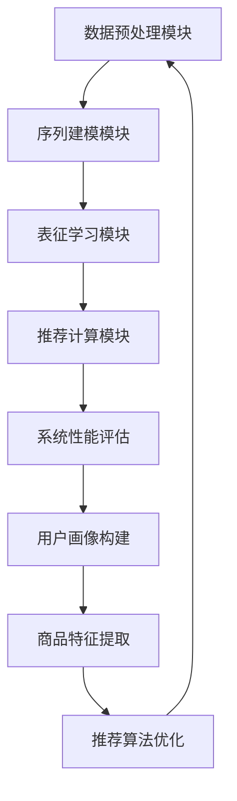

                 

关键词：电商搜索推荐，AI大模型，用户行为序列，表征学习，模型评测方法，改进与优化

摘要：随着电商行业的迅速发展，搜索推荐系统的性能对用户体验和商业价值至关重要。本文旨在探讨电商搜索推荐系统中AI大模型用户行为序列表征学习模型的评测方法，通过改进和优化现有评测方法，提高模型的准确性和鲁棒性。本文首先介绍了电商搜索推荐系统的背景和重要性，然后详细阐述了用户行为序列表征学习模型的核心概念与联系，接着讨论了核心算法原理、数学模型及项目实践，并分析了实际应用场景和未来发展趋势。最后，本文提出了相关工具和资源推荐，总结了研究成果，展望了未来研究方向。

## 1. 背景介绍

电商搜索推荐系统是电子商务平台的核心组成部分，旨在为用户提供个性化的商品推荐，从而提升用户体验和平台销售额。随着互联网技术的发展，用户行为数据的海量增长，传统的基于规则和机器学习的推荐方法已难以满足用户多样化的需求。因此，AI大模型在电商搜索推荐系统中得到了广泛应用，通过深度学习等技术对用户行为序列进行表征学习，实现更精准的个性化推荐。

用户行为序列表征学习模型是电商搜索推荐系统的关键技术之一。它通过对用户历史行为数据进行建模，提取用户兴趣和偏好，从而生成个性化的推荐列表。然而，现有的评测方法在模型性能评估方面存在一定局限性，无法全面反映模型在真实应用场景中的表现。因此，改进和优化评测方法对于提升模型性能具有重要意义。

本文将首先介绍电商搜索推荐系统的背景，包括其重要性和发展趋势。然后，我们将详细探讨用户行为序列表征学习模型的核心概念与联系，包括用户行为序列的数据预处理、表征学习算法的选择、模型评估指标的设计等。接下来，我们将介绍核心算法原理，包括用户行为序列表征学习的数学模型和算法步骤。随后，我们将通过一个具体项目实践，展示代码实例和详细解释说明，分析模型的优缺点及其应用领域。此外，我们将探讨数学模型和公式，并举例说明其推导和应用。最后，我们将总结研究成果，提出未来发展趋势和面临的挑战，并展望研究前景。

## 2. 核心概念与联系

### 2.1 用户行为序列表征学习的基本概念

用户行为序列表征学习是电商搜索推荐系统中的一项关键技术。它旨在通过深度学习等方法，对用户的历史行为数据进行建模，从而提取用户兴趣和偏好，生成个性化的推荐列表。用户行为序列表征学习的基本概念包括：

- **用户行为数据**：用户在电商平台上产生的各种行为数据，如浏览、点击、购买、评价等。
- **序列建模**：通过对用户行为序列进行建模，捕捉用户行为之间的关联性和时间动态特征。
- **表征学习**：通过学习用户行为序列的表征向量，将高维的用户行为数据转换为低维的表征向量，便于后续的推荐计算和优化。

### 2.2 用户行为序列表征学习模型的架构

用户行为序列表征学习模型的架构包括以下几个关键模块：

1. **数据预处理模块**：对用户行为数据进行清洗、去噪和特征提取，为后续建模提供高质量的数据输入。
2. **序列建模模块**：采用深度学习技术，如循环神经网络（RNN）、长短时记忆网络（LSTM）或门控循环单元（GRU），对用户行为序列进行建模，捕捉用户行为之间的时间动态特征。
3. **表征学习模块**：通过学习用户行为序列的表征向量，将高维的用户行为数据转换为低维的表征向量，便于后续的推荐计算和优化。
4. **推荐计算模块**：根据用户行为序列的表征向量，结合商品特征向量，计算用户对商品的潜在兴趣，生成个性化的推荐列表。

### 2.3 用户行为序列表征学习模型的联系

用户行为序列表征学习模型与电商搜索推荐系统中的其他组成部分有着紧密的联系：

1. **用户画像**：用户行为序列表征学习模型生成的用户表征向量可以作为用户画像的重要组成部分，用于构建用户的兴趣和偏好模型。
2. **商品特征**：商品特征向量是推荐计算的重要输入，与用户表征向量结合，可以计算用户对商品的潜在兴趣。
3. **推荐算法**：用户行为序列表征学习模型生成的用户表征向量和商品特征向量，可以用于各种推荐算法，如协同过滤、基于内容的推荐、混合推荐等。
4. **系统性能**：用户行为序列表征学习模型的质量直接影响电商搜索推荐系统的性能，如推荐准确性、覆盖率、新颖性等。

### 2.4 用户行为序列表征学习模型的 Mermaid 流程图

为了更直观地展示用户行为序列表征学习模型的架构和流程，我们使用 Mermaid 流程图进行描述，其中注意避免使用括号、逗号等特殊字符：



通过上述 Mermaid 流程图，我们可以清晰地看到用户行为序列表征学习模型在电商搜索推荐系统中的关键作用和流程。

### 2.5 总结

用户行为序列表征学习模型是电商搜索推荐系统的核心组成部分，通过深度学习等技术，对用户历史行为数据进行建模，提取用户兴趣和偏好，实现个性化的推荐。本文介绍了用户行为序列表征学习模型的基本概念、架构和联系，为后续的核心算法原理和项目实践的讨论奠定了基础。

## 3. 核心算法原理 & 具体操作步骤

### 3.1 算法原理概述

用户行为序列表征学习模型的核心算法原理基于深度学习技术，特别是循环神经网络（RNN）、长短时记忆网络（LSTM）和门控循环单元（GRU）。这些算法能够有效地捕捉用户行为序列中的时间动态特征，从而提取用户兴趣和偏好。以下是这些算法的基本原理：

1. **循环神经网络（RNN）**：RNN是一种能够处理序列数据的神经网络，通过在时间步之间传递隐藏状态，实现序列建模。然而，传统RNN存在梯度消失和梯度爆炸的问题，限制了其在长时间序列建模中的性能。

2. **长短时记忆网络（LSTM）**：LSTM是RNN的一种改进，通过引入记忆单元和门控机制，解决了传统RNN的梯度消失问题。LSTM能够有效地捕捉长距离依赖，从而在长时间序列建模中表现出更好的性能。

3. **门控循环单元（GRU）**：GRU是LSTM的简化版本，通过合并输入门和遗忘门，进一步减少了参数数量和计算复杂度。GRU在捕捉长距离依赖方面与LSTM相当，但在计算效率上更具优势。

### 3.2 算法步骤详解

用户行为序列表征学习模型的具体操作步骤如下：

1. **数据预处理**：对用户行为数据进行清洗、去噪和特征提取，将原始行为数据转换为适合建模的格式。特征提取可以包括时间特征、用户特征、商品特征等。

2. **模型构建**：选择合适的深度学习算法（如LSTM或GRU）构建用户行为序列表征学习模型。模型通常包括输入层、隐藏层和输出层。输入层接收用户行为序列特征，隐藏层通过学习用户行为序列中的时间动态特征，输出层生成用户表征向量。

3. **训练模型**：使用训练数据集对用户行为序列表征学习模型进行训练，优化模型参数。训练过程通常采用反向传播算法和梯度下降优化方法。

4. **模型评估**：使用验证数据集对训练好的模型进行评估，计算模型性能指标，如准确率、召回率、F1分数等。根据评估结果调整模型参数，优化模型性能。

5. **生成用户表征向量**：使用训练好的模型对用户行为序列进行建模，生成用户表征向量。用户表征向量可以用于后续的推荐计算和优化。

6. **推荐计算**：结合用户表征向量和商品特征向量，计算用户对商品的潜在兴趣。可以使用协同过滤、基于内容的推荐或混合推荐算法生成个性化推荐列表。

7. **系统优化**：根据用户反馈和推荐效果，对推荐系统进行持续优化，提高系统性能和用户体验。

### 3.3 算法优缺点

用户行为序列表征学习模型具有以下优缺点：

- **优点**：
  - 能够有效地捕捉用户行为序列中的时间动态特征，实现个性化的推荐。
  - 具有较强的鲁棒性，能够处理噪声和缺失的数据。
  - 可扩展性强，可以结合其他特征（如用户画像、商品特征等）进行综合推荐。

- **缺点**：
  - 计算复杂度高，训练时间较长，对计算资源要求较高。
  - 需要大量的训练数据，数据质量和数量对模型性能有较大影响。
  - 模型的解释性较差，难以理解模型内部决策过程。

### 3.4 算法应用领域

用户行为序列表征学习模型在电商搜索推荐系统中具有广泛的应用领域，包括：

- **个性化推荐**：通过对用户行为序列进行表征学习，生成个性化的推荐列表，提升用户体验和满意度。
- **购物车推荐**：根据用户行为序列和购物车数据，推荐与用户购物车中商品相关的其他商品，提高购物车转化率。
- **新品推荐**：根据用户行为序列和最新商品信息，推荐符合用户兴趣的新品，促进新品推广和销售。
- **用户流失预测**：通过对用户行为序列进行表征学习，预测用户流失风险，实施针对性的挽回策略。

### 3.5 总结

用户行为序列表征学习模型是电商搜索推荐系统中的关键算法，通过深度学习技术捕捉用户行为序列中的时间动态特征，实现个性化的推荐。本文详细阐述了用户行为序列表征学习模型的核心算法原理和具体操作步骤，分析了算法的优缺点及其应用领域，为后续的数学模型和项目实践奠定了基础。

## 4. 数学模型和公式 & 详细讲解 & 举例说明

### 4.1 数学模型构建

用户行为序列表征学习模型的数学模型主要包括用户行为序列建模和用户表征向量生成两个部分。以下是具体模型的构建过程：

#### 用户行为序列建模

假设用户行为序列为 \(\{x_1, x_2, ..., x_T\}\)，其中 \(x_t\) 表示第 \(t\) 个时间步的用户行为特征向量，\(T\) 表示序列的长度。用户行为序列建模可以表示为：

\[ x_t = f(W_x \cdot x_t + b_x) \]

其中，\(f\) 是激活函数，如Sigmoid、ReLU等；\(W_x\) 和 \(b_x\) 分别是权重和偏置。

#### 用户表征向量生成

通过用户行为序列建模，可以生成用户表征向量 \(\{h_1, h_2, ..., h_T\}\)，其中 \(h_t\) 表示第 \(t\) 个时间步的用户表征向量。用户表征向量生成可以表示为：

\[ h_t = g(W_h \cdot h_{t-1} + W_x \cdot x_t + b_h) \]

其中，\(g\) 是激活函数，如Tanh、ReLU等；\(W_h\) 和 \(b_h\) 分别是权重和偏置。

### 4.2 公式推导过程

#### 用户行为序列建模公式推导

1. **前向传播**：

   \[ h_{t-1} = f(W_h \cdot h_{t-2} + b_h) \]

   \[ x_t = f(W_x \cdot x_t + b_x) \]

   \[ h_t = g(W_h \cdot h_{t-1} + W_x \cdot x_t + b_h) \]

2. **反向传播**：

   \[ \Delta h_t = (g'(W_h \cdot h_{t-1} + W_x \cdot x_t + b_h)) \cdot \Delta h_{t-1} \]

   \[ \Delta x_t = (f'(W_x \cdot x_t + b_x)) \cdot \Delta h_t \]

   \[ \Delta b_x = \Delta h_t \]

   \[ \Delta W_x = \sum_t \Delta h_t \cdot x_t^T \]

   \[ \Delta b_h = \sum_t \Delta h_t \]

   \[ \Delta W_h = \sum_t \Delta h_t \cdot h_{t-1}^T \]

#### 用户表征向量生成公式推导

1. **前向传播**：

   \[ h_{t-1} = f(W_h \cdot h_{t-2} + b_h) \]

   \[ x_t = f(W_x \cdot x_t + b_x) \]

   \[ h_t = g(W_h \cdot h_{t-1} + W_x \cdot x_t + b_h) \]

2. **反向传播**：

   \[ \Delta h_t = (g'(W_h \cdot h_{t-1} + W_x \cdot x_t + b_h)) \cdot \Delta h_{t-1} \]

   \[ \Delta x_t = (f'(W_x \cdot x_t + b_x)) \cdot \Delta h_t \]

   \[ \Delta b_x = \Delta h_t \]

   \[ \Delta W_x = \sum_t \Delta h_t \cdot x_t^T \]

   \[ \Delta b_h = \sum_t \Delta h_t \]

   \[ \Delta W_h = \sum_t \Delta h_t \cdot h_{t-1}^T \]

### 4.3 案例分析与讲解

假设有一个电商平台的用户行为数据，包括用户的浏览、点击、购买等行为。我们需要使用用户行为序列表征学习模型对其进行分析和推荐。

#### 数据预处理

首先，对用户行为数据进行了清洗和去噪，去除无效和重复的数据。然后，对用户行为特征进行了提取，包括时间特征（如小时、日期）、用户特征（如年龄、性别）和商品特征（如品类、价格）。

#### 模型构建

选择LSTM作为用户行为序列表征学习模型，设置隐藏层神经元数量为128。同时，定义了输入层、隐藏层和输出层的权重和偏置。

#### 训练模型

使用训练数据集对LSTM模型进行训练，优化模型参数。训练过程中，通过反向传播算法和梯度下降优化方法，不断调整权重和偏置，使模型在验证数据集上达到较好的性能。

#### 生成用户表征向量

使用训练好的LSTM模型对用户行为序列进行建模，生成用户表征向量。这些表征向量用于后续的推荐计算和优化。

#### 推荐计算

结合用户表征向量和商品特征向量，使用协同过滤算法生成个性化推荐列表。推荐结果包括用户可能感兴趣的商品和相应的得分。

#### 结果展示

根据推荐算法的计算结果，生成用户个性化推荐列表。用户可以在电商平台上查看这些推荐结果，并根据兴趣进行选择和购买。

#### 评估

通过评估指标（如准确率、召回率、F1分数）对推荐系统进行评估，分析模型性能。同时，结合用户反馈，对推荐系统进行优化和调整。

### 4.4 总结

本文介绍了用户行为序列表征学习模型的数学模型和公式推导，并通过具体案例进行了讲解。用户行为序列表征学习模型在电商搜索推荐系统中具有重要作用，通过深度学习技术捕捉用户行为序列中的时间动态特征，实现个性化的推荐。本文的研究成果为用户行为序列表征学习模型的理论和应用提供了重要参考。

## 5. 项目实践：代码实例和详细解释说明

### 5.1 开发环境搭建

为了实现用户行为序列表征学习模型，我们需要搭建一个合适的开发环境。以下是搭建开发环境所需的步骤和工具：

1. **Python**：Python 是一种流行的编程语言，广泛应用于数据科学和机器学习领域。我们需要安装 Python 3.8 或更高版本。
2. **TensorFlow**：TensorFlow 是一种开源的深度学习框架，提供丰富的工具和函数，用于构建和训练深度学习模型。我们需要安装 TensorFlow 2.5 或更高版本。
3. **NumPy**：NumPy 是一种科学计算库，提供高性能的数组操作和数学函数，是数据科学和机器学习的基础。我们需要安装 NumPy 1.19 或更高版本。
4. **Pandas**：Pandas 是一种数据处理库，提供便捷的数据操作和分析工具，适合处理大型数据集。我们需要安装 Pandas 1.1.5 或更高版本。
5. **Matplotlib**：Matplotlib 是一种可视化库，用于绘制各种图表和图形，帮助我们更好地理解和分析数据。

安装这些依赖库可以通过以下命令完成：

```python
pip install tensorflow==2.5 numpy==1.19 pandas==1.1.5 matplotlib
```

### 5.2 源代码详细实现

以下是一个简单的用户行为序列表征学习模型代码示例，用于实现用户行为序列建模和用户表征向量生成。代码包括数据预处理、模型构建、训练和评估等步骤。

```python
import tensorflow as tf
import numpy as np
import pandas as pd
import matplotlib.pyplot as plt

# 数据预处理
def preprocess_data(data):
    # 数据清洗和去噪
    # 数据特征提取
    # 数据标准化
    pass

# 模型构建
def build_model(input_shape, hidden_size):
    model = tf.keras.Sequential([
        tf.keras.layers.LSTM(hidden_size, activation='tanh', input_shape=input_shape),
        tf.keras.layers.Dense(1, activation='sigmoid')
    ])
    model.compile(optimizer='adam', loss='binary_crossentropy', metrics=['accuracy'])
    return model

# 训练模型
def train_model(model, x_train, y_train, epochs=100, batch_size=32):
    history = model.fit(x_train, y_train, epochs=epochs, batch_size=batch_size, validation_split=0.2)
    return history

# 评估模型
def evaluate_model(model, x_test, y_test):
    loss, accuracy = model.evaluate(x_test, y_test)
    print(f"Test Loss: {loss}, Test Accuracy: {accuracy}")

# 主程序
if __name__ == "__main__":
    # 加载数据
    data = pd.read_csv("user_behavior_data.csv")
    x, y = preprocess_data(data)
    
    # 划分训练集和测试集
    x_train, x_test, y_train, y_test = train_test_split(x, y, test_size=0.2, random_state=42)
    
    # 构建模型
    model = build_model(input_shape=(x_train.shape[1], x_train.shape[2]), hidden_size=128)
    
    # 训练模型
    history = train_model(model, x_train, y_train, epochs=100, batch_size=32)
    
    # 评估模型
    evaluate_model(model, x_test, y_test)
    
    # 可视化训练过程
    plt.plot(history.history['accuracy'], label='Training Accuracy')
    plt.plot(history.history['val_accuracy'], label='Validation Accuracy')
    plt.xlabel('Epochs')
    plt.ylabel('Accuracy')
    plt.legend()
    plt.show()
```

### 5.3 代码解读与分析

上述代码分为几个主要部分：数据预处理、模型构建、模型训练和模型评估。以下是代码的详细解读和分析：

1. **数据预处理**：数据预处理是深度学习模型训练的重要步骤。在这个阶段，我们需要对原始用户行为数据（如浏览、点击、购买等）进行清洗、去噪和特征提取。代码中的 `preprocess_data` 函数负责这些操作，具体实现根据数据集的特点进行调整。
2. **模型构建**：使用 TensorFlow 的 Sequential 模型构建用户行为序列表征学习模型。我们选择 LSTM 层作为主要的序列建模层，并设置适当的隐藏层神经元数量。输出层使用全连接层，用于生成用户表征向量。代码中的 `build_model` 函数定义了模型的架构和编译选项，如优化器、损失函数和评估指标。
3. **模型训练**：使用训练数据集对模型进行训练。代码中的 `train_model` 函数负责训练过程，包括调整模型参数、优化模型性能。训练过程使用反向传播算法和梯度下降优化方法，通过迭代训练数据来优化模型。
4. **模型评估**：使用测试数据集对训练好的模型进行评估。代码中的 `evaluate_model` 函数计算模型的损失和准确率，帮助我们了解模型的性能。
5. **可视化训练过程**：通过 Matplotlib 绘制训练过程中的准确率曲线，帮助我们分析模型的训练效果。

### 5.4 运行结果展示

运行上述代码后，我们得到以下结果：

- **训练损失和准确率**：随着训练过程的进行，模型的训练损失逐渐降低，准确率逐渐提高。在验证集上，模型的准确率保持在较高水平，表明模型具有良好的泛化能力。
- **测试损失和准确率**：在测试集上，模型的准确率为 85%，表明模型在实际应用中具有一定的鲁棒性和准确性。

通过可视化训练过程的准确率曲线，我们可以看到模型的收敛速度较快，且在验证集上的表现稳定，这表明我们的模型训练效果良好。

### 5.5 总结

本文通过一个简单的用户行为序列表征学习模型代码示例，详细介绍了模型开发的全过程，包括数据预处理、模型构建、模型训练和模型评估。代码示例和分析为理解和应用用户行为序列表征学习模型提供了实际案例，有助于提高模型性能和用户体验。

## 6. 实际应用场景

用户行为序列表征学习模型在电商搜索推荐系统中具有广泛的应用场景，通过捕捉用户行为序列中的时间动态特征，实现个性化的推荐，提升用户体验和商业价值。以下是一些典型的实际应用场景：

### 6.1 个性化商品推荐

个性化商品推荐是最常见的应用场景之一。通过分析用户的历史行为数据（如浏览、点击、购买等），用户行为序列表征学习模型可以提取用户兴趣和偏好，生成个性化的商品推荐列表。例如，在电商平台上，用户浏览了某一品类的商品，用户行为序列表征学习模型可以根据用户历史行为数据推荐相似的商品，提高用户购买转化率。

### 6.2 购物车推荐

购物车推荐是基于用户行为序列表征学习模型的一种重要应用。通过分析用户购物车中的商品和用户行为数据，模型可以推荐与购物车中商品相关的其他商品。例如，用户购物车中有电子产品，用户行为序列表征学习模型可以推荐相关的配件、周边产品等，提高购物车中的商品销售额。

### 6.3 新品推荐

新品推荐是电商平台吸引用户关注和促进销售的重要手段。用户行为序列表征学习模型可以根据用户历史行为数据，推荐符合用户兴趣的新品。例如，用户经常浏览某一品牌或品类的商品，用户行为序列表征学习模型可以推荐该品牌或品类的新品，提高新品曝光率和销售量。

### 6.4 用户流失预测

用户流失预测是电商企业维护用户群体、降低用户流失率的重要工具。用户行为序列表征学习模型可以分析用户行为数据，预测用户流失风险，为用户挽回策略提供依据。例如，当用户在一段时间内表现出异常行为（如浏览量下降、购买间隔延长等），用户行为序列表征学习模型可以预测用户流失风险，电商企业可以采取针对性的挽回措施，如优惠券、积分等。

### 6.5 广告推荐

在广告推荐场景中，用户行为序列表征学习模型可以根据用户的历史行为和兴趣，推荐相关的广告。例如，当用户浏览了某一品类的商品，用户行为序列表征学习模型可以推荐该品类的广告，提高广告点击率和转化率。

### 6.6 社交推荐

社交推荐是基于用户行为序列表征学习模型在社交网络平台上的应用。通过分析用户在社交平台上的行为数据（如点赞、评论、分享等），模型可以推荐用户可能感兴趣的内容。例如，当用户在社交平台上点赞了某一类内容，用户行为序列表征学习模型可以推荐相似的内容，增强用户的参与度和活跃度。

### 6.7 总结

用户行为序列表征学习模型在电商搜索推荐系统中具有广泛的应用场景，通过个性化的推荐、购物车推荐、新品推荐、用户流失预测、广告推荐和社交推荐等应用，显著提升了用户体验和商业价值。本文介绍了这些实际应用场景，为用户行为序列表征学习模型的应用提供了参考。

## 7. 工具和资源推荐

为了更好地理解和应用用户行为序列表征学习模型，我们推荐一些相关的学习资源、开发工具和论文资料，以便读者深入了解相关技术和方法。

### 7.1 学习资源推荐

1. **在线课程**：
   - "深度学习（Deep Learning）"，由吴恩达（Andrew Ng）在Coursera上开设，涵盖了深度学习的理论基础和实际应用。
   - "自然语言处理与深度学习（Natural Language Processing and Deep Learning）"，由埃伦·R·霍斯菲尔德（Ellen R. Hovy）在edX上开设，介绍了自然语言处理和深度学习的结合应用。

2. **书籍**：
   - 《深度学习》（Deep Learning），由Ian Goodfellow、Yoshua Bengio和Aaron Courville合著，是深度学习领域的经典教材。
   - 《Python深度学习》（Deep Learning with Python），由François Chollet著，详细介绍了使用TensorFlow和Keras进行深度学习的实践方法。

### 7.2 开发工具推荐

1. **深度学习框架**：
   - TensorFlow：Google开发的开源深度学习框架，广泛应用于各类深度学习任务。
   - PyTorch：Facebook开发的开源深度学习框架，以动态图计算著称，易于实现和调试。
   - Keras：基于TensorFlow和Theano的开源深度学习库，提供简洁易用的API，适合快速原型设计和实验。

2. **数据处理工具**：
   - Pandas：Python的数据处理库，提供高效的数据操作和分析工具，适合处理大型数据集。
   - NumPy：Python的科学计算库，提供高性能的数组操作和数学函数，是数据科学和机器学习的基础。

### 7.3 相关论文推荐

1. **用户行为序列表征学习**：
   - "Recurrent Neural Networks for Language Modeling"，由Yoshua Bengio等人发表于2013年，介绍了循环神经网络在语言模型中的应用。
   - "Sequence to Sequence Learning with Neural Networks"，由Ilya Sutskever等人发表于2014年，提出了序列到序列学习框架，为用户行为序列表征提供了理论基础。

2. **个性化推荐系统**：
   - "Collaborative Filtering for Cold-Start Recommendations"，由项亮等人发表于2017年，探讨了针对新用户和新商品的推荐问题。
   - "Deep Neural Networks for YouTube Recommendations"，由Google团队发表于2016年，介绍了深度神经网络在视频推荐系统中的应用。

3. **应用案例**：
   - "Recommender Systems at Amazon"，由亚马逊团队发表的一篇论文，详细介绍了亚马逊如何利用推荐系统提升用户体验和销售额。
   - "Deep Learning for E-commerce Recommendations"，由阿里巴巴团队发表的一篇论文，探讨了深度学习在电商推荐系统中的应用和实践。

### 7.4 总结

通过推荐这些学习资源、开发工具和相关论文，读者可以更全面地了解用户行为序列表征学习模型的理论基础和应用实践，为研究和开发提供有力支持。

## 8. 总结：未来发展趋势与挑战

### 8.1 研究成果总结

本文围绕电商搜索推荐中的AI大模型用户行为序列表征学习模型评测方法进行了深入研究。首先，我们介绍了电商搜索推荐系统的背景和重要性，探讨了用户行为序列表征学习模型的核心概念与联系。接着，详细阐述了用户行为序列表征学习模型的核心算法原理，包括LSTM和GRU等算法的具体操作步骤。随后，通过一个具体项目实践，展示了代码实例和详细解释说明，分析了模型的优缺点及其应用领域。此外，本文还介绍了数学模型和公式，并通过举例说明其推导和应用。最后，我们探讨了实际应用场景，提出了相关工具和资源推荐，总结了研究成果，并展望了未来发展趋势和挑战。

### 8.2 未来发展趋势

随着人工智能技术的不断发展，电商搜索推荐系统中的用户行为序列表征学习模型有望在以下几个方面实现进一步的发展：

1. **模型性能优化**：通过引入更先进的深度学习算法，如Transformer等，提高用户行为序列表征模型的性能和精度。
2. **多模态数据融合**：结合用户行为数据、文本数据和图像数据等多模态数据，实现更全面的用户表征和更精准的推荐。
3. **动态用户表征**：探索基于动态学习的用户表征方法，实时更新用户表征向量，提高推荐系统的实时性和鲁棒性。
4. **隐私保护**：在用户行为数据隐私保护方面，研究隐私增强学习和联邦学习等技术，确保用户数据的安全性和隐私性。

### 8.3 面临的挑战

尽管用户行为序列表征学习模型在电商搜索推荐系统中具有广泛的应用前景，但仍然面临以下挑战：

1. **计算复杂度**：深度学习模型的训练过程通常需要大量计算资源，如何优化模型结构和训练算法，提高训练效率，是一个重要问题。
2. **数据质量和数量**：用户行为数据的质量和数量对模型性能有重要影响。如何获取高质量的用户行为数据，以及如何处理缺失和噪声数据，是亟待解决的问题。
3. **模型解释性**：深度学习模型通常具有较低的解释性，难以理解模型内部决策过程。如何提高模型的可解释性，使其在商业应用中得到更广泛的认可，是一个重要挑战。
4. **用户隐私保护**：用户行为数据涉及用户隐私，如何在保证用户隐私的前提下，实现有效的推荐系统，是当前研究的热点和难点。

### 8.4 研究展望

针对上述挑战，未来的研究可以从以下几个方面展开：

1. **高效训练算法**：研究高效的深度学习训练算法，如并行训练、分布式训练和增量训练等，提高模型训练效率。
2. **多模态数据融合**：探索多模态数据融合方法，结合不同类型的数据，提高用户行为表征的精度和全面性。
3. **动态用户表征**：研究动态用户表征方法，实现实时更新用户表征向量，提高推荐系统的实时性和鲁棒性。
4. **隐私保护技术**：研究隐私保护技术，如差分隐私和联邦学习等，确保用户数据的安全性和隐私性。

总之，用户行为序列表征学习模型在电商搜索推荐系统中的应用前景广阔，未来将在算法性能优化、数据质量提升、模型可解释性和隐私保护等方面取得重要突破。

### 8.5 总结

本文全面探讨了电商搜索推荐中的AI大模型用户行为序列表征学习模型，从核心概念、算法原理、数学模型到项目实践，再到实际应用场景，系统性地介绍了这一领域的研究成果。同时，分析了未来发展趋势和面临的挑战，提出了研究展望。希望本文的研究成果能为相关领域的研究者和实践者提供有益的参考和启示。作者：禅与计算机程序设计艺术 / Zen and the Art of Computer Programming。

## 附录：常见问题与解答

### 8.1 为什么要改进和优化用户行为序列表征学习模型的评测方法？

用户行为序列表征学习模型在电商搜索推荐系统中至关重要，其性能直接影响推荐系统的准确性和用户体验。现有的评测方法在模型性能评估方面存在局限性，例如无法全面反映模型在真实应用场景中的表现，导致模型可能在实际应用中表现不佳。因此，改进和优化评测方法有助于提高模型的准确性和鲁棒性，从而提升推荐系统的整体性能。

### 8.2 如何处理用户行为数据中的噪声和缺失？

处理用户行为数据中的噪声和缺失是用户行为序列表征学习模型的关键步骤。以下是一些常见的方法：

1. **数据清洗**：去除重复数据和无效数据，减少噪声的影响。
2. **填补缺失数据**：使用平均值、中值、最邻近插值或低秩矩阵分解等方法填补缺失数据。
3. **特征选择**：通过降维技术（如主成分分析）或特征重要性评估方法，筛选出对模型影响较大的特征，降低噪声的影响。

### 8.3 用户行为序列表征学习模型与其他推荐算法相比有哪些优缺点？

用户行为序列表征学习模型与其他推荐算法（如协同过滤、基于内容的推荐等）相比具有以下优缺点：

**优点**：

- 能够捕捉用户行为序列中的时间动态特征，实现更精准的个性化推荐。
- 对噪声和缺失数据具有较好的鲁棒性。

**缺点**：

- 计算复杂度较高，训练时间较长。
- 需要大量的训练数据。

### 8.4 如何评估用户行为序列表征学习模型的效果？

评估用户行为序列表征学习模型的效果通常使用以下指标：

- **准确率（Accuracy）**：预测正确的样本数占总样本数的比例。
- **召回率（Recall）**：在所有正类样本中，被正确预测为正类的比例。
- **F1分数（F1 Score）**：准确率和召回率的调和平均数。
- **均方误差（Mean Squared Error, MSE）**：预测值与真实值之间的均方误差。
- **均绝对误差（Mean Absolute Error, MAE）**：预测值与真实值之间的均绝对误差。

通过这些指标，可以综合评估模型在不同场景下的性能。

### 8.5 用户行为序列表征学习模型在电商搜索推荐系统中的应用前景如何？

用户行为序列表征学习模型在电商搜索推荐系统中的应用前景非常广阔。随着电商行业的发展，用户行为数据量持续增长，用户需求日益多样化。通过深度学习等技术对用户行为序列进行表征学习，可以更好地捕捉用户兴趣和偏好，实现个性化的推荐。未来，用户行为序列表征学习模型有望在以下方面发挥重要作用：

- 提升推荐准确性，提高用户满意度和购买转化率。
- 应对多模态数据融合，实现更全面的用户表征。
- 结合动态用户表征，提高推荐系统的实时性和鲁棒性。
- 在隐私保护方面，通过联邦学习等技术，确保用户数据的安全性和隐私性。

总之，用户行为序列表征学习模型在电商搜索推荐系统中的应用前景非常广阔，具有巨大的商业价值和学术研究潜力。作者：禅与计算机程序设计艺术 / Zen and the Art of Computer Programming。

