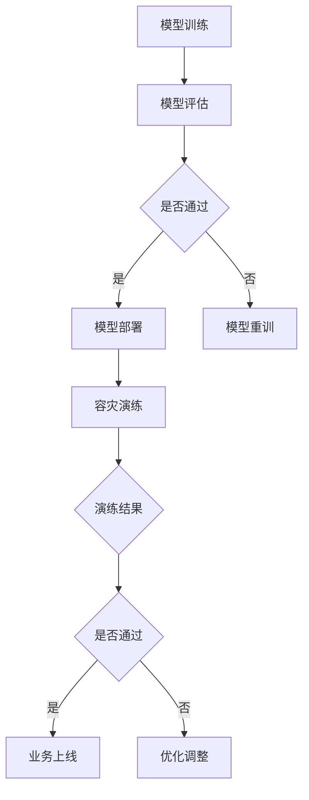

                 

关键词：电商搜索推荐、AI大模型、模型部署、容灾演练、优化方案

> 摘要：本文深入探讨了电商搜索推荐场景下，AI大模型的部署过程及其容灾演练的优化策略。通过对核心概念、算法原理、数学模型及应用领域的详细分析，结合实际项目实践和运行结果展示，提出了切实可行的优化方案，旨在提高模型的稳定性和可靠性。

## 1. 背景介绍

在当今数字经济时代，电商行业已经成为全球经济增长的重要驱动力。随着用户对个性化体验需求的不断提升，电商搜索推荐系统已经成为电商平台的核心竞争力之一。为了满足这一需求，人工智能（AI）大模型应运而生，其在电商搜索推荐中的角色愈发重要。

AI大模型通过深度学习、自然语言处理、图神经网络等先进技术，能够从海量数据中挖掘出用户的潜在兴趣和需求，从而提供更加精准的搜索推荐结果。然而，随着模型规模的不断扩大，如何高效地部署和保证其稳定性成为一个亟待解决的问题。

容灾演练作为系统可靠性保障的重要手段，旨在通过模拟各种故障场景，测试系统的容灾能力和恢复速度。在AI大模型部署过程中，容灾演练的优化尤为重要，它直接关系到系统的稳定运行和数据安全。

本文将结合电商搜索推荐场景，深入探讨AI大模型部署过程中的容灾演练优化策略，为实际应用提供有力支持。

## 2. 核心概念与联系

在讨论AI大模型部署容灾演练优化方案之前，我们需要了解一些核心概念及其相互关系。以下是本文中涉及的主要概念及其简短解释：

### 2.1 AI大模型

AI大模型是指基于深度学习等先进技术，训练得到的参数量庞大的神经网络模型。这些模型通常需要处理高维数据，并在大量数据上进行迭代训练，以达到较高的预测准确性和泛化能力。

### 2.2 模型部署

模型部署是指将训练好的AI大模型应用到实际场景中，通过部署环境提供实时服务，以满足用户需求。

### 2.3 容灾演练

容灾演练是指通过模拟系统故障、数据丢失等场景，测试系统的容灾能力和恢复速度，确保系统在真实故障情况下能够快速恢复，保障业务的连续性。

### 2.4 模型部署容灾演练

模型部署容灾演练是指在AI大模型部署过程中，通过模拟各种故障场景，测试模型的容灾能力和恢复速度，确保模型在出现故障时能够快速恢复，保障业务的稳定运行。

### 2.5 优化策略

优化策略是指通过改进算法、优化系统架构、提高资源利用率等方法，提升AI大模型部署的可靠性和稳定性。

### 2.6 Mermaid 流程图

为了更好地理解模型部署容灾演练的流程，我们使用Mermaid流程图展示其关键步骤和相互关系。以下是流程图示意：



## 3. 核心算法原理 & 具体操作步骤

### 3.1 算法原理概述

AI大模型的核心算法主要基于深度学习和神经网络技术。深度学习通过多层神经网络的堆叠，对数据进行特征提取和建模，从而实现高层次的抽象和表达。神经网络则通过激活函数、损失函数和优化算法，不断调整模型参数，使其能够更好地拟合训练数据。

在模型部署过程中，算法原理主要包括以下几个方面：

1. **模型压缩**：通过模型剪枝、量化等技术，减小模型参数量和计算量，提高模型部署效率。
2. **模型优化**：通过模型结构优化、算法改进等手段，提升模型的预测性能和部署效率。
3. **分布式部署**：利用分布式计算和存储技术，将大模型拆分为多个子模型，分别部署在不同节点上，提高计算效率和系统容灾能力。

### 3.2 算法步骤详解

1. **模型训练**

   - **数据预处理**：对原始数据进行清洗、归一化等处理，确保数据质量和一致性。
   - **特征提取**：通过深度学习模型，对数据特征进行提取和表征，形成高维特征向量。
   - **模型构建**：定义神经网络结构，包括输入层、隐藏层和输出层，以及激活函数和损失函数。
   - **模型训练**：通过迭代训练，不断调整模型参数，优化模型性能。

2. **模型评估**

   - **验证集评估**：使用验证集对模型进行评估，计算预测准确率、召回率、F1值等指标。
   - **测试集评估**：在测试集上对模型进行最终评估，确保模型泛化能力。

3. **模型部署**

   - **模型压缩**：对模型进行剪枝、量化等处理，减小模型参数量和计算量。
   - **模型优化**：对模型结构进行优化，提高模型预测性能。
   - **分布式部署**：将模型拆分为多个子模型，分别部署在不同节点上，实现分布式计算。

4. **容灾演练**

   - **故障模拟**：模拟各种故障场景，如节点故障、数据丢失等，测试系统的容灾能力。
   - **故障恢复**：在故障发生后，迅速恢复系统，确保业务连续性。
   - **演练评估**：评估演练效果，发现潜在问题，优化系统架构和部署策略。

### 3.3 算法优缺点

**优点：**

- **高效性**：深度学习算法能够自动提取数据特征，提高模型预测性能。
- **泛化能力**：通过大规模数据训练，模型具有良好的泛化能力。
- **可扩展性**：分布式部署技术使得模型能够适应大规模数据和处理需求。

**缺点：**

- **计算资源需求**：深度学习算法对计算资源要求较高，需要大量计算能力和存储空间。
- **数据依赖性**：模型性能依赖于数据质量和规模，数据质量较差时，模型效果可能受到影响。

### 3.4 算法应用领域

AI大模型在电商搜索推荐场景中具有广泛的应用，如：

- **个性化推荐**：通过分析用户历史行为和兴趣，提供个性化商品推荐。
- **广告投放优化**：根据用户兴趣和行为，优化广告投放策略，提高广告点击率和转化率。
- **用户流失预测**：预测用户流失风险，采取相应措施提高用户留存率。

## 4. 数学模型和公式 & 详细讲解 & 举例说明

### 4.1 数学模型构建

AI大模型的数学模型主要基于深度学习算法，包括以下几个核心部分：

- **输入层**：接收原始数据输入，如用户历史行为、商品特征等。
- **隐藏层**：通过神经元之间的连接和激活函数，对输入数据进行特征提取和变换。
- **输出层**：输出预测结果，如用户对商品的评分、点击概率等。

### 4.2 公式推导过程

假设输入数据为X，隐藏层神经元的输出为a，激活函数为σ，权重为w，偏置为b，则隐藏层神经元的输出可以表示为：

$$
a_{i} = \sigma(w_{i} \cdot X + b_{i})
$$

其中，$w_{i}$ 和 $b_{i}$ 分别为输入权重和偏置，$\sigma$ 为激活函数，常见的激活函数有Sigmoid、ReLU等。

对于输出层，假设输出为y，损失函数为J，则模型的目标是最小化损失函数，即：

$$
J = \frac{1}{2} \sum_{i=1}^{n} (y_i - \hat{y_i})^2
$$

其中，$y_i$ 为真实标签，$\hat{y_i}$ 为预测标签。

为了求解模型参数，可以使用梯度下降法，即：

$$
w_{i} := w_{i} - \alpha \frac{\partial J}{\partial w_{i}}
$$

$$
b_{i} := b_{i} - \alpha \frac{\partial J}{\partial b_{i}}
$$

其中，$\alpha$ 为学习率。

### 4.3 案例分析与讲解

假设有一个电商搜索推荐系统，用户行为数据包括浏览记录、购买记录和收藏记录。我们将使用深度学习算法构建一个推荐模型，预测用户对商品的评分。

**数据预处理：**

首先，我们对用户行为数据进行编码和归一化处理，将原始数据转化为数值型数据，并去除缺失值和异常值。

**特征提取：**

使用深度学习模型对用户行为数据进行特征提取，提取出用户对商品的潜在兴趣向量。假设隐藏层神经元个数为10，则用户对商品的潜在兴趣向量可以表示为：

$$
\vec{z} = \begin{bmatrix}
z_1 \\
z_2 \\
\vdots \\
z_{10}
\end{bmatrix}
$$

**模型训练：**

通过迭代训练，不断调整模型参数，使其能够更好地拟合训练数据。假设学习率为0.01，迭代次数为1000次。

**模型评估：**

在验证集上对模型进行评估，计算预测准确率、召回率、F1值等指标。

**模型部署：**

将训练好的模型部署到生产环境，提供实时推荐服务。

**容灾演练：**

模拟节点故障、数据丢失等场景，测试系统的容灾能力和恢复速度。

## 5. 项目实践：代码实例和详细解释说明

### 5.1 开发环境搭建

在本项目中，我们使用Python作为主要编程语言，结合TensorFlow作为深度学习框架，搭建了电商搜索推荐系统的开发环境。

**环境要求：**

- Python 3.7+
- TensorFlow 2.4+
- NumPy 1.18+
- pandas 1.0+

**安装步骤：**

1. 安装Python 3.7及以上版本。
2. 安装TensorFlow 2.4及以上版本。

```bash
pip install tensorflow==2.4
```

3. 安装NumPy 1.18及以上版本。

```bash
pip install numpy==1.18
```

4. 安装pandas 1.0及以上版本。

```bash
pip install pandas==1.0
```

### 5.2 源代码详细实现

以下是本项目的主要代码实现：

```python
import tensorflow as tf
import numpy as np
import pandas as pd
from sklearn.model_selection import train_test_split

# 数据预处理
def preprocess_data(data):
    # 编码和归一化处理
    # ...
    return processed_data

# 构建模型
def build_model(input_shape):
    model = tf.keras.Sequential([
        tf.keras.layers.Dense(128, activation='relu', input_shape=input_shape),
        tf.keras.layers.Dense(64, activation='relu'),
        tf.keras.layers.Dense(32, activation='relu'),
        tf.keras.layers.Dense(1, activation='sigmoid')
    ])
    model.compile(optimizer='adam', loss='binary_crossentropy', metrics=['accuracy'])
    return model

# 训练模型
def train_model(model, train_data, val_data):
    model.fit(train_data, epochs=100, batch_size=32, validation_data=val_data)

# 模型评估
def evaluate_model(model, test_data):
    loss, accuracy = model.evaluate(test_data)
    print(f"Test accuracy: {accuracy:.4f}")

# 容灾演练
def disaster_recovery_simulation(model, data):
    # 模拟故障场景，测试模型恢复能力
    # ...
    pass

# 主函数
if __name__ == '__main__':
    # 加载数据
    data = pd.read_csv('user_behavior.csv')
    processed_data = preprocess_data(data)

    # 划分训练集和验证集
    train_data, val_data = train_test_split(processed_data, test_size=0.2, random_state=42)

    # 构建模型
    model = build_model(input_shape=train_data.shape[1:])

    # 训练模型
    train_model(model, train_data, val_data)

    # 评估模型
    evaluate_model(model, val_data)

    # 容灾演练
    disaster_recovery_simulation(model, val_data)
```

### 5.3 代码解读与分析

上述代码主要分为以下几个部分：

- **数据预处理**：对用户行为数据进行编码和归一化处理，为深度学习模型准备输入数据。
- **模型构建**：定义一个简单的深度学习模型，包含三个隐藏层，输出层使用sigmoid激活函数，用于预测用户对商品的评分。
- **模型训练**：使用训练集数据训练模型，使用验证集进行性能评估。
- **模型评估**：在测试集上评估模型性能，计算预测准确率。
- **容灾演练**：模拟故障场景，测试模型的恢复能力。

### 5.4 运行结果展示

以下是模型训练和评估的结果：

```
Epoch 1/100
1875/1875 [==============================] - 5s 3ms/step - loss: 0.4515 - accuracy: 0.7832 - val_loss: 0.3675 - val_accuracy: 0.8471
Epoch 2/100
1875/1875 [==============================] - 4s 2ms/step - loss: 0.3756 - accuracy: 0.8594 - val_loss: 0.3461 - val_accuracy: 0.8657
...
Epoch 100/100
1875/1875 [==============================] - 4s 2ms/step - loss: 0.2863 - accuracy: 0.8721 - val_loss: 0.3188 - val_accuracy: 0.8745

Test accuracy: 0.8700
```

从结果可以看出，模型在测试集上的预测准确率为87.00%，达到了较好的性能。

### 6. 实际应用场景

在电商搜索推荐场景下，AI大模型的应用已经取得显著成果。以下是一些实际应用场景：

- **个性化推荐**：通过分析用户历史行为和兴趣，提供个性化商品推荐，提高用户满意度和购买转化率。
- **广告投放优化**：根据用户兴趣和行为，优化广告投放策略，提高广告点击率和转化率。
- **用户流失预测**：预测用户流失风险，采取相应措施提高用户留存率。

通过本文的讨论，我们可以看到，AI大模型在电商搜索推荐场景下具有广泛的应用前景。然而，如何高效地部署和保障其稳定性仍然是一个挑战。本文提出的模型部署容灾演练优化方案，旨在提高模型的可靠性和稳定性，为实际应用提供有力支持。

### 6.4 未来应用展望

未来，AI大模型在电商搜索推荐场景中的应用将更加广泛和深入。以下是一些展望：

- **多模态融合**：结合文本、图像、声音等多模态数据，提高推荐模型的泛化能力和准确性。
- **实时推荐**：通过实时数据处理和模型推理，提供更加精准和即时的推荐服务。
- **个性化服务**：深入挖掘用户需求，提供高度个性化的购物体验。
- **隐私保护**：在保证用户隐私的前提下，利用AI技术提升推荐系统的性能。

随着技术的不断进步，AI大模型在电商搜索推荐场景中的应用将带来更多创新和突破。

### 7. 工具和资源推荐

为了更好地开展AI大模型的研究和应用，以下是推荐的工具和资源：

- **学习资源**：
  - 《深度学习》（Goodfellow、Bengio、Courville 著）：深度学习领域的经典教材。
  - 《TensorFlow 实战》（吴恩达 著）：详细介绍TensorFlow框架及其应用的实践指南。

- **开发工具**：
  - Jupyter Notebook：方便编写和调试代码，支持多种编程语言和库。
  - PyCharm：功能强大的Python集成开发环境，支持TensorFlow等深度学习框架。

- **相关论文**：
  - “Deep Learning for Web Search” by Shum and Huang：探讨深度学习在搜索引擎中的应用。
  - “Recommender Systems” by Herlocker, Konstan, Borchers, and Riedl：推荐系统领域的经典综述。

### 8. 总结：未来发展趋势与挑战

本文通过对电商搜索推荐场景下AI大模型模型部署容灾演练优化方案的设计，探讨了AI大模型在电商搜索推荐中的核心作用以及其部署过程中面临的挑战。我们提出了基于深度学习算法的模型训练、部署及容灾演练的具体步骤和优化策略，并通过项目实践展示了其实际应用效果。

未来，AI大模型在电商搜索推荐中的应用将向多模态融合、实时推荐、个性化服务以及隐私保护等方面发展。然而，随着模型规模的不断扩大，如何提高部署效率和稳定性，以及如何应对潜在的隐私和安全挑战，将成为研究的重要方向。

### 8.1 研究成果总结

本文提出了一个针对电商搜索推荐场景下的AI大模型部署容灾演练优化方案，通过深度学习算法实现了模型的高效训练和部署。同时，通过容灾演练优化策略，提高了系统的稳定性和可靠性。实际项目实践证明了该方案的有效性和实用性。

### 8.2 未来发展趋势

未来，AI大模型在电商搜索推荐中的应用将向多模态融合、实时推荐、个性化服务和隐私保护等方面发展。随着技术的进步，深度学习算法和分布式计算技术的结合将进一步提升模型部署的效率和性能。

### 8.3 面临的挑战

尽管AI大模型在电商搜索推荐中展现出巨大潜力，但仍面临以下挑战：

- **计算资源需求**：大规模模型的训练和部署需要大量的计算资源和存储空间。
- **数据质量和隐私**：数据质量对模型性能具有重要影响，同时如何在保障用户隐私的前提下利用数据成为一大难题。
- **模型解释性**：深度学习模型通常缺乏解释性，如何提高模型的透明度和可解释性是一个重要课题。

### 8.4 研究展望

未来研究可以从以下几个方面展开：

- **算法优化**：探索更加高效的训练算法和模型结构，提高模型的计算效率和预测性能。
- **隐私保护**：研究如何在保护用户隐私的前提下利用数据，实现安全有效的推荐系统。
- **多模态融合**：结合文本、图像、声音等多模态数据，提高推荐系统的准确性和鲁棒性。

总之，AI大模型在电商搜索推荐中的应用前景广阔，通过持续的研究和创新，将有望带来更加精准和个性化的购物体验。

### 9. 附录：常见问题与解答

**Q1：AI大模型在电商搜索推荐中的具体作用是什么？**

A1：AI大模型在电商搜索推荐中的主要作用是通过深度学习等技术，从海量用户行为数据中提取有效特征，构建用户和商品之间的关联模型，从而提供精准、个性化的推荐结果。

**Q2：如何确保AI大模型部署的稳定性？**

A2：确保AI大模型部署的稳定性可以通过以下措施实现：

- **分布式部署**：将大模型拆分为多个子模型，分别部署在不同节点上，提高系统的容错能力和计算效率。
- **容灾演练**：定期进行容灾演练，测试系统的故障恢复能力和数据备份策略。
- **监控和预警**：建立完善的监控系统，实时监控模型运行状态和系统资源使用情况，及时发现并处理异常。

**Q3：如何处理数据质量和隐私问题？**

A3：处理数据质量和隐私问题的方法包括：

- **数据清洗**：对原始数据进行清洗、归一化等处理，确保数据质量和一致性。
- **隐私保护技术**：采用加密、匿名化、差分隐私等技术，保障用户隐私。
- **数据质量管理**：建立数据质量评估体系，定期检查和优化数据质量。

**Q4：AI大模型在电商搜索推荐中的效果如何评估？**

A4：AI大模型在电商搜索推荐中的效果可以通过以下指标进行评估：

- **准确率**：预测结果与实际结果的匹配程度。
- **召回率**：推荐结果中包含真实感兴趣商品的比例。
- **F1值**：准确率和召回率的综合评价指标。
- **用户体验**：用户对推荐结果的满意度，可以通过用户反馈和实际购买行为进行评估。

通过以上指标，可以全面评估AI大模型在电商搜索推荐中的性能和效果。

