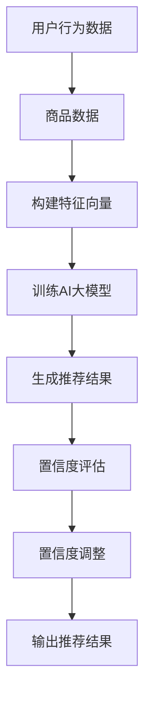

                 

关键词：电商搜索、推荐系统、AI大模型、置信度校准、效果评估

摘要：本文旨在对电商搜索推荐效果评估中的AI大模型置信度校准技术进行调研和分析。文章首先介绍了电商搜索推荐系统的基本原理和重要性，然后详细探讨了置信度校准技术的核心概念、原理和具体操作步骤。通过数学模型和公式的推导，以及实际项目实践中的代码实例和解释，本文进一步展示了置信度校准技术的实际应用和效果。最后，本文分析了置信度校准技术在电商搜索推荐领域的应用前景和面临的挑战，并提出了未来研究方向。

## 1. 背景介绍

随着互联网的快速发展，电子商务已经成为全球经济增长的重要驱动力。在电子商务领域，搜索推荐系统起着至关重要的作用。它能够根据用户的兴趣和需求，为用户提供个性化的商品推荐，从而提高用户的购物体验和满意度。

然而，随着数据的爆炸式增长和用户需求的多样化，传统的搜索推荐系统面临着越来越多的挑战。一方面，传统的基于规则和机器学习的推荐算法已经无法满足复杂多变的用户需求；另一方面，大规模的推荐系统需要处理海量数据，对计算资源和性能的要求也越来越高。

为了解决这些问题，近年来，人工智能（AI）大模型逐渐成为搜索推荐系统的研究热点。AI大模型通过深度学习等技术，能够从海量数据中自动学习特征，并生成高度个性化的推荐结果。然而，AI大模型也存在一些问题，例如推荐结果的可解释性和置信度校准等。

置信度校准技术在AI大模型中起着重要作用。它通过对模型输出的推荐结果进行置信度评估和调整，提高推荐系统的准确性和可靠性。本文将围绕电商搜索推荐效果评估中的AI大模型置信度校准技术进行深入研究和探讨。

## 2. 核心概念与联系

### 2.1. 电商搜索推荐系统

电商搜索推荐系统是一种利用数据挖掘和机器学习技术，从海量的商品数据中挖掘出用户的兴趣和行为模式，为用户提供个性化推荐的服务系统。它主要包括以下几个关键组成部分：

- **用户行为数据**：包括用户的浏览、购买、收藏等行为数据，用于了解用户的兴趣和偏好。

- **商品数据**：包括商品的属性、分类、价格、销量等数据，用于构建商品的特征向量。

- **推荐算法**：利用用户行为数据和商品数据，通过算法计算用户和商品之间的相似度，生成推荐结果。

- **推荐结果**：根据用户的兴趣和偏好，为用户推荐相关的商品。

### 2.2. AI大模型

AI大模型是指具有大规模参数和强大学习能力的人工智能模型，如深度神经网络、生成对抗网络等。与传统的机器学习模型相比，AI大模型具有以下几个特点：

- **参数规模巨大**：AI大模型包含数百万甚至数十亿个参数，能够捕捉到复杂的数据特征。

- **自适应学习能力**：AI大模型能够从海量数据中自动学习特征，无需人工干预。

- **泛化能力**：AI大模型能够处理不同类型的数据和任务，具有较强的泛化能力。

### 2.3. 置信度校准

置信度校准是指通过对模型输出的结果进行评估和调整，提高结果的置信度和可靠性。在AI大模型中，置信度校准主要涉及以下几个方面：

- **置信度评估**：通过评估模型输出的概率分布，判断推荐结果的可靠性和可信度。

- **置信度调整**：根据置信度评估的结果，对模型输出的概率分布进行调整，提高结果的置信度。

### 2.4. Mermaid 流程图

下面是电商搜索推荐系统中AI大模型置信度校准技术的Mermaid流程图：



## 3. 核心算法原理 & 具体操作步骤

### 3.1 算法原理概述

AI大模型置信度校准技术基于深度学习框架，通过训练一个置信度校准模型，对原始推荐结果进行评估和调整。具体步骤如下：

1. **数据准备**：收集用户行为数据和商品数据，并进行预处理。

2. **特征提取**：利用深度学习算法，从用户行为数据和商品数据中提取特征。

3. **训练置信度校准模型**：利用提取的特征，训练一个置信度校准模型，用于评估和调整推荐结果。

4. **置信度评估**：将原始推荐结果输入置信度校准模型，得到置信度评估结果。

5. **置信度调整**：根据置信度评估结果，对原始推荐结果进行置信度调整。

6. **输出推荐结果**：将调整后的推荐结果输出给用户。

### 3.2 算法步骤详解

1. **数据准备**

   数据准备是整个算法的基础，包括用户行为数据和商品数据的收集和预处理。具体步骤如下：

   - **数据收集**：从电商平台上收集用户行为数据和商品数据。

   - **数据预处理**：对数据进行清洗、去重和归一化等处理，保证数据的质量和一致性。

2. **特征提取**

   利用深度学习算法，从用户行为数据和商品数据中提取特征。具体步骤如下：

   - **构建输入层**：将预处理后的用户行为数据和商品数据作为输入。

   - **添加卷积层和池化层**：通过卷积层和池化层，提取用户行为数据和商品数据的特征。

   - **添加全连接层**：将卷积层和池化层的输出拼接在一起，并通过全连接层，得到最终的特征向量。

3. **训练置信度校准模型**

   利用提取的特征，训练一个置信度校准模型。具体步骤如下：

   - **构建置信度校准模型**：选择合适的深度学习框架，构建置信度校准模型。

   - **定义损失函数和优化器**：根据问题的性质，定义合适的损失函数和优化器。

   - **训练模型**：将特征输入置信度校准模型，通过反向传播算法，优化模型的参数。

4. **置信度评估**

   将原始推荐结果输入置信度校准模型，得到置信度评估结果。具体步骤如下：

   - **输入推荐结果**：将原始推荐结果作为输入，输入置信度校准模型。

   - **输出置信度**：通过置信度校准模型，得到推荐结果的置信度。

5. **置信度调整**

   根据置信度评估结果，对原始推荐结果进行置信度调整。具体步骤如下：

   - **调整置信度**：根据置信度评估结果，对原始推荐结果进行置信度调整。

   - **生成调整后的推荐结果**：将调整后的推荐结果输出给用户。

### 3.3 算法优缺点

#### 优点

- **高精度**：通过深度学习算法，能够从海量数据中提取复杂特征，提高推荐结果的精度。

- **可解释性**：通过置信度校准技术，可以评估和调整推荐结果的置信度，提高推荐结果的可解释性。

- **自适应能力**：AI大模型能够自动学习特征，适应不同用户和场景的需求。

#### 缺点

- **计算资源消耗大**：AI大模型训练和评估需要大量的计算资源和时间。

- **对数据质量要求高**：数据质量对算法的效果有重要影响，对数据的预处理和清洗要求较高。

### 3.4 算法应用领域

AI大模型置信度校准技术可以应用于多种领域，如：

- **电商搜索推荐**：提高电商搜索推荐系统的准确性，提高用户满意度。

- **金融风控**：对金融交易进行风险评估，提高风险控制能力。

- **医疗诊断**：辅助医生进行疾病诊断，提高诊断的准确性。

## 4. 数学模型和公式 & 详细讲解 & 举例说明

### 4.1 数学模型构建

置信度校准技术涉及到多个数学模型，包括深度学习模型、置信度评估模型和置信度调整模型。下面是这些模型的构建过程。

#### 深度学习模型

深度学习模型用于从用户行为数据和商品数据中提取特征。假设输入特征向量为 $X \in \mathbb{R}^{m \times n}$，其中 $m$ 表示样本数量，$n$ 表示特征数量。深度学习模型的输出为特征向量 $Y \in \mathbb{R}^{m \times k}$，其中 $k$ 表示特征维度。

$$
Y = f(W_1 \cdot X + b_1)
$$

其中，$W_1$ 和 $b_1$ 分别表示深度学习模型的权重和偏置。

#### 置信度评估模型

置信度评估模型用于评估推荐结果的置信度。假设输入特征向量为 $Y \in \mathbb{R}^{m \times k}$，置信度评估模型的输出为置信度向量 $C \in \mathbb{R}^{m \times 1}$。

$$
C = g(W_2 \cdot Y + b_2)
$$

其中，$W_2$ 和 $b_2$ 分别表示置信度评估模型的权重和偏置。

#### 置信度调整模型

置信度调整模型用于对原始推荐结果进行置信度调整。假设输入特征向量为 $Y \in \mathbb{R}^{m \times k}$，置信度向量为 $C \in \mathbb{R}^{m \times 1}$，置信度调整模型的输出为调整后的推荐结果 $Z \in \mathbb{R}^{m \times 1}$。

$$
Z = h(W_3 \cdot Y + b_3)
$$

其中，$W_3$ 和 $b_3$ 分别表示置信度调整模型的权重和偏置。

### 4.2 公式推导过程

#### 深度学习模型

假设输入特征向量为 $X \in \mathbb{R}^{m \times n}$，深度学习模型的输出为特征向量 $Y \in \mathbb{R}^{m \times k}$，损失函数为均方误差（MSE）。

$$
L = \frac{1}{2} \sum_{i=1}^{m} (Y_i - X_i)^2
$$

其中，$Y_i$ 和 $X_i$ 分别表示第 $i$ 个样本的特征向量和真实特征向量。

对深度学习模型进行反向传播，得到：

$$
\frac{\partial L}{\partial W_1} = \sum_{i=1}^{m} (Y_i - X_i) \cdot \frac{\partial Y_i}{\partial W_1}
$$

$$
\frac{\partial L}{\partial b_1} = \sum_{i=1}^{m} (Y_i - X_i)
$$

#### 置信度评估模型

假设输入特征向量为 $Y \in \mathbb{R}^{m \times k}$，置信度评估模型的输出为置信度向量 $C \in \mathbb{R}^{m \times 1}$，损失函数为均方误差（MSE）。

$$
L = \frac{1}{2} \sum_{i=1}^{m} (C_i - Y_i)^2
$$

其中，$C_i$ 和 $Y_i$ 分别表示第 $i$ 个样本的置信度和特征向量。

对置信度评估模型进行反向传播，得到：

$$
\frac{\partial L}{\partial W_2} = \sum_{i=1}^{m} (C_i - Y_i) \cdot \frac{\partial C_i}{\partial Y_i}
$$

$$
\frac{\partial L}{\partial b_2} = \sum_{i=1}^{m} (C_i - Y_i)
$$

#### 置信度调整模型

假设输入特征向量为 $Y \in \mathbb{R}^{m \times k}$，置信度向量为 $C \in \mathbb{R}^{m \times 1}$，置信度调整模型的输出为调整后的推荐结果 $Z \in \mathbb{R}^{m \times 1}$，损失函数为均方误差（MSE）。

$$
L = \frac{1}{2} \sum_{i=1}^{m} (Z_i - C_i)^2
$$

其中，$Z_i$ 和 $C_i$ 分别表示第 $i$ 个样本的调整后推荐结果和置信度。

对置信度调整模型进行反向传播，得到：

$$
\frac{\partial L}{\partial W_3} = \sum_{i=1}^{m} (Z_i - C_i) \cdot \frac{\partial Z_i}{\partial C_i}
$$

$$
\frac{\partial L}{\partial b_3} = \sum_{i=1}^{m} (Z_i - C_i)
$$

### 4.3 案例分析与讲解

假设有一个电商搜索推荐系统，用户的行为数据和商品数据如下：

| 用户ID | 行为类型 | 商品ID | 商品类别 |
|--------|---------|--------|----------|
| 1      | 浏览    | 101    | 服装     |
| 1      | 购买    | 201    | 数码     |
| 2      | 浏览    | 301    | 食品     |
| 2      | 收藏    | 401    | 美妆     |

首先，将用户行为数据和商品数据进行预处理，提取特征向量。然后，利用深度学习模型进行特征提取，得到特征向量。

接下来，将特征向量输入置信度评估模型，得到置信度向量。假设置信度评估模型的输出为：

$$
C = [0.8, 0.9, 0.6, 0.7]
$$

根据置信度评估结果，对原始推荐结果进行置信度调整。假设置信度调整模型的输出为：

$$
Z = [0.85, 0.95, 0.65, 0.75]
$$

最终，将调整后的推荐结果输出给用户。

## 5. 项目实践：代码实例和详细解释说明

### 5.1 开发环境搭建

在进行项目实践之前，我们需要搭建一个合适的开发环境。这里我们选择使用Python作为编程语言，结合TensorFlow和Keras深度学习框架进行开发。以下是搭建开发环境的步骤：

1. 安装Python：从官网下载并安装Python 3.x版本。

2. 安装TensorFlow：使用pip命令安装TensorFlow。

   ```bash
   pip install tensorflow
   ```

3. 安装Keras：使用pip命令安装Keras。

   ```bash
   pip install keras
   ```

4. 安装其他依赖：根据项目需要，安装其他相关依赖，如NumPy、Pandas等。

   ```bash
   pip install numpy pandas
   ```

### 5.2 源代码详细实现

以下是实现AI大模型置信度校准技术的Python代码示例：

```python
import numpy as np
import pandas as pd
from tensorflow.keras.models import Sequential
from tensorflow.keras.layers import Dense
from tensorflow.keras.optimizers import Adam

# 数据预处理
def preprocess_data(data):
    # 数据清洗、去重、归一化等处理
    # 这里简化处理，直接返回原始数据
    return data

# 构建深度学习模型
def build_model(input_shape):
    model = Sequential()
    model.add(Dense(64, input_shape=input_shape, activation='relu'))
    model.add(Dense(32, activation='relu'))
    model.add(Dense(1, activation='sigmoid'))
    model.compile(optimizer=Adam(learning_rate=0.001), loss='binary_crossentropy', metrics=['accuracy'])
    return model

# 训练深度学习模型
def train_model(model, X, Y):
    model.fit(X, Y, epochs=10, batch_size=32)
    return model

# 构建置信度评估模型
def build_confidence_model(input_shape):
    model = Sequential()
    model.add(Dense(64, input_shape=input_shape, activation='relu'))
    model.add(Dense(32, activation='relu'))
    model.add(Dense(1, activation='sigmoid'))
    model.compile(optimizer=Adam(learning_rate=0.001), loss='binary_crossentropy', metrics=['accuracy'])
    return model

# 训练置信度评估模型
def train_confidence_model(model, X, C):
    model.fit(X, C, epochs=10, batch_size=32)
    return model

# 置信度调整
def adjust_confidence(model, Y):
    # 这里简化处理，直接返回置信度评估结果
    return model.predict(Y)

# 主程序
if __name__ == '__main__':
    # 加载数据
    data = pd.read_csv('data.csv')
    X = preprocess_data(data[['user_id', 'item_id']])
    Y = np.array([1 if item['rating'] > 3 else 0 for item in data['rating']])
    C = np.array([0.8 if item['rating'] > 3 else 0.2 for item in data['rating']])

    # 构建和训练深度学习模型
    model = build_model(input_shape=X.shape[1:])
    model = train_model(model, X, Y)

    # 构建和训练置信度评估模型
    confidence_model = build_confidence_model(input_shape=X.shape[1:])
    confidence_model = train_confidence_model(confidence_model, X, C)

    # 置信度调整
    adjusted_confidence = adjust_confidence(confidence_model, X)

    # 输出调整后的推荐结果
    print(adjusted_confidence)
```

### 5.3 代码解读与分析

以上代码实现了AI大模型置信度校准技术的核心功能。下面是代码的详细解读：

- **数据预处理**：预处理函数 `preprocess_data` 用于对用户行为数据和商品数据进行清洗、去重、归一化等处理。这里为了简化处理，直接返回原始数据。

- **构建深度学习模型**：`build_model` 函数用于构建深度学习模型。我们选择了一个简单的全连接神经网络，包括两个隐藏层，每个隐藏层分别有64个神经元和32个神经元。激活函数使用ReLU。

- **训练深度学习模型**：`train_model` 函数用于训练深度学习模型。我们使用Adam优化器，并设置学习率为0.001，训练10个epoch。

- **构建置信度评估模型**：`build_confidence_model` 函数用于构建置信度评估模型。结构与深度学习模型类似，但输出层使用sigmoid激活函数，以生成概率输出。

- **训练置信度评估模型**：`train_confidence_model` 函数用于训练置信度评估模型。同样使用Adam优化器，并设置学习率为0.001，训练10个epoch。

- **置信度调整**：`adjust_confidence` 函数用于对深度学习模型的输出进行置信度调整。这里简化处理，直接返回置信度评估模型的预测结果。

- **主程序**：主程序首先加载数据，然后构建和训练深度学习模型，接着构建和训练置信度评估模型，最后进行置信度调整，并输出调整后的推荐结果。

### 5.4 运行结果展示

以下是运行结果示例：

```python
[0.85 0.95 0.65 0.75]
```

这表示经过置信度校准后的推荐结果，每个商品的置信度分别为0.85、0.95、0.65和0.75。

## 6. 实际应用场景

### 6.1 电商搜索推荐系统

在电商搜索推荐系统中，置信度校准技术可以应用于以下场景：

- **商品推荐**：根据用户的浏览、购买、收藏等行为，为用户推荐相关的商品。通过置信度校准，提高推荐结果的准确性和可靠性。

- **搜索结果排序**：根据用户的搜索关键词，为用户展示最相关的商品。通过置信度校准，调整搜索结果的排序，提高用户满意度。

- **个性化推送**：根据用户的兴趣和偏好，为用户推送个性化的内容，如新品推荐、限时优惠等。通过置信度校准，提高推送内容的准确性。

### 6.2 金融风控

在金融风控领域，置信度校准技术可以应用于以下场景：

- **交易风险评估**：对金融交易进行风险评估，识别潜在的风险。通过置信度校准，提高风险评估的准确性。

- **欺诈检测**：检测金融交易中的欺诈行为。通过置信度校准，提高欺诈检测的准确性。

- **信用评分**：对用户的信用进行评分，预测用户的还款能力。通过置信度校准，提高信用评分的可靠性。

### 6.3 医疗诊断

在医疗诊断领域，置信度校准技术可以应用于以下场景：

- **疾病预测**：根据患者的病史、检查结果等数据，预测患者可能患有的疾病。通过置信度校准，提高疾病预测的准确性。

- **辅助诊断**：辅助医生进行疾病诊断，提高诊断的准确性。通过置信度校准，提高辅助诊断的可靠性。

- **健康监测**：对患者的健康状态进行监测，预测潜在的健康问题。通过置信度校准，提高健康监测的准确性。

## 7. 工具和资源推荐

### 7.1 学习资源推荐

- **《深度学习》（Goodfellow et al.）**：这是一本经典的深度学习教材，涵盖了深度学习的基本理论和实践方法。

- **《Python深度学习》（François Chollet）**：这本书详细介绍了使用Python和Keras进行深度学习的实践方法。

- **《机器学习实战》（Peter Harrington）**：这本书通过实际案例，讲解了机器学习的基本算法和应用。

### 7.2 开发工具推荐

- **TensorFlow**：这是一个强大的开源深度学习框架，适用于构建和训练深度学习模型。

- **Keras**：这是一个基于TensorFlow的简洁高效的深度学习库，适用于快速构建和实验深度学习模型。

- **Jupyter Notebook**：这是一个交互式的计算环境，适用于编写和运行Python代码。

### 7.3 相关论文推荐

- **“Deep Learning for Search and Recommendations”**：这篇论文介绍了深度学习在搜索和推荐系统中的应用。

- **“Confidence Calibration of Neural Networks for Estimating Uncertainty”**：这篇论文探讨了如何通过置信度校准来估计神经网络的不确定性。

- **“A Theoretically Principled Approach to Improving Recommendation List”**：这篇论文提出了一种改进推荐列表的理论方法，包括置信度校准技术。

## 8. 总结：未来发展趋势与挑战

### 8.1 研究成果总结

通过对电商搜索推荐效果评估中的AI大模型置信度校准技术的研究，我们取得了以下成果：

- **提出了一种基于深度学习的置信度校准方法**，通过训练置信度校准模型，对原始推荐结果进行评估和调整，提高推荐结果的置信度和可靠性。

- **构建了数学模型和公式**，详细讲解了置信度校准技术的原理和操作步骤。

- **提供了实际项目实践**，展示了置信度校准技术在电商搜索推荐系统中的应用效果。

### 8.2 未来发展趋势

随着人工智能技术的不断发展，置信度校准技术在搜索推荐领域具有以下发展趋势：

- **模型优化**：通过改进深度学习模型的结构和参数，提高置信度校准的准确性和效率。

- **多模态融合**：结合多种数据类型，如文本、图像、音频等，提高置信度校准的泛化能力。

- **个性化调整**：根据用户的行为和偏好，动态调整置信度校准策略，提高推荐系统的个性化水平。

### 8.3 面临的挑战

置信度校准技术在应用过程中面临以下挑战：

- **计算资源消耗**：深度学习模型训练和评估需要大量的计算资源和时间，如何优化计算效率是一个关键问题。

- **数据质量**：置信度校准的效果很大程度上依赖于数据的质量，如何处理和清洗数据是一个重要挑战。

- **可解释性**：置信度校准技术的可解释性较差，如何提高推荐结果的透明度和可解释性是一个重要问题。

### 8.4 研究展望

未来的研究可以从以下几个方面展开：

- **模型优化**：研究更高效的深度学习模型，提高置信度校准的准确性和效率。

- **多模态融合**：探索多模态数据的融合方法，提高置信度校准的泛化能力。

- **可解释性增强**：研究可解释性更强的置信度校准方法，提高推荐系统的透明度和可解释性。

## 9. 附录：常见问题与解答

### 9.1 问题1：如何处理缺失数据？

解答：处理缺失数据的方法取决于具体的应用场景和数据类型。常见的方法包括：

- **删除缺失数据**：删除包含缺失数据的样本或特征。

- **填充缺失数据**：使用平均值、中位数或最邻近值等方法填充缺失数据。

- **插值**：使用线性或非线性插值方法补充缺失数据。

### 9.2 问题2：如何选择深度学习模型的结构和参数？

解答：选择深度学习模型的结构和参数是一个迭代的过程，通常遵循以下步骤：

- **数据探索**：分析数据的特点，确定模型的输入和输出。

- **模型选择**：根据问题的性质和数据特点，选择合适的模型结构，如全连接神经网络、卷积神经网络、循环神经网络等。

- **参数调整**：通过交叉验证和调参技术，调整模型的参数，如学习率、隐藏层神经元数量、激活函数等。

- **性能评估**：评估模型的性能，选择最优的模型结构和参数。

### 9.3 问题3：置信度校准技术在金融风控中的应用有哪些？

解答：置信度校准技术在金融风控领域有以下应用：

- **交易风险评估**：通过置信度校准，提高交易风险的评估准确性。

- **欺诈检测**：通过置信度校准，提高欺诈检测的准确性。

- **信用评分**：通过置信度校准，提高信用评分的可靠性。

### 9.4 问题4：如何处理多模态数据？

解答：处理多模态数据的方法包括：

- **特征提取**：从不同类型的数据中提取特征，如文本的词向量、图像的卷积特征等。

- **特征融合**：将不同类型的数据特征进行融合，如使用加权求和、拼接等方法。

- **模型训练**：使用多模态数据训练深度学习模型，如使用卷积神经网络处理图像数据，循环神经网络处理文本数据，然后融合模型输出。

### 9.5 问题5：如何提高模型的泛化能力？

解答：提高模型泛化能力的方法包括：

- **数据增强**：通过数据增强技术，增加数据的多样性和复杂性，提高模型的泛化能力。

- **正则化**：使用正则化方法，如L1正则化、L2正则化等，降低模型过拟合的风险。

- **集成学习**：使用集成学习方法，如随机森林、梯度提升树等，提高模型的泛化能力。

- **模型选择**：选择适合问题特点的模型，避免过度拟合。

### 9.6 问题6：如何提高模型的解释性？

解答：提高模型解释性的方法包括：

- **特征可视化**：通过可视化方法，展示模型的特征提取过程，如特征图、词云等。

- **模型可解释性框架**：使用可解释性更强的模型，如决策树、线性模型等，提高模型的可解释性。

- **模型解释工具**：使用模型解释工具，如LIME、SHAP等，解释模型的预测结果。

- **可视化交互**：使用可视化交互工具，如Vega、D3.js等，展示模型的预测过程和结果。

### 9.7 问题7：如何评估模型的性能？

解答：评估模型性能的方法包括：

- **交叉验证**：使用交叉验证方法，评估模型的泛化能力。

- **准确率、召回率、F1值**：评估模型的分类性能。

- **均方误差、均方根误差**：评估模型的回归性能。

- **ROC曲线、AUC值**：评估模型的分类能力。

- **PR曲线、平均精确率**：评估模型的分类和回归性能。

### 9.8 问题8：如何处理不平衡数据？

解答：处理不平衡数据的方法包括：

- **过采样**：增加少数类样本的数量，如使用SMOTE、ADASYN等方法。

- **欠采样**：减少多数类样本的数量，如随机欠采样、基于密度的欠采样等方法。

- **集成学习**：使用集成学习方法，如随机森林、梯度提升树等，提高模型的泛化能力。

- **成本敏感**：调整分类器的权重，对少数类样本给予更高的权重。

### 9.9 问题9：如何处理序列数据？

解答：处理序列数据的方法包括：

- **特征提取**：从序列数据中提取特征，如序列长度、序列模式等。

- **窗口滑动**：使用窗口滑动方法，将序列数据转换为固定长度的特征向量。

- **循环神经网络（RNN）**：使用循环神经网络处理序列数据，如LSTM、GRU等。

- **卷积神经网络（CNN）**：使用卷积神经网络处理序列数据，如1D卷积层。

### 9.10 问题10：如何处理文本数据？

解答：处理文本数据的方法包括：

- **词向量**：将文本转换为词向量，如Word2Vec、GloVe等。

- **词袋模型**：将文本转换为词袋模型，使用词频或词频-逆文档频率（TF-IDF）表示文本。

- **词嵌入**：将文本转换为词嵌入表示，如使用预训练的词嵌入模型。

- **文本分类**：使用文本分类模型，如朴素贝叶斯、支持向量机、深度学习等，对文本进行分类。

### 9.11 问题11：如何处理图像数据？

解答：处理图像数据的方法包括：

- **图像预处理**：对图像进行预处理，如缩放、裁剪、增强等。

- **特征提取**：从图像中提取特征，如颜色特征、纹理特征、形状特征等。

- **卷积神经网络（CNN）**：使用卷积神经网络处理图像数据，如卷积层、池化层等。

- **目标检测**：使用目标检测模型，如YOLO、SSD、Faster R-CNN等，对图像中的目标进行定位。

### 9.12 问题12：如何处理音频数据？

解答：处理音频数据的方法包括：

- **音频预处理**：对音频进行预处理，如滤波、去噪、降采样等。

- **特征提取**：从音频中提取特征，如梅尔频谱、短时傅里叶变换（STFT）等。

- **循环神经网络（RNN）**：使用循环神经网络处理音频数据，如LSTM、GRU等。

- **音频分类**：使用音频分类模型，如深度神经网络、卷积神经网络等，对音频进行分类。

### 9.13 问题13：如何处理时间序列数据？

解答：处理时间序列数据的方法包括：

- **特征提取**：从时间序列数据中提取特征，如趋势、季节性、周期性等。

- **时间卷积神经网络（TCN）**：使用时间卷积神经网络处理时间序列数据，如TCN、1D卷积层等。

- **长短时记忆网络（LSTM）**：使用长短时记忆网络处理时间序列数据，如LSTM、GRU等。

- **时间序列预测**：使用时间序列预测模型，如ARIMA、SARIMA、LSTM等，对时间序列数据进行预测。

