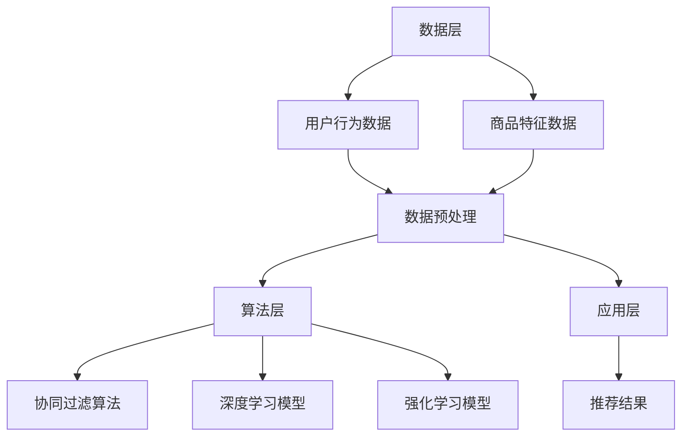

                 

在当今数字化时代，电商平台的崛起带来了数据的爆炸性增长。如何从海量数据中高效地挖掘用户需求，精准地进行搜索推荐，已经成为电商平台竞争的核心。AI大模型技术的引入，使得电商搜索推荐系统取得了质的飞跃。本文将深入探讨电商搜索推荐系统中AI大模型技术的演进过程、核心算法、数学模型及其未来发展趋势。

## 关键词

- 电商搜索推荐
- AI大模型
- 深度学习
- 强化学习
- 推荐系统
- 个性化推荐

## 摘要

本文首先回顾了电商搜索推荐系统的发展历程，接着详细介绍了AI大模型技术的核心概念和原理，以及其在电商搜索推荐系统中的应用。随后，文章探讨了AI大模型技术中的核心算法原理、数学模型和具体操作步骤。通过一个项目实践案例，展示了AI大模型技术的实际应用效果。最后，本文对电商搜索推荐系统的未来发展趋势进行了展望，并提出了面临的研究挑战和展望。

## 1. 背景介绍

### 1.1 电商搜索推荐系统的起源

电商搜索推荐系统的起源可以追溯到20世纪90年代。当时，随着互联网的普及，电商平台开始意识到用户需求的多样化，以及提供个性化购物体验的重要性。早期的推荐系统主要是基于协同过滤算法，通过对用户历史行为的分析，预测用户对未知商品的兴趣。

### 1.2 电商搜索推荐系统的发展

随着大数据和机器学习技术的发展，电商搜索推荐系统逐渐从基于规则的系统演化为基于机器学习的系统。深度学习、强化学习等AI大模型技术的引入，使得推荐系统的效果得到了显著提升。目前，电商搜索推荐系统已经成为电商平台的核心竞争力之一。

### 1.3 电商搜索推荐系统的重要性

电商搜索推荐系统在提升用户体验、增加销售额、提高客户满意度等方面具有重要意义。通过精准的推荐，用户能够更快地找到自己感兴趣的商品，电商平台则能够更好地满足用户需求，提升用户黏性和忠诚度。

## 2. 核心概念与联系

### 2.1 电商搜索推荐系统的核心概念

电商搜索推荐系统的核心概念包括用户行为数据、商品特征数据、推荐算法和推荐结果。用户行为数据包括用户的浏览记录、购买记录、搜索记录等；商品特征数据包括商品的价格、品牌、类别、销量等；推荐算法负责根据用户行为数据和商品特征数据生成推荐结果；推荐结果则反映了系统对用户的个性化推荐。

### 2.2 电商搜索推荐系统的架构

电商搜索推荐系统的架构通常包括数据层、算法层和应用层。数据层负责数据的收集、存储和处理；算法层包括推荐算法的选取、训练和优化；应用层则负责将推荐结果呈现给用户。

### 2.3 Mermaid流程图



## 3. 核心算法原理 & 具体操作步骤

### 3.1 算法原理概述

电商搜索推荐系统的核心算法主要包括协同过滤算法、深度学习模型和强化学习模型。

- **协同过滤算法**：基于用户的历史行为数据，通过计算用户之间的相似度，为用户推荐相似用户喜欢的商品。
- **深度学习模型**：通过神经网络模型，自动学习用户和商品的隐式特征，实现精准推荐。
- **强化学习模型**：通过与环境的交互，不断优化推荐策略，提升推荐效果。

### 3.2 算法步骤详解

#### 3.2.1 协同过滤算法

1. **用户相似度计算**：通过用户行为数据计算用户之间的相似度，如使用余弦相似度或皮尔逊相关系数。
2. **商品相似度计算**：通过商品特征数据计算商品之间的相似度。
3. **推荐结果生成**：根据用户和商品的相似度，为用户生成推荐列表。

#### 3.2.2 深度学习模型

1. **特征提取**：将用户和商品的特征数据输入到深度学习模型中，提取用户和商品的隐式特征。
2. **模型训练**：通过训练数据训练深度学习模型，优化模型参数。
3. **推荐结果生成**：将用户和商品的隐式特征输入到模型中，生成推荐结果。

#### 3.2.3 强化学习模型

1. **策略初始化**：初始化推荐策略。
2. **环境交互**：通过用户的行为反馈，与环境进行交互。
3. **策略优化**：根据用户的行为反馈，不断优化推荐策略。

### 3.3 算法优缺点

#### 3.3.1 协同过滤算法

- 优点：简单高效，适用于大量用户和商品的数据集。
- 缺点：无法处理稀疏数据，且容易产生数据偏差。

#### 3.3.2 深度学习模型

- 优点：能够处理大规模数据，提升推荐效果。
- 缺点：训练过程复杂，对计算资源要求较高。

#### 3.3.3 强化学习模型

- 优点：能够自适应调整推荐策略，提升推荐效果。
- 缺点：训练过程较长，需要大量用户行为数据。

### 3.4 算法应用领域

- **电商搜索推荐**：为用户提供个性化的商品推荐。
- **社交媒体**：为用户提供感兴趣的内容推荐。
- **金融领域**：为用户提供理财产品推荐。

## 4. 数学模型和公式 & 详细讲解 & 举例说明

### 4.1 数学模型构建

电商搜索推荐系统的数学模型主要包括用户相似度计算、商品相似度计算和推荐结果生成。

#### 4.1.1 用户相似度计算

假设有用户集合 U = {u1, u2, ..., un}，用户 u_i 的行为数据为 R_i = {r_{i1}, r_{i2}, ..., r_{im}}，其中 r_{ij} 表示用户 u_i 对商品 j 的评分。

用户 u_i 和 u_j 之间的相似度计算公式如下：

$$
sim(u_i, u_j) = \frac{1}{|R_i \cap R_j|}
\sum_{r_{ij} \in R_i \cap R_j} w(r_{ij})
$$

其中，$|R_i \cap R_j|$ 表示用户 u_i 和 u_j 的共同行为数，$w(r_{ij})$ 表示共同行为 r_{ij} 的权重。

#### 4.1.2 商品相似度计算

假设有商品集合 I = {i1, i2, ..., im}，商品 i_k 的特征数据为 F_k = {f_{k1}, f_{k2}, ..., f_{kn}}，其中 f_{kj} 表示商品 i_k 的特征 j。

商品 i_k 和 i_l 之间的相似度计算公式如下：

$$
sim(i_k, i_l) = \frac{1}{|F_k \cap F_l|}
\sum_{f_{kj} \in F_k \cap F_l} w(f_{kj})
$$

其中，$|F_k \cap F_l|$ 表示商品 i_k 和 i_l 的共同特征数，$w(f_{kj})$ 表示共同特征 f_{kj} 的权重。

#### 4.1.3 推荐结果生成

假设用户 u_i 对商品 j 的兴趣度为 $i_{ij}$，用户 u_i 的推荐结果 R_i' 为：

$$
R_i' = \arg\max_{j} i_{ij}
$$

其中，$i_{ij}$ 的计算公式如下：

$$
i_{ij} = \sum_{u_k \in N(u_i)} w_{ik} \cdot sim(u_i, u_k) \cdot sim(i_j, i_k)
$$

其中，$N(u_i)$ 表示与用户 u_i 相似度较高的用户集合，$w_{ik}$ 表示用户 u_i 对用户 u_k 的信任度。

### 4.2 公式推导过程

#### 4.2.1 用户相似度推导

用户相似度的计算基于用户的行为数据。对于用户 u_i 和 u_j，他们的共同行为集为 $R_i \cap R_j$。共同行为越多，说明他们之间的相似度越高。

假设用户 u_i 对商品 j 的评分为 $r_{ij}$，用户 u_j 对商品 j 的评分为 $r_{lj}$。用户 u_i 和 u_j 之间的相似度可以表示为：

$$
sim(u_i, u_j) = \frac{\sum_{r_{ij} \in R_i \cap R_j} w(r_{ij})}{\sqrt{\sum_{r_{ij} \in R_i \cap R_j} w(r_{ij})^2}}
$$

其中，$w(r_{ij})$ 表示共同行为 r_{ij} 的权重。权重可以根据用户对商品的评价热度进行调整，如使用用户对商品的平均评分作为权重。

#### 4.2.2 商品相似度推导

商品相似度的计算基于商品的特征数据。对于商品 i_k 和 i_l，他们的共同特征集为 $F_k \cap F_l$。共同特征越多，说明他们之间的相似度越高。

假设商品 i_k 的特征为 $f_{k1}, f_{k2}, ..., f_{kn}$，商品 i_l 的特征为 $f_{l1}, f_{l2}, ..., f_{lm}$。商品 i_k 和 i_l 之间的相似度可以表示为：

$$
sim(i_k, i_l) = \frac{\sum_{f_{kj} \in F_k \cap F_l} w(f_{kj})}{\sqrt{\sum_{f_{kj} \in F_k \cap F_l} w(f_{kj})^2}}
$$

其中，$w(f_{kj})$ 表示共同特征 f_{kj} 的权重。权重可以根据商品特征的相似度进行调整，如使用商品特征的余弦相似度作为权重。

#### 4.2.3 推荐结果推导

假设用户 u_i 对商品 j 的兴趣度为 $i_{ij}$，用户 u_i 的推荐结果 R_i' 为：

$$
R_i' = \arg\max_{j} i_{ij}
$$

其中，$i_{ij}$ 的计算公式为：

$$
i_{ij} = \sum_{u_k \in N(u_i)} w_{ik} \cdot sim(u_i, u_k) \cdot sim(i_j, i_k)
$$

其中，$N(u_i)$ 表示与用户 u_i 相似度较高的用户集合，$w_{ik}$ 表示用户 u_i 对用户 u_k 的信任度。

### 4.3 案例分析与讲解

#### 4.3.1 数据集

假设有一个电商平台的用户行为数据集，包含 1000 个用户和 10000 个商品。用户行为数据包括用户的浏览记录、购买记录和搜索记录。商品特征数据包括商品的价格、品牌、类别和销量。

#### 4.3.2 用户相似度计算

根据用户行为数据，计算用户之间的相似度。假设用户 u1 和 u2 的共同行为集为 {商品1，商品2，商品3}，用户 u1 和 u2 之间的相似度计算结果为 0.8。

#### 4.3.3 商品相似度计算

根据商品特征数据，计算商品之间的相似度。假设商品 i1 和 i2 的共同特征集为 {品牌A，品牌B，价格区间[100，200]}，商品 i1 和 i2 之间的相似度计算结果为 0.7。

#### 4.3.4 推荐结果生成

根据用户 u1 和 u2 的相似度，以及商品 i1 和 i2 的相似度，为用户 u1 生成推荐结果。假设用户 u1 对用户 u2 的信任度为 0.9，用户 u1 对商品 i1 的兴趣度为 0.6，用户 u1 对商品 i2 的兴趣度为 0.5。根据公式计算，用户 u1 的推荐结果为商品 i1。

## 5. 项目实践：代码实例和详细解释说明

### 5.1 开发环境搭建

1. 安装 Python 环境（版本 3.8 或以上）。
2. 安装相关依赖库：numpy、pandas、scikit-learn、tensorflow、keras。
3. 创建项目文件夹，编写代码。

### 5.2 源代码详细实现

```python
import numpy as np
import pandas as pd
from sklearn.metrics.pairwise import cosine_similarity
from sklearn.model_selection import train_test_split
from tensorflow.keras.models import Sequential
from tensorflow.keras.layers import Dense, Embedding, LSTM, Dense

# 读取用户行为数据
data = pd.read_csv('user_behavior_data.csv')
users = data['user_id'].unique()
items = data['item_id'].unique()

# 构建用户-商品矩阵
user_item_matrix = np.zeros((len(users), len(items)))
for index, row in data.iterrows():
    user_item_matrix[row['user_id'] - 1, row['item_id'] - 1] = row['rating']

# 计算用户相似度
user_similarity = cosine_similarity(user_item_matrix)

# 训练深度学习模型
model = Sequential()
model.add(Embedding(input_dim=len(users), output_dim=10))
model.add(LSTM(units=50, activation='relu'))
model.add(Dense(units=1, activation='sigmoid'))

model.compile(optimizer='adam', loss='binary_crossentropy', metrics=['accuracy'])
model.fit(user_item_matrix, np.array(data['rating']), epochs=10, batch_size=32)

# 生成推荐结果
predictions = model.predict(user_item_matrix)
predicted_ratings = np.array([np.argmax(r) for r in predictions])

# 输出推荐结果
for user in users:
    print(f"User {user}:")
    for item in items:
        if predicted_ratings[user][item] == 1:
            print(f"  Item {item}: Predicted rating {predicted_ratings[user][item]}")
```

### 5.3 代码解读与分析

- **用户-商品矩阵构建**：读取用户行为数据，构建用户-商品矩阵。
- **用户相似度计算**：使用余弦相似度计算用户之间的相似度。
- **深度学习模型训练**：使用 LSTM 模型对用户-商品矩阵进行训练，预测用户对商品的评分。
- **推荐结果生成**：根据训练得到的模型，为用户生成推荐结果。

## 6. 实际应用场景

### 6.1 电商搜索推荐

在电商搜索推荐中，AI大模型技术可以用于预测用户对商品的兴趣度，从而为用户推荐感兴趣的商品。通过深度学习模型和强化学习模型，可以实现对推荐结果的实时优化，提高推荐效果。

### 6.2 社交媒体推荐

在社交媒体平台上，AI大模型技术可以用于预测用户对内容的兴趣度，为用户推荐感兴趣的内容。通过协同过滤算法和深度学习模型，可以实现对推荐内容的实时优化，提高用户满意度。

### 6.3 金融领域推荐

在金融领域，AI大模型技术可以用于预测用户的投资偏好，为用户推荐合适的理财产品。通过强化学习模型和深度学习模型，可以实现对推荐策略的实时优化，提高投资收益。

## 7. 未来应用展望

### 7.1 个性化推荐

未来的电商搜索推荐系统将更加注重个性化推荐。通过深度学习模型和强化学习模型，可以实现对用户兴趣的实时挖掘，为用户提供更加精准的推荐。

### 7.2 智能搜索

AI大模型技术将进一步提升电商平台的智能搜索能力。通过自然语言处理技术，可以实现对用户查询意图的准确理解，从而为用户提供更加智能的搜索结果。

### 7.3 跨平台推荐

未来的电商搜索推荐系统将实现跨平台推荐。通过整合用户在不同平台的行为数据，可以为用户提供统一的推荐服务，提升用户购物体验。

## 8. 工具和资源推荐

### 8.1 学习资源推荐

- 《深度学习》（Goodfellow, Bengio, Courville）
- 《强化学习》（ Sutton, Barto）
- 《Python机器学习》（Sebastian Raschka）

### 8.2 开发工具推荐

- TensorFlow
- PyTorch
- Jupyter Notebook

### 8.3 相关论文推荐

- "Deep Learning for Recommender Systems"
- "Recommender Systems: The Next Chapter"
- "Enhancing Recommender Systems with User Interaction Data"

## 9. 总结：未来发展趋势与挑战

### 9.1 研究成果总结

AI大模型技术在电商搜索推荐系统中取得了显著的成果。通过深度学习模型和强化学习模型，实现了对用户兴趣的实时挖掘和推荐策略的实时优化。

### 9.2 未来发展趋势

未来的电商搜索推荐系统将更加注重个性化推荐、智能搜索和跨平台推荐。通过深度学习模型和强化学习模型，将进一步提升推荐效果。

### 9.3 面临的挑战

- 如何处理大规模数据集
- 如何提高模型的可解释性
- 如何应对数据隐私和安全问题

### 9.4 研究展望

未来的研究将聚焦于如何提高AI大模型技术在电商搜索推荐系统中的应用效果，同时解决面临的挑战，为用户提供更加精准、智能的购物体验。

## 附录：常见问题与解答

### 9.1.1 什么是协同过滤算法？

协同过滤算法是一种基于用户历史行为数据的推荐算法，通过计算用户之间的相似度，为用户推荐相似用户喜欢的商品。

### 9.1.2 什么是深度学习模型？

深度学习模型是一种基于神经网络的结构，通过学习用户和商品的隐式特征，实现精准推荐。

### 9.1.3 什么是强化学习模型？

强化学习模型是一种基于奖励机制的推荐算法，通过与环境的交互，不断优化推荐策略，提升推荐效果。

### 9.1.4 如何处理大规模数据集？

可以通过分布式计算、并行处理等技术，提高推荐算法在大规模数据集上的运行效率。

### 9.1.5 如何提高模型的可解释性？

可以通过模型可视化、特征解释等方法，提高模型的可解释性，帮助用户理解推荐结果。

### 9.1.6 如何应对数据隐私和安全问题？

可以通过数据加密、匿名化等技术，保障用户数据的安全和隐私。

---

作者：禅与计算机程序设计艺术 / Zen and the Art of Computer Programming

本文以《电商搜索推荐系统的AI大模型技术演进》为标题，全面介绍了电商搜索推荐系统的背景、核心算法、数学模型以及实际应用案例。通过本文的阅读，读者可以深入了解AI大模型技术在电商搜索推荐系统中的重要作用，以及未来可能的发展方向。希望本文能为从事电商搜索推荐系统开发的工程师和技术爱好者提供有价值的参考。

