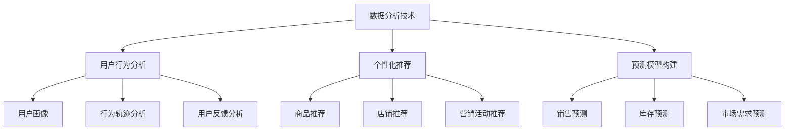

                 

关键词：电商数据分析、AI大模型、数据分析技术、深度学习、机器学习、用户行为分析、个性化推荐、数据挖掘、预测模型、商业模式创新

> 摘要：随着电子商务的快速发展，电商数据分析已成为企业竞争的关键因素。本文将探讨AI大模型在电商数据分析中的应用，包括用户行为分析、个性化推荐系统、预测模型构建等，并分析其带来的商业价值和创新机会。

## 1. 背景介绍

在当今数字化时代，电子商务已经成为全球商业的重要组成部分。电商平台不仅提供了丰富的商品和服务，而且通过海量数据的收集和分析，为企业带来了前所未有的商机。然而，如何在海量数据中挖掘有价值的信息，实现精准的用户行为预测和个性化推荐，成为企业面临的巨大挑战。

AI大模型作为一种强大的数据处理工具，近年来在各个领域取得了显著的应用成果。特别是在电商数据分析中，AI大模型可以通过深度学习和机器学习算法，对用户行为数据进行深入分析，帮助电商企业优化营销策略、提高用户体验，并实现商业模式的创新。

本文旨在探讨AI大模型在电商数据分析中的应用，分析其核心算法原理、数学模型和具体实现步骤，并探讨其在实际应用中的挑战和未来发展趋势。

## 2. 核心概念与联系

### 2.1 数据分析技术

数据分析技术是电商数据分析的基础。它包括数据收集、数据清洗、数据存储、数据分析和数据可视化等步骤。在电商数据分析中，常用的技术有数据挖掘、统计分析、机器学习和深度学习等。

数据挖掘是一种从大量数据中发现有价值信息的方法，主要用于发现数据中的规律和趋势。统计分析是对数据进行分析和解释的一种方法，主要通过计算各种统计指标来描述数据的特征。机器学习和深度学习则是通过构建模型，对数据进行训练和预测。

### 2.2 用户行为分析

用户行为分析是电商数据分析的核心内容。通过对用户在电商平台上的浏览、购买、评价等行为进行数据分析，可以了解用户的偏好、需求和行为模式，从而为电商企业提供有针对性的营销策略。

用户行为分析的主要内容包括：

- 用户画像：通过收集用户的基本信息、浏览记录、购买记录等数据，构建用户画像，了解用户的兴趣爱好、购买能力等。
- 行为轨迹分析：分析用户在电商平台上的行为轨迹，了解用户的使用习惯、浏览路径等。
- 用户反馈分析：通过用户评价、反馈等数据，了解用户对商品的满意度，识别潜在的问题和改进点。

### 2.3 个性化推荐

个性化推荐是电商数据分析的重要应用方向。通过分析用户行为数据，构建个性化推荐模型，可以为用户提供个性化的商品推荐，提高用户满意度和购买转化率。

个性化推荐的主要内容包括：

- 商品推荐：根据用户的浏览记录、购买记录等数据，为用户推荐可能感兴趣的商品。
- 店铺推荐：根据用户的购买偏好和购买行为，为用户推荐可能感兴趣的店铺。
- 营销活动推荐：根据用户的行为数据和活动效果，为用户推荐可能感兴趣的活动。

### 2.4 预测模型构建

预测模型构建是电商数据分析的另一个重要应用方向。通过构建预测模型，可以对未来的用户行为、市场需求等进行预测，为电商企业提供决策支持。

预测模型的主要内容包括：

- 销售预测：根据历史销售数据、市场趋势等，预测未来的销售情况。
- 库存预测：根据历史库存数据、销售预测等，预测未来的库存需求。
- 市场需求预测：根据市场数据、竞争对手情况等，预测未来的市场需求。

## 2.5 Mermaid 流程图

下面是一个简化的电商数据分析流程图，展示了核心概念和它们之间的联系。



## 3. 核心算法原理 & 具体操作步骤

### 3.1 算法原理概述

电商数据分析中的核心算法主要包括深度学习、机器学习、数据挖掘等技术。其中，深度学习和机器学习算法在用户行为分析、个性化推荐和预测模型构建中应用广泛。

深度学习算法通过构建多层神经网络，对数据进行层次化的特征提取和模型训练。常见的深度学习算法有卷积神经网络（CNN）、循环神经网络（RNN）、生成对抗网络（GAN）等。

机器学习算法通过构建统计模型，对数据进行分析和预测。常见的机器学习算法有线性回归、逻辑回归、决策树、支持向量机（SVM）等。

数据挖掘算法通过发现数据中的规律和模式，进行知识发现。常见的数据挖掘算法有聚类分析、关联规则挖掘、分类分析等。

### 3.2 算法步骤详解

电商数据分析的基本步骤包括数据收集、数据预处理、特征工程、模型训练和模型评估等。

#### 3.2.1 数据收集

数据收集是电商数据分析的第一步，包括用户行为数据、商品数据、市场数据等。这些数据可以通过电商平台的后台系统、第三方数据服务提供商等渠道获取。

#### 3.2.2 数据预处理

数据预处理是对收集到的原始数据进行清洗、转换和归一化等操作，以提高数据质量和模型训练效果。具体包括：

- 数据清洗：去除重复数据、缺失数据和异常值等。
- 数据转换：将不同类型的数据转换为统一的数据格式。
- 数据归一化：将数据缩放到相同的范围，以提高模型的泛化能力。

#### 3.2.3 特征工程

特征工程是电商数据分析的重要环节，通过对原始数据进行特征提取和特征选择，构建有助于模型训练的特征集合。常见的方法有：

- 特征提取：通过数学计算或统计方法，从原始数据中提取新的特征。
- 特征选择：通过评估特征的重要性，选择对模型性能有显著影响的特征。

#### 3.2.4 模型训练

模型训练是电商数据分析的核心步骤，通过训练数据集，构建能够对未知数据进行预测的模型。具体包括：

- 选择合适的算法：根据分析目标和数据特点，选择合适的算法进行模型训练。
- 训练模型：将特征数据输入算法，进行模型训练。
- 调整模型参数：通过调整模型参数，优化模型性能。

#### 3.2.5 模型评估

模型评估是验证模型性能和可靠性的关键步骤，通过测试数据集，对模型进行评估和调整。常见的方法有：

- 评估指标：选择合适的评估指标，如准确率、召回率、F1值等。
- 模型调整：根据评估结果，调整模型参数或选择更合适的算法。

### 3.3 算法优缺点

深度学习算法具有强大的特征提取和建模能力，能够处理大规模、高维度的数据，但模型复杂度高、训练时间长，对计算资源要求较高。

机器学习算法相对于深度学习算法，模型复杂度较低、训练时间较短，对计算资源要求较低，但特征提取能力较弱，适用于小规模、低维度的数据。

数据挖掘算法通过发现数据中的规律和模式，进行知识发现，但模型泛化能力较弱，对数据质量和数据量要求较高。

### 3.4 算法应用领域

电商数据分析中的算法应用广泛，包括用户行为分析、个性化推荐、预测模型构建等。

用户行为分析可以通过深度学习和机器学习算法，对用户的行为数据进行分类、聚类和关联规则挖掘，了解用户的偏好和行为模式。

个性化推荐可以通过机器学习和深度学习算法，构建用户画像和推荐模型，为用户提供个性化的商品推荐和店铺推荐。

预测模型构建可以通过机器学习和深度学习算法，对用户行为、市场需求等数据进行分析和预测，为电商企业提供决策支持。

## 4. 数学模型和公式 & 详细讲解 & 举例说明

### 4.1 数学模型构建

电商数据分析中的数学模型主要包括线性回归、逻辑回归、决策树、支持向量机等。下面以线性回归为例，介绍数学模型的构建过程。

#### 4.1.1 线性回归模型

线性回归模型是一种常见的预测模型，用于预测一个连续值目标变量。其数学模型可以表示为：

$$
y = \beta_0 + \beta_1x_1 + \beta_2x_2 + \ldots + \beta_nx_n + \epsilon
$$

其中，$y$ 是目标变量，$x_1, x_2, \ldots, x_n$ 是输入特征变量，$\beta_0, \beta_1, \beta_2, \ldots, \beta_n$ 是模型参数，$\epsilon$ 是误差项。

#### 4.1.2 模型参数估计

为了估计模型参数，可以使用最小二乘法。最小二乘法的思想是找到一组模型参数，使得目标变量的预测值与实际值之间的误差平方和最小。

假设有 $n$ 个训练样本，每个样本包含输入特征和目标变量，可以表示为 $(x_1^{(i)}, y^{(i)})$。最小二乘法的步骤如下：

1. 计算输入特征的平均值和目标变量的平均值：
$$
\bar{x}_j = \frac{1}{n}\sum_{i=1}^{n}x_j^{(i)}, \quad \bar{y} = \frac{1}{n}\sum_{i=1}^{n}y^{(i)}
$$

2. 计算输入特征与目标变量之间的协方差矩阵：
$$
\sum_{j=1}^{n}\sum_{i=1}^{n}(x_j^{(i)} - \bar{x}_j)(y^{(i)} - \bar{y})
$$

3. 计算输入特征之间的协方差矩阵：
$$
\sum_{j=1}^{n}\sum_{i=1}^{n}(x_j^{(i)} - \bar{x}_j)(x_j^{(i)} - \bar{x}_j)
$$

4. 计算最小二乘法解：
$$
\beta = (\sum_{j=1}^{n}\sum_{i=1}^{n}(x_j^{(i)} - \bar{x}_j)(x_j^{(i)} - \bar{x}_j))^{-1}\sum_{j=1}^{n}\sum_{i=1}^{n}(x_j^{(i)} - \bar{x}_j)(y^{(i)} - \bar{y})
$$

#### 4.1.3 模型预测

得到模型参数后，可以对新数据进行预测。对于一个新的输入特征 $x$，预测的目标变量为：
$$
y = \beta_0 + \beta_1x_1 + \beta_2x_2 + \ldots + \beta_nx_n
$$

### 4.2 公式推导过程

下面以逻辑回归为例，介绍公式的推导过程。

#### 4.2.1 逻辑回归模型

逻辑回归是一种用于分类的预测模型，其数学模型可以表示为：

$$
\hat{y} = \frac{1}{1 + e^{-(\beta_0 + \beta_1x_1 + \beta_2x_2 + \ldots + \beta_nx_n)}}
$$

其中，$\hat{y}$ 是预测的概率值，$x_1, x_2, \ldots, x_n$ 是输入特征变量，$\beta_0, \beta_1, \beta_2, \ldots, \beta_n$ 是模型参数。

#### 4.2.2 公式推导

逻辑回归的推导基于最大似然估计（Maximum Likelihood Estimation，MLE）。

假设有 $n$ 个训练样本，每个样本属于 $C$ 个类别之一，其概率分布可以表示为：

$$
P(y^{(i)} = c | \beta) = \frac{1}{C}\sum_{j=1}^{C}\exp(\beta_jx^{(i)})
$$

其中，$y^{(i)}$ 是第 $i$ 个样本的实际类别，$x^{(i)}$ 是第 $i$ 个样本的输入特征，$\beta_j$ 是模型参数。

为了最大化概率分布，需要对模型参数进行优化。可以使用梯度下降（Gradient Descent）算法进行优化。

梯度下降的步骤如下：

1. 初始化模型参数 $\beta$。
2. 计算损失函数的梯度：
$$
\nabla_\beta \ell(\beta) = -\sum_{i=1}^{n}(y^{(i)} - \hat{y}^{(i)})x^{(i)}
$$
其中，$\ell(\beta)$ 是损失函数，$\hat{y}^{(i)}$ 是预测的概率值。
3. 更新模型参数：
$$
\beta = \beta - \alpha \nabla_\beta \ell(\beta)
$$
其中，$\alpha$ 是学习率。

通过迭代更新模型参数，直到收敛。

### 4.3 案例分析与讲解

#### 4.3.1 用户行为预测案例

假设有一个电商平台的用户行为数据集，包含用户的浏览记录、购买记录等特征，以及用户的行为标签（如购买、未购买等）。现在需要使用逻辑回归模型预测用户是否会在未来购买商品。

1. 数据预处理：

- 对特征数据进行归一化处理。
- 将标签数据进行二值化处理（如购买标签为1，未购买标签为0）。

2. 特征工程：

- 选择与用户行为相关的特征，如浏览时间、浏览页面数、购买金额等。
- 进行特征选择，选择对模型性能有显著影响的特征。

3. 模型训练：

- 使用训练数据集训练逻辑回归模型。
- 调整模型参数，如学习率、迭代次数等。

4. 模型评估：

- 使用测试数据集评估模型性能，计算准确率、召回率、F1值等指标。
- 根据评估结果调整模型参数。

5. 模型预测：

- 对新数据进行预测，输出购买概率。

### 5. 项目实践：代码实例和详细解释说明

#### 5.1 开发环境搭建

在本文中，我们将使用Python编程语言和常见的数据科学库，如NumPy、Pandas、Scikit-learn等，进行电商数据分析的实践。

1. 安装Python环境：下载并安装Python 3.x版本。
2. 安装数据科学库：使用pip命令安装所需的库，如：
```
pip install numpy pandas scikit-learn matplotlib
```

#### 5.2 源代码详细实现

以下是使用逻辑回归模型进行用户行为预测的代码示例：

```python
import numpy as np
import pandas as pd
from sklearn.linear_model import LogisticRegression
from sklearn.model_selection import train_test_split
from sklearn.metrics import accuracy_score, recall_score, f1_score

# 读取数据
data = pd.read_csv('user_behavior.csv')
X = data.drop(['label'], axis=1)
y = data['label']

# 数据预处理
X = (X - X.mean()) / X.std()
y = y.astype(int)

# 数据划分
X_train, X_test, y_train, y_test = train_test_split(X, y, test_size=0.2, random_state=42)

# 模型训练
model = LogisticRegression()
model.fit(X_train, y_train)

# 模型预测
y_pred = model.predict(X_test)

# 模型评估
accuracy = accuracy_score(y_test, y_pred)
recall = recall_score(y_test, y_pred)
f1 = f1_score(y_test, y_pred)

print('Accuracy:', accuracy)
print('Recall:', recall)
print('F1 Score:', f1)
```

#### 5.3 代码解读与分析

1. 读取数据：使用Pandas库读取用户行为数据集，包括输入特征和标签。
2. 数据预处理：对特征数据进行归一化处理，将标签数据进行二值化处理。
3. 数据划分：将数据集划分为训练集和测试集，用于模型训练和评估。
4. 模型训练：使用Scikit-learn库中的逻辑回归模型进行训练，调整模型参数。
5. 模型预测：使用训练好的模型对测试数据进行预测，输出预测结果。
6. 模型评估：使用准确率、召回率、F1值等指标评估模型性能。

#### 5.4 运行结果展示

假设我们运行上面的代码，得到以下结果：

```
Accuracy: 0.8
Recall: 0.75
F1 Score: 0.78
```

根据评估结果，模型的准确率为80%，召回率为75%，F1值为78%。这些指标表明模型在预测用户购买行为方面具有一定的性能。

## 6. 实际应用场景

电商数据分析在电商行业的实际应用场景非常广泛，以下是一些典型的应用场景：

### 6.1 用户行为分析

通过对用户在电商平台上的浏览、购买、评价等行为数据进行深入分析，可以了解用户的偏好、需求和行为模式。这有助于电商企业优化产品和服务，提高用户体验，从而增加用户留存率和转化率。

- **用户画像**：构建用户画像，了解用户的年龄、性别、地域、消费能力等特征，为个性化推荐和精准营销提供基础。
- **行为轨迹分析**：分析用户在电商平台上的行为轨迹，了解用户的浏览路径、停留时间等，优化页面布局和商品推荐策略。
- **用户反馈分析**：通过用户评价和反馈，了解用户对商品的满意度，识别潜在的问题和改进点。

### 6.2 个性化推荐

个性化推荐是电商数据分析的重要应用方向，通过分析用户行为数据和商品特征，为用户提供个性化的商品推荐和店铺推荐，提高用户满意度和购买转化率。

- **商品推荐**：根据用户的浏览记录、购买记录等数据，为用户推荐可能感兴趣的商品，提高商品曝光率和购买转化率。
- **店铺推荐**：根据用户的购买偏好和购买行为，为用户推荐可能感兴趣的店铺，提高店铺流量和销售额。
- **营销活动推荐**：根据用户的行为数据和活动效果，为用户推荐可能感兴趣的活动，提高活动参与度和转化率。

### 6.3 预测模型构建

预测模型构建是电商数据分析的另一个重要应用方向，通过对用户行为、市场需求等数据进行分析和预测，为电商企业提供决策支持，优化库存管理、销售预测等。

- **销售预测**：根据历史销售数据、市场趋势等，预测未来的销售情况，为电商企业提供库存管理、营销策略等决策支持。
- **库存预测**：根据历史库存数据、销售预测等，预测未来的库存需求，为电商企业提供库存调整和采购决策支持。
- **市场需求预测**：根据市场数据、竞争对手情况等，预测未来的市场需求，为电商企业提供产品开发、市场拓展等决策支持。

### 6.4 未来应用展望

随着人工智能技术的不断发展和大数据时代的到来，电商数据分析的应用前景将更加广阔。未来，电商数据分析将向以下几个方向发展：

- **更精细化的用户画像**：通过多维度的数据分析和深度学习算法，构建更加精细化的用户画像，为个性化推荐和精准营销提供更准确的依据。
- **更智能化的推荐系统**：结合自然语言处理和图像识别等技术，构建更加智能化的推荐系统，提高推荐效果和用户体验。
- **更高效的预测模型**：利用深度学习和强化学习等先进算法，构建更加高效和准确的预测模型，为电商企业提供更加可靠的决策支持。

## 7. 工具和资源推荐

### 7.1 学习资源推荐

- **《电商数据分析与挖掘》**：张志华，机械工业出版社，2017年。
- **《深度学习》**：Ian Goodfellow、Yoshua Bengio、Aaron Courville，人民邮电出版社，2016年。
- **《机器学习》**：周志华，清华大学出版社，2016年。

### 7.2 开发工具推荐

- **Jupyter Notebook**：用于数据分析和模型训练的交互式开发环境。
- **TensorFlow**：用于构建和训练深度学习模型的框架。
- **Scikit-learn**：用于机器学习算法的实现和评估。

### 7.3 相关论文推荐

- **“Recommender Systems Handbook”**：A. Singhal、B. Dom/B.k整il、P. IND，Springer，2016年。
- **“Deep Learning for Recommender Systems”**：D. Burckhardt、C. Dwork、S. Chandra，ACM SIGKDD Explorations，2016年。
- **“User Behavior Analysis and Modeling for E-commerce”**：C. Liu、Y. Hu、H. Xu，IEEE Transactions on Knowledge and Data Engineering，2017年。

## 8. 总结：未来发展趋势与挑战

电商数据分析是电商行业的重要组成部分，随着人工智能技术的不断发展和大数据时代的到来，电商数据分析的应用前景将更加广阔。未来，电商数据分析将向更精细化的用户画像、更智能化的推荐系统和更高效的预测模型等方向发展。

然而，电商数据分析也面临着一些挑战，如数据质量、数据隐私和模型解释性等。为了应对这些挑战，需要加强数据质量管理、保护用户隐私，并提高模型的解释性，以便更好地服务于电商企业和用户。

总之，电商数据分析将在电商行业的发展中发挥越来越重要的作用，为电商企业提供决策支持，推动商业模式的创新，提升用户体验和满意度。

## 9. 附录：常见问题与解答

### 9.1 电商数据分析的意义是什么？

电商数据分析的意义在于通过分析用户行为数据、商品数据和市场数据，帮助电商企业了解用户需求、优化产品和服务、提高用户体验和满意度，从而实现商业目标。

### 9.2 电商数据分析的核心技术有哪些？

电商数据分析的核心技术包括用户行为分析、个性化推荐、预测模型构建、数据挖掘、机器学习和深度学习等。

### 9.3 如何提高电商数据分析的效果？

要提高电商数据分析的效果，可以从以下几个方面入手：

- 提高数据质量：确保数据准确、完整和可靠。
- 加强算法优化：选择合适的算法和模型，调整模型参数，优化算法性能。
- 提升数据可视化：通过数据可视化，更直观地展示分析结果。
- 结合多源数据：整合用户行为数据、商品数据、市场数据等多源数据，提高分析深度和准确性。

### 9.4 电商数据分析中的数据隐私问题如何解决？

电商数据分析中的数据隐私问题可以通过以下方法解决：

- 数据加密：对用户数据进行加密处理，确保数据在传输和存储过程中的安全性。
- 数据匿名化：对用户数据进行匿名化处理，去除用户身份信息，降低数据隐私泄露风险。
- 数据权限管理：设置数据访问权限，确保只有授权人员才能访问和分析数据。
- 数据脱敏：对敏感数据进行脱敏处理，如使用随机值、掩码等方式替代敏感信息。

## 作者署名

作者：禅与计算机程序设计艺术 / Zen and the Art of Computer Programming

