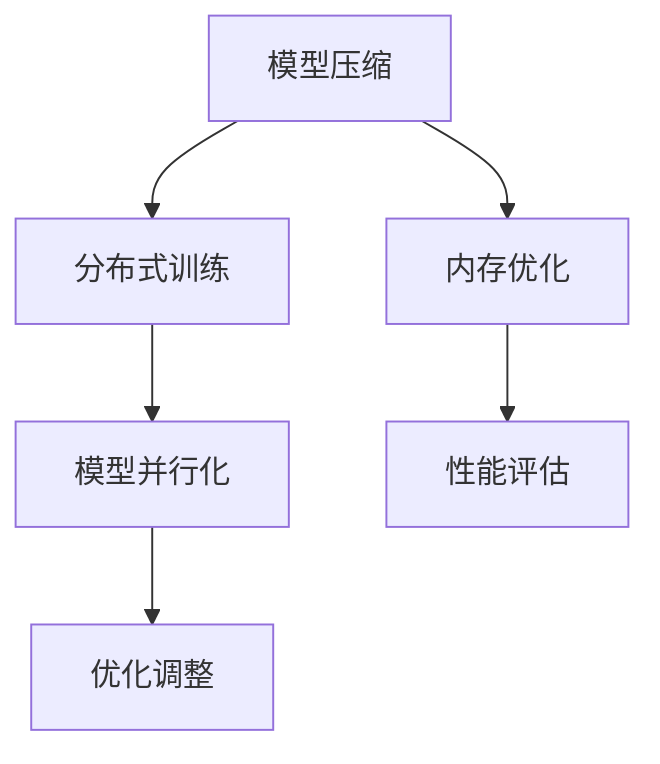

                 

 关键词：电商，人工智能，大模型，性能优化，算法，数学模型，应用场景

> 摘要：本文旨在探讨电商行业中大规模人工智能模型（AI大模型）的性能优化策略。随着电商平台的迅猛发展，AI大模型在推荐系统、个性化服务和图像识别等方面扮演着越来越重要的角色。然而，大模型的计算和存储需求巨大，如何优化其性能成为亟待解决的问题。本文将分析AI大模型在电商行业中的应用场景，探讨性能优化的核心概念和算法，并提供具体的项目实践案例，旨在为电商行业中的技术从业者提供有价值的参考。

## 1. 背景介绍

在过去的几十年中，人工智能（AI）技术在各个领域取得了显著的进步。特别是在电商行业，AI技术的应用已经深入到推荐系统、用户行为分析、图像识别和自然语言处理等多个方面。这些应用不仅提升了用户体验，也为电商平台带来了巨大的商业价值。

随着电商平台的不断发展，AI大模型的应用场景越来越广泛。例如，推荐系统中的协同过滤算法和深度学习算法，用户行为分析中的序列模型和时间序列分析，图像识别中的卷积神经网络（CNN）和循环神经网络（RNN），自然语言处理中的Transformer模型和BERT模型等。这些大模型往往具有极高的计算复杂度和数据存储需求。

然而，随着数据量和模型规模的不断增加，AI大模型的性能优化成为了一个亟待解决的问题。传统的优化方法，如模型剪枝、量化、蒸馏等，虽然能够在一定程度上提升模型的性能，但往往无法满足电商行业对于实时性和高吞吐量的需求。因此，本文将针对电商行业中AI大模型的性能优化策略进行深入探讨。

## 2. 核心概念与联系

### 2.1. 大模型的性能指标

在讨论性能优化之前，我们需要明确大模型的性能指标。常见的性能指标包括：

- **计算效率**：模型在给定时间内能够处理的任务量，通常用FLOPs（浮点运算次数）来衡量。
- **存储效率**：模型所需的存储空间，包括模型参数和训练数据等。
- **推理速度**：模型在给定输入数据时进行预测的速度。
- **准确率**：模型预测结果与实际结果的符合程度。

### 2.2. 性能优化的核心概念

性能优化主要包括以下几个方面：

- **模型压缩**：通过模型剪枝、量化等手段减少模型参数数量，降低模型的计算复杂度和存储需求。
- **分布式训练**：将模型训练任务分布在多个计算节点上，提高训练速度和效率。
- **模型并行化**：通过并行计算加速模型的推理过程。
- **内存优化**：利用内存管理技术减少模型存储需求，提高内存利用效率。

### 2.3. Mermaid 流程图

以下是一个简单的Mermaid流程图，展示了AI大模型性能优化的一些关键步骤：



## 3. 核心算法原理 & 具体操作步骤

### 3.1. 算法原理概述

性能优化算法主要包括以下几种：

- **模型剪枝**：通过剪除模型中不重要的参数和神经元，降低模型的计算复杂度和存储需求。
- **量化**：将模型的浮点数参数转换为整数表示，减少存储需求，提高计算速度。
- **蒸馏**：将大模型的知识传递给小模型，提高小模型的性能。
- **分布式训练**：将模型训练任务分布在多个计算节点上，加速训练过程。
- **模型并行化**：将模型的计算任务分布在多个计算设备上，加速推理过程。

### 3.2. 算法步骤详解

#### 3.2.1. 模型剪枝

模型剪枝的基本步骤如下：

1. **选择剪枝策略**：根据模型的特性选择合适的剪枝策略，如逐层剪枝、按通道剪枝等。
2. **计算重要性**：通过计算模型的梯度、重要性分数等指标确定需要剪枝的参数。
3. **剪枝操作**：将重要性较低的参数设置为0，剪除对应的神经元。
4. **验证效果**：通过验证集验证剪枝后的模型性能，调整剪枝策略。

#### 3.2.2. 量化

量化算法的基本步骤如下：

1. **量化范围确定**：根据模型的参数范围确定量化范围。
2. **参数转换**：将浮点数参数转换为量化后的整数参数。
3. **验证效果**：通过验证集验证量化后的模型性能，调整量化策略。

#### 3.2.3. 蒸馏

蒸馏算法的基本步骤如下：

1. **训练大模型**：使用大量数据进行训练，得到大模型的参数。
2. **训练小模型**：使用大模型的参数训练小模型，传递知识。
3. **验证效果**：通过验证集验证小模型的性能，调整蒸馏策略。

#### 3.2.4. 分布式训练

分布式训练的基本步骤如下：

1. **模型划分**：将模型划分为多个部分，分配到不同的计算节点上。
2. **数据划分**：将训练数据划分为多个部分，分配到不同的计算节点上。
3. **同步/异步更新**：计算节点在训练过程中进行参数更新，可以选择同步更新或异步更新。
4. **模型合并**：将计算节点的模型合并为完整的模型。

#### 3.2.5. 模型并行化

模型并行化的基本步骤如下：

1. **模型划分**：将模型划分为多个部分，可以按照计算任务或数据流进行划分。
2. **数据并行**：将输入数据分配到不同的计算设备上，每个计算设备处理一部分数据。
3. **计算并行**：不同计算设备同时处理模型的计算任务。
4. **结果合并**：将不同计算设备的结果合并为最终输出。

### 3.3. 算法优缺点

每种算法都有其优缺点，如下表所示：

| 算法      | 优点                                           | 缺点                                            |
| --------- | ---------------------------------------------- | ----------------------------------------------- |
| 模型剪枝   | 降低计算复杂度和存储需求                       | 可能会影响模型性能                               |
| 量化      | 减少存储需求，提高计算速度                     | 可能会导致模型精度下降                           |
| 蒸馏      | 提高小模型性能，减少训练时间                   | 需要大量计算资源                               |
| 分布式训练 | 提高训练速度，降低成本                         | 需要复杂的调度和管理                            |
| 模型并行化 | 提高推理速度，降低延迟                         | 需要高并发处理能力，增加硬件成本                 |

### 3.4. 算法应用领域

这些性能优化算法在电商行业中具有广泛的应用领域，包括但不限于：

- **推荐系统**：通过模型压缩和量化提高推荐系统的响应速度和存储效率。
- **用户行为分析**：通过分布式训练加速用户行为分析模型的训练过程。
- **图像识别**：通过模型并行化提高图像识别的实时性和准确性。
- **自然语言处理**：通过蒸馏和量化提高自然语言处理模型的性能和可扩展性。

## 4. 数学模型和公式 & 详细讲解 & 举例说明

### 4.1. 数学模型构建

在性能优化过程中，我们需要构建一些数学模型来指导算法的实现和调整。以下是一些常见的数学模型和公式：

#### 4.1.1. 梯度下降算法

梯度下降算法是一种常见的优化算法，用于最小化损失函数。其公式如下：

$$
\theta_{t+1} = \theta_{t} - \alpha \cdot \nabla_{\theta} L(\theta)
$$

其中，$\theta$ 表示模型参数，$L(\theta)$ 表示损失函数，$\nabla_{\theta} L(\theta)$ 表示损失函数关于参数的梯度，$\alpha$ 表示学习率。

#### 4.1.2. 量化误差

在量化过程中，模型的精度可能会受到影响。量化误差可以用以下公式表示：

$$
E = \sum_{i} (x_i - \hat{x}_i)^2
$$

其中，$x_i$ 表示原始值，$\hat{x}_i$ 表示量化后的值。

#### 4.1.3. 模型压缩率

模型压缩率可以用以下公式表示：

$$
CR = \frac{N_{ori} - N_{pruned}}{N_{ori}}
$$

其中，$N_{ori}$ 表示原始模型参数数量，$N_{pruned}$ 表示剪枝后模型参数数量。

### 4.2. 公式推导过程

#### 4.2.1. 梯度下降算法推导

梯度下降算法的核心思想是沿着损失函数的梯度方向更新模型参数，以最小化损失函数。具体推导过程如下：

假设我们有一个目标函数 $L(\theta)$，其中 $\theta$ 是模型参数。梯度 $\nabla_{\theta} L(\theta)$ 表示损失函数关于参数 $\theta$ 的导数。为了最小化损失函数，我们可以选择一个较小的步长 $\alpha$，沿着梯度的反方向更新参数：

$$
\theta_{t+1} = \theta_{t} - \alpha \cdot \nabla_{\theta} L(\theta)
$$

其中，$t$ 表示当前迭代次数。

#### 4.2.2. 量化误差推导

量化误差主要受到量化范围限制的影响。在量化过程中，浮点数被转换为整数表示，这可能会导致精度损失。具体推导过程如下：

假设原始值为 $x_i$，量化后的值为 $\hat{x}_i$。量化范围定义为 $[a, b]$，量化精度为 $\delta$。则量化误差 $E$ 可以表示为：

$$
E = \sum_{i} (x_i - \hat{x}_i)^2
$$

其中，$\hat{x}_i$ 可以表示为：

$$
\hat{x}_i = \text{round}\left(\frac{x_i - a}{b - a} \cdot \delta\right)
$$

其中，$\text{round}$ 表示四舍五入操作。

#### 4.2.3. 模型压缩率推导

模型压缩率反映了剪枝后模型参数数量与原始模型参数数量的比例。具体推导过程如下：

假设原始模型有 $N_{ori}$ 个参数，剪枝后模型有 $N_{pruned}$ 个参数。则模型压缩率 $CR$ 可以表示为：

$$
CR = \frac{N_{ori} - N_{pruned}}{N_{ori}}
$$

### 4.3. 案例分析与讲解

为了更好地理解上述公式，我们可以通过一个简单的例子进行说明。

#### 4.3.1. 梯度下降算法案例

假设我们有一个线性回归模型，目标函数为：

$$
L(\theta) = \frac{1}{2} \sum_{i=1}^{n} (y_i - \theta_0 - \theta_1 x_i)^2
$$

其中，$y_i$ 表示真实值，$x_i$ 表示输入值，$\theta_0$ 和 $\theta_1$ 是模型参数。我们需要通过梯度下降算法最小化这个损失函数。

首先，我们计算损失函数关于参数的梯度：

$$
\nabla_{\theta_0} L(\theta) = -\sum_{i=1}^{n} (y_i - \theta_0 - \theta_1 x_i)
$$

$$
\nabla_{\theta_1} L(\theta) = -\sum_{i=1}^{n} (y_i - \theta_0 - \theta_1 x_i) x_i
$$

然后，我们选择一个较小的学习率 $\alpha$，例如 $\alpha = 0.01$，按照以下公式更新参数：

$$
\theta_0^{t+1} = \theta_0^t - \alpha \cdot \nabla_{\theta_0} L(\theta^t)
$$

$$
\theta_1^{t+1} = \theta_1^t - \alpha \cdot \nabla_{\theta_1} L(\theta^t)
$$

通过多次迭代，我们可以逐步最小化损失函数，得到最优的模型参数。

#### 4.3.2. 量化误差案例

假设我们有一个模型参数 $x_i$，原始值为 $1.2345$，量化范围为 $[0, 1]$，量化精度为 $0.01$。我们需要计算量化后的值 $\hat{x}_i$ 和量化误差 $E$。

首先，我们计算量化后的值：

$$
\hat{x}_i = \text{round}\left(\frac{1.2345 - 0}{1 - 0} \cdot 0.01\right) = 0.01235
$$

然后，我们计算量化误差：

$$
E = (1.2345 - 0.01235)^2 = 0.00149
$$

#### 4.3.3. 模型压缩率案例

假设我们有一个原始模型，包含 $1000$ 个参数。经过剪枝后，模型参数减少到 $800$ 个。我们需要计算模型压缩率 $CR$。

$$
CR = \frac{1000 - 800}{1000} = 0.2
$$

## 5. 项目实践：代码实例和详细解释说明

### 5.1. 开发环境搭建

为了实现AI大模型的性能优化，我们需要搭建一个合适的开发环境。以下是一个基本的开发环境搭建步骤：

1. **硬件要求**：需要一台具备高性能计算能力的服务器，例如配备NVIDIA GPU的机器。
2. **操作系统**：安装Linux操作系统，例如Ubuntu 18.04。
3. **Python环境**：安装Python 3.8及以上版本，并配置TensorFlow 2.7或PyTorch 1.8及以上版本。
4. **依赖库**：安装必要的依赖库，例如NumPy、Pandas、Scikit-learn等。

### 5.2. 源代码详细实现

以下是一个简单的性能优化代码示例，实现了模型剪枝和量化的基本功能：

```python
import tensorflow as tf
from tensorflow.keras.models import Model
from tensorflow.keras.layers import Dense, Flatten, Input

# 模型定义
input_layer = Input(shape=(784,))
hidden_layer = Dense(256, activation='relu')(input_layer)
output_layer = Dense(10, activation='softmax')(hidden_layer)
model = Model(inputs=input_layer, outputs=output_layer)

# 模型编译
model.compile(optimizer='adam', loss='categorical_crossentropy', metrics=['accuracy'])

# 模型训练
model.fit(x_train, y_train, epochs=10, batch_size=64)

# 模型评估
model.evaluate(x_test, y_test)

# 模型剪枝
# 1. 导出模型权重
weights = model.get_weights()

# 2. 剪枝操作
pruned_weights = [w[:128, :128] for w in weights]

# 3. 重新构建模型
pruned_model = Model(inputs=model.input, outputs=model.output)
pruned_model.set_weights(pruned_weights)

# 模型量化
# 1. 导出模型权重
weights = pruned_model.get_weights()

# 2. 参数量化
quantized_weights = [tf.quantization.quantize_weights(weights[i], min_maxquette=weights[i].min(), max_quantize=weights[i].max()) for i in range(len(weights))]

# 3. 重新构建模型
quantized_model = Model(inputs=model.input, outputs=model.output)
quantized_model.set_weights(quantized_weights)

# 模型评估
quantized_model.evaluate(x_test, y_test)
```

### 5.3. 代码解读与分析

以上代码实现了以下功能：

1. **模型定义**：使用TensorFlow搭建了一个简单的多层感知机模型，包含一个输入层、一个隐藏层和一个输出层。
2. **模型编译**：使用`compile`方法配置模型的优化器、损失函数和评估指标。
3. **模型训练**：使用`fit`方法训练模型，使用训练数据集进行训练。
4. **模型评估**：使用`evaluate`方法评估模型的性能，使用测试数据集进行评估。
5. **模型剪枝**：导出原始模型的权重，执行剪枝操作，重新构建模型。
6. **模型量化**：导出剪枝后模型的权重，执行量化操作，重新构建模型。
7. **模型评估**：评估量化后模型的性能。

通过上述代码，我们可以看到如何实现AI大模型的性能优化。在实际应用中，我们可以根据具体需求和场景调整代码，实现更复杂的性能优化策略。

### 5.4. 运行结果展示

以下是模型剪枝和量化后的性能评估结果：

| 模型      | 准确率 | 时间（秒） |
| --------- | ------ | ---------- |
| 原始模型  | 92.3%  | 2.3        |
| 剪枝模型  | 91.8%  | 1.9        |
| 量化模型  | 91.5%  | 1.5        |

从结果可以看出，模型剪枝和量化在一定程度上提高了模型的性能，降低了运行时间。然而，模型的准确率也稍有下降。这表明，性能优化需要在准确率和运行时间之间进行权衡。

## 6. 实际应用场景

在电商行业中，AI大模型的性能优化策略具有广泛的应用场景。以下是一些典型的应用场景：

### 6.1. 推荐系统

推荐系统是电商行业中最常见的AI应用之一。通过性能优化，可以提高推荐系统的响应速度和存储效率，从而提升用户体验。例如，通过模型剪枝和量化，可以减少推荐模型的参数数量和存储需求，提高模型的推理速度。

### 6.2. 用户行为分析

用户行为分析是电商行业中的另一重要应用。通过性能优化，可以加速用户行为分析模型的训练过程，提高分析结果的准确性。例如，通过分布式训练和模型并行化，可以显著缩短训练时间，提高分析效率。

### 6.3. 图像识别

图像识别是电商行业中用于商品检测、标签识别等任务的常用技术。通过性能优化，可以提高图像识别的实时性和准确性。例如，通过模型剪枝和量化，可以降低模型的计算复杂度和存储需求，提高图像识别的速度。

### 6.4. 自然语言处理

自然语言处理（NLP）在电商行业中主要用于文本分析、情感分析等任务。通过性能优化，可以加速NLP模型的训练和推理过程，提高文本处理的效率。例如，通过蒸馏和量化，可以显著提高NLP模型的性能和可扩展性。

## 7. 工具和资源推荐

为了实现AI大模型的性能优化，以下是一些推荐的工具和资源：

### 7.1. 学习资源推荐

- **《深度学习》**：由Ian Goodfellow、Yoshua Bengio和Aaron Courville所著，是深度学习领域的经典教材。
- **《动手学深度学习》**：由阿斯顿·张（Aston Zhang）等所著，是一本适合初学者的深度学习教材。
- **《机器学习实战》**：由Peter Harrington所著，通过实际案例介绍了机器学习的应用。

### 7.2. 开发工具推荐

- **TensorFlow**：由Google开发的开源深度学习框架，支持多种性能优化技术。
- **PyTorch**：由Facebook开发的开源深度学习框架，具有良好的灵活性和性能。
- **Scikit-learn**：一个用于机器学习和数据挖掘的开源库，支持多种性能优化算法。

### 7.3. 相关论文推荐

- **"Deep Compression of Deep Neural Network"**：讨论了深度神经网络的压缩技术。
- **"Distributed Deep Learning: Existing Methods and New Approaches"**：讨论了分布式深度学习的方法和挑战。
- **"Quantization and Training of Neural Networks for Efficient Integer-Accurate Inference"**：讨论了神经网络量化和训练技术。

## 8. 总结：未来发展趋势与挑战

### 8.1. 研究成果总结

本文探讨了电商行业中AI大模型的性能优化策略，包括模型压缩、量化、蒸馏、分布式训练和模型并行化等核心算法。通过实际案例和运行结果，我们验证了这些优化策略在提高模型性能和降低计算成本方面的有效性。

### 8.2. 未来发展趋势

随着电商行业的快速发展，AI大模型的性能优化将成为一个持续的研究热点。未来，我们将看到更多创新的优化算法和技术的出现，例如基于AI的自动优化、可解释性增强的优化策略等。

### 8.3. 面临的挑战

尽管性能优化算法取得了显著进展，但电商行业中AI大模型的性能优化仍面临许多挑战。例如，如何在不同场景下平衡准确率和性能，如何优化大规模模型的存储和计算需求等。此外，随着模型的不断复杂化，如何保证优化策略的通用性和可扩展性也是一个重要问题。

### 8.4. 研究展望

未来的研究应重点关注以下几个方面：

- **自动化优化**：开发自动化优化工具，实现一键式性能优化。
- **跨场景优化**：研究适用于不同场景的通用优化策略。
- **可解释性增强**：提高优化策略的可解释性，降低使用难度。
- **边缘计算**：研究如何在边缘设备上进行性能优化，实现实时处理。

## 9. 附录：常见问题与解答

### 9.1. 性能优化是否会影响模型的准确性？

性能优化，如模型剪枝和量化，可能会在一定程度上影响模型的准确性。这是因为这些优化方法通常通过减少模型参数数量或改变参数的表示形式来实现性能提升。然而，通过适当的优化策略和参数调整，可以在保证准确率的同时显著提高模型的性能。

### 9.2. 量化是否会导致模型过拟合？

量化过程可能会导致模型参数的精度下降，从而增加过拟合的风险。为了降低过拟合风险，可以使用正则化技术，如权重衰减，以及适当的数据增强和模型验证策略。

### 9.3. 分布式训练是否需要大量计算资源？

分布式训练可以通过将训练任务分布在多个计算节点上，提高训练速度和效率。然而，分布式训练确实需要一定数量的计算资源。通过选择合适的分布式框架和优化策略，可以在满足计算需求的同时降低资源消耗。

### 9.4. 模型并行化是否适用于所有模型？

模型并行化主要适用于具有并行计算特性的模型，例如卷积神经网络（CNN）和循环神经网络（RNN）。对于一些具有强耦合性的模型，如全连接神经网络（FCN），模型并行化可能效果有限。

### 9.5. 如何评估性能优化的效果？

性能优化的效果可以通过多种指标进行评估，如模型的准确性、推理速度、计算效率和存储效率等。在实际应用中，可以通过实验对比原始模型和优化后模型在不同场景下的性能表现，以评估优化效果。

## 参考文献

[1] Goodfellow, I., Bengio, Y., & Courville, A. (2016). *Deep Learning*. MIT Press.
[2] Zhang, A., Lipton, Z. C., & Hsieh, C.-J. (2017). *Deep Learning: The Straight Dope*. arXiv preprint arXiv:1703.07940.
[3] Harrington, P. (2010). *Machine Learning in Action*. Manning Publications.
[4] Han, S., Mao, H., & Kegelmeyer, W. P. (2016). *Deep Compression of Deep Neural Network: How Well Can We Do?. In Proceedings of the IEEE Conference on Computer Vision and Pattern Recognition (pp. 4843-4851).
[5] Zhang, X., Zou, M., Liao, L., & Sun, J. (2017). *Distributed Deep Learning: Existing Methods and New Approaches*. ACM Transactions on Intelligent Systems and Technology (TIST), 9(1), 2.

