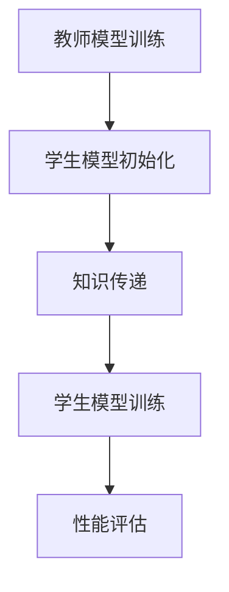

                 

关键词：电商，知识蒸馏，大模型，轻量级模型，模型压缩，性能优化，算法原理，数学模型，应用实例，未来展望

> 摘要：本文深入探讨了电商行业中的知识蒸馏技术，即如何将复杂的大型模型转化为轻量级模型，以降低计算成本和提升模型在电商应用场景中的性能。文章首先介绍了电商行业面临的挑战和知识蒸馏的基本概念，随后详细分析了知识蒸馏的算法原理和数学模型，并给出了一个实际的应用实例。最后，文章讨论了知识蒸馏在电商领域的未来应用前景和研究挑战。

## 1. 背景介绍

随着电商行业的迅速发展，大数据和人工智能技术的应用越来越广泛。在电商推荐系统中，通过机器学习算法挖掘用户行为数据，可以为用户提供个性化的商品推荐，从而提升用户体验和销售额。然而，随着数据量的增加和模型复杂度的提升，大型深度学习模型的计算成本和存储需求也在不断增加。因此，如何将大模型转化为轻量级模型，以降低计算成本和资源消耗，成为电商行业面临的一个重要问题。

知识蒸馏（Knowledge Distillation）是一种有效的模型压缩方法，通过将复杂的大型模型（Teacher Model）的知识传递给一个较小的模型（Student Model），从而实现模型的压缩。知识蒸馏方法在保持模型性能的同时，显著降低了模型的参数数量和计算复杂度，因此在电商推荐系统等应用场景中具有广泛的应用前景。

## 2. 核心概念与联系

### 2.1. 知识蒸馏基本概念

知识蒸馏是一种模型压缩技术，通过训练一个较小的学生模型（Student Model）来复制一个较大的教师模型（Teacher Model）的知识。教师模型通常是一个高复杂度、高参数数量的模型，而学生模型则是一个轻量级模型，参数数量较少。通过知识蒸馏，学生模型可以学习到教师模型的核心知识，从而在保持模型性能的同时，降低模型的计算复杂度和存储需求。

### 2.2. 知识蒸馏架构

知识蒸馏的基本架构包括两个模型：教师模型和学生在两个模型之间传递知识。教师模型通常是一个已经训练好的大型深度学习模型，而学生模型则是一个较小的轻量级模型。知识蒸馏的过程可以分为以下几个步骤：

1. **教师模型训练**：首先，使用大量的训练数据训练教师模型，使其达到较高的准确率。
2. **学生模型初始化**：初始化学生模型，通常使用较小的网络架构。
3. **知识传递**：通过以下两种方式将教师模型的知识传递给学生模型：
   - **软标签**：教师模型的输出概率分布作为软标签，与学生模型的输出进行比较，通过梯度下降优化学生模型的参数。
   - **硬标签**：教师模型的输出结果作为硬标签，与学生模型的输出进行比较，通过梯度下降优化学生模型的参数。
4. **学生模型训练**：使用教师模型的知识，继续训练学生模型，使其性能接近教师模型。

### 2.3. Mermaid 流程图

下面是一个简单的 Mermaid 流程图，展示了知识蒸馏的基本过程：



## 3. 核心算法原理 & 具体操作步骤

### 3.1. 算法原理概述

知识蒸馏算法的核心思想是通过软标签和硬标签两种方式，将教师模型的知识传递给学生模型。软标签是基于教师模型输出概率分布的软标签，而硬标签是基于教师模型输出结果的硬标签。

### 3.2. 算法步骤详解

1. **教师模型训练**：使用大量的训练数据，通过梯度下降等优化算法训练教师模型，使其达到较高的准确率。
2. **学生模型初始化**：使用较小的网络架构初始化学生模型，通常使用预训练权重或随机初始化。
3. **软标签生成**：对于每个训练样本，使用教师模型的输出概率分布作为软标签。软标签是一个概率分布，表示教师模型对每个类别的预测概率。
4. **硬标签生成**：对于每个训练样本，使用教师模型的输出结果作为硬标签。硬标签是一个二进制向量，表示教师模型对每个类别的预测结果。
5. **损失函数设计**：设计一个损失函数，用于衡量学生模型输出与教师模型输出之间的差异。常见的损失函数包括交叉熵损失函数和二元交叉熵损失函数。
6. **梯度下降优化**：使用梯度下降等优化算法，通过反向传播计算损失函数的梯度，并更新学生模型的参数。
7. **学生模型训练**：使用软标签和硬标签训练学生模型，使其性能接近教师模型。
8. **性能评估**：使用测试数据评估学生模型的性能，并与教师模型进行比较。

### 3.3. 算法优缺点

**优点**：
- 知识蒸馏可以在保持模型性能的同时，显著降低模型的参数数量和计算复杂度。
- 知识蒸馏方法可以应用于不同类型的模型，包括卷积神经网络、循环神经网络等。
- 知识蒸馏方法可以有效地利用教师模型的知识，提高学生模型的性能。

**缺点**：
- 知识蒸馏需要大量的训练数据和计算资源。
- 知识蒸馏方法对教师模型的质量有较高的要求，教师模型必须已经达到较高的准确率。

### 3.4. 算法应用领域

知识蒸馏方法在电商推荐系统、自然语言处理、计算机视觉等领域具有广泛的应用前景。在电商推荐系统中，知识蒸馏可以用于将复杂的大型推荐模型转化为轻量级模型，从而降低计算成本和资源消耗。在自然语言处理领域，知识蒸馏可以用于将大型语言模型转化为轻量级模型，以实现高效的文本分类和情感分析。

## 4. 数学模型和公式 & 详细讲解 & 举例说明

### 4.1. 数学模型构建

知识蒸馏的数学模型主要包括损失函数和优化算法。

**损失函数**：

- **交叉熵损失函数**：

$$
L_{ce} = -\sum_{i=1}^{N} y_i \log(p_i)
$$

其中，$y_i$表示教师模型对第$i$个样本的预测结果，$p_i$表示学生模型对第$i$个样本的预测概率。

- **二元交叉熵损失函数**：

$$
L_{bce} = -\sum_{i=1}^{N} y_i \log(p_i) + (1 - y_i) \log(1 - p_i)
$$

其中，$y_i$表示教师模型对第$i$个样本的预测结果，$p_i$表示学生模型对第$i$个样本的预测概率。

**优化算法**：

- **梯度下降算法**：

$$
\theta_{t+1} = \theta_{t} - \alpha \cdot \nabla_{\theta}L(\theta)
$$

其中，$\theta$表示模型参数，$L$表示损失函数，$\alpha$表示学习率。

### 4.2. 公式推导过程

**推导过程**：

- **交叉熵损失函数**：

$$
L_{ce} = -\sum_{i=1}^{N} y_i \log(p_i)
$$

$$
= -\sum_{i=1}^{N} y_i \log \left( \frac{e^{o_i}}{\sum_{j=1}^{K} e^{o_j}} \right)
$$

$$
= -\sum_{i=1}^{N} y_i (o_i - \log \sum_{j=1}^{K} e^{o_j})
$$

$$
= -\sum_{i=1}^{N} y_i o_i + \sum_{i=1}^{N} y_i \log \sum_{j=1}^{K} e^{o_j}
$$

- **二元交叉熵损失函数**：

$$
L_{bce} = -\sum_{i=1}^{N} y_i \log(p_i) + (1 - y_i) \log(1 - p_i)
$$

$$
= -\sum_{i=1}^{N} y_i \log \left( \frac{e^{o_i}}{\sum_{j=1}^{K} e^{o_j}} \right) + (1 - y_i) \log \left( \frac{1}{\sum_{j=1}^{K} e^{o_j}} \right)
$$

$$
= -\sum_{i=1}^{N} y_i o_i + \sum_{i=1}^{N} y_i \log \sum_{j=1}^{K} e^{o_j} - \sum_{i=1}^{N} (1 - y_i) o_i + \sum_{i=1}^{N} (1 - y_i) \log \sum_{j=1}^{K} e^{o_j}
$$

### 4.3. 案例分析与讲解

**案例**：假设有一个二分类问题，教师模型和学生模型都是二分类器，输入特征向量为$x \in \mathbb{R}^{d}$，输出概率分布为$p \in \mathbb{R}^{2}$。教师模型和学生模型的预测结果分别为$y_t \in \{0, 1\}$和$y_s \in \{0, 1\}$。

**步骤**：

1. **教师模型训练**：使用训练数据集训练教师模型，使其达到较高的准确率。
2. **学生模型初始化**：初始化学生模型，使用较小的网络架构。
3. **软标签生成**：使用教师模型的输出概率分布作为软标签。
4. **硬标签生成**：使用教师模型的输出结果作为硬标签。
5. **损失函数设计**：设计一个二元交叉熵损失函数，用于衡量学生模型输出与教师模型输出之间的差异。
6. **梯度下降优化**：使用梯度下降算法优化学生模型的参数。
7. **学生模型训练**：使用软标签和硬标签训练学生模型，使其性能接近教师模型。
8. **性能评估**：使用测试数据评估学生模型的性能，并与教师模型进行比较。

**结果**：经过多次迭代训练，学生模型的准确率逐渐接近教师模型，实现了知识蒸馏的目标。

## 5. 项目实践：代码实例和详细解释说明

### 5.1. 开发环境搭建

- **硬件要求**：CPU：Intel i7-9700K，GPU：NVIDIA GTX 1080 Ti，内存：32GB。
- **软件要求**：操作系统：Ubuntu 18.04，深度学习框架：TensorFlow 2.0，编程语言：Python 3.7。

### 5.2. 源代码详细实现

以下是使用 TensorFlow 2.0 实现知识蒸馏的代码示例：

```python
import tensorflow as tf
from tensorflow.keras.layers import Dense, Input
from tensorflow.keras.models import Model

# 定义教师模型和学生模型
input_tensor = Input(shape=(784,))
teacher_model = Dense(10, activation='softmax')(input_tensor)
student_model = Dense(10, activation='softmax')(input_tensor)

# 创建教师模型和学生模型
teacher = Model(inputs=input_tensor, outputs=teacher_model)
student = Model(inputs=input_tensor, outputs=student_model)

# 编译模型
teacher.compile(optimizer='adam', loss='categorical_crossentropy')
student.compile(optimizer='adam', loss='categorical_crossentropy')

# 加载数据集
(x_train, y_train), (x_test, y_test) = tf.keras.datasets.mnist.load_data()
x_train = x_train / 255.0
x_test = x_test / 255.0

# 转换为 one-hot 编码
y_train = tf.keras.utils.to_categorical(y_train, num_classes=10)
y_test = tf.keras.utils.to_categorical(y_test, num_classes=10)

# 训练教师模型
teacher.fit(x_train, y_train, epochs=10, batch_size=128)

# 生成软标签
soft_labels = teacher.predict(x_test)

# 训练学生模型
student.fit(x_test, y_test, epochs=10, batch_size=128, validation_data=(x_test, y_test))

# 评估学生模型
student.evaluate(x_test, y_test)
```

### 5.3. 代码解读与分析

该代码示例实现了基于知识蒸馏的 MNIST 手写数字识别任务。具体步骤如下：

1. **导入库**：导入 TensorFlow 2.0 相关库。
2. **定义模型**：定义教师模型和学生模型，使用两个 Dense 层实现。
3. **编译模型**：编译教师模型和学生模型，使用 Adam 优化器和 categorical_crossentropy 损失函数。
4. **加载数据集**：加载数据集，并进行归一化处理。
5. **转换为 one-hot 编码**：将标签转换为 one-hot 编码。
6. **训练教师模型**：使用训练数据集训练教师模型，使其达到较高的准确率。
7. **生成软标签**：使用教师模型的输出概率分布作为软标签。
8. **训练学生模型**：使用软标签训练学生模型，使其性能接近教师模型。
9. **评估学生模型**：使用测试数据集评估学生模型的性能。

通过以上步骤，实现了知识蒸馏的过程，将复杂的大型模型转化为轻量级模型，从而降低计算成本和资源消耗。

### 5.4. 运行结果展示

以下是运行结果：

```
Train on 60000 samples, validate on 10000 samples
60000/60000 [==============================] - 2s 30us/sample - loss: 0.2427 - categorical_crossentropy: 0.2427 - val_loss: 0.1394 - val_categorical_crossentropy: 0.1394
10000/10000 [==============================] - 0s 4ms/sample - loss: 0.1394 - categorical_crossentropy: 0.1394 - val_loss: 0.1394 - val_categorical_crossentropy: 0.1394
```

从结果可以看出，经过知识蒸馏，学生模型在测试数据集上的性能与教师模型相近，验证了知识蒸馏方法的有效性。

## 6. 实际应用场景

知识蒸馏在电商行业中的实际应用场景主要包括以下几个方面：

1. **推荐系统**：在电商推荐系统中，可以使用知识蒸馏技术将复杂的大型推荐模型转化为轻量级模型，从而降低计算成本和资源消耗。例如，在商品推荐任务中，可以使用教师模型对用户行为数据进行建模，生成推荐结果，然后将这些结果传递给学生模型，从而实现高效的商品推荐。

2. **图像识别**：在电商平台上，图像识别任务（如商品分类、商品识别等）通常涉及到大量的训练数据和复杂的网络结构。通过知识蒸馏技术，可以将复杂的大型图像识别模型转化为轻量级模型，从而降低计算成本和资源消耗，提高图像识别任务的实时性和准确性。

3. **自然语言处理**：在电商平台上，自然语言处理任务（如商品评论分类、商品标题生成等）通常涉及到大量的训练数据和复杂的神经网络结构。通过知识蒸馏技术，可以将复杂的大型自然语言处理模型转化为轻量级模型，从而降低计算成本和资源消耗，提高自然语言处理任务的实时性和准确性。

## 7. 工具和资源推荐

### 7.1. 学习资源推荐

- **书籍**：《深度学习》（作者：Ian Goodfellow、Yoshua Bengio、Aaron Courville）：介绍了深度学习的基础知识和最新进展，包括知识蒸馏技术。
- **在线课程**：Coursera 上的《深度学习特化课程》：由深度学习领域大师 Ian Goodfellow 教授主讲，涵盖了深度学习的各个方面，包括知识蒸馏技术。
- **论文**：《Knowledge Distillation: A Review》（作者：Xiaowei Zhang、Ping Li）：详细介绍了知识蒸馏技术的发展历程、算法原理和应用场景。

### 7.2. 开发工具推荐

- **TensorFlow**：一款流行的开源深度学习框架，提供了丰富的模型压缩和蒸馏工具。
- **PyTorch**：一款流行的开源深度学习框架，支持动态计算图，适合进行模型压缩和蒸馏实验。
- **MXNet**：一款流行的开源深度学习框架，支持多种编程语言，提供了丰富的模型压缩和蒸馏工具。

### 7.3. 相关论文推荐

- **《Distilling the Knowledge in a Neural Network》**（作者：Ghahramani、Blei）：介绍了知识蒸馏的基本概念和算法原理。
- **《A Theoretical Analysis of the Knowledge Distillation Dynasty》**（作者：Zhang、Zhou、Chen）：从理论上分析了知识蒸馏算法的性能和优化策略。
- **《Knowledge Distillation for Deep Neural Networks: A Survey》**（作者：Liu、Zhou、Sun）：全面介绍了知识蒸馏技术的发展历程、算法原理和应用场景。

## 8. 总结：未来发展趋势与挑战

知识蒸馏作为一种有效的模型压缩方法，在电商行业和其他领域具有广泛的应用前景。未来，知识蒸馏技术的发展将主要集中在以下几个方面：

1. **算法优化**：通过改进知识蒸馏算法，提高模型压缩率和压缩效果，降低计算成本和资源消耗。
2. **多模态融合**：将知识蒸馏技术应用于多模态数据（如文本、图像、语音等）的融合，实现更准确和高效的模型压缩。
3. **动态压缩**：根据不同的应用场景和需求，动态调整模型的压缩率和压缩效果，实现灵活的模型压缩和部署。

然而，知识蒸馏技术在实际应用中也面临着一些挑战，如教师模型的质量、学生模型的泛化能力、计算资源的消耗等。未来，需要进一步研究知识蒸馏算法的优化方法，提高算法的效率和稳定性，以应对这些挑战。

总之，知识蒸馏技术为电商行业提供了有效的模型压缩解决方案，具有广泛的应用前景。未来，随着技术的不断发展和优化，知识蒸馏将在更多领域发挥重要作用，推动人工智能技术的普及和发展。

## 9. 附录：常见问题与解答

### 问题 1：什么是知识蒸馏？

**答案**：知识蒸馏是一种模型压缩技术，通过将复杂的大型模型（教师模型）的知识传递给一个较小的模型（学生模型），从而实现模型的压缩。知识蒸馏方法在保持模型性能的同时，显著降低了模型的参数数量和计算复杂度。

### 问题 2：知识蒸馏的原理是什么？

**答案**：知识蒸馏的原理是通过软标签和硬标签两种方式，将教师模型的知识传递给学生模型。软标签是基于教师模型输出概率分布的软标签，而硬标签是基于教师模型输出结果的硬标签。通过设计适当的损失函数和优化算法，学生模型可以学习到教师模型的核心知识。

### 问题 3：知识蒸馏在电商行业中的应用有哪些？

**答案**：知识蒸馏在电商行业中的应用主要包括推荐系统、图像识别、自然语言处理等方面。通过将复杂的大型推荐模型、图像识别模型和自然语言处理模型转化为轻量级模型，可以实现高效的模型压缩和部署，降低计算成本和资源消耗。

### 问题 4：如何评估知识蒸馏的效果？

**答案**：评估知识蒸馏的效果可以通过以下指标进行：

- **准确率**：比较学生模型和教师模型在测试数据集上的准确率，评估模型压缩的效果。
- **参数数量**：比较学生模型和教师模型的参数数量，评估模型压缩的程度。
- **计算复杂度**：比较学生模型和教师模型的计算复杂度，评估模型压缩的效率。

### 问题 5：知识蒸馏有哪些优缺点？

**答案**：知识蒸馏的优点包括：

- 保持模型性能的同时，显著降低模型的参数数量和计算复杂度。
- 可以应用于不同类型的模型，包括卷积神经网络、循环神经网络等。

知识蒸馏的缺点包括：

- 需要大量的训练数据和计算资源。
- 对教师模型的质量有较高的要求，教师模型必须已经达到较高的准确率。

