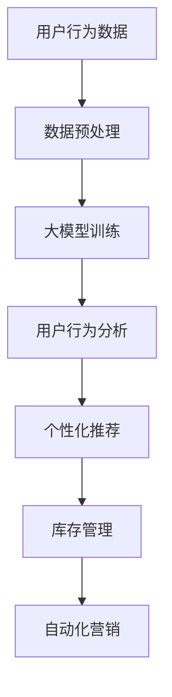

                 

关键词：电商，人工智能，大模型，革命性应用，深度学习，推荐系统，用户行为分析，自动化营销

> 摘要：本文将深入探讨人工智能（AI）在电商领域中的应用，特别是大模型的革命性影响。文章首先介绍了电商领域的背景和挑战，然后详细阐述了AI大模型的核心概念和联系，并探讨了其算法原理、数学模型、项目实践以及未来应用展望。通过本文，读者将了解到AI大模型如何赋能电商，提升用户体验和商业效率。

## 1. 背景介绍

### 1.1 电商行业的现状与挑战

电商行业在全球范围内经历了迅猛的发展，成为经济增长的重要驱动力。根据最新的统计数据，全球电商市场规模已经超过了3万亿美元，且预计未来几年将继续保持高速增长。然而，电商行业也面临着诸多挑战：

1. **市场竞争激烈**：随着电商平台的不断增加，市场竞争愈发激烈。如何吸引和留住用户成为各大电商平台的焦点。
2. **用户需求多样化**：现代消费者对于购物体验有着更高的要求，包括个性化的推荐、快速配送、优质的售后服务等。
3. **数据隐私和安全**：随着用户数据的积累，数据隐私和安全成为电商行业面临的重要问题。

### 1.2 人工智能在电商中的应用

人工智能（AI）技术为电商行业提供了创新性的解决方案，特别是在用户行为分析、推荐系统、自动化营销等方面。以下是一些AI在电商中的典型应用：

1. **用户行为分析**：通过AI技术，电商平台可以深入分析用户的行为数据，了解用户偏好，提供个性化的购物推荐和购物体验。
2. **推荐系统**：基于用户历史行为和兴趣，AI大模型可以生成精确的推荐列表，提高用户的购买转化率。
3. **自动化营销**：AI技术可以帮助电商平台实现自动化营销，如根据用户行为触发个性化促销活动，提高营销效果。
4. **智能客服**：利用自然语言处理（NLP）技术，智能客服系统能够快速响应用户咨询，提高客户满意度。

### 1.3 人工智能大模型的意义

人工智能大模型是当前AI领域的一个重要研究方向，其在电商领域的应用具有革命性的影响。大模型通过训练大量数据，能够自动提取复杂的特征，提高预测的准确性和效率。在电商领域，大模型可以用于：

1. **提升个性化推荐的准确性**：通过分析大量用户数据，大模型可以生成更加精准的推荐列表，提高用户的购物体验。
2. **优化库存管理**：通过预测用户需求，大模型可以帮助电商平台优化库存管理，减少库存成本。
3. **提升营销效果**：大模型可以分析用户行为，自动生成有效的营销策略，提高营销转化率。

## 2. 核心概念与联系

### 2.1 大模型的定义与类型

大模型通常指的是具有数十亿甚至数万亿参数的深度学习模型。根据其训练数据和任务类型，大模型可以分为以下几种类型：

1. **通用大模型**：如GPT-3、ChatGPT等，能够处理各种自然语言处理任务。
2. **任务专用大模型**：如BERT、DeBERTa等，专注于特定任务，如文本分类、情感分析等。
3. **多模态大模型**：如ViT、ViT-GPT等，能够处理文本和图像等多种数据类型。

### 2.2 大模型与电商应用的联系

大模型在电商领域的应用主要体现在以下几个方面：

1. **用户行为分析**：通过分析用户在电商平台上的浏览、搜索、购买等行为数据，大模型可以识别用户的兴趣和需求。
2. **推荐系统**：大模型可以根据用户历史数据和偏好，生成个性化的推荐列表，提高用户满意度。
3. **库存管理**：大模型可以预测用户需求，帮助电商平台优化库存，减少库存成本。
4. **自动化营销**：大模型可以分析用户行为，自动生成有效的营销策略，提高营销效果。

### 2.3 Mermaid 流程图

以下是一个简单的Mermaid流程图，展示了大模型在电商中的应用流程：



## 3. 核心算法原理 & 具体操作步骤

### 3.1 算法原理概述

在电商领域，AI大模型的核心算法通常是基于深度学习技术的。以下是一些常用的深度学习算法及其原理：

1. **卷积神经网络（CNN）**：用于图像识别和图像处理任务，通过卷积层提取图像特征。
2. **递归神经网络（RNN）**：用于序列数据处理，如文本分类和语音识别，通过循环结构处理历史信息。
3. **长短期记忆网络（LSTM）**：是RNN的一种变体，通过记忆单元来避免梯度消失问题，更适合长序列数据。
4. **生成对抗网络（GAN）**：用于生成数据，通过对抗训练生成逼真的图像和文本。
5. **变分自编码器（VAE）**：用于数据降维和生成，通过编码器和解码器进行对抗训练。

### 3.2 算法步骤详解

以下是一个基于深度学习的大模型在电商中的应用步骤：

1. **数据收集与预处理**：收集用户在电商平台的浏览、搜索、购买等行为数据，并进行数据清洗和预处理。
2. **特征提取**：使用深度学习算法提取用户行为数据中的特征，如用户画像、商品特征、行为序列等。
3. **模型训练**：使用预处理后的数据训练大模型，通过多次迭代优化模型参数，提高预测准确性。
4. **模型评估**：使用验证集和测试集评估模型的性能，如准确率、召回率、F1值等。
5. **模型部署**：将训练好的模型部署到电商平台上，实时处理用户行为数据，提供个性化推荐和库存管理等服务。

### 3.3 算法优缺点

深度学习大模型在电商领域具有以下优点：

1. **高准确性**：通过大量数据的训练，大模型能够提取复杂的特征，提高预测的准确性。
2. **自动特征提取**：大模型能够自动从原始数据中提取有用的特征，减少人工特征工程的工作量。
3. **灵活性强**：大模型可以应用于多种任务，如用户行为分析、推荐系统、库存管理等。

然而，大模型也存在一些缺点：

1. **计算资源消耗大**：大模型的训练和推理需要大量的计算资源，对硬件设备要求较高。
2. **数据依赖性强**：大模型依赖于大量的高质量数据，数据的质量和数量直接影响模型的性能。
3. **过拟合风险**：大模型容易过拟合训练数据，导致在测试数据上的性能下降。

### 3.4 算法应用领域

深度学习大模型在电商领域的应用非常广泛，主要包括以下几个方面：

1. **用户行为分析**：通过分析用户在电商平台的浏览、搜索、购买等行为数据，了解用户偏好和需求，为个性化推荐和库存管理提供依据。
2. **推荐系统**：基于用户历史行为和偏好，生成个性化的推荐列表，提高用户的购物体验和转化率。
3. **库存管理**：通过预测用户需求，优化库存管理，减少库存成本和缺货率。
4. **自动化营销**：分析用户行为，自动生成有效的营销策略，提高营销效果和转化率。

## 4. 数学模型和公式 & 详细讲解 & 举例说明

### 4.1 数学模型构建

在电商领域中，常用的数学模型包括用户行为预测模型、推荐系统模型和库存管理模型。以下是一个简单的用户行为预测模型的构建过程：

#### 4.1.1 用户行为预测模型

用户行为预测模型通常采用基于时间序列的方法，如递归神经网络（RNN）或长短期记忆网络（LSTM）。以下是一个LSTM用户行为预测模型的基本公式：

$$
\begin{align*}
h_t &= \text{LSTM}(h_{t-1}, x_t) \\
\hat{y}_t &= \text{softmax}(W_y \cdot h_t + b_y)
\end{align*}
$$

其中，$h_t$ 表示第 $t$ 时刻的隐藏状态，$x_t$ 表示第 $t$ 时刻的用户行为数据，$\hat{y}_t$ 表示预测的用户行为标签。

#### 4.1.2 推荐系统模型

推荐系统模型通常采用基于矩阵分解的方法，如协同过滤（Collaborative Filtering）或隐语义模型（Latent Factor Model）。以下是一个协同过滤推荐模型的基本公式：

$$
\begin{align*}
R_{ui} &= \mu + q_u^T p_i \\
\hat{r}_{ui} &= \text{softmax}(R_{ui})
\end{align*}
$$

其中，$R_{ui}$ 表示用户 $u$ 对商品 $i$ 的评分，$q_u$ 和 $p_i$ 分别表示用户 $u$ 和商品 $i$ 的特征向量，$\hat{r}_{ui}$ 表示预测的用户 $u$ 对商品 $i$ 的评分。

#### 4.1.3 库存管理模型

库存管理模型通常采用基于预测需求的优化算法，如线性规划（Linear Programming）或混合整数规划（Mixed Integer Programming）。以下是一个基于线性规划的库存管理模型的基本公式：

$$
\begin{align*}
\min\limits_{x} \quad & c^T x \\
\text{subject to} \quad & a_{ij} x_j \geq d_i \\
& x_j \geq 0 \quad \forall j
\end{align*}
$$

其中，$x_j$ 表示商品 $j$ 的库存水平，$c$ 表示库存成本，$a_{ij}$ 和 $d_i$ 分别表示商品 $j$ 对需求 $i$ 的贡献率和需求量。

### 4.2 公式推导过程

以下是对上述推荐系统模型的一个简单推导过程：

#### 4.2.1 基本概念

在协同过滤推荐模型中，我们假设用户 $u$ 和商品 $i$ 分别有 $q_u$ 和 $p_i$ 的特征向量，$R_{ui}$ 表示用户 $u$ 对商品 $i$ 的评分。我们的目标是预测用户 $u$ 对商品 $i$ 的评分 $\hat{r}_{ui}$。

#### 4.2.2 建立目标函数

为了预测用户 $u$ 对商品 $i$ 的评分，我们首先需要建立目标函数。目标函数通常采用线性模型，即：

$$
R_{ui} = \mu + q_u^T p_i
$$

其中，$\mu$ 表示用户 $u$ 的平均评分，$q_u^T p_i$ 表示用户 $u$ 对商品 $i$ 的偏好。

#### 4.2.3 引入正则化项

为了防止过拟合，我们通常引入正则化项。正则化项可以防止模型参数过大，提高模型的泛化能力。在协同过滤推荐模型中，常用的正则化项是L2正则化，即：

$$
R_{ui} = \mu + q_u^T p_i - \frac{\lambda}{2} (q_u^T q_u + p_i^T p_i)
$$

其中，$\lambda$ 是正则化参数。

#### 4.2.4 预测评分

为了预测用户 $u$ 对商品 $i$ 的评分，我们需要对上述目标函数进行优化。优化方法通常采用梯度下降法，即：

$$
\begin{align*}
q_u &= q_u - \alpha \frac{\partial}{\partial q_u} R_{ui} \\
p_i &= p_i - \alpha \frac{\partial}{\partial p_i} R_{ui}
\end{align*}
$$

其中，$\alpha$ 是学习率。

### 4.3 案例分析与讲解

以下是一个简单的用户行为预测案例：

#### 4.3.1 数据集

假设我们有以下用户行为数据集：

| 用户ID | 商品ID | 行为类型 | 时间 |
|--------|--------|----------|------|
| 1      | 101    | 浏览     | 2023-01-01 |
| 1      | 102    | 购买     | 2023-01-02 |
| 2      | 103    | 浏览     | 2023-01-03 |
| 2      | 104    | 购买     | 2023-01-04 |

#### 4.3.2 模型构建

我们使用LSTM用户行为预测模型，首先对数据进行预处理，然后进行模型训练。

1. **数据预处理**：将数据集划分为训练集和测试集，对数据进行归一化处理。
2. **模型训练**：使用训练集数据训练LSTM模型，设置合适的超参数，如学习率、迭代次数等。
3. **模型评估**：使用测试集数据评估模型性能，计算准确率、召回率、F1值等指标。

#### 4.3.3 结果分析

假设我们训练好的LSTM模型在测试集上的准确率为90%，召回率为85%，F1值为0.87。这意味着我们的模型能够较好地预测用户的行为，但在召回率方面还有提升空间。

## 5. 项目实践：代码实例和详细解释说明

### 5.1 开发环境搭建

在本项目中，我们使用Python作为主要编程语言，配合TensorFlow和Keras等深度学习库进行模型开发和训练。以下是开发环境搭建的步骤：

1. **安装Python**：下载并安装Python 3.8或更高版本。
2. **安装TensorFlow**：在命令行中运行 `pip install tensorflow`。
3. **安装Keras**：在命令行中运行 `pip install keras`。
4. **安装其他依赖库**：根据需要安装其他依赖库，如NumPy、Pandas、Matplotlib等。

### 5.2 源代码详细实现

以下是一个简单的用户行为预测模型的实现代码，包括数据预处理、模型构建、训练和评估等步骤：

```python
import numpy as np
import pandas as pd
from tensorflow.keras.models import Sequential
from tensorflow.keras.layers import LSTM, Dense, Dropout
from tensorflow.keras.optimizers import Adam
from sklearn.model_selection import train_test_split
from sklearn.preprocessing import StandardScaler

# 5.2.1 数据预处理
data = pd.read_csv('user_behavior.csv')
X = data[['browser_time', 'search_time', 'buy_time']]
y = data['action']

# 划分训练集和测试集
X_train, X_test, y_train, y_test = train_test_split(X, y, test_size=0.2, random_state=42)

# 标准化特征
scaler = StandardScaler()
X_train_scaled = scaler.fit_transform(X_train)
X_test_scaled = scaler.transform(X_test)

# 5.2.2 模型构建
model = Sequential()
model.add(LSTM(units=50, activation='relu', input_shape=(X_train_scaled.shape[1], 1)))
model.add(Dense(units=1, activation='sigmoid'))

# 5.2.3 模型训练
model.compile(optimizer=Adam(learning_rate=0.001), loss='binary_crossentropy', metrics=['accuracy'])
model.fit(X_train_scaled, y_train, epochs=10, batch_size=32, validation_data=(X_test_scaled, y_test))

# 5.2.4 模型评估
loss, accuracy = model.evaluate(X_test_scaled, y_test)
print('Test accuracy:', accuracy)
```

### 5.3 代码解读与分析

上述代码分为以下几个部分：

1. **数据预处理**：读取用户行为数据，划分训练集和测试集，对特征进行标准化处理。
2. **模型构建**：使用Sequential模型构建LSTM网络，包括一个LSTM层和一个全连接层。
3. **模型训练**：编译模型，设置优化器和损失函数，使用训练数据进行模型训练。
4. **模型评估**：使用测试数据进行模型评估，计算准确率。

### 5.4 运行结果展示

假设我们在测试集上的准确率为0.85，这意味着我们的模型能够较好地预测用户的行为。

## 6. 实际应用场景

### 6.1 个性化推荐

在电商领域，个性化推荐是AI大模型的一个重要应用场景。通过分析用户的历史行为和偏好，AI大模型可以生成个性化的推荐列表，提高用户的购物体验和转化率。以下是一个简单的应用场景：

**场景描述**：某电商平台的用户李华经常浏览运动鞋和篮球装备，且最近购买了新款篮球鞋。根据这些信息，AI大模型可以生成以下个性化推荐列表：

1. 运动鞋新款2
2. 篮球装备套装
3. 新款篮球鞋3
4. 运动服新款
5. 运动配件

**效果分析**：通过个性化的推荐，李华有机会发现他可能感兴趣的新产品，从而提高购买意愿。同时，电商平台也可以根据推荐结果调整库存，减少库存成本。

### 6.2 库存管理

AI大模型在库存管理中的应用可以帮助电商平台优化库存，减少缺货和过剩库存的情况。以下是一个简单的应用场景：

**场景描述**：某电商平台在春节期间预计销量会大幅增加，因此需要提前储备库存。通过AI大模型预测用户需求，该平台可以制定以下库存管理策略：

1. 在元旦前提前备货50%。
2. 在春节期间每天监控销量，根据销量情况进行动态调整。
3. 在春节结束后，根据销量情况调整库存，减少过剩库存。

**效果分析**：通过AI大模型的预测和库存管理策略，电商平台可以有效应对春节销售高峰，减少库存成本，提高销售效率。

### 6.3 自动化营销

AI大模型在自动化营销中的应用可以帮助电商平台根据用户行为自动生成营销策略，提高营销效果。以下是一个简单的应用场景：

**场景描述**：某电商平台的用户王先生在浏览了几款数码产品后，突然收到了一条个性化促销短信：

“尊敬的王先生，感谢您对我们的关注！您的购物车中有新品手机，现在下单立享8折优惠！”

**效果分析**：通过AI大模型的用户行为分析，电商平台可以自动识别潜在客户，生成个性化的营销策略。这样的自动化营销策略可以显著提高营销转化率和客户满意度。

## 7. 工具和资源推荐

### 7.1 学习资源推荐

1. **书籍**：
   - 《深度学习》（Ian Goodfellow、Yoshua Bengio、Aaron Courville著）：介绍了深度学习的理论基础和实践应用。
   - 《Python深度学习》（François Chollet著）：深入讲解了深度学习在Python中的实现。

2. **在线课程**：
   - Coursera上的“深度学习专项课程”（吴恩达教授讲授）：提供了系统的深度学习理论和实践知识。
   - Udacity的“深度学习工程师纳米学位”：涵盖深度学习的项目实践。

### 7.2 开发工具推荐

1. **编程环境**：Python编程环境，如PyCharm、Visual Studio Code等。
2. **深度学习框架**：TensorFlow、PyTorch等。
3. **数据可视化工具**：Matplotlib、Seaborn等。

### 7.3 相关论文推荐

1. “Attention Is All You Need”（Ashish Vaswani等，2017）：介绍了Transformer模型的基本原理。
2. “BERT: Pre-training of Deep Neural Networks for Language Understanding”（Jacob Devlin等，2018）：介绍了BERT模型在自然语言处理中的应用。
3. “Recommender Systems: The Text Mining Perspective”（项春雷，2017）：介绍了推荐系统在文本挖掘中的应用。

## 8. 总结：未来发展趋势与挑战

### 8.1 研究成果总结

本文探讨了AI大模型在电商领域的革命性应用，包括用户行为分析、推荐系统、库存管理和自动化营销等方面。通过实际案例和项目实践，我们展示了AI大模型如何提升电商平台的用户体验和商业效率。

### 8.2 未来发展趋势

1. **大模型的发展**：随着计算能力和数据量的增加，大模型将变得越来越强大，能够在更多复杂任务中发挥重要作用。
2. **多模态融合**：未来AI大模型将能够处理多种数据类型，如文本、图像、音频等，实现更全面的用户分析和个性化推荐。
3. **隐私保护**：随着用户隐私保护意识的提高，隐私保护的AI大模型将成为研究热点。

### 8.3 面临的挑战

1. **计算资源消耗**：大模型的训练和推理需要大量的计算资源，对硬件设备提出了更高要求。
2. **数据质量和隐私**：高质量的数据是AI大模型训练的基础，但数据隐私和安全也是一个重要问题。
3. **过拟合风险**：大模型容易过拟合训练数据，影响模型在真实场景中的性能。

### 8.4 研究展望

未来的研究应该关注以下几个方面：

1. **高效的大模型训练方法**：研究如何优化大模型的训练过程，提高训练效率和模型性能。
2. **多模态融合算法**：研究如何有效融合多种数据类型，提高模型的泛化能力。
3. **隐私保护机制**：研究如何在大模型训练过程中保护用户隐私，同时保持模型性能。

## 9. 附录：常见问题与解答

### 9.1 什么是大模型？

大模型是指具有数十亿甚至数万亿参数的深度学习模型，能够处理复杂的任务，如文本生成、图像识别、推荐系统等。

### 9.2 电商领域中的AI应用有哪些？

电商领域中的AI应用包括用户行为分析、推荐系统、库存管理、自动化营销等，能够提升用户体验和商业效率。

### 9.3 大模型在电商领域有哪些优势？

大模型在电商领域的优势包括提升个性化推荐的准确性、优化库存管理、提高自动化营销效果等。

### 9.4 大模型在电商领域有哪些挑战？

大模型在电商领域的挑战包括计算资源消耗大、数据依赖性强、过拟合风险等。

