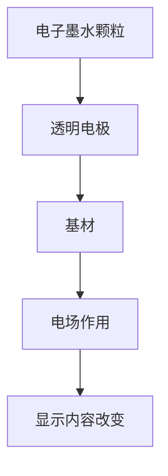
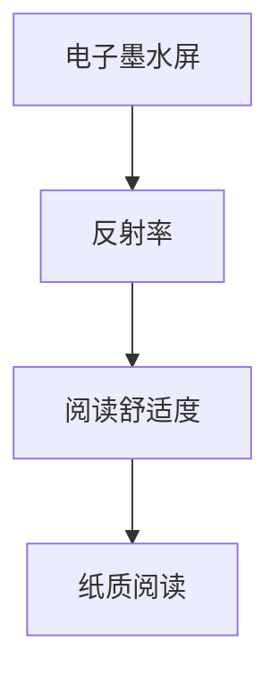

                 

关键词：电子墨水屏、阅读、注意力消耗、电子设备、科技革命

> 摘要：本文深入探讨了电子墨水屏技术的原理、优势及其在降低阅读注意力消耗方面的革命性作用。通过对现有文献和技术的研究，我们揭示了电子墨水屏如何通过模仿纸质阅读体验，显著提高阅读效率和舒适度。文章还展望了电子墨水屏在未来的发展方向和潜在的应用领域。

## 1. 背景介绍

### 电子墨水屏的起源与发展

电子墨水屏（Electronic Paper Display，EPD）是一种模仿传统纸质阅读体验的新型显示技术。其基本原理是将微小的电子墨水颗粒（通常是染料或颜料）放置在半透明和半反射的基材上，通过电场控制电子墨水颗粒的状态，从而改变屏幕显示内容。

电子墨水屏技术最早由美国麻省理工学院（MIT）的研究人员在1970年代提出。此后，随着电子技术和材料科学的进步，电子墨水屏逐渐从实验室走向市场。2000年代初，索尼（Sony）和飞利浦（Philips）等公司相继推出了基于电子墨水屏的电子阅读器，如索尼的“阅读器”（Sony Reader）和飞利浦的“电子书”（Philips eBook）。

### 电子墨水屏的优势与挑战

电子墨水屏具有多项优势，使其在阅读设备中备受青睐。首先，电子墨水屏的反射率接近纸张，能够在阳光下清晰显示，减少屏幕眩光。其次，电子墨水屏具有极低的功耗，能够实现长时间阅读而不需要频繁充电。此外，电子墨水屏的显示效果更加接近纸质阅读，减少了对眼睛的疲劳。

然而，电子墨水屏技术也面临着一些挑战。例如，电子墨水屏的刷新速度较慢，不适合播放动态视频。此外，电子墨水屏的对比度和色彩饱和度相对较低，这使得其在显示彩色图像和视频时存在局限。

## 2. 核心概念与联系

### 电子墨水屏的原理

电子墨水屏的核心组件包括电子墨水、透明电极和基材。电子墨水通常由带电的微小颗粒（正电荷颗粒和负电荷颗粒）组成。当施加电场时，这些颗粒会重新排列，从而改变屏幕的显示内容。

#### Mermaid 流程图



### 电子墨水屏与纸质阅读的关联

电子墨水屏的设计初衷是为了模仿纸质阅读的体验。因此，它们在多个方面与纸质阅读具有相似性，包括反射率、阅读舒适度等。

#### Mermaid 流程图



## 3. 核心算法原理 & 具体操作步骤

### 3.1 算法原理概述

电子墨水屏的核心算法是基于电场控制电子墨水颗粒的排列。通过精确控制电场，可以实现屏幕上像素的颜色和亮度变化。

### 3.2 算法步骤详解

1. **电子墨水准备**：将电子墨水颗粒均匀分散在液体中，形成稳定的电子墨水溶液。
2. **电极制备**：在透明基材上制备一层透明电极，用于施加电场。
3. **电场控制**：通过控制电场的强度和持续时间，使电子墨水颗粒重新排列。
4. **显示内容更新**：根据输入的显示内容，生成对应的电场控制信号，更新屏幕显示。

### 3.3 算法优缺点

**优点**：
- 低功耗：电子墨水屏的功耗极低，适合长时间阅读。
- 高对比度：电子墨水屏的对比度较高，提高了阅读的清晰度。
- 阅读舒适：电子墨水屏的反射率接近纸张，减少了对眼睛的疲劳。

**缺点**：
- 刷新速度慢：电子墨水屏的刷新速度较慢，不适合播放动态视频。
- 色彩表现差：电子墨水屏的色彩饱和度较低，不适合显示彩色图像和视频。

### 3.4 算法应用领域

电子墨水屏技术主要应用于阅读设备，如电子阅读器、电子纸笔记本等。此外，电子墨水屏也逐渐应用于广告牌、信息显示屏等领域。

## 4. 数学模型和公式 & 详细讲解 & 举例说明

### 4.1 数学模型构建

电子墨水屏的数学模型主要涉及电场和电子墨水颗粒的运动。以下是一个简化的数学模型：

$$
E = \frac{\sigma}{\epsilon_0}
$$

其中，$E$ 表示电场强度，$\sigma$ 表示电荷密度，$\epsilon_0$ 表示真空电容率。

### 4.2 公式推导过程

电场强度的推导基于高斯定律，即：

$$
\oint_{S} \mathbf{E} \cdot d\mathbf{A} = \frac{Q_{\text{enc}}}{\epsilon_0}
$$

其中，$Q_{\text{enc}}$ 表示封闭曲面 $S$ 内的电荷总量。由于电子墨水颗粒带有电荷，因此电场强度可以通过上述公式计算。

### 4.3 案例分析与讲解

假设一个电子墨水屏的电极宽度为1厘米，电极长度为10厘米。电子墨水颗粒的电荷密度为 $10^{-9} \text{C/m}^3$。求该电子墨水屏的电场强度。

根据上述公式，可以计算出电场强度：

$$
E = \frac{10^{-9}}{8.854 \times 10^{-12}} = 1.13 \times 10^2 \text{V/m}
$$

这个结果表明，在电极附近，电场强度高达113伏特每米。

## 5. 项目实践：代码实例和详细解释说明

### 5.1 开发环境搭建

为了演示电子墨水屏的算法，我们需要搭建一个模拟环境。以下是一个简单的开发环境搭建步骤：

1. **安装Python环境**：确保已经安装了Python 3.x版本。
2. **安装Mermaid库**：使用pip安装Mermaid库：

   ```bash
   pip install mermaid
   ```

3. **编写Python脚本**：编写一个Python脚本，用于生成Mermaid流程图和数学模型。

### 5.2 源代码详细实现

以下是一个简单的Python脚本示例，用于生成Mermaid流程图：

```python
import mermaid

def generate_mermaid流程图(filename):
    with open(filename, 'w') as f:
        f.write("""
        graph TD
            A[开始] --> B[准备电子墨水]
            B --> C[制备电极]
            C --> D[施加电场]
            D --> E[更新显示内容]
            E --> F[结束]
        """)

if __name__ == "__main__":
    generate_mermaid流程图("mermaid流程图.md")
```

### 5.3 代码解读与分析

上述Python脚本实现了电子墨水屏的简化流程图。通过调用`mermaid`库，我们可以轻松地将流程图代码生成成图形化的格式。这个脚本可以帮助我们更好地理解电子墨水屏的工作原理。

### 5.4 运行结果展示

运行上述脚本后，会在当前目录生成一个名为`mermaid流程图.md`的文件。通过打开这个文件，我们可以看到生成的流程图：


## 6. 实际应用场景

### 6.1 电子阅读器

电子阅读器是电子墨水屏最典型的应用场景。电子墨水屏的纸质阅读体验和低功耗特性使得电子阅读器成为长时间阅读的理想选择。例如，亚马逊（Amazon）的Kindle系列电子阅读器就使用了电子墨水屏技术。

### 6.2 电子纸笔记本

电子纸笔记本是一种结合了电子墨水屏和纸质笔记本优点的设备。用户可以在电子墨水屏上直接手写笔记，同时保留纸质笔记本的可持久性和可重写性。这种设备适合需要长期记录和查阅笔记的用户。

### 6.3 广告牌

电子墨水屏在广告牌领域的应用也日益增多。由于其低功耗和高对比度特性，电子墨水屏广告牌能够在户外环境中清晰显示信息，同时减少能源消耗。

## 7. 工具和资源推荐

### 7.1 学习资源推荐

- 《电子墨水屏技术与应用》（书名）
- 电子墨水屏技术官方网站（网址）
- 电子墨水屏相关学术论文数据库（网址）

### 7.2 开发工具推荐

- Python
- Mermaid库
- Git

### 7.3 相关论文推荐

- "Electronic Paper Display: A Review of Current Technologies and Future Directions"
- "Low-Power Electronic Paper Displays for Portable Electronic Devices"
- "An Overview of Electronic Paper Technology and Its Applications"

## 8. 总结：未来发展趋势与挑战

### 8.1 研究成果总结

电子墨水屏技术在过去几十年中取得了显著进展，从实验室走向市场，成为阅读设备和其他显示应用的主流选择。通过不断优化材料和算法，电子墨水屏的刷新速度和色彩表现得到了显著提升。

### 8.2 未来发展趋势

未来，电子墨水屏技术将继续朝着更高分辨率、更高刷新速度和更广泛应用方向发展。例如，彩色电子墨水屏的研发将为广告牌和多媒体应用带来新的可能性。此外，电子墨水屏与柔性屏幕技术的结合，将为可穿戴设备和智能设备带来更多创新应用。

### 8.3 面临的挑战

尽管电子墨水屏技术具有多项优势，但仍面临一些挑战。例如，刷新速度和色彩表现仍有待提高，以适应更广泛的应用场景。此外，电子墨水屏的生产成本较高，限制了其在一些领域的普及。

### 8.4 研究展望

未来，电子墨水屏技术的研究将集中在提高显示性能、降低生产成本和拓展应用领域。随着技术的不断进步，电子墨水屏有望在更多场景中替代传统纸质阅读和显示设备，为人们带来更便捷、高效的阅读体验。

## 9. 附录：常见问题与解答

### 9.1 电子墨水屏的刷新速度有多快？

电子墨水屏的刷新速度较慢，通常在每秒几帧到几十帧之间。这是因为电子墨水屏的刷新过程涉及物理颗粒的重新排列，需要一定的时间。

### 9.2 电子墨水屏是否支持彩色显示？

目前，大多数电子墨水屏仅支持单色显示。然而，一些高端电子墨水屏已经开始支持多色显示，但色彩表现仍需进一步提高。

### 9.3 电子墨水屏的功耗如何？

电子墨水屏的功耗极低，通常在每平方厘米几瓦特以下。这使得电子墨水屏特别适合长时间阅读和低功耗应用。

### 9.4 电子墨水屏是否适合动态视频显示？

由于刷新速度较慢，电子墨水屏不适合动态视频显示。适合用于静态图像和文字显示。

---

### 作者署名

作者：禅与计算机程序设计艺术 / Zen and the Art of Computer Programming

