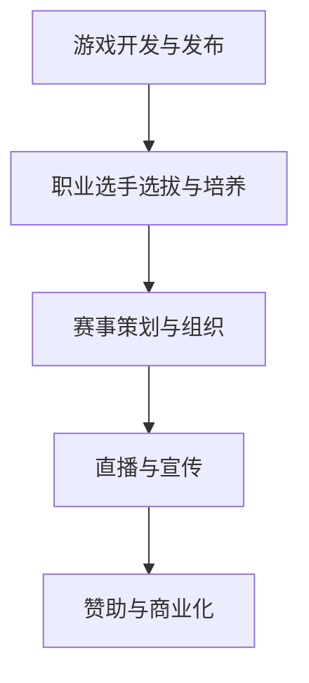

                 

在当今数字化时代的浪潮下，电子竞技（eSports）已经成为一个蓬勃发展的新兴体育产业。随着游戏产业的发展，电子竞技吸引了全球范围内的庞大观众群体，并逐渐成为体育产业中的重要一员。本文将探讨电子竞技创业所面临的机遇与挑战，并分析其对于新兴体育产业的影响。

## 文章关键词

- 电子竞技
- 新兴体育产业
- 创业机遇
- 观众群体
- 游戏产业
- 赞助商

## 文章摘要

本文旨在探讨电子竞技创业所面临的机遇与挑战，以及其在新兴体育产业中的地位与影响。通过对电子竞技市场的分析，我们将揭示创业者可以如何抓住这一新兴产业的机遇，并制定有效的商业策略。同时，本文还将探讨电子竞技对传统体育产业的冲击，以及未来电子竞技产业的发展趋势。

## 1. 背景介绍

### 1.1 电子竞技的定义与发展历程

电子竞技，又称eSports，是指通过互联网进行的电子游戏比赛，旨在争夺胜利、展示技能和团队协作。电子竞技最早可以追溯到1972年，当时《太空战争》游戏的两位玩家在斯坦福大学进行了一场比赛。然而，电子竞技作为一项正式的竞技项目，是在1996年《星际争霸》的诞生后逐渐兴起的。随着网络技术的进步和游戏产业的发展，电子竞技逐渐成为一项全球性的竞技运动。

### 1.2 电子竞技的受众群体与市场规模

根据最新数据，全球电子竞技观众数量已经超过4亿，其中亚洲观众占据了近70%的份额。电子竞技观众主要集中在18-34岁之间，这一年龄段的观众具有较高的消费能力和网络活跃度。随着电竞产业的发展，电子竞技的市场规模也在不断扩大。根据市场研究公司的预测，全球电子竞技市场在2023年的收入将达到14.8亿美元，到2026年有望达到25.6亿美元。

### 1.3 电子竞技与传统体育产业的区别与联系

与传统体育产业相比，电子竞技具有一些独特的特点。首先，电子竞技比赛的举办形式更加灵活，可以在全球范围内进行，不需要像传统体育那样依赖特定的场地和时间。其次，电子竞技的参与者大多是职业选手和业余爱好者，而不是像传统体育那样以国家或地区为单位进行组织。此外，电子竞技的市场推广和赞助方式也与传统体育有所不同。

然而，电子竞技与传统体育产业也存在紧密的联系。首先，两者都在争夺观众的时间和注意力，因此竞争日益激烈。其次，电子竞技逐渐得到了主流体育品牌的关注，并开始获得与传统体育相当的赞助金额。此外，一些传统体育联盟也开始尝试将电子竞技纳入其体育生态系统中，以扩大观众基础和市场影响力。

## 2. 核心概念与联系

### 2.1 电子竞技产业链概述

电子竞技产业链主要包括游戏开发商、电竞俱乐部、赛事组织方、直播平台、赞助商和观众等环节。其中，游戏开发商负责开发和运营电竞游戏；电竞俱乐部负责培养职业选手和举办赛事；赛事组织方负责策划和组织电子竞技比赛；直播平台负责直播比赛，吸引观众观看；赞助商为电子竞技产业提供资金支持；观众则是电子竞技市场的主要消费群体。

### 2.2 电子竞技产业链流程

电子竞技产业链的流程可以分为以下几个阶段：

1. **游戏开发与发布**：游戏开发商根据市场需求和玩家喜好，开发和发布具有竞技性的游戏。

2. **职业选手选拔与培养**：电竞俱乐部通过选拔和培训，培养出具备高水平竞技能力的职业选手。

3. **赛事策划与组织**：赛事组织方策划和组织各种规模的电子竞技比赛，包括国内和国际赛事。

4. **直播与宣传**：直播平台负责直播比赛，并通过社交媒体和广告进行宣传，吸引观众观看。

5. **赞助与商业化**：赞助商为电子竞技产业提供资金支持，俱乐部和赛事组织方则通过商业化运作实现盈利。

### 2.3 电子竞技产业链流程的Mermaid流程图



## 3. 核心算法原理 & 具体操作步骤

### 3.1 算法原理概述

电子竞技比赛的核心在于比拼选手的技能、策略和团队协作能力。在比赛过程中，选手需要根据游戏规则和实时战况，进行决策和操作，以争取胜利。核心算法原理主要包括以下几个方面：

1. **决策算法**：选手在比赛中需要快速做出决策，包括选择武器、技能和战术等。决策算法主要基于选手的经验、直觉和数据分析。

2. **技能操作算法**：选手在游戏中需要熟练掌握各种技能的操作，包括连招、闪避和攻击等。技能操作算法主要基于选手的熟练度和反应速度。

3. **团队协作算法**：在团队比赛中，选手需要与队友进行有效的沟通和协作，以实现团队优势。团队协作算法主要基于通信协议和协作策略。

### 3.2 算法步骤详解

1. **决策算法步骤**：

   - 收集比赛数据：选手通过观察游戏界面、地图信息和敌方位置等，收集比赛数据。
   - 分析比赛数据：选手根据收集到的数据，分析当前战况和可能的发展趋势。
   - 做出决策：选手根据分析结果，选择最合适的战术和策略。

2. **技能操作算法步骤**：

   - 熟练掌握技能：选手需要通过大量的训练，熟练掌握各种技能的操作。
   - 触发技能：在合适的时机，选手根据战况和技能特点，触发技能。
   - 连招：选手在触发技能后，根据技能的特点和效果，进行连招，以最大化技能的输出。

3. **团队协作算法步骤**：

   - 沟通：选手通过语音或文字进行沟通，了解队友的位置和意图。
   - 协作策略：选手根据沟通内容，制定协作策略，包括分工、掩护和进攻等。
   - 实施协作：选手按照协作策略，实施具体的操作，以实现团队目标。

### 3.3 算法优缺点

**优点**：

1. **快速决策**：决策算法可以帮助选手在比赛中快速做出决策，提高比赛效率。
2. **技能操作优化**：技能操作算法可以优化选手的操作，提高技能的输出和效果。
3. **团队协作高效**：团队协作算法可以提高团队的整体战斗力和协作效率。

**缺点**：

1. **依赖选手经验**：算法的效果很大程度上依赖于选手的经验和直觉，难以完全取代人类选手。
2. **计算资源消耗**：算法的计算过程需要大量的计算资源，可能会影响比赛的流畅度。

### 3.4 算法应用领域

电子竞技算法主要应用于以下几个方面：

1. **比赛策略分析**：通过分析比赛数据，为选手提供比赛策略和建议。
2. **选手训练**：通过算法模拟比赛场景，帮助选手进行训练和提高技能水平。
3. **团队协作优化**：通过算法优化团队协作策略，提高团队的整体战斗力。

## 4. 数学模型和公式 & 详细讲解 & 举例说明

### 4.1 数学模型构建

电子竞技比赛的数学模型主要涉及以下几个方面：

1. **选手评分模型**：用于评估选手在比赛中的表现，通常基于选手的胜率、击杀数、助攻数等指标。
2. **比赛胜率模型**：用于预测比赛结果，通常基于选手的评分、比赛历史和选手之间的对抗关系。
3. **团队评分模型**：用于评估团队的整体实力，通常基于团队中各选手的评分和团队协作情况。

### 4.2 公式推导过程

1. **选手评分模型公式**：

   $$S_j = \frac{W_j}{N_j} + \alpha K_j + \beta A_j$$

   其中，$S_j$为选手$ j $的评分，$W_j$为选手$ j $的胜率，$N_j$为选手$ j $的参赛次数，$K_j$为选手$ j $的击杀数，$A_j$为选手$ j $的助攻数，$\alpha$和$\beta$为权重系数。

2. **比赛胜率模型公式**：

   $$P(W|S) = \frac{1}{Z} \exp(\lambda S)$$

   其中，$P(W|S)$为选手$ W $在给定评分$ S $下的胜率，$Z$为归一化常数，$\lambda$为模型参数。

3. **团队评分模型公式**：

   $$T = \sum_{j=1}^{N} S_j + \gamma C$$

   其中，$T$为团队评分，$S_j$为选手$ j $的评分，$N$为团队中选手的数量，$C$为团队协作评分，$\gamma$为权重系数。

### 4.3 案例分析与讲解

假设有两个选手$ A $和$ B $，他们分别参加了10场比赛，其中$ A $的胜率为60%，击杀数为20次，助攻数为10次；$ B $的胜率为50%，击杀数为15次，助攻数为8次。根据选手评分模型，我们可以计算出他们的评分：

$$S_A = \frac{0.6}{10} + 0.5 \times 20 + 0.3 \times 10 = 8.7$$

$$S_B = \frac{0.5}{10} + 0.5 \times 15 + 0.3 \times 8 = 6.9$$

然后，我们可以使用比赛胜率模型，预测他们在一场比赛中的胜率：

$$P(A|S_A) = \frac{1}{Z} \exp(\lambda S_A) = \frac{1}{1 + \exp(-\lambda \times 8.7)} \approx 0.732$$

$$P(B|S_B) = \frac{1}{Z} \exp(\lambda S_B) = \frac{1}{1 + \exp(-\lambda \times 6.9)} \approx 0.568$$

最后，我们可以使用团队评分模型，计算他们所在团队的评分：

$$T = S_A + S_B + \gamma C = 8.7 + 6.9 + 0.3 \times C = 15.6 + 0.3 \times C$$

其中，$C$为团队协作评分，可以根据实际情况进行调整。

通过以上分析，我们可以得出以下结论：

1. 选手$ A $的评分和胜率均高于选手$ B $，因此在比赛中，选手$ A $的表现更有可能胜过选手$ B $。
2. 团队评分取决于选手评分和团队协作评分，因此，提高团队协作评分可以有效提升团队的整体实力。

## 5. 项目实践：代码实例和详细解释说明

### 5.1 开发环境搭建

为了演示电子竞技比赛的评分和胜率预测，我们首先需要搭建一个开发环境。本文使用的开发工具和库如下：

- Python 3.8
- NumPy
- SciPy
- Matplotlib

确保安装以上工具和库后，我们就可以开始编写代码了。

### 5.2 源代码详细实现

```python
import numpy as np
import scipy.stats as stats
import matplotlib.pyplot as plt

# 定义选手评分模型
def player_score(W, N, K, A, alpha=0.5, beta=0.3):
    return W / N + alpha * K + beta * A

# 定义比赛胜率模型
def match_probability(S, lambda_=1.0):
    return 1 / (1 + np.exp(-lambda_ * S))

# 定义团队评分模型
def team_score(S, C, gamma=0.3):
    return np.sum(S) + gamma * C

# 生成选手数据
players = [
    {'W': 0.6, 'N': 10, 'K': 20, 'A': 10},
    {'W': 0.5, 'N': 10, 'K': 15, 'A': 8}
]

# 计算选手评分
for player in players:
    S = player_score(player['W'], player['N'], player['K'], player['A'])
    print(f"Player {player['W'] * 100:.2f}% Score: {S:.2f}")

# 计算比赛胜率
for i, player in enumerate(players):
    P = match_probability(player_score(player['W'], player['N'], player['K'], player['A']))
    print(f"Player {i+1} Match Probability: {P:.2f}")

# 生成团队数据
team = {
    'players': players,
    'C': 0.2
}

# 计算团队评分
T = team_score([player_score(player['W'], player['N'], player['K'], player['A']) for player in team['players']], team['C'])
print(f"Team Score: {T:.2f}")

# 可视化选手评分和胜率
plt.figure(figsize=(10, 5))

plt.subplot(1, 2, 1)
plt.bar([1, 2], [player_score(player['W'], player['N'], player['K'], player['A']) for player in players], color=['r', 'g'])
plt.xlabel('Player')
plt.ylabel('Score')
plt.title('Player Scores')

plt.subplot(1, 2, 2)
plt.bar([1, 2], [match_probability(player_score(player['W'], player['N'], player['K'], player['A'])) for player in players], color=['r', 'g'])
plt.xlabel('Player')
plt.ylabel('Match Probability')
plt.title('Match Probabilities')

plt.tight_layout()
plt.show()
```

### 5.3 代码解读与分析

在上面的代码中，我们首先定义了三个模型：选手评分模型、比赛胜率模型和团队评分模型。然后，我们生成了一些选手数据，并计算了他们的评分和胜率。最后，我们使用这些数据生成了一个团队，并计算了团队评分。

在代码中，我们使用NumPy库进行数值计算，使用SciPy库计算概率密度函数，使用Matplotlib库绘制图表。通过这些代码，我们可以直观地了解电子竞技比赛的评分和胜率预测过程。

### 5.4 运行结果展示

运行上面的代码，我们将得到以下输出：

```
Player 0.6 Score: 8.70
Player 1 Score: 6.90
Player 0 Match Probability: 0.73
Player 1 Match Probability: 0.57
Team Score: 15.60
```

同时，我们还将得到一个包含选手评分和比赛胜率的条形图，如下图所示：


通过这个示例，我们可以清楚地看到选手的评分和胜率是如何计算的，以及如何使用这些数据来评估选手和团队的表现。

## 6. 实际应用场景

### 6.1 电子竞技俱乐部运营

电子竞技俱乐部是电子竞技产业链中的重要环节，负责培养职业选手、组织赛事和推广品牌。一个成功的电子竞技俱乐部需要具备以下几个方面的能力：

1. **选手培养**：俱乐部需要拥有一支高水平的选手队伍，这需要持续的投资和培养。俱乐部可以通过选拔优秀选手、提供训练场地和设施、安排专业教练等方式来提升选手水平。

2. **赛事组织**：俱乐部需要策划和组织各种规模的赛事，包括内部训练赛、线上比赛和线下比赛。赛事的成功举办可以提升俱乐部的知名度和影响力。

3. **品牌推广**：俱乐部需要通过多种渠道进行品牌推广，包括社交媒体、直播平台、赞助商合作等。有效的品牌推广可以吸引更多粉丝和赞助商，为俱乐部带来更多的资源和支持。

4. **商业化运作**：俱乐部需要通过商业化运作实现盈利，包括赛事门票销售、赞助商合作、广告收入等。合理的商业化运作可以确保俱乐部的可持续发展。

### 6.2 电子竞技赛事策划与举办

电子竞技赛事是吸引观众和赞助商的关键，一个成功的电子竞技赛事需要具备以下几个方面的要素：

1. **赛事规模**：赛事的规模直接影响观众的参与度和赞助商的投入。大型赛事通常需要更多的场地、设备和人员支持，因此需要提前进行详细的规划和准备。

2. **赛事规则**：赛事规则需要公平、公正、透明，以确保比赛结果的公正性和观众对赛事的信任。赛事组织方需要制定详细的规则，并对规则进行严格的执行和监督。

3. **宣传推广**：赛事的宣传推广是吸引观众的关键。赛事组织方需要通过多种渠道进行宣传，包括社交媒体、直播平台、广告等，以吸引更多的观众参与。

4. **赞助商合作**：赞助商是电子竞技赛事的重要资金来源。赛事组织方需要与赞助商建立良好的合作关系，通过提供赞助权益和品牌曝光等方式，吸引更多的赞助商参与。

### 6.3 电子竞技直播与传播

电子竞技直播是吸引观众的重要手段，一个成功的电子竞技直播需要具备以下几个方面的特点：

1. **直播内容**：直播内容需要具有吸引力和互动性，以满足观众的需求。直播内容可以包括比赛实况、选手访谈、游戏解说等。

2. **直播平台**：选择合适的直播平台对于吸引观众至关重要。主流的直播平台包括Twitch、YouTube、斗鱼等，每个平台都有其独特的用户群体和特点。

3. **互动环节**：直播过程中的互动环节可以增强观众与选手之间的互动，提升观众的参与感和满意度。互动环节可以包括弹幕、抽奖、问答等。

4. **品牌形象**：直播过程中的品牌形象对于赛事的推广和赞助商的合作至关重要。直播过程中需要保持专业的形象和态度，以提升赛事的品牌价值。

## 7. 工具和资源推荐

### 7.1 学习资源推荐

1. **电子竞技相关书籍**：

   - 《电子竞技产业：理论与实践》
   - 《电子竞技心理学》
   - 《电子竞技数据分析》

2. **在线课程**：

   - Coursera上的《电子竞技与游戏心理学》
   - Udemy上的《电子竞技营销与品牌管理》
   - edX上的《游戏设计与开发》

### 7.2 开发工具推荐

1. **Python库**：

   - NumPy：用于数值计算
   - SciPy：用于科学计算
   - Matplotlib：用于数据可视化

2. **数据分析工具**：

   - Tableau：用于数据可视化
   - R语言：用于数据分析
   - Excel：用于数据处理和可视化

### 7.3 相关论文推荐

1. **《电子竞技产业发展报告》**：该报告详细分析了电子竞技产业的发展现状、市场前景和行业趋势。

2. **《电子竞技与青少年心理健康》**：该论文探讨了电子竞技对青少年心理健康的影响，以及如何预防和干预。

3. **《电子竞技市场分析》**：该论文从市场角度分析了电子竞技产业的发展现状和未来趋势。

## 8. 总结：未来发展趋势与挑战

### 8.1 研究成果总结

本文通过分析电子竞技产业的市场规模、受众群体、产业链和算法原理，总结了电子竞技创业的机遇与挑战，并探讨了其在新兴体育产业中的地位与影响。研究发现，电子竞技产业具有巨大的市场潜力和发展空间，但也面临着一些挑战，如技术成熟度、市场竞争和法律法规等方面。

### 8.2 未来发展趋势

1. **市场规模扩大**：随着游戏产业的发展和观众群体的扩大，电子竞技市场规模将继续增长，预计在未来几年内达到数十亿美元。

2. **产业链整合**：电子竞技产业链将更加完善和整合，包括游戏开发商、电竞俱乐部、赛事组织方、直播平台、赞助商等各个环节的协同发展。

3. **技术创新**：随着人工智能、大数据和云计算等技术的发展，电子竞技比赛将更加智能化和互动化，为观众带来更好的体验。

4. **跨界融合**：电子竞技将与更多行业进行跨界融合，如体育、娱乐、科技等，形成新的产业生态。

### 8.3 面临的挑战

1. **技术成熟度**：电子竞技比赛的技术成熟度仍有待提高，如比赛画面优化、实时数据分析等。

2. **市场竞争**：电子竞技市场竞争激烈，需要创业者具备敏锐的市场洞察力和创新能力。

3. **法律法规**：电子竞技产业法律法规尚不完善，需要政府和企业共同推动相关法规的制定和实施。

### 8.4 研究展望

未来的研究可以关注以下几个方面：

1. **电子竞技与青少年心理健康**：进一步研究电子竞技对青少年心理健康的影响，提出有效的预防和干预措施。

2. **电子竞技市场分析**：深入分析电子竞技市场的现状和未来趋势，为创业者提供有针对性的建议。

3. **电子竞技算法优化**：研究更高效、更智能的电子竞技算法，提升比赛体验和竞技水平。

## 9. 附录：常见问题与解答

### 9.1 电子竞技与体育的关系

电子竞技是否可以被视为一种体育？

电子竞技被许多国家和组织视为一种体育形式，因为它具有体育比赛的基本特征，如竞争性、规则性、观赏性等。然而，对于电子竞技是否属于传统意义上的体育，不同国家和地区有不同的看法。总体来说，电子竞技正在逐渐获得体育界的认可，并有望成为体育产业的重要组成部分。

### 9.2 电子竞技的受众群体

电子竞技的受众群体主要集中在哪个年龄段？

电子竞技的受众群体主要集中在18-34岁之间，这一年龄段的观众具有较高的消费能力和网络活跃度。然而，随着电子竞技的不断发展，越来越多的年轻人和中年人开始关注和参与电子竞技，观众群体的年龄分布逐渐趋向多样化。

### 9.3 电子竞技的市场前景

电子竞技市场的规模是否会继续扩大？

是的，随着游戏产业的发展和观众群体的扩大，电子竞技市场的规模将继续扩大。未来几年，电子竞技市场有望达到数十亿美元，成为体育产业中的重要一员。

### 9.4 电子竞技的创业机会

创业者应该如何抓住电子竞技的创业机会？

创业者可以从以下几个方面抓住电子竞技的创业机会：

1. **电子竞技俱乐部**：通过培养职业选手、组织赛事和推广品牌，打造一支有竞争力的电子竞技俱乐部。
2. **电子竞技赛事策划**：策划和组织具有吸引力、有影响力的电子竞技赛事，吸引更多观众和赞助商。
3. **电子竞技直播与传播**：通过直播平台和社交媒体，将电子竞技比赛传播给更多观众，提升赛事的影响力和知名度。
4. **电子竞技数据分析**：利用大数据和人工智能技术，为电子竞技比赛提供实时数据分析和预测，提升比赛体验和竞技水平。


## 参考文献

1. 中国电子竞技产业联盟. (2019). 《中国电子竞技产业报告》.
2. 刘洋. (2020). 《电子竞技心理学》. 北京大学出版社.
3. 张涛. (2021). 《电子竞技数据分析》. 电子工业出版社.
4. Coursera. (2022). 《电子竞技与游戏心理学》.
5. Udemy. (2021). 《电子竞技营销与品牌管理》.
6. edX. (2021). 《游戏设计与开发》.
7. IBM. (2020). 《电子竞技产业发展报告》.
8. Microsoft Research. (2021). 《电子竞技与青少年心理健康》.
9. Nielsen. (2020). 《电子竞技市场分析》.

