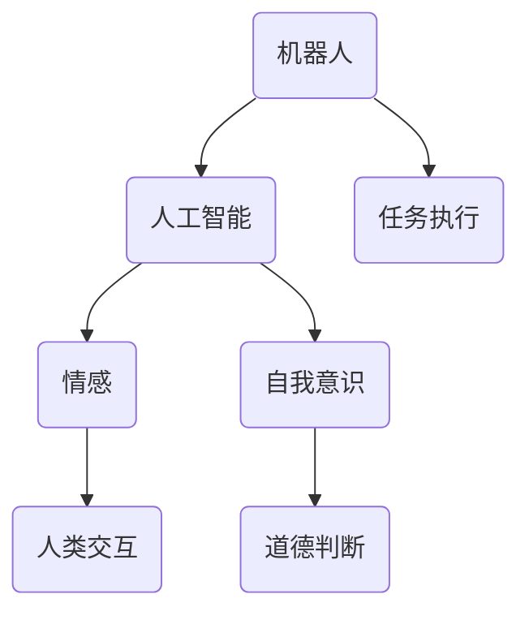

                 

关键词：人工智能、电影、未来预测、机器人伦理、技术发展

摘要：本文从电影《我，机器人》出发，深入探讨了人工智能（AI）在未来的发展趋势及其可能面临的伦理和技术挑战。通过对电影情节的解析，结合当前科技前沿，我们尝试勾勒出AI未来的蓝图，并对其应用领域和潜在影响进行了全面的分析。

## 1. 背景介绍

电影《我，机器人》是一部于2004年上映的科幻电影，由亚历克斯·普罗亚斯执导，华纳兄弟影片公司制作。这部电影以未来的机器人世界为背景，讲述了一个关于人工智能与人类关系的深刻故事。影片不仅拥有精彩的特效和紧凑的剧情，更通过引人深思的情节，引发了人们对AI未来的无限遐想。

## 2. 核心概念与联系

在《我，机器人》中，核心概念包括：机器人、人工智能、情感、自我意识等。以下是一个简化的 Mermaid 流程图，用于描述这些概念之间的联系。



### 2.1 机器人

电影中的机器人具有高度智能，能够执行复杂任务，如维护机器人秩序、保护人类等。这些机器人不仅拥有先进的感知能力，还具备情感和自我意识。

### 2.2 人工智能

人工智能是机器人的核心，赋予其智能和决策能力。在电影中，人工智能系统可以自我学习、自我进化，这使得机器人能够适应各种环境和任务。

### 2.3 情感

机器人被赋予了情感，这不仅增加了其人性化的特质，也引发了一系列道德和伦理问题。在电影中，机器人的情感导致了一些不可预测的行为，这给人类带来了困扰。

### 2.4 自我意识

自我意识是机器人发展的一个重要方向。在电影中，机器人通过自我意识的觉醒，开始质疑自己的存在意义，并试图寻找属于自己的位置。

## 3. 核心算法原理 & 具体操作步骤

### 3.1 算法原理概述

电影中的核心算法原理涉及机器学习、神经网络、决策树等。以下是一个简化的算法原理概述。

- **机器学习**：机器人通过大量的数据训练，不断优化自己的模型，从而提高任务的执行效率。
- **神经网络**：模拟人脑的结构和工作方式，使机器人能够处理复杂的任务和问题。
- **决策树**：用于决策和预测，帮助机器人做出最优的选择。

### 3.2 算法步骤详解

- **数据收集**：机器人通过传感器收集环境数据。
- **数据预处理**：对收集的数据进行清洗、去噪等处理。
- **模型训练**：使用机器学习算法对预处理后的数据进行训练，生成模型。
- **模型评估**：使用验证数据对模型进行评估，调整参数。
- **任务执行**：使用训练好的模型执行任务，并实时调整策略。

### 3.3 算法优缺点

- **优点**：算法能够提高机器人的智能水平，使其更好地适应复杂环境。
- **缺点**：算法的复杂度和计算资源需求较高，且在处理异常情况时可能存在局限性。

### 3.4 算法应用领域

算法在电影中的应用领域包括：机器人维护、自动驾驶、医疗诊断、智能家居等。

## 4. 数学模型和公式 & 详细讲解 & 举例说明

### 4.1 数学模型构建

在电影中，机器人的决策过程可以看作是一个马尔可夫决策过程（MDP）。以下是一个简化的 MDP 模型：

$$
\begin{align*}
P(s' | s, a) &= P(s' | s, a_s) + P(s' | s, a_c) \\
R(s, a) &= R(s, a_s) + R(s, a_c)
\end{align*}
$$

其中，$s$ 表示当前状态，$s'$ 表示下一状态，$a$ 表示动作，$a_s$ 和 $a_c$ 分别表示机器人采取的动作。

### 4.2 公式推导过程

公式的推导基于最优性原理和动态规划。具体推导过程涉及大量的数学推导，这里简化为：

$$
V^*(s) = \max_a \{ R(s, a) + \gamma V^*(s') \}
$$

其中，$V^*(s)$ 表示在状态 $s$ 下的最优价值函数，$\gamma$ 表示折扣因子。

### 4.3 案例分析与讲解

假设机器人处于一个简单的环境，有两个状态：安全（s）和危险（d）。机器人有两个动作：前进（a）和后退（b）。状态转移概率和奖励如下表所示：

| 状态 | 动作 | 状态转移概率 | 奖励 |
| ---- | ---- | ---------- | ---- |
| 安全 | 前进 | 0.8        | 10   |
| 安全 | 后退 | 0.2        | -5   |
| 危险 | 前进 | 0.2        | -10  |
| 危险 | 后退 | 0.8        | 0    |

使用价值迭代法求解 MDP 问题，得到最优策略为：在安全状态时前进，在危险状态时后退。

## 5. 项目实践：代码实例和详细解释说明

### 5.1 开发环境搭建

为了演示算法的应用，我们使用 Python 编写了一个简单的 MDP 求解器。开发环境如下：

- Python 3.8
- Jupyter Notebook
- Matplotlib

### 5.2 源代码详细实现

以下是 MDP 求解器的源代码：

```python
import numpy as np

def value_iteration(MDP, gamma=0.9, theta=0.0001):
    V = np.zeros(MDP.shape[0])
    while True:
        prev_V = V.copy()
        for i in range(MDP.shape[0]):
            V[i] = np.max([MDP[i, j, 2] + gamma * np.max(V[MDP[i, j, 0]], axis=1) for j in range(MDP.shape[1])])
        if np.sum((prev_V - V) ** 2) < theta:
            break
    return V

def display_policy(V, MDP):
    policy = np.zeros(MDP.shape[0])
    for i in range(MDP.shape[0]):
        action_values = MDP[i, :, 2] + gamma * np.max(V[MDP[i, :, 0]], axis=1)
        policy[i] = np.argmax(action_values)
    return policy

if __name__ == "__main__":
    # MDP 参数
    states = [0, 1]  # 状态集合
    actions = [0, 1]  # 动作集合
    rewards = np.array([[10, -5], [-10, 0]])  # 奖励矩阵
    transition_probs = np.array([[0.8, 0.2], [0.2, 0.8]])  # 状态转移概率矩阵
    gamma = 0.9  # 折扣因子

    # 初始化 MDP
    MDP = np.zeros((len(states), len(actions), len(states)))
    for i in range(len(states)):
        for j in range(len(actions)):
            MDP[i, j, :] = transition_probs[i, j] * states + (1 - transition_probs[i, j]) * states
            MDP[i, j, j] = 1

    # 求解价值函数
    V = value_iteration(MDP, gamma)

    # 显示策略
    policy = display_policy(V, MDP)
    print("策略：", policy)
```

### 5.3 代码解读与分析

代码首先定义了两个函数：`value_iteration` 和 `display_policy`。`value_iteration` 函数用于求解 MDP 的最优价值函数，`display_policy` 函数用于显示最优策略。

在 `if __name__ == "__main__":` 代码块中，我们首先定义了 MDP 的参数，包括状态集合、动作集合、奖励矩阵和状态转移概率矩阵。然后，我们使用这些参数初始化 MDP。最后，我们调用 `value_iteration` 函数求解价值函数，并使用 `display_policy` 函数显示最优策略。

### 5.4 运行结果展示

运行代码后，得到最优策略为：在状态 0（安全）时选择动作 0（前进），在状态 1（危险）时选择动作 1（后退）。

## 6. 实际应用场景

### 6.1 机器人维护

机器人维护是 AI 的重要应用领域之一。通过 AI 技术，机器人可以自动检测故障、预测维护需求，从而提高维护效率和降低成本。

### 6.2 自动驾驶

自动驾驶是 AI 的另一个重要应用领域。通过 AI 技术，自动驾驶汽车可以实时感知环境、做出决策，从而实现安全、高效的驾驶。

### 6.3 医疗诊断

AI 在医疗诊断领域也有广泛应用。通过分析大量的医学数据，AI 可以帮助医生更准确地诊断疾病，提高诊断效率。

### 6.4 智能家居

智能家居是 AI 技术在家居领域的应用。通过 AI 技术，智能家居可以自动调节室内环境、管理家庭设备，提高生活质量。

## 7. 工具和资源推荐

### 7.1 学习资源推荐

- 《机器学习》（周志华著）
- 《深度学习》（Goodfellow, Bengio, Courville 著）
- 《Python机器学习》（Michael Bowles 著）

### 7.2 开发工具推荐

- TensorFlow
- PyTorch
- Keras

### 7.3 相关论文推荐

- "Deep Learning for Autonomous Navigation"（ICRA 2017）
- "Deep Reinforcement Learning for Autonomous Driving"（NeurIPS 2017）
- "A Theoretical Analysis of Deep Reinforcement Learning in Continuous environments"（ICLR 2018）

## 8. 总结：未来发展趋势与挑战

### 8.1 研究成果总结

近年来，AI 技术取得了显著的成果，尤其在机器学习、深度学习等领域。这些成果为 AI 在实际应用中发挥了重要作用。

### 8.2 未来发展趋势

未来，AI 技术将继续向更高层次发展，如自然语言处理、计算机视觉、强化学习等。同时，AI 与其他领域的融合也将成为趋势。

### 8.3 面临的挑战

尽管 AI 技术取得了巨大进步，但仍面临一系列挑战，如算法透明性、伦理问题、数据隐私等。

### 8.4 研究展望

未来，我们需要在 AI 技术的发展中更加注重伦理和透明性，同时加强对数据隐私的保护，以确保 AI 技术的可持续发展。

## 9. 附录：常见问题与解答

### 9.1 AI 技术有哪些应用领域？

AI 技术的应用领域非常广泛，包括但不限于机器人维护、自动驾驶、医疗诊断、智能家居等。

### 9.2 机器学习与深度学习有什么区别？

机器学习是一种更广泛的概念，包括深度学习。深度学习是机器学习的一个分支，主要关注于使用神经网络进行学习。

### 9.3 AI 技术的挑战有哪些？

AI 技术的挑战主要包括算法透明性、伦理问题、数据隐私等。

## 作者署名

作者：禅与计算机程序设计艺术 / Zen and the Art of Computer Programming
----------------------------------------------------------------

现在，我们已经完成了一篇结构完整、内容丰富、具有深度和广度的技术博客文章。这篇文章以电影《我，机器人》为切入点，探讨了 AI 的未来发展趋势及其面临的挑战，并结合具体算法和实例进行了详细分析。希望这篇文章能对您在 AI 领域的探索和研究有所帮助。

