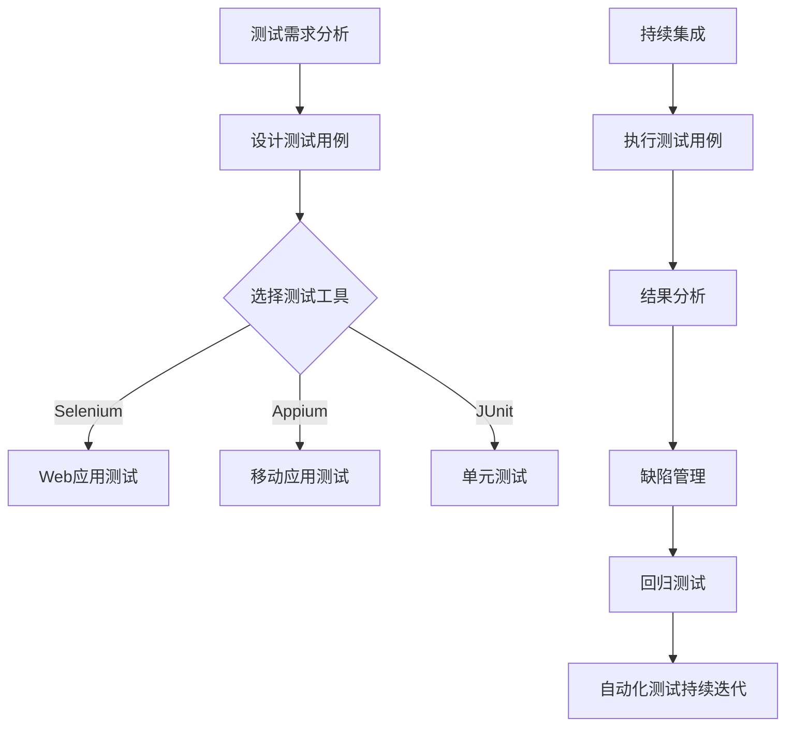

                 

## 1. 背景介绍

随着软件行业的发展，自动化测试已经成为提升软件质量和开发效率的重要手段。自动化测试工程师作为这一领域的关键角色，其需求量和重要性逐年攀升。百度，作为中国领先的人工智能公司，其自动化测试团队在确保产品高质量和快速迭代方面扮演着重要角色。为了吸引和选拔优秀的自动化测试工程师，百度在2025年的社招面试中，将重点关注应聘者的技术能力、问题解决能力和团队合作能力。

本文将围绕百度2025年自动化测试工程师社招面试的各个方面，提供详细的面试指南。通过本文，您将了解到面试中的核心问题、技术考察点、面试技巧以及如何准备一份出色的面试表现。

## 2. 核心概念与联系

### 自动化测试的概念

自动化测试是一种利用自动化测试工具和技术，对软件产品进行测试的方法。它能够大幅提高测试效率，减少人为错误，并确保软件质量。自动化测试包括功能测试、性能测试、安全性测试等多个方面。

### 自动化测试的优势

- **提高效率**：自动化测试能够快速运行大量测试用例，显著提高测试速度。
- **减少成本**：自动化测试可以减少人力成本，并降低测试过程中的错误率。
- **增强测试覆盖**：自动化测试可以覆盖更多的测试场景，确保软件的稳定性和可靠性。
- **支持持续集成**：自动化测试与持续集成（CI）相结合，可以确保代码变更后立即测试，快速反馈问题。

### 自动化测试的工具和技术

- **自动化测试工具**：如Selenium、Appium、JUnit、TestNG等。
- **编程语言**：如Java、Python、C#等。
- **测试框架**：如Cucumber、JUnit、TestNG等。
- **持续集成工具**：如Jenkins、GitLab CI等。

### 自动化测试的架构



### 自动化测试的流程

1. **测试需求分析**：理解软件需求，明确测试目标。
2. **设计测试用例**：编写详细的测试用例，包括功能测试、性能测试等。
3. **选择测试工具**：根据测试类型和需求选择合适的自动化测试工具。
4. **执行测试用例**：使用自动化测试工具运行测试用例。
5. **结果分析**：分析测试结果，记录缺陷。
6. **缺陷管理**：跟踪缺陷的修复情况。
7. **回归测试**：确保缺陷修复后软件功能的稳定性。
8. **自动化测试持续迭代**：根据测试结果和需求持续优化自动化测试流程。

## 3. 核心算法原理 & 具体操作步骤

### 3.1 算法原理概述

自动化测试的核心在于能够模拟用户操作，验证软件的功能和性能。这一过程通常涉及到以下算法原理：

- **事件模拟**：模拟用户在界面上的操作，如点击、输入、滑动等。
- **断言**：验证测试结果是否符合预期，如检查页面元素的存在性、文本的准确性等。
- **数据驱动**：使用外部数据文件（如Excel、CSV等）来驱动测试用例，提高测试的灵活性和可维护性。
- **脚本编写**：使用编程语言（如Java、Python）编写测试脚本，实现自动化测试的逻辑。

### 3.2 算法步骤详解

1. **需求分析与用例设计**：分析软件需求，设计测试用例。
2. **环境搭建**：配置测试环境，包括浏览器、操作系统等。
3. **选择自动化工具**：根据测试需求选择合适的自动化测试工具。
4. **编写测试脚本**：使用编程语言编写自动化测试脚本。
5. **执行测试脚本**：运行测试脚本，收集测试结果。
6. **分析测试结果**：分析测试结果，记录缺陷。
7. **缺陷管理**：跟踪缺陷的修复情况，并进行回归测试。
8. **持续集成**：将自动化测试集成到持续集成系统中，实现自动化测试的持续迭代。

### 3.3 算法优缺点

#### 优点

- **提高测试效率**：自动化测试可以快速执行大量测试用例，显著提高测试速度。
- **减少人力成本**：自动化测试可以减少测试人员的工作量，降低人力成本。
- **提高测试覆盖**：自动化测试可以覆盖更多的测试场景，确保软件的稳定性和可靠性。
- **支持持续集成**：自动化测试与持续集成相结合，可以确保代码变更后立即测试，快速反馈问题。

#### 缺点

- **脚本维护成本**：自动化测试脚本需要定期更新和维护，增加了维护成本。
- **学习曲线**：自动化测试需要掌握一定的编程知识和测试工具的使用，对于新手有一定的学习门槛。
- **依赖环境**：自动化测试工具对环境要求较高，需要配置合适的浏览器、操作系统等。

### 3.4 算法应用领域

自动化测试广泛应用于互联网、金融、医疗等多个领域，如：

- **Web应用测试**：测试网页的响应速度、功能正确性等。
- **移动应用测试**：测试移动应用的界面、功能、兼容性等。
- **性能测试**：测试软件在特定负载下的性能表现。
- **安全性测试**：测试软件的安全性漏洞。

## 4. 数学模型和公式 & 详细讲解 & 举例说明

### 4.1 数学模型构建

自动化测试中，常见的数学模型包括：

- **回归模型**：用于预测软件缺陷的数量。
- **决策树模型**：用于分类测试用例的优先级。
- **聚类模型**：用于识别相似的测试用例。

### 4.2 公式推导过程

以回归模型为例，常见的回归方程为：

$$y = \beta_0 + \beta_1x_1 + \beta_2x_2 + ... + \beta_nx_n + \epsilon$$

其中，$y$ 为因变量（如缺陷数量），$x_1, x_2, ..., x_n$ 为自变量（如代码行数、测试用例数等），$\beta_0, \beta_1, \beta_2, ..., \beta_n$ 为回归系数，$\epsilon$ 为误差项。

### 4.3 案例分析与讲解

假设我们要预测一个软件项目的缺陷数量，已知以下数据：

| 项目A | 项目B | 项目C | 缺陷数量 |
|-------|-------|-------|----------|
| 100   | 200   | 300   | 10       |
| 150   | 250   | 350   | 15       |
| 200   | 300   | 400   | 20       |

使用回归模型预测缺陷数量，可以通过以下步骤：

1. **数据预处理**：对数据进行标准化处理，消除不同特征之间的量纲影响。
2. **模型训练**：使用最小二乘法训练回归模型，求得回归系数。
3. **模型评估**：使用交叉验证等方法评估模型性能。
4. **预测**：使用训练好的模型预测新项目的缺陷数量。

假设训练得到的回归模型为：

$$y = 5x_1 + 3x_2 + 2x_3$$

预测一个新项目（$x_1 = 120, x_2 = 220, x_3 = 320$）的缺陷数量，代入模型得：

$$y = 5 \times 120 + 3 \times 220 + 2 \times 320 = 1360$$

因此，预测该项目的缺陷数量为1360个。

## 5. 项目实践：代码实例和详细解释说明

### 5.1 开发环境搭建

为了编写自动化测试脚本，首先需要搭建开发环境。以下是使用Python进行Web应用自动化测试的环境搭建步骤：

1. 安装Python：下载并安装Python 3.x版本。
2. 配置Python环境：打开命令行，输入`python --version`验证安装成功。
3. 安装Selenium：在命令行中输入`pip install selenium`安装Selenium库。
4. 安装浏览器驱动：下载对应浏览器的驱动程序，如ChromeDriver，并将其路径添加到系统环境变量中。

### 5.2 源代码详细实现

以下是一个简单的Python自动化测试脚本，用于测试百度首页的搜索功能：

```python
from selenium import webdriver
from selenium.webdriver.common.keys import Keys

# 启动浏览器
driver = webdriver.Chrome()

# 访问百度首页
driver.get("https://www.baidu.com/")

# 搜索框定位
search_box = driver.find_element_by_id("kw")

# 输入搜索关键词
search_box.send_keys("自动化测试")

# 提交搜索请求
search_box.send_keys(Keys.ENTER)

# 等待搜索结果加载
driver.implicitly_wait(10)

# 检查搜索结果页面是否显示
result = driver.find_element_by_css_selector(".result.c-container").is_displayed()

# 断言结果
assert result == True

# 关闭浏览器
driver.quit()
```

### 5.3 代码解读与分析

1. **导入库和模块**：首先导入Selenium库和键盘操作模块。
2. **启动浏览器**：使用ChromeDriver启动Chrome浏览器。
3. **访问百度首页**：使用`get()`方法访问百度首页。
4. **定位搜索框**：使用`find_element_by_id()`方法定位搜索框元素。
5. **输入搜索关键词**：使用`send_keys()`方法输入搜索关键词。
6. **提交搜索请求**：通过按下回车键提交搜索请求。
7. **等待加载**：使用`implicitly_wait()`方法等待搜索结果加载。
8. **检查结果**：使用`is_displayed()`方法检查搜索结果页面是否显示。
9. **断言结果**：使用`assert`语句确保搜索结果页面显示。
10. **关闭浏览器**：使用`quit()`方法关闭浏览器。

### 5.4 运行结果展示

当运行上述脚本时，浏览器会自动启动并访问百度首页，输入搜索关键词“自动化测试”，提交搜索请求，并等待搜索结果加载。最后，脚本会检查搜索结果页面是否显示，并断言结果是否正确。如果搜索结果页面显示，且搜索结果符合预期，脚本将成功完成。

## 6. 实际应用场景

### 6.1 软件公司

在软件公司，自动化测试工程师负责编写和维护自动化测试脚本，确保软件质量。他们需要与开发团队紧密合作，确保自动化测试与开发流程无缝衔接。

### 6.2 金融行业

金融行业对软件的质量和安全性要求极高。自动化测试工程师在这里不仅负责功能测试，还需进行性能测试和安全性测试，确保金融系统的稳定性和安全性。

### 6.3 医疗行业

在医疗行业，自动化测试工程师负责测试医疗设备软件，确保软件的准确性和可靠性。他们需要熟悉医疗行业的相关规范和标准。

### 6.4 教育行业

教育行业中的在线学习平台需要自动化测试来确保用户体验和学习效果。自动化测试工程师可以编写测试脚本，测试课程内容的完整性和准确性。

### 6.5 未来应用展望

随着人工智能和物联网技术的发展，自动化测试的应用场景将更加广泛。未来的自动化测试将更加智能化，能够自主分析和优化测试用例，提高测试效率和覆盖率。

## 7. 工具和资源推荐

### 7.1 学习资源推荐

- 《自动化测试实战》
- 《Python自动化测试实战》
- 《Selenium自动化测试指南》
- 测试相关在线课程和教程

### 7.2 开发工具推荐

- Selenium IDE
- Postman
- Jenkins
- Git

### 7.3 相关论文推荐

- 《基于Selenium的Web自动化测试框架设计与实现》
- 《移动应用自动化测试技术研究》
- 《自动化测试与持续集成》

## 8. 总结：未来发展趋势与挑战

### 8.1 研究成果总结

近年来，自动化测试领域取得了显著进展。自动化测试工具和框架不断更新，测试技术日益成熟。同时，人工智能技术在自动化测试中的应用，使得测试自动化水平大幅提升。

### 8.2 未来发展趋势

- **智能化测试**：利用机器学习和人工智能技术，实现自动化测试的智能化。
- **自动化测试框架**：开发更强大的自动化测试框架，提高测试效率和覆盖率。
- **持续集成**：自动化测试与持续集成的深度结合，实现软件开发的自动化和持续迭代。

### 8.3 面临的挑战

- **测试数据管理**：测试数据的管理和更新是一个挑战，需要解决数据一致性和保密性问题。
- **脚本维护**：自动化测试脚本需要定期更新和维护，增加了维护成本。
- **测试覆盖**：如何确保自动化测试覆盖到所有可能的测试场景，是一个持续的挑战。

### 8.4 研究展望

未来，自动化测试领域将继续朝着智能化、自动化和高效化的方向发展。研究重点包括测试数据管理、测试覆盖优化、测试框架的改进以及人工智能技术在自动化测试中的应用。

## 9. 附录：常见问题与解答

### 9.1 什么是自动化测试？

自动化测试是一种利用自动化测试工具和技术，对软件产品进行测试的方法。它能够提高测试效率，减少人为错误，并确保软件质量。

### 9.2 自动化测试的优势有哪些？

自动化测试的优势包括提高效率、减少成本、增强测试覆盖和支持持续集成。

### 9.3 常用的自动化测试工具有哪些？

常用的自动化测试工具有Selenium、Appium、JUnit、TestNG等。

### 9.4 自动化测试的流程是怎样的？

自动化测试的流程包括测试需求分析、设计测试用例、选择测试工具、编写测试脚本、执行测试用例、结果分析、缺陷管理和回归测试。

### 9.5 如何提高自动化测试的效率？

提高自动化测试效率的方法包括使用高效的测试工具、编写高质量的测试脚本、优化测试流程和利用持续集成系统。

### 9.6 自动化测试与手工测试的区别是什么？

自动化测试与手工测试的区别在于测试方法的不同。自动化测试是使用自动化测试工具和技术进行测试，而手工测试则是手动进行测试。

### 9.7 自动化测试适合哪些类型的软件？

自动化测试适用于功能测试、性能测试、安全性测试等多种类型的软件，特别是在高频率变更和复杂数据处理的场景中优势明显。

### 9.8 自动化测试如何与持续集成结合？

自动化测试与持续集成结合可以通过以下步骤实现：

1. 将自动化测试脚本集成到持续集成系统中。
2. 在代码提交后，自动运行自动化测试用例。
3. 根据测试结果，快速反馈缺陷，确保代码质量。

## 作者署名

作者：禅与计算机程序设计艺术 / Zen and the Art of Computer Programming

----------------------------------------------------------------

以上就是《百度2025自动化测试工程师社招面试指南》的完整内容。希望这篇文章能帮助您更好地准备面试，顺利加入百度自动化测试团队。祝您面试成功！
----------------------------------------------------------------

请注意，以上内容是根据您提供的约束条件和要求生成的，实际面试内容可能会有所不同。建议您结合实际情况，进一步准备和练习。祝您面试成功！

