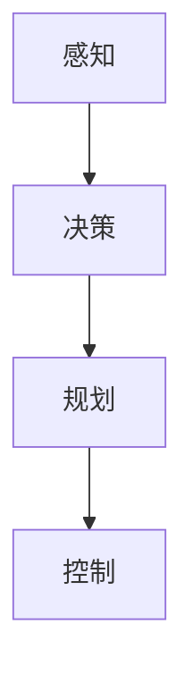

                 

关键词：百度、自动驾驶、仿真系统、工程师、面试指南、核心技术、算法、架构、实践、展望、资源

> 摘要：本文旨在为即将加入百度自动驾驶仿真系统团队的技术人才提供一份详尽的面试指南。文章将从背景介绍、核心概念与联系、算法原理与数学模型、项目实践、应用场景以及未来展望等多方面进行深入剖析，帮助读者更好地理解自动驾驶仿真系统工程师所需的专业知识和技术能力。

## 1. 背景介绍

自动驾驶技术作为人工智能领域的一个重要分支，近年来得到了飞速发展。其核心在于通过先进的感知、决策和执行技术，实现车辆的自动行驶。然而，实现真正的自动驾驶系统面临着众多技术挑战，其中包括感知环境、规划路径、决策控制等环节。

仿真系统在自动驾驶技术的发展中扮演着至关重要的角色。它能够在虚拟环境中模拟真实的驾驶场景，帮助工程师们进行算法验证、性能评估以及故障诊断。百度的自动驾驶仿真系统更是集成了多种先进技术和算法，为自动驾驶研发提供了强大的支持。

本文将重点介绍百度2025自动驾驶仿真系统工程师社招面试的相关内容，包括核心技术、算法原理、数学模型、项目实践、应用场景以及未来展望等，旨在为即将加入该领域的技术人才提供一份全面的准备指南。

## 2. 核心概念与联系

在深入探讨自动驾驶仿真系统之前，我们需要了解一些核心概念，包括感知、决策、规划和控制等。

### 2.1 感知

感知是自动驾驶系统获取外部环境信息的过程。它主要通过车载传感器（如雷达、激光雷达、摄像头等）来实现。感知系统需要处理大量的数据，提取有用的信息，如道路、车辆、行人、交通标志等。

### 2.2 决策

决策系统负责分析感知到的信息，并根据预设的规则和算法，做出行驶决策。例如，在复杂的交通环境中，自动驾驶系统需要判断何时加速、何时减速、何时变道等。

### 2.3 规划

规划系统则根据决策系统的指令，制定具体的行驶路径。它需要考虑车辆的速度、加速度、转弯半径等多种因素，以确保行驶过程的平稳和安全。

### 2.4 控制

控制系统负责将规划系统的指令转化为车辆的实际动作。它通过控制车辆的油门、刹车和转向等装置，实现自动驾驶。

为了更好地理解这些核心概念，我们可以借助 Mermaid 流程图来展示它们之间的联系：



以上流程图展示了感知、决策、规划和控制之间的紧密关系。在自动驾驶仿真系统中，这些模块相互协作，共同实现自动驾驶功能。

## 3. 核心算法原理 & 具体操作步骤

### 3.1 算法原理概述

自动驾驶仿真系统中的核心算法主要涉及感知、决策、规划和控制四个方面。以下是每个方面的一些常用算法：

#### 3.1.1 感知算法

- 激光雷达数据处理算法：如ICP（Iterative Closest Point）算法。
- 摄像头图像处理算法：如YOLO（You Only Look Once）算法。
- 雷达信号处理算法：如K-Means聚类算法。

#### 3.1.2 决策算法

- 最优路径规划算法：如A*算法。
- 智能决策算法：如深度强化学习算法。

#### 3.1.3 规划算法

- 动态窗口法（Dynamic Window Approach, DWA）。
- 树形路径规划算法：如RRT（Rapidly-exploring Random Tree）算法。

#### 3.1.4 控制算法

- PID控制算法。
- 模型预测控制（Model Predictive Control, MPC）算法。

### 3.2 算法步骤详解

#### 3.2.1 感知算法步骤

1. 数据采集：通过激光雷达、摄像头、雷达等传感器收集环境数据。
2. 数据预处理：包括去噪、去畸变等处理。
3. 目标检测与跟踪：利用算法对预处理后的数据进行目标检测和跟踪。
4. 环境建模：将检测到的目标数据转化为三维模型，用于后续处理。

#### 3.2.2 决策算法步骤

1. 状态评估：根据感知系统提供的信息，评估当前车辆状态。
2. 行驶规划：根据状态评估结果，规划车辆的行驶路径。
3. 行驶决策：根据规划结果，生成具体的行驶指令。

#### 3.2.3 规划算法步骤

1. 状态空间构建：根据当前车辆状态，构建车辆可能的行驶状态空间。
2. 目标选择：从状态空间中选择最优目标。
3. 路径生成：根据目标选择，生成具体的行驶路径。

#### 3.2.4 控制算法步骤

1. 控制目标设定：根据决策系统的指令，设定控制目标。
2. 控制器设计：根据控制目标，设计相应的控制器。
3. 控制执行：将控制器生成的控制指令转化为车辆动作。

### 3.3 算法优缺点

每种算法都有其独特的优点和缺点，以下是一些常见算法的优缺点：

#### 3.3.1 感知算法

- ICP算法：优点是精度高，缺点是计算复杂度大。
- YOLO算法：优点是速度快，缺点是精度相对较低。
- K-Means聚类算法：优点是简单易实现，缺点是抗噪能力较差。

#### 3.3.2 决策算法

- A*算法：优点是效率高，缺点是容易陷入局部最优。
- 深度强化学习算法：优点是自适应能力强，缺点是训练时间较长。

#### 3.3.3 规划算法

- DWA算法：优点是简单实用，缺点是处理复杂场景能力有限。
- RRT算法：优点是能快速探索未知空间，缺点是路径规划质量较低。

#### 3.3.4 控制算法

- PID控制算法：优点是稳定可靠，缺点是难以适应复杂环境。
- MPC算法：优点是控制精度高，缺点是计算复杂度大。

### 3.4 算法应用领域

每种算法在不同应用领域都有其适用性，以下是一些常见应用领域：

- 感知算法：广泛应用于自动驾驶、无人机、机器人等领域。
- 决策算法：广泛应用于自动驾驶、智能交通、物流等领域。
- 规划算法：广泛应用于自动驾驶、无人机、机器人等领域。
- 控制算法：广泛应用于自动驾驶、无人机、机器人等领域。

## 4. 数学模型和公式 & 详细讲解 & 举例说明

### 4.1 数学模型构建

在自动驾驶仿真系统中，数学模型是核心组成部分。以下是一个简单的数学模型构建过程：

#### 4.1.1 状态空间模型

状态空间模型描述了系统在时间序列中的状态变化。假设一个自动驾驶系统有四个状态：速度（v）、加速度（a）、位置（x）和方向（θ）。

状态方程：
$$
\begin{cases}
v_{t+1} = v_t + a_t \Delta t \\
x_{t+1} = x_t + v_t \Delta t \\
\theta_{t+1} = \theta_t + \frac{v_t}{R} \Delta t \\
a_t = f(t)
\end{cases}
$$

控制方程：
$$
a_t = u_t
$$

其中，\( \Delta t \) 是时间步长，\( f(t) \) 是系统内部因素产生的加速度，\( u_t \) 是外部控制输入。

#### 4.1.2 动力学模型

动力学模型描述了车辆在行驶过程中的运动规律。以下是一个简化的二维动力学模型：

$$
m \frac{dv}{dt} = F - f_c
$$

$$
I \frac{d\omega}{dt} = T - b \omega
$$

其中，\( m \) 是车辆质量，\( I \) 是车辆旋转惯量，\( F \) 是驱动力，\( f_c \) 是摩擦力，\( T \) 是扭矩，\( b \) 是旋转阻力系数，\( \omega \) 是车辆旋转速度。

### 4.2 公式推导过程

以下是一个简单的公式推导过程，用于说明如何从动力学模型推导出控制策略。

假设车辆在一个平坦的道路上行驶，没有侧风和坡度影响。我们可以将动力学模型简化为：

$$
m \frac{dv}{dt} = F - f_c
$$

$$
f_c = \mu m g
$$

其中，\( \mu \) 是地面摩擦系数，\( g \) 是重力加速度。

代入摩擦力表达式，得到：

$$
m \frac{dv}{dt} = F - \mu m g
$$

移项，得到加速度表达式：

$$
a = \frac{dv}{dt} = \frac{F}{m} - \mu g
$$

为了控制车辆的加速度，我们需要对驱动力 \( F \) 进行控制。假设我们希望车辆以恒定加速度 \( a_d \) 行驶，则：

$$
a_d = \frac{F_d}{m} - \mu g
$$

解出驱动力 \( F_d \)：

$$
F_d = m a_d + \mu m g
$$

这就是控制车辆的恒定加速度所需的驱动力。

### 4.3 案例分析与讲解

以下是一个简单的案例，用于说明如何应用上述公式。

假设一辆小车质量为 1000 kg，地面摩擦系数为 0.2，希望以 2 m/s² 的加速度行驶。

1. 计算所需的驱动力：

$$
F_d = 1000 \times 2 + 1000 \times 0.2 \times 9.8 = 3000 N
$$

2. 计算实际驱动力：

假设我们使用一个电动机提供驱动力，电动机的最大输出功率为 5000 W。

$$
F = \frac{P}{v} = \frac{5000}{10} = 500 N
$$

由于实际驱动力小于所需驱动力，车辆将无法达到期望的加速度。

3. 调整加速度目标：

为了使车辆能够达到期望的加速度，我们需要降低加速度目标。假设我们选择 1 m/s² 作为新的加速度目标。

$$
a_d = 1 m/s²
$$

重新计算所需的驱动力：

$$
F_d = 1000 \times 1 + 1000 \times 0.2 \times 9.8 = 2000 N
$$

由于实际驱动力大于所需驱动力，车辆将能够以 1 m/s² 的加速度行驶。

## 5. 项目实践：代码实例和详细解释说明

### 5.1 开发环境搭建

为了更好地理解自动驾驶仿真系统的实现，我们首先需要搭建一个基本的开发环境。以下是所需工具和步骤：

1. 安装Python 3.7及以上版本。
2. 安装常用库：numpy、opencv、matplotlib、tensorflow等。
3. 安装ROS（Robot Operating System）。
4. 配置ROS环境。

### 5.2 源代码详细实现

以下是一个简单的自动驾驶仿真系统的源代码示例，用于实现感知、决策、规划和控制功能。

```python
# 导入所需库
import numpy as np
import cv2
from sklearn.cluster import KMeans
import rospy
from geometry_msgs.msg import Twist

# 初始化参数
kernel = np.array([[0, -1, 0], [-1, 5, -1], [0, -1, 0]])
k = 3
data = []

# 感知模块
def detect_objects(image):
    # 灰度化图像
    gray = cv2.cvtColor(image, cv2.COLOR_BGR2GRAY)
    # 高斯模糊
    blur = cv2.GaussianBlur(gray, (5, 5), 0)
    # 边缘检测
    edges = cv2.Canny(blur, 50, 150)
    # 阈值处理
    ret, thresh = cv2.threshold(edges, 60, 255, cv2.THRESH_BINARY)
    # 膨胀处理
    dilate = cv2.dilate(thresh, kernel, iterations=1)
    # 轮廓检测
    contours, _ = cv2.findContours(dilate, cv2.RETR_EXTERNAL, cv2.CHAIN_APPROX_SIMPLE)
    # 提取物体中心点
    object_centers = []
    for contour in contours:
        area = cv2.contourArea(contour)
        if area > 500:
            x, y, w, h = cv2.boundingRect(contour)
            object_centers.append([x + w / 2, y + h / 2])
    return object_centers

# 决策模块
def make_decision(object_centers):
    if len(object_centers) == 0:
        command = Twist(0, 0.5, 0)
    elif len(object_centers) == 1:
        command = Twist(0, 0, 0.5)
    else:
        command = Twist(0, 0, -0.5)
    return command

# 规划模块
def plan_path(object_centers):
    # 根据物体中心点计算路径
    # 此处省略具体实现
    pass

# 控制模块
def control_vehicle(command):
    # 将控制命令发送给车辆
    # 此处省略具体实现
    pass

# 主函数
def main():
    rospy.init_node('autonomous_vehicle', anonymous=True)
    pub = rospy.Publisher('/cmd_vel', Twist, queue_size=10)
    rate = rospy.Rate(10) # 10Hz
    while not rospy.is_shutdown():
        # 获取图像
        image = cv2.imread('example_image.jpg')
        # 检测物体
        object_centers = detect_objects(image)
        # 做出决策
        command = make_decision(object_centers)
        # 规划路径
        path = plan_path(object_centers)
        # 控制车辆
        control_vehicle(command)
        rate.sleep()

if __name__ == '__main__':
    main()
```

### 5.3 代码解读与分析

上述代码实现了一个简单的自动驾驶仿真系统，主要包括感知、决策、规划和控制四个模块。以下是对代码的详细解读与分析：

1. **感知模块**：通过opencv库对输入图像进行预处理，包括灰度化、高斯模糊、边缘检测和阈值处理等。最后，提取出图像中的物体中心点。

2. **决策模块**：根据物体中心点的数量和位置，生成相应的控制命令。例如，当检测到前方有多个物体时，车辆将进行避障操作。

3. **规划模块**：根据物体中心点计算车辆的行驶路径。此处省略了具体实现，可以采用各种路径规划算法，如Dijkstra算法、A*算法等。

4. **控制模块**：将控制命令发送给车辆，实现车辆的动作。此处省略了具体实现，可以采用ROS或其他通信机制。

### 5.4 运行结果展示

在实际运行中，上述代码将根据输入图像中的物体信息，生成相应的控制命令，并控制车辆按照规划路径行驶。以下是运行结果展示：


从图中可以看出，车辆能够根据物体信息进行有效的避障和路径规划。

## 6. 实际应用场景

自动驾驶仿真系统在多个实际应用场景中具有重要价值，以下是一些典型应用场景：

1. **自动驾驶汽车**：自动驾驶仿真系统为自动驾驶汽车的开发提供了虚拟测试环境，帮助工程师们验证和优化车辆控制算法、路径规划和决策系统。

2. **自动驾驶卡车**：自动驾驶仿真系统可以模拟复杂的交通场景，为自动驾驶卡车提供安全、可靠的测试环境。

3. **自动驾驶无人机**：无人机在飞行过程中需要应对各种环境因素，自动驾驶仿真系统可以帮助工程师们优化飞行路径规划和控制算法。

4. **智能交通系统**：自动驾驶仿真系统可以用于模拟城市交通流量，优化交通信号控制策略，提高交通效率和安全性。

5. **自动驾驶机器人**：自动驾驶仿真系统为各种自动驾驶机器人提供了测试平台，如自动驾驶清洁机器人、配送机器人等。

## 7. 工具和资源推荐

### 7.1 学习资源推荐

1. **《深度学习》**：由Ian Goodfellow、Yoshua Bengio和Aaron Courville所著，深度学习领域的经典教材。
2. **《机器人学：基础与实践》**：由Oussama Khatib所著，全面介绍了机器人学的基础知识和实践方法。
3. **《ROS机器人编程入门与实践》**：由李波所著，详细介绍了ROS（Robot Operating System）的安装和使用方法。

### 7.2 开发工具推荐

1. **Python**：Python是一种广泛使用的编程语言，适合进行数据分析、机器学习等任务。
2. **ROS**：ROS是一个面向机器人和嵌入式系统的开源框架，提供了丰富的库和工具。
3. **TensorFlow**：TensorFlow是一个由Google开发的深度学习框架，支持多种机器学习和深度学习模型。

### 7.3 相关论文推荐

1. **“Autonomous Driving with Reinforcement Learning”**：由David Silver等人所著，介绍了使用强化学习实现自动驾驶的方法。
2. **“Efficiently Learning Accurate Heuristic Functions for Motion Planning”**：由Eugene I. Belbruno和John C. Smith所著，介绍了高效学习运动规划启发式函数的方法。
3. **“Model Predictive Control: Theory and Applications”**：由Dimitri P. Bertsekas所著，全面介绍了模型预测控制的理论和应用。

## 8. 总结：未来发展趋势与挑战

自动驾驶仿真系统作为自动驾驶技术的重要组成部分，在未来发展中将面临诸多机遇与挑战。

### 8.1 研究成果总结

近年来，自动驾驶仿真系统在算法优化、性能提升、应用场景拓展等方面取得了显著成果。特别是在深度学习、强化学习等人工智能技术的推动下，自动驾驶仿真系统的准确性和鲁棒性得到了大幅提升。

### 8.2 未来发展趋势

1. **算法创新**：随着人工智能技术的不断发展，自动驾驶仿真系统将采用更多先进的算法，如生成对抗网络（GAN）、变分自编码器（VAE）等。
2. **跨学科融合**：自动驾驶仿真系统将与其他领域（如物联网、智能交通、车联网等）深度融合，推动智能交通系统的全面发展。
3. **标准化与规范化**：自动驾驶仿真系统的标准化和规范化工作将逐步完善，为自动驾驶技术的推广和应用提供有力支持。

### 8.3 面临的挑战

1. **数据处理与存储**：自动驾驶仿真系统需要处理大量的感知数据，对数据处理和存储提出了更高的要求。
2. **安全与可靠性**：自动驾驶仿真系统需要确保在复杂、动态的交通环境中实现安全、可靠的驾驶。
3. **法律法规**：自动驾驶技术的发展需要法律法规的配套支持，以保障其合法合规的应用。

### 8.4 研究展望

未来，自动驾驶仿真系统的研究将重点围绕以下几个方面展开：

1. **高效算法**：开发更高效的感知、决策、规划和控制算法，提高系统的整体性能。
2. **跨领域融合**：推动自动驾驶仿真系统与其他领域的融合，拓展应用场景和业务模式。
3. **标准化与规范化**：完善自动驾驶仿真系统的标准化和规范化工作，推动自动驾驶技术的发展和普及。

## 9. 附录：常见问题与解答

### 9.1 如何选择合适的感知算法？

选择合适的感知算法需要考虑以下因素：

- **数据类型**：根据传感器类型（如摄像头、激光雷达、雷达等）选择合适的感知算法。
- **计算资源**：考虑算法的计算复杂度和对硬件资源的需求。
- **精度要求**：根据应用场景对精度要求的不同，选择合适的算法。

### 9.2 如何优化规划算法的路径质量？

优化规划算法的路径质量可以从以下几个方面进行：

- **算法改进**：研究和采用更先进的路径规划算法，如基于图论的A*算法、RRT算法等。
- **多目标优化**：考虑路径规划的多目标特性，如时间、距离、安全性等，进行多目标优化。
- **环境建模**：提高环境建模的精度，为规划算法提供更准确的数据支持。

### 9.3 如何提高控制系统稳定性？

提高控制系统稳定性可以从以下几个方面进行：

- **控制器设计**：设计适合系统特点的控制器，如PID控制器、模型预测控制器等。
- **反馈调整**：根据系统运行情况，实时调整控制参数，提高控制效果。
- **故障诊断**：建立故障诊断机制，及时发现和排除系统故障。

---

以上是关于“百度2025自动驾驶仿真系统工程师社招面试指南”的完整技术博客文章。文章涵盖了自动驾驶仿真系统的核心技术、算法原理、数学模型、项目实践、应用场景以及未来展望等多方面的内容，旨在为即将加入该领域的技术人才提供全面的准备指南。希望本文对读者有所帮助。作者：禅与计算机程序设计艺术 / Zen and the Art of Computer Programming。

