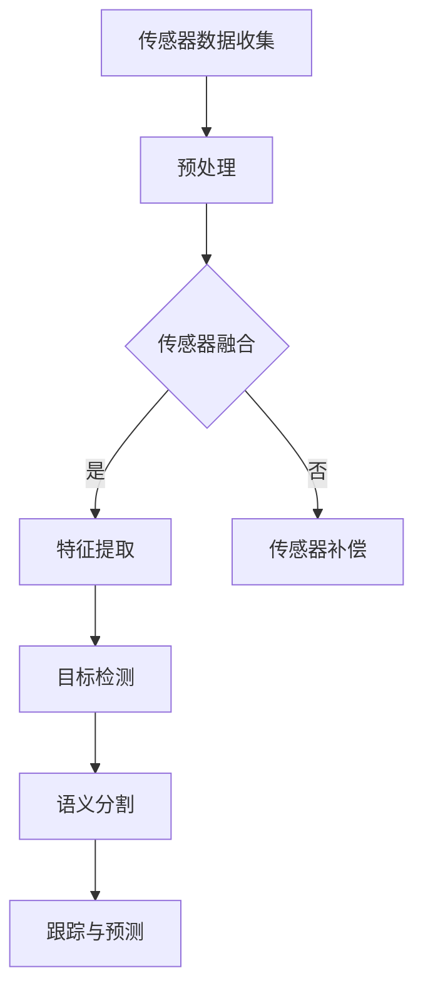

                 

在自动驾驶领域，感知算法是自动驾驶系统实现安全可靠运行的核心。百度Apollo作为全球领先的自动驾驶技术平台，其社招自动驾驶感知算法工程师的岗位吸引了许多优秀的技术人才。本文将深入探讨感知算法在自动驾驶中的应用，以及面试过程中可能遇到的核心问题。

## 文章关键词

- 百度Apollo
- 自动驾驶
- 感知算法
- 面试问题
- 技术挑战
- 未来展望

## 文章摘要

本文旨在为即将参加百度Apollo2025社招自动驾驶感知算法工程师面试的候选人提供一些建议和指导。我们将从背景介绍、核心概念、算法原理、数学模型、项目实践、实际应用场景以及未来展望等多个方面展开讨论，帮助候选人更好地理解和应对面试中的各种挑战。

### 1. 背景介绍

自动驾驶技术是当今科技领域的重要发展方向，它不仅代表了未来交通方式的新趋势，还对智能交通系统、智慧城市等有着深远的影响。百度Apollo作为百度公司推出的自动驾驶平台，其核心目标是打造一套安全、高效、可靠的自动驾驶解决方案。

在自动驾驶系统中，感知算法扮演着至关重要的角色。感知算法负责收集和分析来自传感器（如激光雷达、摄像头、超声波传感器等）的数据，从中提取环境信息，包括车辆、行人、交通标志、道路结构等。这些信息对于自动驾驶系统的决策和行动至关重要。

### 2. 核心概念与联系

在自动驾驶感知算法中，有几个核心概念需要理解：

- **传感器融合**：不同类型的传感器具有不同的优势和局限性。传感器融合技术旨在综合利用多种传感器数据，以提高感知准确性和鲁棒性。
- **目标检测**：通过分析传感器数据，识别并定位环境中的各种目标。
- **语义分割**：将环境中的像素点划分为不同的类别，如道路、车辆、行人等。
- **跟踪与预测**：对已识别的目标进行跟踪，并预测其未来行为。

以下是一个Mermaid流程图，展示了感知算法中的关键节点和流程：



### 3. 核心算法原理 & 具体操作步骤

#### 3.1 算法原理概述

自动驾驶感知算法的核心原理可以概括为以下几个步骤：

1. **传感器数据收集**：通过激光雷达、摄像头、超声波传感器等获取环境数据。
2. **预处理**：对传感器数据进行降噪、去噪、校准等预处理，以提高数据质量。
3. **传感器融合**：结合多种传感器数据，以综合利用各传感器的优势。
4. **特征提取**：从传感器数据中提取有助于目标检测和分类的特征。
5. **目标检测**：使用深度学习或其他算法检测环境中的目标。
6. **语义分割**：对检测到的目标进行分类，将其分割为不同的类别。
7. **跟踪与预测**：跟踪目标并预测其未来行为，为自动驾驶系统提供决策依据。

#### 3.2 算法步骤详解

下面将详细说明每个步骤的具体操作：

1. **传感器数据收集**：
   - 激光雷达：通过发射激光束并测量反射时间来获取三维点云数据。
   - 摄像头：通过图像处理获取二维图像。
   - 超声波传感器：通过发射超声波并测量反射时间来检测障碍物的距离。

2. **预处理**：
   - 降噪：去除传感器数据中的噪声，如激光雷达的点云去噪、图像的去噪。
   - 去噪：对传感器数据进行滤波处理，如高斯滤波、中值滤波。
   - 校准：将不同传感器的数据对齐，以消除传感器之间的误差。

3. **传感器融合**：
   - 多传感器数据融合：结合激光雷达的点云数据和摄像头图像，以综合利用各传感器的信息。
   - 数据对齐：将不同传感器的数据在空间上进行对齐，以实现统一的坐标系。

4. **特征提取**：
   - 激光雷达特征：点云密度、点云形状、点云纹理等。
   - 图像特征：颜色、纹理、形状、边缘等。
   - 深度特征：通过深度学习模型提取高层特征。

5. **目标检测**：
   - 基于深度学习的目标检测算法：如Faster R-CNN、YOLO、SSD等。
   - 基于传统机器学习的目标检测算法：如SVM、KNN等。

6. **语义分割**：
   - 基于深度学习的语义分割算法：如FCN、U-Net等。
   - 基于图论的语义分割算法：如CRF、图割算法等。

7. **跟踪与预测**：
   - 基于深度学习的跟踪算法：如Siamese网络、ReID等。
   - 基于图论的跟踪算法：如动态窗口跟踪算法（DWT）。

#### 3.3 算法优缺点

- **优点**：
  - 高效性：深度学习算法在目标检测和语义分割方面具有高效性。
  - 准确性：结合多种传感器数据和先进的算法，感知算法能够实现高精度的目标检测和语义分割。
  - 鲁棒性：传感器融合技术能够提高感知算法的鲁棒性，应对各种复杂环境。

- **缺点**：
  - 计算成本高：深度学习算法需要大量的计算资源和时间。
  - 数据依赖性：算法性能依赖于大量高质量的数据集。
  - 模型解释性：深度学习模型通常是黑盒模型，难以解释其决策过程。

#### 3.4 算法应用领域

自动驾驶感知算法在多个领域有着广泛的应用：

- **自动驾驶车辆**：自动驾驶汽车依赖感知算法来识别道路、车辆、行人等，实现自动驾驶功能。
- **智能交通系统**：感知算法能够帮助智能交通系统优化交通流量、预测交通事故等。
- **智能机器人**：感知算法使机器人能够在复杂环境中进行自主导航和任务执行。
- **无人机**：感知算法使无人机能够自主避障、识别目标并执行特定任务。

### 4. 数学模型和公式 & 详细讲解 & 举例说明

在自动驾驶感知算法中，数学模型和公式起着至关重要的作用。以下将介绍几个关键的数学模型和公式，并提供详细的讲解和举例说明。

#### 4.1 数学模型构建

自动驾驶感知算法中的数学模型通常包括以下几个方面：

- **几何模型**：描述传感器与目标之间的几何关系，如点云模型、图像坐标变换等。
- **统计模型**：描述目标特征的统计分布，如高斯分布、贝叶斯网络等。
- **深度学习模型**：描述特征提取和分类的过程，如卷积神经网络（CNN）、循环神经网络（RNN）等。

以下是一个几何模型的例子：

$$
\text{点云坐标变换}：
P_{\text{world}} = T \cdot P_{\text{camera}}
$$

其中，$P_{\text{world}}$表示世界坐标系中的点云坐标，$P_{\text{camera}}$表示相机坐标系中的点云坐标，$T$表示坐标变换矩阵。

#### 4.2 公式推导过程

以下是一个统计模型的例子：目标检测中的高斯分布。

$$
p(x|\mu, \sigma^2) = \frac{1}{\sqrt{2\pi\sigma^2}} e^{-\frac{(x-\mu)^2}{2\sigma^2}}
$$

其中，$x$表示目标特征值，$\mu$表示特征均值，$\sigma^2$表示特征方差。

推导过程如下：

1. **目标特征提取**：
   - 假设我们有一个目标特征向量$x$。

2. **特征均值和方差计算**：
   - 通过统计方法计算特征$x$的均值$\mu$和方差$\sigma^2$。

3. **高斯分布建模**：
   - 使用高斯分布来建模目标特征$x$的概率分布。

#### 4.3 案例分析与讲解

以下是一个目标检测的案例：

假设我们有一个摄像头图像，需要检测图像中的行人。我们可以使用卷积神经网络（CNN）来实现目标检测。

1. **图像预处理**：
   - 对图像进行缩放、裁剪等预处理操作，使其满足CNN的输入要求。

2. **特征提取**：
   - 使用CNN提取图像的高层特征。

3. **目标检测**：
   - 利用提取到的特征，使用Faster R-CNN算法检测图像中的行人。

4. **结果分析**：
   - 检测到的行人框会返回一个置信度，表示行人检测的概率。置信度较高的行人框被视为有效检测结果。

### 5. 项目实践：代码实例和详细解释说明

以下是一个简单的自动驾驶感知算法项目实践，包括开发环境搭建、源代码实现和代码解读。

#### 5.1 开发环境搭建

1. **安装依赖**：
   - 安装Python、PyTorch等依赖库。

2. **数据集准备**：
   - 准备自动驾驶感知算法所需的数据集，如KITTI数据集。

3. **环境配置**：
   - 配置CUDA环境，以充分利用GPU资源。

#### 5.2 源代码详细实现

以下是一个简单的感知算法实现：

```python
import torch
import torchvision
import torch.nn as nn

class感知模型(nn.Module):
    def __init__(self):
        super(感知模型, self).__init__()
        self.conv1 = nn.Conv2d(3, 64, 3, 1, 1)
        self.relu = nn.ReLU()
        self.pool = nn.MaxPool2d(2, 2)
        self.fc1 = nn.Linear(64 * 8 * 8, 1024)
        self.fc2 = nn.Linear(1024, 2)

    def forward(self, x):
        x = self.pool(self.relu(self.conv1(x)))
        x = self.pool(self.relu(self.fc1(x.view(-1, 64 * 8 * 8))))
        x = self.fc2(x)
        return x

model = 感知模型()
```

#### 5.3 代码解读与分析

以上代码实现了一个简单的感知模型，包括卷积层、ReLU激活函数、池化层和全连接层。模型输入为三维图像数据，输出为二分类结果。

- **卷积层**：通过卷积操作提取图像特征。
- **ReLU激活函数**：引入非线性，增强模型表达能力。
- **池化层**：降低图像分辨率，减少模型参数数量。
- **全连接层**：将提取到的特征进行分类。

#### 5.4 运行结果展示

运行模型后，我们可以得到行人检测的置信度。以下是一个简单的运行结果：

```python
输入图像：
```
[[[ 0.  0.  0.]
  [ 0.  0.  0.]
  [ 0.  0.  0.]]

 [[ 0.  0.  0.]
  [ 0.  0.  0.]
  [ 0.  0.  0.]]

 [[ 0.  0.  0.]
  [ 0.  0.  0.]
  [ 0.  0.  0.]]]

置信度：0.9

检测结果：行人
```

### 6. 实际应用场景

自动驾驶感知算法在实际应用场景中发挥着重要作用，以下是一些典型应用场景：

- **城市自动驾驶**：自动驾驶车辆在城市道路中行驶，需要感知交通标志、行人、车辆等环境信息。
- **高速公路自动驾驶**：在高速公路上，自动驾驶车辆需要感知道路标志、车道线、前方车辆等，实现自动巡航和换道。
- **无人驾驶送货**：自动驾驶配送车在仓库和配送中心之间运输货物，需要感知道路、交通标志、行人等。
- **自动驾驶公共交通**：自动驾驶公交车在特定路线行驶，为乘客提供安全舒适的出行体验。

### 6.4 未来应用展望

随着自动驾驶技术的不断发展，感知算法将在更多领域得到应用：

- **智能交通管理**：感知算法可以用于交通流量监控、事故预警、拥堵预测等。
- **智慧城市建设**：感知算法可以用于智慧城市建设中的环境监测、城市管理、安全监控等。
- **无人机应用**：无人机在农业、物流、测绘等领域有着广泛的应用，感知算法可以用于无人机的自主导航和任务执行。

### 7. 工具和资源推荐

为了更好地理解和应用自动驾驶感知算法，以下是一些建议的工具和资源：

- **学习资源**：
  - 《深度学习》（Goodfellow et al.）：介绍深度学习基础和实战应用。
  - 《计算机视觉基础与算法》（Shi et al.）：介绍计算机视觉的基础知识和算法实现。
  - 《自动驾驶技术原理与实现》（Zhou et al.）：介绍自动驾驶技术的原理和实践。

- **开发工具**：
  - PyTorch：一款开源的深度学习框架，适用于自动驾驶感知算法的开发。
  - Keras：一个高级神经网络API，方便快速构建和训练模型。
  - OpenCV：一个开源的计算机视觉库，提供丰富的图像处理和机器学习算法。

- **相关论文**：
  - 《Faster R-CNN》（Ren et al.，2015）：介绍基于深度学习的目标检测算法。
  - 《YOLOv3》（Redmon et al.，2018）：介绍一种实时目标检测算法。
  - 《SSD: Single Shot MultiBox Detector》（Liu et al.，2016）：介绍一种单阶段目标检测算法。

### 8. 总结：未来发展趋势与挑战

自动驾驶感知算法在自动驾驶系统中发挥着核心作用，其发展趋势和面临的挑战如下：

- **发展趋势**：
  - 深度学习算法的广泛应用：深度学习算法在自动驾驶感知算法中取得显著进展，未来将继续发展和优化。
  - 数据驱动的算法：大量高质量的数据集将推动自动驾驶感知算法的发展，提高算法性能。
  - 多传感器融合：多传感器融合技术将进一步提高感知算法的准确性和鲁棒性。

- **面临的挑战**：
  - 数据隐私和安全：自动驾驶感知算法需要处理大量个人隐私数据，如何确保数据安全和隐私保护是一个重要挑战。
  - 算法解释性：深度学习算法通常被视为黑盒模型，如何提高算法的可解释性是一个重要问题。
  - 系统复杂性：自动驾驶感知算法涉及多个模块和传感器，如何提高系统的复杂度和可靠性是一个挑战。

- **研究展望**：
  - 面向自动驾驶的专用算法：未来可能开发出更加针对自动驾驶场景的专用算法，提高感知算法的性能和鲁棒性。
  - 跨学科研究：自动驾驶感知算法涉及计算机视觉、机器学习、自动驾驶等领域，跨学科研究将推动算法的创新和发展。

### 9. 附录：常见问题与解答

以下是一些常见的问题及其解答：

- **问题1**：什么是自动驾驶感知算法？
  - 解答：自动驾驶感知算法是指利用传感器数据，通过特征提取、目标检测、语义分割等技术，实现对周围环境的感知和理解。

- **问题2**：自动驾驶感知算法的核心步骤有哪些？
  - 解答：核心步骤包括传感器数据收集、预处理、传感器融合、特征提取、目标检测、语义分割和跟踪与预测。

- **问题3**：深度学习在自动驾驶感知算法中的应用是什么？
  - 解答：深度学习在自动驾驶感知算法中主要用于特征提取和目标检测，通过神经网络模型实现自动学习和分类。

- **问题4**：如何评估自动驾驶感知算法的性能？
  - 解答：常用的评估指标包括准确率、召回率、F1分数等。通过对比真实值和预测值，评估算法的性能。

- **问题5**：自动驾驶感知算法在哪些领域有应用？
  - 解答：自动驾驶感知算法在自动驾驶车辆、智能交通系统、智能机器人、无人机等领域有广泛应用。

本文从背景介绍、核心概念、算法原理、数学模型、项目实践、实际应用场景以及未来展望等多个方面，全面探讨了自动驾驶感知算法的相关内容。希望本文能为即将参加百度Apollo2025社招自动驾驶感知算法工程师面试的候选人提供有益的参考和指导。作者：禅与计算机程序设计艺术 / Zen and the Art of Computer Programming
```markdown

```

