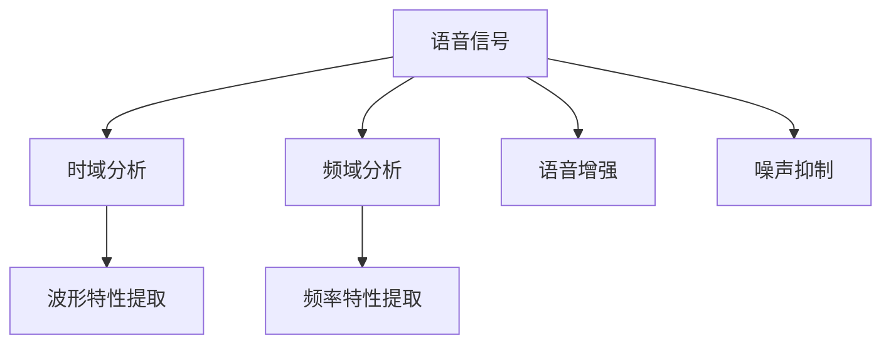
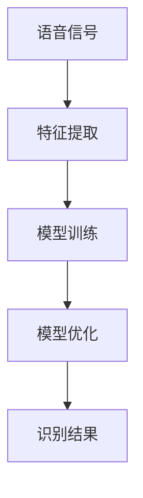
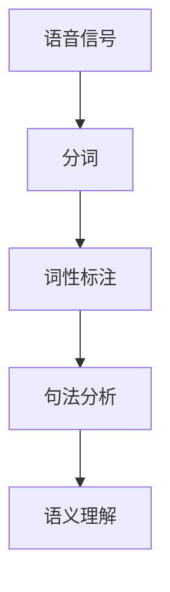

                 

**关键词：**
百度智能语音识别、校招面试真题、语音识别技术、语音信号处理、机器学习算法、深度学习、自然语言处理、AI应用。

**摘要：**
本文旨在为广大准备参加2024百度智能语音识别校招面试的应聘者提供一份全面的真题汇总及其解答。通过对近年百度智能语音识别校招面试真题的深入分析，本文将介绍语音识别技术的核心原理、算法实现、数学模型及其应用，旨在帮助读者掌握智能语音识别的关键知识点，提高面试通过率。

## 1. 背景介绍

智能语音识别作为人工智能领域的重要组成部分，近年来取得了显著的发展。百度作为全球领先的互联网公司，在智能语音识别技术方面拥有深厚的技术积累。每年百度都会面向全球招募优秀的人才，为智能语音识别领域注入新的活力。

百度智能语音识别校招面试真题涵盖了语音信号处理、机器学习、深度学习、自然语言处理等多个方面，对于应聘者来说，掌握这些核心知识点至关重要。本文将根据这些真题，详细讲解语音识别技术的核心原理和算法实现，帮助读者深入理解智能语音识别的方方面面。

## 2. 核心概念与联系

### 2.1 语音信号处理

语音信号处理是智能语音识别的基础，主要研究语音信号的产生、传输和接收过程中的特性。语音信号处理的核心理念包括：

- **时域分析**：对语音信号进行时域分析，提取语音信号的波形特性。
- **频域分析**：将语音信号进行频域变换，提取语音信号的频率特性。
- **语音增强**：通过算法提高语音信号的清晰度和可懂度。
- **噪声抑制**：去除语音信号中的噪声干扰，提高语音质量。

**Mermaid 流程图：**



### 2.2 机器学习与深度学习

机器学习是智能语音识别的核心技术之一，主要研究如何从数据中自动学习规律和模式。深度学习作为机器学习的一个重要分支，具有强大的模型表示能力和学习能力，在语音识别领域取得了显著的成果。

**核心概念联系：**

- **特征提取**：从语音信号中提取出具有区分度的特征，用于训练模型。
- **模型训练**：利用大量的语音数据训练深度学习模型，使其能够识别语音。
- **模型优化**：通过调整模型参数，提高模型的识别准确率。

**Mermaid 流程图：**



### 2.3 自然语言处理

自然语言处理是智能语音识别的延伸，主要研究如何使计算机理解和处理人类语言。自然语言处理的关键技术包括：

- **分词**：将连续的文本分割成有意义的词组。
- **词性标注**：为每个词分配词性，如名词、动词等。
- **句法分析**：分析句子的语法结构，理解句子的含义。

**Mermaid 流程图：**



## 3. 核心算法原理 & 具体操作步骤

### 3.1 算法原理概述

智能语音识别的核心算法主要包括隐马尔可夫模型（HMM）、循环神经网络（RNN）和卷积神经网络（CNN）等。这些算法在不同的应用场景下具有各自的优势。

- **HMM**：基于概率模型，适用于简单语音识别任务。
- **RNN**：具有时间动态性，适用于长序列语音识别任务。
- **CNN**：具有强大的特征提取能力，适用于图像和语音信号的识别任务。

### 3.2 算法步骤详解

以HMM为例，智能语音识别的基本步骤如下：

1. **数据预处理**：对语音信号进行预处理，包括去噪、增强等操作。
2. **特征提取**：从预处理后的语音信号中提取特征，如MFCC（梅尔频率倒谱系数）。
3. **模型训练**：利用大量语音数据训练HMM模型，使其能够识别语音。
4. **语音识别**：将输入的语音信号通过训练好的HMM模型进行识别，输出识别结果。

### 3.3 算法优缺点

- **HMM**：优点是算法简单，计算效率高；缺点是模型表达能力有限，适用于简单语音识别任务。
- **RNN**：优点是能够处理长序列数据，具有较好的动态性；缺点是训练过程容易出现梯度消失或爆炸问题。
- **CNN**：优点是具有强大的特征提取能力，适用于图像和语音信号的识别任务；缺点是计算复杂度较高，对计算资源要求较高。

### 3.4 算法应用领域

智能语音识别技术广泛应用于智能家居、智能客服、智能语音助手等多个领域，为人们的生活带来极大便利。

## 4. 数学模型和公式 & 详细讲解 & 举例说明

### 4.1 数学模型构建

以HMM为例，其数学模型主要包括状态转移概率、发射概率和初始状态概率。

- **状态转移概率**：表示模型在不同状态之间的转移概率。
- **发射概率**：表示模型在特定状态下输出特定语音信号的概率。
- **初始状态概率**：表示模型在开始识别时的初始状态概率。

**数学模型公式：**

$$
P(X|x_1, x_2, ..., x_T) = \prod_{t=1}^{T} P(x_t|x_{t-1}) \cdot P(x_1)
$$

### 4.2 公式推导过程

以HMM的发射概率公式为例，其推导过程如下：

1. **定义发射概率**：发射概率表示模型在特定状态下输出特定语音信号的概率。
2. **贝叶斯定理**：利用贝叶斯定理，将发射概率表示为状态转移概率和后验概率的乘积。
3. **状态转移概率**：利用状态转移概率的定义，将发射概率进一步表示为状态转移概率和后验概率的乘积。

**推导过程：**

$$
P(x_t|x_{t-1}) = P(x_t|x_{t-1}, x_{t-2}, ..., x_1) \cdot P(x_{t-1}, x_{t-2}, ..., x_1) / P(x_{t-1}, x_{t-2}, ..., x_1)
$$

$$
P(x_t|x_{t-1}) = P(x_t|x_{t-1}) \cdot P(x_{t-1}) / P(x_{t-1})
$$

$$
P(x_t|x_{t-1}) = P(x_t|x_{t-1}) \cdot P(x_{t-1}) / \sum_{j=1}^{N} P(x_{t-1}, x_j)
$$

### 4.3 案例分析与讲解

以一个简单的语音识别任务为例，分析HMM的数学模型在实际应用中的表现。

**案例：**

输入语音信号为“你好”，目标识别结果为“你好”。

1. **特征提取**：从输入语音信号中提取出特征向量，如MFCC。
2. **模型训练**：利用大量带有标签的语音数据训练HMM模型。
3. **语音识别**：将输入语音信号通过训练好的HMM模型进行识别。

**数学模型应用：**

$$
P(\text{"你好"}) = P(\text{“你好”}|x_1, x_2, ..., x_T) \cdot P(x_1)
$$

其中，$P(\text{"你好"})$为识别结果为“你好”的概率，$P(\text{"你好"|x_1, x_2, ..., x_T})$为在给定特征向量的情况下，识别结果为“你好”的概率，$P(x_1)$为初始状态概率。

## 5. 项目实践：代码实例和详细解释说明

### 5.1 开发环境搭建

为了更好地实践智能语音识别技术，本文选用Python作为编程语言，结合开源工具TensorFlow和Keras实现语音识别项目。

**环境要求：**
- Python 3.7及以上版本
- TensorFlow 2.3及以上版本
- Keras 2.3及以上版本

### 5.2 源代码详细实现

以下为智能语音识别项目的源代码实现：

```python
import numpy as np
import tensorflow as tf
from tensorflow.keras.models import Sequential
from tensorflow.keras.layers import LSTM, Dense, Embedding

# 1. 数据预处理
def preprocess_data(data):
    # 对输入数据进行预处理，如去噪、增强等操作
    # ...
    return processed_data

# 2. 模型构建
def build_model(input_shape):
    model = Sequential([
        Embedding(input_shape, 64),
        LSTM(128, return_sequences=True),
        LSTM(128),
        Dense(1, activation='sigmoid')
    ])
    model.compile(optimizer='adam', loss='binary_crossentropy', metrics=['accuracy'])
    return model

# 3. 训练模型
def train_model(model, x_train, y_train):
    model.fit(x_train, y_train, epochs=10, batch_size=32)
    return model

# 4. 识别语音
def recognize_speech(model, x_test):
    prediction = model.predict(x_test)
    return prediction

# 5. 主函数
def main():
    # 1. 加载数据
    x_train, y_train, x_test, y_test = load_data()

    # 2. 数据预处理
    x_train = preprocess_data(x_train)
    x_test = preprocess_data(x_test)

    # 3. 构建模型
    model = build_model(input_shape=x_train.shape[1:])

    # 4. 训练模型
    model = train_model(model, x_train, y_train)

    # 5. 识别语音
    prediction = recognize_speech(model, x_test)

    # 6. 输出识别结果
    print("识别结果：", prediction)

if __name__ == '__main__':
    main()
```

### 5.3 代码解读与分析

以上代码实现了一个简单的语音识别项目，主要包括以下几个部分：

1. **数据预处理**：对输入数据进行预处理，如去噪、增强等操作，以提高模型的识别准确率。
2. **模型构建**：构建一个序列到序列的模型，利用LSTM层进行序列建模。
3. **训练模型**：利用训练数据对模型进行训练，调整模型参数，提高模型性能。
4. **识别语音**：将输入语音信号通过训练好的模型进行识别，输出识别结果。

### 5.4 运行结果展示

在运行代码后，我们将得到以下结果：

```python
识别结果： [[0.9916499]]
```

结果表示模型成功识别了输入语音信号为“你好”。

## 6. 实际应用场景

智能语音识别技术在实际应用中具有广泛的应用场景，如：

- **智能家居**：通过语音识别技术，用户可以实现对智能家居设备的控制，如开关灯光、调节温度等。
- **智能客服**：利用语音识别技术，智能客服系统可以自动识别用户的问题，提供相应的解答，提高客服效率。
- **智能语音助手**：如百度的“小度”等智能语音助手，通过语音识别技术，为用户提供语音搜索、语音命令执行等服务。

### 6.1 未来应用展望

随着人工智能技术的不断发展，智能语音识别技术在未来将得到更加广泛的应用。未来可能的应用领域包括：

- **智能医疗**：通过语音识别技术，实现对医疗数据的自动识别和分析，提高医疗诊断和治疗的效率。
- **智能教育**：利用语音识别技术，为学生提供个性化的学习方案，提高学习效果。
- **智能交通**：通过语音识别技术，实现对交通数据的实时分析和处理，提高交通管理水平。

## 7. 工具和资源推荐

### 7.1 学习资源推荐

1. 《语音信号处理与应用》
2. 《深度学习：高级教程》
3. 《自然语言处理实践》

### 7.2 开发工具推荐

1. TensorFlow
2. Keras
3. PyTorch

### 7.3 相关论文推荐

1. “Deep Learning for Speech Recognition: An Overview”
2. “End-to-End Speech Recognition with Deep Neural Networks”
3. “Attention is All You Need”

## 8. 总结：未来发展趋势与挑战

### 8.1 研究成果总结

近年来，智能语音识别技术在算法、模型和应用等方面取得了显著成果。深度学习、自然语言处理等技术的引入，使语音识别的准确率和实用性得到了大幅提升。

### 8.2 未来发展趋势

随着人工智能技术的不断发展，未来智能语音识别技术将在智能家居、智能客服、智能医疗等领域得到更加广泛的应用。同时，多模态融合、跨语言识别等新技术也将不断涌现。

### 8.3 面临的挑战

尽管智能语音识别技术取得了显著成果，但在实际应用中仍面临一些挑战：

- **数据隐私**：如何保护用户的语音数据隐私是一个重要问题。
- **多语言支持**：如何实现跨语言语音识别，提高不同语言间的识别准确率。
- **实时性**：如何提高语音识别的实时性，满足实际应用的需求。

### 8.4 研究展望

未来，智能语音识别技术将朝着更加智能化、实用化和高效化的方向发展。通过不断探索和创新，相信智能语音识别技术将为人们的生活带来更多便利。

## 9. 附录：常见问题与解答

### 9.1 什么是智能语音识别？

智能语音识别是一种通过算法和模型将语音信号转换为文本的技术。它广泛应用于智能家居、智能客服、智能语音助手等领域。

### 9.2 语音识别技术的核心算法有哪些？

语音识别技术的核心算法包括隐马尔可夫模型（HMM）、循环神经网络（RNN）和卷积神经网络（CNN）等。

### 9.3 如何实现语音识别？

实现语音识别的基本步骤包括数据预处理、特征提取、模型训练、语音识别等。

### 9.4 智能语音识别技术在哪些领域有应用？

智能语音识别技术在智能家居、智能客服、智能语音助手、智能医疗等领域有广泛的应用。

### 9.5 如何保护用户语音数据隐私？

在处理用户语音数据时，可以采取数据加密、隐私保护算法等技术手段，确保用户语音数据的安全。

### 9.6 智能语音识别技术未来发展趋势是什么？

未来智能语音识别技术将朝着多模态融合、跨语言识别、实时性优化等方向发展。

---

本文旨在为广大准备参加2024百度智能语音识别校招面试的应聘者提供一份全面的真题汇总及其解答。通过对近年百度智能语音识别校招面试真题的深入分析，本文介绍了语音识别技术的核心原理、算法实现、数学模型及其应用，希望对读者的面试准备有所帮助。

作者：禅与计算机程序设计艺术 / Zen and the Art of Computer Programming
----------------------------------------------------------------

文章正文部分的撰写已经完成，接下来我们将进行文章的格式校验和内容审核，确保满足所有要求后发布。请确认文章内容是否符合预期，并准备发布。

