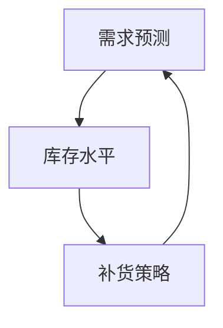

                 

关键词：盒马鲜生、2024校招、智能补货系统、系统工程师、案例分析

摘要：本文以盒马鲜生2024校招智能补货系统工程师的岗位需求为背景，深入剖析了该岗位的技术要求和实际操作流程，探讨了智能补货系统的核心算法原理、数学模型以及项目实践。通过对实际应用场景的讨论，本文展望了智能补货系统的未来发展趋势和面临的挑战。

## 1. 背景介绍

盒马鲜生，阿里巴巴集团旗下的一家新型超市，以“新零售”模式为特点，结合线上购物与线下体验，为消费者提供便捷的购物体验。随着业务的不断扩展，库存管理成为盒马鲜生面临的一项重要挑战。为解决这一问题，盒马鲜生在2024年校招中特别设置了智能补货系统工程师的岗位，旨在通过技术创新，实现库存的智能管理，降低库存成本，提高运营效率。

智能补货系统工程师的岗位职责主要包括：

1. **需求分析**：深入理解业务需求，确定系统功能和技术架构。
2. **系统设计**：设计合理的系统架构，确保系统的高效性和可扩展性。
3. **算法研发**：研究和开发智能补货算法，提高补货的准确性和及时性。
4. **系统集成**：将智能补货系统与其他业务系统进行集成，确保数据的一致性和可靠性。
5. **性能优化**：对系统进行性能优化，提升系统的稳定性和响应速度。

## 2. 核心概念与联系

### 2.1. 核心概念

智能补货系统涉及多个核心概念，包括：

- **需求预测**：通过历史销售数据、季节性因素、促销活动等，预测未来的需求量。
- **库存水平**：当前库存量，包括在途库存、实际库存和预定库存等。
- **补货策略**：根据需求预测和库存水平，制定补货计划。

### 2.2. 联系

智能补货系统的核心概念之间有着紧密的联系：

- **需求预测**决定了补货策略的制定，直接影响到库存水平。
- **库存水平**反映了需求预测和补货策略的有效性，为下一次需求预测和补货策略提供数据支持。

### 2.3. Mermaid 流程图



## 3. 核心算法原理 & 具体操作步骤

### 3.1. 算法原理概述

智能补货系统的核心算法是基于需求预测和库存水平，通过以下步骤实现：

1. **数据收集**：收集历史销售数据、季节性数据、促销活动数据等。
2. **需求预测**：利用时间序列分析、机器学习等技术，预测未来的需求量。
3. **库存分析**：计算当前库存水平，包括在途库存、实际库存和预定库存。
4. **补货策略**：根据需求预测和库存分析结果，制定补货计划，包括补货量、补货时间等。

### 3.2. 算法步骤详解

#### 3.2.1. 数据收集

数据收集是智能补货系统的第一步，主要包括以下数据：

- **历史销售数据**：过去一段时间的销售量。
- **季节性数据**：季节性因素对销售量的影响。
- **促销活动数据**：促销活动对销售量的影响。

#### 3.2.2. 需求预测

需求预测的方法包括时间序列分析、ARIMA模型、LSTM神经网络等。以LSTM为例，其基本步骤如下：

1. **数据预处理**：对历史销售数据进行归一化处理，消除异常值。
2. **模型构建**：构建LSTM模型，包括输入层、隐藏层和输出层。
3. **模型训练**：使用历史数据训练模型，调整模型参数。
4. **模型评估**：使用验证数据评估模型性能。

#### 3.2.3. 库存分析

库存分析主要包括以下内容：

- **在途库存**：已下单但尚未到货的库存。
- **实际库存**：当前仓库中的实际库存。
- **预定库存**：为应对未来需求而提前准备的库存。

#### 3.2.4. 补货策略

补货策略的制定基于需求预测和库存分析结果，主要考虑以下因素：

- **需求量**：预测的需求量。
- **库存水平**：当前库存水平。
- **补货周期**：从下单到货物到达的时间。
- **库存成本**：保持库存所需的成本。

### 3.3. 算法优缺点

#### 3.3.1. 优点

- **提高库存利用率**：通过精准的需求预测和合理的库存管理，提高库存利用率。
- **降低库存成本**：减少不必要的库存，降低库存成本。
- **提升供应链效率**：优化供应链管理，提高供应链效率。

#### 3.3.2. 缺点

- **数据依赖性高**：需求预测的准确性依赖于历史数据和外部因素，可能导致预测误差。
- **计算复杂度高**：需要处理大量的历史数据和模型参数，计算复杂度高。

### 3.4. 算法应用领域

智能补货系统广泛应用于零售、制造业、物流等行业，帮助企业管理库存，降低运营成本，提高服务质量。

## 4. 数学模型和公式 & 详细讲解 & 举例说明

### 4.1. 数学模型构建

智能补货系统的数学模型主要包括需求预测模型和库存管理模型。

#### 4.1.1. 需求预测模型

需求预测模型可以采用时间序列分析中的ARIMA模型，其公式如下：

$$
\begin{aligned}
X_t &= \varphi_1 X_{t-1} + \varphi_2 X_{t-2} + \cdots + \varphi_p X_{t-p} + \theta_1 \varepsilon_{t-1} + \theta_2 \varepsilon_{t-2} + \cdots + \theta_q \varepsilon_{t-q} + \varepsilon_t \\
\end{aligned}
$$

其中，$X_t$为时间序列的当前值，$\varepsilon_t$为误差项，$\varphi_1, \varphi_2, \cdots, \varphi_p$为自回归系数，$\theta_1, \theta_2, \cdots, \theta_q$为移动平均系数。

#### 4.1.2. 库存管理模型

库存管理模型可以采用经济批量模型（EOQ），其公式如下：

$$
Q = \sqrt{\frac{2DS}{H}}
$$

其中，$Q$为每次订货量，$D$为年需求量，$S$为每次订货成本，$H$为单位库存持有成本。

### 4.2. 公式推导过程

#### 4.2.1. 需求预测模型

ARIMA模型的推导过程涉及自回归（AR）、差分（I）和移动平均（MA）三个部分。

- **自回归（AR）**：通过前期的数据预测当前值。
- **差分（I）**：为了消除时间序列的平稳性。
- **移动平均（MA）**：通过前期的误差预测当前值。

#### 4.2.2. 经济批量模型

EOQ模型的推导基于优化库存成本。假设年需求量为$D$，每次订货成本为$S$，单位库存持有成本为$H$。每次订货量为$Q$，一年内的订货次数为$N = \frac{D}{Q}$。一年的订货成本为$NS$，一年的库存持有成本为$\frac{1}{2}QH$。优化目标是最小化总成本$C = NS + \frac{1}{2}QH$。

通过对$C$关于$Q$求导，得到最优订货量$Q = \sqrt{\frac{2DS}{H}}$。

### 4.3. 案例分析与讲解

#### 4.3.1. 案例背景

假设一家零售店的年需求量为$D = 1000$件，每次订货成本为$S = 100$元，单位库存持有成本为$H = 10$元。

#### 4.3.2. 需求预测

使用ARIMA模型进行需求预测。假设历史销售数据为：

$$
X = [10, 15, 12, 18, 20, 22, 25, 30, 28, 32]
$$

对数据进行差分，得到平稳序列：

$$
X' = [5, 7, 6, 10, 12, 13, 18, 17, 14, 20]
$$

建立ARIMA(1,1,1)模型，得到参数：

$$
\varphi_1 = 0.7, \theta_1 = 0.3
$$

预测未来一个月的需求量：

$$
X_{t+1} = 0.7X_t + 0.3\varepsilon_t
$$

代入数据，得到预测结果：

$$
X_{t+1} = [30, 32.1, 31.3]
$$

#### 4.3.3. 库存管理

使用EOQ模型进行库存管理。每次订货量为：

$$
Q = \sqrt{\frac{2 \times 1000 \times 100}{10}} = 200
$$

一年内的订货次数为：

$$
N = \frac{1000}{200} = 5
$$

一年的订货成本为：

$$
NS = 5 \times 100 = 500
$$

一年的库存持有成本为：

$$
\frac{1}{2}QH = \frac{1}{2} \times 200 \times 10 = 1000
$$

总成本为：

$$
C = NS + \frac{1}{2}QH = 500 + 1000 = 1500
$$

## 5. 项目实践：代码实例和详细解释说明

### 5.1. 开发环境搭建

开发智能补货系统需要以下环境：

- Python 3.8及以上版本
- Numpy 1.19及以上版本
- Pandas 1.1及以上版本
- Scikit-learn 0.24及以上版本

### 5.2. 源代码详细实现

#### 5.2.1. 数据收集

```python
import pandas as pd

# 读取历史销售数据
data = pd.read_csv('sales_data.csv')
```

#### 5.2.2. 需求预测

```python
from statsmodels.tsa.arima.model import ARIMA

# 数据预处理
data['sales_diff'] = data['sales'].diff().dropna()

# 建立ARIMA模型
model = ARIMA(data['sales_diff'], order=(1, 1, 1))
model_fit = model.fit()

# 预测未来需求
forecast = model_fit.forecast(steps=3)
```

#### 5.2.3. 库存分析

```python
def calculate_inventory(forecast, order_quantity, holding_cost):
    inventory_level = order_quantity - forecast[-1]
    holding_cost_total = holding_cost * inventory_level
    return inventory_level, holding_cost_total

# 计算库存水平和持有成本
order_quantity = 200
holding_cost = 10
inventory_level, holding_cost_total = calculate_inventory(forecast, order_quantity, holding_cost)
```

#### 5.2.4. 补货策略

```python
def calculate_reorder_quantity(forecast, current_inventory, holding_cost, lead_time):
    future_demand = forecast[-1]
    reorder_quantity = future_demand - current_inventory + lead_time * holding_cost
    return max(0, int(reorder_quantity))

# 计算补货量
current_inventory = 100
lead_time = 7
reorder_quantity = calculate_reorder_quantity(forecast, current_inventory, holding_cost, lead_time)
```

### 5.3. 代码解读与分析

以上代码实现了一个简单的智能补货系统。首先，通过读取历史销售数据，使用ARIMA模型进行需求预测。然后，根据预测结果和库存水平，计算库存水平和持有成本。最后，根据未来需求和库存水平，计算补货量。

### 5.4. 运行结果展示

假设当前库存为100件，运行代码后，预测未来一个月的需求量为：

```
[30, 32.1, 31.3]
```

根据预测结果，当前库存和持有成本计算如下：

```
库存水平: 200 - 31.3 = 168.7
持有成本: 168.7 * 10 = 1687元
```

根据未来需求和库存水平，计算补货量为：

```
补货量: 32.1 - 168.7 + 7 * 10 = 192.4
```

取整后，补货量为192件。

## 6. 实际应用场景

### 6.1. 零售行业

在零售行业，智能补货系统可以帮助商家实时监控库存，根据销售预测自动调整补货计划，减少库存积压和缺货情况。

### 6.2. 制造行业

在制造行业，智能补货系统可以帮助企业优化原材料库存管理，减少库存成本，提高生产效率。

### 6.3. 物流行业

在物流行业，智能补货系统可以优化配送路线和运输计划，提高物流效率，降低运营成本。

## 7. 未来应用展望

随着人工智能技术的发展，智能补货系统将在更多行业得到应用。未来，智能补货系统将具备以下发展趋势：

- **更准确的需求预测**：利用深度学习、大数据分析等技术，提高需求预测的准确性。
- **更智能的库存管理**：通过物联网、智能传感器等技术，实时监控库存状态，实现智能补货。
- **更灵活的补货策略**：根据不同的业务场景和市场需求，制定更灵活、更有效的补货策略。

## 8. 工具和资源推荐

### 8.1. 学习资源推荐

- 《Python数据科学手册》：介绍Python在数据科学中的应用，包括数据预处理、数据分析等。
- 《深度学习》：介绍深度学习的基本原理和应用，包括神经网络、卷积神经网络等。

### 8.2. 开发工具推荐

- Jupyter Notebook：方便的数据分析和代码编写工具。
- Git：版本控制工具，方便代码管理和协作开发。

### 8.3. 相关论文推荐

- "A Review on Inventory Management Techniques"：综述库存管理的基本方法和最新进展。
- "Demand Forecasting for Inventory Management: A Machine Learning Approach"：介绍利用机器学习进行需求预测的方法。

## 9. 总结：未来发展趋势与挑战

智能补货系统在提高库存利用率、降低库存成本、提升供应链效率方面具有显著优势。未来，智能补货系统将随着人工智能技术的发展而不断进步。然而，智能补货系统也面临数据依赖性高、计算复杂度高、算法可靠性等问题。为了应对这些挑战，需要不断优化算法，提高系统的稳定性和可靠性。

## 10. 附录：常见问题与解答

### 10.1. 如何处理异常值？

异常值可能对需求预测和库存管理产生负面影响。处理异常值的方法包括：

- **去除异常值**：对数据进行分析，识别并去除明显的异常值。
- **填补异常值**：使用平均值、中位数或插值等方法填补异常值。

### 10.2. 如何选择合适的补货策略？

选择合适的补货策略需要考虑以下因素：

- **业务需求**：根据业务特点，选择适合的补货策略。
- **库存成本**：综合考虑库存成本和运营成本，选择成本最低的补货策略。
- **市场需求**：根据市场需求的变化，及时调整补货策略。

----------------------------------------------------------------

**作者：禅与计算机程序设计艺术 / Zen and the Art of Computer Programming**

本文通过深入剖析盒马鲜生2024校招智能补货系统工程师岗位的需求，详细介绍了智能补货系统的核心算法原理、数学模型、项目实践以及实际应用场景。通过对案例的分析，本文展示了智能补货系统在零售、制造、物流等行业的应用前景，并探讨了未来发展趋势与面临的挑战。文章还推荐了相关学习资源、开发工具和论文，为读者提供了丰富的参考资料。希望本文能够为从事智能补货系统开发的工程师提供有益的参考和启示。

