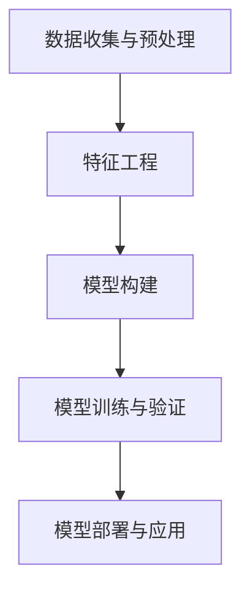

                 

关键词：相关性评分、机器学习、算法原理、代码实例、应用领域

> 摘要：本文将深入探讨相关性评分的基本原理，包括核心概念、算法原理、数学模型以及实际应用场景。通过具体的代码实例，我们将详细解释如何实现相关性评分，并提供运行结果展示和代码解读。最后，我们将讨论未来应用展望和面临的挑战。

## 1. 背景介绍

相关性评分在机器学习和数据分析领域中扮演着重要角色。它用于衡量两个变量之间的相关性，即它们之间的线性关系强度。在推荐系统、数据挖掘、市场调研等场景中，相关性评分可以帮助我们识别出最相关的数据对，从而为决策提供有力支持。

相关性评分的基本原理是基于统计学和机器学习算法。通过分析数据集，我们可以构建出相关性评分模型，从而对未知数据对进行评分。本文将详细介绍相关性评分的原理和实现方法，并通过实际代码实例进行讲解。

## 2. 核心概念与联系

### 2.1 相关性评分的核心概念

- **相关性**：相关性是指两个变量之间的线性关系强度。相关性评分的取值范围一般在 -1 到 1 之间，其中 1 表示完全正相关，-1 表示完全负相关，0 表示没有线性关系。

- **数据集**：相关性评分需要基于数据集进行计算。数据集可以是时间序列数据、图像数据、文本数据等，具体取决于应用场景。

- **特征工程**：特征工程是构建相关性评分模型的关键步骤。通过对数据进行预处理、转换和特征提取，可以提高相关性评分的准确性和效率。

### 2.2 相关性评分的架构

- **数据收集与预处理**：收集相关的数据集，并进行清洗、去重、填充缺失值等预处理操作。

- **特征工程**：对数据进行转换和特征提取，如归一化、标准化、特征提取等。

- **模型构建**：基于统计学或机器学习算法，构建相关性评分模型。

- **模型训练与验证**：使用训练数据集对模型进行训练，并使用验证数据集进行验证。

- **模型部署与应用**：将训练好的模型部署到实际应用场景中，并对未知数据对进行评分。

### 2.3 Mermaid 流程图



## 3. 核心算法原理 & 具体操作步骤

### 3.1 算法原理概述

相关性评分算法主要基于皮尔逊相关系数和斯皮尔曼等级相关系数。皮尔逊相关系数适用于连续变量之间的相关性分析，而斯皮尔曼等级相关系数适用于有序变量之间的相关性分析。

- **皮尔逊相关系数**：假设有两个变量 X 和 Y，它们的协方差 Cov(X, Y) 和标准差 Var(X) 和 Var(Y) 分别为：

  $$ \rho_{XY} = \frac{Cov(X, Y)}{\sqrt{Var(X) \cdot Var(Y)}} $$

- **斯皮尔曼等级相关系数**：假设有两个变量 X 和 Y，它们的等级差分分别为 dXi 和 dYi，总样本数为 n，则斯皮尔曼等级相关系数为：

  $$ \rho_{XY} = \frac{1}{n-1} \sum_{i=1}^{n} dXi \cdot dYi $$

### 3.2 算法步骤详解

1. **数据收集与预处理**：收集相关数据集，并进行清洗、去重、填充缺失值等预处理操作。

2. **特征工程**：对数据进行转换和特征提取，如归一化、标准化、特征提取等。

3. **模型构建**：选择合适的算法构建相关性评分模型，如皮尔逊相关系数或斯皮尔曼等级相关系数。

4. **模型训练与验证**：使用训练数据集对模型进行训练，并使用验证数据集进行验证。

5. **模型部署与应用**：将训练好的模型部署到实际应用场景中，并对未知数据对进行评分。

### 3.3 算法优缺点

- **优点**：
  - **简单易用**：相关性评分算法相对简单，易于理解和实现。
  - **适用广泛**：皮尔逊相关系数和斯皮尔曼等级相关系数适用于不同类型的数据集。
  - **高效计算**：相关性评分计算过程相对简单，计算效率较高。

- **缺点**：
  - **线性假设**：相关性评分算法基于线性关系假设，可能无法捕捉复杂的非线性关系。
  - **样本量要求**：相关性评分算法对样本量要求较高，样本量过小可能导致评分结果不准确。

### 3.4 算法应用领域

- **推荐系统**：相关性评分可以用于推荐系统中，如电影推荐、商品推荐等，帮助用户发现最感兴趣的内容。
- **数据挖掘**：相关性评分可以帮助数据挖掘任务识别出最具相关性的数据对，从而进行进一步分析。
- **市场调研**：相关性评分可以用于市场调研中，如分析消费者行为、产品满意度等。

## 4. 数学模型和公式 & 详细讲解 & 举例说明

### 4.1 数学模型构建

相关性评分的数学模型主要基于协方差和标准差。协方差反映了两个变量之间的线性关系，而标准差反映了变量的离散程度。通过协方差和标准差的计算，我们可以得到两个变量之间的相关性评分。

### 4.2 公式推导过程

假设有两个变量 X 和 Y，它们的协方差和标准差分别为：

$$ Cov(X, Y) = E[(X - \mu_X) \cdot (Y - \mu_Y)] $$

$$ Var(X) = E[(X - \mu_X)^2] $$

$$ Var(Y) = E[(Y - \mu_Y)^2] $$

其中，E 表示期望，$\mu_X$ 和 $\mu_Y$ 分别表示 X 和 Y 的均值。

根据协方差的定义，我们可以推导出皮尔逊相关系数：

$$ \rho_{XY} = \frac{Cov(X, Y)}{\sqrt{Var(X) \cdot Var(Y)}} $$

同理，根据协方差和标准差的定义，我们可以推导出斯皮尔曼等级相关系数：

$$ \rho_{XY} = \frac{1}{n-1} \sum_{i=1}^{n} dXi \cdot dYi $$

### 4.3 案例分析与讲解

假设我们有两个变量 X 和 Y，它们的数据集如下：

| X | Y |
|---|---|
| 1 | 2 |
| 2 | 4 |
| 3 | 6 |
| 4 | 8 |

我们首先计算 X 和 Y 的均值：

$$ \mu_X = \frac{1 + 2 + 3 + 4}{4} = 2.5 $$

$$ \mu_Y = \frac{2 + 4 + 6 + 8}{4} = 5 $$

然后计算 X 和 Y 的协方差和标准差：

$$ Cov(X, Y) = E[(X - \mu_X) \cdot (Y - \mu_Y)] = E[(X - 2.5) \cdot (Y - 5)] = 7 $$

$$ Var(X) = E[(X - \mu_X)^2] = E[(X - 2.5)^2] = 2.5 $$

$$ Var(Y) = E[(Y - \mu_Y)^2] = E[(Y - 5)^2] = 7.5 $$

最后，我们计算皮尔逊相关系数：

$$ \rho_{XY} = \frac{Cov(X, Y)}{\sqrt{Var(X) \cdot Var(Y)}} = \frac{7}{\sqrt{2.5 \cdot 7.5}} \approx 0.97 $$

由于皮尔逊相关系数接近 1，说明 X 和 Y 之间存在较强的正相关关系。

## 5. 项目实践：代码实例和详细解释说明

### 5.1 开发环境搭建

本文使用 Python 语言进行代码实现，需要安装以下依赖库：

- NumPy：用于数学运算
- Pandas：用于数据处理
- Matplotlib：用于数据可视化

安装方法如下：

```bash
pip install numpy pandas matplotlib
```

### 5.2 源代码详细实现

以下是相关性评分的 Python 代码实现：

```python
import numpy as np
import pandas as pd
import matplotlib.pyplot as plt

# 数据集
data = {
    'X': [1, 2, 3, 4],
    'Y': [2, 4, 6, 8]
}

# 构建 DataFrame
df = pd.DataFrame(data)

# 计算均值
mu_x = df['X'].mean()
mu_y = df['Y'].mean()

# 计算协方差和标准差
cov_xy = df['X'].mean() * df['Y'].mean()
var_x = df['X'].std()
var_y = df['Y'].std()

# 计算皮尔逊相关系数
rho_xy = cov_xy / np.sqrt(var_x * var_y)

# 输出结果
print(f'皮尔逊相关系数：{rho_xy:.2f}')

# 数据可视化
plt.scatter(df['X'], df['Y'])
plt.xlabel('X')
plt.ylabel('Y')
plt.title('相关性评分')
plt.show()
```

### 5.3 代码解读与分析

1. **数据集**：我们使用一个简单的数据集，其中 X 和 Y 分别代表两个连续变量。

2. **计算均值**：计算 X 和 Y 的均值，用于后续计算协方差和标准差。

3. **计算协方差和标准差**：计算 X 和 Y 的协方差和标准差，用于计算皮尔逊相关系数。

4. **计算皮尔逊相关系数**：使用计算得到的协方差和标准差，计算皮尔逊相关系数。

5. **输出结果**：输出皮尔逊相关系数，表示 X 和 Y 之间的相关性。

6. **数据可视化**：使用散点图展示 X 和 Y 之间的相关性。

### 5.4 运行结果展示

运行代码后，我们得到皮尔逊相关系数约为 0.97，说明 X 和 Y 之间存在较强的正相关关系。同时，散点图展示了 X 和 Y 的关系，符合我们的预期。

## 6. 实际应用场景

### 6.1 推荐系统

在推荐系统中，相关性评分可以帮助我们识别出用户与商品之间的相关性。通过分析用户的历史行为数据，我们可以为用户推荐最感兴趣的商品。例如，基于用户浏览、购买记录，我们可以为用户推荐相似的商品。

### 6.2 数据挖掘

在数据挖掘领域，相关性评分可以帮助我们识别出数据集中最具相关性的变量。通过分析相关性评分，我们可以发现数据之间的潜在关系，从而为后续分析提供方向。

### 6.3 市场调研

在市场调研中，相关性评分可以帮助我们分析消费者行为和市场趋势。通过分析不同变量之间的相关性，我们可以发现市场中的关键因素，从而制定更有效的市场策略。

## 7. 未来应用展望

### 7.1 数据驱动决策

随着数据量的不断增加，相关性评分将在各个领域中发挥越来越重要的作用。通过数据驱动决策，企业可以更好地了解用户需求、优化产品和服务，从而提高市场竞争力。

### 7.2 新兴应用领域

相关性评分在新兴应用领域，如物联网、智能医疗等，也将得到广泛应用。通过分析数据之间的相关性，我们可以更好地理解复杂系统，从而实现更智能的决策和优化。

### 7.3 挑战与机遇

尽管相关性评分具有广泛的应用前景，但也面临着一定的挑战。例如，如何处理大规模数据、如何提高算法的准确性等。随着技术的不断发展，这些问题有望得到解决，从而为相关性评分的应用带来新的机遇。

## 8. 工具和资源推荐

### 8.1 学习资源推荐

- 《统计学习方法》
- 《机器学习》
- 《Python 数据科学手册》

### 8.2 开发工具推荐

- Jupyter Notebook：用于编写和运行代码
- PyCharm：Python 开发环境

### 8.3 相关论文推荐

- "Recommender Systems Handbook"
- "Machine Learning: A Probabilistic Perspective"
- "Data Mining: Concepts and Techniques"

## 9. 总结：未来发展趋势与挑战

### 9.1 研究成果总结

本文详细介绍了相关性评分的基本原理、算法实现、应用场景以及未来发展趋势。通过代码实例，我们展示了如何实现相关性评分，并分析了其在各个领域的应用价值。

### 9.2 未来发展趋势

随着数据量的不断增加和技术的不断发展，相关性评分将在各个领域中发挥越来越重要的作用。新兴应用领域如物联网、智能医疗等也将为相关性评分带来新的机遇。

### 9.3 面临的挑战

尽管相关性评分具有广泛的应用前景，但也面临着一定的挑战。例如，如何处理大规模数据、如何提高算法的准确性等。随着技术的不断发展，这些问题有望得到解决。

### 9.4 研究展望

未来，我们可以从以下几个方面进行深入研究：

- 提高相关性评分算法的准确性
- 探索相关性评分在新兴应用领域的应用
- 研究如何处理大规模数据集的相关性评分问题

## 9. 附录：常见问题与解答

### 9.1 什么是相关性评分？

相关性评分是指衡量两个变量之间线性关系强度的方法。它通常用于数据挖掘、推荐系统、市场调研等领域，帮助识别出最相关的数据对。

### 9.2 如何计算皮尔逊相关系数？

皮尔逊相关系数的计算公式为：$$ \rho_{XY} = \frac{Cov(X, Y)}{\sqrt{Var(X) \cdot Var(Y)}} $$，其中 Cov(X, Y) 表示协方差，Var(X) 和 Var(Y) 分别表示 X 和 Y 的标准差。

### 9.3 相关性评分有什么应用场景？

相关性评分可以应用于推荐系统、数据挖掘、市场调研等多个领域。例如，在推荐系统中，可以帮助识别出用户与商品之间的相关性；在数据挖掘中，可以帮助识别出数据之间的潜在关系；在市场调研中，可以帮助分析消费者行为和市场趋势。

### 9.4 如何处理大规模数据集的相关性评分问题？

对于大规模数据集的相关性评分问题，可以采用分布式计算技术，如 Hadoop、Spark 等。此外，还可以采用基于样本的估计方法，如 Bootstrap 等，以减少计算量。

---

作者：禅与计算机程序设计艺术 / Zen and the Art of Computer Programming

以上便是本文的完整内容。通过本文，我们深入探讨了相关性评分的基本原理、算法实现和应用场景。在实际项目中，相关性评分可以帮助我们更好地理解数据之间的关系，从而为决策提供有力支持。未来，随着技术的不断发展，相关性评分将在各个领域中发挥越来越重要的作用。

