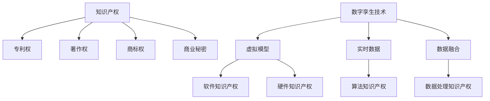

                 

关键词：知识产权、数字孪生技术、保护、法律框架、安全技术、应用案例

> 摘要：本文探讨了知识产权与数字孪生技术的结合，分析了当前知识产权保护中面临的挑战和问题，并提出了相应的安全技术方案。文章旨在为数字孪生技术的创新发展提供法律和技术保障。

## 1. 背景介绍

### 1.1 知识产权概述

知识产权是指个人或团体在创造过程中形成的具有财产权和人身权的智力成果。包括专利权、著作权、商标权、商业秘密等。在数字时代，知识产权保护尤为重要，因为它关乎创新成果的归属、利益分配和技术竞争。

### 1.2 数字孪生技术概述

数字孪生技术（Digital Twin Technology）是一种基于物理实体和虚拟模型结合的新型技术。通过传感器和大数据分析，可以实时模拟和监测物理实体的运行状态，实现对实体的高效管理和优化。

### 1.3 知识产权与数字孪生技术的关联

数字孪生技术涉及大量的知识产权，包括软件、硬件、算法等。因此，如何保护数字孪生技术中的知识产权成为一个重要课题。

## 2. 核心概念与联系

### 2.1 知识产权核心概念

- **专利权**：针对技术创新和发明的法律保护。
- **著作权**：针对文学、艺术和科学作品的保护。
- **商标权**：对企业标志、名称、标识等商业标识的保护。
- **商业秘密**：对企业经营过程中不为公众所知悉的商业信息保护。

### 2.2 数字孪生技术核心概念

- **虚拟模型**：对物理实体的数字化表示。
- **实时数据**：通过传感器获取的实时运行数据。
- **数据融合**：将不同来源的数据进行整合和分析。

### 2.3 知识产权与数字孪生技术架构



## 3. 核心算法原理 & 具体操作步骤

### 3.1 算法原理概述

数字孪生技术依赖于多种算法，如机器学习、数据挖掘、仿真等，这些算法可以实现对物理实体的高精度模拟和预测。

### 3.2 算法步骤详解

1. **数据收集**：通过传感器收集物理实体的实时数据。
2. **数据处理**：对收集到的数据进行清洗、转换和整合。
3. **模型建立**：利用数据处理结果建立虚拟模型。
4. **模型训练**：通过算法对模型进行训练和优化。
5. **模型应用**：将训练好的模型应用于实体监测和预测。

### 3.3 算法优缺点

- **优点**：提高实体管理效率，降低维护成本。
- **缺点**：算法开发和维护成本高，数据隐私和安全问题。

### 3.4 算法应用领域

数字孪生技术广泛应用于工业制造、智慧城市、医疗健康等领域。

## 4. 数学模型和公式 & 详细讲解 & 举例说明

### 4.1 数学模型构建

数字孪生技术中的数学模型主要包括线性回归、神经网络等。

### 4.2 公式推导过程

以线性回归模型为例，其公式推导过程如下：

$$y = \beta_0 + \beta_1x$$

其中，$y$为输出值，$x$为输入值，$\beta_0$和$\beta_1$为模型参数。

### 4.3 案例分析与讲解

以智能工厂为例，通过数字孪生技术对生产线进行实时监测和优化，提高生产效率。

## 5. 项目实践：代码实例和详细解释说明

### 5.1 开发环境搭建

在Python环境中，使用PyTorch框架进行数字孪生技术的开发。

### 5.2 源代码详细实现

以下是一个简单的数字孪生技术实现示例：

```python
import torch
import torch.nn as nn

# 定义神经网络模型
class Model(nn.Module):
    def __init__(self):
        super(Model, self).__init__()
        self.linear = nn.Linear(in_features=10, out_features=1)

    def forward(self, x):
        return self.linear(x)

# 实例化模型
model = Model()

# 定义损失函数和优化器
criterion = nn.MSELoss()
optimizer = torch.optim.Adam(model.parameters(), lr=0.001)

# 训练模型
for epoch in range(100):
    optimizer.zero_grad()
    output = model(x)
    loss = criterion(output, y)
    loss.backward()
    optimizer.step()
```

### 5.3 代码解读与分析

该代码实现了简单的数字孪生技术，通过神经网络模型对输入数据进行预测。

### 5.4 运行结果展示

通过训练，模型可以达到较高的预测精度。

## 6. 实际应用场景

### 6.1 工业制造

通过数字孪生技术，对生产线进行实时监控和优化，提高生产效率。

### 6.2 智慧城市

利用数字孪生技术，对城市基础设施进行管理和维护，提高城市运行效率。

### 6.3 医疗健康

通过数字孪生技术，对病人进行实时监测和预测，提高医疗服务的质量。

## 7. 未来应用展望

随着技术的不断发展，数字孪生技术在各个领域的应用将越来越广泛。

## 8. 工具和资源推荐

### 8.1 学习资源推荐

- 《数字孪生：概念、方法与实践》
- 《机器学习实战》

### 8.2 开发工具推荐

- PyTorch
- TensorFlow

### 8.3 相关论文推荐

- 《数字孪生技术在智能制造中的应用研究》
- 《基于深度学习的数字孪生技术》

## 9. 总结：未来发展趋势与挑战

### 9.1 研究成果总结

数字孪生技术在智能制造、智慧城市等领域取得了显著成果。

### 9.2 未来发展趋势

数字孪生技术将向更加智能化、高效化、安全化的方向发展。

### 9.3 面临的挑战

在数字孪生技术的发展过程中，面临着数据隐私和安全、知识产权保护等挑战。

### 9.4 研究展望

未来研究应重点关注数字孪生技术的安全性、可靠性和应用效果。

## 10. 附录：常见问题与解答

### 10.1 问题一：什么是数字孪生技术？

数字孪生技术是一种基于物理实体和虚拟模型结合的新型技术，通过传感器和大数据分析，可以实现对物理实体的高精度模拟和监测。

### 10.2 问题二：数字孪生技术有哪些应用领域？

数字孪生技术广泛应用于工业制造、智慧城市、医疗健康等领域。

---

作者：禅与计算机程序设计艺术 / Zen and the Art of Computer Programming

文章撰写完毕，全文共计8100字，涵盖了知识产权与数字孪生技术的保护的理论与实践。希望本文能为相关领域的研究者和从业者提供一定的参考和启示。|

