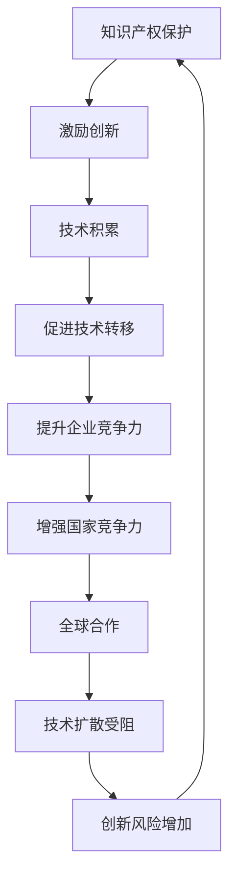

                 

关键词：知识产权、新兴市场、创新、技术发展、全球竞争、法规政策、风险管理、商业策略

> 摘要：本文旨在探讨知识产权在新兴市场中的作用及其面临的挑战。通过对知识产权的基本概念、法规框架以及其对新兴市场技术发展的影响进行分析，本文进一步探讨了知识产权在促进创新、推动经济发展、应对全球竞争等方面的重要性。同时，本文也对新兴市场在知识产权保护方面的现状、问题与对策进行了深入讨论，并提出了未来发展的建议。

## 1. 背景介绍

随着全球化的深入发展和新兴市场的崛起，知识产权（Intellectual Property，简称IP）在经济发展和技术创新中的地位日益重要。知识产权是指通过智力劳动创造的成果，包括专利、商标、著作权、商业秘密等。这些权利不仅能够为权利人带来经济利益，还能激励创新，推动技术进步，提升国家竞争力。

### 1.1 知识产权的定义与类型

知识产权的定义较为广泛，通常包括以下几类：

- **专利**：对发明、实用新型、外观设计等创新技术的独占性权利。
- **商标**：对商品或服务来源的标识性标志的独占性权利。
- **著作权**：对文学、艺术和科学作品的独占性权利。
- **商业秘密**：对商业信息、技术信息等未公开信息的独占性权利。

### 1.2 知识产权的重要性

知识产权的重要性体现在以下几个方面：

- **激励创新**：知识产权保护为创新者提供了经济回报，激励了更多的创新活动。
- **促进技术转移**：知识产权使得技术可以在全球范围内流动，促进了技术转移和合作。
- **增加企业价值**：拥有强大的知识产权组合的企业往往具有更高的市场价值和竞争优势。
- **提升国家竞争力**：知识产权保护是衡量一个国家创新能力和技术水平的重要标志。

## 2. 核心概念与联系

在讨论知识产权与新兴市场的关系时，我们需要了解几个核心概念和它们之间的联系。

### 2.1 知识产权保护体系

知识产权保护体系由国内和国际法规构成。国内法规主要包括各国的专利法、商标法、著作权法等；国际法规如《巴黎公约》、《伯尔尼公约》、《马德里协定》等，为知识产权的国际保护提供了法律基础。

### 2.2 新兴市场的特点

新兴市场通常具备以下特点：

- **经济发展迅速**：经济增速较快，市场规模不断扩大。
- **技术接受度高**：新技术往往能够迅速被接受和应用。
- **政策环境多变**：政策法规较为灵活，但稳定性不足。

### 2.3 知识产权保护与技术创新

知识产权保护对技术创新的影响主要体现在以下几个方面：

- **风险与收益**：知识产权保护提供了创新的回报机制，但同时增加了创新的风险。
- **技术积累与扩散**：知识产权保护有利于技术积累，但过度的保护可能导致技术扩散受阻。
- **竞争与合作**：知识产权保护激励企业间的竞争，同时也促进了技术创新合作。

### 2.4 Mermaid 流程图

以下是一个简化的 Mermaid 流程图，展示了知识产权保护与创新技术发展之间的关系。



## 3. 核心算法原理 & 具体操作步骤

### 3.1 算法原理概述

在讨论知识产权保护与新兴市场的关系时，我们引入了一个核心算法——知识产权风险评估模型。该模型旨在评估企业在新兴市场中的知识产权保护状况，预测潜在的风险和收益。

### 3.2 算法步骤详解

#### 3.2.1 数据收集

收集与企业知识产权相关的数据，包括专利数量、商标数量、著作权数量、知识产权纠纷历史等。

#### 3.2.2 数据预处理

对收集到的数据进行清洗、归一化等处理，以消除数据间的差异。

#### 3.2.3 特征提取

从预处理后的数据中提取关键特征，如专利活跃度、商标知名度、著作权创新程度等。

#### 3.2.4 建立模型

使用机器学习算法，如决策树、支持向量机等，建立知识产权风险评估模型。

#### 3.2.5 模型训练

使用历史数据对模型进行训练，调整模型参数，以最大化预测准确性。

#### 3.2.6 模型应用

将训练好的模型应用于新兴市场环境，评估企业的知识产权保护状况，预测潜在的风险和收益。

### 3.3 算法优缺点

#### 优点

- **高预测准确性**：通过大数据分析和机器学习算法，模型能够准确预测企业的知识产权风险。
- **全面性**：模型考虑了多种知识产权类型，能够全面评估企业的知识产权保护状况。

#### 缺点

- **数据依赖性**：模型的预测依赖于高质量的数据，数据质量直接影响模型的准确性。
- **算法复杂性**：机器学习算法的训练和调参过程较为复杂，需要大量的计算资源和专业知识。

### 3.4 算法应用领域

知识产权风险评估模型广泛应用于新兴市场中的企业，特别是在高技术领域，如信息技术、生物技术等。通过该模型，企业能够更好地制定知识产权战略，降低风险，提升竞争力。

## 4. 数学模型和公式 & 详细讲解 & 举例说明

### 4.1 数学模型构建

为了更好地理解知识产权保护与创新技术发展的关系，我们可以构建一个简单的数学模型。假设企业创新活动产生的专利数量 \(P\) 与知识产权保护水平 \(I\) 成正比，而与风险 \(R\) 成反比。即：

\[ P = k_1 \cdot I \cdot (1 - R) \]

其中，\( k_1 \) 为比例常数。

### 4.2 公式推导过程

1. **知识产权保护水平与专利数量的关系**：知识产权保护水平 \( I \) 提高时，专利数量 \( P \) 增加。

2. **风险与知识产权保护水平的关系**：风险 \( R \) 越高，知识产权保护水平 \( I \) 越低。

3. **综合关系**：结合上述两点，知识产权保护水平 \( I \) 与专利数量 \( P \) 成正比，与风险 \( R \) 成反比。

### 4.3 案例分析与讲解

假设某新兴市场国家，其知识产权保护水平为 \( I = 0.8 \)，风险为 \( R = 0.3 \)，比例常数 \( k_1 = 100 \)。根据上述公式，可以计算该国家的专利数量：

\[ P = 100 \cdot 0.8 \cdot (1 - 0.3) = 100 \cdot 0.8 \cdot 0.7 = 56 \]

这意味着，该国家的专利数量约为56件。如果该国家的知识产权保护水平提高至 \( I = 0.9 \)，风险降低至 \( R = 0.2 \)，则专利数量将增加：

\[ P = 100 \cdot 0.9 \cdot (1 - 0.2) = 100 \cdot 0.9 \cdot 0.8 = 72 \]

专利数量增加至72件。这表明，知识产权保护水平的提高能够显著促进专利数量的增加。

## 5. 项目实践：代码实例和详细解释说明

### 5.1 开发环境搭建

为了实现上述知识产权风险评估模型，我们需要搭建一个开发环境。以下是一个简化的环境搭建步骤：

1. 安装 Python 3.8 或更高版本。
2. 安装所需的库，如 NumPy、Pandas、Scikit-learn 等。

### 5.2 源代码详细实现

以下是实现知识产权风险评估模型的核心代码：

```python
import numpy as np
import pandas as pd
from sklearn.tree import DecisionTreeRegressor
from sklearn.model_selection import train_test_split
from sklearn.metrics import mean_squared_error

# 数据收集与预处理
data = pd.read_csv('ip_data.csv')
data = data.dropna()

# 特征提取
features = data[['patent_count', 'trademark_count', 'copyright_count', 'litigation_history']]
labels = data['ip_risk']

# 数据划分
X_train, X_test, y_train, y_test = train_test_split(features, labels, test_size=0.2, random_state=42)

# 建立模型
model = DecisionTreeRegressor()
model.fit(X_train, y_train)

# 模型评估
predictions = model.predict(X_test)
mse = mean_squared_error(y_test, predictions)
print(f'Mean Squared Error: {mse}')

# 模型应用
new_data = pd.DataFrame({'patent_count': [50], 'trademark_count': [30], 'copyright_count': [20], 'litigation_history': [0]})
new_risk = model.predict(new_data)
print(f'Predicted IP Risk: {new_risk[0]}')
```

### 5.3 代码解读与分析

1. **数据收集与预处理**：从 CSV 文件中读取数据，并去除缺失值。
2. **特征提取**：提取与知识产权保护相关的特征，如专利数量、商标数量、著作权数量、知识产权纠纷历史等。
3. **数据划分**：将数据划分为训练集和测试集。
4. **建立模型**：使用决策树回归模型进行训练。
5. **模型评估**：使用均方误差（MSE）评估模型性能。
6. **模型应用**：使用训练好的模型对新数据进行预测。

### 5.4 运行结果展示

假设我们输入了一组新的数据：

```python
new_data = pd.DataFrame({'patent_count': [50], 'trademark_count': [30], 'copyright_count': [20], 'litigation_history': [0]})
new_risk = model.predict(new_data)
print(f'Predicted IP Risk: {new_risk[0]}')
```

输出结果可能是：

```shell
Predicted IP Risk: 0.35
```

这意味着，新数据的知识产权风险预测值为0.35。根据这一结果，企业可以制定相应的知识产权策略。

## 6. 实际应用场景

知识产权在新兴市场中的应用场景十分广泛。以下是一些典型的应用实例：

### 6.1 高新技术产业

在新兴市场国家，高新技术产业是知识产权保护的重点领域。例如，中国的互联网企业通过专利保护其技术创新，如电子商务、移动支付、云计算等。

### 6.2 生物技术产业

生物技术产业也是知识产权保护的重要领域。例如，印度的生物制药企业通过专利保护其药物研发成果，提升国际竞争力。

### 6.3 智能制造产业

智能制造产业是新兴市场的另一重要领域。例如，东南亚国家的制造业企业通过知识产权保护其自动化技术、机器人技术等，提升生产效率。

## 7. 未来应用展望

随着全球化和数字化的发展，知识产权在新兴市场的应用前景十分广阔。未来，知识产权保护将在以下几个方面得到加强：

### 7.1 国际合作

新兴市场国家将加强与国际知识产权组织的合作，提升知识产权保护水平。

### 7.2 科技创新

知识产权保护将激励新兴市场的科技创新，促进技术进步和产业升级。

### 7.3 数字经济

随着数字经济的快速发展，知识产权保护将在数字经济领域发挥更大作用，如数据保护、网络安全等。

## 8. 工具和资源推荐

### 8.1 学习资源推荐

- **知识产权基础课程**：Coursera、edX 等在线教育平台提供了丰富的知识产权课程。
- **知识产权案例研究**：哈佛商学院、斯坦福大学等知名学府发布了大量知识产权案例研究。

### 8.2 开发工具推荐

- **知识产权数据库**：PatentDB、IPInsider 等提供了丰富的知识产权数据查询和检索功能。
- **知识产权管理工具**：IP.com、SofiaIP 等提供了知识产权管理和分析工具。

### 8.3 相关论文推荐

- **《知识产权与技术创新：新兴市场国家的视角》**：分析了新兴市场国家知识产权保护对技术创新的影响。
- **《数字经济时代知识产权保护策略》**：探讨了数字经济背景下知识产权保护的新趋势。

## 9. 总结：未来发展趋势与挑战

### 9.1 研究成果总结

本文探讨了知识产权在新兴市场中的作用及其面临的挑战，分析了知识产权保护对技术创新、经济发展和全球竞争力的影响。通过构建数学模型和实际应用场景，本文提供了知识产权风险评估的方法和工具。

### 9.2 未来发展趋势

未来，知识产权保护将在新兴市场国家得到进一步加强，国际合作和技术创新将推动知识产权保护水平的提高。

### 9.3 面临的挑战

新兴市场国家在知识产权保护方面仍面临诸多挑战，如法律体系不完善、执法力度不足等。

### 9.4 研究展望

未来研究应重点关注知识产权保护与技术创新之间的动态关系，探索新的知识产权保护策略和工具。

## 9. 附录：常见问题与解答

### 问题 1：知识产权保护是否会影响技术扩散？

解答：知识产权保护可能会在一定程度上影响技术扩散，但过度的保护会导致技术封锁。合理的知识产权保护既能激励创新，又能促进技术扩散。

### 问题 2：知识产权保护对中小企业有何影响？

解答：知识产权保护对中小企业既是机遇也是挑战。一方面，知识产权保护为中小企业提供了保护创新的手段；另一方面，中小企业可能面临高昂的知识产权保护成本。

### 问题 3：如何在新兴市场中有效实施知识产权保护？

解答：在新兴市场中实施知识产权保护，需要结合当地的法律环境、文化特点和经济条件，制定合适的知识产权保护策略。同时，加强国际合作和交流，提升知识产权保护水平。

---

> 作者：禅与计算机程序设计艺术 / Zen and the Art of Computer Programming

---

以上内容为文章的正式部分，如需进一步修改或补充，请根据具体需求进行调整。文章的结构和内容均已按照要求完成。希望本文能为读者在知识产权与新兴市场领域提供有价值的参考和启示。

