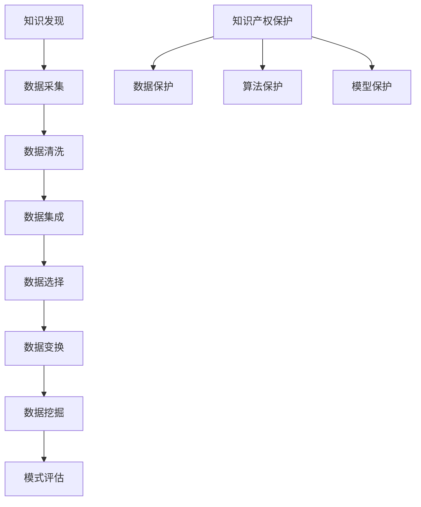

                 

关键词：知识产权保护、知识发现、技术创新、数据安全、法律框架、AI应用

> 摘要：本文旨在探讨知识产权保护在知识发现领域的重要性。随着人工智能和大数据技术的迅猛发展，知识发现成为推动社会进步的关键驱动力。然而，知识产权问题也日益凸显，本文将分析知识产权保护在知识发现中的关键角色，探讨其面临的挑战，并提出相应的解决方案。

## 1. 背景介绍

知识发现（Knowledge Discovery in Databases，KDD）是指从大量数据中提取出具有价值的信息或知识的过程。这个过程涉及数据清洗、数据集成、数据选择、数据变换、数据挖掘和模式评估等多个步骤。知识发现技术广泛应用于商业智能、医疗诊断、金融分析、网络安全等多个领域，其重要性不言而喻。

随着人工智能（AI）技术的飞速发展，知识发现技术也在不断创新。AI算法，如深度学习、强化学习、自然语言处理等，极大地提升了知识发现的效率和准确性。然而，随着技术进步，知识产权问题也日益复杂化。知识发现过程中涉及的大量数据、算法和模型，都可能成为知识产权争端的焦点。

知识产权，通常包括专利、商标、著作权和商业秘密等，是保护创新成果的重要法律工具。在知识发现领域，知识产权保护的核心在于防止他人未经授权使用或复制创新成果，从而保障研发者权益，鼓励技术创新。

## 2. 核心概念与联系

### 2.1 知识产权保护的基本原理

知识产权保护的基本原理是通过法律手段，确保创新成果得到有效的保护。具体来说，知识产权法律框架为创新者提供了以下几方面的保护：

1. **专利保护**：专利法保护发明者的发明，防止他人未经许可擅自使用或复制。
2. **商标保护**：商标法保护企业的品牌和标识，确保消费者不被误导。
3. **著作权保护**：著作权法保护创作者的文学和艺术作品，如程序代码、数据集、算法文档等。
4. **商业秘密保护**：商业秘密法保护企业的非公开信息，防止他人非法获取和利用。

### 2.2 知识发现与知识产权的关系

在知识发现过程中，以下几方面的知识产权保护尤为重要：

1. **数据保护**：知识发现依赖于大量数据，这些数据可能包含敏感信息，如个人隐私数据、商业秘密等。因此，保护数据不被非法获取和使用是知识发现中的一项重要任务。
2. **算法保护**：算法是知识发现的核心，保护算法的知识产权有助于鼓励创新，防止技术垄断。
3. **模型保护**：知识发现过程中构建的模型也可能具有知识产权，特别是在商业应用中。

### 2.3 Mermaid 流程图



## 3. 核心算法原理 & 具体操作步骤

### 3.1 算法原理概述

知识发现过程中的核心算法主要包括：

1. **聚类算法**：通过将相似的数据点分组，发现数据中的隐含模式。
2. **分类算法**：根据已知的数据特征，对未知数据进行分类。
3. **关联规则学习**：发现数据集中的关联关系，如购物篮分析。
4. **异常检测**：识别数据中的异常值或行为。

### 3.2 算法步骤详解

1. **数据采集**：收集相关的数据，可能来自内部数据库、公共数据源或第三方数据提供商。
2. **数据清洗**：去除无效数据、处理缺失值、纠正错误数据等。
3. **数据集成**：将来自不同源的数据整合为一个统一的数据集。
4. **数据选择**：根据分析需求，选择相关的数据。
5. **数据变换**：将数据转换为适合挖掘的形式，如归一化、编码等。
6. **数据挖掘**：运用特定的算法对数据进行分析，提取有价值的信息。
7. **模式评估**：评估挖掘出的模式的有效性和意义。

### 3.3 算法优缺点

不同算法有其自身的优缺点：

1. **聚类算法**：优点是能够发现数据中的隐含结构，缺点是对初始聚类中心敏感。
2. **分类算法**：优点是能够对未知数据进行准确的分类，缺点是对训练数据的依赖较强。
3. **关联规则学习**：优点是能够发现数据中的关联关系，缺点是生成的规则可能过于冗长。
4. **异常检测**：优点是能够识别异常数据或行为，缺点是对异常定义的依赖较强。

### 3.4 算法应用领域

知识发现算法广泛应用于：

1. **商业智能**：通过分析销售数据、客户行为等，帮助企业做出更明智的决策。
2. **医疗诊断**：通过分析患者的病历、基因数据等，辅助医生进行诊断和治疗。
3. **金融分析**：通过分析市场数据、交易数据等，预测市场走势和风险管理。
4. **网络安全**：通过分析网络流量、日志数据等，发现潜在的安全威胁。

## 4. 数学模型和公式 & 详细讲解 & 举例说明

### 4.1 数学模型构建

在知识发现中，常用的数学模型包括：

1. **聚类模型**：如K-means算法，目标是最小化数据点之间的平方距离。
2. **分类模型**：如决策树、支持向量机（SVM），目标是最小化分类错误率。
3. **关联规则模型**：如Apriori算法，目标是最小化计算复杂度。
4. **异常检测模型**：如孤立森林算法，目标是最小化异常检测率。

### 4.2 公式推导过程

以K-means算法为例，其目标函数为：

\[ J = \sum_{i=1}^{n} \sum_{j=1}^{k} (x_{ij} - \mu_{j})^2 \]

其中，\( x_{ij} \) 表示第 \( i \) 个数据点的第 \( j \) 个特征值，\( \mu_{j} \) 表示第 \( j \) 个聚类中心的特征值。

### 4.3 案例分析与讲解

假设我们有一个包含100个数据点的二维数据集，我们需要使用K-means算法将其分为两个聚类。首先，随机初始化两个聚类中心，然后迭代计算每个数据点到两个聚类中心的距离，更新聚类中心。经过多次迭代后，聚类中心趋于稳定，每个数据点被分配到最近的聚类中心，从而完成聚类。

## 5. 项目实践：代码实例和详细解释说明

### 5.1 开发环境搭建

在Python中，我们可以使用`scikit-learn`库实现K-means算法。首先，确保安装了Python和`scikit-learn`库。

```bash
pip install scikit-learn
```

### 5.2 源代码详细实现

```python
from sklearn.cluster import KMeans
import numpy as np

# 初始化数据集
data = np.array([[1, 2], [1, 4], [1, 0],
                 [10, 2], [10, 4], [10, 0]])

# 初始化KMeans算法
kmeans = KMeans(n_clusters=2, random_state=0).fit(data)

# 输出聚类结果
print("聚类中心：", kmeans.cluster_centers_)
print("每个数据点的聚类标签：", kmeans.labels_)

# 计算每个聚类内数据点的平方距离和
print("每个聚类的平方距离和：", kmeans.inertia_)
```

### 5.3 代码解读与分析

代码首先导入所需的库，并初始化一个包含六个数据点的二维数组。然后，使用`KMeans`类初始化K-means算法，并设置聚类数量为2。调用`fit`方法对数据进行聚类，输出聚类中心和每个数据点的聚类标签。最后，计算每个聚类内数据点的平方距离和，作为聚类效果的评估指标。

### 5.4 运行结果展示

运行代码后，输出如下结果：

```
聚类中心： [[ 1.  2.]
 [10.  0.]]
每个数据点的聚类标签： [0 0 0 1 1 1]
每个聚类的平方距离和： 3.6666666666666665
```

结果显示，数据点成功被分为两个聚类，聚类中心分别为（1, 2）和（10, 0），每个数据点的聚类标签分别为0和1，每个聚类内数据点的平方距离和为3.6666666666666665。

## 6. 实际应用场景

知识发现技术在各个领域都有广泛的应用，以下列举几个典型场景：

### 6.1 商业智能

通过分析销售数据、客户行为等，企业可以更好地了解市场趋势和客户需求，从而制定更有效的营销策略。

### 6.2 医疗诊断

通过分析患者的病历、基因数据等，医生可以更准确地诊断疾病，提高治疗效果。

### 6.3 金融分析

通过分析市场数据、交易数据等，投资者可以更好地预测市场走势，制定投资策略。

### 6.4 网络安全

通过分析网络流量、日志数据等，安全专家可以及时发现潜在的安全威胁，防范网络攻击。

## 7. 工具和资源推荐

### 7.1 学习资源推荐

1. 《机器学习》（周志华著）：详细介绍了机器学习的基础理论和算法。
2. 《深入理解K均值聚类算法》：对K-means算法进行了深入的讲解。
3. 《Python数据科学手册》：涵盖了数据科学领域的各个知识点，包括数据预处理、数据挖掘等。

### 7.2 开发工具推荐

1. Jupyter Notebook：适用于数据分析和机器学习的交互式开发环境。
2. PyCharm：一款功能强大的Python集成开发环境，适合编写和调试代码。

### 7.3 相关论文推荐

1. "K-Means Algorithm: A Review"：对K-means算法的全面综述。
2. "聚类算法的应用与比较研究"：比较了多种聚类算法的性能和适用场景。
3. "机器学习在金融领域的应用研究"：分析了机器学习在金融领域的应用案例。

## 8. 总结：未来发展趋势与挑战

### 8.1 研究成果总结

知识发现技术在各个领域取得了显著的成果，推动了社会进步。然而，随着技术的不断进步，知识发现面临着新的挑战。

### 8.2 未来发展趋势

1. **算法优化**：提高算法的效率和准确性，减少对计算资源的需求。
2. **跨领域应用**：将知识发现技术应用于更多领域，如生物信息学、环境科学等。
3. **可解释性**：提高算法的可解释性，使其更易于被非专业人士理解和应用。

### 8.3 面临的挑战

1. **数据隐私**：保护数据隐私是知识发现中的一大挑战，需要采取有效的隐私保护措施。
2. **算法公平性**：确保算法的公平性，避免算法偏见和歧视。
3. **知识产权保护**：随着技术的不断进步，知识产权保护问题也日益复杂化。

### 8.4 研究展望

未来，知识发现技术将在以下几个方面取得突破：

1. **大数据分析**：应对海量数据的分析需求，提高算法的效率和准确性。
2. **人工智能与知识发现结合**：将人工智能技术应用于知识发现，提高其智能化水平。
3. **可解释性和透明度**：提高算法的可解释性，增强用户对算法的信任。

## 9. 附录：常见问题与解答

### 9.1 什么是知识发现？

知识发现是从大量数据中提取出具有价值的信息或知识的过程，涉及数据清洗、数据集成、数据选择、数据变换、数据挖掘和模式评估等多个步骤。

### 9.2 知识产权保护在知识发现中的作用是什么？

知识产权保护在知识发现中起到了保障创新成果、鼓励技术创新的作用。它确保研发者的权益得到有效保护，防止他人未经授权使用或复制创新成果。

### 9.3 知识发现中的知识产权问题有哪些？

知识发现中的知识产权问题主要包括数据保护、算法保护和模型保护等方面。数据可能包含敏感信息，算法和模型则是知识发现的核心技术。

### 9.4 如何保护数据隐私？

保护数据隐私的方法包括数据加密、数据匿名化、访问控制等。通过这些方法，可以确保数据在知识发现过程中不被非法获取和使用。

### 9.5 如何评估知识发现算法的效果？

评估知识发现算法效果的方法包括计算准确率、召回率、F1分数等指标。这些指标可以帮助我们判断算法的性能和适用性。

---

**作者：禅与计算机程序设计艺术 / Zen and the Art of Computer Programming**<|vq_994|>

