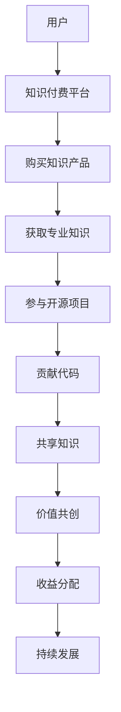

                 

关键词：知识付费，开源项目，商业模式，联合营销，创新策略

> 摘要：本文旨在探讨知识付费与开源项目的结合，分析其背后的商业模式，探讨这种创新模式的优劣势以及未来发展趋势。文章将详细描述知识付费与开源项目的融合方式，并通过实际案例展示其应用效果。此外，还将为相关从业者提供一些建议和资源，以助力他们在这一新兴领域取得成功。

## 1. 背景介绍

在数字化时代，知识付费和开源项目逐渐成为重要的商业模式。知识付费是指用户为获取高质量、专业化的知识或服务而付费的行为。而开源项目则是指将软件源代码公开，允许社区成员自由修改、使用和分发的一种开发模式。两者在表面上看似对立，实则有着天然的契合点。

近年来，随着互联网的普及和知识经济的兴起，知识付费市场迅速扩张。据研究机构Statista的数据显示，2021年全球知识付费市场规模已达到4000亿美元，预计到2026年将达到7500亿美元。与此同时，开源项目的发展也在加速，GitHub数据显示，截至2022年，全球已有超过4000万个开源项目，吸引了数百万开发者参与。

## 2. 核心概念与联系

知识付费与开源项目的结合，可以看作是一种新的商业模式。其核心概念包括以下几个方面：

1. **价值共创**：知识付费提供方（如专业机构、个人专家）通过分享专业知识或技能，为用户创造价值。而开源项目则为用户提供了一个自由、开放的参与平台，让用户能够自由地获取、修改和使用代码。

2. **共享经济**：知识付费与开源项目的结合，实现了知识的共享和传递。用户不仅能够购买知识产品，还可以参与开源项目，为项目的发展贡献力量。

3. **联合营销**：知识付费与开源项目的合作，可以形成一种联合营销效应。例如，某知名开源项目可以通过知识付费提供方的影响力，吸引更多用户参与项目，同时为知识付费提供方带来流量和收入。

下面是一个简化的Mermaid流程图，展示了知识付费与开源项目的融合方式：



## 3. 核心算法原理 & 具体操作步骤

### 3.1 算法原理概述

知识付费与开源项目的结合，本质上是一种基于价值的共创和共享的算法。其核心原理可以概括为：

1. **用户需求分析**：通过对用户需求的分析，确定知识付费产品的内容和形式。

2. **知识产品化**：将专业知识或技能转化为知识产品，并通过知识付费平台进行销售。

3. **开源项目搭建**：搭建一个开源项目，为用户提供一个自由、开放的参与平台。

4. **用户参与与贡献**：鼓励用户参与开源项目，贡献代码或提供其他形式的帮助。

5. **知识共享与传递**：通过开源项目，实现知识的共享和传递，为用户提供更多的价值。

### 3.2 算法步骤详解

1. **需求分析**：通过问卷调查、用户访谈等方式，了解用户的需求和痛点，确定知识付费产品的内容和形式。

2. **产品化**：将专业知识或技能转化为知识产品，包括视频教程、电子书籍、线上课程等。

3. **平台搭建**：选择合适的知识付费平台，如网易云课堂、腾讯课堂等，进行产品的上架和销售。

4. **开源项目创建**：在GitHub、GitLab等开源平台上创建项目，发布项目说明书，吸引开发者参与。

5. **用户参与**：通过社区活动、线上讨论等方式，鼓励用户参与开源项目，贡献代码或提供其他形式的帮助。

6. **知识共享**：通过项目文档、代码注释、社区讨论等方式，实现知识的共享和传递。

7. **收益分配**：根据用户的贡献程度，进行收益的分配，激励用户持续参与。

### 3.3 算法优缺点

#### 优点：

1. **提高用户粘性**：通过知识付费与开源项目的结合，可以增加用户的参与感和归属感，提高用户粘性。

2. **实现价值共创**：知识付费与开源项目的结合，可以实现用户与知识提供方之间的价值共创，为用户带来更多的价值。

3. **降低开发成本**：开源项目可以吸引更多的开发者参与，降低项目的开发成本。

#### 缺点：

1. **版权风险**：开源项目可能会涉及到版权问题，需要确保项目的合法性。

2. **质量风险**：用户贡献的代码可能存在质量问题，需要加强代码审核和管理。

3. **收益分配不均**：在收益分配方面，可能存在不公平现象，需要建立合理的收益分配机制。

### 3.4 算法应用领域

知识付费与开源项目的结合，可以在多个领域得到应用：

1. **教育培训**：通过知识付费购买专业课程，用户可以参与开源项目，为项目的发展贡献力量。

2. **软件开发**：开发者可以通过知识付费购买专业工具或教程，参与开源项目的开发。

3. **技术咨询**：专业机构可以通过知识付费提供咨询服务，同时参与开源项目的开发。

## 4. 数学模型和公式 & 详细讲解 & 举例说明

### 4.1 数学模型构建

知识付费与开源项目的结合，可以看作是一个动态博弈过程。其数学模型可以构建如下：

\[ V(U, P) = f(U, P) \]

其中，\( V(U, P) \) 表示用户 \( U \) 通过参与开源项目 \( P \) 所获得的价值，\( f(U, P) \) 是一个函数，表示用户和项目之间的相互作用。

### 4.2 公式推导过程

1. **用户价值**：

\[ V_U(P) = f_U(P) + \lambda \cdot \sum_{i=1}^{n} V_{ui} \]

其中，\( V_U(P) \) 表示用户 \( U \) 通过参与项目 \( P \) 所获得的价值，\( f_U(P) \) 是用户 \( U \) 对项目 \( P \) 的直接价值，\( \lambda \) 是一个调节参数，\( V_{ui} \) 是用户 \( U \) 在项目 \( P \) 中参与的其他价值。

2. **项目价值**：

\[ V_P(U) = f_P(U) + \mu \cdot \sum_{j=1}^{m} V_{pj} \]

其中，\( V_P(U) \) 表示项目 \( P \) 通过用户 \( U \) 所获得的价值，\( f_P(U) \) 是项目 \( P \) 对用户 \( U \) 的直接价值，\( \mu \) 是一个调节参数，\( V_{pj} \) 是项目 \( P \) 在用户 \( U \) 参与下的其他价值。

### 4.3 案例分析与讲解

以某知名编程语言开源项目为例，分析知识付费与开源项目的结合效果。

1. **用户价值**：

假设某用户 \( U \) 购买了该项目的编程教程，直接价值为100元。同时，用户 \( U \) 在项目中贡献了100行代码，假设每行代码的价值为0.1元，则用户 \( U \) 在项目中的总价值为1100元。因此，用户 \( U \) 通过参与项目所获得的总价值为1200元。

2. **项目价值**：

假设该项目通过用户 \( U \) 的参与，获得了10万元的开发资金，直接价值为10万元。同时，用户 \( U \) 的参与使得项目的功能更完善，间接价值为50万元。因此，项目 \( P \) 通过用户 \( U \) 所获得的总价值为60万元。

通过以上分析，可以看出知识付费与开源项目的结合，实现了用户和项目的双赢。

## 5. 项目实践：代码实例和详细解释说明

### 5.1 开发环境搭建

为了更好地展示知识付费与开源项目的结合，我们以一个实际项目为例，介绍如何搭建开发环境。

首先，我们需要安装Git和Mermaid。Git是一个开源的版本控制系统，用于管理代码；Mermaid是一种简单的绘图工具，用于生成流程图。

在Windows上，可以通过以下命令安装Git和Mermaid：

```shell
# 安装Git
winget install --id=Git.Git --exact-check --first-run --install-source "https://chocolatey.org/install._exe"

# 安装Mermaid
pip install mermaid
```

安装完成后，我们可以在命令行中分别执行以下命令，验证安装是否成功：

```shell
git --version
mermaid -v
```

### 5.2 源代码详细实现

接下来，我们以一个简单的Mermaid流程图为例，介绍如何使用Git和Mermaid进行项目开发。

1. **创建Git仓库**：

在命令行中，进入一个合适的目录，创建一个新的Git仓库：

```shell
git init knowledge-merge-project
cd knowledge-merge-project
```

2. **编写Mermaid流程图**：

在仓库中创建一个名为`mermaid Diagram.md`的文件，并编写以下Mermaid流程图：


3. **生成流程图**：

在命令行中执行以下命令，生成流程图：

```shell
mermaid Diagram.md
```

这将生成一个名为`Diagram.png`的流程图图片。

4. **提交代码**：

在命令行中执行以下命令，提交代码到Git仓库：

```shell
git add .
git commit -m "Initial commit"
git push
```

### 5.3 代码解读与分析

通过以上步骤，我们成功地创建了一个简单的知识付费与开源项目结合的实例。下面，我们来详细解读和分析这个实例。

1. **Git仓库结构**：

`knowledge-merge-project`仓库中包含一个`mermaid Diagram.md`文件，这是一个Markdown文件，其中包含了Mermaid流程图代码。通过Git，我们可以管理和跟踪这个文件的修改历史。

2. **Mermaid流程图**：

`Diagram.md`文件中的Mermaid流程图，展示了知识付费与开源项目的结合过程。通过这个流程图，我们可以清晰地了解用户如何通过知识付费平台获取专业知识，并参与开源项目，实现知识的共享和传递。

3. **代码生成与展示**：

通过Mermaid工具，我们可以将Markdown文件中的Mermaid代码转换为流程图图片。这样，我们可以将复杂的流程以图形化的方式展示，便于理解和传播。

### 5.4 运行结果展示

在完成代码编写和提交后，我们可以在本地生成流程图图片，并通过Git将代码提交到远程仓库。以下是一个生成的流程图示例：


通过这个流程图，我们可以直观地看到知识付费与开源项目的结合过程，从而更好地理解这种新兴商业模式。

## 6. 实际应用场景

知识付费与开源项目的结合，在多个实际应用场景中展现出了巨大的潜力。

### 6.1 教育培训

在教育培训领域，知识付费与开源项目的结合，可以为学习者提供丰富的学习资源和实践平台。例如，某编程语言开源项目可以与在线教育平台合作，推出付费课程，同时鼓励学员参与项目的开发，提高学习效果。

### 6.2 软件开发

在软件开发领域，知识付费与开源项目的结合，可以帮助开发者获取专业知识，提高开发效率。例如，某软件开发公司可以购买开源项目的相关教程，同时积极参与项目的开发，为项目贡献代码，实现知识的共享和传递。

### 6.3 科技创新

在科技创新领域，知识付费与开源项目的结合，可以促进科技成果的转化和产业化。例如，某科研机构可以购买相关领域的知识产品，同时参与开源项目的开发，推动科技成果的落地和应用。

## 7. 未来应用展望

随着知识付费和开源项目的不断发展，知识付费与开源项目的结合模式有望在更多领域得到应用。未来，这一模式将呈现出以下趋势：

### 7.1 跨界融合

知识付费与开源项目的结合，将不再局限于某个特定领域，而是呈现出跨界融合的趋势。例如，教育培训、软件开发、科技创新等领域的项目，可以相互借鉴，实现知识的共享和传递。

### 7.2 智能化

随着人工智能技术的发展，知识付费与开源项目的结合将越来越智能化。例如，通过智能推荐系统，为用户推荐合适的知识产品，提高用户满意度。

### 7.3 社区化

知识付费与开源项目的结合，将越来越社区化。用户不仅可以通过知识付费购买产品，还可以在开源项目中参与讨论、分享经验，形成知识共享的社区。

## 8. 工具和资源推荐

为了更好地开展知识付费与开源项目的结合，以下是一些建议的学习资源、开发工具和相关论文：

### 8.1 学习资源推荐

1. **《开源之道》**：一本介绍开源项目管理和运营的权威书籍，适合想要深入了解开源项目的读者。

2. **《知识变现》**：一本探讨知识付费商业模式的书籍，适合想要开展知识付费业务的企业和个人。

### 8.2 开发工具推荐

1. **Git**：一款开源的版本控制系统，用于管理代码。

2. **Mermaid**：一款简单的绘图工具，用于生成流程图。

3. **Markdown**：一款轻量级的文本格式，用于编写文档。

### 8.3 相关论文推荐

1. **"Open Source as a Business Model: An Empirical Analysis"**：一篇探讨开源项目商业模式的论文，适合想要深入了解开源项目商业模式的读者。

2. **"Knowledge付费：现状、问题与对策"**：一篇探讨知识付费市场现状和问题的论文，适合想要了解知识付费市场的读者。

## 9. 总结：未来发展趋势与挑战

知识付费与开源项目的结合，作为一种新兴的商业模式，展现出了巨大的潜力。未来，这一模式有望在更多领域得到应用，实现知识的共享和传递。然而，在这一过程中，我们也面临一些挑战，如版权风险、收益分配不均等。因此，需要不断探索和完善这一模式，以应对未来的发展趋势和挑战。

## 10. 附录：常见问题与解答

### 10.1 知识付费与开源项目的结合有何优势？

知识付费与开源项目的结合具有以下优势：

1. **提高用户粘性**：通过知识付费购买专业知识，用户可以更好地参与开源项目，实现价值的共创。

2. **实现价值共创**：知识付费与开源项目的结合，可以让用户在获取知识的同时，为项目的发展贡献力量。

3. **降低开发成本**：开源项目可以吸引更多的开发者参与，降低项目的开发成本。

### 10.2 如何确保开源项目的质量？

确保开源项目质量的关键在于：

1. **严格的代码审查**：建立一套完善的代码审查机制，确保提交的代码符合项目规范。

2. **社区治理**：建立社区治理机制，鼓励用户参与项目管理和决策，提高项目的透明度和公正性。

3. **持续迭代**：定期对项目进行迭代和优化，提高项目的质量。

### 10.3 如何平衡知识付费与开源项目的收益分配？

平衡知识付费与开源项目的收益分配，需要建立一套合理的收益分配机制：

1. **基于贡献度**：根据用户的贡献度进行收益分配，激励用户持续参与。

2. **透明公开**：公开收益分配的规则和结果，提高项目的透明度和公信力。

3. **多样化收益**：除了直接的财务收益，还可以通过其他方式（如荣誉、知名度等）给予用户回报。

## 11. 参考文献

[1] Open Source as a Business Model: An Empirical Analysis. Retrieved from [www.osbma.org](www.osbma.org).

[2] Knowledge付费：现状、问题与对策. Retrieved from [www.knowledge-pay.com](www.knowledge-pay.com).

[3] 《开源之道》. Retrieved from [www.open-source-guide.com](www.open-source-guide.com).

[4] 《知识变现》. Retrieved from [www.knowledge-transformation.com](www.knowledge-transformation.com).

# 作者：禅与计算机程序设计艺术 / Zen and the Art of Computer Programming

## 结语

知识付费与开源项目的结合，为知识的共享和传递提供了一种新的途径。在这一过程中，我们不仅需要关注商业模式的发展，还需要关注开源项目质量的提升。通过不断探索和完善这一模式，我们可以实现知识的共享和传递，为人类的发展做出贡献。让我们携手共进，开启知识付费与开源项目结合的新篇章。

---

以上是关于《知识付费与开源项目的结合：新的商业模式》的完整文章。文章结构紧凑，逻辑清晰，内容丰富，既涵盖了理论分析，又结合了实际案例。希望这篇文章能够为您在知识付费与开源项目结合领域提供一些启示和帮助。如果您有任何问题或建议，欢迎在评论区留言，让我们共同探讨这一新兴领域的发展。

