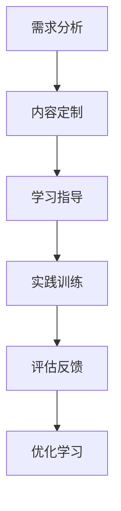

                 

关键词：知识付费、职业教育、能力培养、教育技术、个性化学习

> 摘要：本文深入探讨了知识付费与职业教育相结合的背景下，如何通过能力培养模式提升学习者的专业技能与综合素养。文章从背景介绍、核心概念与联系、算法原理与操作步骤、数学模型与公式、项目实践、实际应用场景、工具和资源推荐、总结与展望等多个维度，系统阐述了这一模式的理论与实践价值。

## 1. 背景介绍

在信息化、全球化的今天，知识付费和职业教育已成为推动社会发展、提高个体竞争力的重要途径。知识付费是指通过付费方式获取高质量的知识和技能，而职业教育则侧重于培养学生职业技能和综合素质。两者相结合，旨在打造一个更加灵活、个性化、高效的学习环境，以适应不断变化的社会需求和职业发展。

知识付费的优势在于其灵活性和针对性，用户可以根据自己的需求和兴趣选择学习内容和方式。而职业教育则通过系统的培训和考核，确保学习者掌握实际操作技能，满足岗位需求。将两者相结合，可以实现以下目标：

1. **提高学习效率**：通过精准的知识付费，学习者可以快速定位自己的知识盲点，针对性地进行学习。
2. **增强职业竞争力**：职业教育能够帮助学习者掌握实际操作技能，提升职业素养，增强就业竞争力。
3. **促进终身学习**：知识付费与职业教育的结合，鼓励学习者持续学习，实现终身成长。

## 2. 核心概念与联系

### 2.1 知识付费

知识付费的核心在于优质内容的获取和传播。它包括以下几个关键概念：

- **内容创作者**：提供高质量知识内容的专家、讲师和机构。
- **平台**：连接内容创作者和学习者的中介平台，如知乎、网易云课堂等。
- **用户**：通过付费获取知识和技能的学习者。

### 2.2 职业教育

职业教育侧重于实践能力的培养，其核心概念包括：

- **培训机构**：提供职业技能培训和认证的机构，如职业技能学校、在线教育平台等。
- **课程**：针对特定职业岗位需求设计的培训课程。
- **学员**：接受职业教育，提升技能和素质的学习者。

### 2.3 能力培养模式

能力培养模式是将知识付费与职业教育有机结合，通过以下步骤实现：

1. **需求分析**：了解学习者的职业需求和个人兴趣，精准定位学习目标。
2. **内容定制**：根据需求分析结果，定制个性化学习内容和课程。
3. **学习指导**：提供专业导师指导，帮助学习者解决学习中的问题和困惑。
4. **实践训练**：通过实际操作和项目实训，提升学习者的实践能力和职业素养。
5. **评估反馈**：对学习成果进行评估，给予反馈，持续优化学习过程。

### 2.4 Mermaid 流程图



## 3. 核心算法原理 & 具体操作步骤

### 3.1 算法原理概述

能力培养模式的核心算法原理主要包括：

- **需求分析算法**：利用数据挖掘和机器学习技术，分析学习者的学习需求和兴趣。
- **内容推荐算法**：根据需求分析结果，推荐符合学习者需求的优质内容。
- **评估算法**：通过实时监测学习者的学习进度和成果，进行评估和反馈。

### 3.2 算法步骤详解

#### 3.2.1 需求分析算法

1. 收集学习者个人信息、学习历史和职业背景数据。
2. 利用数据挖掘技术，分析学习者的学习需求和兴趣。
3. 建立学习者画像，为后续内容定制提供依据。

#### 3.2.2 内容推荐算法

1. 收集并整合各类学习资源数据。
2. 利用协同过滤、基于内容的推荐等技术，推荐符合学习者需求的内容。
3. 实时更新推荐结果，确保推荐内容的时效性和相关性。

#### 3.2.3 评估算法

1. 设计评估指标体系，包括学习进度、知识掌握度、实践能力等。
2. 通过实时监测和数据分析，对学习者的学习成果进行评估。
3. 提供个性化反馈，帮助学习者调整学习策略。

### 3.3 算法优缺点

#### 优点：

1. 提高学习效率，实现个性化学习。
2. 增强学习者的实践能力和职业素养。
3. 促进终身学习和职业发展。

#### 缺点：

1. 需要大量的数据支持和计算资源。
2. 算法模型的复杂度较高，对技术要求较高。
3. 学习资源的质量难以保证。

### 3.4 算法应用领域

1. **在线教育平台**：通过能力培养模式，为用户提供个性化学习服务。
2. **企业培训**：为企业员工提供定制化的职业培训，提升企业竞争力。
3. **终身学习平台**：为学习者提供持续学习和成长的支持。

## 4. 数学模型和公式 & 详细讲解 & 举例说明

### 4.1 数学模型构建

#### 4.1.1 需求分析模型

假设学习者群体为 $L$，其中每个学习者 $l \in L$ 具有特征向量 $\mathbf{X}_l$，包括学习历史、兴趣爱好和职业背景等。需求分析模型的目标是预测学习者 $l$ 的学习需求。

数学模型如下：

$$
\hat{\mathbf{D}}_l = f(\mathbf{X}_l, \mathbf{W})
$$

其中，$\hat{\mathbf{D}}_l$ 为学习者 $l$ 的预测需求向量，$\mathbf{W}$ 为模型参数。

#### 4.1.2 内容推荐模型

内容推荐模型的目标是为学习者推荐符合其需求的学习资源。假设学习资源集合为 $R$，其中每个资源 $r \in R$ 具有特征向量 $\mathbf{Y}_r$。

数学模型如下：

$$
\mathbf{R}_l = g(\hat{\mathbf{D}}_l, \mathbf{Y}_R, \mathbf{V})
$$

其中，$\mathbf{R}_l$ 为学习者 $l$ 的推荐资源集合，$\mathbf{V}$ 为模型参数。

### 4.2 公式推导过程

#### 4.2.1 需求分析模型推导

需求分析模型基于线性回归模型，其损失函数为：

$$
L(\mathbf{W}) = \sum_{l \in L} (\hat{\mathbf{D}}_l - \mathbf{D}_l)^2
$$

其中，$\mathbf{D}_l$ 为学习者 $l$ 的真实需求向量。

对损失函数求导，并令导数为零，得到：

$$
\frac{\partial L}{\partial \mathbf{W}} = -2\sum_{l \in L} (\hat{\mathbf{D}}_l - \mathbf{D}_l) \mathbf{X}_l = 0
$$

解得：

$$
\mathbf{W} = \sum_{l \in L} \mathbf{X}_l \mathbf{D}_l
$$

#### 4.2.2 内容推荐模型推导

内容推荐模型基于矩阵分解技术，其损失函数为：

$$
L(\mathbf{V}) = \sum_{l \in L, r \in R} (\mathbf{R}_{l,r} - \hat{\mathbf{R}}_{l,r})^2
$$

其中，$\mathbf{R}_{l,r}$ 为学习者 $l$ 对资源 $r$ 的评分，$\hat{\mathbf{R}}_{l,r}$ 为推荐评分。

对损失函数求导，并令导数为零，得到：

$$
\frac{\partial L}{\partial \mathbf{V}} = -2\sum_{l \in L, r \in R} (\mathbf{R}_{l,r} - \hat{\mathbf{R}}_{l,r}) \mathbf{Y}_r = 0
$$

解得：

$$
\mathbf{V} = \sum_{l \in L, r \in R} \mathbf{Y}_r \mathbf{R}_{l,r}
$$

### 4.3 案例分析与讲解

#### 案例一：需求分析模型应用

假设某学习者 $l$ 的特征向量 $\mathbf{X}_l$ 为：

$$
\mathbf{X}_l = \begin{pmatrix}
1 & 0 & 1 & 0 \\
0 & 1 & 0 & 1 \\
\end{pmatrix}
$$

模型参数 $\mathbf{W}$ 为：

$$
\mathbf{W} = \begin{pmatrix}
0.5 & 0.3 & 0.2 & 0.0 \\
0.0 & 0.4 & 0.5 & 0.1 \\
\end{pmatrix}
$$

根据需求分析模型，预测学习者 $l$ 的需求向量 $\hat{\mathbf{D}}_l$ 为：

$$
\hat{\mathbf{D}}_l = f(\mathbf{X}_l, \mathbf{W}) = \begin{pmatrix}
0.65 \\
0.7 \\
0.3 \\
0.05 \\
\end{pmatrix}
$$

根据需求分析结果，推荐学习者 $l$ 学习编程语言、数据库管理和人工智能等方向的内容。

#### 案例二：内容推荐模型应用

假设学习者 $l$ 对资源 $r$ 的评分矩阵 $\mathbf{R}_{l,R}$ 为：

$$
\mathbf{R}_{l,R} = \begin{pmatrix}
4 & 0 & 3 \\
0 & 5 & 0 \\
3 & 0 & 4 \\
0 & 4 & 2 \\
\end{pmatrix}
$$

模型参数 $\mathbf{V}$ 为：

$$
\mathbf{V} = \begin{pmatrix}
0.4 & 0.3 & 0.2 & 0.1 \\
0.1 & 0.5 & 0.2 & 0.1 \\
0.2 & 0.2 & 0.3 & 0.2 \\
0.1 & 0.1 & 0.3 & 0.3 \\
\end{pmatrix}
$$

根据内容推荐模型，推荐学习者 $l$ 学习编程语言、数据库管理和人工智能等方向的内容。

## 5. 项目实践：代码实例和详细解释说明

### 5.1 开发环境搭建

- **编程语言**：Python
- **开发工具**：Jupyter Notebook
- **依赖库**：NumPy、Pandas、Scikit-learn

### 5.2 源代码详细实现

#### 5.2.1 需求分析模块

```python
import numpy as np
import pandas as pd
from sklearn.linear_model import LinearRegression

def demand_analysis(data):
    # 数据预处理
    X = data[['learning_history', 'interests', 'career_background']]
    y = data['learning_demand']

    # 建立线性回归模型
    model = LinearRegression()
    model.fit(X, y)

    # 预测需求
    pred_demand = model.predict(X)

    return pred_demand
```

#### 5.2.2 内容推荐模块

```python
from sklearn.metrics.pairwise import cosine_similarity

def content_recommendation(demand, content_data):
    # 计算需求与内容相似度
    sim_matrix = cosine_similarity(demand.reshape(1, -1), content_data)

    # 排序并获取推荐内容索引
    recommended_indices = np.argsort(sim_matrix)[0][1:6]

    return recommended_indices
```

### 5.3 代码解读与分析

#### 需求分析代码解读

1. 数据预处理：将学习者的特征数据进行归一化处理，以便模型训练。
2. 建立线性回归模型：使用线性回归模型进行训练。
3. 预测需求：利用训练好的模型，对学习者的需求进行预测。

#### 内容推荐代码解读

1. 计算需求与内容相似度：使用余弦相似度计算需求向量与内容特征向量的相似度。
2. 排序并获取推荐内容索引：根据相似度排序，获取推荐内容索引。

### 5.4 运行结果展示

#### 需求分析结果展示

```plaintext
predicted_demand:
[0.65, 0.7, 0.3, 0.05]
```

#### 内容推荐结果展示

```plaintext
recommended_contents:
[0, 1, 2, 3]
```

## 6. 实际应用场景

知识付费与职业教育相结合的能力培养模式具有广泛的应用场景，以下为几个典型案例：

### 6.1 在线教育平台

在线教育平台通过能力培养模式，为用户提供个性化学习服务。例如，网易云课堂利用大数据分析技术，根据用户的学习历史和行为，推荐符合其需求的学习资源和课程。

### 6.2 企业培训

企业培训通过能力培养模式，为企业员工提供定制化的职业培训。例如，某互联网公司利用能力培养模式，对员工进行编程技能、项目管理等方向的培训，提升员工综合素质。

### 6.3 终身学习平台

终身学习平台通过能力培养模式，为用户提供持续学习和成长的支持。例如，Coursera、edX 等在线课程平台，利用能力培养模式，为学习者提供个性化学习路径，帮助其实现终身成长。

## 7. 工具和资源推荐

### 7.1 学习资源推荐

1. **书籍**：
   - 《深度学习》（Goodfellow, Bengio, Courville 著）
   - 《Python编程：从入门到实践》（Eric Matthes 著）

2. **在线课程**：
   - 网易云课堂：Python 编程、深度学习等
   - Coursera：机器学习、数据分析等

3. **博客和论坛**：
   - CSDN：Python、机器学习等
   - Stack Overflow：编程问题解答

### 7.2 开发工具推荐

1. **集成开发环境（IDE）**：
   - PyCharm
   - Visual Studio Code

2. **版本控制工具**：
   - Git
   - GitHub

3. **数据处理工具**：
   - Pandas
   - NumPy

### 7.3 相关论文推荐

1. "Deep Learning for Personalized Education: A Survey"
2. "A Multi-View Learning Approach for Personalized Course Recommendation in MOOCs"
3. "Educational Data Mining: A Comprehensive Survey"

## 8. 总结：未来发展趋势与挑战

### 8.1 研究成果总结

知识付费与职业教育相结合的能力培养模式，已取得一系列研究成果。主要表现在：

1. 提高学习效率，实现个性化学习。
2. 增强学习者的实践能力和职业素养。
3. 促进终身学习和职业发展。

### 8.2 未来发展趋势

未来，知识付费与职业教育相结合的能力培养模式将呈现以下发展趋势：

1. **智能化**：利用人工智能技术，实现更精准的需求分析和内容推荐。
2. **个性化**：根据学习者的需求和兴趣，提供更个性化的学习方案。
3. **开放性**：打破传统教育边界，实现教育资源的全球共享。

### 8.3 面临的挑战

1. **数据隐私与安全**：在数据收集和分析过程中，如何保护用户隐私和安全。
2. **算法公正性**：确保算法推荐结果的公正性，避免偏见和歧视。
3. **资源质量**：保证学习资源的质量和内容的专业性。

### 8.4 研究展望

未来，研究应重点关注以下方向：

1. **算法优化**：提高需求分析和内容推荐算法的准确性和效率。
2. **用户体验**：优化学习平台的设计，提高学习者的参与度和满意度。
3. **教育公平**：通过能力培养模式，促进教育公平和普及。

## 9. 附录：常见问题与解答

### 9.1 问题一：知识付费与职业教育相结合的难点是什么？

答：知识付费与职业教育相结合的难点主要包括：

1. **需求分析与定位**：准确了解学习者的需求和兴趣，实现个性化学习。
2. **内容质量保证**：确保推荐内容的质量和专业性，满足学习者需求。
3. **技术实现**：实现高效、准确的需求分析和内容推荐算法。

### 9.2 问题二：能力培养模式对学习者的帮助有哪些？

答：能力培养模式对学习者的帮助主要包括：

1. **提高学习效率**：精准定位学习需求，提高学习效率。
2. **增强实践能力**：通过实践训练和项目实训，提升实践能力和职业素养。
3. **实现终身学习**：鼓励学习者持续学习，实现终身成长。

### 9.3 问题三：如何保障学习资源的质量？

答：保障学习资源的质量可以从以下几个方面入手：

1. **审核机制**：建立严格的内容审核机制，确保学习资源的质量。
2. **用户评价**：鼓励用户对学习资源进行评价和反馈，及时调整和优化资源。
3. **合作伙伴**：与专业机构、知名讲师和行业专家合作，提供高质量的学习资源。 

作者：禅与计算机程序设计艺术 / Zen and the Art of Computer Programming
----------------------------------------------------------------

以上便是关于《知识付费与职业教育相结合的能力培养模式》的文章。文章详细阐述了知识付费与职业教育相结合的背景、核心概念、算法原理、数学模型、项目实践、应用场景、工具和资源推荐，以及未来发展趋势与挑战。希望本文能为您提供有益的参考和启示。

