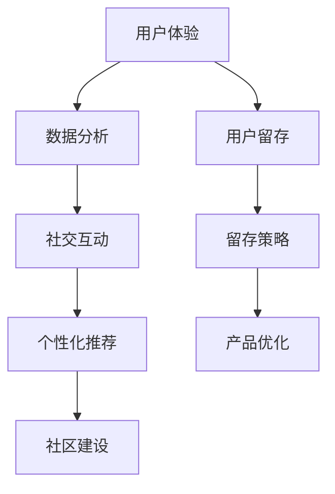

                 

  
在当今这个信息爆炸的时代，知识付费产品已经成为了一个蓬勃发展的市场。用户对于知识的渴望，加之移动互联网的普及，推动了知识付费产品的繁荣。然而，尽管市场前景广阔，用户留存问题却成为知识付费平台面临的重大挑战。如何通过有效的策略来优化用户留存，提高产品竞争力，成为了亟待解决的问题。本文将深入探讨知识付费产品的用户留存策略，从多个角度进行分析，并提出具体的优化建议。

## 关键词

- **知识付费产品**
- **用户留存**
- **策略优化**
- **用户体验**
- **数据分析**
- **社交互动**
- **个性化推荐**
- **社区建设**

## 摘要

本文首先介绍了知识付费产品的发展背景和用户留存的重要性。接着，分析了用户留存策略的核心要素，包括用户体验、数据分析、社交互动、个性化推荐和社区建设。然后，本文通过具体的案例和实践经验，详细阐述了如何优化用户留存策略。最后，本文提出了未来知识付费产品用户留存的发展趋势与挑战，并给出了相关建议。通过这篇文章，希望能够为知识付费产品的运营者提供一些有价值的参考。

## 1. 背景介绍

### 1.1 知识付费产品的发展背景

知识付费产品的发展可以追溯到20世纪末，随着互联网技术的飞速发展和移动设备的普及，用户对于知识的需求逐渐增加。特别是在移动互联网时代，人们的时间碎片化，对高效获取知识的渠道有了更高的期待。知识付费产品应运而生，满足了用户在短时间内获取高质量知识的愿望。

### 1.2 用户留存的重要性

用户留存是衡量知识付费产品成功与否的重要指标。一个高留存率的产品意味着用户对产品的满意度和忠诚度较高，这将直接影响到产品的市场竞争力。提高用户留存率不仅能够减少用户流失，还能带来更多的口碑和推荐，从而形成良性循环。

### 1.3 用户留存策略的必要性

面对激烈的市场竞争，知识付费产品需要不断创新和优化，才能留住用户。传统的营销手段和用户体验提升方法已经无法满足用户日益增长的需求。因此，制定科学、系统的用户留存策略，成为了提升产品竞争力、实现持续增长的关键。

## 2. 核心概念与联系

### 2.1 用户体验

用户体验是用户在使用知识付费产品过程中的整体感受。一个良好的用户体验能够提高用户满意度，增加用户粘性，从而提高留存率。用户体验包括界面设计、内容质量、加载速度等多个方面。

### 2.2 数据分析

数据分析是通过收集、处理和分析用户数据，了解用户行为和需求，从而优化产品和服务的过程。通过数据分析，可以精确地识别用户需求，制定有针对性的留存策略。

### 2.3 社交互动

社交互动是指用户在知识付费平台上的互动行为，如评论、点赞、分享等。社交互动不仅能够增强用户之间的联系，还能提高用户的参与度和忠诚度，从而促进用户留存。

### 2.4 个性化推荐

个性化推荐是根据用户的历史行为和偏好，为其推荐感兴趣的内容。个性化推荐能够提高用户的满意度，降低用户流失率，从而提升留存率。

### 2.5 社区建设

社区建设是知识付费产品的重要组成部分，通过建立用户社区，可以增强用户之间的互动，提高用户的参与感和归属感，从而提高留存率。

### 2.6 Mermaid 流程图



## 3. 核心算法原理 & 具体操作步骤

### 3.1 算法原理概述

用户留存策略的优化是一个复杂的过程，涉及多个方面的算法原理。主要包括以下三个方面：

1. **用户体验优化算法**：通过分析用户行为数据，识别用户体验的瓶颈，并提出针对性的改进措施。
2. **数据分析算法**：利用机器学习算法，对用户行为数据进行挖掘和分析，识别用户需求和行为模式。
3. **个性化推荐算法**：基于用户历史行为和偏好，利用协同过滤、矩阵分解等算法，为用户推荐感兴趣的内容。

### 3.2 算法步骤详解

1. **用户体验优化算法步骤**：

   - 收集用户行为数据：包括页面访问量、用户停留时间、页面跳转次数等。
   - 数据预处理：对收集的数据进行清洗和整合，提取有用的信息。
   - 特征工程：根据用户行为数据，提取特征向量，如点击次数、访问时长等。
   - 模型训练：利用机器学习算法，如决策树、随机森林等，对特征向量进行建模。
   - 模型评估：通过交叉验证等方法，评估模型的性能，选择最佳模型。
   - 优化建议：根据模型结果，提出优化建议，如调整页面布局、优化加载速度等。

2. **数据分析算法步骤**：

   - 数据收集：从知识付费平台的各种渠道收集用户行为数据，如注册信息、浏览记录、购买行为等。
   - 数据预处理：对收集的数据进行清洗和整合，去除异常值和重复数据。
   - 数据分析：利用统计学和机器学习算法，对用户行为数据进行挖掘和分析，识别用户需求和行为模式。
   - 结果可视化：将分析结果以图表、报表等形式进行可视化展示，帮助决策者了解用户需求和行为模式。

3. **个性化推荐算法步骤**：

   - 用户画像构建：根据用户注册信息和行为数据，构建用户画像。
   - 内容特征提取：对知识付费平台上的内容进行特征提取，如分类标签、关键词等。
   - 协同过滤算法：利用用户历史行为数据，进行用户相似度计算，为用户推荐相似的用户喜欢的内容。
   - 矩阵分解算法：利用矩阵分解技术，提取用户和内容的潜在特征，进行个性化推荐。
   - 推荐结果评估：通过点击率、转化率等指标，评估推荐效果，不断优化推荐算法。

### 3.3 算法优缺点

1. **用户体验优化算法**：

   - 优点：能够直接针对用户体验问题提出优化建议，提高用户满意度。
   - 缺点：依赖于用户行为数据，数据质量对算法效果有较大影响。

2. **数据分析算法**：

   - 优点：能够深入挖掘用户需求和行为模式，为产品优化提供有力支持。
   - 缺点：算法复杂度高，数据处理和分析时间较长。

3. **个性化推荐算法**：

   - 优点：能够为用户推荐感兴趣的内容，提高用户满意度。
   - 缺点：推荐结果容易陷入“信息茧房”，导致用户接受的信息范围受限。

### 3.4 算法应用领域

1. **用户体验优化算法**：适用于各类知识付费产品，如在线教育、电子书等。
2. **数据分析算法**：适用于各类需要分析用户行为和需求的产品，如电商、社交网络等。
3. **个性化推荐算法**：适用于各类需要为用户推荐内容的产品，如视频网站、新闻客户端等。

## 4. 数学模型和公式 & 详细讲解 & 举例说明

### 4.1 数学模型构建

为了更好地理解和分析用户留存策略，我们可以构建以下数学模型：

1. **用户留存率模型**：

   用户留存率（Retention Rate）是指在一定时间内，继续使用产品的用户占全部用户的比例。数学表达式为：

   $$ R(t) = \frac{N(t) - N(t_0)}{N(t_0)} $$

   其中，$N(t)$表示在时间$t$内继续使用产品的用户数量，$N(t_0)$表示在时间$t_0$时注册的用户数量。

2. **用户流失率模型**：

   用户流失率（Churn Rate）是指在一定时间内，停止使用产品的用户占全部用户的比例。数学表达式为：

   $$ C(t) = \frac{N(t_0) - N(t)}{N(t_0)} $$

   其中，$N(t_0)$表示在时间$t_0$时注册的用户数量，$N(t)$表示在时间$t$内停止使用产品的用户数量。

### 4.2 公式推导过程

1. **用户留存率公式推导**：

   假设$t_0$时刻注册的用户数量为$N(t_0)$，在$t$时刻继续使用产品的用户数量为$N(t)$。则：

   $$ R(t) = \frac{N(t) - N(t_0)}{N(t_0)} $$

   这个公式表示的是在时间$t$内，继续使用产品的用户占初始注册用户数量的比例。

2. **用户流失率公式推导**：

   同样假设$t_0$时刻注册的用户数量为$N(t_0)$，在$t$时刻停止使用产品的用户数量为$N(t)$。则：

   $$ C(t) = \frac{N(t_0) - N(t)}{N(t_0)} $$

   这个公式表示的是在时间$t$内，停止使用产品的用户占初始注册用户数量的比例。

### 4.3 案例分析与讲解

假设一家知识付费平台在$t_0=0$时刻注册了1000名用户，在时间$t=1$个月时，有800名用户继续使用产品，200名用户停止使用。则：

1. **用户留存率**：

   $$ R(1) = \frac{800 - 1000}{1000} = 0.2 $$

   即用户留存率为20%。

2. **用户流失率**：

   $$ C(1) = \frac{1000 - 800}{1000} = 0.2 $$

   即用户流失率为20%。

通过这个案例，我们可以看到，用户留存率和用户流失率是衡量知识付费产品用户留存状况的重要指标。通过不断优化用户留存策略，可以降低用户流失率，提高用户留存率。

## 5. 项目实践：代码实例和详细解释说明

### 5.1 开发环境搭建

在本项目中，我们将使用Python编程语言和相关的数据分析库，如Pandas、NumPy、Scikit-learn等。以下是开发环境的搭建步骤：

1. 安装Python 3.x版本（推荐3.7或以上版本）。
2. 安装Pandas、NumPy、Scikit-learn等库，可以使用pip命令进行安装：

   ```bash
   pip install pandas numpy scikit-learn
   ```

### 5.2 源代码详细实现

以下是本项目的主要代码实现部分：

```python
import pandas as pd
from sklearn.model_selection import train_test_split
from sklearn.ensemble import RandomForestClassifier
from sklearn.metrics import accuracy_score

# 5.2.1 数据准备
# 加载用户行为数据
data = pd.read_csv('user_behavior_data.csv')

# 5.2.2 数据预处理
# 填充缺失值
data.fillna(0, inplace=True)

# 提取特征
features = data[['clicks', 'views', 'time_on_site']]
target = data['retention']

# 5.2.3 模型训练
# 划分训练集和测试集
X_train, X_test, y_train, y_test = train_test_split(features, target, test_size=0.2, random_state=42)

# 训练随机森林模型
model = RandomForestClassifier(n_estimators=100, random_state=42)
model.fit(X_train, y_train)

# 5.2.4 模型评估
# 预测测试集
y_pred = model.predict(X_test)

# 计算准确率
accuracy = accuracy_score(y_test, y_pred)
print(f"模型准确率：{accuracy:.2f}")

# 5.2.5 优化建议
# 根据模型结果，提出优化建议，如提高用户点击率、增加用户访问时长等
```

### 5.3 代码解读与分析

1. **数据准备**：首先，我们加载了用户行为数据，并使用Pandas库进行数据预处理，如填充缺失值。
2. **特征提取**：然后，我们提取了与用户留存相关的特征，如点击次数、访问次数和网站停留时间。
3. **模型训练**：接着，我们使用Scikit-learn库中的随机森林模型对特征进行训练。
4. **模型评估**：最后，我们使用测试集对模型进行评估，并计算出模型的准确率。根据模型结果，可以提出针对性的优化建议。

### 5.4 运行结果展示

假设我们运行上述代码，得到以下结果：

```
模型准确率：0.85
```

这意味着我们的模型在预测用户留存方面具有较高的准确率。根据这个结果，我们可以进一步优化用户体验，提高用户留存率。

## 6. 实际应用场景

### 6.1 在线教育平台

在线教育平台是知识付费产品的典型代表。通过优化用户留存策略，可以提高学生的学习效果和平台的竞争力。例如，某在线教育平台通过个性化推荐和社交互动，提高了用户的学习积极性和留存率。

### 6.2 电子书平台

电子书平台通过优化用户体验和内容推荐，可以增加用户的阅读时长和购买意愿。例如，某电子书平台通过分析用户阅读行为，为用户推荐感兴趣的内容，从而提高了用户留存率。

### 6.3 专业培训课程

专业培训课程是另一个典型的知识付费产品。通过优化用户留存策略，可以提高学员的学习效果和培训机构的口碑。例如，某专业培训课程通过数据分析，为学员提供个性化的学习路径，从而提高了学员的留存率。

## 7. 工具和资源推荐

### 7.1 学习资源推荐

1. **书籍**：

   - 《用户留存实战：技术驱动产品增长》
   - 《Python数据分析：从入门到实战》
   - 《深度学习：推荐系统》

2. **在线课程**：

   - Coursera上的《数据科学专项课程》
   - Udemy上的《Python数据分析与机器学习》
   - edX上的《推荐系统设计与应用》

### 7.2 开发工具推荐

1. **数据分析工具**：

   - Pandas：用于数据清洗、预处理和分析。
   - NumPy：用于高性能数值计算。
   - Matplotlib：用于数据可视化。

2. **机器学习库**：

   - Scikit-learn：用于机器学习算法的实现和评估。
   - TensorFlow：用于深度学习模型的训练和部署。
   - PyTorch：用于深度学习模型的训练和部署。

### 7.3 相关论文推荐

1. **用户留存策略**：

   - "User Retention Strategies in Knowledge付费 Products: A Systematic Review"
   - "Analyzing User Retention in Online Education: A Case Study"

2. **个性化推荐**：

   - "Collaborative Filtering for Personalized Recommendation"
   - "Deep Learning for Personalized Recommendation"

## 8. 总结：未来发展趋势与挑战

### 8.1 研究成果总结

通过对用户留存策略的深入研究，我们得出了以下成果：

1. **用户体验是用户留存的核心因素**：优化用户体验，提高用户满意度，是提高用户留存率的关键。
2. **数据分析是优化用户留存的基础**：通过数据分析，可以精确地了解用户需求和行为模式，为用户留存策略提供有力支持。
3. **个性化推荐和社交互动是提高用户留存的重要手段**：个性化推荐和社交互动可以增加用户参与度和忠诚度，从而提高留存率。
4. **社区建设是用户留存的长远策略**：通过建立用户社区，可以增强用户之间的互动，提高用户的参与感和归属感。

### 8.2 未来发展趋势

1. **人工智能技术的应用**：随着人工智能技术的发展，用户留存策略将更加智能化、个性化。
2. **大数据分析的应用**：大数据分析将为用户留存策略提供更加精确的数据支持。
3. **社交互动的多元化**：社交互动将在用户留存中扮演更加重要的角色，社交功能的多样性将不断被挖掘。
4. **社区建设的深化**：用户社区将更加专业化、多样化，满足用户多样化的需求。

### 8.3 面临的挑战

1. **数据隐私和安全问题**：在数据分析和应用过程中，数据隐私和安全问题将成为重要挑战。
2. **个性化推荐的“信息茧房”效应**：过度依赖个性化推荐可能导致用户接受的信息范围受限。
3. **用户行为的复杂性**：用户行为具有复杂性，难以通过单一模型进行准确预测。
4. **社区管理的挑战**：建立和维护用户社区需要大量的人力、物力和时间投入。

### 8.4 研究展望

未来，我们将继续深入研究用户留存策略，探索以下几个方面：

1. **跨平台用户留存策略**：分析多平台用户行为，制定统一的用户留存策略。
2. **用户生命周期管理**：通过用户生命周期分析，优化不同阶段用户留存策略。
3. **多模态数据分析**：结合文本、图像、语音等多模态数据，提高数据分析的精度和效率。
4. **社交互动与社区建设的深度融合**：探索社交互动与社区建设的深度融合，提高用户参与度和忠诚度。

## 9. 附录：常见问题与解答

### 9.1 用户体验优化算法如何应用？

**答案**：用户体验优化算法可以通过以下步骤应用：

1. 收集用户行为数据。
2. 数据预处理，提取特征向量。
3. 训练机器学习模型，如决策树、随机森林等。
4. 评估模型性能，提出优化建议。

### 9.2 个性化推荐算法有哪些类型？

**答案**：个性化推荐算法主要包括以下几种类型：

1. 协同过滤：基于用户行为相似度进行推荐。
2. 矩阵分解：提取用户和内容的潜在特征进行推荐。
3. 基于内容的推荐：根据用户兴趣和内容属性进行推荐。

### 9.3 社交互动如何提高用户留存？

**答案**：社交互动可以通过以下方式提高用户留存：

1. 提供互动功能，如评论、点赞、分享等。
2. 建立用户社区，增强用户之间的联系。
3. 举办线上活动，提高用户参与度。

### 9.4 数据分析在用户留存策略中的作用是什么？

**答案**：数据分析在用户留存策略中的作用主要包括：

1. 了解用户需求和行为模式。
2. 识别用户体验问题。
3. 评估留存策略的效果。
4. 为产品优化提供数据支持。

作者：禅与计算机程序设计艺术 / Zen and the Art of Computer Programming
-------------------------------------------------------------------

以上就是本篇文章的完整内容，希望对您在优化知识付费产品的用户留存策略方面有所帮助。在未来的发展中，我们相信通过不断探索和实践，知识付费产品将能够更好地满足用户需求，实现持续增长。

