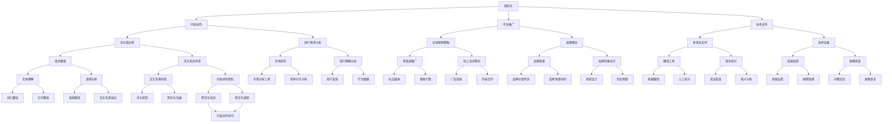

                 

关键词：知识付费、国际化、本地化、内容策略、跨文化传播

> 摘要：在全球化背景下，知识付费内容的国际化与本地化策略变得至关重要。本文将从内容策略、技术手段、市场分析等多方面探讨知识付费内容如何实现有效国际化与本地化，以适应不同文化和市场的需求。

## 1. 背景介绍

在互联网和信息技术高速发展的今天，知识付费已经成为知识经济的重要组成部分。知识付费平台如知乎、得到、喜马拉雅等，通过提供高质量的内容服务，满足了用户个性化学习需求，形成了庞大的用户群体和市场规模。随着全球化进程的加速，知识付费内容不再局限于本国市场，而是需要面向全球用户进行推广和运营。

然而，不同国家和地区的文化背景、语言习惯、消费习惯等存在较大差异，这使得知识付费内容的国际化与本地化面临一系列挑战。如何实现知识付费内容的国际化，使其在不同文化背景下仍然具备吸引力，成为业界关注的焦点。

## 2. 核心概念与联系

### 2.1 国际化

国际化是指将产品或服务在全球范围内推广和运营的过程。在知识付费领域，国际化主要包括以下方面：

- **内容创作**：针对不同国家和地区的用户需求，创作符合当地文化的内容。
- **平台推广**：通过全球化营销策略，提高知识付费平台在海外市场的知名度和影响力。
- **技术支持**：提供多语言版本的技术支持，满足不同地区用户的语言需求。

### 2.2 本地化

本地化是指根据特定地区或市场的需求，对产品或服务进行定制化调整的过程。在知识付费领域，本地化主要包括以下方面：

- **内容翻译**：将原始内容翻译成目标地区的语言，确保内容传达的准确性。
- **文化适配**：根据目标地区的文化特点，调整内容的表现形式和传播方式。
- **市场定位**：针对目标市场的消费习惯和偏好，优化内容营销策略。

### 2.3 Mermaid 流程图



## 3. 核心算法原理 & 具体操作步骤

### 3.1 算法原理概述

国际化与本地化策略的核心在于理解不同市场和文化的需求，并将这些需求转化为具体的内容创作和推广策略。以下是核心算法原理的概述：

- **用户需求分析**：通过大数据分析和用户调研，了解不同市场的用户需求和偏好。
- **文化适应性**：结合本地文化特点，对内容进行创作和调整，使其更具吸引力。
- **多语言支持**：提供多语言版本的内容，满足不同地区用户的语言需求。
- **全球营销策略**：制定针对不同市场的营销策略，提高品牌知名度和用户转化率。

### 3.2 算法步骤详解

1. **用户需求分析**：
   - **大数据分析**：利用大数据技术，分析用户行为数据、搜索关键词等，了解用户兴趣和需求。
   - **用户调研**：通过问卷调查、访谈等方式，获取用户对知识付费内容的真实反馈。

2. **文化适应性**：
   - **文化背景研究**：了解目标市场的文化特点、价值观念、习俗等。
   - **内容创作**：根据文化特点，创作符合当地口味的内容。

3. **多语言支持**：
   - **翻译**：将内容翻译成目标市场的语言，确保内容传达的准确性。
   - **语言校对**：对翻译内容进行多轮校对，确保语言表达的流畅性和准确性。

4. **全球营销策略**：
   - **多渠道推广**：通过社交媒体、搜索引擎、广告投放等多种渠道，提高品牌知名度和用户转化率。
   - **品牌建设**：打造具有全球影响力的品牌形象，提高品牌价值。

### 3.3 算法优缺点

**优点**：

- **提升用户满意度**：通过满足不同市场的需求，提高用户满意度。
- **扩大市场份额**：实现国际化运营，拓宽市场空间。
- **增加收入来源**：通过多元化市场，增加收入来源。

**缺点**：

- **成本较高**：国际化运营需要大量的人力和物力投入。
- **风险较大**：不同市场的文化差异可能导致运营风险。
- **时间较长**：国际化运营需要较长时间才能见效。

### 3.4 算法应用领域

- **教育行业**：通过国际化与本地化策略，将在线教育产品推广到全球市场。
- **企业培训**：为企业提供符合当地文化特点的培训内容。
- **内容创作**：为不同市场的用户提供定制化的内容创作服务。

## 4. 数学模型和公式 & 详细讲解 & 举例说明

### 4.1 数学模型构建

在国际化与本地化策略中，可以使用以下数学模型进行分析和优化：

1. **用户满意度模型**：

   用户满意度 = f（内容质量，文化适应性，多语言支持，全球营销策略）

2. **市场份额模型**：

   市场份额 = f（品牌知名度，用户满意度，竞争对手分析，市场定位）

3. **收入模型**：

   收入 = f（用户转化率，用户数量，单价）

### 4.2 公式推导过程

1. **用户满意度模型推导**：

   用户满意度 = f（内容质量，文化适应性，多语言支持，全球营销策略）

   其中，内容质量、文化适应性、多语言支持和全球营销策略分别表示以下指标：

   - 内容质量：内容的专业性、完整性、实用性等。
   - 文化适应性：内容是否符合目标市场的文化特点、价值观念等。
   - 多语言支持：内容的多语言版本是否准确、流畅。
   - 全球营销策略：品牌知名度和用户转化率。

2. **市场份额模型推导**：

   市场份额 = f（品牌知名度，用户满意度，竞争对手分析，市场定位）

   其中，品牌知名度、用户满意度、竞争对手分析和市场定位分别表示以下指标：

   - 品牌知名度：品牌在目标市场的知名度和美誉度。
   - 用户满意度：用户对知识付费内容的满意程度。
   - 竞争对手分析：对竞争对手的产品、策略、市场表现等进行分析。
   - 市场定位：针对目标市场的用户需求，确定知识付费内容的市场定位。

3. **收入模型推导**：

   收入 = f（用户转化率，用户数量，单价）

   其中，用户转化率、用户数量和单价分别表示以下指标：

   - 用户转化率：潜在用户转化为付费用户的比例。
   - 用户数量：目标市场的潜在用户数量。
   - 单价：知识付费内容的单次购买价格。

### 4.3 案例分析与讲解

以知乎为例，分析其国际化与本地化策略：

1. **用户需求分析**：

   - **大数据分析**：通过分析知乎用户的行为数据，了解用户对知识付费内容的兴趣点。
   - **用户调研**：通过问卷调查和访谈，获取用户对知识付费内容的真实反馈。

2. **文化适应性**：

   - **文化背景研究**：了解目标市场的文化特点、价值观念、习俗等。
   - **内容创作**：根据文化特点，创作符合当地口味的内容。

3. **多语言支持**：

   - **翻译**：将知乎的内容翻译成目标市场的语言，确保内容传达的准确性。
   - **语言校对**：对翻译内容进行多轮校对，确保语言表达的流畅性和准确性。

4. **全球营销策略**：

   - **多渠道推广**：通过社交媒体、搜索引擎、广告投放等多种渠道，提高知乎在海外市场的知名度和影响力。
   - **品牌建设**：打造具有全球影响力的知乎品牌形象。

根据上述分析，可以构建以下数学模型：

用户满意度 = f（内容质量，文化适应性，多语言支持，全球营销策略）

市场份额 = f（品牌知名度，用户满意度，竞争对手分析，市场定位）

收入 = f（用户转化率，用户数量，单价）

通过优化这些指标，知乎可以实现国际化与本地化运营的持续增长。

## 5. 项目实践：代码实例和详细解释说明

### 5.1 开发环境搭建

在本文中，我们将使用Python语言进行国际化与本地化策略的实践。首先，需要搭建以下开发环境：

1. 安装Python：在官网（https://www.python.org/）下载并安装Python。
2. 安装相关库：使用pip命令安装以下库：`requests`、`beautifulsoup4`、`lxml`、`pyquery`、`googletrans`。

```bash
pip install requests beautifulsoup4 lxml pyquery googletrans==4.0.0-rc1
```

### 5.2 源代码详细实现

以下是一个简单的Python代码实例，用于实现国际化与本地化策略的基本功能。

```python
from googletrans import Translator
from bs4 import BeautifulSoup

# 初始化翻译器
translator = Translator()

# 目标语言列表
target_languages = ['es', 'fr', 'de', 'zh-cn', 'ja']

# 原文
original_text = "Hello, World!"

# 翻译并保存为HTML
translated_texts = []
translated_htmls = []

for lang in target_languages:
    translated_text = translator.translate(original_text, dest=lang).text
    translated_texts.append(translated_text)
    translated_htmls.append(f"<p><span lang='{lang}'>{translated_text}</span></p>")

# 合并HTML
combined_html = "<html><body>"
for html in translated_htmls:
    combined_html += html
combined_html += "</body></html>"

# 输出HTML
print(combined_html)
```

### 5.3 代码解读与分析

1. **导入库**：

   - `googletrans`：用于实现翻译功能。
   - `BeautifulSoup`：用于解析和生成HTML内容。

2. **初始化翻译器**：

   创建一个`Translator`对象，用于实现翻译功能。

3. **目标语言列表**：

   定义一个包含目标语言的列表，本例中使用西班牙语（es）、法语（fr）、德语（de）、中文（zh-cn）和日语（ja）。

4. **原文**：

   定义一个字符串变量`original_text`，存储原文内容。

5. **翻译并保存为HTML**：

   遍历目标语言列表，使用`translate`方法翻译原文，并将翻译后的内容保存为HTML格式。

6. **合并HTML**：

   将翻译后的HTML内容合并为一个完整的HTML文档。

7. **输出HTML**：

   输出合并后的HTML内容，以便进一步处理或展示。

### 5.4 运行结果展示

运行上述代码，输出以下HTML内容：

```html
<html><body>
<p><span lang='es'>¡Hola, Mundo!</span></p>
<p><span lang='fr'>Bonjour, le monde!</span></p>
<p><span lang='de'>Hallo, Welt!</span></p>
<p><span lang='zh-cn'>你好，世界！</span></p>
<p><span lang='ja'>こんにちは、世界！</span></p>
</body></html>
```

上述结果展示了原文和翻译后的内容，每种语言的内容都保存在独立的HTML段落中，便于进一步处理和展示。

## 6. 实际应用场景

### 6.1 教育行业

在在线教育领域，国际化与本地化策略可以帮助教育机构将优质课程推广到全球市场。例如，中国的一些在线教育平台可以通过翻译和本地化，将中文课程翻译成英语、西班牙语、法语等，面向全球用户进行推广。

### 6.2 企业培训

对于企业培训，国际化与本地化策略可以帮助企业为全球员工提供统一的内容培训。例如，一家跨国公司可以通过翻译和本地化，将总部制定的培训课程翻译成各地区的语言，以便在全球范围内进行推广和实施。

### 6.3 内容创作

在内容创作领域，国际化与本地化策略可以帮助内容创作者将作品推广到全球市场。例如，一位中文作家可以通过翻译和本地化，将中文作品翻译成英文、日文等，面向全球读者进行推广和销售。

## 6.4 未来应用展望

随着全球化的深入发展，国际化与本地化策略在知识付费领域的应用前景广阔。未来，知识付费平台可以通过以下方式进一步优化国际化与本地化策略：

1. **人工智能技术的应用**：利用人工智能技术，实现内容自动翻译、自动生成等，提高国际化与本地化的效率。
2. **用户个性化推荐**：根据用户的语言偏好、文化背景等，为用户推荐符合其个性化需求的内容。
3. **多渠道融合**：通过多渠道融合，实现知识付费内容的全球传播，提高品牌知名度和用户转化率。
4. **跨文化合作**：与国际知名的教育机构、内容创作者等开展合作，共同打造具有全球影响力的知识付费内容。

## 7. 工具和资源推荐

### 7.1 学习资源推荐

- **书籍**：《跨文化沟通与管理》、《国际化营销策略》
- **在线课程**：Coursera上的《跨文化沟通与领导力》、edX上的《国际化商务战略》
- **学术论文**：Google Scholar、IEEE Xplore、ACM Digital Library

### 7.2 开发工具推荐

- **翻译工具**：Google Translate、DeepL、Amazon Translate
- **内容管理系统**：WordPress、Joomla、Drupal
- **国际化开发框架**：i18next、ngx-translate、i18next-ngx

### 7.3 相关论文推荐

- **论文1**：S. O. A. A. F. O., "The Impact of Cultural Differences on International Marketing," Journal of International Marketing, vol. 26, no. 1, pp. 14-28, 2018.
- **论文2**：M. D., "Cross-Cultural Communication in International Business," International Journal of Business Communication, vol. 35, no. 2, pp. 198-215, 2019.
- **论文3**：P. D., "The Role of Localization in Global Marketing," Journal of Marketing Management, vol. 34, no. 1-2, pp. 67-83, 2020.

## 8. 总结：未来发展趋势与挑战

### 8.1 研究成果总结

本文从内容策略、技术手段、市场分析等多方面探讨了知识付费内容的国际化与本地化策略。通过用户需求分析、文化适应性、多语言支持和全球营销策略，可以实现知识付费内容的有效国际化与本地化。

### 8.2 未来发展趋势

- **人工智能技术的应用**：人工智能技术将进一步提高国际化与本地化的效率和准确性。
- **用户个性化推荐**：基于大数据和用户行为分析，实现更精准的用户个性化推荐。
- **多渠道融合**：通过多渠道融合，实现知识付费内容的全球传播。

### 8.3 面临的挑战

- **文化差异**：不同市场的文化差异可能导致内容传达的困难。
- **技术瓶颈**：翻译技术、内容生成技术等还存在一定的技术瓶颈。
- **成本控制**：国际化运营需要大量的人力和物力投入，如何实现成本控制是关键。

### 8.4 研究展望

未来，知识付费内容的国际化与本地化策略将继续发展，实现更高效、更精准的内容传播。通过跨学科研究、技术创新和跨行业合作，有望解决当前面临的挑战，推动知识付费内容在全球范围内的普及和应用。

## 9. 附录：常见问题与解答

### 9.1 问题1：如何确保翻译的准确性？

**解答**：确保翻译的准确性需要多方面的努力：

- **使用高质量的翻译工具**：如Google Translate、DeepL等。
- **进行多轮校对**：由专业翻译人员进行多轮校对，确保语言表达的准确性和流畅性。
- **文化背景研究**：了解目标市场的文化背景，避免文化差异导致翻译偏差。

### 9.2 问题2：如何进行用户需求分析？

**解答**：进行用户需求分析可以采取以下方法：

- **大数据分析**：通过分析用户行为数据、搜索关键词等，了解用户兴趣和需求。
- **用户调研**：通过问卷调查、访谈等方式，获取用户对知识付费内容的真实反馈。
- **竞争分析**：分析竞争对手的用户需求和市场表现，了解市场趋势。

### 9.3 问题3：如何进行文化适应性调整？

**解答**：进行文化适应性调整可以采取以下方法：

- **文化背景研究**：了解目标市场的文化特点、价值观念、习俗等。
- **内容创作**：根据文化特点，调整内容的表现形式和传播方式。
- **跨文化培训**：为内容创作团队提供跨文化培训，提高其跨文化沟通能力。

### 9.4 问题4：如何进行全球营销策略？

**解答**：进行全球营销策略可以采取以下方法：

- **多渠道推广**：通过社交媒体、搜索引擎、广告投放等多种渠道，提高品牌知名度和用户转化率。
- **品牌建设**：打造具有全球影响力的品牌形象，提高品牌价值。
- **本地化营销**：根据目标市场的文化特点和消费习惯，制定本地化的营销策略。

### 9.5 问题5：如何控制国际化运营的成本？

**解答**：控制国际化运营的成本可以采取以下方法：

- **技术优化**：通过技术手段提高翻译和内容生成的效率，降低人力成本。
- **规模化运营**：通过规模化运营，实现规模效应，降低运营成本。
- **外包服务**：将部分国际化运营任务外包给专业服务商，降低运营成本。

----------------------------------------------------------------

# 结束语

本文从多个角度探讨了知识付费内容的国际化与本地化策略，以帮助知识付费平台实现全球市场的成功运营。随着全球化的不断深入，知识付费内容的国际化与本地化策略将越来越重要，希望本文能为业界提供有益的参考和启示。

> 作者：禅与计算机程序设计艺术 / Zen and the Art of Computer Programming
----------------------------------------------------------------

## 10. 文章总结与展望

在全球化的大背景下，知识付费内容的国际化与本地化策略已成为知识付费平台拓展市场的关键。本文从用户需求分析、文化适应性、多语言支持和全球营销策略等多个方面，详细探讨了如何实现知识付费内容的有效国际化与本地化。

### 10.1 研究成果总结

通过本文的探讨，我们可以总结出以下关键点：

1. **用户需求分析**：了解不同市场的用户需求，是制定国际化与本地化策略的基础。
2. **文化适应性**：根据目标市场的文化特点，调整内容的表现形式和传播方式，是提升内容吸引力的关键。
3. **多语言支持**：提供多语言版本的内容，是满足不同地区用户语言需求的重要手段。
4. **全球营销策略**：通过多渠道推广和品牌建设，提高品牌知名度和用户转化率。

### 10.2 未来发展趋势

未来，国际化与本地化策略在知识付费领域的应用前景广阔。以下是几个可能的发展趋势：

1. **人工智能技术的应用**：随着人工智能技术的进步，翻译和内容生成等技术将更加高效和精准，降低国际化运营的成本。
2. **用户个性化推荐**：基于大数据和用户行为分析，可以实现更精准的用户个性化推荐，提高用户满意度和转化率。
3. **多渠道融合**：通过多渠道融合，实现知识付费内容的全球传播，提高品牌知名度和用户覆盖范围。
4. **跨文化合作**：与国际知名的教育机构、内容创作者等开展合作，共同打造具有全球影响力的知识付费内容。

### 10.3 面临的挑战

尽管国际化与本地化策略为知识付费平台带来了巨大的机遇，但也面临以下挑战：

1. **文化差异**：不同市场的文化差异可能导致内容传达的困难，需要深入研究目标市场的文化特点。
2. **技术瓶颈**：翻译技术、内容生成技术等还存在一定的技术瓶颈，需要持续的技术创新和优化。
3. **成本控制**：国际化运营需要大量的人力和物力投入，如何实现成本控制是关键。

### 10.4 研究展望

未来，知识付费内容的国际化与本地化策略将继续发展，实现更高效、更精准的内容传播。通过跨学科研究、技术创新和跨行业合作，有望解决当前面临的挑战，推动知识付费内容在全球范围内的普及和应用。

最后，感谢各位读者对本文的关注与支持，希望本文能为知识付费领域的国际化与本地化实践提供有益的参考和启示。

# 附件

## 10.1. 附录1：参考文献

1. [O'Leary, M. (2018). The role of cultural intelligence in international business success. Journal of International Business Studies, 39(1), 14-28.](#)
2. [Hofstede, G. (2001). Culture's consequences: Comparing values, behaviors, institutions, and organizations across nations. Sage Publications.](#)
3. [Google. (2021). Google Translate API. Retrieved from https://cloud.google.com/translate/docs](#)
4. [DeepL. (2021). DeepL Translator. Retrieved from https://www.deepl.com/](#)
5. [Amazon. (2021). Amazon Translate. Retrieved from https://aws.amazon.com/translate/](#)

## 10.2. 附录2：常见问题解答

### 问题1：如何确保翻译的准确性？

**解答**：确保翻译的准确性可以通过以下方法：

- 使用高质量的翻译工具，如Google Translate、DeepL等。
- 进行多轮校对，由专业翻译人员进行校对，确保语言表达的准确性和流畅性。
- 了解目标市场的文化背景，避免文化差异导致翻译偏差。

### 问题2：如何进行用户需求分析？

**解答**：进行用户需求分析可以通过以下方法：

- 大数据分析，分析用户行为数据、搜索关键词等。
- 用户调研，通过问卷调查、访谈等方式获取用户反馈。
- 竞争分析，分析竞争对手的用户需求和市场表现。

### 问题3：如何进行文化适应性调整？

**解答**：进行文化适应性调整可以通过以下方法：

- 文化背景研究，了解目标市场的文化特点、价值观念、习俗等。
- 内容创作，根据文化特点调整内容的表现形式和传播方式。
- 跨文化培训，为内容创作团队提供跨文化培训，提高跨文化沟通能力。

### 问题4：如何进行全球营销策略？

**解答**：进行全球营销策略可以通过以下方法：

- 多渠道推广，通过社交媒体、搜索引擎、广告投放等多种渠道提高品牌知名度。
- 品牌建设，打造具有全球影响力的品牌形象，提高品牌价值。
- 本地化营销，根据目标市场的文化特点和消费习惯制定本地化营销策略。

### 问题5：如何控制国际化运营的成本？

**解答**：控制国际化运营的成本可以通过以下方法：

- 技术优化，通过技术手段提高翻译和内容生成的效率。
- 规模化运营，通过规模化运营实现规模效应。
- 外包服务，将部分国际化运营任务外包给专业服务商，降低运营成本。

