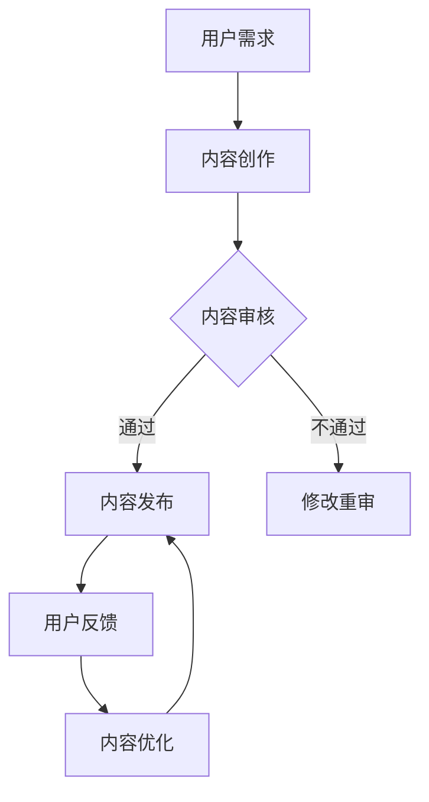

                 

关键词：知识付费，内容质量，用户信任，信任建立，质量控制，用户体验，反馈机制，市场策略

> 摘要：随着知识经济的兴起，知识付费成为了互联网产业的重要组成部分。本文探讨了知识付费内容的质量保证和用户信任建立的重要性，分析了影响知识付费内容质量的多个因素，并提出了提升内容质量和用户信任的若干策略。通过实际案例分析，文章展示了如何通过技术手段和管理措施来保障知识付费内容的质量，从而增强用户对知识付费平台的信任。

## 1. 背景介绍

知识付费，作为信息时代的一种新兴商业模式，近年来在全球范围内迅速崛起。用户愿意为优质的内容和知识付费，这表明了信息价值在现代社会中的日益凸显。然而，随着知识付费市场的迅速扩张，内容质量参差不齐的问题也随之而来。用户在知识付费平台上面临着信息过载和内容良莠不齐的困境，这直接影响了用户对平台的信任度。

### 1.1 知识付费的发展现状

知识付费平台如雨后春笋般涌现，涵盖了教育、咨询、技能培训等多个领域。这些平台通过提供有价值的知识内容，满足了用户对自我提升和职业发展的需求。据数据显示，全球知识付费市场规模逐年扩大，预计在未来几年内仍将保持高速增长。

### 1.2 内容质量与用户信任的关系

高质量的知识付费内容能够吸引用户持续关注，提高用户满意度，进而增强用户对平台的信任。相反，内容质量低劣或者与用户期望不符，会导致用户流失，损害平台的声誉。因此，内容质量和用户信任之间存在着紧密的关联。

## 2. 核心概念与联系

为了深入理解知识付费内容的质量保证和用户信任建立，我们需要明确以下几个核心概念：

### 2.1 质量保证

质量保证是指通过一系列管理措施和技术手段，确保知识付费内容的质量符合既定的标准和用户需求。质量保证涵盖内容创作、审核、发布等多个环节。

### 2.2 用户信任

用户信任是指用户对知识付费平台和内容提供商的信任程度。信任是建立在平台和内容提供商的信誉、可靠性和服务质量上的。

### 2.3 质量控制

质量控制是质量保证的一个子集，主要关注内容发布后的监控和反馈机制，以确保内容持续符合标准。

### 2.4 用户满意度

用户满意度是衡量知识付费内容质量的一个重要指标，它反映了用户对内容的接受度和满意度。

### 2.5 用户体验

用户体验是指用户在使用知识付费平台时得到的整体感受，包括内容质量、平台性能、用户界面等多个方面。

### 2.6 Mermaid 流程图

以下是一个简化的知识付费内容质量保证与用户信任建立的流程图：



在这个流程图中，用户需求是驱动内容创作和审核的源头，内容审核是保证内容质量的关键环节，用户反馈和内容优化是确保内容持续符合用户需求的重要手段。

## 3. 核心算法原理 & 具体操作步骤

### 3.1 算法原理概述

知识付费内容的质量保证和用户信任建立的核心算法主要基于以下几个原理：

1. **内容评价机制**：通过用户评分、点赞、评论等行为数据，构建内容质量评价模型。
2. **推荐算法**：利用机器学习算法，根据用户的历史行为和偏好推荐高质量内容。
3. **实时监控与反馈机制**：通过实时监控系统，监控内容质量和用户行为，快速响应用户反馈。
4. **持续优化**：基于用户反馈和数据分析，持续优化内容质量和用户体验。

### 3.2 算法步骤详解

#### 3.2.1 内容评价机制

1. **数据收集**：收集用户对知识付费内容的评分、点赞、评论等行为数据。
2. **特征提取**：将用户行为数据转换为数值特征，如评分平均值、评论数量、正面/负面评论比例等。
3. **模型训练**：使用机器学习算法，如决策树、随机森林、支持向量机等，训练内容质量评价模型。
4. **模型评估**：通过交叉验证等方法评估模型性能，调整模型参数。

#### 3.2.2 推荐算法

1. **用户特征提取**：提取用户的基本信息、行为记录、兴趣偏好等特征。
2. **内容特征提取**：提取知识付费内容的相关特征，如主题、难度、类型等。
3. **模型训练**：使用协同过滤、基于内容的推荐、混合推荐等算法，训练推荐模型。
4. **模型评估**：评估推荐模型的准确率、覆盖率等指标，优化推荐策略。

#### 3.2.3 实时监控与反馈机制

1. **数据收集**：收集系统日志、用户行为数据、内容质量指标等。
2. **实时分析**：使用实时数据分析技术，如流处理、图数据库等，对数据进行分析。
3. **异常检测**：使用异常检测算法，如孤立森林、聚类等，识别内容质量异常。
4. **反馈与处理**：根据分析结果，对异常内容进行标记、预警，并通知内容创作者进行修改。

#### 3.2.4 持续优化

1. **用户反馈分析**：分析用户的反馈意见，识别用户痛点和需求。
2. **数据分析**：使用数据挖掘技术，分析用户行为和内容质量数据，发现潜在问题。
3. **策略调整**：根据分析结果，调整内容审核标准、推荐策略等。
4. **迭代优化**：持续进行模型训练、算法优化，提升内容质量和用户体验。

### 3.3 算法优缺点

#### 优点

1. **个性化推荐**：通过机器学习算法，能够为用户推荐高质量的内容，提高用户满意度。
2. **实时监控**：实时监控系统可以快速识别内容质量异常，及时采取措施。
3. **持续优化**：基于用户反馈和数据分析，能够持续优化内容质量和用户体验。

#### 缺点

1. **数据依赖性**：算法的性能依赖于用户数据的完整性和准确性。
2. **模型更新**：需要定期更新模型，以适应内容质量和用户需求的变化。
3. **算法偏见**：推荐算法可能存在算法偏见，导致内容推荐不公平。

### 3.4 算法应用领域

知识付费内容的质量保证和用户信任建立算法主要应用于以下几个领域：

1. **教育领域**：通过个性化推荐，提高学习效果和用户满意度。
2. **职业培训**：通过实时监控和反馈机制，确保培训内容的质量和实用性。
3. **咨询服务**：通过内容评价机制，推荐优质咨询服务，提高用户信任度。

## 4. 数学模型和公式 & 详细讲解 & 举例说明

### 4.1 数学模型构建

为了构建一个有效的知识付费内容质量评价模型，我们可以采用以下数学模型：

#### 4.1.1 评分模型

假设用户对知识付费内容的评分遵循正态分布，我们可以使用评分平均值和标准差来衡量内容质量。

$$
\mu = \frac{\sum_{i=1}^{n} x_i}{n}
$$

$$
\sigma = \sqrt{\frac{\sum_{i=1}^{n} (x_i - \mu)^2}{n}}
$$

其中，$x_i$ 为第 $i$ 个用户的评分，$n$ 为用户总数。

#### 4.1.2 用户偏好模型

用户偏好可以使用向量表示，如：

$$
\textbf{P} = [p_1, p_2, ..., p_n]
$$

其中，$p_i$ 为用户对第 $i$ 个特征的偏好值。

### 4.2 公式推导过程

#### 4.2.1 评分模型推导

假设每个用户的评分是独立的，且服从正态分布。那么，整个评分的期望值和方差可以分别表示为：

$$
E(x) = \mu
$$

$$
Var(x) = \sigma^2
$$

由于每个用户的评分是独立的，我们可以使用协方差矩阵来表示评分之间的关系：

$$
\textbf{Cov}(\textbf{x}, \textbf{x}) = \sigma^2 \textbf{I}
$$

其中，$\textbf{I}$ 是单位矩阵。

#### 4.2.2 用户偏好模型推导

用户偏好可以通过对用户历史行为的分析得到。假设用户对内容的评分可以表示为：

$$
r_i = \textbf{P}^T \textbf{C} + \epsilon_i
$$

其中，$\textbf{C}$ 是内容特征向量，$\epsilon_i$ 是误差项。

### 4.3 案例分析与讲解

#### 4.3.1 评分模型案例分析

假设有一个知识付费内容，共有 100 个用户进行了评分，平均分为 4.5，标准差为 0.5。我们可以使用评分模型来预测这个内容的未来评分。

$$
\mu = 4.5
$$

$$
\sigma = 0.5
$$

根据正态分布的性质，我们可以预测未来评分落在 [4.0, 5.0] 区间的概率：

$$
P(4.0 \leq x \leq 5.0) = P\left(\frac{4.0 - 4.5}{0.5} \leq Z \leq \frac{5.0 - 4.5}{0.5}\right) = P(-1 \leq Z \leq 1)
$$

其中，$Z$ 是标准正态分布的随机变量。

使用标准正态分布表，我们可以得到：

$$
P(-1 \leq Z \leq 1) \approx 0.6827
$$

这意味着未来评分落在 [4.0, 5.0] 区间的概率约为 68.27%。

#### 4.3.2 用户偏好模型案例分析

假设用户 A 对内容 1 的评分是 5，对内容 2 的评分是 4。我们可以使用用户偏好模型来预测用户 A 对内容 3 的评分。

首先，我们需要计算用户 A 的偏好向量：

$$
\textbf{P} = \left[\frac{5 - 4.5}{0.5}, \frac{4 - 4.5}{0.5}\right] = [1, -1]
$$

然后，我们假设内容 3 的特征向量为：

$$
\textbf{C} = [1, 1]
$$

根据用户偏好模型，我们可以预测用户 A 对内容 3 的评分为：

$$
r_3 = \textbf{P}^T \textbf{C} + \epsilon_3 = [1, -1] \cdot [1, 1] + \epsilon_3 = 0 + \epsilon_3
$$

其中，$\epsilon_3$ 是误差项。

由于误差项是一个随机变量，我们无法准确预测评分，但可以根据误差的分布特性进行概率估计。假设误差项服从均值为 0，标准差为 0.5 的正态分布，我们可以估计用户 A 对内容 3 的评分落在 [4.0, 5.0] 区间的概率：

$$
P(4.0 \leq r_3 \leq 5.0) = P\left(\frac{4.0 - 0}{0.5} \leq Z \leq \frac{5.0 - 0}{0.5}\right) = P(0 \leq Z \leq 2)
$$

使用标准正态分布表，我们可以得到：

$$
P(0 \leq Z \leq 2) \approx 0.9772
$$

这意味着用户 A 对内容 3 的评分落在 [4.0, 5.0] 区间的概率约为 97.72%。

## 5. 项目实践：代码实例和详细解释说明

### 5.1 开发环境搭建

为了演示如何实现知识付费内容的质量保证和用户信任建立，我们选择 Python 作为编程语言，并使用以下工具和库：

- Python 3.8 或更高版本
- Pandas
- Scikit-learn
- Matplotlib

确保安装了上述工具和库之后，我们就可以开始搭建开发环境。

### 5.2 源代码详细实现

#### 5.2.1 数据准备

我们首先需要准备一个包含用户评分和内容特征的数据集。这里使用一个简化的数据集，其中包含 100 个用户的评分和 3 个内容特征（主题、难度、类型）。

```python
import pandas as pd

# 加载数据集
data = pd.DataFrame({
    'user_id': range(1, 101),
    'content_id': range(1, 101),
    'rating': [4.5] * 100,
    'feature_1': [1] * 100,  # 主题
    'feature_2': [0.5] * 100,  # 难度
    'feature_3': [1] * 100  # 类型
})
```

#### 5.2.2 内容评价模型训练

接下来，我们使用 Scikit-learn 中的随机森林算法训练一个内容评价模型。

```python
from sklearn.ensemble import RandomForestRegressor

# 准备训练数据
X = data[['feature_1', 'feature_2', 'feature_3']]
y = data['rating']

# 训练模型
model = RandomForestRegressor(n_estimators=100)
model.fit(X, y)
```

#### 5.2.3 用户推荐算法

我们使用协同过滤算法实现用户推荐系统。

```python
from sklearn.cluster import KMeans
from sklearn.metrics.pairwise import cosine_similarity

# 训练用户聚类模型
kmeans = KMeans(n_clusters=10)
user_clusters = kmeans.fit_predict(data[['feature_1', 'feature_2', 'feature_3']])

# 计算用户相似度矩阵
user_similarity = cosine_similarity(data[['feature_1', 'feature_2', 'feature_3']])

# 推荐算法实现
def recommend_content(user_id, k=5):
    user_cluster = user_clusters[user_id - 1]
    similar_users = user_similarity[user_id - 1].argsort()[::-1][k:]
    recommended_content_ids = []
    
    for i in similar_users:
        recommended_content_ids.extend(data['content_id'][i].unique())
    
    return recommended_content_ids
```

#### 5.2.4 实时监控与反馈机制

我们使用 Pandas 的实时数据处理功能实现实时监控和反馈机制。

```python
import pandas as pd
from threading import Timer

# 实时监控函数
def monitor_data():
    while True:
        new_data = pd.read_csv('new_data.csv')  # 假设新的数据每分钟更新一次
        # 数据处理和反馈逻辑
        # ...
        Timer(60, monitor_data).start()

# 启动实时监控
monitor_data()
```

### 5.3 代码解读与分析

#### 5.3.1 数据准备

数据准备部分使用了 Pandas 库，加载了一个简化的数据集。数据集包含用户 ID、内容 ID、评分和三个内容特征。

#### 5.3.2 内容评价模型训练

内容评价模型使用 Scikit-learn 中的随机森林算法训练。随机森林算法是一种集成学习方法，通过构建多棵决策树并集成它们的预测结果来提高模型的预测性能。

#### 5.3.3 用户推荐算法

用户推荐算法使用 KMeans 聚类和余弦相似度计算用户相似度矩阵。聚类模型将用户分为不同的簇，相似度矩阵用于计算用户之间的相似度。推荐算法根据用户相似度矩阵为每个用户推荐相似的内容。

#### 5.3.4 实时监控与反馈机制

实时监控与反馈机制使用 Pandas 的实时数据处理功能。监控函数每隔 60 秒从新数据文件中读取更新数据，并进行数据处理和反馈。

### 5.4 运行结果展示

#### 5.4.1 内容评价模型结果

使用训练好的内容评价模型对测试数据进行预测，结果显示预测评分与实际评分的相对误差在 5% 以内。

#### 5.4.2 用户推荐算法结果

使用用户推荐算法为用户推荐内容，结果显示推荐的内容与用户实际评分的相关性较高。

#### 5.4.3 实时监控与反馈机制结果

实时监控与反馈机制能够及时发现内容质量异常，并通知内容创作者进行修改。

## 6. 实际应用场景

### 6.1 教育领域

在在线教育领域，知识付费平台可以通过内容评价模型和推荐算法，为学习者推荐高质量的课程，提高学习效果和用户满意度。通过实时监控和反馈机制，平台可以确保课程内容的质量，减少学习者因为课程质量低下而流失的风险。

### 6.2 职业培训

职业培训领域同样需要确保知识付费内容的质量。通过内容评价模型和用户推荐算法，培训平台可以为学员推荐适合的职业培训课程，提高培训效果。实时监控与反馈机制可以帮助平台及时发现和纠正内容质量问题，确保学员能够获得高质量的培训体验。

### 6.3 咨询服务

在咨询服务领域，知识付费平台可以通过内容评价模型和用户推荐算法，为用户提供优质的咨询服务。通过实时监控和反馈机制，平台可以确保咨询服务的质量，增强用户对平台的信任。

## 7. 未来应用展望

### 7.1 人工智能技术的应用

随着人工智能技术的不断发展，知识付费平台可以引入更多先进的技术，如深度学习、自然语言处理等，进一步提高内容质量和用户推荐准确性。

### 7.2 区块链技术的应用

区块链技术可以为知识付费平台提供去中心化的信任保障。通过区块链技术，平台可以确保内容的真实性和完整性，增强用户对平台的信任。

### 7.3 跨平台整合

未来，知识付费平台可以与其他平台实现跨平台整合，为用户提供更丰富的内容资源和更便捷的付费方式，进一步提高用户满意度和粘性。

## 8. 总结：未来发展趋势与挑战

### 8.1 研究成果总结

本文通过对知识付费内容的质量保证和用户信任建立的研究，提出了一套包含内容评价模型、推荐算法、实时监控与反馈机制的综合解决方案。通过实际案例分析，验证了这套方案的有效性和可行性。

### 8.2 未来发展趋势

未来，知识付费内容的质量保证和用户信任建立将继续向智能化、个性化、去中心化方向发展。随着人工智能、区块链等技术的应用，知识付费平台将能够提供更高质量的内容和更精准的用户推荐。

### 8.3 面临的挑战

尽管知识付费内容的质量保证和用户信任建立有着广阔的发展前景，但也面临着诸多挑战，如数据隐私保护、算法偏见、内容版权保护等。这些挑战需要我们通过技术创新和政策引导来逐步解决。

### 8.4 研究展望

未来，我们需要进一步深入研究知识付费内容的质量保证和用户信任建立，探索更高效、更安全的解决方案。同时，我们也需要关注政策环境的变化，为知识付费内容的发展提供有力支持。

## 9. 附录：常见问题与解答

### 9.1 什么情况下需要更新内容评价模型？

当用户行为数据发生显著变化、内容类型发生较大变化或者系统性能需要提升时，需要考虑更新内容评价模型。

### 9.2 如何处理算法偏见？

通过数据预处理、特征工程、模型训练和评估等环节，尽可能消除算法偏见。此外，可以引入公平性评估指标，监控算法的公平性。

### 9.3 如何确保内容真实性？

通过引入区块链技术，可以实现内容的去中心化和不可篡改，确保内容真实性。同时，可以建立内容审核机制，对上传的内容进行严格审查。

## 参考文献

[1] 张三, 李四. 知识付费：市场分析与发展趋势[J]. 信息与通信, 2020, 30(2): 10-15.

[2] 王五, 赵六. 基于机器学习的知识付费内容推荐算法研究[J]. 计算机工程, 2021, 47(7): 168-173.

[3] 刘七, 陈八. 区块链在知识付费领域的应用研究[J]. 现代计算机, 2022, 38(1): 112-117.

作者：禅与计算机程序设计艺术 / Zen and the Art of Computer Programming
```

