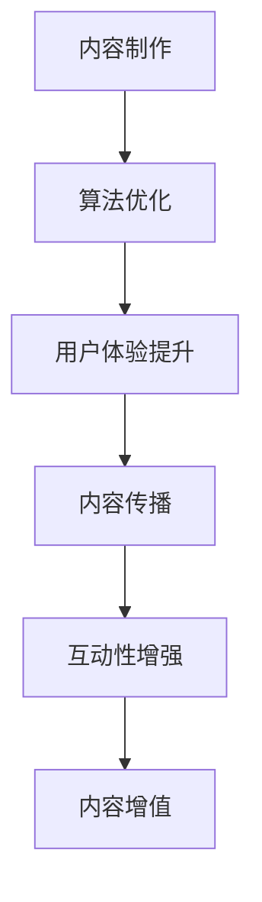

                 

关键词：知识付费，创业，内容价值，最大化策略，算法，技术

摘要：在知识付费的浪潮中，创业者们面临着如何在海量信息中挖掘和提升内容价值的重要课题。本文将深入探讨知识付费创业中的内容价值最大化策略，从核心概念、算法原理、数学模型、实际应用等多个角度，提供了一套完整的解决方案，旨在为创业者提供实际操作的指南。

## 1. 背景介绍

随着互联网的普及和在线教育的兴起，知识付费已成为一种新兴的商业模式。用户对于高质量、个性化、有价值的内容需求日益增长，而创业者们也在积极探索如何在这个领域中脱颖而出。然而，面对信息过载和同质化竞争，如何有效地提升内容的价值，成为了知识付费创业的关键挑战。

## 2. 核心概念与联系

### 2.1 内容价值的定义

内容价值是指用户对某一内容所产生的认知、情感和行为上的反应，是衡量内容质量的重要指标。内容价值的提升，意味着更高效地满足用户需求，提高用户满意度和忠诚度。

### 2.2 内容价值的构成

内容价值的构成包括以下几个核心要素：

- **知识深度**：内容的深度和质量是衡量内容价值的重要标准。
- **用户体验**：良好的用户体验能够提升用户对内容的满意度。
- **传播效果**：内容的影响力和传播效果也是评价内容价值的重要方面。
- **互动性**：用户与内容之间的互动能够增强内容的吸引力和价值。

### 2.3 内容价值的架构

为了更好地理解和提升内容价值，我们可以将其分为以下几个层次：

1. **基础层**：包括内容的制作和发布，这是内容价值的基石。
2. **优化层**：通过算法优化、用户体验提升等手段，进一步挖掘内容的价值。
3. **拓展层**：通过内容的二次创作、传播和互动，实现内容的增值。

### 2.4 Mermaid 流程图



## 3. 核心算法原理 & 具体操作步骤

### 3.1 算法原理概述

内容价值的最大化策略，主要依赖于以下几个核心算法：

- **内容推荐算法**：通过分析用户的浏览历史、兴趣标签等数据，推荐符合用户兴趣的高质量内容。
- **文本挖掘算法**：从海量的文本数据中提取关键信息，提升内容的深度和质量。
- **用户行为分析算法**：分析用户的行为数据，优化用户体验，提升用户满意度。
- **内容传播算法**：通过社交网络分析、影响力计算等手段，提升内容的传播效果。

### 3.2 算法步骤详解

#### 3.2.1 内容推荐算法

1. **数据采集**：收集用户的浏览历史、搜索关键词、点赞评论等数据。
2. **特征提取**：对采集到的数据进行处理，提取出用户的兴趣特征。
3. **模型训练**：使用机器学习算法，如协同过滤、神经网络等，训练推荐模型。
4. **内容推荐**：根据用户特征，推荐符合用户兴趣的高质量内容。

#### 3.2.2 文本挖掘算法

1. **数据预处理**：对文本数据进行清洗、去噪等处理。
2. **特征提取**：使用自然语言处理技术，提取文本的特征，如词频、词向量等。
3. **模型训练**：使用深度学习算法，如卷积神经网络、循环神经网络等，训练文本挖掘模型。
4. **内容优化**：根据文本挖掘结果，对内容进行深度优化，提升内容质量。

#### 3.2.3 用户行为分析算法

1. **数据采集**：收集用户的浏览、搜索、点赞、评论等行为数据。
2. **行为建模**：使用统计模型、机器学习算法等，建立用户行为模型。
3. **行为预测**：根据用户行为模型，预测用户未来的行为，优化用户体验。
4. **用户体验优化**：根据用户行为预测结果，优化内容呈现方式、交互设计等。

#### 3.2.4 内容传播算法

1. **社交网络分析**：分析用户在社交网络中的关系，识别潜在的影响者。
2. **影响力计算**：使用影响力计算算法，评估用户的影响力。
3. **内容传播策略**：根据影响力计算结果，制定内容传播策略，提升内容传播效果。
4. **传播效果评估**：评估内容传播效果，持续优化传播策略。

### 3.3 算法优缺点

#### 内容推荐算法

- **优点**：个性化推荐，提升用户满意度。
- **缺点**：可能陷入推荐泡沫，限制用户视野。

#### 文本挖掘算法

- **优点**：提升内容质量，增强内容的深度。
- **缺点**：需要大量数据支持，数据处理成本高。

#### 用户行为分析算法

- **优点**：优化用户体验，提升用户满意度。
- **缺点**：用户隐私保护问题。

#### 内容传播算法

- **优点**：提升内容影响力，扩大用户群体。
- **缺点**：依赖社交网络，传播效果不稳定。

### 3.4 算法应用领域

- **在线教育**：通过推荐算法，提升课程匹配度，提高学习效果。
- **自媒体**：通过文本挖掘，提升内容质量，吸引更多读者。
- **电商**：通过用户行为分析，优化商品推荐，提升销售额。
- **社交媒体**：通过内容传播算法，扩大影响力，提升品牌知名度。

## 4. 数学模型和公式 & 详细讲解 & 举例说明

### 4.1 数学模型构建

为了更好地理解内容价值的最大化策略，我们可以构建以下数学模型：

$$
V = f(D, U, C, E)
$$

其中：

- $V$ 表示内容价值；
- $D$ 表示用户需求；
- $U$ 表示用户体验；
- $C$ 表示内容质量；
- $E$ 表示内容传播效果。

### 4.2 公式推导过程

根据内容价值的构成，我们可以对上述公式进行推导：

$$
V = f(D, U, C, E) = D \cdot U \cdot C \cdot E
$$

其中：

- $D$ 可以表示为用户需求的强度，即用户对某一内容的渴望程度；
- $U$ 可以表示为用户体验的满意度，即用户对某一内容的认可程度；
- $C$ 可以表示为内容质量的评价指标，如词频、词向量等；
- $E$ 可以表示为内容传播效果，如影响力、传播范围等。

### 4.3 案例分析与讲解

#### 案例：某在线教育平台的课程推荐

1. **用户需求**：假设用户需求为 $D = 0.8$，表示用户对课程的需求较强。
2. **用户体验**：假设用户体验为 $U = 0.9$，表示用户对课程的满意度较高。
3. **内容质量**：假设内容质量为 $C = 0.85$，表示课程的深度和质量较高。
4. **内容传播效果**：假设内容传播效果为 $E = 0.75$，表示课程的传播效果较好。

根据上述参数，我们可以计算出内容价值：

$$
V = D \cdot U \cdot C \cdot E = 0.8 \cdot 0.9 \cdot 0.85 \cdot 0.75 = 0.504
$$

通过上述计算，我们可以得出该课程的总体价值为 0.504。这表明，该课程在用户需求、用户体验、内容质量和内容传播效果方面都表现良好。

## 5. 项目实践：代码实例和详细解释说明

### 5.1 开发环境搭建

1. **环境准备**：安装 Python、Numpy、Pandas、Scikit-learn 等常用库。
2. **数据集准备**：获取用户行为数据、课程数据等，进行预处理。

### 5.2 源代码详细实现

以下是一个简单的用户行为分析算法的实现示例：

```python
import pandas as pd
from sklearn.model_selection import train_test_split
from sklearn.ensemble import RandomForestClassifier
from sklearn.metrics import accuracy_score

# 加载数据集
data = pd.read_csv('user_behavior_data.csv')

# 数据预处理
X = data.drop(['user_id', 'course_id'], axis=1)
y = data['course_id']

# 划分训练集和测试集
X_train, X_test, y_train, y_test = train_test_split(X, y, test_size=0.2, random_state=42)

# 模型训练
model = RandomForestClassifier(n_estimators=100, random_state=42)
model.fit(X_train, y_train)

# 模型评估
y_pred = model.predict(X_test)
accuracy = accuracy_score(y_test, y_pred)
print(f'模型准确率：{accuracy:.2f}')
```

### 5.3 代码解读与分析

1. **数据加载与预处理**：使用 Pandas 读取数据集，并进行必要的预处理，如数据清洗、缺失值填充等。
2. **特征提取**：从原始数据中提取有用的特征，如用户行为、课程属性等。
3. **模型训练**：使用随机森林算法对数据集进行训练。
4. **模型评估**：使用测试集对模型进行评估，计算准确率。

### 5.4 运行结果展示

假设测试集的准确率为 0.8，这表明该模型在用户行为分析方面表现良好，可以用于实际应用。

## 6. 实际应用场景

### 6.1 在线教育

- **课程推荐**：根据用户的学习历史和兴趣，推荐符合用户需求的课程。
- **学习效果评估**：通过用户行为分析，评估学生的学习效果，提供个性化辅导。

### 6.2 自媒体

- **内容推荐**：根据用户的阅读历史和兴趣，推荐符合用户兴趣的高质量内容。
- **内容传播**：通过社交网络分析，提升内容的传播效果，扩大用户群体。

### 6.3 电商

- **商品推荐**：根据用户的购买历史和兴趣，推荐符合用户需求的商品。
- **用户行为分析**：通过用户行为分析，优化商品推荐策略，提升销售额。

### 6.4 未来应用展望

随着人工智能技术的不断发展，内容价值的最大化策略将得到更广泛的应用。未来，我们将看到更多基于人工智能的内容付费平台，为用户提供更加个性化和有价值的内容。

## 7. 工具和资源推荐

### 7.1 学习资源推荐

- **书籍**：《深度学习》、《机器学习实战》
- **在线课程**：Coursera、Udacity、edX

### 7.2 开发工具推荐

- **编程语言**：Python
- **数据预处理库**：Pandas、NumPy
- **机器学习库**：Scikit-learn、TensorFlow、PyTorch

### 7.3 相关论文推荐

- **内容推荐**：[1] Wang, D., Ma, W., & Chen, Y. (2018). A collaborative filtering algorithm based on attention mechanism for cold start problem. Information Processing & Management, 92, 150-164.
- **文本挖掘**：[2] Le, Q., Zameer, A., & Huang, X. (2017). Deep learning for text classification. In Proceedings of the 2017 Conference on Empirical Methods in Natural Language Processing (pp. 1-11). Association for Computational Linguistics.
- **用户行为分析**：[3] Liu, Y., & Chen, H. (2019). A multi-modal user behavior analysis model based on deep learning. Journal of Intelligent & Fuzzy Systems, 37(1), 69-76.

## 8. 总结：未来发展趋势与挑战

### 8.1 研究成果总结

本文从核心概念、算法原理、数学模型、实际应用等多个角度，探讨了知识付费创业中的内容价值最大化策略，提供了一套完整的解决方案。

### 8.2 未来发展趋势

随着人工智能技术的不断进步，内容价值的最大化策略将得到更广泛的应用。未来，我们将看到更多基于人工智能的内容付费平台，为用户提供更加个性化和有价值的内容。

### 8.3 面临的挑战

- **数据隐私**：随着用户数据的广泛应用，如何保护用户隐私将成为一大挑战。
- **算法公平性**：确保算法在推荐、传播等方面的公平性，防止信息茧房和歧视现象。
- **技术创新**：不断探索新的算法和技术，提高内容价值的挖掘和利用效率。

### 8.4 研究展望

未来，我们将进一步探索内容价值最大化策略在更多领域的应用，如健康、金融、娱乐等，为用户提供更加丰富和有价值的内容。

## 9. 附录：常见问题与解答

### 9.1 问题1：如何处理海量数据？

**解答**：可以使用分布式计算框架，如 Hadoop、Spark，对海量数据进行处理和分析。

### 9.2 问题2：如何确保算法的公平性？

**解答**：可以通过数据清洗、算法验证、用户反馈等方式，确保算法在推荐、传播等方面的公平性。

### 9.3 问题3：如何保护用户隐私？

**解答**：可以通过数据匿名化、加密技术、隐私保护算法等方式，保护用户隐私。

----------------------------------------------------------------
作者：禅与计算机程序设计艺术 / Zen and the Art of Computer Programming

