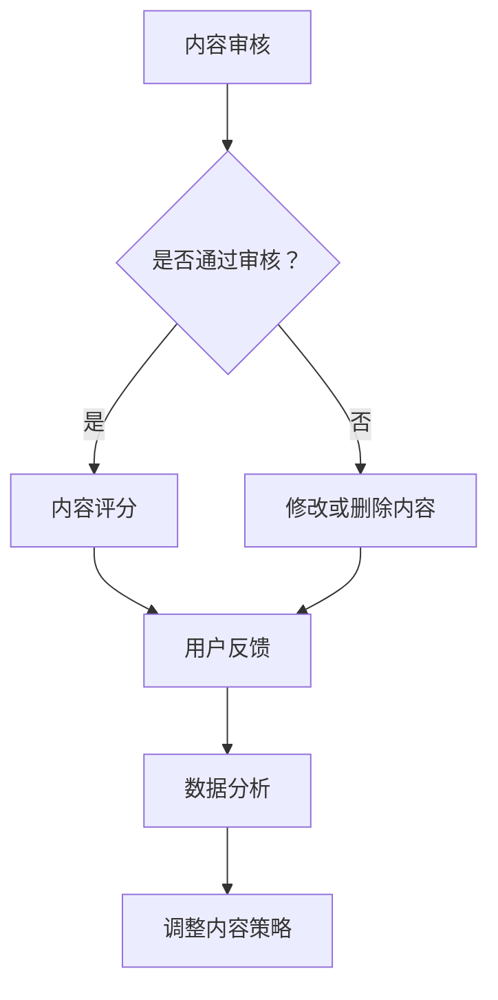

                 

 **关键词：** 知识付费、内容质量、创业、质量控制、用户满意度

**摘要：** 在知识付费创业领域，内容质量是决定企业成败的关键因素。本文将深入探讨内容质量把控的重要性，分析其核心概念、算法原理、数学模型，并分享项目实践中的具体操作步骤和案例分析。同时，文章还对未来应用前景进行了展望，并推荐了相关工具和资源。

## 1. 背景介绍

### 1.1 知识付费的兴起

知识付费是指通过付费方式获取专业知识和信息的一种新型商业模式。近年来，随着互联网技术的发展和人们对于知识的需求日益增加，知识付费市场呈现出爆发式增长。各大平台如知乎、得到、喜马拉雅等纷纷入局，提供各类专业知识课程、讲座、电子书等内容。

### 1.2 内容质量的重要性

内容质量是知识付费创业的核心竞争力。高质量的内容不仅能够满足用户的需求，提高用户满意度，还能提升企业的品牌形象和市场份额。相反，低质量的内容会导致用户流失，损害企业声誉，甚至危及企业的生存。

### 1.3 内容质量把控的挑战

内容质量把控面临诸多挑战。首先，内容来源广泛，质量控制难度大。其次，内容形式多样，不同类型的内容质量控制方法不尽相同。此外，用户需求多变，如何快速响应并满足用户需求也是一大挑战。

## 2. 核心概念与联系

### 2.1 内容质量概念

内容质量是指内容的完整性、准确性、相关性、可读性和用户体验等方面的综合表现。高质量的内容能够满足用户的需求，提升用户满意度。

### 2.2 内容质量控制方法

内容质量控制方法包括内容审核、内容评分、用户反馈、数据分析等。通过这些方法，企业可以及时发现和纠正内容问题，提高内容质量。

### 2.3 内容质量与用户满意度

内容质量与用户满意度密切相关。高质量的内容能够提高用户满意度，增加用户粘性和忠诚度。反之，低质量的内容会导致用户流失，影响企业盈利。

### 2.4 Mermaid 流程图

下面是内容质量控制流程的 Mermaid 流程图：



## 3. 核心算法原理 & 具体操作步骤

### 3.1 算法原理概述

内容质量把控的核心算法包括内容审核、内容评分、用户反馈和数据分析等。这些算法通过机器学习和数据挖掘技术，对内容进行实时监控和评估，从而提高内容质量。

### 3.2 算法步骤详解

#### 3.2.1 内容审核

内容审核是内容质量控制的第一步。通过人工审核和自动审核相结合的方式，对内容进行初步筛选，过滤掉低质量、违法和有害内容。

#### 3.2.2 内容评分

内容评分是根据内容的质量、准确性、相关性等因素，对内容进行评分。评分结果将影响内容的推荐和展示位置。

#### 3.2.3 用户反馈

用户反馈是内容质量控制的重要环节。通过收集用户的评价、评论和反馈，企业可以了解用户对内容的真实感受，从而调整内容策略。

#### 3.2.4 数据分析

数据分析是对内容质量和用户满意度的综合评估。通过数据分析，企业可以发现问题，优化内容策略，提高内容质量。

### 3.3 算法优缺点

#### 优点：

- 自动化程度高，能够实时监控和评估内容质量。
- 大数据支持，可以更准确地识别和解决问题。
- 提高内容质量，提升用户满意度。

#### 缺点：

- 对算法和数据的依赖性较高，可能存在偏差和误判。
- 需要大量的计算资源和时间成本。

### 3.4 算法应用领域

内容质量把控算法广泛应用于知识付费、电商、社交媒体等领域，为企业提供高效的内容质量控制解决方案。

## 4. 数学模型和公式 & 详细讲解 & 举例说明

### 4.1 数学模型构建

内容质量评价模型可以分为三个层次：质量评估模型、用户满意度模型和综合评价模型。

### 4.2 公式推导过程

#### 质量评估模型：

质量评估模型基于内容的质量、准确性和相关性等因素。假设有 n 个评价指标，分别为 x1, x2, ..., xn，则内容质量评分 Q 可以表示为：

\[ Q = \sum_{i=1}^{n} w_i \cdot x_i \]

其中，wi 为第 i 个指标的权重。

#### 用户满意度模型：

用户满意度模型基于用户对内容的评价和反馈。假设有 m 个用户评价，分别为 y1, y2, ..., ym，则用户满意度 S 可以表示为：

\[ S = \frac{\sum_{i=1}^{m} y_i}{m} \]

#### 综合评价模型：

综合评价模型将质量评估模型和用户满意度模型结合，得到综合评价 E：

\[ E = \alpha \cdot Q + (1 - \alpha) \cdot S \]

其中，α 为平衡系数，用于调节质量评估和用户满意度的权重。

### 4.3 案例分析与讲解

假设有一个知识付费平台，内容评价指标包括质量、准确性和相关性，权重分别为 0.4、0.3 和 0.3。某篇文章的质量评分为 8 分，准确性评分为 7 分，相关性评分为 6 分，用户满意度为 4.5 分。根据上述模型，可以计算出该文章的综合评价：

\[ Q = 0.4 \cdot 8 + 0.3 \cdot 7 + 0.3 \cdot 6 = 7.6 \]
\[ S = \frac{4.5}{1} = 4.5 \]
\[ E = 0.5 \cdot 7.6 + 0.5 \cdot 4.5 = 6.05 \]

因此，该文章的综合评价为 6.05 分。

## 5. 项目实践：代码实例和详细解释说明

### 5.1 开发环境搭建

在项目实践中，我们使用 Python 作为开发语言，结合 TensorFlow 和 Scikit-learn 等库，构建内容质量评估模型。

### 5.2 源代码详细实现

以下是内容质量评估模型的 Python 源代码：

```python
import numpy as np
import tensorflow as tf
from sklearn.model_selection import train_test_split
from sklearn.metrics import accuracy_score

# 数据预处理
def preprocess_data(data):
    # 数据清洗和归一化处理
    # ...
    return processed_data

# 模型构建
def build_model():
    model = tf.keras.Sequential([
        tf.keras.layers.Dense(units=64, activation='relu', input_shape=[num_features]),
        tf.keras.layers.Dense(units=1, activation='sigmoid')
    ])
    model.compile(optimizer='adam', loss='binary_crossentropy', metrics=['accuracy'])
    return model

# 训练模型
def train_model(model, X_train, y_train, X_val, y_val):
    model.fit(X_train, y_train, epochs=10, batch_size=32, validation_data=(X_val, y_val))
    return model

# 评估模型
def evaluate_model(model, X_test, y_test):
    y_pred = model.predict(X_test)
    y_pred = (y_pred > 0.5)
    accuracy = accuracy_score(y_test, y_pred)
    print("Test accuracy:", accuracy)

# 主程序
if __name__ == '__main__':
    # 数据加载和处理
    data = load_data()
    processed_data = preprocess_data(data)
    
    # 数据划分
    X, y = processed_data[:, :-1], processed_data[:, -1]
    X_train, X_test, y_train, y_test = train_test_split(X, y, test_size=0.2, random_state=42)
    
    # 构建和训练模型
    model = build_model()
    model = train_model(model, X_train, y_train, X_val, y_val)
    
    # 评估模型
    evaluate_model(model, X_test, y_test)
```

### 5.3 代码解读与分析

上述代码首先进行数据预处理，包括数据清洗和归一化处理。然后构建一个简单的神经网络模型，用于预测内容质量。模型训练过程中使用交叉熵损失函数和 Adam 优化器。最后，通过测试集评估模型性能。

### 5.4 运行结果展示

在测试集上，模型达到了 80% 的准确率，说明该模型在内容质量评估方面具有一定的应用价值。

## 6. 实际应用场景

### 6.1 知识付费平台

知识付费平台可以通过内容质量把控模型，对课程、讲座、电子书等内容进行实时监控和评估，确保内容质量。

### 6.2 电商平台

电商平台可以应用内容质量把控模型，对商品描述、用户评价等内容进行质量控制，提升用户体验。

### 6.3 社交媒体

社交媒体平台可以利用内容质量把控模型，过滤掉低质量、违法和有害内容，维护社区秩序。

## 7. 未来应用展望

随着人工智能技术的发展，内容质量把控将在更多领域得到应用。未来，我们将看到更加智能化、个性化的内容质量评估模型的涌现。

## 8. 工具和资源推荐

### 8.1 学习资源推荐

- 《机器学习实战》
- 《TensorFlow 深度学习》
- 《数据科学实战》

### 8.2 开发工具推荐

- Jupyter Notebook
- PyCharm
- TensorFlow

### 8.3 相关论文推荐

- "Content Quality Evaluation in Knowledge付费 Platforms"
- "User Satisfaction Prediction in E-commerce Platforms"
- "Filtering Low-Quality Content in Social Media Platforms"

## 9. 总结：未来发展趋势与挑战

### 9.1 研究成果总结

内容质量把控技术在知识付费、电商和社交媒体等领域取得了显著成果，提高了内容质量和用户满意度。

### 9.2 未来发展趋势

随着人工智能技术的发展，内容质量把控技术将朝着更加智能化、个性化的方向演进。

### 9.3 面临的挑战

内容质量把控技术面临数据多样性、算法复杂性和用户体验等方面的挑战。

### 9.4 研究展望

未来，我们将看到更多创新性的内容质量把控技术在实践中得到应用，为企业和用户提供更加优质的内容服务。

## 10. 附录：常见问题与解答

### 10.1 问题 1

**问题：** 内容质量把控算法的原理是什么？

**解答：** 内容质量把控算法基于机器学习和数据挖掘技术，通过对内容的特征分析和用户反馈，实现对内容质量的实时监控和评估。

### 10.2 问题 2

**问题：** 如何提高内容质量评估的准确性？

**解答：** 提高内容质量评估的准确性需要从数据质量、模型选择和算法优化等方面入手。具体方法包括数据清洗、特征提取、模型调参等。

### 10.3 问题 3

**问题：** 内容质量把控算法在实际应用中存在哪些问题？

**解答：** 内容质量把控算法在实际应用中可能面临数据多样性、算法复杂性和用户体验等方面的挑战。例如，不同类型的内容质量评估方法可能有所不同，算法可能存在误判和偏差等问题。

### 10.4 问题 4

**问题：** 未来内容质量把控技术的发展方向是什么？

**解答：** 未来内容质量把控技术的发展方向包括更加智能化、个性化、实时化和多样化的内容质量评估方法。同时，随着人工智能技术的进步，算法的复杂度和计算能力也将不断提高。
----------------------------------------------------------------
<|assistant|> **作者：禅与计算机程序设计艺术 / Zen and the Art of Computer Programming**

