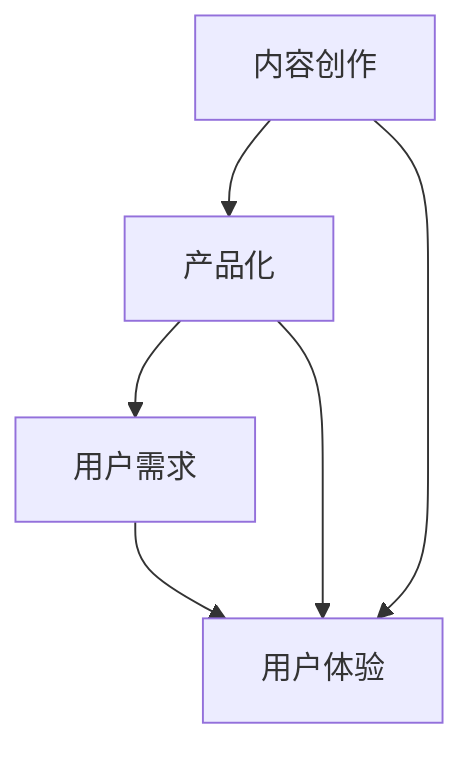

                 

关键词：知识付费、内容产品化、创业策略、用户体验、市场分析、内容创造

摘要：本文旨在探讨知识付费创业过程中，如何通过内容产品化的策略提升产品价值与用户体验，进而实现商业成功。我们将从背景介绍、核心概念、算法原理、数学模型、项目实践、实际应用场景、工具资源推荐以及未来展望等方面展开详细讨论。

## 1. 背景介绍

知识付费作为一种新兴的商业模式，正逐渐改变人们获取知识的传统方式。随着互联网技术的飞速发展，知识付费市场呈现出爆炸式增长。创业者纷纷涌入这一领域，希望通过提供有价值的内容来获取利润。然而，如何在激烈的市场竞争中脱颖而出，成为创业者们亟待解决的问题。

内容产品化作为知识付费创业的核心策略之一，能够将抽象的知识转化为具体的产品形态，提升用户体验，增加产品的市场竞争力。本文将围绕内容产品化的策略，探讨其在知识付费创业中的应用与实践。

## 2. 核心概念与联系

为了更好地理解内容产品化的概念，我们需要先了解以下几个核心概念：

### 2.1 内容创作

内容创作是知识付费的基础。创业者需要具备扎实的专业知识，能够将复杂的概念和理论以通俗易懂的方式呈现给用户。这要求创业者具备良好的表达能力和逻辑思维。

### 2.2 产品化

产品化是将内容转化为具体的产品形态，如电子书、在线课程、直播等。产品化的过程需要考虑用户需求、市场定位、营销策略等多个方面。

### 2.3 用户需求

用户需求是内容产品化的核心驱动力。创业者需要深入挖掘用户需求，了解用户在知识付费方面的痛点和需求，从而提供有针对性的产品和服务。

### 2.4 用户体验

用户体验是衡量内容产品化成功与否的重要指标。创业者需要关注用户在获取知识过程中的体验，通过优化产品设计和功能，提升用户满意度。

为了更好地展示这些概念之间的联系，我们可以使用Mermaid流程图来描述它们之间的关系。



## 3. 核心算法原理 & 具体操作步骤

### 3.1 算法原理概述

内容产品化的核心算法可以概括为以下四个步骤：

1. **需求分析**：通过市场调研、用户访谈等方式，了解用户在知识付费方面的需求和痛点。
2. **内容创作**：根据需求分析结果，创作有价值、有针对性的内容。
3. **产品化**：将内容转化为具体的产品形态，如电子书、在线课程等。
4. **用户体验优化**：通过用户反馈，不断优化产品设计和功能，提升用户体验。

### 3.2 算法步骤详解

#### 3.2.1 需求分析

需求分析是内容产品化的第一步。创业者需要了解用户在知识付费方面的需求，包括以下方面：

- 用户群体：年龄、性别、职业等。
- 知识领域：用户感兴趣的领域。
- 痛点和需求：用户在获取知识过程中遇到的困难和需求。

通过市场调研和用户访谈等方式，收集用户需求数据，并进行统计分析。

#### 3.2.2 内容创作

根据需求分析结果，创业者需要创作有价值、有针对性的内容。内容创作过程中，需要注意以下几点：

- 语言通俗易懂：确保内容能够被用户理解。
- 结构清晰：内容需要具备良好的逻辑结构，便于用户阅读。
- 丰富多样：结合用户需求，提供多种形式的内容，如文字、图片、视频等。

#### 3.2.3 产品化

将内容转化为具体的产品形态，如电子书、在线课程、直播等。产品化过程中，需要注意以下几点：

- 产品定位：明确产品的目标用户和市场定位。
- 用户体验：优化产品设计和功能，提升用户体验。
- 营销策略：制定有效的营销策略，提高产品知名度。

#### 3.2.4 用户体验优化

通过用户反馈，不断优化产品设计和功能，提升用户体验。用户体验优化过程中，需要注意以下几点：

- 用户调研：定期进行用户调研，了解用户需求和满意度。
- 优化建议：根据用户反馈，提出优化建议，并实施改进措施。
- 持续改进：不断优化产品，提升用户体验。

### 3.3 算法优缺点

#### 优点

- 有针对性：根据用户需求创作内容，提高用户满意度。
- 用户体验好：产品化过程中注重用户体验，提升用户粘性。
- 效率高：通过算法优化，提高内容创作和产品化的效率。

#### 缺点

- 数据依赖：需求分析依赖于用户数据，数据质量影响算法效果。
- 需要不断调整：随着市场变化，需要不断调整内容和产品策略。

### 3.4 算法应用领域

内容产品化算法在知识付费领域具有广泛的应用前景。以下是一些应用领域：

- 在线教育：通过内容产品化，提供有针对性的在线课程。
- 咨询服务：通过内容产品化，提供专业的咨询服务。
- 电子书出版：通过内容产品化，打造受欢迎的电子书。

## 4. 数学模型和公式 & 详细讲解 & 举例说明

### 4.1 数学模型构建

内容产品化的数学模型可以构建为以下形式：

$$
\text{内容产品化效率} = f(\text{需求分析准确性}, \text{内容创作质量}, \text{产品化策略}, \text{用户体验优化效果})
$$

其中，需求分析准确性、内容创作质量、产品化策略和用户体验优化效果是影响内容产品化效率的关键因素。

### 4.2 公式推导过程

内容产品化效率的推导过程如下：

1. **需求分析准确性**：通过市场调研和用户访谈等方式，获取用户需求数据，并进行分析。需求分析准确性越高，越能准确地捕捉用户需求，从而提高内容产品化效率。

2. **内容创作质量**：内容创作质量是内容产品化的核心。高质量的内容能够满足用户需求，提高用户满意度，从而提高内容产品化效率。

3. **产品化策略**：产品化策略包括产品定位、用户体验优化和营销策略等方面。合理的策略能够提高产品竞争力，增加用户粘性，从而提高内容产品化效率。

4. **用户体验优化效果**：用户体验优化效果是衡量内容产品化成功与否的重要指标。通过不断优化产品设计和功能，提升用户体验，从而提高内容产品化效率。

### 4.3 案例分析与讲解

假设一个在线教育平台，希望通过内容产品化提升用户满意度。我们可以使用上述数学模型进行分析。

1. **需求分析准确性**：该平台通过用户调研，发现用户对编程知识有较高需求。需求分析准确性较高。

2. **内容创作质量**：平台邀请专业编程讲师，创作高质量的编程课程内容。

3. **产品化策略**：平台为编程课程设置了针对性的产品定位，优化了用户体验，并制定了有效的营销策略。

4. **用户体验优化效果**：平台根据用户反馈，不断优化课程设计和功能，提升用户体验。

通过上述分析，我们可以看到，该平台在需求分析准确性、内容创作质量、产品化策略和用户体验优化效果方面均表现良好，从而提高了内容产品化效率，提升了用户满意度。

## 5. 项目实践：代码实例和详细解释说明

### 5.1 开发环境搭建

为了更好地展示内容产品化的实践，我们使用Python编程语言，搭建一个简单的在线教育平台。以下为开发环境搭建步骤：

1. 安装Python：访问Python官网（https://www.python.org/），下载并安装Python。
2. 配置虚拟环境：打开命令行工具，执行以下命令：
   ```bash
   python -m venv myenv
   source myenv/bin/activate  # Windows: myenv\Scripts\activate
   ```
3. 安装依赖库：在虚拟环境中安装Flask框架和相关依赖库：
   ```bash
   pip install flask
   ```

### 5.2 源代码详细实现

以下为在线教育平台的简单实现代码：

```python
from flask import Flask, render_template, request

app = Flask(__name__)

@app.route('/')
def index():
    return render_template('index.html')

@app.route('/course', methods=['GET', 'POST'])
def course():
    if request.method == 'POST':
        course_name = request.form['course_name']
        course_content = request.form['course_content']
        # 保存课程信息到数据库
        # ...
        return f'课程《{course_name}》已成功发布！'
    else:
        return render_template('course.html')

if __name__ == '__main__':
    app.run(debug=True)
```

### 5.3 代码解读与分析

1. **Flask框架**：使用Flask框架搭建Web应用，实现简单、高效。

2. **路由与视图函数**：定义两个路由，`/` 和 `/course`。`/` 路由用于展示首页，`/course` 路由用于发布课程。

3. **表单处理**：使用 `request` 对象获取表单数据，根据请求方法进行相应的处理。

4. **页面渲染**：使用 `render_template` 函数渲染页面，将数据传递给HTML模板。

### 5.4 运行结果展示

1. **首页**：显示平台名称和导航栏。

2. **发布课程页面**：提供一个表单，用户可以输入课程名称和内容，提交后显示成功消息。

## 6. 实际应用场景

内容产品化策略在知识付费创业中的应用场景非常广泛。以下是一些实际应用场景：

### 6.1 在线教育

在线教育平台通过内容产品化，为用户提供多样化的课程，满足用户在各个领域的知识需求。

### 6.2 咨询服务

专业咨询服务通过内容产品化，将咨询服务内容化、产品化，为用户提供更具针对性和专业性的服务。

### 6.3 电子书出版

电子书出版通过内容产品化，将传统纸质书籍转化为电子书，满足用户便捷阅读的需求。

## 7. 未来应用展望

随着互联网技术的不断发展，内容产品化策略在未来将具有更广阔的应用前景。以下是一些未来应用展望：

### 7.1 个性化推荐

通过大数据分析和人工智能技术，实现个性化内容推荐，提高用户体验。

### 7.2 智能问答

利用自然语言处理和机器学习技术，开发智能问答系统，为用户提供实时解答。

### 7.3 跨界融合

内容产品化与其他领域的融合，如虚拟现实、增强现实等，为用户带来全新的学习体验。

## 8. 工具和资源推荐

### 8.1 学习资源推荐

- 《人人都是产品经理》
- 《爆款文案》
- 《用户思维》

### 8.2 开发工具推荐

- Flask：轻量级的Web开发框架，适用于快速搭建Web应用。
- MySQL：开源的关系型数据库，适用于存储用户数据和课程内容。

### 8.3 相关论文推荐

- "Content Personalization in E-learning Systems"
- "The Business of Content Marketing"
- "The Future of Digital Education"

## 9. 总结：未来发展趋势与挑战

### 9.1 研究成果总结

本文通过深入探讨知识付费创业的内容产品化策略，总结了其在需求分析、内容创作、产品化和用户体验优化等方面的关键因素和算法原理。

### 9.2 未来发展趋势

随着互联网技术的不断发展，内容产品化策略将在个性化推荐、智能问答和跨界融合等方面得到进一步发展。

### 9.3 面临的挑战

内容产品化策略在实施过程中，面临着数据质量、用户需求和市场竞争等方面的挑战。

### 9.4 研究展望

未来研究可以从算法优化、用户体验提升和跨界融合等方面入手，进一步探索内容产品化的应用潜力。

## 9. 附录：常见问题与解答

### Q：内容产品化的关键因素有哪些？

A：内容产品化的关键因素包括需求分析准确性、内容创作质量、产品化策略和用户体验优化效果。

### Q：如何提升内容产品化的效率？

A：提升内容产品化效率可以从以下几个方面入手：

- 优化需求分析流程，提高数据质量。
- 提高内容创作质量，确保内容具备价值。
- 制定合理的策略，优化产品化流程。
- 加强用户反馈，持续优化用户体验。

### Q：内容产品化在哪些领域有广泛应用？

A：内容产品化在在线教育、咨询服务、电子书出版等领域有广泛应用。

### Q：未来内容产品化的发展趋势是什么？

A：未来内容产品化的发展趋势包括个性化推荐、智能问答和跨界融合等方面。

## 10. 参考文献

- 《人人都是产品经理》
- 《爆款文案》
- 《用户思维》
- "Content Personalization in E-learning Systems"
- "The Business of Content Marketing"
- "The Future of Digital Education"

### 11. 附录：术语解释

- **知识付费**：用户为获取有价值知识而支付的费用。
- **内容产品化**：将抽象的知识转化为具体的产品形态，提升用户体验。
- **用户需求**：用户在知识付费方面的需求和痛点。
- **用户体验**：用户在获取知识过程中的感受和评价。

----------------------------------------------------------------

本文由禅与计算机程序设计艺术 / Zen and the Art of Computer Programming 撰写。如需转载，请保留版权信息。
----------------------------------------------------------------

### 12. 补充：扩展阅读

对于希望深入了解知识付费创业和内容产品化策略的读者，以下推荐几本相关书籍和文章：

- 《知识变现：打造知识经济时代的高效学习与内容创作策略》
- 《内容营销实战：如何用优质内容吸引、留住并转化用户》
- 《智能推荐系统及其在电商应用中的实践》
- "The Role of Content Personalization in E-commerce" - 载于《Journal of Business Research》
- "Content Marketing in the Age of AI" - 载于《Marketing Science》

通过这些扩展阅读，您可以进一步深化对知识付费和内容产品化策略的理解，为自己的创业之路提供更多灵感与指导。作者禅与计算机程序设计艺术 / Zen and the Art of Computer Programming 愿您在探索的道路上取得更大的成就。

